# 不可见组件低功耗建议

更新时间：2026-03-12 08:45:02

来源：https://developer.huawei.com/consumer/cn/doc/best-practices/low-power-consumption-suggestions

## 概述


> [!NOTE]
> 一个组件需要在屏幕上显示，至少需要满足以下**上屏四要素**：
>  上树：成功挂载在ArkUI树上屏内：组件位置位于屏幕范围内未被遮挡：组件本身没有被兄弟节点遮挡，且父组件没有被其他父组件遮挡visible：开发者并未主动设置visibility为Hidden


在开发层级复杂、组件结构较深的应用页面时，组件的显示与隐藏往往受到多种因素的影响，在HarmonyOS中已对一些常见的不可见组件刷新问题进行兜底，例如组件在应用切后台（onBackground()）、组件析构（aboutToDisappear()）等生命周期事件中，会终止组件的各种行为来保证功耗。但在另一些情况下，当组件已经实际不在屏幕上显示后，组件仍可能继续产生绘制任务，并引发不同程度的刷新问题和冗余绘制问题，以下是一些依赖三方参与适配的场景：

- 开发者使用ImageAnimator、Canvas、XComponent、Video等组件，由于这些组件的绘制效果通常由开发者所配置的控制器来控制，当系统感知到该组件并非可见时，三方实现的自定义控制器以及与该组件相关自定义绘制进程任务无法被系统兜底停止。
- 一个正常的动效组件不可见后，但仍挂载在组件树上，组件并未被析构。例如一个长列表滚动场景，当一个动效组件短暂被划出屏幕外时，该组件仍有在下一个时机重新绘制刷新的可能，需要继承被划出前的构建状态与播放进度。此情况下，系统不会抑制组件的刷新行为。
- 组件本身位于屏幕范围内，但由于页面特殊结构，被另一级页面或组件完全遮蔽了，考虑到用户实际的操作需求，以及上层组件可能存在透明度、模糊效果等因素，系统不会终止被遮挡组件的行为，依赖三方开发者感知这种遮蔽事件，来控制被遮挡组件停止刷新。
- 动效组件如Video、Web等组件，在已经卸载ArkUI树后，依然在执行解码、web render等业务导致Buffer持续空转。一方面开发者需确保组件在离线状态下构建时，渲染控制器为不播放，另一方面需要开发者确保当组件卸载时，停止正在执行的渲染控制器。


为了帮助开发者定位到存在空跑问题的组件，在当前系统中已经开放了不可见动效的自检工具。本文将着重介绍Vsync冗余信号、UI刷新问题以及Buffer自绘制三类问题中的UI刷新问题。开发者可进一步通过布局分析（ArkUI Inspector）较为直观且方便的查看ArkUI组件树结构以及关键的变量信息，勾选打开第四项，Show Hidden Components，可以使得开发者找到更多隐藏但未被析构的组件。


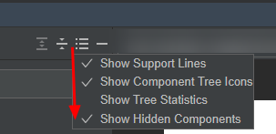


以下是一些常见的引起空跑的情况。


| 问题大类 | 可能空跑的情况 |
| --- | --- |
| 组件可见属性 | 位置：动画位于屏幕外。visibility：动画进入Hidden。zIndex：动画被Z轴遮挡。 |
| 页面结构 | 页面跳转：Tab、Navigation跳转但原页面组件并未停止活动。Refresh：自定义Refresh动效。弹窗：Dialog动效。 |
| 离线节点 | If/Else：条件渲染。节点离线Build：懒加载、预加载。 |


## 组件可见属性


### 概述


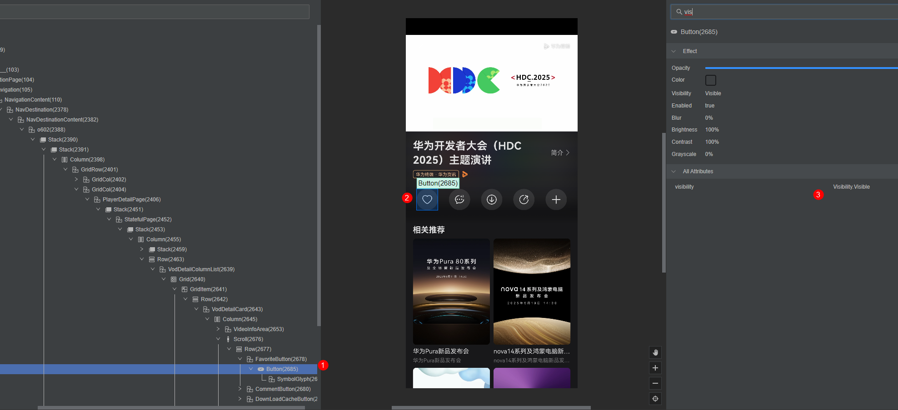


对于一个动效组件而言，会影响组件可见与否的属性有以下几种：

1. 组件位置：组件是否位于屏幕范围内，如上图中，标志“2”表明，该“1”对应的Button组件当前处于屏幕内的位置
2. [visibility](https://developer.huawei.com/consumer/cn/doc/harmonyos-references/ts-universal-attributes-visibility#visibility)属性：组件是否有主动控制隐藏状态，在ArkUI Inspector的Attributes栏输入“vis”，查看发现该组件visibility属性为Visible
3. [zIndex](https://developer.huawei.com/consumer/cn/doc/harmonyos-references/ts-universal-attributes-z-order#zindex)：同一容器中兄弟组件显示层级关系。zIndex值越大，显示层级越高。在ArkUI Inspector的Attributes中搜索zIndex查看


### 组件不可见案例


组件位置：如下图，“1”处所示的Button组件是视频竖向播放时的点赞组件进入Hidden状态的组件，当用户点击视频全屏时，页面会切换为横屏，原本处于屏幕内的点赞组件变成屏幕外。由于此时该组件依然位于该页面的前台，开发者可能仍有业务需要运行，且组件依然可能在下一个时机重新显示，故而系统并不会因此阻止该组件正在进行的行为。


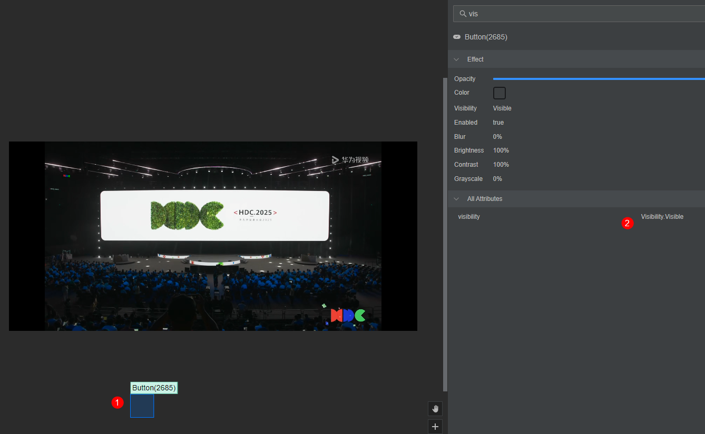


visibility：当组件或其所属的根页面的visibility属性设置为Hidden时，该组件实际上被视为不可见。如图所示，“1”处标注的组件位于应用的首页（非当前页面），此时ArkUI会提示该组件不在屏幕显示范围内。进入Hidden状态后，大多数系统组件会因系统限制而停止刷新，但对于具有独立动画控制器的动效组件，仍需第三方主动控制。


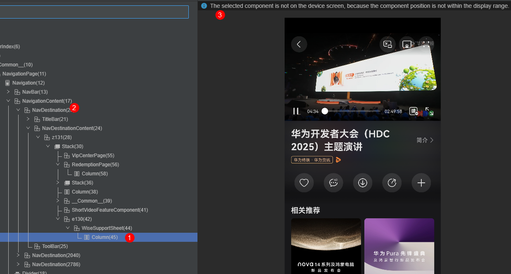


进一步查看该组件对应的NavDestination，可以发现该页面的visibility属性已被置为Hidden，这是由于Navigation跳转后，会将非栈首的页面视作不可见，后续该页面下所有的组件，在遍历可见性时，均可以感知到其根页面已进入Hidden状态。


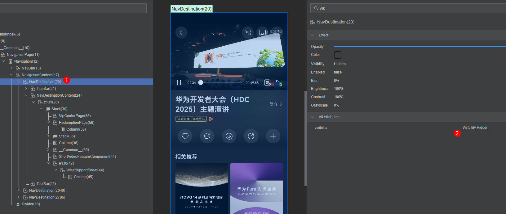


### 开发参考


- 接入可见性回调让动效组件能[感知可见性](https://developer.huawei.com/consumer/cn/doc/harmonyos-references/ts-universal-component-visible-area-change-event)，此方法适用于绝大多数页面跳转、页面内滑动浏览的可见性检测。开发者可将动效组件的控制器、播放状态等变量与可见性回调绑定，当检测到组件的可见性达到阈值，控制组件在完全可见时播放，完全不可见时停止。该回调所返回的可见面积值currentRatio，可以视作当前组件显示在屏幕范围内的面积占比，当组件的位置、visibility等属性变化时均可通过该接口感知到，开发示例如下：
```ts
@Component
struct MyImageAnimator {
  @State running: boolean = false;
  @State animState: AnimationStatus = AnimationStatus.Initial;

  build() {
    ImageAnimator()
    .images([
    {
      src: $r('app.media.background')
    },
    {
      src: $r('app.media.foreground')
    }
    ])
    .width('60%')
    .height('60%')
    .fillMode(FillMode.None)
    .iterations(-1)
    .duration(1000)
    .state(this.running ? AnimationStatus.Running : AnimationStatus.Paused)
    .onVisibleAreaChange([0.0, 1.0], (isExpanding: boolean, currentRatio: number) => {
      if (isExpanding && currentRatio >= 1.0) {
        hilog.info(0x0000, 'Sample', `Component is fully visible. currentRatio: ${currentRatio}`);
        this.running = true;
      }
      if (!isExpanding && currentRatio <= 0.0) {
        hilog.info(0x0000, 'Sample', `Component is fully invisible. currentRatio: ${currentRatio}`);
        this.running = false;
      }
    });
  }
}
```


> [!NOTE]
> 可见性回调onVisibleAreaChange()用途广泛，在上屏四要素中，可以完全响应组件在划入、划出屏幕的事件、组件所在的Navigation、Tab切换页面和组件卸载时响应事件。由于该接口需要逐帧计算组件与其父组件的交叠面积，故而在动效组件较多、组件层级较深的场景下推荐接入onVisibleAreaApproximateChange()降低计算频次。通常而言，在简单的列表结构中给列表项注册该接口，100个接口的可见性计算耗时不超过500μs。当开发者发现trace中的“H:HandleVisibleAreaChangeEvent”耗时过长时，参考以下思路优化可见性计算带来的负载：
>  绑定父组件减小注册量：可将接口注册在父组件上，父组件内的多个动效组件统一响应父组件的回调结果。检查组件封装结构是否过深，尽可能减少空容器的使用，并考虑使用Builder等方式精简组件结构。使用onVisibleAreaApproximateChange()：相比于onVisibleAreaChange()每帧进行可见性计算，该接口支持设置expectedUpdateInterval，按照指定的时间间隔触发回调，优化可见性计算次数。


- visibility属性主要由ArkUI在页面跳转时统一控制，以及部分场景下开发者需要主动进行控制。进入Hidden状态的组件既没有脱离ArkUI树，也不会被析构，仅在展示时会被跳过，所以Hidden状态的组件仍然可以执行各类动画以及响应组件刷新事件。倘若开发者主动进行了visibility设置，需保证组件Hidden后无持续性动画行为。开发者可通过变量传递的方式进行控制，确保Hidden与播放状态暂停同时出现，规避空跑问题，参考如下：
```ts
@Component
struct VisibilityExample {
  // State to control animation visibility
  @State isHidden: boolean = false

  build() {
    Column() {
      // Image animation component with visibility control
      ImageAnimator()
      .images([
      { src: $r('app.media.background') },
      { src: $r('app.media.foreground') }
      ])
      .width('100%')
      .height('30%')
      .duration(600)
      .visibility(this.isHidden ? Visibility.Hidden : Visibility.Visible)
      .state(this.isHidden ? AnimationStatus.Paused : AnimationStatus.Running)
      .iterations(-1) // Infinite loop

      // Toggle button for visibility
      Button(this.isHidden ? 'Show' : 'Hide')
      .width('90%')
      .onClick(() => {
        this.isHidden = !this.isHidden
      })
    }
  }
}
```


- zIndex主要由三方开发者控制，实际应用场景较少。即便接入了可见性回调，在计算可见性时组件也不会感知到自身被Z轴遮挡。被Z轴遮挡的组件，仍然可能有部分内容显示在屏幕上，或需要在被遮蔽时执行自身行为，故而系统并不会抑制Z轴遮挡组件的刷新行为。开发者如果使用了Z序控制，需留意该遮蔽事件是否会持续较长时间，被遮蔽的组件是否会有持续性的动效行为产生，根据实际需求来控制组件行为，规避空跑问题。


## 页面结构


### 概述


ArkUI Inspector不仅可以帮助开发者分析组件的详细信息， 也可以了解页面的结构与生命周期。对于Navigation、Tab等常用的页面跳转结构，为组件接入不可见回调可基本规避空跑问题，但可见性回调的方法并不适用于Refresh、Dialog，开发者如果使用了自定义的动图、动效，则可以根据结构特性，自行控制。下面会结合ArkUI Inspector的实际页面，介绍每种情况的特点和可能造成问题的根因。


### Navigation


Navigation是当前HarmonyOS中常见的跳转页面方式，用户每进入新页面时，都会将页面以NavDestination页面结构形式入栈，从页面返回时最先销毁退出栈顶页面。开发者可在组件结构的NavigationContent下查找并列的NavDestination子页面查看栈关系。如下图，“1”处NavBarContent对应首页，“2”处为首页点击推荐后进入的二级页面，“3”处为当前界面。Navigation在进入新页面时，上一级页面不会析构，但visibility将进入Hidden状态，页面内组件可通过不可见回调感知到不可见行为。由于用户可能通过返回到上一级页面继续执行逻辑，系统允许上一级页面逻辑继续执行。但开发者需通过可见性感知，停止动效组件的刷新行为。


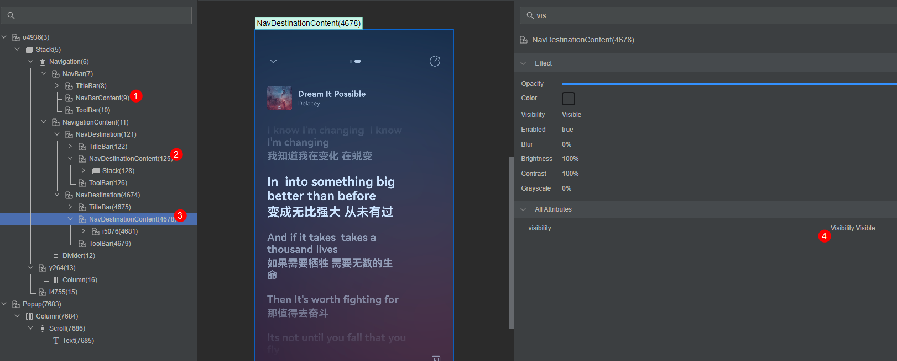


### Tabs


与Navigation的栈结构不同，Tabs是一种平铺的列表结构，由一个Swiper串联起各个平级的TabContent。默认情况下，Tabs只会Build第一个TabContent实例，如下图所示，“1”处的TabContent下方组件已成功Build，但另外3个TabContent此时处于空壳状态，下方并无ArkUI组件实例挂载。


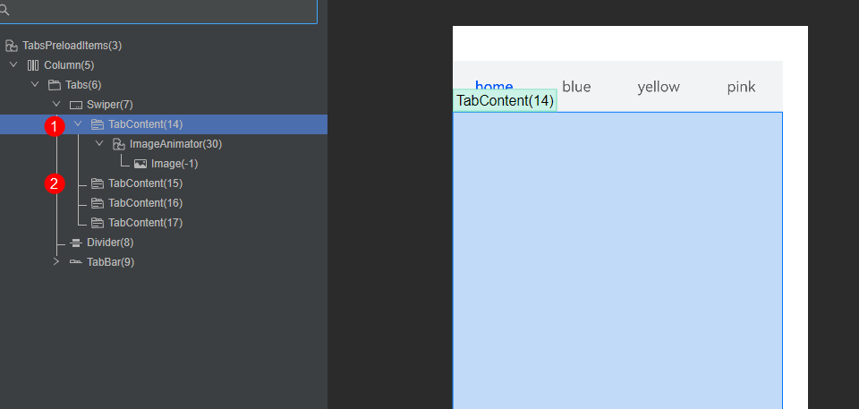


逐个点击Tab，切换页面至“yellow”，可以发现此时前面两个TabContent页面的组件实例已创建，上一个TabContent的组件会因Tab的默认滑动动效而在挂载在屏幕侧面。值得注意的是，Tab默认开启的切换动效会构建路径中的所有TabContent，例如在从第一个Tab点击最后一个Tab时，中间的两个TabContent也会完成构建的操作。除此之外，Tab可通过preloadItems预加载指定TabContent，开发者需留意在build预加载的TabContent时，需要确保预加载页面的动效、动画等组件初始状态为不播放。


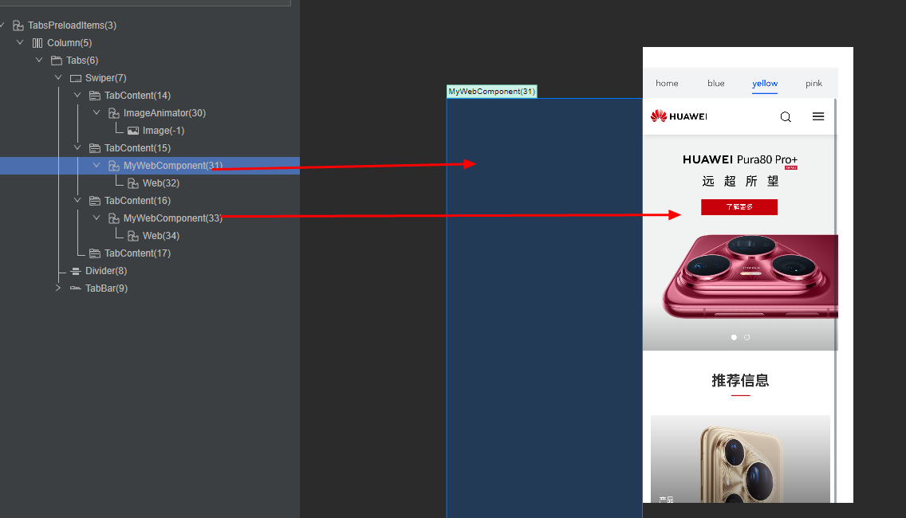


### Refresh


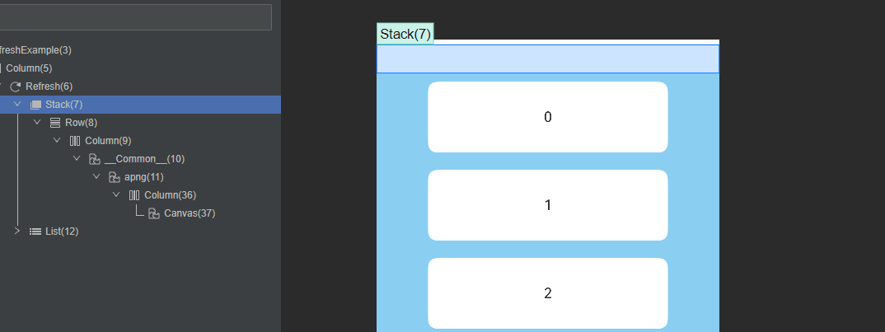


Refresh是一种较为特殊的页面结构，许多开发者会通过自定义Refresh Builder来实现自定义的刷新显示效果，通常而言，被创建好的动效组件大小可能会大于其父组件所在范围。如上图所示，通过Builder创建的apng动图，外侧的容器与动图本体Canvas不相交，Canvas实例被下层列表组件遮挡，仅在下拉列表后才会显现。在此情况下，用不可见回调等可见性方法将难以准确判断，推荐开发者使用Refresh自身的状态监听回调onStateChange，当监听到Refresh的下拉状态RefreshStatus为1、2、3时，表明Refresh处于下拉中或回弹中的状态，可以让动画播放，其余时间动画均需控制停止。下面给出了一个常见的控制写法，确保自定义的动画控制器状态与RefreshStatus绑定，且初始状态为不播放。

```ts
.onStateChange((refreshStatus: RefreshStatus) => {
  // status = 0 ： 默认未下拉
  // status = 1、2：下拉中
  // status = 3：下拉完成，回弹中
  // status = 4：刷新结束，返回初始状态
  if (refreshStatus >= 1 && refreshStatus < 4) {
    this.controller.play();
  } else {
    this.controller.stop();
  }
  hilog.info(0x0000, 'testTag', 'Refresh onStatueChange state is ' + refreshStatus);
})
```


### Dialog


在HarmonyOS中，弹窗有多种实现方式，例如ArkUI提供的弹出框（Dialog）可以通过Builder的方式启动一个新的页面覆盖在原页面上。此时两个页面形成兄弟节点关系，弹出窗口的组件如果遮挡了原页面的组件时，原页面组件无法通过可见性回调感知到这种遮挡变化。如果开发者使用了较长时间、较大面积的Dialog页面，可以考虑在触发Dialog时，将被遮挡的动画组件暂停。如果在Dialog内含有动画，需在Builder内确保动画组件的创建、销毁生命周期完整，不会出现组件泄漏的情况。


## 离线节点


### 概述


当ArkUI组件处于离线节点状态时，仍可继续执行部分组件行为，但涉及组件刷新、Animation等行为将被终止。然而，诸如解码、自绘制渲染等行为无法由系统中断。此外，组件离线后，其可见性将无法定义。因此，如果开发者完全依赖不可见回调来控制动画，需考虑在离线节点情况下将动画的初始状态设置为不播放。以下是一些常见的离线节点应用场景：


1. [if/else条件渲染](https://developer.huawei.com/consumer/cn/doc/harmonyos-guides/arkts-rendering-control-ifelse)：开发者可控制组件卸载、挂载ArkUI树，由开发者主动控制
2. 预加载、懒加载：开发者可以使用预加载、懒加载特性提前加载组件，优化浏览时的时延表现，但需要对提前加载的组件进行状态管控


### if/else


位于if、else分支下的组件在每次挂载时都会重新执行Build指令，并在卸载时完成析构，此时组件在ArkUI上不会产生由脏区刷新导致的渲染。但如果开发者此前注册了需要在该组件上显示的隐式动效、解码、自渲染等任务，建议开发者在组件析构时的aboutToDisappear()回调中，对任务控制器置空以规避空跑以及内存泄漏问题。


### 懒加载


懒加载广泛用于List、Waterflow、Grid等列表结构，通过懒加载挂载显示的组件们无需一次性全量构建，而是在一定可视范围内动态按需构建组件，搭配组件复用优化方法，浏览时延表现会更好，功耗也收益显著。但开发者需谨慎处理离线动效组件的动画状态控制，预防通过懒加载生成的离线组件产生额外负载。如下图，在一个使用了LazyForEach实现懒加载的列表结构中，当CacheCount不为0时，意味着除了当前的ListItem外，还会额外离线创建一些ListItem用于加载。这些离线加载的列表项不会显示在ArkUI Inspector中，但会在需要显示时挂载上树。


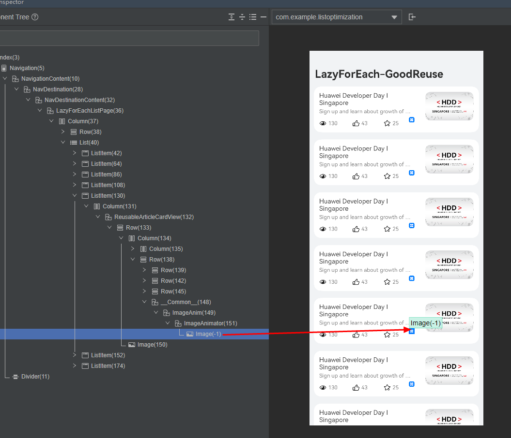


在上图所示的页面中，设置LazyForEach的CacheCount为10，此时一共有7个列表项位于屏幕内，分别对每个列表项的aboutToAppear()、onDidBuild()以及onVisibleAreaChange()进行监听并输出log，结果如下图：

- “1”处信息表明：页面加载时，率先对屏幕上的7个列表项进行aboutToAppear()和onDidBuild()
- “2”处信息表明：列表项Build完成后，将对7个ListItem注册onVisibleAreaChange()回调，返回结果为组件可见于屏幕
- “3”处信息表明：位于CacheCount的10个离线ListItem完成aboutToAppear()和onDidBuild()，但因为此时节点并未挂载在ArkUI树上，不会产生可见性的回调


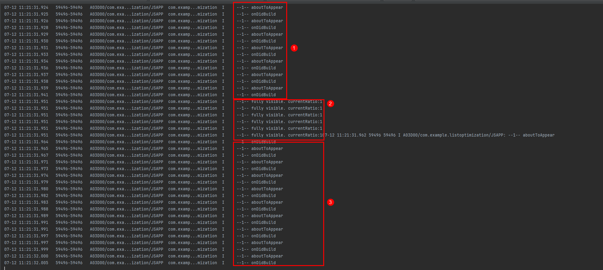


这一结果可以表明，离线组件在完成build时，组件由于没有任何相关的父子关系作参考，onVisibleAreaChange()回调函数不会返回结果，开发者在控制离线组件的动效启停需通过其他方式来进行。建议开发者将懒加载组件中的动画初始状态设置为不播放，当组件挂载上树并进入可见状态时，通过可见性回调让其正常播放。


### 预加载


资源提前加载对性能收益显著，但开发者同样需要确保预加载内容不造成功耗问题。多数情况下，开发者同样可以给组件添加可见性回调管控动效和渲染业务。对于Web、地图等首帧渲染时延要求较高的场景，开发者可以监听组件完成首帧渲染的时机，在组件完成首帧渲染后立刻停止渲染，确保不产生功耗问题。如果仍有自渲染业务空跑，开发者可参考Buffer低功耗优化进行定位和优化。


## 总结


> [!NOTE]
> 对于所有类型的渲染绘制类组件，开发者都可以遵循“**初始静，可见动**”原则，即在接入组件可见性的基础上，将初始状态设置为不播放。当组件挂载上树，并感知到了可见事件时启动播放，可预防绝大多数的空跑问题。除此之外，鼓励开发者在前期开发时对一些会产生持续负载的组件的生命周期事件内打log，充分验证组件响应正常，且不会产生无法停止的冗余业务。


从优化手段来看，开发者在开发动效场景时，需注意以下两点：

1. 优先考虑接入可见性回调接口，此方法可以覆盖绝大多数组件的动画控制问题。除此之外，系统当前已对Image、Text、Swiper、LoadingProgress、SymbolGlyph、Marquee、Progress、Web等组件实现了原生的可见性回调接口兜底，无需开发者重复设置。


开发者所常用的ImageAnimator组件也可通过[monitorInvisibleArea](https://developer.huawei.com/consumer/cn/doc/harmonyos-references/ts-basic-components-imageanimator#monitorinvisiblearea17)快速开启不可见回调接口。三方动画库如[lottie](https://gitcode.com/openharmony-tpc/lottieArkTS)、[lottie-turbo](https://gitcode.com/openharmony-sig/lottie_turbo#lottie-turbo)、[APNG](https://gitcode.com/openharmony-sig/ohos_apng)，也均已在较新的版本中接入了不可见回调，开发者需确保Lottie库版本在2.0.14及以上、apng库版本在1.1.2及以上，并使用尽量新的版本。另外，lottie-turbo使用的声明式调用更加简洁，支持并行加载、内存缓存、子线程渲染等特性，性能优化30%+，多动画/复杂动画场景下UI界面更流畅，推荐开发者接入使用。
2. 对于上文中提到的无法通过可见性回调兜底的情况，开发者通过监听一些有明显特征的容器组件的一些相关事件，触发回调并修改状态变量或动画控制器。例如Navigation的onHidden()、tab的onChange()、Refresh的onStateChange()等。当触发这些回调时，通过修改状态变量的方式，控制动图、动效组件的播放/停止。
