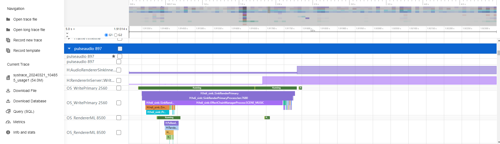
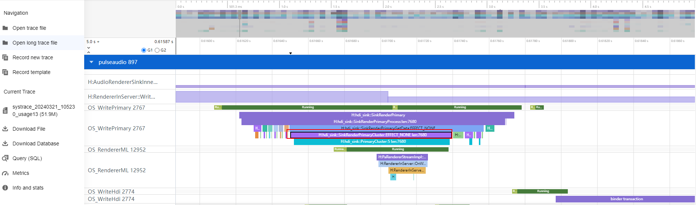

# 导航定位场景低功耗规则

更新时间：2026-03-12 08:45:02

来源：https://developer.huawei.com/consumer/cn/doc/best-practices/bpta-navigation-scenarios

##### 规则

 
- 导航类应用需设置正确的应用类型，并使用系统自带的导航场景音效算法，避免冗余处理。
- 在导航类应用无语音播报等语音输出时，禁止持续向系统写入音频空数据。

 

##### 开发步骤

 
为了避免导航类应用无法使用系统低功耗方案，确保正确设置usage类型。配置音频渲染参数并创建AudioRenderer实例时，设置usage类型为audio.StreamUsage.STREAM_USAGE_NAVIGATION。
```ArkTS
import { audio } from '@kit.AudioKit';
import { hilog } from '@kit.PerformanceAnalysisKit';

let audioStreamInfo: audio.AudioStreamInfo = {
  samplingRate: audio.AudioSamplingRate.SAMPLE_RATE_44100,
  channels: audio.AudioChannel.CHANNEL_1,
  sampleFormat: audio.AudioSampleFormat.SAMPLE_FORMAT_S16LE,
  encodingType: audio.AudioEncodingType.ENCODING_TYPE_RAW
};
let audioRendererInfo: audio.AudioRendererInfo = {
  usage: audio.StreamUsage.STREAM_USAGE_NAVIGATION,
  rendererFlags: 0
};
let audioRendererOptions: audio.AudioRendererOptions = {
  streamInfo: audioStreamInfo,
  rendererInfo: audioRendererInfo
};
audio.createAudioRenderer(audioRendererOptions, (err, data) => {
  if (err) {
    hilog.error(0x0000, 'Sample', `Invoke createAudioRenderer failed, code is ${err.code}, message is ${err.message}`);
    return;
  } else {
    hilog.info(0x0000, 'Sample', 'Invoke createAudioRenderer succeeded.');
    let audioRenderer = data;
  }
});
```
 
 

##### 调测验证

 
- 通过以下命令查看日志确认：
```bash
hdc shell
hilog | grep usage
```

- 执行效果如下图：


 

##### 结果对比

 
- 优化前：



 
- 优化后，图中字段证明系统低功耗方案使能成功（根据实验室测试功耗，功耗负载降低约43.89%。）：

