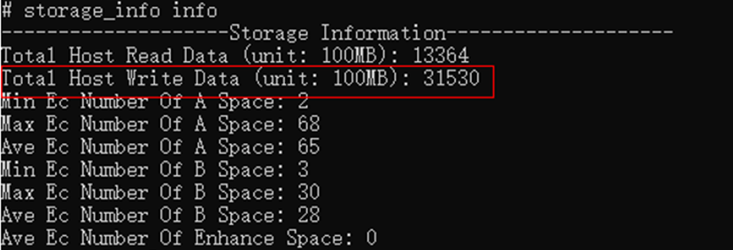

# 视频场景ROM低功耗建议

更新时间：2026-03-12 08:45:02

来源：https://developer.huawei.com/consumer/cn/doc/best-practices/bpta-video-rom

##### 建议

 
视频和小视频在线播放时，不建议将片源全部下载到ROM中。下载到ROM的功耗比仅加载到DDR中高100mA以上。因此，应避免将片源全部下载到ROM。
 

##### 开发步骤

推荐使用异步接口fileIo.write()写文件到ROM，函数的返回值number为实际写入的数据长度（单位：字节）。统计返回值的累计值，该累计值表示应用在一段时间内写入ROM的文件总大小。为确保视频和小视频在线播放时，文件下载速率不超过20MB/min。
 
```ArkTS
let filePath: string = pathDir + "/test.txt";
let file: fileIo.File = fileIo.openSync(filePath, fileIo.OpenMode.READ_WRITE | fileIo.OpenMode.CREATE);
let str: string = "hello, world";
// Use asynchronous methods to write files to the ROM
fileIo.write(file.fd, str).then((writeLen: number) => {
  hilog.info(0x0000, 'Sample', 'write data to file succeed and size is:' + writeLen);
}).catch((err: BusinessError) => {
  hilog.error(0x0000, 'Sample', 'write data to file failed with error message: ' + err.message + ', error code: ' + err.code);
}).finally(() => {
  fileIo.closeSync(file);
});
```
 
 

##### 调测验证

通过查看storage_info节点的信息，如下所示：Total Host Write Data表示整机下载文件的总大小（单位为100MB）。建议文件下载的总速率不超过20MB/min。以视频播放10分钟为例，测试前后的Total Host Write Data节点差值应小于或等于2，符合要求。
 


