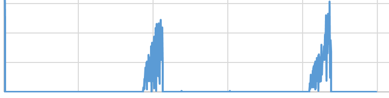
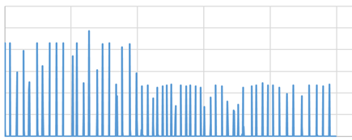

# 视频场景Wi-Fi加载低功耗建议

更新时间：2026-03-12 08:45:02

来源：https://developer.huawei.com/consumer/cn/doc/best-practices/bpta-video-wifi

##### 建议

 
视频场景数据缓存下载方式：建议每20s下载一次，每次下载3到5s，以避免小流量持续下载导致Wi-Fi功耗增加。
 

##### 开发步骤

调用系统的setHandoverCb()接口，实现聚合方式缓存视频，具体的接口调用方法如下：
 
1.监听系统接管状态，要注册系统handover起始回调，接收变化通知，包含接管start回调及接管结束回调。
 
setHandoverCb(HandoverStartCb startCb, HandoverCompleteCb completeCb);
 
2.当应用需要短时间使用网络链路，需要反馈期望使用网络的earliestBegin时间及最晚忍受时间，系统会参考多个应用的时间进行拉齐，统一在一段时间内恢复网络的正常使用。transDesc中包含期望的最早时间和可以忍受的最晚时间。
 
setTransDesc(transDesc);
 
3.当应用有优先级不高且不影响基本功能的业务时，比如上传log等，应用可以在发送数据的请求中标识该请求，系统会进行统一调度。out中传入系统自主控制delegation的标志位。
 
send(out);
 
 

##### 调测验证

相同大小的文件下载存在两种方式：按聚合方式下载和小流量持续下载。数据包与时间的关系如下：
 1. 按聚合方式下载时，例如每20s下载一次，每次下载3到5s，Wi-Fi器件在大部分时间处于idle状态，实测Wi-Fi功耗为35mA。

2. 当以小流量持续下载时，例如每1s下载一次，Wi-Fi器件的空闲时间会减少。实测结果显示，小流量持续下载的Wi-Fi功耗为55mA，而聚合下载的功耗为35mA。因此，建议应用采用聚合方式下载，以避免小流量持续下载导致的高Wi-Fi功耗。

