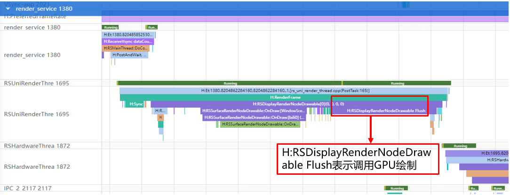

# 视频场景弹幕绘制低功耗规则

更新时间：2026-03-12 08:45:02

来源：https://developer.huawei.com/consumer/cn/doc/best-practices/bpta-video-barrage

#### 规则

 
- 在视频播放弹幕场景中，弹幕的绘制方式可分为CPU渲染和GPU渲染两种方案。在相同渲染复杂度下，CPU渲染的计算负载显著高于GPU渲染，因此建议优先采用OpenGLES进行基于GPU硬件加速的渲染。

 

#### 开发步骤

使用EGL/OpenGLES进行渲染，即硬件加速，通过GPU绘制。OpenGLES的接口使用方式请参见[OH_NativeXComponent Native XComponent](https://developer.huawei.com/consumer/cn/doc/harmonyos-references/capi-oh-nativexcomponent-native-xcomponent)。
 
XComponent组件作为一种渲染组件，可用于EGL/OpenGLES和媒体数据写入，通过使用XComponent持有的“[NativeWindow](https://developer.huawei.com/consumer/cn/doc/harmonyos-guides/native-window-guidelines)”来渲染画面，通常用于满足开发者较为复杂的自定义渲染需求，例如相机预览流的显示和游戏画面的渲染。其可通过指定type字段来实现不同的渲染方式，分别为[XComponentType](https://developer.huawei.com/consumer/cn/doc/harmonyos-references/ts-appendix-enums#xcomponenttype10).SURFACE和[XComponentType](https://developer.huawei.com/consumer/cn/doc/harmonyos-references/ts-appendix-enums#xcomponenttype10).TEXTURE。对于SURFACE类型，开发者将定制的绘制内容单独展示到屏幕上。对于TEXTURE类型，开发者将定制的绘制内容和XComponent组件的内容合成后展示到屏幕上。以下是EGL/OpenGLES的使用范例：
 
```cpp
void EGLCore::Draw() {
    // Determine the vertices of the quadrilateral to be drawn, expressed as a percentage of the drawing area
    const GLfloat shapeVertices[] = {centerX / width_, centerY / height_, leftX / width_,  leftY / height_,
                                     rotateX / width_, rotateY / height_, rightX / width_, rightY / height_};

    if (!ExecuteDrawStar(position, DRAW_COLOR, shapeVertices, sizeof(shapeVertices))) {
        OH_LOG_Print(LOG_APP, LOG_ERROR, LOG_PRINT_DOMAIN, "EGLCore", "Draw execute draw star failed");
        return;
    }

    GLfloat rad = M_PI / 180 * 72;
    for (int i = 0; i < 4; ++i) {
        // Rotate the vertices of the other four quadrilaterals
        rotate2d(centerX, centerY, &rotateX, &rotateY, rad);
        rotate2d(centerX, centerY, &leftX, &leftY, rad);
        rotate2d(centerX, centerY, &rightX, &rightY, rad);

        // Determine the vertices of the quadrilateral to be drawn, expressed as a percentage of the drawing area
        const GLfloat shapeVertices[] = {centerX / width_, centerY / height_, leftX / width_,  leftY / height_,
                                         rotateX / width_, rotateY / height_, rightX / width_, rightY / height_};

        // Draw graphics
        if (!ExecuteDrawStar(position, DRAW_COLOR, shapeVertices, sizeof(shapeVertices))) {
            OH_LOG_Print(LOG_APP, LOG_ERROR, LOG_PRINT_DOMAIN, "EGLCore", "Draw execute draw star failed");
            return;
        }
    }

    // End drawing
    if (!FinishDraw()) {
        OH_LOG_Print(LOG_APP, LOG_ERROR, LOG_PRINT_DOMAIN, "EGLCore", "Draw FinishDraw failed");
        return;
    }

    flag_ = true;
}
```
 
 

#### 调测验证

抓取视频弹幕播放的systrace，三方应用调用RenderService进程进行弹幕绘制时，调用“H:RSDisplayRenderNodeDrawable Flush”函数，表示执行基于GPU硬件加速的渲染。
 



 
 

#### 示例代码

- [基于XComponent组件实现OpenGL图形绘制及YUV图像渲染功能](https://gitcode.com/harmonyos_samples/ndk-xcomponent)
