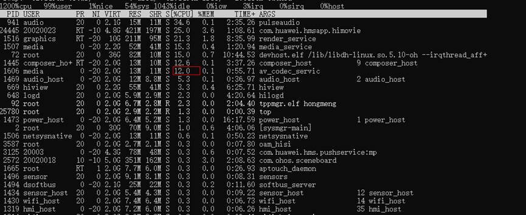
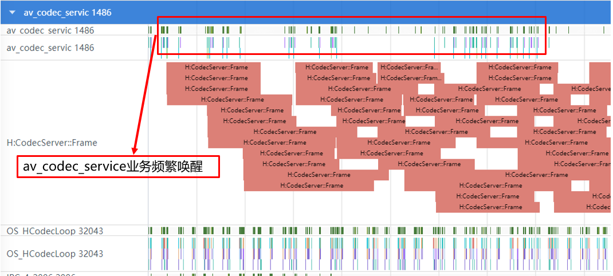

# 视频场景编解码低功耗规则

更新时间：2026-03-12 08:45:02

来源：https://developer.huawei.com/consumer/cn/doc/best-practices/bpta-video-codec

#### 规则

 
- 视频应用需使用视频硬件编解码器。
- 视频场景应使用专用硬件解码器(VDEC)，其功耗效率显著优于CPU软解码。因此，应使用平台的视频硬件编解码器进行视频播放。

 

#### 开发步骤

 
调用OH_AVCodec相关接口，使用视频硬件编解码器处理视频。
 
```cpp
// To create a decoder using a codec name, if the application has special requirements, such as selecting a decoder that supports a certain resolution specification, 
// the capability can be queried first, and then the decoder can be created based on the codec name.
OH_AVCapability *capability = OH_AVCodec_GetCapability(OH_AVCODEC_MIMETYPE_VIDEO_AVC, false);
const char *name = OH_AVCapability_GetName(capability);
// Create a decoder through mimetype
// Hard solution: Create H264 decoder. When there are multiple optional decoders, the system will create the most suitable decoder
OH_AVCodec *videoDec = OH_VideoDecoder_CreateByMime(OH_AVCODEC_MIMETYPE_VIDEO_AVC);
// Hard solution: Create H265 decoder
OH_AVCodec *videoDecH = OH_VideoDecoder_CreateByMime(OH_AVCODEC_MIMETYPE_VIDEO_HEVC);
```
 

#### 调测验证

- 方法一：在命令提示符窗口中，输入hdc shell top命令，查看当前系统的top进程的CPU占用率。如果av_codec_service进程的CPU负载率超过 5%，则说明视频硬解码已启用。



 
- 方法二：[通过DevEco Studio Profiler抓取systrace](https://developer.huawei.com/consumer/cn/doc/harmonyos-guides/ide-insight-session-time)通过systrace确认av_codec_service进程的负载，如下图所示。业务频繁唤醒且有实际函数运行，说明视频处于硬解码状态。

  

