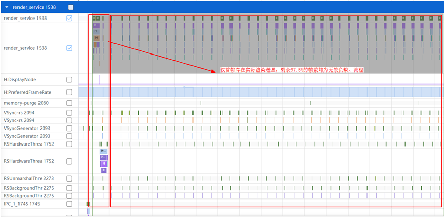
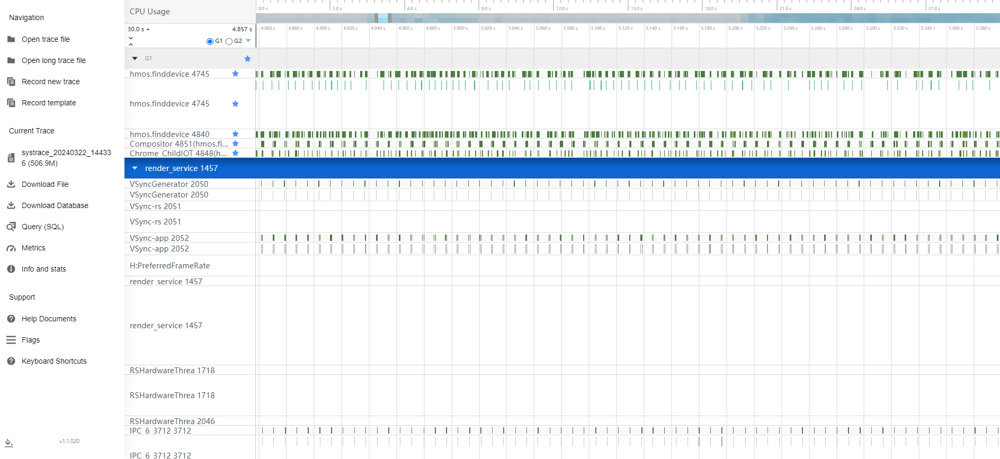
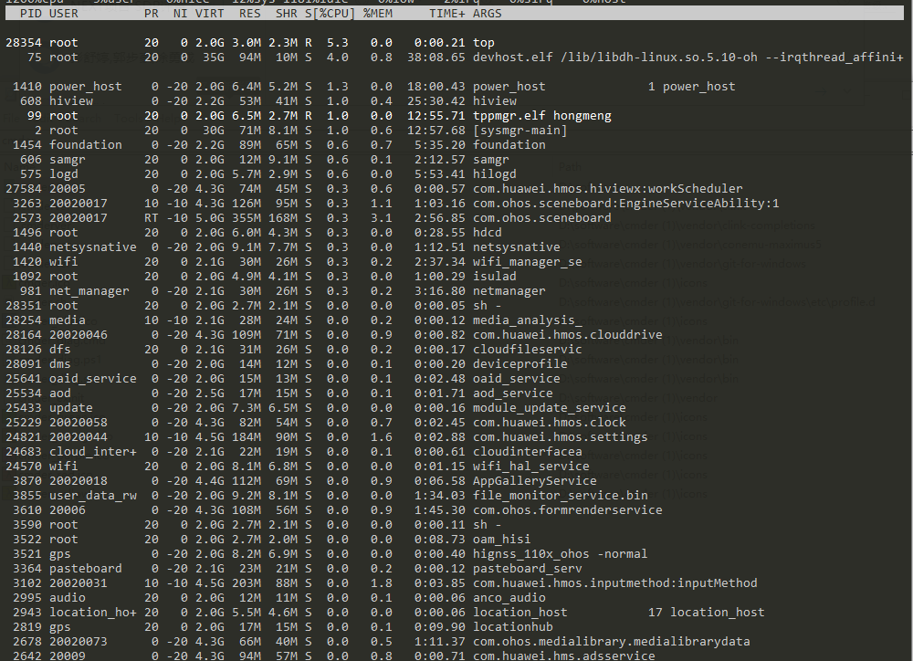
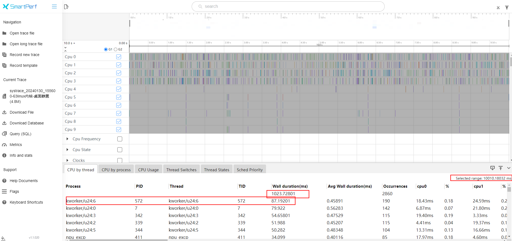

# 静态场景低功耗规则

更新时间：2026-03-27 09:23:00

来源：https://developer.huawei.com/consumer/cn/doc/best-practices/bpta-static-scenarios

#### 规则

 
在界面完全静止且无音频输出、资源下载的场景下，三方应用应停止频繁请求显示和sensor等无关资源，不随vsync信号每帧周期性运行，不持续请求sensor等资源。三方应用进程的CPU负载率应低于10%（单核负载）。
 

#### 开发步骤

静置场景下，三方应用进程不会随着vsync信号每帧周期性运行。以下“案例分析”对此进行详细说明。
 
 
在静置场景下，未使用的资源应及时释放。以sensor为例：
 1. 按需使用sensor资源，并按需注册SensorId。注册监听，通过on()接口实现对传感器的持续监听。设置传感器上报周期interval为200000000纳秒（最小采样周期为5000000纳秒，最大采样周期为200000000纳秒）。

  
```ArkTS
import { sensor } from '@kit.SensorServiceKit';
import { hilog } from '@kit.PerformanceAnalysisKit';

sensor.on(sensor.SensorId.ACCELEROMETER, (data: sensor.AccelerometerResponse) => {
  hilog.info(0x0000, 'Sample', 'Succeeded in obtaining data. x: ' + data.x + ' y: ' + data.y + ' z: ' + data.z);
}, { interval: 200000000 });
```

1. 在sensor频次需求较低的场景中，根据需要调整sensor.on()的interval属性，以改变上报频次。
```ArkTS
sensor.on(sensor.SensorId.ACCELEROMETER, (data: sensor.AccelerometerResponse) => {
  hilog.info(0x0000, 'Sample', 'Succeeded in obtaining data. x: ' + data.x + ' y: ' + data.y + ' z: ' + data.z);
}, { interval: 200000000 });
```

2. 不使用sensor资源时，使用以下接口进行解注册。
```ArkTS
sensor.off(sensor.SensorId.ACCELEROMETER);
```

 

#### 案例分析

 
- 开机后，桌面静置。连接Wi-Fi后，lottie动效异常，导致UI和RS空跑。


- 应用静置界面时，应用以120 fps响应vsync事件但无实际显示，导致应用进程和RS负载较高。



 

#### 调测验证

- 查看日志：在控制台输入top指令，可直接获取进程负载。


- 抓取trace：通过trace中的进程耗时和绝对耗时，计算进程负载。

