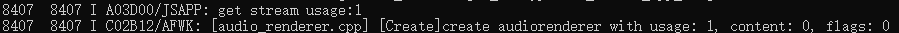

# 音乐播放场景低功耗规则

更新时间：2026-03-12 08:45:02

来源：https://developer.huawei.com/consumer/cn/doc/best-practices/bpta-music-playback-scenarios

#### 规则

 
- 音乐类应用静音时关闭音效处理算法。
- 音乐类应用播放时设置正确应用类型，走系统低功耗方案。
- 音乐类应用在后台播放时无需设置播放状态，通过接入[AVSession Kit（音视频播控服务）](https://developer.huawei.com/consumer/cn/doc/harmonyos-guides/avsession-kit)，设置资源的时长、播放状态（暂停、播放）、播放位置、倍速即可，不需要应用实时更新播放进度。

 

#### 开发步骤

 
为了避免静音播放时冗余音效处理算法导致的快速耗电，可以通过设置当前播放实例的音效模式来解决。关闭应用音效的方法如下所示：
```ArkTS
import { audio } from '@kit.AudioKit';
import { BusinessError } from '@kit.BasicServicesKit';
audioRenderer!.setAudioEffectMode(audio.AudioEffectMode.EFFECT_NONE, (err: BusinessError) => {
  if (err) {
    hilog.error(0x0000, 'Sample', `Failed to set params, code is ${err.code}, message is ${err.message}`);
    return;
  } else {
    hilog.info(0x0000, 'Sample', 'Callback invoked to indicate a successful audio effect mode setting.');
  }
});
```
 
 
设置音乐播放的usage类型为audio.StreamUsage.STREAM_USAGE_MUSIC，确保音乐类应用能使用系统低功耗方案。
```ArkTS
import { audio } from '@kit.AudioKit';
let audioStreamInfo: audio.AudioStreamInfo = {
  samplingRate: audio.AudioSamplingRate.SAMPLE_RATE_44100,
  channels: audio.AudioChannel.CHANNEL_1,
  sampleFormat: audio.AudioSampleFormat.SAMPLE_FORMAT_S16LE,
  encodingType: audio.AudioEncodingType.ENCODING_TYPE_RAW
};
let audioRendererInfo: audio.AudioRendererInfo = {
  usage: audio.StreamUsage.STREAM_USAGE_MUSIC,
  rendererFlags: 0
};
let audioRendererOptions: audio.AudioRendererOptions = {
  streamInfo: audioStreamInfo,
  rendererInfo: audioRendererInfo
};
audio.createAudioRenderer(audioRendererOptions, (err, data) => {
  if (err) {
    hilog.error(0x0000, 'Sample', `Invoke createAudioRenderer failed, code is ${err.code}, message is ${err.message}`);
    return;
  } else {
    hilog.info(0x0000, 'Sample', 'Invoke createAudioRenderer succeeded.');
    let audioRenderer = data;
  }
});
```
 
 
设置音乐应用后台播放时，需指定播放位置。播控中心将利用这些信息展示进度，无需频繁更新进度条，从而避免增加binder负载。
 
```ArkTS
import { avSession } from '@kit.AVSessionKit';

const uiContext: UIContext | undefined = AppStorage.get('uiContext');
let context: Context = uiContext?.getHostContext()!;

async function setListener(): Promise<void> {
  // Assuming that a session has been created, see the previous example for how to create a session
  let type: avSession.AVSessionType = 'audio';
  let session: avSession.AVSession = await avSession.createAVSession(context, 'SESSION_NAME', type);

  // Set the duration of the property
  let metadata: avSession.AVMetadata = {
    assetId: '0',
    title: 'TITLE',
    mediaImage: 'IMAGE',
    duration: 23000, // The duration of the resource, measured in milliseconds
  };
  session.setAVMetadata(metadata).then(() => {
    hilog.info(0x0000, 'Sample', `SetAVMetadata successfully`);
  }).catch((err: BusinessError) => {
    hilog.error(0x0000, 'Sample', `Failed to set AVMetadata. Code: ${err.code}, message: ${err.message}`);
  });

  // Set Status: Playback Status, Progress Position, Playback Speed, Cache Time
  let playbackState: avSession.AVPlaybackState = {
    state: avSession.PlaybackState.PLAYBACK_STATE_PLAY, // Playback status
    position: {
      elapsedTime: 1000, // The position that has been played, in ms
      updateTime: new Date().getTime(), // The timestamp of when the app updated the current location, in ms
    },
    speed: 1.0, // Optional, the default is 1.0, the speed of playback, set according to the speed supported in the app, the system does not do verification
    bufferedTime: 14000, // Optional, the time for which the resource is cached, in ms
  };
  session.setAVPlaybackState(playbackState, (err) => {
    if (err) {
      hilog.error(0x0000, 'Sample', `Failed to set AVPlaybackState. Code: ${err.code}, message: ${err.message}`);
    } else {
      hilog.info(0x0000, 'Sample', `SetAVPlaybackState successfully`);
    }
  });
}
```
 

#### 调测验证

 
usage可以通过以下命令查看日志确认：
```bash
hdc shell
hilog | grep usage
```
 
 
执行效果示意如下图所示：
 


