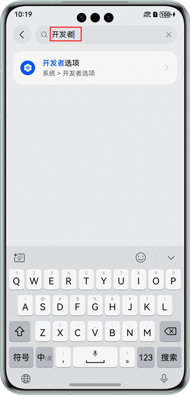
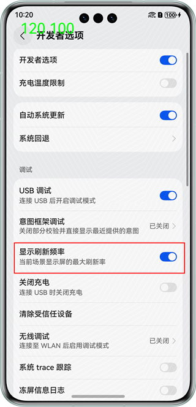
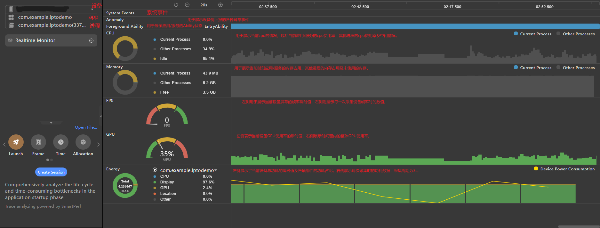
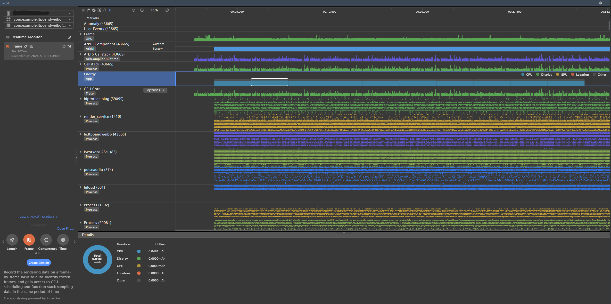
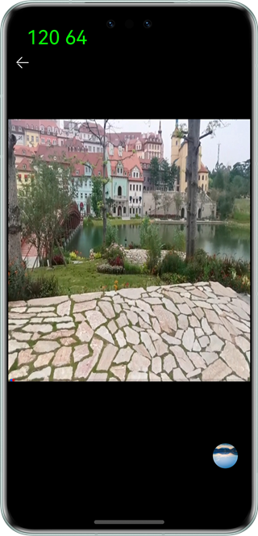
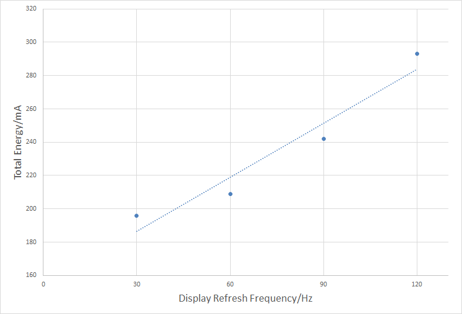
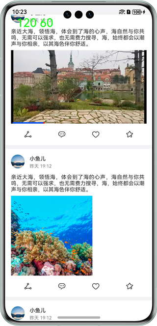
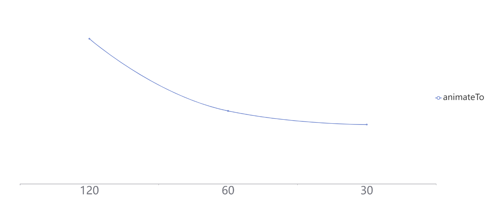

# 基于LTPO的低功耗设计

更新时间：2026-03-12 08:45:02

来源：https://developer.huawei.com/consumer/cn/doc/best-practices/bpta-ltpo-description

## 概述


### LTPO技术简介


LTPO的全称是“Low Temperature Polycrystalline Oxide”，中文译为“低温多晶氧化物”。这是OLED屏背板的一种驱动技术。通过将OLED驱动电路中的TFT换成IGZO TFT，降低显示功耗。LTPO屏支持1~120Hz的自适应刷新率，使应用在需要高刷新率的场景下提升流畅性，而在视频、静止等场景中使用低刷新率降低显示功耗，延长电池续航。通常，用“LTPO”指代自适应刷新率技术。


### 特性介绍


LTPO是自适应刷新率技术，按需调整显示刷新率，优化性能和功耗。


> [!NOTE]
> 适配LTPO的好处包括：精细化场景帧率控制，降低场景负载，减少偶发卡顿，降低场景功耗。


### 场景策略建议


实现控件级帧率控制，降低系统因突发负载增加导致的卡顿，同时在高刷新率场景下主动适配，确保流畅体验。

不建议锁定最高帧率运行

不建议将ExpectedFrameRateRange中的expected、min、max都设置为120，这会干扰系统可变帧率机制，增加负载，影响整机性能和功耗。

主要原因有以下三点：

1. ExpectedFrameRateRange中的关键参数是expected（期望帧率）。系统优先按照expected设置的帧率执行。如果系统难以满足expected帧率，会在min和max之间选择一个更合适的帧率提供给应用。
2. 如果应用锁定120Hz，系统会优先满足应用的设置，以120帧运行。这将显著增加手机功耗，长时间运行会导致手机过热，严重影响用户体验。此外，不必要的高帧率会额外占据更多算力，可能导致其他场景的响应延迟。
3. 如果系统持续以120Hz运行，此时系统的可变帧率能力已失效，这与可变帧率的设计原则不符。


策略建议


| 类型 | 类型描述 | 帧率建议（案例） |
| --- | --- | --- |
| 高帧率场景 | 基本全屏的非持续动效 | 应用启动，退出，窗口转场动效，拖动窗口移动动效：90~120Hz |
| 中等帧率场景 | 变化区域大的持续型动效，非全屏的手势动效与转场动效 | 视频内弹幕，小说自动翻页动效：60Hz QQ首页左滑某一行消息动效:60Hz 微信右上角点击“+”号弹出应用内子窗口动效:60~120Hz 抖音内滑动切换视频，图库滑动切换图片动效：60Hz |
| 低帧率场景 | 小区域动效，微动效 | 小视频右下角转盘动效：15~30Hz 页面刷新加载转圈动效:20~30Hz 滑动列表右侧拖动条消失动效:15~30Hz 复杂微动效，根据实际效果调整帧率 |
| 跟随源帧率场景 | 插画动效，固定源帧率动效 | 帧率跟随内容源，不建议长时间保持高帧率 购物应用首页图标帧动效 聊天表情包动效 导航主界面 |


## 功耗测试工具


### 显示手机实时刷新率


打开开发者模式中的"显示刷新频率"开关。具体操作：设置中搜索"开发者" ->  "显示刷新频率"。







### Profiler工具测试手机功耗


1. 启动程序，并将其部署安装到真实手机上。

2. 打开工具Profiler，并按图示选择需要监控的设备、app、进程。未启动app会出现设备、app等选项为空的情况，此时不能进行Profiler性能分析。





图中的黄色折线展示整机的电量消耗，斜率为正表示设备耗电，斜率为负表示设备充电。

3. 点击会话区“Realtime Monitor”页签上的启动按钮，控制实时监控界面的录制状态。

4. 将鼠标悬浮在关注的泳道数据上时，界面上会显示当前时间点的时间标线和详细数据的Tooltips。当鼠标悬浮在时间轴上时，实时监控页面内的所有泳道均会以Tooltips显示该时刻的数据。





本文采用的测试方式是让应用运行30秒，每3秒记录一次功耗数据，取设备从第6秒到第21秒的5个节点的平均功耗。此时设备已平稳运行，功耗也趋于稳定。


## 使用场景


### 场景说明


在具备LTPO屏幕的设备上，基于显示内容的可变帧率能力，可以达到性能体验和功耗间的平衡。HarmonyOS支持可变帧率能力，开发者通过使用可变帧率接口，进行相关业务开发，可以享受可变帧率特性带来的功耗收益。

可变帧率能力支持开发者自定义应用业务的帧率，其常见的使用场景：

- 通过配置属性动画/显示动画的帧率属性参数，用于动画的绘制，具体可见[请求动画绘制帧率](https://developer.huawei.com/consumer/cn/doc/harmonyos-guides/displaysync-animation)。
- 通过申请一个独立的绘制帧率，用于UI的绘制，具体可见[请求UI绘制帧率](https://developer.huawei.com/consumer/cn/doc/harmonyos-guides/displaysync-ui)。
- 通过XComponent在Native侧申请独立的绘制帧率，用于游戏等自绘制内容的绘制，具体可见[请求自绘制内容绘制帧率](https://developer.huawei.com/consumer/cn/doc/harmonyos-guides/displaysync-xcomponent)。


基于以上使用场景，结合众多实际开发案例，本文选取两个有代表性的案例展开介绍。


> [!NOTE]
> 设置的期望帧率值可能无法完全实现，因为会受到系统能力和屏幕刷新率的限制。


### 基于LTPO实现循环动画


针对无限循环的动画效果，如转盘动画，需要特别注意设置动画的可变帧率。长时间保持高帧率可能导致手机发热。

效果展示





功耗对比


> [!NOTE]
> 使用DisplaySync去实现转盘动画，通过主动设置可变帧率，可以获取功耗的差异。
>  功耗测试方法参考章节2。


打开手机屏幕刷新率设置，可以查看刷新率变化。使用Profiler工具，可以查看功耗变化。





从图中可以发现，当屏幕刷新率降低时，功耗也会降低。

传入可变帧率（ExpectedFrameRateRange），屏幕感知并利用LTPO技术降低功耗。屏幕帧率不始终保持最高，功耗较低。

实现说明

首先，导入模块。

```ts
import { displaySync } from '@kit.ArkGraphics2D';
```

定义并构建DisplaySync对象。

```ts
private backDisplaySyncSlow: displaySync.DisplaySync | undefined = undefined;
private backDisplaySyncFast: displaySync.DisplaySync | undefined = undefined;
```

定义图片组件，添加旋转方法。

```ts
Row() {
  Image($r('app.media.avatar'))
  .height(40)
  .width(40)
}
.rotate({
  x: 0,
  y: 0,
  z: 1,
  centerX: '50%',
  centerY: '50%',
  angle: this.rotateAngle
})
```

使用DisplaySync实例设置帧率并注册订阅函数。

```ts
let range: ExpectedFrameRateRange = {
  expected: 30,
  min: 0,
  max: 120,
};
this.backDisplaySyncSlow.setExpectedFrameRateRange(range); // Setting the frame rate
```

全部代码实现如下

```ts
import { displaySync } from '@kit.ArkGraphics2D';

@Entry
@Component
struct Index {
  @State drawFirstSize: number = 25;
  @State rotateAngle: number = 1;
  @State drawSecondSize: number = 25;
  private backDisplaySyncSlow: displaySync.DisplaySync | undefined = undefined;
  private backDisplaySyncFast: displaySync.DisplaySync | undefined = undefined;
  private isBigger30: boolean = true;

  aboutToDisappear() {
    if (this.backDisplaySyncSlow) {
      this.backDisplaySyncSlow.stop(); // DisplaySync enable off
      this.backDisplaySyncSlow = undefined; // Empty the instance
    }
    if (this.backDisplaySyncFast) {
      this.backDisplaySyncFast.stop(); // DisplaySync enable off
      this.backDisplaySyncFast = undefined; // Empty the instance
    }
  }

  CreateDisplaySyncSlow() {
    // Defining the Desired Drawing Frame Rate
    this.backDisplaySyncSlow = displaySync.create(); // Creating a DisplaySync Instance
    let range: ExpectedFrameRateRange = {
      expected: 30,
      min: 0,
      max: 120
    };
    this.backDisplaySyncSlow.setExpectedFrameRateRange(range); // Setting the frame rate

    let draw30 = (intervalInfo: displaySync.IntervalInfo) => {
      if (this.isBigger30) {
        this.rotateAngle += 1;
      } else {
        this.rotateAngle -= 1;
        if (this.rotateAngle < 25) {
          this.isBigger30 = true;
        }
      }
    };

    this.backDisplaySyncSlow.on("frame", draw30); // Subscribing to frame events and registering subscription functions
  }

  build() {
    Column() {
      Row() {
        Image($r('app.media.avatar'))
        .height(40)
        .width(40)
      }
      .rotate({
        x: 0,
        y: 0,
        z: 1,
        centerX: '50%',
        centerY: '50%',
        angle: this.rotateAngle
      })

      Row() {
        Button('Start')
        .onClick(() => {
          if (this.backDisplaySyncSlow === undefined) {
            this.CreateDisplaySyncSlow();
          }
          if (this.backDisplaySyncSlow) {
            this.backDisplaySyncSlow.start(); // DisplaySync enable off
          }
        })
      }
    }
  }
}
```

上述代码中，设置DisplaySync的可变帧率ExpectedFrameRateRange可以让系统调整屏幕刷新率。若要取消设置可变帧率，可注释以下代码：

```ts
// Note the following lines
// let range : ExpectedFrameRateRange = {
// expected: 30,
// min: 0,
// max: 120
// };
// this.backDisplaySyncSlow.setExpectedFrameRateRange(range);
```


> [!NOTE]
> 不建议将ExpectedFrameRateRange中的expected、min、max都设置为120，这会干扰系统的可变帧率机制，增加负载，影响整机性能和功耗。
>  如setExpectedFrameRateRange({ expected: , min: , max:  })。


### 基于LTPO实现滑动条


效果展示





功耗对比


> [!NOTE]
> 使用animateTo实现滑动动画，通过设置可变帧率，可以观察功耗差异。
>  功耗测试方法参考章节2。


开启手机帧率设置，查看帧率变化；使用Profiler工具，查看功耗变化。





屏幕刷新率降低时，功耗也会降低。

传入可变帧率（ExpectedFrameRateRange），屏幕感知后充分利用LTPO技术降低功耗。屏幕帧率不始终处于最高，因此功耗较低。

代码实现

在滑动条中添加onVisibleAreaChange事件，并在回调函数中将滑块的当前值增加到100。

```ts
Slider({ value: this.curTime, min: 0, max: 100 })
  .enabled(false)
  .height(4)
  .width(320)
  .trackThickness(3)
  .blockColor(Color.Red)
  .blockSize({ width: 4, height: 4 })
  .onVisibleAreaChange(
    [0.0, 1.0],
    (isVisible: boolean, currentRatio: number) => {
      if (isVisible) {
        this.getUIContext().animateTo(
          {
            duration: DURATION,
            iterations: -1,
            expectedFrameRateRange: {
              expected: 30,
              min: 0,
              max: 120,
            },
          },
          () => {
            if (this.curTime >= 100) {
              this.curTime = 0;
            }
            for (let i = 0; i < 101; i++) {
              this.curTime += 1;
            }
          },
        );
      }
    },
  );
```


## 总结


综上所述，使用LTPO技术可以控制动效刷新率，降低屏幕功耗，延长续航时间，提升使用体验。开发时推荐使用可变帧率接口，享受功耗优化。


## 示例代码


- [实现流畅刷文章功能](https://gitcode.com/harmonyos_samples/fluent-blog)
