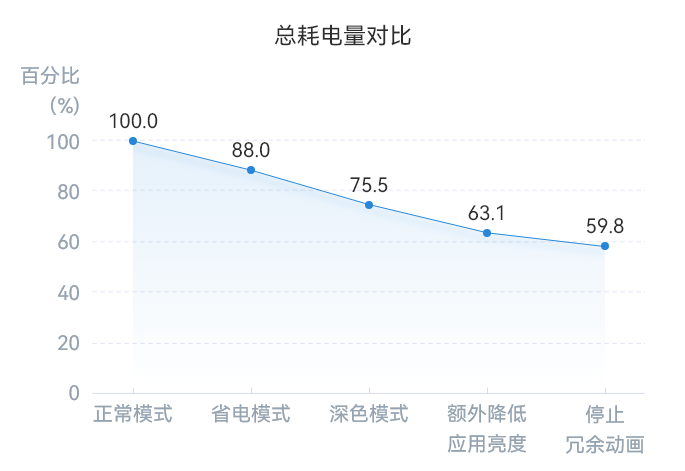
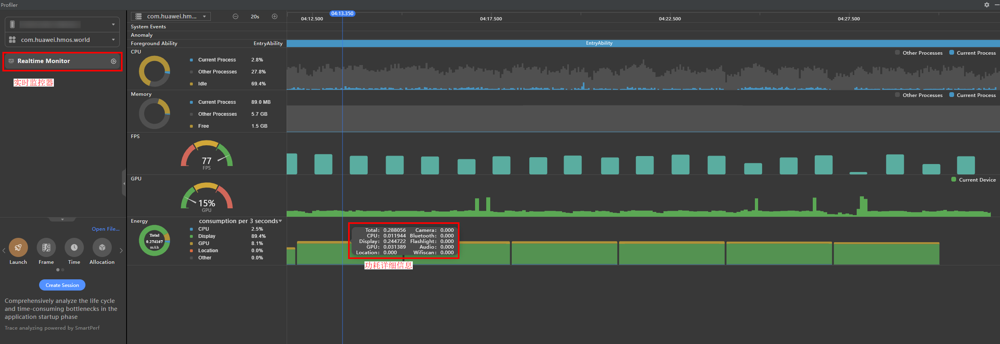
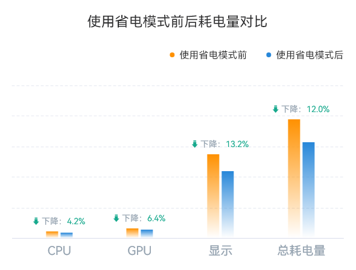
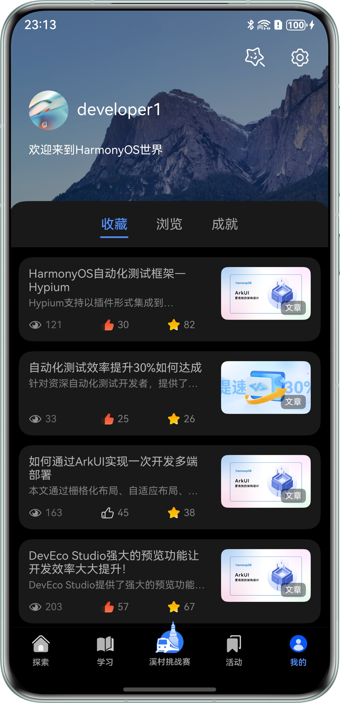
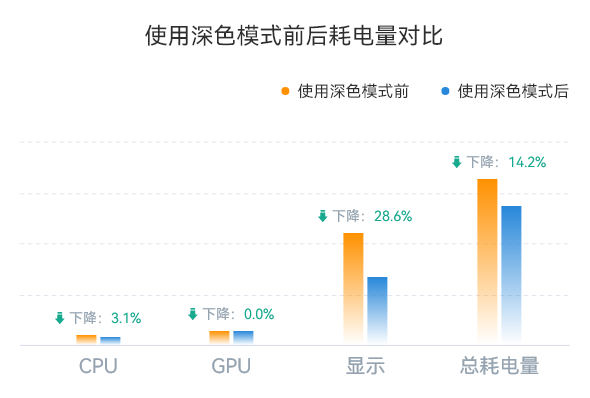
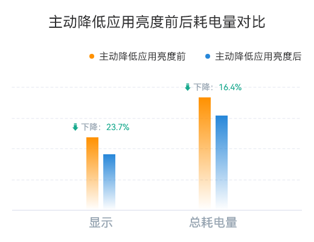
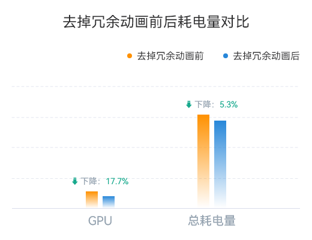

# 省电和深色模式下低功耗设计

更新时间：2026-05-22 09:46:30

来源：https://developer.huawei.com/consumer/cn/doc/best-practices/bpta-low-power-design-in-dark-mode

#### 概述
低功耗是指设备在执行各种任务时，通过应用一系列技术和策略来减少能耗，从而延长电池寿命和设备使用时间。手机等移动设备因其便携、移动的特性，续航时间的长短直接影响用户对品牌的体验和满意度。更长的续航时间可减少充电频率，提升户外使用体验。为了延长续航时间，可采取多种技术和方法来降低功耗、优化电池管理，例如优化软件算法、调整屏幕亮度和显示等。其中，省电模式和深色模式是常用的功耗优化手段：
- 省电模式：一种通过调整设备的设置来降低系统功耗的功能，例如适当降低屏幕亮度和CPU性能。
- 深色模式：深色模式是应用程序的一种背景颜色设置，用于将应用程序显示背景颜色改为深色调，例如黑色或深灰色。
为了有效去测量手机运行时的功耗，DevEco Profiler提供实时监控（Realtime Monitor）能力，可帮助开发者实时监控设备资源（如CPU、内存、FPS、GPU、Energy等）使用情况，其中Energy以3秒为周期进行刷新，体现统计周期内总功耗以及各耗能部件（包括CPU、Display、GPU、Location、Other）的功耗占用情况。综合考虑业界共识指标和实际用户使用体验，实验将主要对比屏幕显示耗电量、CPU耗电量、GPU耗电量以及最终总耗电量，关键指标如下所示：
- 显示耗电量：显示耗电量是手机耗电的主要来源之一，它通常占总能耗的很大比例，影响显示耗电量的关键因素包括屏幕亮度、显示内容、刷新率等。
- CPU耗电量：高性能的任务通常需要更多的CPU计算能力，导致较高的CPU耗电量，影响CPU耗电量的关键因素包括CPU的工作频率、功耗管理策略以及对任务的调度和分配等。
- GPU耗电量：类似于CPU，高性能的图形任务会导致较高的GPU耗电量，影响GPU耗电量的关键因素包括GPU的工作频率、工作负载、绘制内容、分辨率、绘制帧率等。
- 最终总耗电量：最终总耗电量是指设备在特定使用场景下的总能耗，包括屏幕显示、CPU计算和GPU图形处理等。它反映了设备在某种使用情境下的总体能耗水平。
本文以“HMOS世界”APP为例，验证省电模式和深色模式对手机功耗的影响，观察电量消耗变化。同时探讨主动降低应用亮度和停止冗余动画两项措施，测试不同条件下的电量消耗。实验结果表明：
- 主动省电模式：设置省电模式后，系统会自动调节屏幕亮度和灭屏时间等配置项，从而显著降低显示模块的功耗，总耗电量降低约12%。
- 主动深色模式：切换深色模式后，OLED屏幕使用更少的像素点和背光，实现更低的亮度和对比度，相对于正常模式，总耗电量降低约24.5%。
- 主动调节屏幕亮度：主动调节屏幕亮度时，应用可以降低屏幕亮度，减少显示屏功耗，延长设备续航时间。相对于正常模式，总耗电量降低约36.9%。
- 停止冗余动画：冗余的动画绘制指的是在屏幕上绘制不必要或重复的动画效果，通过停止冗余动画可以减少GPU的工作量，从而降低GPU的功耗。相对于正常模式，总耗电量降幅约为40.2%。
通过设置省电模式、深色模式、调节屏幕亮度、停止冗余动画，最终测量的总耗电量对比如下图所示：
**图1 **总耗电量对比（相对于正常模式）



#### 功耗测量工具
#### DevEco Profiler
DevEco Profiler 应用调优工具（以下简称 Profiler）已内置在 DevEco Studio 中，提供场景化的调优体验。Profiler 不仅帮助开发者及时了解应用或服务的 CPU、内存和图形资源使用情况，还提供高效的问题定位功能，帮助开发者快速找到问题代码。使用 Profiler 测试应用程序功耗的方法如下：
1. 打开Profiler：在DevEco Studio内可以通过以下三种方式打开Profiler在DevEco Studio顶部菜单栏中选择“View -> Tool Windows -> Profiler”。在DevEco Studio底部工具栏中单击“Profiler”。按“Double Shift”或者“Ctrl+Shift+A”打开搜索功能，搜索“Profiler”。
2. 连接设备：将设备通过USB连接到计算机上。
3. 选择应用程序：在Profiler中，选择要测试的应用程序并开启Realtime Monitor。
4. 进行应用程序操作：在设备上进行应用程序操作，如浏览网页、播放视频等。
5. 查看结果：右侧区域展示时间窗内Energy资源的实时使用情况。将鼠标悬浮在统计图的任意位置，打开时间标线，左右移动鼠标，结合时间轴查看不同时间点的实时信息。
Profiler耗电量示意图如下所示，详细信息及使用可参考[实时监控](https://developer.huawei.com/consumer/cn/doc/harmonyos-guides/realtime-monitor)。
**图2 **ProfilerEnergy模块示意图



> [!NOTE] 说明
> 上图区域展示时间窗内CPU、Memory、FPS、GPU、Energy资源的实时使用情况，将鼠标悬浮于统计图中任意位置，打开时间标线，左右移动鼠标并结合时间轴可查看不同时间点上的实时信息。Energy以3秒为周期进行刷新，体现统计周期内总功耗以及各耗能部件（包括CPU、Display、GPU、Location、Other）的功耗占用情况。

#### 程控电源
程控电源是一种能够控制电压、电流、功率、电阻等参数的电源设备，根据用户设定的参数输出相应的电压和电流，满足各种测试需求。程控电源支持编程控制，可以模拟不同的负载条件，测试应用程序在不同负载下的功耗表现。开发人员可以利用这些信息了解应用程序的能耗特性并进行优化。
使用程控电源测试应用程序功耗的方法如下所示：
1. 连接设备：首先需要将程控电源连接到待测设备的电源输入端，并确保连接正确。
2. 设置测试条件：在程控电源上设置测试条件，包括电压、电流、功率等参数。
3. 进行应用程序操作：在设备上运行待测应用程序，并进行应用程序操作，如浏览网页、播放视频等。
4. 收集数据：在测试过程中，程控电源会实时记录设备的功耗数据，包括电压、电流、功率等信息。

#### 省电模式
#### 原理介绍
HarmonyOS默认提供了电源模式的特性，主要分为以下三类：
- 正常模式：默认的电源模式，无特殊需求的情况下，此模式下的系统亮度、灭屏时间，进入睡眠时间等均适合大部分用户的需要。
- 性能模式：强调性能表现的电源模式，如增加系统亮度、关闭灭屏时间、防止进入睡眠等。
- 省电模式：强调省电表现的电源模式，如降低系统亮度、缩短灭屏时间等。切换了电源模式后，随之更改的配置项有：
- 灭屏时间：可设置时长或关闭灭屏功能。主要涉及模块为显示。
- 自动调节亮度：可以设置开启或关闭自动调节亮度功能。主要涉及模块为传感器和显示。
- 自动调节屏幕旋转：可以设置开启或关闭自动调节屏幕旋转功能。主要涉及模块为传感器和显示。
- 系统亮度：可以设置0~255的取值。主要涉及模块为显示。
- 震动开关：可以设置开启或关闭震动功能，主要涉及模块为马达。

> [!NOTE] 说明
> 在电源管理方面，HarmonyOS采用了自动切换配置，通过更改不同的配置项来实现不同的电源模式。例如，在正常模式下，系统会自动调节屏幕旋转，以保证用户在横屏和竖屏模式下都能够获得最佳的视觉效果；而在省电模式下，系统会关闭自动调节屏幕旋转功能，以降低屏幕旋转带来的能耗。

#### 场景案例
当设备电量较低时，系统切换至省电模式，减少能耗并延长电池使用时间。应用程序配合系统省电模式，智能调整功耗策略，适应低电量情况，延长续航时间，提供稳定持久的使用体验。
获取当前设备的电源模式可以通过以下步骤实现：
1. 引入系统电源管理模块power，该模块主要提供重启、关机、查询屏幕状态等接口。
2. 调用power的getPowerMode方法来获取当前设备的电源模式。
省电模式下，获取当前系统电源模式的代码如下：

```ArkTS
// Introduction of power module
import { power } from '@kit.BasicServicesKit';
import { LearningResource } from '../model/LearningResource';
import { ActionButtonView } from './ActionButtonView';
import { ArticleCardButtonView } from './ArticleCardButtonView';

@Component
export struct ArticleCardView {
  @Prop isLiked: boolean = false;
  @Prop isCollected: boolean = false;
  @ObjectLink articleItem: LearningResource;
  onCollected?: () => void;
  onLiked?: () => void;

  build() {
    Row({ space: 16 }) {
      Column() {
        Row() {
          ActionButtonView({
            imgResource: $r('app.media.ic_eye_open'),
            count: this.articleItem.viewsCount,
            textWidth: $r('app.float.view_count_icon_width')
          })
          // Use getPowerMode to get the power mode of the current system and determine whether it is currently a power-saving mode.
          if (power.getPowerMode() == power.DevicePowerMode.MODE_POWER_SAVE) {
            ActionButtonView({
              imgResource: this.isLiked ? $r('app.media.btn_good_on') : $r('app.media.btn_good_normal'),
              count: this.articleItem.likesCount,
              textWidth: $r('app.float.like_icon_width')
            })
              .onClick(() => {
                this.onLiked?.();
              })
          } else {
            ArticleCardButtonView({
              clickAnimationPath: 'common/lottie/liked_lottie.json',
              cancelAnimationPath: 'common/lottie/cancel_liked_lottie.json',
              isClicked: this.isLiked,
              count: this.articleItem.likesCount,
              articleId: this.articleItem.id,
              textWidth: $r('app.float.like_icon_width'),
              type: 'like',
              onClicked: this.onLiked,
              normalImage: $r('app.media.btn_like_normal'),
              onImage: $r('app.media.btn_like_on')
            })
          }
        }
        .width('100%')
        .justifyContent(FlexAlign.SpaceBetween)
      }
      .layoutWeight(1)
      .height('100%')
      .justifyContent(FlexAlign.SpaceAround)
    }
  }
}
```

#### 功耗分析
同一界面下滑动列表项，分别对比正常模式和省电模式来测试关闭和开启省电模式情况下的总耗电量和CPU模块、GPU模块、显示模块的耗电量。最终，使用DevEco Studio的Profiler工具测量得到的数据如下所示：
**图3 **使用省电模式前后耗电量对比


从测试数据可以看出：
1. CPU和GPU模块的耗电量几乎没有变化。这表明在测试条件下，这两个模块的能耗表现相对稳定，不受省电模式的影响。
2. 显示模块耗电量下降明显，降幅达到13.2%。这表明省电模式对于显示模块的能耗有着显著的影响。
3. 总耗电量有部分下降，降幅接近12.0%。
这一结果表明省电模式显著节能，通过降低亮度和自动调节亮度，减少显示模块的能耗，从而达到了降低总体能耗的目的。

#### 深色模式
#### 原理介绍
通过启用深色模式，可以进一步实现能耗的降低。首先，深色模式使用更少的像素点和背光，因此能够减少能量的消耗。其次，深色模式在OLED屏幕上可以关闭像素点，这一特性进一步减少了能耗。在实际开发过程中，应用需要根据当前设备状态来适配深色模式，开发者可以通过设置分层参数数据实现：
1. 新建一个资源目录，选择需要根据深浅颜色模式（Color Mode）区分，进行分层数据读取。
2. 在color.json文件中，设计对应组件读取的数据。

#### 场景案例
在应用省电模式后，继续在“我的”界面下设置深色模式，可以在显示模块获得显著收益。应用深色模式的步骤如下：
1. 创建深色模式资源文件夹：在项目的resources文件下，创建深色模式的Dark资源文件夹，如下图1所示。图4 创建深色模式资源文件夹
2. 资源文件适配：为深色模式下的界面设计相应的颜色和图标资源文件。
3. 在主题中设置深色模式样式：在应用的主题中定义深色模式的样式，包括背景色、文本颜色、图标颜色等。
4. 动态切换模式：在应用中实现动态切换深色模式和浅色模式的功能，使用户可以根据自己的喜好随时切换应用的界面模式。
5. 测试和优化：实现深色模式后，需充分测试界面显示效果和用户体验，确保符合预期，并提供友好的提示和引导。
**图5 **深色模式示意图



#### 功耗分析
同一界面下，分别对比测试关闭和开启深色模式情况下的总耗电量和CPU模块、GPU模块、Display模块的耗电量。最终，使用DevEco Studio的Profiler工具检测得到的数据如下所示：
**图6 **使用深色模式前后耗电量对比


根据测试数据分析，得出以下结论：
1. CPU和GPU模块耗电量保持稳定。这表明在当前测试条件下，CPU和GPU的能耗未受到深色模式的影响。
2. 显示模块的耗电量大幅下降，降幅达到了28.6%。
3. 综合考虑以上数据，总耗电量有小幅度下降，降幅达到了14.2%。
这一结果表明深色模式的使用对设备的整体能耗具有积极的影响，可以有效降低设备的能耗水平。深色模式通过减少需要点亮的像素点数量，从而有效降低了显示模块的功耗。

#### 其他优化措施
#### 优化措施介绍
在省电模式和深色模式下，根据不同的应用场景，常用的优化方式包括：
- 主动降低应用亮度：可以通过主动降低应用的亮度来减少显示屏的功耗，延长设备的续航时间。
- 主动降低音量大小：降低设备的音量大小可以减少功耗，尤其是在使用耳机或扬声器时。这一优化方式可以在一定程度上减少设备的能耗，延长电池的使用时间。
- 停止一些冗余动效：减少动效的运行可以降低系统功耗的开销，例如过度的页面切换动画、图标动效等。
- 视频场景数据缓存按聚合方式下载：视频的WiFi下载建议一次下载大量内容然后空闲一段时间，不建议连续不断的以小流量的速度下载（如每20s下载一次，每次下载3~5s）。
采用上述优化方法，可在省电模式和深色模式下降低设备能耗，延长电池使用时间，提升用户体验。结合测试数据，可明确了解各优化方式对设备能耗的影响，指导实际优化工作。

#### 场景案例
在设计和开发应用时，需根据不同的使用场景采取相应的优化措施以降低功耗。例如，在运行视频应用程序时，通过降低屏幕亮度、调整屏幕刷新率和关闭不必要的背光来降低功耗。而在运行音频应用程序时，则通过关闭不必要的传感器和减少CPU负载来降低功耗。根据场景选择合适的优化措施，能够帮助设备在不同使用场景下提供最佳性能和用户体验，同时最大限度地降低功耗。
- 主动降低应用亮度
主动降低应用亮度步骤如下：
1. 根据UIAbility的context的配置信息，判断当前是否深色模式。
2. 通过WindowStage的[getMainWindowSync()](https://developer.huawei.com/consumer/cn/doc/harmonyos-references/arkts-apis-window-windowstage#getmainwindowsync9)方法，获取当前主窗口Window对象。
3. 使用Window对象的[setWindowBrightness()](https://developer.huawei.com/consumer/cn/doc/harmonyos-references/arkts-apis-window-window#setwindowbrightness9)方法设置当前应用的屏幕亮度。
在深色模式下增加主动降低应用亮度，具体代码实现如下：

```ArkTS
export default class EntryAbility extends UIAbility {
  // ...
  onWindowStageCreate(windowStage: window.WindowStage): void {
    // ...
    // Determine whether it is currently in dark mode.
    if (this.context?.config?.colorMode == ConfigurationConstant.ColorMode.COLOR_MODE_DARK) {
      try {
        let windowClass = windowStage.getMainWindowSync();
        // Set the brightness of the current application window
        windowClass.setWindowBrightness(0.2, (err) => {
          if (err.code) {
            console.error('Failed to set the brightness. Cause: ' + JSON.stringify(err));
            return;
          }
          console.info('Succeeded in setting the brightness.');
        });
      } catch (exception) {
        console.error('Failed to set the brightness. Cause: ' + JSON.stringify(exception));
      }
    }
  }

  // ...
}
```

- 停止一些冗余动效
在HMOS世界App的案例中，点赞和收藏的动画在省电和深色模式下会消耗更多资源。可以关闭这些冗余动效，关闭步骤如下：
1. 导入系统电源管理power模块。
2. 根据power的[getPowerMode](https://developer.huawei.com/consumer/cn/doc/harmonyos-references/js-apis-power#powergetpowermode9)获取当前设备的电源模式，并判断当前是否为省电模式。
3. 根据实际场景，停止或者替换冗余的动效。
**图7 **省电和深色模式下停止冗余动效


在省电模式下，停止点赞和收藏动画，具体代码实现如下：

```ArkTS
import { power } from '@kit.BasicServicesKit';
import { ArticleCardButtonView } from './ArticleCardButtonView';
import { ActionButtonView } from './ActionButtonView';
import { LearningResource } from '../model/LearningResource';

@Component
export struct ArticleCardView {
  @Prop isLiked: boolean = false;
  @Prop isCollected: boolean = false;
  @ObjectLink articleItem: LearningResource;
  onCollected?: () => void;
  onLiked?: () => void;

  build() {
    Row({ space: 16 }) {
      Column() {
        Row() {
          ActionButtonView({
            imgResource: $r('app.media.ic_eye_open'),
            count: this.articleItem.viewsCount,
            textWidth: $r('app.float.view_count_icon_width')
          })
          // Determine whether it is a power-saving mode
          if (power.getPowerMode() == power.DevicePowerMode.MODE_EXTREME_POWER_SAVE) {
            // Set up likes and favorite pictures
            ActionButtonView({
              imgResource: this.isLiked ? $r('app.media.btn_good_on') : $r('app.media.btn_good_normal'),
              count: this.articleItem.likesCount,
              textWidth: $r('app.float.like_icon_width')
            })
              .onClick(() => {
                this.onLiked?.();
              })

            ActionButtonView({
              imgResource: this.isCollected ? $r('app.media.btn_favorites_on') : $r('app.media.btn_favorites_normal'),
              count: this.articleItem.collectionCount,
              textWidth: $r('app.float.star_icon_width')
            })
              .onClick(() => {
                this.onCollected?.()
              })
          } else {
            // Set the lottie animation of likes and collections
            ArticleCardButtonView({
              clickAnimationPath: 'common/lottie/liked_lottie.json',
              cancelAnimationPath: 'common/lottie/cancel_liked_lottie.json',
              isClicked: this.isLiked,
              count: this.articleItem.likesCount,
              articleId: this.articleItem.id,
              textWidth: $r('app.float.like_icon_width'),
              type: 'like',
              onClicked: this.onLiked,
              normalImage: $r('app.media.btn_like_normal'),
              onImage: $r('app.media.btn_like_on')
            })

            ArticleCardButtonView({
              clickAnimationPath: 'common/lottie/collected_lottie.json',
              cancelAnimationPath: 'common/lottie/cancel_collect_lottie.json',
              isClicked: this.isCollected,
              count: this.articleItem.collectionCount,
              articleId: this.articleItem.id,
              textWidth: $r('app.float.star_icon_width'),
              type: 'collect',
              onClicked: this.onCollected,
              normalImage: $r('app.media.btn_collect_normal'),
              onImage: $r('app.media.btn_collect_on')
            })
          }
        }
        .width('100%')
        .justifyContent(FlexAlign.SpaceBetween)
      }
      .layoutWeight(1)
      .height('100%')
      .justifyContent(FlexAlign.SpaceAround)
    }
  }
}
```

#### 功耗分析
同一界面下，设置省电模式和深色模式，测试主动减少应用亮度前后、去掉冗余动画前后CPU、GPU、显示模块的耗电量和总耗电量。使用DevEco Studio的Profiler工具检测得到数据如下：
**图8 **主动降低应用亮度前后耗电量对比


**图9 **去掉冗余动画前后耗电量对比


测试数据显示：
1. 主动降低应用亮度的主要效用体现在显示模块，降幅约为23.7%。
2. 停止冗余动画的效用体现在GPU模块，降幅约为17.7%。
3. 主动降低应用亮度后，总耗电量减少约16.4%。停止点赞、收藏动画后，总耗电量减少约5.3%。

#### 总结
针对“HMOS世界”的功耗优化，分别使用省电模式和深色模式进行优化，并增加其他可选的推荐优化项，测试其在对应的GPU模块和显示模块的耗电量。测试表明，与正常模式相比，开启省电模式和深色模式后，功耗显著下降。针对应用需求，主动降低应用亮度、去掉冗余动画等措施后，功耗在对应模块持续下降。各项对比指标数据如下所示：

| 性能指标 | 开启省电模式 | 开启深色模式（开启省电模式的基础上） | 主动降低应用亮度（开启省电模式和深色模式的基础上） |
| --- | --- | --- | --- |
| 显示耗电量下降率 | 13.2% | 21.9% | 15.4% |
| 总耗电量下降率 | 12.0% | 12.5% | 12.4% |

在开启省电模式和深色模式，主动降低应用亮度的基础上，去掉冗余动画的对比指标数据如下所示：

|  | GPU耗电量下降率 | 总耗电量下降率 |
| --- | --- | --- |
| 去掉冗余动画 | 17.7% | 3.3% |

通过上述数据，可以看出启用省电模式和深色模式能够显著降低设备能耗。
- 省电模式能够有效延长电池使用时间，减少设备发热和功耗，提升用户设备使用体验的持久性。
- 相比亮色界面，深色模式在OLED和AMOLED屏幕上能减少功耗，因为这些屏幕在显示黑色时会关闭相应像素。此外，深色模式还能减少夜间或低光环境下的眩光，提高视觉舒适度。
- 除了省电模式和深色模式，还可以通过针对特定场景的定制优化措施进一步降低设备功耗。这些措施能够更精确地满足用户需求，提供个性化和高效的节能方案。
在应用开发中，开发者可以采用特定技术手段来降低应用的功耗，为用户提供节能高效的体验，满足用户对续航能力的需求。