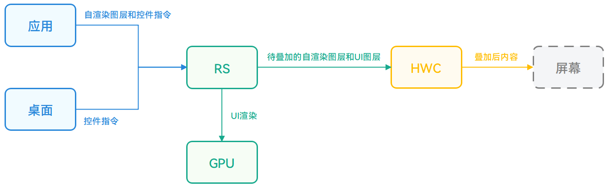
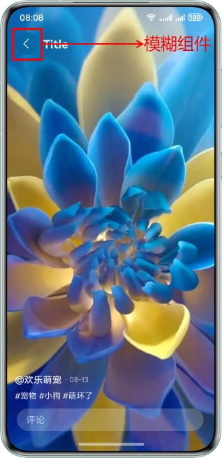
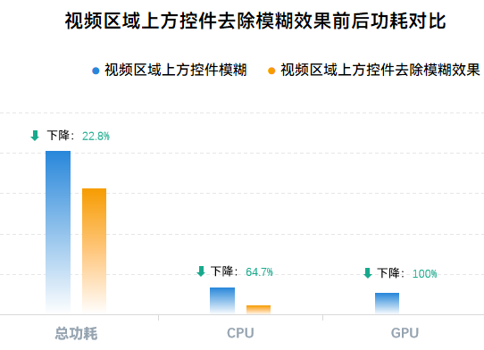
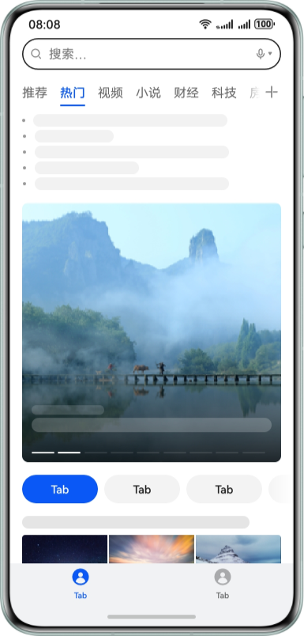
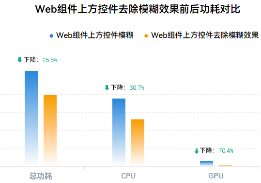
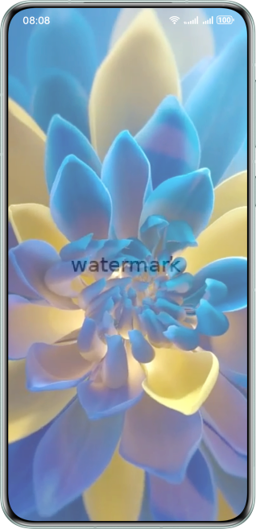
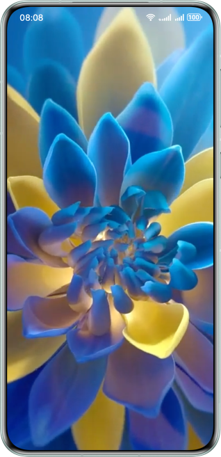
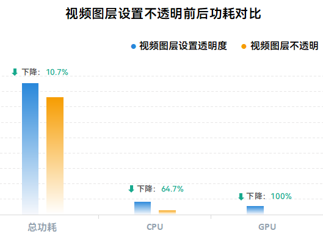

# 高效利用HWC的低功耗设计

更新时间：2026-03-12 08:45:02

来源：https://developer.huawei.com/consumer/cn/doc/best-practices/bpta-utilize-hwc-efficiently

## 概述


在应用开发中，开发者可以自由组合ArkUI定义控件、视频、图片、Web网页以及第三方渲染框架生成内容，以满足应用UI界面的需求。同时，HarmonyOS系统基于的芯片平台除了通用的CPU/GPU计算单元外，还提供了Hardware Composer（下文简称HWC）专用硬件辅助系统进行图形渲染送显，相对于通用计算单元，在图层叠加场景具有更高的处理效率和更低的能耗。作为专用硬件单元，HWC需要满足一定条件才能充分发挥其硬件能力，降低系统CPU/GPU开销，减少发热和卡顿现象的出现。

因此，在开发类似Web界面、视频播放等多图层叠加场景时，如果存在自渲染图层，可以通过以下两种方式调整视效设计，扩大HWC的生效范围：

- 避免非必要高阶视效控件与自渲染内容区域产生交叠。
- 合理调整ArkUI定义控件与自渲染图层间的交叠关系。


开发者可以根据实际业务适当调整界面视效设计，使系统能够充分发挥HWC的能效优势，降低对应操作场景的功耗，提升操作流畅性。


> [!NOTE]
> 高阶视效控件是指具有复杂视觉效果的控件，如模糊、反色等。这些效果需要对背景进行采样、颜色计算等操作。


## 实现原理


系统接收到应用的UI界面元素由两类组成，一类是直接使用ArkUI提供的现有接口定义的控件，如按钮、进度条、导航栏等，可以称为UI控件。另外一类是应用直接传递已经渲染好的内容，包括视频、图片、Web页面或调用自有或者三方渲染框架已经渲染好的内容（下文统一归类为应用自渲染内容）。

1. 直接调用ArkUI接口定义的控件，例如Row、Column、Text等。
```ts
@Entry
@Component
struct ArkUISample {
  @State message: string = 'Hello World';
  build() {
    Row() {
      Column() {
        Text(this.message)
        .fontSize(50)
        .fontWeight(FontWeight.Bold)
      }
      .width('100%')
    }
    .height('100%')
  }
}
```
 该内容将由系统根据组件定义及布局进行绘制，用户应用程序不感知具体的绘制过程。
2. 应用自渲染内容。
- Web页面：此时页面内容将直接替换为url地址传递的内容，使用示例见：[ArkWeb使用指导](https://developer.huawei.com/consumer/cn/doc/best-practices/bpta-arkweb_rendering_framework)。
- 视频场景：该类使用示例见[视频播放开发实践](https://developer.huawei.com/consumer/cn/doc/best-practices/bpta-video-playback-development-practice)。
- 三方或者自有渲染框架生成内容：使用Native Xcomponent组件和接口直接传递内容，使用示例见[Native XComponent的使用指导](https://developer.huawei.com/consumer/cn/doc/harmonyos-references/capi-oh-nativexcomponent-native-xcomponent)。

 这类内容在应用进程中解码或调用GPU渲染，然后作为整体传递给系统渲染服务进程。


系统在处理这两类界面元素时，会根据界面视效要求，综合调用GPU或HWC，以实现最佳能效。


### 图形渲染系统工作流程


下图介绍了图形渲染系统从应用界面内容到最终屏幕显示的工作流程。





- **RenderService (RS) ：**系统渲染服务进程，接收来自于其他系统服务进程（如桌面进程）及用户进程（如应用）的自渲染图层及ArkUI控件绘制指令，进行统一的组合以及渲染控制。其渲染调用CPU/GPU等计算器件，能力灵活，兼容性强，但功耗和性能开销较大。
- **Hardware Composer (HWC)：**HWC基于专用硬件构建，主要用于多图层叠加送显。接受RS绘制的图层和应用自渲染图层，将多个图层叠加后传递至屏幕。相对于GPU，HWC功耗和性能优势明显，但不具备复杂渲染能力。


### 图形渲染送显策略


当前系统的整体渲染送显策略描述如下：

RS进程将ArkUI控件统一绘制到UI图层。UI内容来自应用定义的ArkUI控件和桌面进程传递的内容，如状态栏、系统导航等。根据UI图层和应用自渲染内容的Z序关系，优先使用HWC的图层叠加功能进行送显处理。

在该过程中，UI控件的视效和自渲染图层的Z序关系会影响HWC的使用。例如，若自渲染图层上方的UI控件使用了模糊等高阶视效，模糊算法需要实时读取背景自渲染图层的内容，并在图层叠加时进行额外处理。此时，HWC无法使能，RS将使用GPU进行图层叠加。


### 如何高效使能HWC


这里结合HWC的特点以及当前系统的渲染送显策略给出如下两点建议，以提升HWC的生效范围，降低应用操作期间可能产生的发热及卡顿概率。

- **在存在自渲染图层的情况下，合理使用高阶视效控件，避免与自渲染内容产生交叠**如果UI控件使用模糊等高阶视效并与自渲染图层区域交叠，RS在绘制该控件时，需读取自渲染图层内容以正确绘制。相比无高阶视效的情况，此时需要额外读取内容，并直接使用GPU载入自渲染图层进行渲染。 如上过程会带来额外的CPU、GPU、DDR开销，导致功耗增加和性能下降。因此，建议开发者合理评估UI界面的视效需求，通过移除模糊等高阶视效或调整控件位置等方式，避免非必要高阶视效控件与自渲染图层交叠。

> [!NOTE]
> 上述优化建议仅从功耗优化角度出发，需要调整界面的视效设计，开发者可根据需要自行选择。


 **注****：****典型高阶视效动作****列表**

| 视效类型 | ArkUI接口 |
| --- | --- |
| 背景模糊 | .blur()；.backdropBlur() |
| 提亮 | .backgroundBrightness() |
| 灰阶 | .grayscale() |
| 阴影取色 | .shadow() |
| 压暗提亮 | .lightUpEffect() |
| 前景模糊 | .foregroundEffect() |

- **在存在自渲染图层的情况下，合理调整ArkUI定义控件与自渲染图层间的交叠关系**这里存在以下两种情况： UI控件定义在自渲染图层下方，且自渲染图层设置了一定透明度，导致自渲染图层无法完全遮挡UI控件。进行渲染处理时，需要额外处理透明度，此时只能使用GPU，无法使用HWC叠加能力。建议开发者评估自渲染图层设定透明度的必要性。若全透明，应及时下树。若UI控件需位于自渲染图层下方，建议该控件也使用自渲染形式实现。
- 两个或以上自渲染图层所在控件设定圆角且存在区域交叠时，进行自渲染图层处理需要GPU额外绘制圆角，这会导致无法使用HWC叠加能力。建议评估是否需要多个自渲染图层交叠及底部图层圆角是否可以去除。
- UI控件上方的视频图层具有一定透明度。
- 在视频弹幕图层和视频图层间直接用ArkUI控件定义水印控件。
- 多个视频窗口存在交叠且视频窗口存在圆角。


## 场景案例


### 场景一：在视频区域上方合理使用模糊控件


效果图





如上图，视频区域左上角的返回按钮控件带有模糊效果，需要进行视频图层采样，无法使用HWC叠加。可以通过移除控件的模糊效果或将其移动到非视频区域来启用HWC。

此处通过去除控件的模糊效果来使能HWC，从而优化场景功耗。相应对比代码如下：

视频上方叠加带有模糊效果的Image组件

```ts
@Entry
@Component
struct VideoWithBlur {
  // ...
  build() {
    NavDestination() {
      Stack() {
        // Video Layer
        Video({
          src: $r('app.media.test_video')
        })
        .height('100%')
        .width('100%')
        .loop(true)
        .autoPlay(true)
        .controls(false)

        RelativeContainer() {
          Row() {
            // The return button has a blurry effect
            Image($r('app.media.chevron_left'))
            .padding(12)
            .width(40)
            .height(40)
            .borderRadius('50%')
            .fillColor('rgba(255, 255, 255, 0.9)')
            .backgroundColor('rgba(0, 0, 0, 0.1)')
            .backdropBlur(40) // Set this component background blur
            .backgroundBlurStyle(BlurStyle.BACKGROUND_REGULAR)
            // ...
          }
          // ...
        }
        .width('100%')
        .height('100%')
        .padding({
          left: 16,
          right: 16,
          top: 36,
          bottom: 44
        })
      }
      .width('100%')
      .height('100%')
    }
    // ...
  }
```

视频上方Image组件去除模糊效果

```ts
@Component
struct NormalVideo {
  // ...
  build() {
    NavDestination() {
      Stack() {
        // Video Layer
        Video({
          src: $r('app.media.test_video')
        })
        .height('100%')
        .width('100%')
        .loop(true)
        .autoPlay(true)
        .controls(false)

        RelativeContainer() {
          Row() {
            // The return button does not have a blur effect
            Image($r('app.media.chevron_left'))
            .padding(12)
            .width(40)
            .height(40)
            .borderRadius('50%')
            .fillColor('rgba(255, 255, 255, 0.9)')
            .backgroundColor('rgba(0, 0, 0, 0.1)')
            // ...
          }
          // ...
        }
        .width('100%')
        .height('100%')
        .padding({
          left: 16,
          right: 16,
          top: 36,
          bottom: 44
        })
      }
      .width('100%')
      .height('100%')
    }
    // ...
  }
```


去除模糊后的效果图如下所示。


功耗对比

同一界面下，测试视频区域上方控件去除模糊效果前后的CPU模块、GPU模块的功耗，以及设备总功耗。测试方式为视频播放30s，以3s为一个节点，取设备从6s运行到21s5个节点的平均功耗。最终，使用DevEco Studio的Profiler工具检测得到的数据如下图所示：





从测试数据可以看出：

1. 视频区域上方控件去除模糊效果后，CPU模块功耗下降64.7%，GPU模块功耗降至0，降幅100%。
2. 视频区域上方控件去除模糊效果后，总功耗明显下降，降幅约为22.8%。


测试数据表明，在视频播放场景下，去除视频区域上方控件的模糊效果并使能HWC，可以大幅减少GPU和CPU的功耗，同时显著降低设备总体功耗。


### 场景二：在Web类界面上方合理使用模糊控件


效果图


在该场景下，底部TabBar区域使用模糊，且背景区域使用Web类组件或者Native Xcomponent组件导入自渲染内容，同样导致UI图层与自渲染内容无法使用HWC叠加。对此开发者可以通过去除TabBar区域的模糊视效或者裁剪组件区域避免Web内容与模糊控件相交两种方式进行修改，以达到使用HWC降低功耗的目的。

此处通过移除控件的模糊效果来启用HWC，从而优化场景功耗。相应对比代码如下：

Web组件上方TabBar控件模糊

```ts
import { webview } from '@kit.ArkWeb';
// ...
@Entry
@Component
struct WebWithBlur {
  @State currentIndex: number = 0; // The index of the currently selected tab page
  private controller: TabsController = new TabsController();
  private webController: webview.WebviewController = new webview.WebviewController();
  // ...
  @Builder
  tabBuilder(title: string, targetIndex: number, selectedImg: Resource, normalImg: Resource) {
    // ...
  }

  build() {
    // ...
    Tabs({ barPosition: BarPosition.End, index: 0, controller: this.controller }) {
      TabContent() {
        Web({ src: $rawfile('test.html'), controller: this.webController })
      }
      .tabBar(this.tabBuilder('Tab', 0, $r('app.media.tab_icon_activated'), $r('app.media.tab_icon')))
      // ...
    }
    .height('100%')
    .width('100%')
    .barOverlap(true) // Set TabBar to be blurred and overlay on top of TabContent
    .barBackgroundColor('rgba(241, 243, 245, 0.3)')
    // ...
  }
}
```

Web组件上方TabBar控件去除模糊效果

```ts
import { webview } from '@kit.ArkWeb';
// ...
@Entry
@Component
struct NormalWeb {
  @State currentIndex: number = 0; // The index of the currently selected tab page
  private controller: TabsController = new TabsController();
  private webController: webview.WebviewController = new webview.WebviewController();
  // ...
  @Builder
  tabBuilder(title: string, targetIndex: number, selectedImg: Resource, normalImg: Resource) {
    // ...
  }

  build() {
    // ...
    Tabs({ barPosition: BarPosition.End, index: 0, controller: this.controller }) {
      TabContent() {
        Web({ src: $rawfile('test.html'), controller: this.webController })
      }
      .tabBar(this.tabBuilder('Tab', 0, $r('app.media.tab_icon_activated'), $r('app.media.tab_icon')))
      // ...
    }
    .height('100%')
    .width('100%')
    .barOverlap(true) // Set TabBar to overlay on top of TabContent
    .barBackgroundBlurStyle(BlurStyle.NONE) // Set TabBar to be not blurry
    .barBackgroundColor('rgba(241, 243, 245, 1)')
    // ...
  }
}
```

去除模糊后的效果图如下所示。





功耗对比

同一界面下，测试Web组件上方控件去除模糊效果前后的CPU模块、GPU模块的功耗，以及设备总功耗。测试方式为同样频率滑动界面30s，以3s为一个节点，取设备从6s运行到21s5个节点的平均功耗。最终，使用DevEco Studio的Profiler工具检测得到的数据如下图所示：





从测试数据可以看出：

1. Web组件上方控件去除模糊效果的效用主要体现在GPU模块，降幅约为70.4%。
2. Web组件上方控件去除模糊效果后，总功耗和CPU模块功耗均有下降，总功耗下降约25.5%，CPU模块下降约30.7%。


测试数据表明，在Web场景下，去除Web上方控件的模糊效果并启用HWC可以显著降低GPU模块的功耗，同时也能有效减少CPU模块和设备总体的功耗。


### 场景三：避免UI控件上方自渲染图层设置透明度


效果图





视频图层设置透明度后，可以透视底部UI控件，但需要GPU进行额外处理，无法使用HWC叠加。建议评估透明度设置的必要性，考虑调整视频图层为不透明。若必须设置透明度，可将UI控件置于视频图层上方或使用自绘制方式实现UI控件，以支持HWC。

通过调整视频图层的不透明度来使能HWC，从而优化功耗。相应对比代码如下：


视频图层设置透明度

```ts
@Entry
@Component
struct TransparentVideo {
  // ...
  build() {
    // ...
    RelativeContainer() {
      // Bottom UI component
      Image($r('app.media.watermark'))
      .width(200)
      .height(80)
      .alignRules({
        center: { anchor: '__container__', align: VerticalAlign.Center },
        middle: { anchor: '__container__', align: HorizontalAlign.Center }
      })
      // Video Layer
      Video({
        src: $r('app.media.test_video')
      })
      .height('100%')
      .width('100%')
      .loop(true)
      .autoPlay(true)
      .controls(false)
      .alignRules({
        top: { anchor: '__container__', align: VerticalAlign.Top },
        middle: { anchor: '__container__', align: HorizontalAlign.Center }
      })
      .opacity(0.7) // Set the transparency of the video layer
    }
    .height('100%')
    .width('100%')
  }
  // ...
}
```

视频图层不透明

```ts
@Entry
@Component
struct OpaqueVideo {
  // ...
  build() {
    // ...
    RelativeContainer() {
      // Bottom UI component
      Image($r('app.media.watermark'))
      .width(200)
      .height(80)
      .alignRules({
        center: { anchor: '__container__', align: VerticalAlign.Center },
        middle: { anchor: '__container__', align: HorizontalAlign.Center }
      })
      // Video Layer
      Video({
        src: $r('app.media.test_video')
      })
      .height('100%')
      .width('100%')
      .loop(true)
      .autoPlay(true)
      .controls(false)
      .alignRules({
        top: { anchor: '__container__', align: VerticalAlign.Top },
        middle: { anchor: '__container__', align: HorizontalAlign.Center }
      })
      .opacity(1) // Set the video layer to be fully opaque
    }
    .height('100%')
    .width('100%')
  }
  // ...
}
```

设置视频不透明后的效果图如下所示。





功耗对比

同一界面下，测试视频图层设置不透明前后的CPU模块、GPU模块的功耗，以及设备总功耗。测试方式为视频播放30s，以3s为一个节点，取设备从6s运行到21s5个节点的平均功耗。最终，使用DevEco Studio的Profiler工具检测得到的数据如下图所示：





从测试数据可以看出：

1. 视频图层设置为不透明后，CPU模块功耗下降约64.7%，GPU模块功耗降至0，降幅为100%。
2. 视频图层设置为不透明后，设备总功耗下降约10.7%。


测试数据表明，视频位于UI控件上方播放时，设置视频不透明并启用HWC可以显著降低GPU和CPU的功耗，从而有效降低设备总体功耗。


## 总结


本文基于HarmonyOS系统，介绍了如何充分利用HWC减少应用发热和卡顿的方案。通过Web界面和视频播放等常见场景的示例，展示了具体实施方法和效果。开发者可以参考这些建议，综合考虑视效、功耗和性能，提升应用的综合体验。


## 示例代码


- [高效利用HWC的低功耗设计](https://gitcode.com/harmonyos_samples/UtilizeHWCEfficiently)
