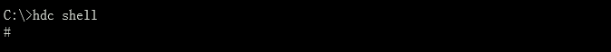
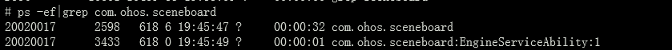
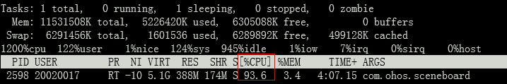

# 控制后台进程CPU使用率

更新时间：2026-03-12 08:45:02

来源：https://developer.huawei.com/consumer/cn/doc/best-practices/bpta-controlling-background-process-cpu

CPU使用率表示进程在CPU上的运行时间占总时间的百分比，计算公式为：CPU使用率 = 运行时间 / 总时间。单核CPU使用率的最大值为100%，多核CPU使用率的最大值为核数乘以100%。例如，8核CPU使用率的最大值为800%。
 
系统将进程的任务调度到多个CPU核上，进程在所有核上运行的时间总和与总时间的比值即为该进程的CPU使用率。例如，1秒内进程在所有核上运行的总时间为1.1秒，则该进程的CPU使用率为110%。
 

#### 约束

后台进程在10分钟内的单核CPU使用率不得超过80%。
 
短时任务后台进程CPU使用率约束：后台进程任务期间单核CPU使用率不得高于80%。
 
 

#### 调测验证
1. 连接设备，打开命令行窗口，输入hdc shell进入设备。

2. 输入ps -ef | grep bundleName，查询应用使用率的进程号。

3. 输入：top -p xxx，查看对应进程的使用率。查询结果中，CPU列显示进程的实时使用率。其中，xxx是进程ID(PID)。

