# 前台不可见动效问题分析

更新时间：2026-03-26 08:46:30

来源：https://developer.huawei.com/consumer/cn/doc/best-practices/bpta-frontend-invisible-animation-analysis

当开发者进行应用功耗基础质量测试或提交应用上架审核时，若遇到应用存在不可见动效的问题，可参考以下步骤进行分析。


## 异常场景确认


在应用提交至应用市场上架审核时，会检测动效在不可见时是否存在空刷的问题。开发者可以通过USB连接设备，按照以下命令打开图形相关的debug级别日志（直接在终端执行以下命令）：

```text
hdc shell hilog -b D -D 0xD001406
```

然后命令行执行如下流水日志采集命令，监控日志输出：

```text
hdc shell "hilog | grep 'Node skip'"
```

运行应用复现场景，观察日志打印情况。每一行“Node skip”打印代表有一帧统一合成图层存在空跑。若日志打印频率过高（超过5次/秒），可初步判定该界面存在前台不可见动效问题。


## 分析思路


前台不可见动效问题源于组件的生命周期管理与启停控制不当。以动图组件为例，当动图进入不可见状态但组件缺乏回调机制，或回调后未能成功停止，动图可能在软件全场景下空跑，导致严重的功耗异常和发热问题。前台不可见动效的检测可识别并防止组件在不可见状态下继续进行不必要的渲染和绘制操作，避免额外的CPU和GPU资源消耗。分析前台不可见动效问题，需具备充分的事件监听能力，及时感知事件变化并停止其刷新行为。典型事件包括应用切换到后台运行、组件被遮挡、切换到新页面、滑动到屏幕外部等。


| 问题大类 | 细分类别 | 根因 | 影响程度 | 是否触发图层空跑 |
| --- | --- | --- | --- | --- |
| 冗余动画 | 冗余动画 | 1. 应用使用了Animate方法，但绑定的组件生命周期管理存在缺陷。 2. 不恰当设置了repeat、duration或开启插帧特性导致帧率不符合预期的话。 | 中，动画下发后，UI侧无负载，但RS的DisplayNode合成受到部分影响。 | 一定。 |
| 应用进程下发的冗余绘制指令 | ArkUI组件存在绘制渲染任务 | 1. 组件离开屏幕后，依然在绘制刷新。 2. 非必要节点属性变更导致执行布局等刷新任务。 | 中，会对UI、RS进程产生影响，一些场景会被系统兜底，仅影响RS。 | 可能。 |
| 自定义组件更新 | 自定义的组件的属性或状态发生了更新，但在render_service侧判断不需要实际重绘屏 | 中，会对UI、RS进程产生影响 | 可能 |  |
| UI动画 | 在UI线程实现的动画步进的帧，但在render_service侧判断脏区为空 | 中，会对UI、RS进程产生影响 | 可能 |  |
| 使用Vsync方法执行绘制任务或较重的业务逻辑。 | 不恰当使用系统提供的DisplaySync方法执行绘制任务。 | 中，UI进程中有持续的DisplayVsync任务。 | 可能。 |  |
| 不恰当使用NativeVsync，造成一个较重的负载任务持续执行不停止。 | 大，由Vsync引起的空跑问题，高度依赖三方自行控制，系统难感知。 | 可能。 |  |  |
| 冗余自绘制Buffer类 | 应用申请了不必要的自绘制内容。 | 有Buffer持续生产，在轮转的最后一环，Buffer由于无需显示而在RSUni中Release。 | 大，独立的Buffer轮转负载影响RS，同时Buffer生产者的负载往往较重。 | 一定。 |


## 分析步骤


### Profiler工具分析（推荐）


在DevEco Studio6.0.0版本（手机版本需配套HarmonyOS 6.0.0及以上版本），针对前台不可见动效问题，增加了故障自动检测与分析能力，可通过以下步骤辅助问题定位：

1. 抓取Trace信息。点击Profiler工具，选择要分析的应用进程，创建一个Energy Session，按照复现路径操作应用进行测试。观察Energy Anomaly泳道，标注红色异常则为识别到的空跑异常。
2. 分析Trace信息。

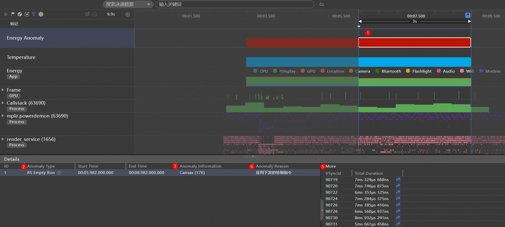
点击Energy Anomaly泳道红色区域，查看上报异常的详细信息，如上图所示，部分关键信息已用数字标号标记①：上报的异常信息 ②：Anomaly Type: 异常类型 ③：Anomaly Information: 异常组件信息 ④：Anomaly Reason: 异常原因 ⑤：More: 展示此种异常的具体异常帧信息
3. 点击Details的其中一个异常列会展示More信息
4. 选择其中一帧，点击跳转箭头，跳转到当前空跑帧的详细信息
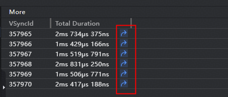

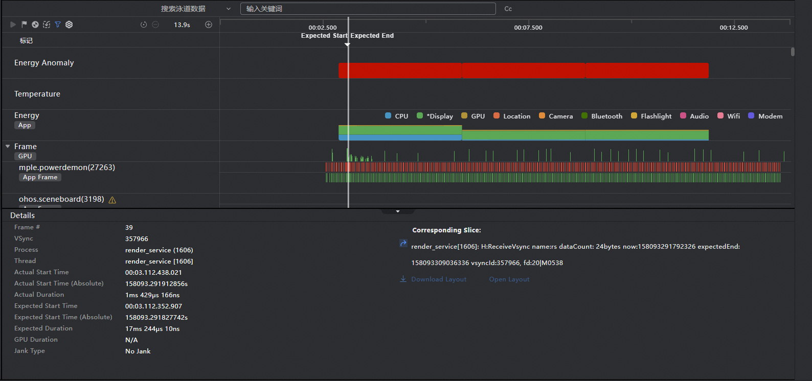
5. 在空跑帧界面，点击Details模块下的Open Layout打开布局信息展示
6. 在Component Tree展开布局组件，左边有感叹号图标的则为当前空跑帧的组件


### Trace分析


开发者也可以直接分析Trace对这个问题进行分析定位：

1：通过DevEco Profiler工具创建一个Energy会话，录制上述场景复现的过程。

2、通过trace分析确认问题是否成功复现。Trace抓取后展开render_service进程，重点关注子线程render_service（负责UI绘制指令的统一、动画的执行等）、RSUniRenderThre（负责图层绘制、多图层效果合成）以及CompThread（负责屏幕显示）。如下图所示，若发现RSUniRenderThre中含“H:DisplayNode skip”(对应图层是ScreenNode)，意味着当前帧已生成好的统一绘制图层ScreenNode，此时无需进行屏幕显示（通常是由于屏幕内容实际无变化），此时开发者需排查UI组件是否存在空刷问题。若ScreenNode图层成功显示，可在CompThread中找到“H:ReleaseBuffer name: ScreenNode”。


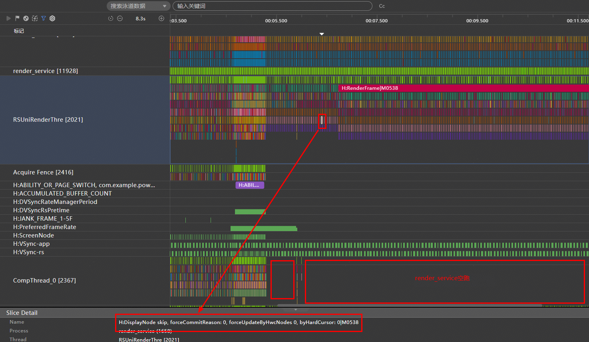


3、ScreenNode作为HarmonyOS提供的统一绘制图层，若由UI下发的绘制指令在实际绘制完成后，并不会带来页面的实际刷新时，系统会触发ScreenNode skip，避免重复的页面在屏幕上刷新造成硬件功耗。故而ScreenNode skip问题的解决，依赖开发者通过Trace分析结合实际在代码中的组件刷新相关业务，分析其合理性和必要性找到问题组件。


## 常见故障根因


### 应用进程下发的冗余绘制指令


1、工具分析（推荐）

通过DevEco的Profiler工具Energy模板分析，可直接看到异常的组件和异常类别信息，如下图所示：


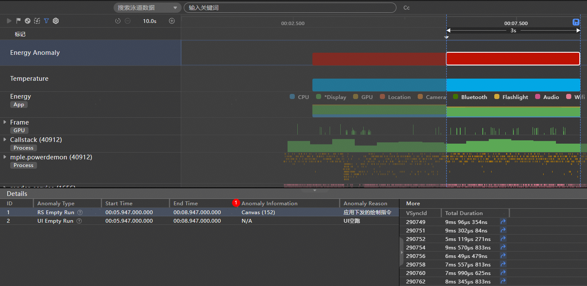


在Energy Anomaly泳道，点击红色异常时间点，在Details栏，出现RS empty run且Anomaly Reason为“应用下发绘制指令”，表示此处出现应用进程下发的冗余绘制指令导致的Render Service进程空跑问题，Anomaly Information展示的组件信息（图中组件为Canvas，组件的ArkUI Id为152），More栏显示具体的动画空跑帧。

2、Trace分析

通过DisplayNode skip找到空跑的故障帧，在render_service线程的trace中找到接收处理应用下发绘制指令请求的trace点，查找关键字RSMainThread::ProcessCommandUni，如下图所示表示处理来自进程40912进程的绘制指令，正在执行序列号为1532的指令内容。


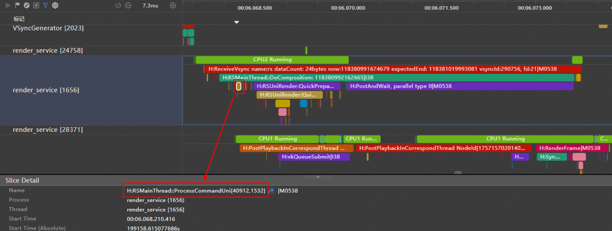


开发者可以根据这一信息搜索[40912,1532]，找到Trace点信息H:MarshRSTransactionData cmdCount: 2, transactionFlag:[40912,1532]，该Trace点在此帧中有2个（cmdCount）绘制指令由应用下发给RS。可以继续通过关键字“H:FlushRenderTask”或“H:CustomNodeUpdate”查看具体的ArkUI节点信息。

该故障类型优化建议，参见不可见组件低功耗建议。


### 冗余动画


1、工具分析（推荐）

通过DevEco的Profiler工具Energy模板分析，可直接展示异常的组件和异常类别信息，如下图所示：


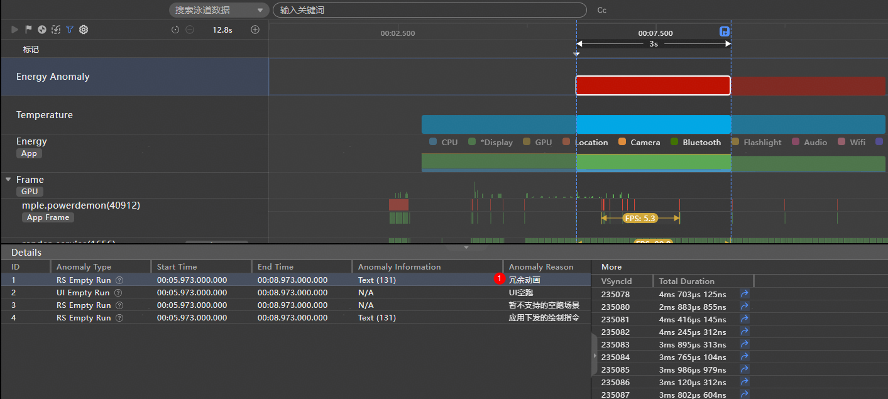


在Energy Anomaly泳道，点击红色异常时间点，在Details栏，出现了RS empty run且Anomaly Reason为“冗余动画”，表示此处出现不可见动画导致的Render Service进程空跑问题，More栏显示具体的动画空跑帧，其中Anomaly Information展示的组件信息（图中组件为Text，组件的ArkUI Id为131），More栏显示具体的动画空跑帧。

2、Trace分析

在应用指令绘制下发的模式中，ProcessCommandUni主要满足组件即时刷新需求，除此之外，应用还可以通过Animate方式刷新DisplayNode。应用设置好动画的持续时间（dur）、执行次数（repeat）、动画接口（animateType）等参数后，其第一帧通过应用UI线程下发动画的绘制指令（ProcessCommandUni），如下图所示，动画的详细执行过程，可以在Frame泳道查看，后续的动画帧均可在render_service线程内请求Vsync。


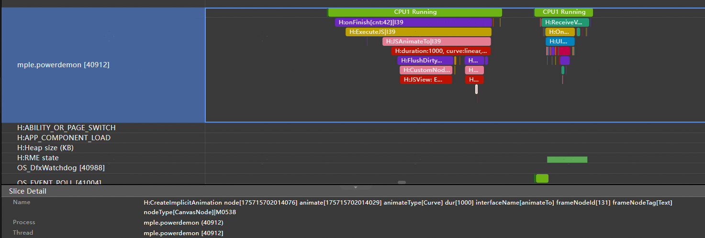


如下图，开发者可以在H:Animate中查找找到动画下发的线程（标志1所示，来自进程40980），以及动画的执行信息（标志2所示），其中标志2会打印出animation node，该node id可在ArkUI树上找到。对于Animate类问题，由于duration和repeat属性存在，动画往往会在render_service中自请求Vsync持续一段时间，若这段时间里动画节点被隐藏或销毁时，可能会导致H:Animate空跑问题。


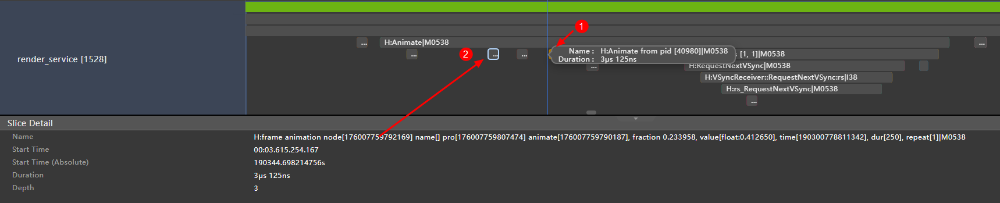


开发者可根据此渲染节点的ID，从ArkUI的树状结构（ArkUI Tree）信息（txt格式）中查找对应组件在ArkUI中的ArkUI ID，通过以下示例代码导出ArkUI树。

```text
hdc shell "hidumper -s WindowManagerService -a '-a'"
@set /p windowId=input WindowId :
hdc shell "hidumper -s WindowManagerService -a '-w %windowId% -default -c'" > arkui.dump
```

将上面的代码保存为bat文件，点击执行即可，在输入栏输入“Focus window:”的ID（表示此窗口的ID），就能生成ArkUI树的txt格式文件（注意：这个命令因为安全的限制，需要debug签名的应用才能正常展示）。开发者可在ArkUI树文件中通过搜索动画node，找到该node对应的ArkUI组件ID。


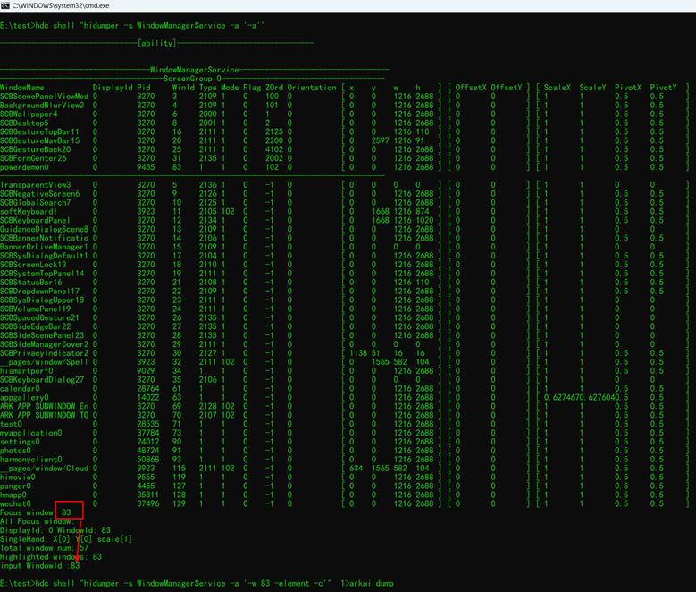

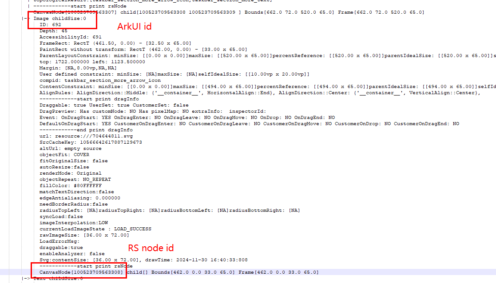


3、优化建议：

- 帧率建议：动效帧率将直接决定RS核心渲染业务的执行频率，考虑到实际的显示效果，建议开发者将整体动画控制帧率不超过60fps
- 开发者需谨慎设置duration和iteration，防止转场时因组件隐藏、析构导致空跑问题。
- 对于需要执行动画的组件，需确保组件进入不可见状态或析构时，动画行为已停止，可通过重新下发一个duration为0的动画，覆盖当前仍未跑完的动效。
- 对于[AnimateTo](https://developer.huawei.com/consumer/cn/doc/harmonyos-references/ts-explicit-animation)、[keyframeAnimateTo](https://developer.huawei.com/consumer/cn/doc/harmonyos-references/ts-keyframeanimateto)等动画，动画的UI侧行为均表现为H:JSAnimateTo。在开发时，AnimateTo类动画推荐通过UIContext创建，在获取组件上下文的基础上，可以规避多数空动画的产生，单个组件可以在不同的条件下创建不同的AnimateTo，推荐开发者使用[this.getUIContext()?.](https://developer.huawei.com/consumer/cn/doc/harmonyos-references/arkts-apis-window-window#getuicontext10)完成动画的创建。


### 冗余自绘制Buffer


1、工具分析（推荐）

通过DevEco的Profiler工具Energy模板分析，可直接看到异常的组件和异常类别信息，如下图所示：


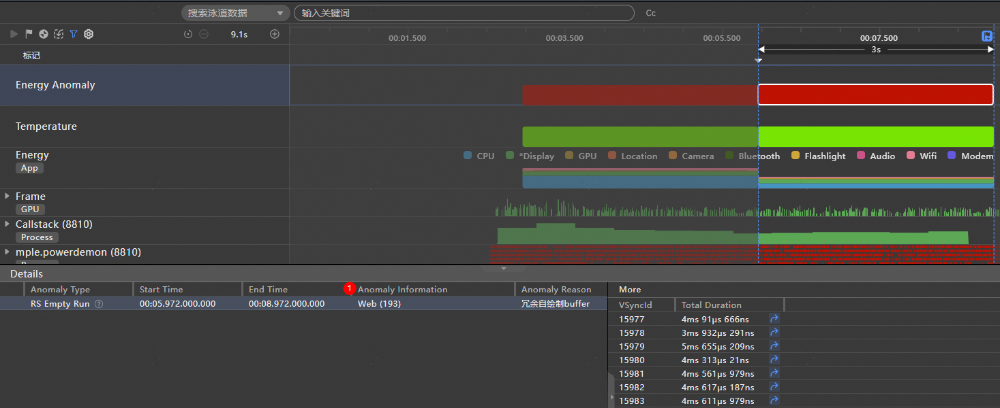


在Energy Anomaly泳道，点击红色异常时间点，在Details栏，出现RS empty run且Anomaly Reason为“冗余自绘制buffer”，表示此处出现冗余自绘制buffer导致的Render Service进程空跑问题，其中Anomaly Information展示的组件信息（图中组件为Web，组件的ArkUI Id为193），More栏显示具体的动画空跑帧。

2、Trace分析


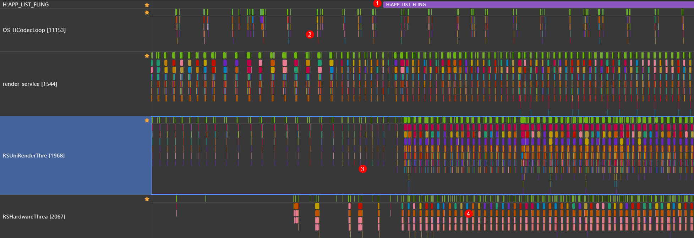


在上图Trace中，分别在RSHardware和RSUni中搜索“H:ReleaseBuffer name:”，如果Buffer内容成功在屏幕上显示，Release将出现在RSHardware进程的末尾位置，表明Buffer在使用完成后释放，重新回到BufferQueue。


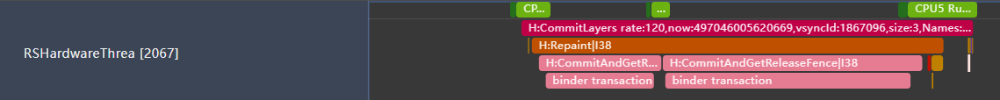


如果Buffer未实际显示，ReleaseBuffer将在RSUni中进行，表明此帧Buffer触发系统兜底，无需在RSHardware中显示，该Buffer从生产到传输过程中的负载均无法体现在显示效果上，属于冗余负载。在打印信息H:ReleaseBuffer name: xxx queueId: 6631429506443 seq: 97784892中，开发者可确认该空跑Buffer的序列id为97784892。


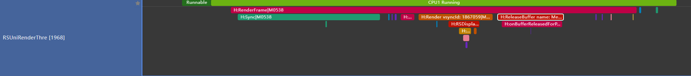


进一步定位，在render_service中搜索“seq = 【空跑Buffer id】”：当开发者在RSUniRenderThre中发现一个空跑的BufferQueue，可从中找到一个Buffer id，如100151309在render_service中搜索。搜索结果Trace会显示出该Buffer在申请完成后，其位置所在RS树的node id与其父组件的node id。随后开发者可以参考场景2中的方法，通过ArkUI树，搜索找到该Buffer对应的ArkUI组件。


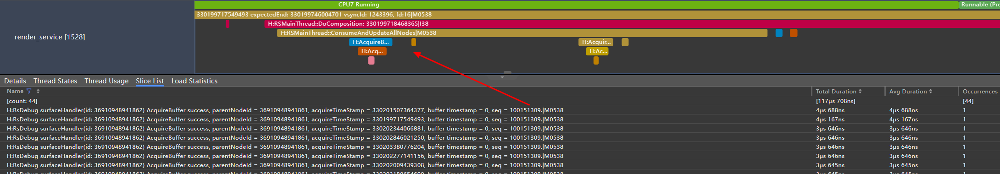


3、优化建议

该故障类型的优化建议，请参考Buffer低功耗优化。


## 定位根因


获取ArkUI组件id后，开发者可充分利用DevEco Studio提供的ArkUI Inspector工具进行布局分析，定位更多组件信息。结合代码逻辑，与问题复现时的组件状态对比，重点关注以下信息：

1. 组件位置：若组件位于屏幕外，但处于活跃态，需审视代码中是否缺乏对该组件可见性的监听，确保离屏后停止刷新。
2. 组件结构：排查该组件是否有被遮挡的可能性，与当前显示节点是否有父子兄弟关系，是否属于下拉、弹窗类动效，在未被拉起时提前创建，导致空跑。
3. 父子组件的Attribute变量：右侧搜索框会显示组件封装时的各个变量状态，开发者可排查与播放控制相关的自定义变量是否符合预期。


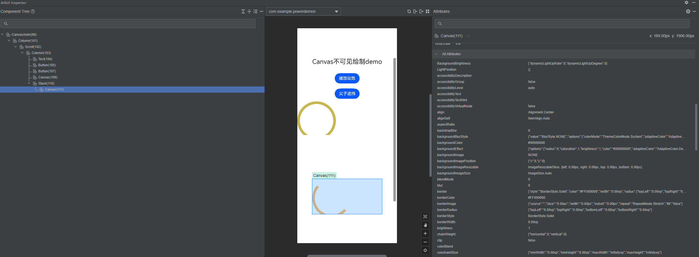
