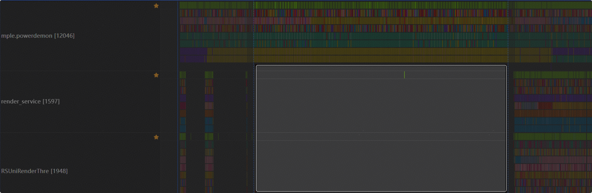
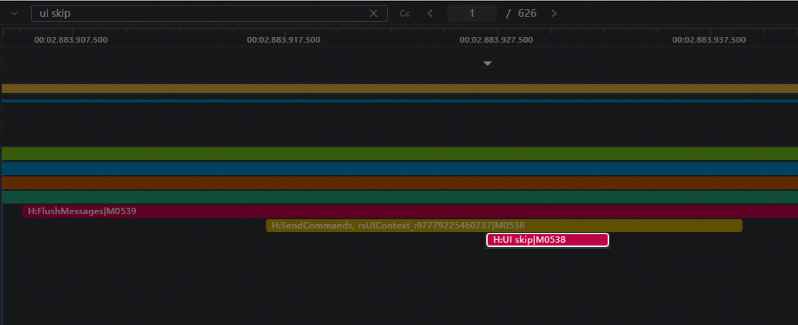
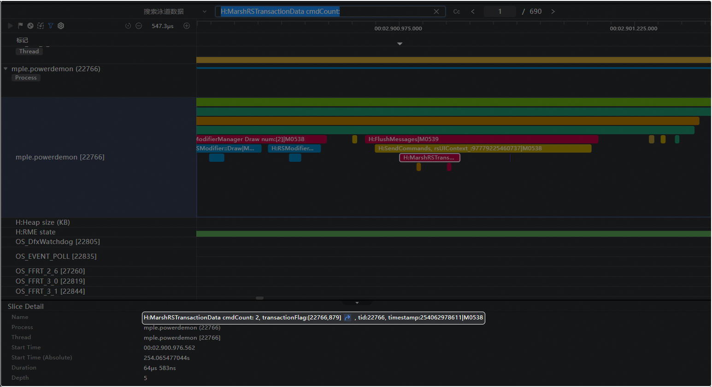
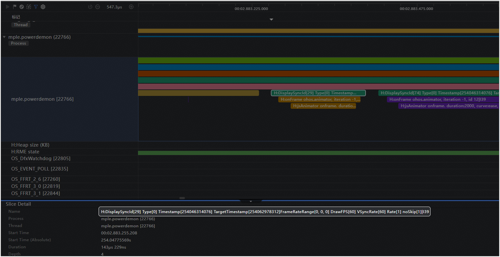
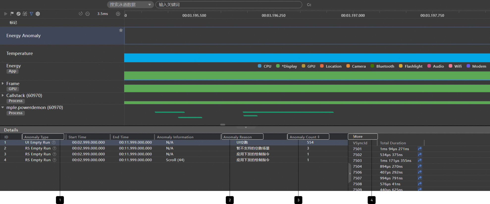
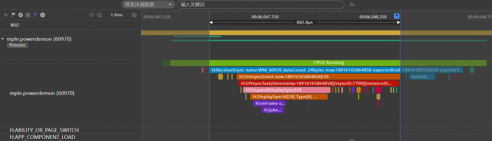
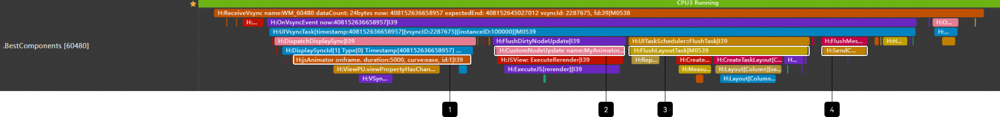

# 应用UI进程空跑问题分析

更新时间：2026-04-27 09:23:00

来源：https://developer.huawei.com/consumer/cn/doc/best-practices/bpta-ui-skip-analysis

#### 应用UI进程空跑介绍

应用UI进程空跑主要指在应用界面无实际变化、无用户交互、无可见动画播放等情况下，应用进程仍以固定帧率刷新。
 
如下图所示，为一个UI空跑的trace示例，图中应用主线程powerdemon以90Hz刷新，但在高亮框选区域，render_service线程对应的帧未刷新，表明期间应用主线程powerdemon未递交有效绘制指令给render_service进行绘制，产生空帧。这些空帧通常由应用注册帧回调但实际无节点脏区引起。
 



 
开发者可进一步在空刷帧中搜索“FlushMessages”，如下图所示，当“FlushMessages”下方存在“UI skip”时，表示该帧未递交任何绘制指令，属于UI空跑。
 



 
对比下图的非UI空跑场景，“FlushMessages”下方发现“H:MarshRSTransactionData cmdCount: 2, transactionFlag:[22766,879]”字样时，可确认该帧有绘制指令递交，将引起下一帧render_service的RS树准备工作。其中22766表示下发绘制指令的线程ID，879表示帧数据的索引，“cmdCount:2”表示绘制指令数量为2，有两个arkui节点在该帧被标脏。
 



 
 

#### 分析思路

 

#### 使用Trace分析

开发者可在Profiler中的Energy模板录制一段trace分析，以找到UI帧空帧的原因。关键Trace：H:DisplaySyncId[29] Type[0]... 其中Type的类型是导致刷帧的原因，包括：
 
Type[-1]：Other，三方自申请的回调接口
 
Type[0]：Animator
 
Type[1]：Xcomponent
 



 
 

#### 使用Profiler的Energy工具分析（推荐）

在DevEco Studio 6.1版本（手机版本需配套HarmonyOS 6.1及以上版本），针对UI空刷问题，增加了自动检测与分析能力，可通过以下步骤辅助问题定位:
 1. 抓取Trace信息点击Profiler工具，选择要分析的应用进程，创建一个Energy Session，操作应用进行测试。
2. 查看异常信息点击Energy Anomaly泳道，在Detail栏展示异常信息，其中UI Empty Run表示存在UI空刷异常。

  图中① AnomalyType: 异常类型，② Anomaly Reason: 异常原因，③ Anomaly Count: 异常的帧数，④ More: 异常帧。
 



 1. 查看单帧详情信息在More栏，点击其中一帧，在应用的主线程泳道，查看H:DisplaySyncId关键字的Trace，依据Type确认根因类型。
 



 
 

#### 常见故障根因

 

#### Animator动画

Animator是一种依赖DisplaySync机制产生UI刷新的动画机制。如下图“1”处所示，“jsAnimator onframe, duration: 5000, curve: ease, id:1”表明，该动效持续时间为5000ms，动效曲线为ease，Animator的ID为1。
 



 
开启hdc shell param set persist.ace.debug.enabled 1开关后，如果该Animator导致实际的组件属性更新，下方会有打印信息如下：
- H:ViewPU.viewPropertyHasChanged MyAnimatorTest wid 1 6 0 false
- H:ViewPU.viewPropertyHasChanged MyAnimatorTest hei 1 6 1 false

 
 
重点关注其中提到的MyAnimatorTest、wid、hei三处信息，这表明该Animator的执行在MyAnimatorTest组件上进行，受影响的状态变量为wid与hei。此外，下图标志“2”“3”“4”处会打印组件脏区刷新、FlushTask以及SendCommand的信息，证实了该Animator的效果在递交绘制指令时，是通过组件变量wid、hei更新来完成的。
 


 

Animator发生空跑的主要根因是，组件被析构或进入不可见状态时，Animator未主动设置停止或取消。由于Animator本身是独立的回调对象，不会与组件一对一关联，系统无法代为回收这些持续产生空跑的对象。
 

 
 
开发者在使用Animator时，可遵循以下两个要点：
 1. 确保组件析构时，Animator执行finish，并置空，可有效规避空跑问题与内存泄漏风险。
2. 组件添加可见性回调，Animator默认不播放，当且仅当组件位于可见状态时，执行play。
 
```text
let expectedFrameRate: ExpectedFrameRateRange = {
  min: 0,
  max: 120,
  expected: 30
}

@Component
export struct MyAnimatorTest {
  private TAG: string = '[AnimatorTest]'
  private backAnimator: AnimatorResult | undefined = undefined
  private flag: boolean = false
  @State wid: number = 100
  @State hei: number = 100

  create() {
    this.backAnimator = this.getUIContext()?.createAnimator({
      // 建议使用 this.getUIContext().createAnimator()接口
      duration: 5000,
      easing: "ease",
      delay: 0,
      fill: "forwards",
      direction: "normal",
      iterations: 1,
      begin: 100, //动画插值起点
      end: 200, //动画插值终点
    })
    this.backAnimator.setExpectedFrameRateRange(expectedFrameRate)
    this.backAnimator.onFinish = () => {
      this.flag = true
      console.info(this.TAG, 'backAnimator onFinish')
    }
    this.backAnimator.onRepeat = () => {
      console.info(this.TAG, 'backAnimator repeat')
    }
    this.backAnimator.onCancel = () => {
      console.info(this.TAG, 'backAnimator cancel')
    }
    this.backAnimator.onFrame = (value: number) => {
      this.wid = value
      this.hei = value
    }
  }

  aboutToDisappear() {
    // 由于backAnimator在onframe中引用了this, this中保存了backAnimator，
    // 在自定义组件消失时应该将保存在组件中的backAnimator置空，避免内存泄漏
    this.backAnimator?.finish();
    this.backAnimator = undefined;
  }

  build() {
    Column() {
      Column() {
        Column()
          .width(this.wid)
          .height(this.hei)
          .backgroundColor(Color.Red)
          .onVisibleAreaChange([0.0, 1.0], (isExpanding: boolean, currentRatio: number) => {
            if (!isExpanding && currentRatio <= 0.0) {
              console.info('Component is completely invisible.')
              this.backAnimator?.pause()
            }
          })
      }
      .width('100%')
      .height(300)

      Column() {
        Row() {
          Button('create')
            .fontSize(30)
            .fontColor(Color.Black)
            .onClick(() => {
              this.create()
            })
        }
        .padding(10)

        Row() {
          Button('play')
            .fontSize(30)
            .fontColor(Color.Black)
            .onClick(() => {
              this.flag = false
              if (this.backAnimator) {
                this.backAnimator.play()
              }
            })
        }
        .padding(10)
      }
    }
  }
}
```
 

#### DisplaySync

DisplaySync支持开发者以[指定帧率运行UI业务](https://developer.huawei.com/consumer/cn/doc/harmonyos-guides/displaysync-ui)，主要用于精细控制绘制帧率的场景，如动态帧率动画、为特定UI组件设置独立于系统刷新率的绘制帧率等。
 
推荐的优化措施：
 
1.  若开发者希望注册监听窗口帧率变化用于分析UI卡顿、丢帧、FPS监控等场景，建议通过接入ohos.window提供的[frameMetricsMeasured](https://developer.huawei.com/consumer/cn/doc/harmonyos-references/arkts-apis-window-window#onframemetricsmeasured22)接口，该接口仅在客户端UI内容发生重绘时（如页面切换、与可响应组件交互、设置背景色和透明度等）触发注册的回调。
 
2. 在使用DisplaySync实现自定义动画、独立的UI绘制控制等场景时，需做好生命周期管理，具体优化方案参照[displaySync优化案例](https://developer.huawei.com/consumer/cn/doc/best-practices/bpta-vsync-power-optimization)。
