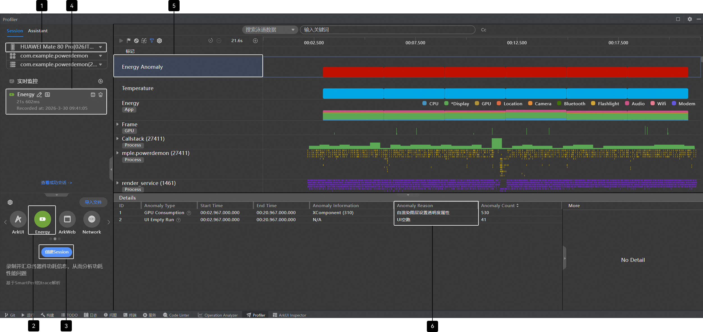
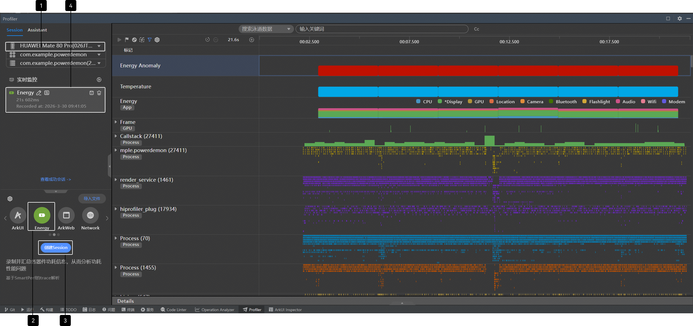
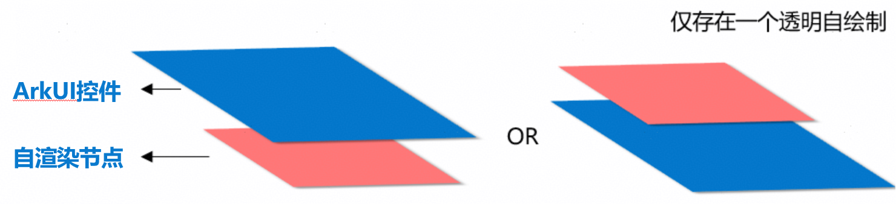
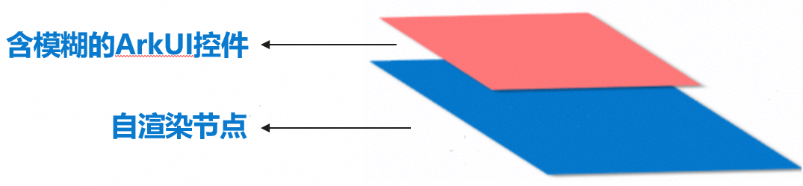

# 自渲染图层未使用硬件合成问题分析

更新时间：2026-04-27 09:23:00

来源：https://developer.huawei.com/consumer/cn/doc/best-practices/bpta-hwc-self-rendering-layer-analysis

#### 自渲染图层使用硬件合成介绍

自渲染通常用于实现复杂的视觉效果、高性能的图形处理或特定的交互需求，这些需求无法通过标准控件或组件完全满足。[应用自渲染内容](https://developer.huawei.com/consumer/cn/doc/best-practices/bpta-utilize-hwc-efficiently#section17455334154818)可以包含开发者自定义绘制的内容，如视频帧、Web页面、复杂的动画效果等。自渲染图层通常与其他标准控件或图层一起使用，形成多图层叠加的界面。
 
对于HarmonyOS应用开发中的多图层叠加渲染送显场景，除了使用GPU这种通用计算单元外，HarmonyOS系统还提供了[Hardware Composer](https://developer.huawei.com/consumer/cn/doc/best-practices/bpta-utilize-hwc-efficiently#li10223152812152)（下文简称HWC）专用硬件合成单元。与GPU相比，HWC在图层叠加场景中具有更高的处理效率和更低的能耗。需要注意的是，并非所有包含自渲染图层的叠加场景都能使用HWC，它需要满足一定条件才能充分发挥其硬件能力，降低系统CPU/GPU开销，减少发热和卡顿现象。
 
 

#### 问题定位流程

对于能够使用HWC进行多图层叠加渲染送显的场景，如果未满足HWC的使用条件，则会使用GPU合成，此时达不到功耗最优，可能影响用户体验。在HarmonyOS应用开发过程中，开发者可以使用[DevEco Profiler](https://developer.huawei.com/consumer/cn/doc/best-practices/bpta-low-power-design-in-dark-mode#section239515015451)工具分析多图层叠加渲染送显方式。以视频播放场景为例，使用Profiler分析自渲染图层叠加方式的方法如下:
 
 

#### Profiler工具抓取trace（推荐）：

1. 连接设备：将设备通过USB连接到计算机。
 
2. 选择应用程序：进入视频播放，在Profiler中按照图中①选择应用进程com.example.powerdemon。
 
3. 选择Energy：点击②选择Energy。
 
4. 创建Session：点击③创建Session。
 
5. 开始录制&结束录制：点击④开始录制/结束录制。
 
6. 等待解析完成，点击展开⑤Energy Anomaly。
 
7. 在Details栏的Anomaly Reason中可以看到影响功耗的原因，如自渲染图层设置透明度属性有120帧，这些帧都会使用GPU合成。
 

 
 

#### 基于Trace分析

1. 连接设备：将设备通过USB连接到计算机上。
 
2. 选择应用程序：进入视频播放，在Profiler中按照图中①选择应用进程com.example.powerdemon。
 
3. 选择Energy：点击②选择Energy。
 
4. 创建Session：点击③创建Session。
 
5. 开始录制&结束录制：点击④开始录制/结束录制。
 

 
6. 等待解析完成，点击展开render_service进程。
 
7. 在搜索框搜索DrawImage(GPU)，按下回车，如果搜索数量为0，且在展开的render_service进程中的RSUniRenderThre线程中没有DrawImage(GPU)打点，则表明该场景使用HWC硬件合成；否则，如果搜索数量不为0，并且在展开的render_service进程中的RSUniRenderThre线程中有DrawImage(GPU)打点，则表明该场景使用GPU合成。
 

 
 

#### 常见问题根因

包含自渲染图层的多图层叠加场景不能使用HWC叠加的常见问题如自渲染图层设置了透明度、自绘制图层上方叠加带有模糊效果的ArkUI控件等。
 
 

#### 自渲染图层设置透明度

当存在透明自渲染图层时，由于RS节点遍历中，自绘制节点不知道其透明区域是否可以被下方不透明的UI节点填充，因此必须使用GPU叠加，避免显示问题。 示例图如下所示，红色区域表示自渲染图层，蓝色表示UI图层。
 
 

 
如果自渲染图层设置了透明度，使用GPU合成，为了达到更优的性能功耗，在非必要的情况下，建议开发者去除自渲染图层的透明度。示例见：[避免UI控件上方自渲染图层设置透明度修改指导](https://developer.huawei.com/consumer/cn/doc/best-practices/bpta-utilize-hwc-efficiently#section1547428193417)。
 

#### ArkUI控件模糊与自渲染图层存在交叠

如下图，ArkUI控件使用模糊等高阶视效并与自渲染图层区域交叠，RS在绘制该控件时，需读取自渲染图层内容以正确绘制。相比无高阶视效的情况，此时需要额外读取内容，并直接使用GPU载入自渲染图层进行渲染。此过程会带来额外的CPU、GPU、DDR开销，导致功耗增加和性能下降。
 

 
因此，建议开发者合理评估UI界面的视效需求，通过移除模糊等高阶视效或调整控件位置等方式，避免非必要高阶视效控件与自渲染图层交叠。去除UI控件的模糊效果后使能HWC合成，从而优化场景功耗。示例见：[在视频区域上方合理使用模糊控件修改指导](https://developer.huawei.com/consumer/cn/doc/best-practices/bpta-utilize-hwc-efficiently#section137998513411)。
