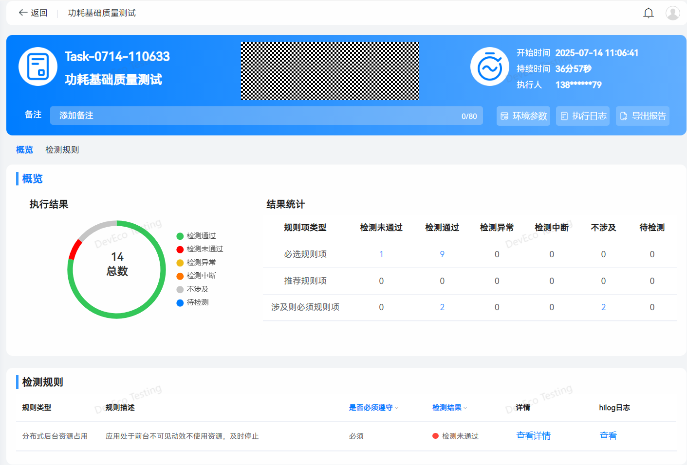
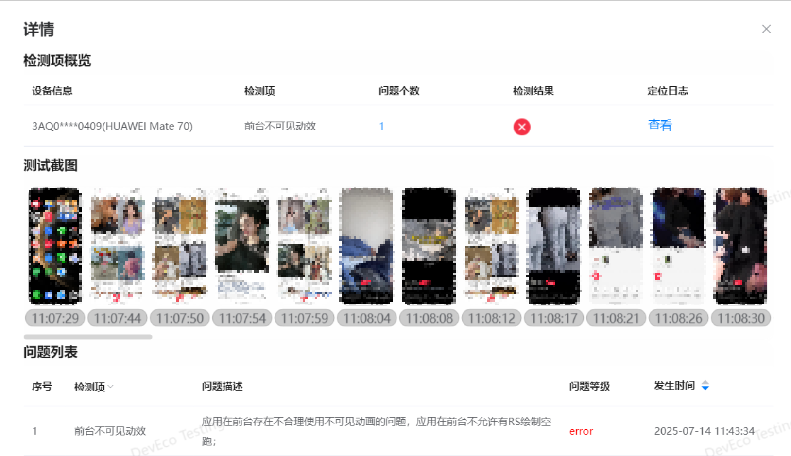

# 功耗基础质量测试

更新时间：2026-03-12 08:45:02

来源：https://developer.huawei.com/consumer/cn/doc/best-practices/bpta-power-basic-quality-test

功耗基础质量测试的适用场景：保障HarmonyOS应用功耗质量和体验满足商用要求，识别应用存在的明显功耗异常，应用上架时，应用市场也会进行功耗基础质量测试，避免应用上架后出现因高耗电导致设备快速发热、续航缩短的严重问题。常用的工具有DevEco Studio开发工具中Tools->AppAnalyzer、[DevEco Testing](https://developer.huawei.com/consumer/cn/doc/harmonyos-guides/deveco-testing)，开发者也可以在上架前进行基础质量测试，提高应用上架的效率。
 
在应用开发过程中，由于未及时释放资源或接口不合理的使用等因素，常常会出现如下典型的功耗问题。
 1. 应用前台不可见动效使用资源未及时停止。应用动画被遮挡或处于屏幕顶层的时候，应用未及时停止动画渲染。
2. 申请长时任务的应用退后台CPU负载大于80%。应用开发过程申请长时任务退后台后未及时释放系统资源。如异常资源持续打印、多线程调用异常资源导致系统负载高等情况。
 
应用功耗基础质量测试主要涉及前台和后台功耗管控两种场景：
 
- 后台场景指的是当应用未处于设备屏幕顶层时，用户无法直接看到或进行操作的场景，应用需满足最基本的后台功耗体验要求： 如应用退后台对蓝牙、麦克风、定位等器件的合理使用，持锁资源的及时释放，以及申请长/短时任务的应用退后台后CPU负载约束等。
- 前台场景指的是当应用处于设备屏幕的顶层时，用户可以直接看到并进行操作的场景，应用需满足最基本的前台功耗体验要求：如不可见动效及时停止刷新，音乐类、导航类正确配置应用类型，正确使用平台的视频硬件编码器等。

 
应用功耗测试需要检测应用前后台功耗管控行为，可以使用DevEco Testing提供的“应用功耗基础质量测试”服务进行自动化检测。为了确保业务场景测试覆盖充分，测试前需进行应用账号登录以及相关业务预置操作，整个测试过程前后台累计操作需持续30分钟以上。
 
测试完成后，功耗测试报告如下图所示，客观呈现了前后台功耗管控规则整体达成情况。
 

 
其中，检测未通过项和异常项可以进一步查询详细的测试数据与日志，用户可通过测试过程截图进行问题复现，查看日志进行问题分析定位。
 

 

 

为了确保功耗测试准确性和稳定性，在测试前需清理设备后台应用、检查应用账号是否登录，测试过程中保持USB稳定连接不断开。
