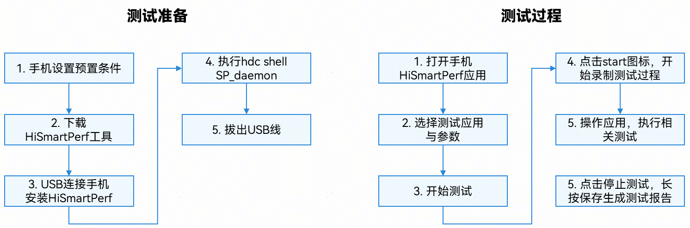
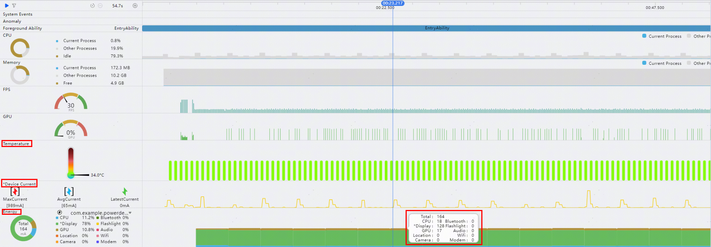
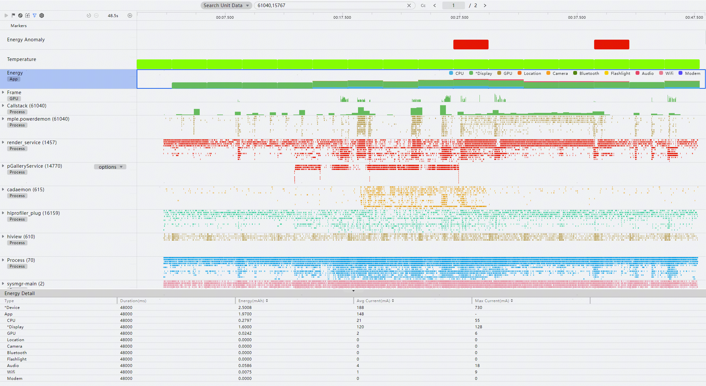

# 场景功耗测试

更新时间：2026-03-12 08:45:02

来源：https://developer.huawei.com/consumer/cn/doc/best-practices/bpta-application-power-test

场景功耗测试用于评估应用在静态场景（如界面静置，不进行任何操作）和动态场景（如视频播放、页面滑动浏览）下的功耗水平。该测试旨在衡量应用在实际使用中的耗电情况，为开发者提供持续优化应用功耗的依据，从而提升用户的续航体验。此外，通过在相似场景下进行对比测试，有助于开发出更具竞争力的产品。本节将详细介绍两种常用的功耗及热影响检测工具。
 

##### HiSmartPerf功耗检测

 
[HiSmartPerf工具](https://developer.huawei.com/consumer/cn/agconnect/huawei-smartperf/)能够快速采集应用帧率、整机功耗及温度等关键信息，并在测试结束后生成测试报告。该工具主要适用于开发人员和测试人员所开展的场景功耗测试。具体操作步骤如下图所示。
 

 
手动设置预置条件：
 1. 点击“设置”→“显示和亮度”，将“自动调节”设为“关闭”，将“休眠”设为“10分钟后”。
2. 如果需要进行多次测试，网络环境需保持一致（确保都使用Wi-Fi或者数据业务）。
 
测试完毕后，在HiSmartPerf的测试报告页面查看温度上升及电流数据（参考下表典型值）。
 
下表是基于华为Mate 60Pro典型场景的整机电流参考值（屏幕亮度固定为最大亮度的50%，连接Wi-Fi），若偏差超过100mA，建议重点关注。
  
| 场景 | 电流参考值 |
| 亮屏音乐播放 | 270mA~300mA。 |
| 视频全屏播放 | 350mA~400mA。 |
| 新闻滑动（5s滑动一次） | 350mA~400mA。 |
| 小视频播放 | 300mA~350mA。 |
| 使用相机场景 | 700mA~800mA。 |
 
 

##### Profiler功耗检测

DevEco Profiler工具是[DevEco Studio](https://developer.huawei.com/consumer/cn/deveco-studio/)内置的场景化分析工具。它提供了实时监控（Realtime Monitor）和录制后分析的功能，主要适用于开发人员对应用功耗进行度量与优化的场景。
 
使用Profiler工具时，通常需要通过USB连接手机。为减少USB充电对数据准确性的影响，建议启用“开发者选项”中的“关闭充电”功能（插拔USB可能会影响该设置）。具体操作路径如下：“设置”→“系统”→“开发者选项”（若系统中未显示“开发者选项”，可点击“设置”→“关于本机”→“软件版本”，直到提示“开启开发者选项”）。
 1. 实时监控界面：可以在实时监控界面实时查看应用在静态（无操作）或者操作过程中的温度、整机电流、应用耗电以及各器件的功耗数据，如下图所示。

  
Temperature（温度）：用于检测应用运行时的设备温度，采集周期为3s。若功耗过高，可能会导致温度上升和设备发热，[不同热等级系统进行相应的热管控](https://developer.huawei.com/consumer/cn/doc/harmonyos-references/js-apis-thermal#thermallevel)，从而影响应用的整体使用体验。
2. Device Current（设备电流）：显示当前设备的最大电流、平均电流以及最新的电流值（若出现负数，则表明设备正在充电）。
3. Energy（功耗）：展示各项部件（重点关注CPU、Display、GPU）在周期内的平均功耗占比，采集周期为3s。
4. 通过场景化模板先录制后分析：Profiler工具提供了Energy、 Frame等场景化模板，支持录制功耗等相关的数据，同时可集成hitrace、hiperf等信息，便于开发者进行深入分析，Energy泳道如下图所示。

