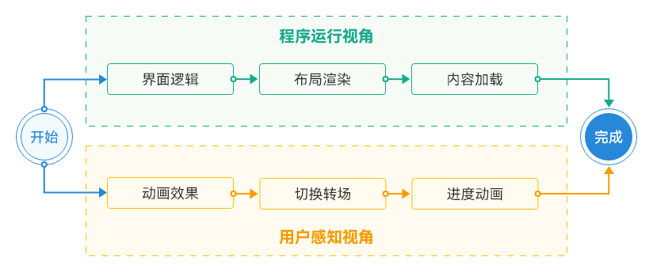

# 感知流畅优化

更新时间：2026-03-12 08:45:02

来源：https://developer.huawei.com/consumer/cn/doc/best-practices/bpta-perceived-smoothness

**      

在应用开发中，动画可以为用户界面增添生动、流畅的交互效果，提升用户对应用的好感度。然而，滥用动画也会导致应用性能下降，消耗过多的系统资源，甚至影响用户体验。关于感知流畅度优化方法，请参阅[提升动画感知流畅度](https://developer.huawei.com/consumer/cn/doc/best-practices/bpta-fair-use-animation#section6998195315306)。

##### 视觉感知优化

应用的卡顿会导致视觉不流畅，引起用户不适。因此，用户操作后应立即提供视觉反馈，以缓解不适感。

开发者可以在用户交互动作开始时，添加动画元素，如单击效果、转场缩放、加载进度条和共享动画。这些动画可以告知用户当前状态已发生变化，应用程序正在快速运作。动画背后涉及数据计算、布局渲染和内容加载。当新界面渲染完成，动画元素可通过渐变消失或移出屏幕等友好的方式退出视觉区域。

图1 **应用响应的两个视角     

##### 转场场景动效感知流畅

HarmonyOS系统为开发者提供了丰富的转场动效库，使开发者能够轻松实现各种转场动画效果。开发者可以根据具体需求，在应用的不同场景中应用这些转场动效，以提升用户体验和界面的吸引力。需要注意的是，为了最佳的用户体验，开发者应根据界面的功能和特点，合理选择转场动效，并遵循动效的使用准则，以确保转场动效在视觉和交互上的一致性。关于转场场景的方案选型请参阅[转场场景设计](https://developer.huawei.com/consumer/cn/doc/best-practices/bpta-page-transition#section199394454818)。

转场动画分为基础转场和高级模态转场，具体类型如下：

 - [出现/消失转场](https://developer.huawei.com/consumer/cn/doc/harmonyos-guides/arkts-enter-exit-transition)：对新增、消失的控件实现动画效果，是通用的基础转场效果。
 - [导航转场](https://developer.huawei.com/consumer/cn/doc/harmonyos-guides/arkts-navigation-navigation)：页面的路由转场方式，对应一个界面消失，另外一个界面出现的动画效果，如设置应用一级菜单切换到二级界面。关于导航转场案例请参阅[导航转场模板实现层级转场](https://developer.huawei.com/consumer/cn/doc/best-practices/bpta-page-transition#section92341720171119)。
 - [模态转场](https://developer.huawei.com/consumer/cn/doc/harmonyos-guides/arkts-modal-transition)：新的界面覆盖在旧的界面之上的动画，旧的界面不消失，新的界面出现，如弹框就是典型的模态转场动画。关于模态转场案例请参阅[模态转场模板实现通用转场](https://developer.huawei.com/consumer/cn/doc/best-practices/bpta-page-transition#section1269248173010)。
 - [共享元素转场 (一镜到底)](https://developer.huawei.com/consumer/cn/doc/harmonyos-guides/arkts-shared-element-transition)：共享元素转场是一种界面切换时对相同或者相似的元素做的一种位置和大小匹配的过渡动画效果。
 - [页面转场动画（不推荐）](https://developer.huawei.com/consumer/cn/doc/harmonyos-guides/arkts-page-transition-animation)：页面的路由转场方式，可以通过在pageTransition函数中自定义页面入场和页面退场的转场动效。为了实现更好的转场效果，推荐使用[导航转场](https://developer.huawei.com/consumer/cn/doc/harmonyos-guides/arkts-navigation-navigation)和[模态转场](https://developer.huawei.com/consumer/cn/doc/harmonyos-guides/arkts-modal-transition)。
 - [旋转屏动画增强](https://developer.huawei.com/consumer/cn/doc/harmonyos-guides/arkts-rotation-transition-animation)：在原旋转屏动画基础上，可配置渐隐和渐现的转场效果。

##### 合理动画时长使应用感知流畅

页面转场动画时长直接影响用户交互体验，过长的动画时长会显著延迟用户操作响应

常见的页面转场动画时长参数有：

 - [Tabs](https://developer.huawei.com/consumer/cn/doc/harmonyos-references/ts-container-tabs)组件设置TabContent切换动画时长，即[animationDuration](https://developer.huawei.com/consumer/cn/doc/harmonyos-references/ts-container-tabs#animationduration)属性。
 - [Swiper](https://developer.huawei.com/consumer/cn/doc/harmonyos-references/ts-container-swiper)组件设置子组件切换动画时长，即[duration](https://developer.huawei.com/consumer/cn/doc/harmonyos-references/ts-container-swiper#duration)属性。
 - 页面间转场（[pageTransition](https://developer.huawei.com/consumer/cn/doc/harmonyos-references/ts-page-transition-animation)）设置转场动画时长，即[PageTransitionOptions](https://developer.huawei.com/consumer/cn/doc/harmonyos-references/ts-page-transition-animation#pagetransitionoptions对象说明)对象中的duration字段。具体案例可以参考[动画时延场景案例](https://developer.huawei.com/consumer/cn/doc/best-practices/bpta-application-latency-optimization-cases#section36181326113013)。

##### 使用连贯动画使应用快速响应

通过连贯动画，让应用使用者在操作过程中感受到快速响应。

应用识别拖动手势事件时需要设置合理的拖动距离，设置不合理的拖动距离会导致滑动不跟手、响应时延慢等问题。针对此类问题可以通过设置distance大小来解决。具体案例可以参考[减小拖动识别距离](https://developer.huawei.com/consumer/cn/doc/best-practices/bpta-application-latency-optimization-cases#section1116134115286)。
