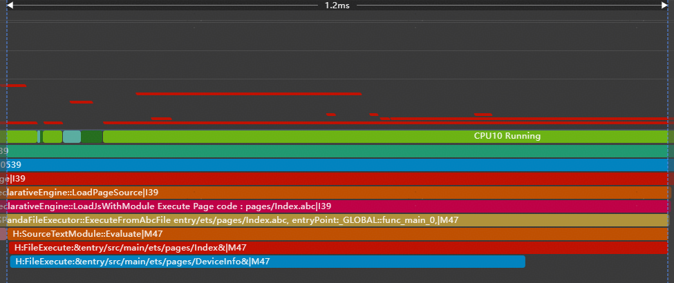
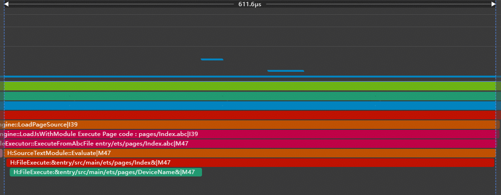
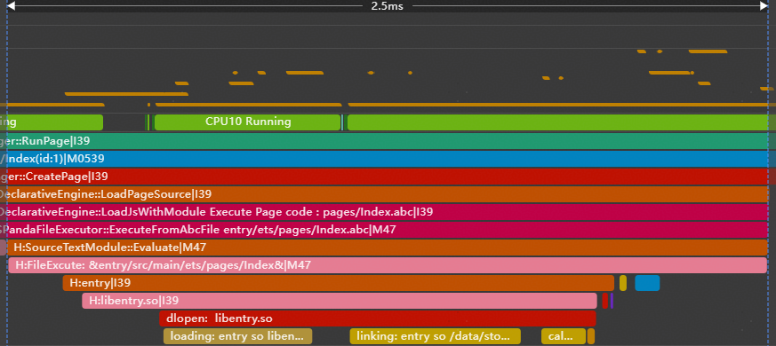
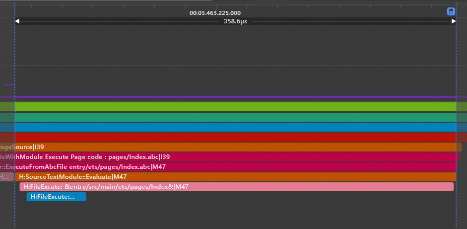

# 操作延时触发

更新时间：2026-04-01 09:49:00

来源：https://developer.huawei.com/consumer/cn/doc/best-practices/bpta-delayed-trigger-operation

#### **延迟加载Lazy-Import与动态加载await import**

 
随着业务规模不断扩大，很多应用在冷启动时会静态import大量模块，这种静态import会在应用初始化阶段同步加载所有依赖模块，导致冷启动耗时增加。ArkTS 提供了[Lazy-Import](https://developer.huawei.com/consumer/cn/doc/harmonyos-guides-V5/arkts-lazy-import-V5)能力和[动态加载](https://developer.huawei.com/consumer/cn/doc/harmonyos-guides/arkts-dynamic-import)（动态import）能力，使模块可在真正需要时再加载，从而提升应用启动速度，并有效降低资源消耗。
 
- 动态加载（动态import）是一种异步模块加载机制，允许应用程序在运行时按照实际需求去加载相关模块。例如在用户交互等条件触发时，再动态加载特定模块，可以减少初始化import的加载时间和资源消耗，这将有助于提高应用程序的内存性能和响应速度。
- 延迟加载（Lazy-Import）是一种延缓模块加载的机制，可以使待加载文件在冷启动阶段不被加载，而在后续导出变量被真正使用时再同步加载执行文件，从而节省资源以提高应用冷启动性能。具体案例与实验数据请参阅[延迟加载Lazy-Import使用指导](https://developer.huawei.com/consumer/cn/doc/best-practices/bpta-arkts-high-performance#section12861143418213)。

 
两种延时加载方案的区别。具体请参阅[Lazy-Import与动态加载的区别](https://developer.huawei.com/consumer/cn/doc/harmonyos-guides/arkts-lazy-import#lazy-import与动态加载的区别)。
 


 

延迟加载（lazy-Import）会改变模块执行顺序，可能导致预期的全局变量未定义。具体场景请参阅[Lazy-Import加载副作用](https://developer.huawei.com/consumer/cn/doc/harmonyos-guides-V5/arkts-module-side-effects-V5#延迟加载lazy-import改变模块执行顺序可能导致预期的全局变量未定义)。
 

 

#### 延迟加载Lazy-Import

 
**模块导入延迟到业务附近**
 
一些应用在冷启动阶段会加载过多未使用模块，针对这种情况导致的启动缓慢问题，开发者可以对冷启动阶段未使用的模块进行 Lazy-Import 改造，使模块导入延迟到对应业务附近加载，从而有效缩短冷启动时间，最终提升用户的启动体验。案例可参考[模块导入延迟到业务附近](https://developer.huawei.com/consumer/cn/doc/harmonyos-guides/arkts-lazy-import#使用示例)。
 
**延迟加载非关键路径模块**
 
下面示例中，所有变量均从DeviceInfo模块中导出。除了冷启动用到的name模块，一些非关键路径模块（如screen和storage）也一起被导出。
 



 
```ArkTS
// entry\src\main\ets\pages\Index.ets
// Before optimization: All variables are exported from the user info
import { hilog } from '@kit.PerformanceAnalysisKit';
import { name, screen, storage } from './DeviceInfo';

@Entry
@Component
struct Index {
  build() {
    RelativeContainer() {
      Text(name)
        .id('HelloWorld')
        .fontSize($r('app.float.page_text_font_size'))
        .fontWeight(FontWeight.Bold)
        .alignRules({
          center: { anchor: '__container__', align: VerticalAlign.Center },
          middle: { anchor: '__container__', align: HorizontalAlign.Center }
        })
        .onClick(() => {
          hilog.info(0x0000, 'testTag', 'screen: %{public}s', screen);
          hilog.info(0x0000, 'testTag', 'storage: %{public}s', storage);
        })
    }
    .height('100%')
    .width('100%')
  }
}
```
 
```ArkTS
// entry\src\main\ets\pages\DeviceInfo.ets
import { hilog } from '@kit.PerformanceAnalysisKit';

const name = 'Mate 70';
hilog.info(0x0000, 'testTag', 'export %{public}s', name);
const screen = 'OLED';
hilog.info(0x0000, 'testTag', 'export %{public}s', screen);
const storage = '512GB';
hilog.info(0x0000, 'testTag', 'export %{public}s', storage);

export { name, screen, storage };
```
 
使用体检工具[体检工具](https://developer.huawei.com/consumer/cn/doc/best-practices/bpta-application-cold-start-optimization#section16955857103112)可以查看冷启动阶段未使用的模块和这些模块的加载耗时。将这些未使用模块（storage和screen）从关键路径中剥离，添加lazy标识进行延迟加载。修改后，从下图Trace中可以观察到冷启动阶段仅加载了DeviceName模块。OtherDeviceInfo模块被推迟到用户首次点击文本时才会执行。从修改前后的Trace可以看出，冷启动耗时有所降低。
 



 
```ArkTS
// entry\src\main\ets\pages\Index.ets
// After optimization: split variables are exported from different modules
import { hilog } from '@kit.PerformanceAnalysisKit';
import { name } from './DeviceName';
import lazy { screen, storage } from './OtherDeviceInfo';

@Entry
@Component
struct Index {
  build() {
    RelativeContainer() {
      Text(name)
        .id('HelloWorld')
        .fontSize($r('app.float.page_text_font_size'))
        .fontWeight(FontWeight.Bold)
        .alignRules({
          center: { anchor: '__container__', align: VerticalAlign.Center },
          middle: { anchor: '__container__', align: HorizontalAlign.Center }
        })
        .onClick(() => {
          hilog.info(0x0000, 'testTag', 'screen: %{public}s', screen);
          hilog.info(0x0000, 'testTag', 'storage: %{public}s', storage);
        })
    }
    .height('100%')
    .width('100%')
  }
}
```
 
```ArkTS
// entry\src\main\ets\pages\DeviceName.ets
import { hilog } from '@kit.PerformanceAnalysisKit';

const name = 'Mate 70';
hilog.info(0x0000, 'testTag', 'export %{public}s', name);

export { name };
```
 
```ArkTS
// entry\src\main\ets\pages\OtherDeviceInfo.ets
import { hilog } from '@kit.PerformanceAnalysisKit';

const screen = 'OLED';
hilog.info(0x0000, 'testTag', 'export %{public}s', screen);
const storage = '512GB';
hilog.info(0x0000, 'testTag', 'export %{public}s', storage);

export { screen, storage };
```
 

#### 动态加载await import

**动态加载冷启动未用到的so**
 
 
下面示例在应用启动时，界面仅需显示基础文本信息，但可以从下图的Trace中看到一个本地so库（libentry.so）被同步导入。该SO库包含数学运算功能，在用户点击界面之前不需要加载和初始化。
 
```ArkTS
// entry\src\main\ets\pages\Index.ets
// Before optimization: statically import the so that is not used in cold start
import { hilog } from '@kit.PerformanceAnalysisKit';
import testNapi from 'libentry.so';
import { title } from './name';

@Entry
@Component
struct Index {
  build() {
    Row() {
      Column() {
        Text(title)
          .fontSize($r('app.float.page_text_font_size'))
          .fontWeight(FontWeight.Bold)
          .onClick(() => {
            hilog.info(0x0000, 'testTag', 'Test NAPI 2 + 3 = %{public}d', testNapi.add(2, 3));
          })
      }
      .width('100%')
    }
    .height('100%')
  }
}
```
 
```ArkTS
// entry\src\main\ets\pages\name.ets
export const title = 'HarmonyOS';
```
 



 
使用[体检工具](https://developer.huawei.com/consumer/cn/doc/best-practices/bpta-application-cold-start-optimization#section16955857103112)记录冷启动Trace，识别启动阶段未使用的模块及其加载耗时。在该示例中，不需要在用户点击事件前加载[libentry.so](https://libentry.so/)模块，建议删除import testNapi from 'libentry.so'语句，仅在需要使用时通过import()函数动态加载该模块。下图为修改后采集的冷启动Trace，从图中可以看到冷启动阶段不再加载libentry.so。从修改前后的Trace可以看出降低了冷启动的耗时。
 
```ArkTS
// entry\src\main\ets\pages\Index.ets
import { hilog } from '@kit.PerformanceAnalysisKit';
import { title } from './name';

@Entry
@Component
struct Index {
  build() {
    Row() {
      Column() {
        Text(title)
          .fontSize($r('app.float.page_text_font_size'))
          .fontWeight(FontWeight.Bold)
          .onClick(async () => {
            // After optimization: The SO file is dynamically loaded at the point of use.
            let ns: ESObject | null = null;
            try {
              ns = await import('libentry.so');
              hilog.info(0x0000, 'testTag', 'Test NAPI 2 + 3 = %{public}d', ns.default.add(2, 3));
            } catch (error) {
              hilog.error(0x0000, 'testTag', `Load so failed, code is ${error.code}, message is ${error.message}`);
            }
          })
      }
      .width('100%')
    }
    .height('100%')
  }
}
```
 



 

#### **延迟执行资源释放操作**

将资源关闭和释放操作放在[setTimeout](https://developer.huawei.com/consumer/cn/doc/harmonyos-references/js-apis-timer#settimeout)函数中执行，使其延迟到系统相对空闲的时刻进行，可以避免在程序忙碌时段占用关键资源，提升整体性能及响应能力。例如相机正常使用后，[延迟执行释放相机资源](https://developer.huawei.com/consumer/cn/doc/best-practices/bpta-application-latency-optimization-cases#section8783201923819)的相关操作。
