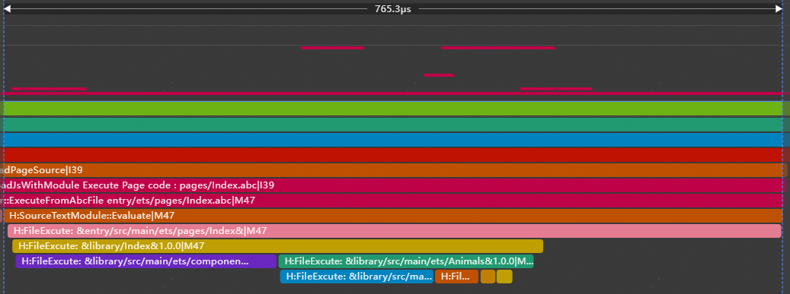
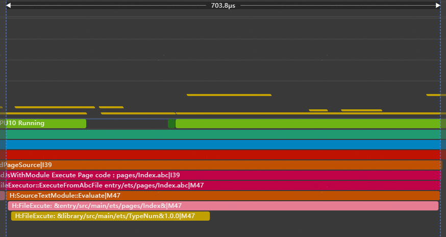

# 运行效率提高

更新时间：2026-03-12 08:45:02

来源：https://developer.huawei.com/consumer/cn/doc/best-practices/bpta-improve-running-efficiency

在开发过程中，优化影响性能的代码片段，以提高运行效率。以下实践总结了一些高性能的写法和建议：


## 变量声明


- 对于初期明确不会改变的变量，尽量[使用const声明常量](https://developer.huawei.com/consumer/cn/doc/best-practices/bpta-arkts-high-performance#section11738469467)。这里的常量包括基础类型和引用类型。通过const声明，可以确保地址不会变化，减少因误操作导致的赋值错误，从而避免逻辑改变，并在编辑时及时发现错误。
- 对于number类型，编译器在优化时会区分int和double类型。开发者在初始化number类型的变量时[指定number的类型](https://developer.huawei.com/consumer/cn/doc/best-practices/bpta-arkts-high-performance#section999716366470)，如果预期是整数类型就初始化为0，小数类型就初始化为0.0，避免将一个number类型初始化为undefined或者null。
- ESObject主要用于ArkTS和TS/JS跨语言调用的类型标注。在非跨语言场景中使用ESObject会引入不必要的跨语言调用，造成额外性能开销。建议在非跨语言调用的场景下[减少使用ESObject](https://developer.huawei.com/consumer/cn/doc/best-practices/bpta-arkts-high-performance#section7831352488)，引入明确的类型进行注释。


## 属性访问


- 在要求性能的场景下，建议通过使用将全局变量存储为局部变量的方式来[减少变量的属性查找](https://developer.huawei.com/consumer/cn/doc/best-practices/bpta-arkts-high-performance#section1754105654816)，访问局部变量比访问全局变量更快。重复访问同一变量会造成不必要的消耗，尤其是在循环中，对性能的影响更大。
- 在ArkTS中，类结构的属性支持private、protected和public可访问修饰符。默认情况下，属性的可访问修饰符为public。[给类属性添加访问修饰符](https://developer.huawei.com/consumer/cn/doc/best-practices/bpta-arkts-high-performance#section743155016482)选取适当的可访问修饰符可以提升代码的安全性、可读性。


## 数值计算与数据结构


- 如果是纯数值计算的场合，推荐[数值计算使用TypedArray](https://developer.huawei.com/consumer/cn/doc/best-practices/bpta-arkts-high-performance#section1169143314502)数据结构。TypedArray类型化数组是一种类似数组的对象，提供在内存缓冲区中访问原始二进制数据的机制。在图像数据处理和加解密计算中使用TypedArray可以提高数据处理效率，因为TypedArray基于ArrayBuffer实现，性能方面有显著提升。
- 通过[选取合适的数据结构](https://developer.huawei.com/consumer/cn/doc/best-practices/bpta-arkts-high-performance#section941819318528)提高运行效率。例如，使用Record作为临时容器处理属性存取逻辑，或使用HashMap实现快速读写键值。HashMap是ArkTS提供的高性能容器类，底层使用红黑树实现，支持高效的数据读写操作。


## 减少同文件大量export *导出方式和延迟加载


- 由于依赖模块解析采用深度优先遍历，会从入口文件的第一个导入语句开始逐层查找，直到最后一个没有导入语句的模块。连接好该模块的导出变量后，再回到上一级模块重复此步骤。因此[减少同文件大量export *导出方式](https://developer.huawei.com/consumer/cn/doc/best-practices/bpta-arkts-high-performance#section1218510102815)，降低依赖模块解析、文件执行阶段耗时增长。
- 当工具类中存在较多暴露函数或变量时，推荐按需引用使用到的变量，[延迟加载](https://developer.huawei.com/consumer/cn/doc/best-practices/bpta-arkts-high-performance#section12861143418213)可以减少该阶段中.ets文件执行耗时，即减少文件中所有export变量的初始化过程。


## 通过路径展开提升运行效率


传统HAR包导入即使只需要HAR包中单个变量，也会触发整个依赖链所有模块的加载和执行，造成性能浪费。ArkTS编译器提供expandImportPath（工程级配置、模块级配置）配置项。通过修改配置项，编译器会将间接包名导入转换为精准的文件路径导入，跳过中间模块。该优化可消除冗余的模块解析和初始化，减少冷启动阶段不必要的资源消耗。


由于import路径展开会跳过中间模块的执行，若业务依赖模块的执行顺序，修改后可能会导致业务异常。具体场景请参阅import路径展开副作用。


### 场景案例


未使用路径展开

在以下示例中，即使只需要使用typeNum变量，但当使用import *全量导入HAR包时，所有关联模块（如Animals.ets等）仍会被加载执行，这会带来不必要的性能开销。

```ts
// entry\src\main\ets\pages\Index.ets
// Before optimization: Namespace Import
import { hilog } from '@kit.PerformanceAnalysisKit';
import * as library from 'library';

hilog.info(0x0000, 'testTag', 'library.typeNum is %{public}d', library.typeNum);

@Entry
@Component
struct Index {
  @State message: string = 'Hello World';

  build() {
    RelativeContainer() {
      Text(this.message)
      .id('HelloWorld')
      .fontSize($r('app.float.page_text_font_size'))
      .fontWeight(FontWeight.Bold)
      .alignRules({
        center: { anchor: '__container__', align: VerticalAlign.Center },
        middle: { anchor: '__container__', align: HorizontalAlign.Center }
      })
      .onClick(() => {
        this.message = 'Welcome';
      })
    }
    .height('100%')
    .width('100%')
  }
}
```

```text
// library\src\main\ets\Animals.ets
import { hilog } from '@kit.PerformanceAnalysisKit';

export * from './Birds';

export * from './Fish';

export * from './Mammals';

export * from './TypeNum';

hilog.info(0x0000, 'testTag', 'library Animals.ets execute.');
```

```ts
// library\src\main\ets\Birds.ets
import { hilog } from '@kit.PerformanceAnalysisKit';

export const birds: string = 'Butterflies';

hilog.info(0x0000, 'testTag', 'library Birds.ets execute.');
```

```ts
// library\src\main\ets\Fish.ets
import { hilog } from '@kit.PerformanceAnalysisKit';

export const fish: string = 'carp';

hilog.info(0x0000, 'testTag', 'library Fish.ets execute.');
```

```ts
// library\src\main\ets\Mammals.ets
import { hilog } from '@kit.PerformanceAnalysisKit';

export const mammals: string = 'cat';

hilog.info(0x0000, 'testTag', 'library Mammals.ets execute.');
```

```ts
// library\src\main\ets\TypeNum.ets
import { hilog } from '@kit.PerformanceAnalysisKit';

export const typeNum: number = 4;

hilog.info(0x0000, 'testTag', 'library TypeNum.ets execute.');
```

```ts
// library\Index.ets
export { MainPage } from './src/main/ets/components/MainPage';

export * from './src/main/ets/Animals';
```


oh-package.json如下增加模块依赖library包：

```ts
// entry\oh-package.json5
"dependencies": {
  "library": "file:../library"
}
```





使用路径展开

开发者可通过配置expandImportPath（工程级配置、模块级配置）来启用路径展开功能，并且将导入方式改为import { typeNum } from 'library'。使源码中的import语句在编译时指向被引用符号的实际定义文件。从下图Trace上看此时只执行TypeNum.ets，同时通过修改前后的Trace对比也可以看出冷启动性能得到提升。

```ts
// entry\src\main\ets\pages\Index.ets
// After optimization: Named Space Import
import { hilog } from '@kit.PerformanceAnalysisKit';
import { typeNum } from 'library';

hilog.info(0x0000, 'testTag', 'library.typeNum is %{public}d', typeNum);

@Entry
@Component
struct Index {
  @State message: string = 'Hello World';

  build() {
    RelativeContainer() {
      Text(this.message)
      .id('HelloWorld')
      .fontSize($r('app.float.page_text_font_size'))
      .fontWeight(FontWeight.Bold)
      .alignRules({
        center: { anchor: '__container__', align: VerticalAlign.Center },
        middle: { anchor: '__container__', align: HorizontalAlign.Center }
      })
      .onClick(() => {
        this.message = 'Welcome';
      })
    }
    .height('100%')
    .width('100%')
  }
}
```



