# Web加载完成时延分析

更新时间：2026-03-12 08:45:02

来源：https://developer.huawei.com/consumer/cn/doc/best-practices/bpta-web-completion-delay-analysis

**   

##### 概述

Web加载完成时延是从页面请求开始到页面视口内容加载完成的耗时。建议该时长控制在[900ms以内](https://developer.huawei.com/consumer/cn/doc/harmonyos-guides/performance-delay#section2406192820717)，较低的加载完成时延能让用户感知到页面加载响应及时。本文主要介绍了Web页面的加载流程及关键Trace点、性能分析工具、加载完成时延分析方法、并总结了常见导致加载完成时延过高的原因与解决方案。
 
 

##### Web加载流程

Web页面加载流程包括Web组件初始化，请求对应的网页资源后解析HTML与CSS文件、执行JS脚本构建出渲染树，同时网络进程会并行下载其他资源，然后系统会根据渲染树进行布局计算，确定每个元素在页面中的大小与位置，通过光栅化将几何信息转化为像素信息最后合成送显，对应泳道图如下图所示。
 
图1 **Web页面加载泳道图**
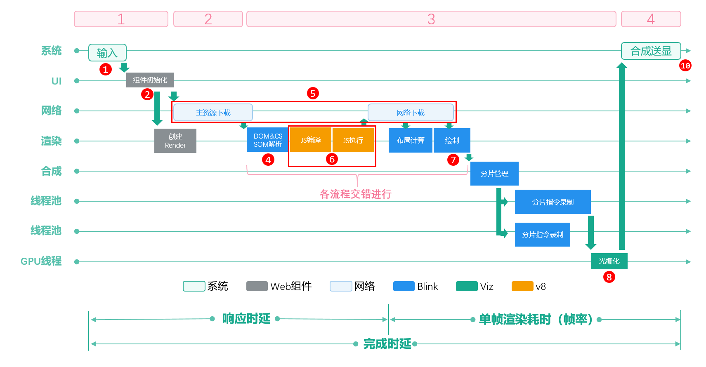

  
| 编号 | Web网页加载流程拆解 | 关键Trace |
| --- | --- | --- |
| ① | 点击事件 | 最后一个DispatchTouchEvent到组件初始化前 |
| ② | Web组件初始化 | H:NWebImpl \| CreateNWeb到导航流程前 |
| ③ | 导航流程 | NavigationControllerImpl::LoadURLWithParams到NavigationBodyLoader::OnStartLoadingResponseBody结束 |
| ④ | DOM&CSSOM解析 | CSSParserImpl::parseStyleSheet和ParseHTML解析，扣除HTMLDocumentParser::RunScriptsForPausedTreeBuilder |
| ⑤ | 等待网络资源下载 | Render主线程ThrottlingURLLoader::OnReceiveResponse前的空闲 |
| ⑥ | JS编译与执行 | EvaluateScript 和 v8.callFunction |
| ⑦ | 绘制 | ThreadProxy::BeginMainFrame扣除v8执行 |
| ⑧ | 光栅化&合成 | 从ProxyImpl::NotifyReadyToCommitOnImpl开始到SwapBuffers结束 |
| ⑨ | 点击响应结束点 | NotifyFrameSwapped，UnloadOldFrame/第一个SkiaOutputSurfaceImplOnGpu::SwapBuffers |
| ⑩ | 完成时延结束 | 最后一个SkiaOutputSurfaceImplOnGpu::SwapBuffers |
 
 
 

##### Web加载性能分析工具

 

##### DevEco Profiler

DevEco Profiler是DevEco Studio提供的场景化调优工具，开发者可通过该工具来确定Web加载完成时延的大小。DevEco Profiler基础使用开发者可参考[DevEco Profiler工具简介](https://developer.huawei.com/consumer/cn/doc/harmonyos-guides/ide-profiler)，具体如何确定Web加载完成时延请参见[使用Profiler确认加载完成时延](#section137571957154219)。
 
 

##### DevTools

DevTools是一个Web前端开发调试工具，提供在电脑上调试移动设备前端页面的功能。开发者可参考以下文档使用DevTools调试工具：[使用DevTools工具调试前端页面](https://developer.huawei.com/consumer/cn/doc/harmonyos-guides/web-debugging-with-devtools)。
 
 

##### Web加载性能分析方法

 
图2 **Web加载完成时延分析流程**

1. 确定是否存在时延问题。使用DevEco Profiler或录屏工具辅助分析，确认Web组件加载完成时是否存在时延问题。若存在问题，则执行后续分析逻辑。
2. 确认关键性能瓶颈：使用DevTools分析，关注关键泳道及其中的关键性能问题，了解程序的耗时情况。
3. 根据问题点选择合适的优化策略。针对程序的耗时问题，选择合适的优化方法。
4. 查看优化效果。优化后重新抓取Trace，检查加载完成时延是否不超过900毫秒。如果未达成目标，则从其他方向继续优化。
 

##### 使用Profiler确认加载完成时延
1. 使用Profiler抓取Trace，根据场景确定起止点。
- 确定Web加载完成时延Trace起点。点击切换到新的Web页面，以DispatchTouchEvent, type=1为起点。Web页面初始化加载以H:NWebImpl | CreateNWeb为起点。该Trace点位于应用主线程泳道内。该泳道负责应用主逻辑、接收多模信号、生成帧、分发子信号等。对应图3中的红色旗标处。

  图3 **Web页面初始化加载起点**
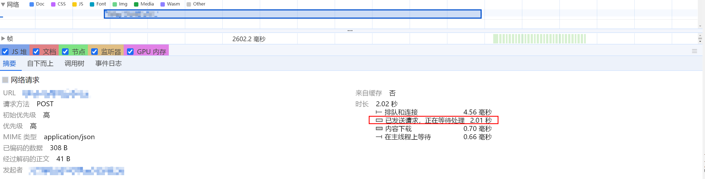

2. 确定Web加载完成时延Trace结束点。最后一个SkiaOutputSurfaceImplOnGpu::SwapBuffers为终点。该Trace点位于CompositorGpuTh泳道内。该泳道负责GPU光栅化处理，生成信号送图形子系统执行渲染。对应图4的紫色旗标处。

  图4 **Web页面初始化加载终点**
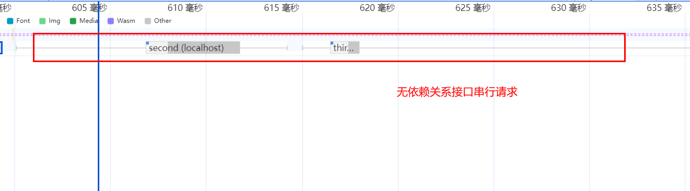

- 缩小Trace图，找到起点和终点，选中起点到终点范围内的Trace图，可查看当前Web页面的点击完成时延。如果该区域内加载完成时延超过900毫秒，使用下文介绍的DevTools进行性能分析。
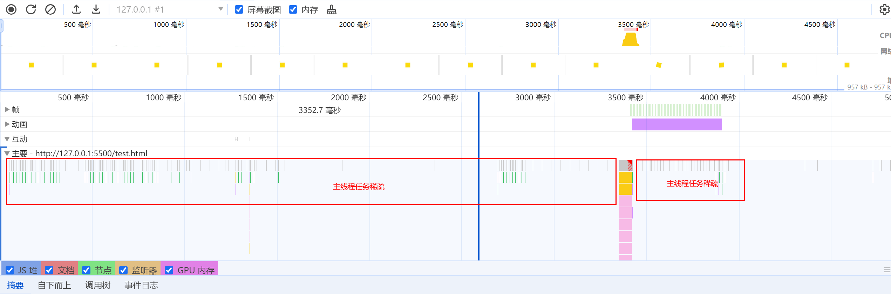

 
 

##### 使用DevTools分析耗时区域

开发者可通过DevTools中的Performance选项卡录制Trace，根据录制后Trace进行分析，分析流程如下。
 1. 确认泳道的起止点，起点位于黄虚线处（0ms位置），终点为视口内容完全渲染上屏。

  图5 **确定泳道起始点
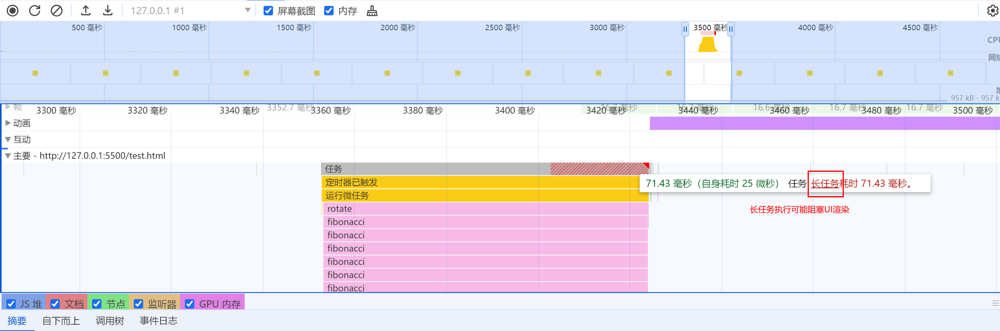

  **图6 **确定泳道结束点
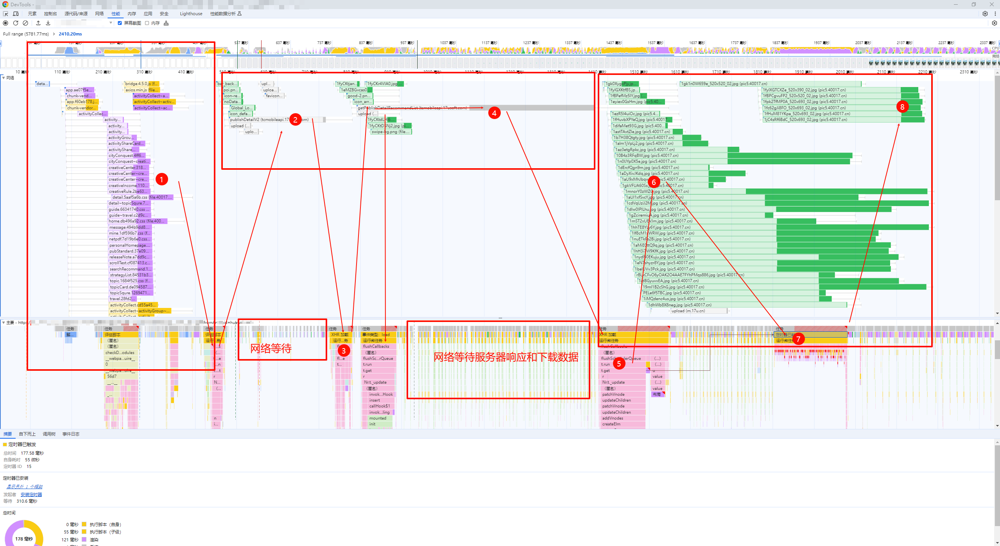

2. 常用泳道概览。DevTools提供了多个泳道为开发者提供性能分析数据，常用泳道如下图所示。
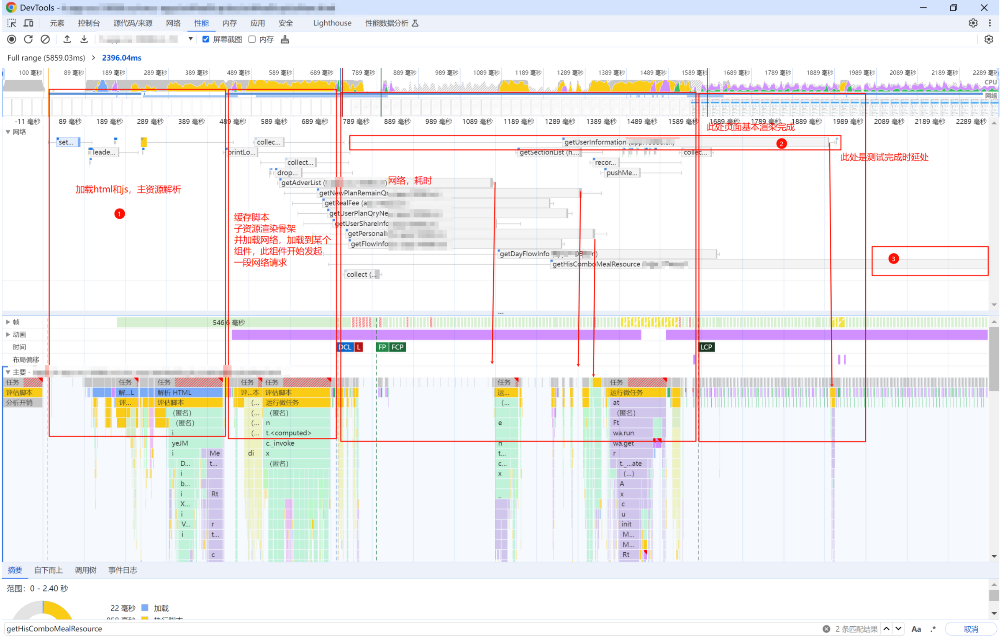

  由于Web加载完成时延主要问题集中在静态资源请求与主线程任务执行，因此，需要重点关注以下泳道。
- Main（主要）泳道：显示主线程上的任务活动情况，包括脚本执行、样式计算、布局和绘制等。

3. NetWork（网络）泳道：显示页面在加载过程中发出的所有网络请求，帮助开发者分析页面加载性能，找出加载缓慢的资源以便进行优化。

4. Frame（帧）泳道：显示每一帧的渲染情况，包括帧率与渲染时间，可以检测到页面中的卡顿和掉帧现象。

5. Animation（动画）泳道：显示动画的执行情况。

6. 根据Web加载阶段进行分析，查看每个阶段内是否存在对应的常见问题。

  

  ##### 各阶段异常根因分析及优化方法

  以下按照[Web加载流程](#section6747174619307)进行区域划分，并梳理了常见问题产生的阶段与对应解决方案。

  **DOM&CSSOM解析**（分析Main泳道）

  常见问题

1. 页面渲染阻塞，通常由同步JavaScript加载引起。开发者需了解源码，并在代码中采用异步加载或延迟加载JavaScript脚本。

2. CSS文件加载缓慢会导致内容无样式或页面闪烁。页面渲染时，表现为先无样式再缓慢显示样式，或页面内容快速且不稳定地变化。常见的解决方案包括：将CSS内嵌到HTML以减少外部CSS请求数量，压缩CSS文件，使用CDN加速加载，以及使用缓存。

3. 除以上针对特殊问题的优化方案外，还有其他通用优化方案，如[预渲染](https://developer.huawei.com/consumer/cn/doc/best-practices/bpta-web-develop-optimization#section172031338172719)、[同层渲染](https://developer.huawei.com/consumer/cn/doc/best-practices/bpta-render-web-using-same-layer-render)等。

  **网络资源下载**（分析NetWork泳道）

  常见问题

1. 某些网络请求会阻塞UI渲染，导致关键资源加载缓慢。业务侧需根据页面显示需求，分析并优化影响页面加载时延的关键请求，例如使用CDN、[预取POST](https://developer.huawei.com/consumer/cn/doc/best-practices/bpta-web-develop-optimization#section1742343332915)请求等。

  **图7 **网络请求阻塞UI渲染示意Trace图
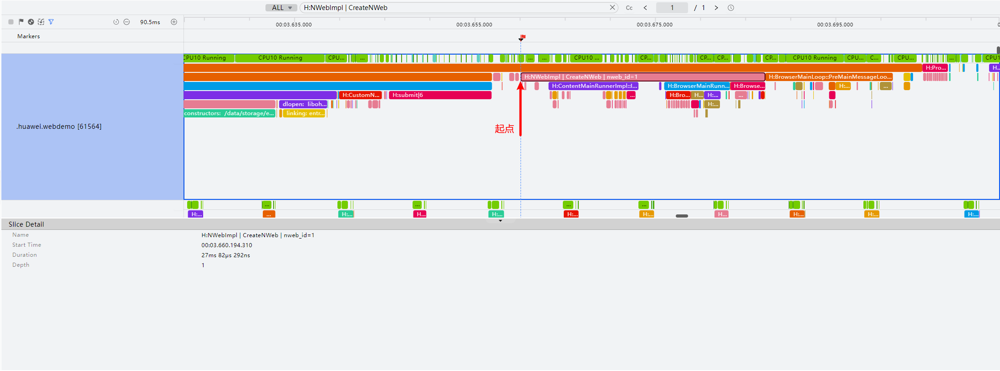

2. 网络请求过多、服务器响应慢、无强依赖关系接口串行请求。此时的优化方案如下：
懒加载，减少文件大小，提高加载速度。

3. 合并和压缩CSS、JavaScript等资源文件，减少请求数量。

4. 使用浏览器缓存和CDN缓存静态资源，减少请求。

5. 懒加载非首屏内容或用户交互后才需要加载的内容，减少初始请求数量。

  **图8 **网络请求数量过多示意Trace图
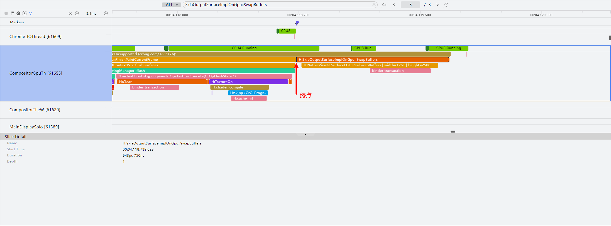

  **图9 **服务器响应网络请求过慢示意Trace图**
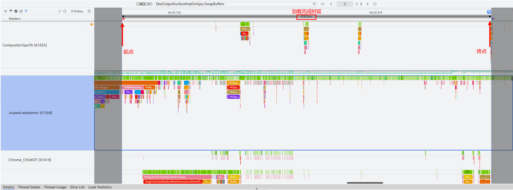

  图10 **无强依赖接口串行请求示意Trace图

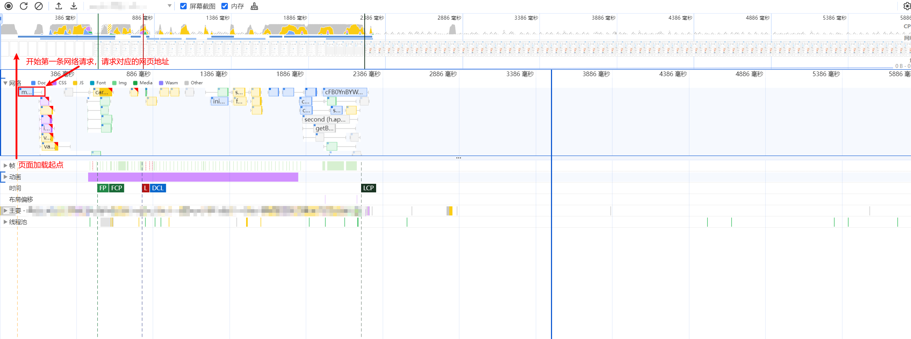

 
**JS编译与执行**（分析Main泳道）
 
常见问题
 1. 主线程任务执行稀疏，频繁发生任务切换和上下文切换。如下图所示，红框内任务执行情况稀疏，而红框右侧存在任务执行，表明该区域内的主线程任务执行受到其他因素阻塞，通常是由于网络请求过慢或定时器导致的任务滞后。建议检查空白区域对应时间范围内的网络请求，以确定是否存在网络请求缓慢问题。
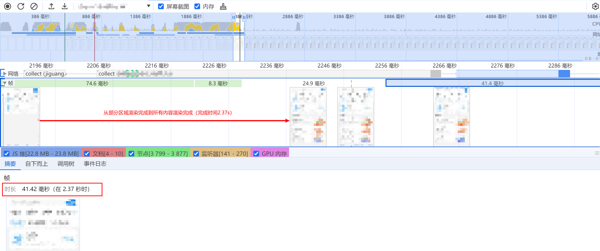

2. 长任务会阻塞UI渲染。JS脚本执行时会阻止HTML解析，导致页面白屏或显示未渲染完成的内容。脚本执行时间过长可能由脚本过大或算法时间复杂度过高引起。开发者需要排查脚本内容，延后不必要的脚本执行，优先保障视口内的内容加载。可采取的通用方案包括：[预编译JavaScript生成字节码缓存](https://developer.huawei.com/consumer/cn/doc/best-practices/bpta-web-develop-optimization#section563844632917)、减少冗余JavaScript代码，推迟非必要JavaScript代码执行，利用代码分割只加载当前页面需要的代码等。
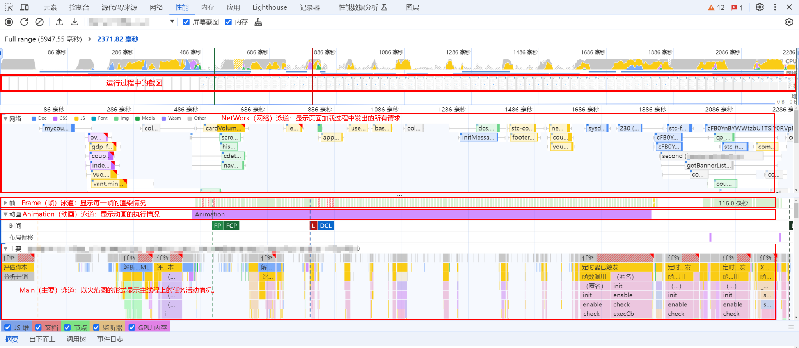

 
 

##### 优化实践案例

 

##### 案例一

**问题描述**
 
某应用详情页面加载完成时延高于900ms，实测加载完成时延2351ms。
 
**问题Trace**
 

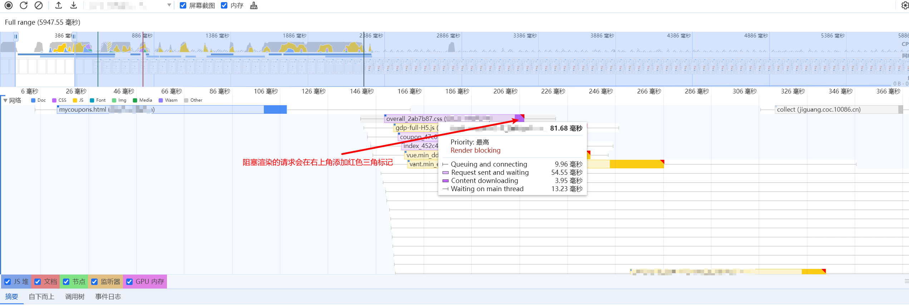

 
**加载流程分析**
 
图中标号为页面加载流程顺序。应用侧请求网页地址后，进入网络资源下载（区域①的网络泳道），此时网络泳道出现大量资源文件请求，页面持续白屏（观察页面截图区域），表明应用侧存在初始页面资源加载时网络并发过多的问题。请求的资源在主线程上执行（区域①的主要泳道），执行过程中发出网络请求到区域②的接口，publishDetailV2() 接口耗时较长。请求结束后，执行回调函数（区域③的主要泳道）。该回调中接着请求了一个网络请求（区域④的网络泳道），getPublishDetailRecommendList() 接口同样耗时较长。请求执行完成后，执行对应的回调函数（区域⑤的主要泳道），随后触发大量网络请求（区域⑥与区域⑧）。
 
**根因分析**
 1. 初始加载时大量的CSS和JS加载、耗时530ms左右（区域①）。
2. 部分接口串行请求（区域②中的publishDetailV2()与getPublishDetailRecommendList()），主线程任务稀疏（区域②、区域④对应的主要区域任务火焰图）。
3. getPublishDetailRecommendList()接口网络等待与内容下载时间过长，一次加载了大量数据（区域④）。
4. 加载了大量图片（网络泳道内的绿色区域），图片之间的串行加载和下载耗时较长（区域②、④、⑥、⑧）。
 
**优化方案**
 1. 根据业务需求，选择合并与压缩JS和CSS文件，减少网络请求次数和文件大小。检查代码，移除非必要首屏加载的CSS和JS文件，并延迟这些文件的加载时机。
2. 预取POST网络请求。提前调用publishDetailV2()与getPublishDetailRecommendList()。
3. 优化getPublishDetailRecommendList()接口请求，采用分页加载，每次加载固定数量的数据。
4. 优化页面组件加载图片的逻辑，确定业务逻辑上所有图片资源是否都需要首屏加载。
- 头部Banner组件可加载首张图、显示完后再加载后续图。

5. 底部列表组件可使用占位图，在滑动期间再加载图片。
- 其他通用优化方案。1. 对网页进行[预渲染](https://developer.huawei.com/consumer/cn/doc/best-practices/bpta-web-develop-optimization#section2446239101011)提前拉起渲染进程。

2. 使用CDN加速静态资源请求，包括图片和脚本文件等。

3. Web缓存可优化200毫秒左右。此页面为模块详情页，页面布局的CSS和JS为固定样式。HTML、CSS和JS可缓存到本地，后续打开页面可缩短加载时延。

 
 

##### 案例二

**问题描述**
 
某应用优惠券详情页面使用Web组件加载，实测加载完成时延为1552ms，远高于900ms。
 
**问题Trace特点**
 

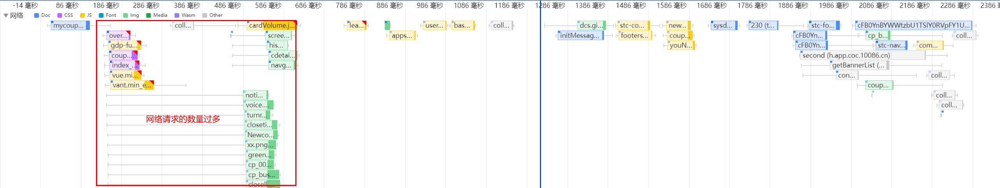

 
**加载流程分析**
 
根据Trace图，页面加载后请求一个接口和一段JS脚本。该脚本触发大量网络请求和任务回调。屏幕在区域①到600多毫秒处持续白屏，等待JavaScript脚本执行。执行完成后，页面进入骨架屏阶段（区域③）。此阶段有多个长排队请求，服务器处理时间较长（浅灰色区域）。
 
- getUserInformation()接口耗时1.2s，其中在等待520ms，请求耗时680ms。
- getHisComboMealResource()接口耗时1.9s，其中等待630ms，请求耗时1.3s。

 
**根因****分析**
 1. JS执行阻塞了首屏加载，加载阶段耗时长（达到了600多ms的空屏）。
2. 接口请求耗时较长（图中网络泳道内的浅灰色区域表示请求发出后等待响应的时间，可以看到大多数接口的等待响应时间都很长，可能是由于硬件限制），导致主线程加载阶段的任务变得稀疏，影响了整体完成时间。
 
**优化方案**
 1. 此页面为固定页面，可以考虑在首页预加载Web，以便跳转后快速渲染。
2. 可从如下方面尝试优化网络请求。
- 网络请求数量优化，减少接口数量合并网络请求，从而降低服务器网络负载。

3. 后端检查getHisComboMealResource()方法耗时较长的原因，并优化后端处理逻辑。

 
 

##### 总结

本文提供了Web页面加载时延分析与优化的方法，涵盖Web页面加载流程、性能分析工具与方法，并通过两个案例结合分析方法进行实操，帮助开发者掌握Web页面加载性能提升的方法。
