# Web帧率问题分析

更新时间：2026-05-09 09:58:30

来源：https://developer.huawei.com/consumer/cn/doc/best-practices/bpta-web-frame-rate-performance-analysis

**   

##### 概述

在数字化时代，页面的滑动性能直接影响应用的流畅度和用户体验。流畅的使用体验，可以提升用户的满意度。
 
 
在Web应用中，滑动帧率是衡量用户体验流畅度的关键指标。帧率（Frames Per Second, FPS）指每秒钟屏幕更新的次数，较高的帧率能提供更流畅的视觉体验。然而，在实际应用中，受计算资源限制、Web页面或应用实现问题等多种因素影响，滑动过程中可能因渲染内容无法在单帧周期内完成绘制，而导致丢帧，从而影响用户体验。本文主要分析了三方应用在滑动时产生丢帧现象的常见原因，并提供了相应的解决方案。
 

##### Web滑动渲染流程

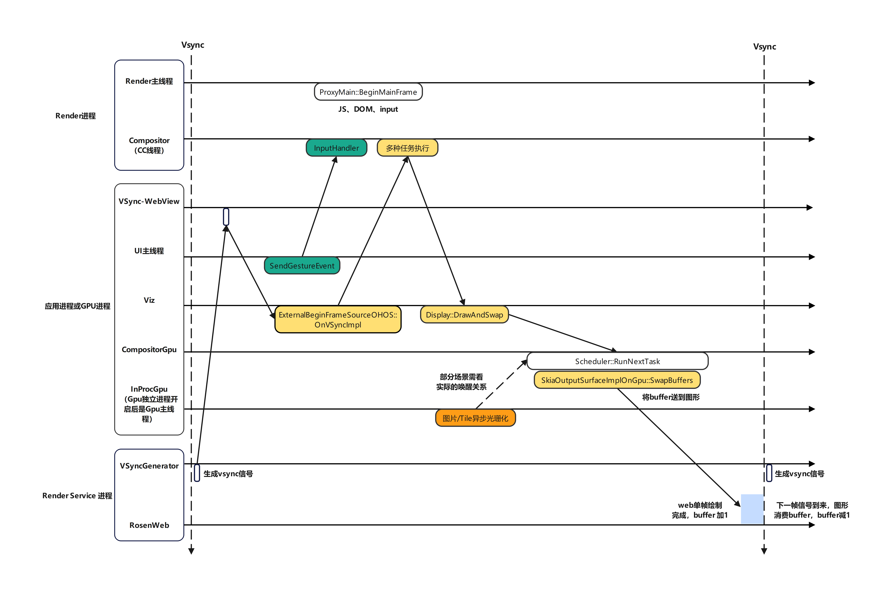

 
 

 
ArkWeb子泳道聚合了Web相关线程的trace信息，通过分析Web渲染过程关键函数的trace点，可以分析出每一帧的执行流程，图为[异步渲染模式](https://developer.huawei.com/consumer/cn/doc/harmonyos-guides/web-render-mode#异步渲染模式默认)下ArkWeb滑动过程中的渲染流程图，其聚合的Web线程信息如下：
 
- H:RosenWeb：用于记录准备提交给Render Service进行统一渲染的数据量。
- Compositor：合成线程，负责图层CPU指令合成，承载动态效果。
- CompositorGpuThread：用于从GPU获取渲染结果和将合成的buffer送至图形子系统执行渲染。
- Chrome_InProcGpu：光栅化。
- VSyncGenerator：图形侧Vsync信号，用于定时生成Vsync信号，通知渲染线程或动画线程准备下一帧的渲染。
- VSync-Webview：用于接收图形侧发送的Vsync信号，并根据信号触发WebView页面的渲染或重绘。
- VizCompositorThread：绘制信号监听线程，向图形请求Web下一帧Vsync信号，触发系统Web相关绘制或执行。
- Web应用Render线程：以 Render 结尾的线程，主要用于图形渲染任务，包括HTML、CSS解析，进行分层布局绘制以及输入事件的处理。

 
由于Web渲染为异步流水线，图中仅标识的相同颜色的**关键函数**需在一帧内完成，且每个Vsync周期（VSyncGenerator线程）需要完成一次。这些关键函数可能被各种因素阻塞，需从CPU唤醒关系分析实际情况和原因。
 

##### Web滑动丢帧分析方法

 

 1. 确定是否存在丢帧问题：使用DevEco Profiler或录屏工具辅助分析，确认Web组件是否存在丢帧问题。若存在问题，则执行后续分析逻辑。
2. 确认关键性能瓶颈：找到异常耗时trace点。
3. 根据问题点选择合适的优化策略。
4. 查看优化效果：优化后重新抓取Trace，确认是否还存在卡顿丢帧。
 

##### Web滑动丢帧分析工具

DevEco Profiler是DevEco Studio提供的场景化调优工具，开发者可通过该工具来确定Web滑动丢帧次数，DevEco Profiler的基本使用方法请参考[DevEco Profiler工具简介](https://developer.huawei.com/consumer/cn/doc/harmonyos-guides/ide-profiler)。
 
 

##### 使用Profiler抓取Trace，根据判断web动效起始点和终点

页面滑动一般分为两个阶段：拖滑和抛滑。拖滑指触摸屏幕时的滑动。抛滑（惯性滑动）指在手指离开屏幕后，页面仍以一定速度滑动。
 
在应用主线程有如下trace点，可以判断整个滑动的起始点。
 
InputRouterImpl::FilterAndSendWebInputEvent | type=GestureScrollBegin 代表滚动事件的起始点；
 
InputRouterImpl::FilterAndSendWebInputEvent | type=GestureScrollEnd 代表终点；
 
RenderWidgetHostInputEventRouter::DispatchTouchscreenGestureEvent | type=GestureFlingStart 代表抛滑起始点。
 

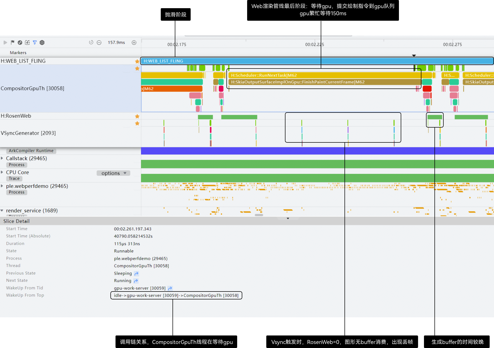

 
 

##### 从最终结果倒推，找到丢帧时间点

Web为自渲染模式，丢帧判定需基于RosenWeb的buffer缓存状态：当VSyncGenerator生成RS信号时，若RosenWeb泳道标识的buffer个数为0，则说明发生丢帧；有缓存时则不视为丢帧。
 

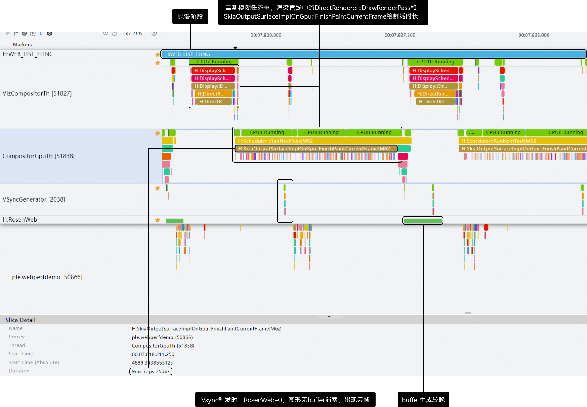

 
 

##### 寻找丢帧原因

定位到丢帧点后，往前推导几个Vsync周期确定具体原因。Web滑动丢帧通常归为两类：执行超时或缺少必要渲染条件导致渲染中断。
 
对应用开发者而言，问题多源于网页性能不佳或应用中存在耗时异常的业务逻辑，应用开发者需关注是否存在因相关线程执行耗时异常而导致的丢帧问题。结合Web滑动渲染流程图，排查是否存在应用主线程、VizCompositorThread、CompositorGpuThread等线程是否存在耗时异常。
 
 

##### web滑动卡顿优化实践案例

本文主要总结了常见的三方应用实现导致出现滑动丢帧的原因与解决方案。
 
 

##### 业务逻辑阻塞web手势正常下发

手势事件下发是动效的起点，在页面滑动的过程中，Web内核需通过手势事件生成的偏移量来绘制页面，因此每一帧都应该有手势事件下发，如果应用主线程长时间阻塞逻辑，会导致Web在这一帧无手势下发。确认应用主线程是否存在业务阻塞逻辑，如果有长时间阻塞逻辑，那么需要通过[profiler工具](https://developer.huawei.com/consumer/cn/doc/harmonyos-guides/ide-profiler)抓取trace，确认这一段running的来源。
 

 1. **使用离线Web组件阻塞应用主线程****问题描述**

  某应用在web页面第一次滑动过程中出现概率丢帧卡顿。

  **问题trace**

  
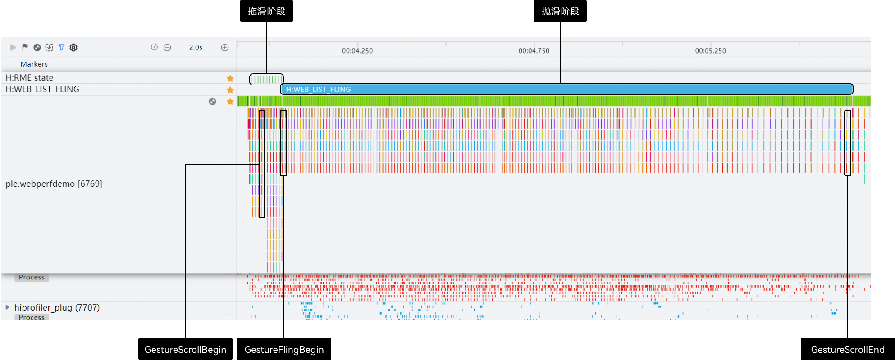

  **根因分析**

1. 应用跳转到某Web页面时，同时创建一个空白的离线Web组件，以加快其他页面的加载速度。

2. 页面加载完成后，用户滑动页面时，恰好触发离线Web组件的创建。

3. 离线Web组件的创建阻塞了应用主线程，Vsync信号到来时，Web手势无法正常下发，在这一个Vsync周期内ArkWeb无法完成绘制，未产生buffer。

4. 下一个Vsync信号下发时，RoseWeb = 0，图形侧无法获取buffer进行送显，导致丢帧。

  **优化方案**

  建议应用在系统空闲时间创建离线Web组件。
2. **大量JSB任务阻塞应用主线程****问题描述**

  某应用在某页面，每次滑动都丢帧卡顿。

  **问题trace**

  
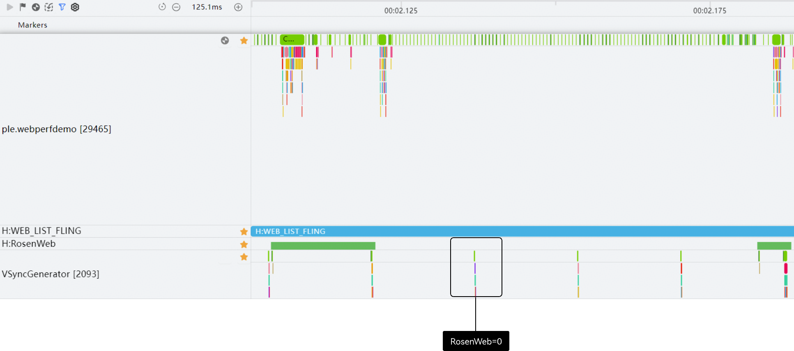

  **根因分析**

1. 应用在某个Web组件中，使用[javaScriptProxy()](https://developer.huawei.com/consumer/cn/doc/harmonyos-references/arkts-basic-components-web-attributes#javascriptproxy)接口或[registerJavaScriptProxy()](https://developer.huawei.com/consumer/cn/doc/harmonyos-references/arkts-apis-webview-webviewcontroller#registerjavascriptproxy)接口将应用侧代码注册到前端页面中，注册完成之后，前端页面中使用注册的对象名称就可以调用应用侧的方法。

2. 用户在滑动页面的过程中，Web页面与原生应用进行交互，触发JSB任务。

3. JSB通信任务阻塞了应用主线程，Vsync信号到来时，Web手势无法正常下发，在这一个Vsync周期内ArkWeb无法完成绘制，没有buffer产生。

4. 下一个Vsync信号下发时，RoseWeb = 0，图形侧无法获取buffer进行送显，导致丢帧。

  **优化建议**

1. 如果 JSB 是由滑动事件（如 onscroll）触发的，控制 JS 侧调用频率。

2. JSB 回调执行时，默认是在应用的主线程。如果回调里涉及复杂计算、文件 IO 或数据库等操作，将任务抛到[任务池](https://developer.huawei.com/consumer/cn/doc/harmonyos-references/js-apis-taskpool#taskpoolexecute)去执行 ，并迅速返回。
3. **JSView: ExecuteRerender逻辑长时间阻塞应用主线程****问题描述**

  某应用在某页面，每次滑动出现概率丢帧。

  **问题trace**

  
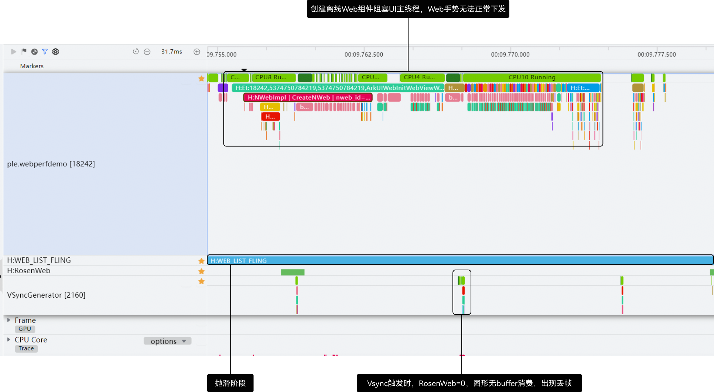

  **根因分析**

1. 在某个同时包含ArkUI和Web组件的页面中，定义了一些**状态变量**（被 @State, @Prop, @Link, @StorageLink 等装饰器修饰的变量），某些ArkUI组件的一些属性关联这些状态变量。

2. 在Web页面滑动的过程中触发了这些状态变量数值的变化，Web 组件所在的父组件或兄弟组件中存在状态变更，触发了整颗视图树的 build() 函数重新执行。

3. 在触发组件更新的过程中，业务可能绑定一些耗时的业务逻辑，导致JSView: ExecuteRerender执行耗时长。

4. JSView: ExecuteRerender执行耗时长阻塞了应用主线程，Vsync信号到来时，Web手势无法正常下发，在这一个Vsync周期内ArkWeb无法完成绘制，没有buffer产生。

5. 下一个Vsync信号下发时，RoseWeb = 0，图形侧无法获取buffer进行送显，导致丢帧。

  **优化建议**

1. 检查是否在滑动监听中频繁修改了 @State 或 @Link等状态变量，减少滑动中这类变量的更新，降低重绘频率。

2. 缩小状态变量作用域，避免全局刷新。
4. **ExecuteJS长时间阻塞应用主线程****问题描述：**

  某应用在某页面，页面滑动时出现概率性卡顿丢帧。

  **问题trace**

  
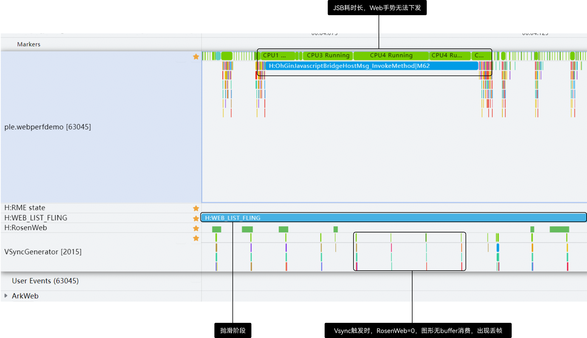

  **根因分析：**

1. 用户在滑动页面的过程中，在onScroll()等函数中执行了一些同步的应用自身耗时业务逻辑，对应trace中的ExecuteJs。

2. ExecuteJs通信任务阻塞了应用主线程，Vsync信号到来时，Web手势无法正常下发，在这一个Vsync周期内ArkWeb无法完成绘制，没有buffer产生。

3. 下一个Vsync信号下发时，RoseWeb = 0，图形侧无法获取buffer进行送显，导致丢帧。

  **优化建议**

1. 应用排查是否在滑动的过程中频繁触发自身js耗时逻辑，优化耗时逻辑或对调用进行节流，降低调用频率。

2. 尝试使用异步方式处理耗时逻辑。
5. **应用自身未知逻辑长时间阻塞应用主线程****问题描述：**

  某应用在某页面，页面滑动时出现概率性卡顿丢帧。

  **问题trace**

  
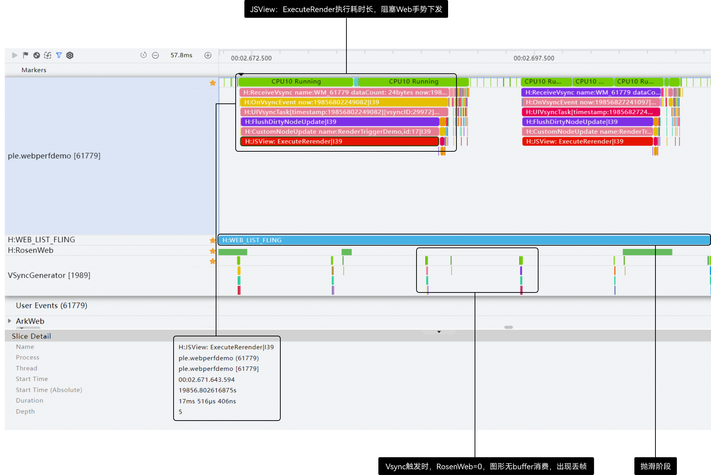

  **根因分析：**

1. 用户在滑动页面的过程中，长时间执行了应用自身业务逻辑阻塞了应用主线程，比如在web组件相关函数中定时执行一些耗时业务逻辑。

2. Vsync信号到来时，Web手势无法正常下发，在这一个Vsync周期内ArkWeb无法完成绘制，没有buffer产生。

3. 下一个Vsync信号下发时，RoseWeb = 0，图形侧无法获取buffer进行送显，导致丢帧。

  **优化建议**

1. 需应用自身排查是否存在不合理的业务阻塞逻辑，建议在应用代码的业务入口和出口手动调用[hiTraceMeter.startTrace](https://developer.huawei.com/consumer/cn/doc/harmonyos-references/js-apis-hitracemeter) 和 finishTrace手动添加 Trace 打点，定位到耗时区域。
 
 

##### 复杂的动效
1. **页面直接依赖gpu硬件能力****问题描述**

  某个web页面使用了一个超高精度的3D渲染，页面每次滑动经过这块动画区域就会卡顿掉帧。

  图1 **

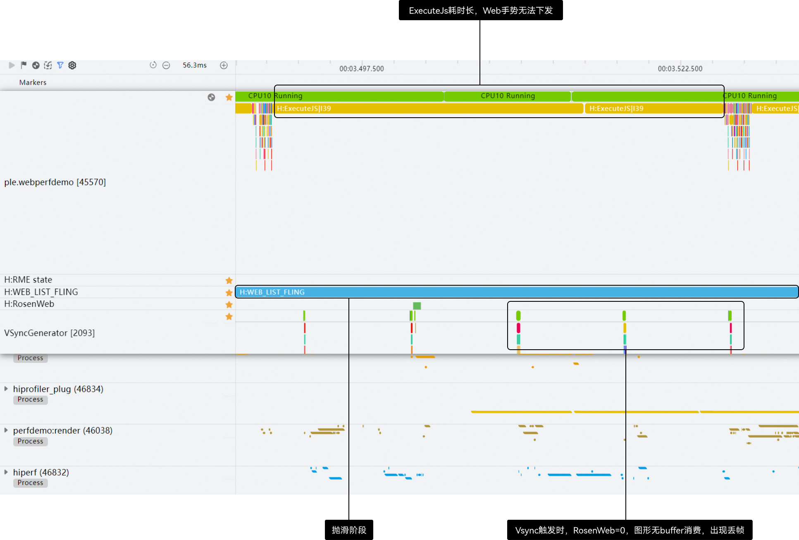

  **问题trace**

  
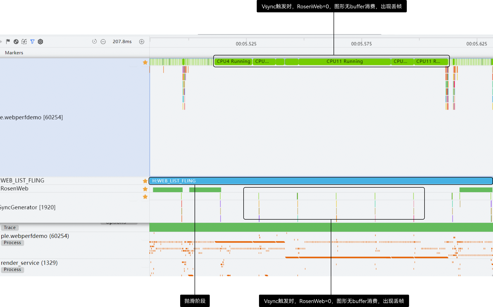

  **根因分析**

1. 问题场景的页面使用了一个高清精致的3D渲染动效，该动效直接通过WebGL调用gpu进行复杂的计算，会长时间占用gpu计算单元。

2. 页面滑动经过高清动效的时候，此时开始绘制动效，gpu满载工作，页面滑动渲染管线中的CompositorGpuTh需将绘制指令提交到gpu队列，此时gpu满载，长时间等待gpu，导致生成buffer很晚。

3. 在等待gpu过程中，Vsync信号多次下发，RoseWeb = 0，图形侧无法获取buffer去消费送显，出现多次丢帧。

  **优化建议**

1. 对动画进行降级处理。

2. 有复杂3D渲染动效不支持页面上下滑动。
2. **大量高斯模糊动效**

  **问题描述**

  某个使用了较重高斯模糊（blur）动效的页面滑动卡顿。

  **问题trace**

  
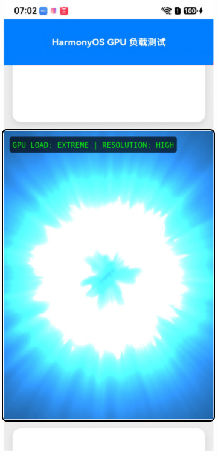

  **根因分析**

1. 该网页使用了比较重的高斯模糊动效，高斯模糊并非简单的像素着色，内核会对目标区域进行**多轮卷积采样运算，**当大量使用 **backdrop-filter** 或 **filter** 属性实现高斯模糊动效时，若模糊半径（Radius）过大或模糊区域过多，会耗费大量的计算资源。

2. 在页面滑动的过程中，会触发高斯模糊动效，渲染流程中的DirectRenderer::DrawFrame和SkiaOutputSurfaceImplOnGpu::FinishPaintCurrentFrame这两个trace点的耗时会显著增加，导致Web无法在单帧时间内生成buffer。

  
DirectRenderer::DrawFrame：该点位于VizCompositorTh线程中，负责管理和调度渲染层。由于每个高斯模糊区域都需要独立的 Render Pass 且存在复杂的纹理依赖，合成器必须花费大量时间进行层级分析和渲染指令调度，导致合成帧的构建过程变慢
3. SkiaOutputSurfaceImplOnGpu::FinishPaintCurrentFrame：代表 GPU 实际执行绘图指令的耗时。高斯模糊的卷积核随半径增大导致采样次数剧增，GPU 的像素填充率达到极限，导致该阶段在执行模糊 Shader 和纹理写回时耗时大幅拉长。
