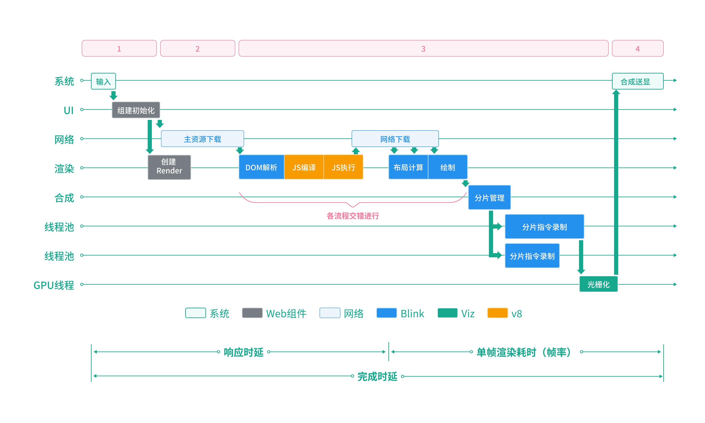
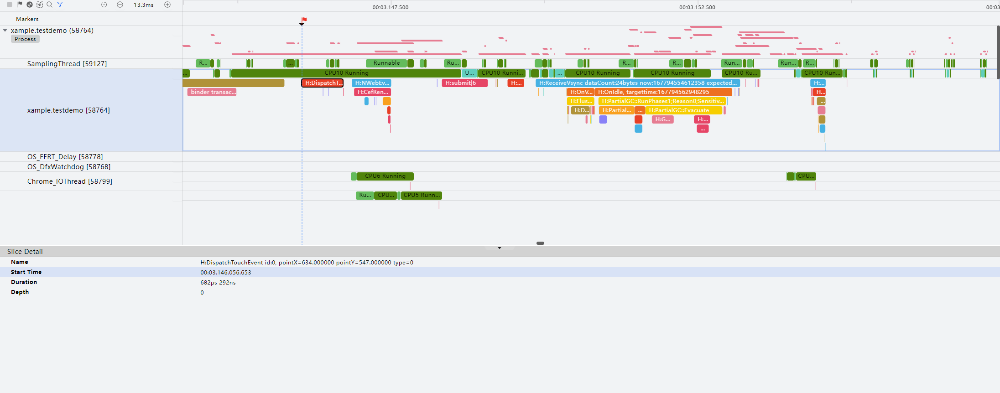
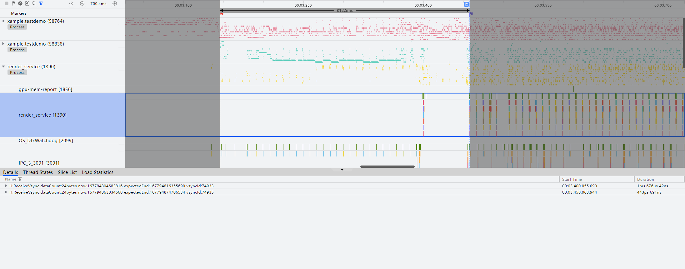
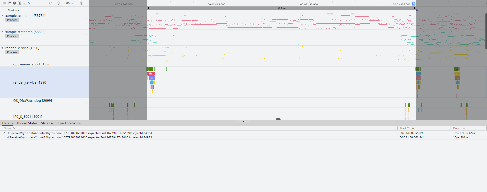
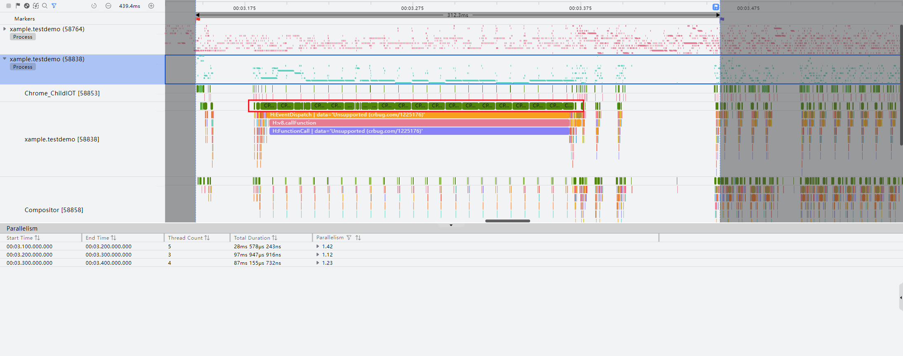
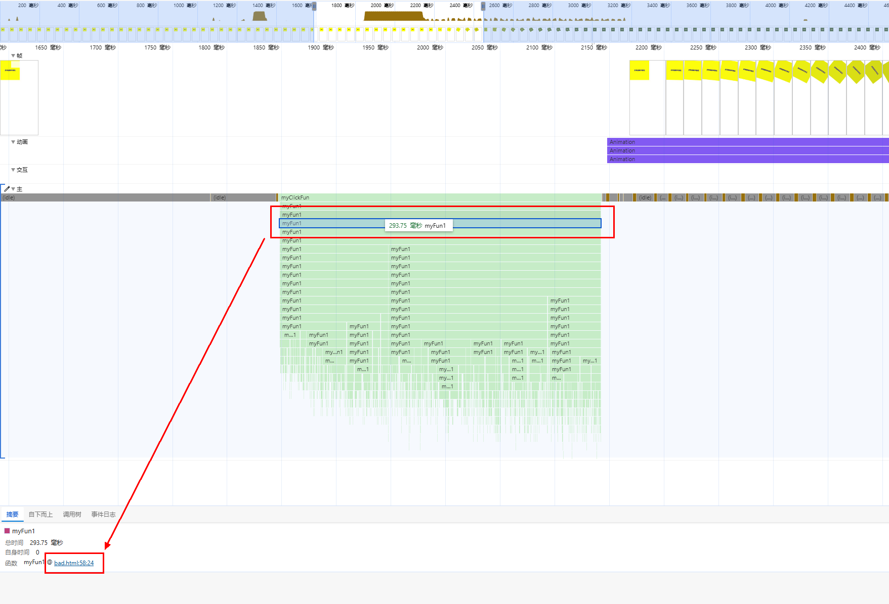
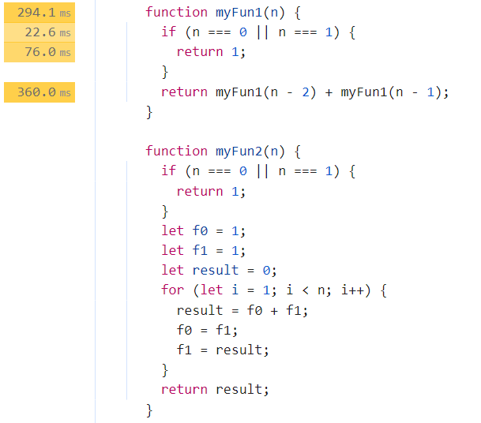
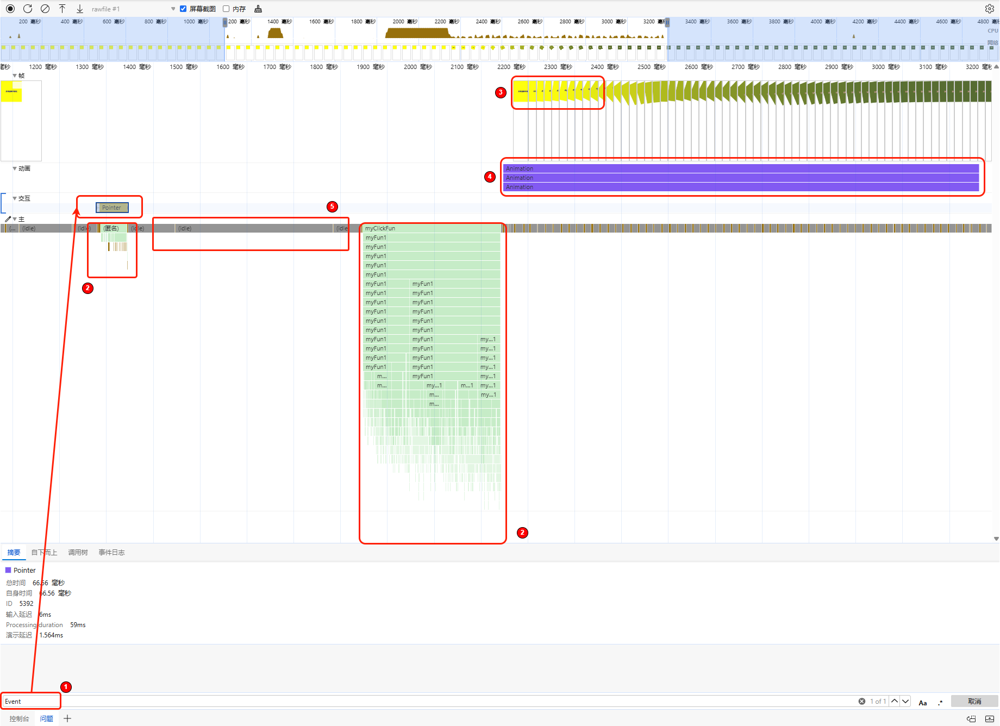
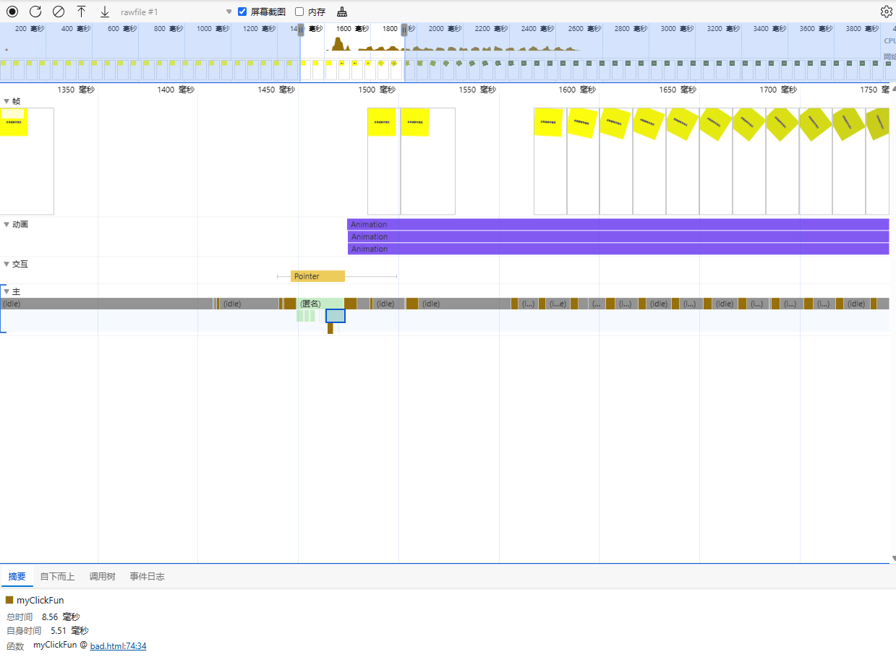

# Web点击响应时延分析

更新时间：2026-03-12 08:45:02

来源：https://developer.huawei.com/consumer/cn/doc/best-practices/bpta-web-click-response-delay-analysis

下图为在ArkTS侧使用Web组件加载Web页面时的效果。当用户点击字块后，动画效果延迟较长时间才触发。点击操作响应时延的性能指标衡量起点为用户点击应用元素的时间，终点为应用界面开始发生变化的时间，变化时间应控制在100ms以内，以确保操作响应及时，维持用户流畅体验。开发者可以通过录屏辅助测试，使用DevEco Profiler工具量化点击响应时延，判断是否存在需要优化的问题。
图1 场景动画

## 问题定位流程

### Web网页整体加载流程与关键Trace点

图2 Web网页整体加载泳道图

| Web网页加载流程拆解 | 关键Trace |
| --- | --- |
| 点击事件 | 最后一个DispatchTouchEvent到组件初始化前 |
| Web组件初始化 | NWebImpl\ | CreateNWeb到导航流程前 |
| 导航流程 | NavigationControllorImpl::LoadURLWithParams到NavigationBodyLoader::OnStartLoadingResponseBody结束 |
| DOM&CSS解析 | CSSParserImpl::parseStyleSheet和ParseHTML解析，扣除HTMLDocumentParser::RunScriptsForPausedTreeBuilder |
| JS编译+执行 | EvaluateScript 和 v8.callFunction |
| 等待网络资源下载 | render主线程ThrottlingURLLoader::OnReceiveResponse前的空闲 |
| 点击响应结束点 | NotifyFrameSwapped，UnloadOldFrame/第一个SkiaOutputSurfaceImplOnGpu::SwapBuffers |
| 绘制 | ThreadProxy::BeginMainFrame扣除v8执行 |
| 光栅化&合成 | 从ProxyImpl::NotifyReadyToCommitOnImpl开始到SwapBuffers结束 |
| 完成时延结束 | 最后一个SkiaOutputSurfaceImplOnGpu::SwapBuffers |

### 使用DevEco Profiler工具抓取Trace

使用Profiler工具分析卡顿和丢帧场景的方法可以参考Frame分析。对于响应时延类问题，首先确认响应的起止点，确定区域位置和具体操作。

1. 确认起点：如果是由点击触发，则首先定位到应用侧的DispatchTouchEvent，如下图虚线所示：
**图3 **Trace起点

2. 确认终点：选择连续稳定发出的第一帧vsync信号作为终点，而非不稳定vsync信号，是因为非连续的vsync信号不一定触发界面上的渲染行为。本文旨在分析从应用元素点击到应用界面开始变化的点击时延问题，因此选择连续稳定渲染的第一帧vsync信号作为终点。
**图4 **Trace终点

 从图中可以看出，后续动画已经达到最大帧率，说明无响应发生在图中区域内。
3. 分析中途出现的H:ReceiveVsync信号可以发现，在无响应阶段出现了几帧，但每帧的耗时并不长。应用侧也是如此，说明在UI绘制过程中没有高负载。
**图5 **Trace帧率分析

4. 在此过程中，应用长时间占用CPU，原因可能是进行了大量的计算。
**图6 **可能耗时原因

经过前面的分析，应用侧发现Web侧可能产生了大量计算。此时，需要使用Devtools工具进行进一步分析。

### 使用Devtools进行分析

参考此链接使用Devtools调试前端页面：使用Devtools工具调试前端页面。

抓取的DevTools泳道图如下图所示，本章节分析可能发生的异常区域：

图7 DevTools泳道图区域划分

- 区域1:   该处为起点，输入Event搜索点击事件。
- 区域2：该处为组件加载区域，主要是JS执行。
- 区域3：该处为响应终点，Frame泳道第一帧送显。
- 区域4：该区域为动画区域，负责执行动画。
- 区域5：该区域为空白，通常是由于setTimeout等延迟函数导致。

由于此页面不涉及网络交互，因此未标记网络区域等部分区域，后续将提供示例。

## 常见问题分析实例

在H5页面点击切换场景中，Web组件已初始化，点击事件由Web内部处理。该过程主要发生在下图的1、2、3、4区域。

图8 DevTools泳道图区域划分

当点击时会执行以下流程：

1. Web导航等待主页面渲染出第一个非空白帧。
2. 主页面主资源下载解析渲染，之后子资源交错下载解析渲染。
3. 主资源渲染完成，若为非空白帧，唤起导航动画，页面响应。
4. 主资源渲染完成，若为空白帧，Web会丢弃，后续子资源渲染出的第一个非空白帧，唤起导航动画，页面响应。

响应慢通常由以下原因导致：

1. 主资源渲染组件结构复杂，耗时较高。
2. 主资源为空，子资源动态加载，导致第一帧显示延迟。

本文将分别介绍组件加载异常、网络异常、动画异常和空白区域异常。

### 组件加载区域异常分析

对应下图中的区域2：可以记录此段内容的加载耗时。

图9 DevTools泳道图区域划分

此处异常点通常为：

1. 区域耗时较长，例如区域2耗时约290ms，是一个优化点。
2. 多个区域涉及加载渲染组件，这可能是动态加载组件，时延较高。此时，可以观察到大量调用的myFun1，点击左下方可跳转到源码：

图10 DevTools泳道图区域划分

源码耗时如下图所示：

图11 源码耗时

如图所示，源码处会显示具体方法的耗时。此时可以发现myFun1方法采用了递归，大幅增加了CPU的运算耗时，导致响应延时。将递归方法myFun1优化为循环方法myFun2，时间复杂度从O(2^n)降低到O(n)，在该场景下能显著减少耗时。经测试，myFun2的实际耗时在微秒级别，无法使用DevTools工具统计，建议使用其他方法进行函数耗时统计分析。

### 网络区域异常分析

网络耗时占比异常通常发生在响应阶段，表现为网络请求完成后执行JavaScript或任务时阻塞线程，导致整体耗时显著增加。具体见图中的区域2：

图12 DevTools泳道图区域划分

### 动画区域异常分析

如果区域4中测试的响应时间的Trace起点到终点的时间相差很大，动画区域可能会出现异常。常见的异常包括页面背景色为透明，动画曲线呈现先慢后快的特点，导致动画弹出起点时透明度在视觉上没有变化。

图13 DevTools泳道图区域划分

### 空白区域异常分析

对应下图中的区域5：

图14 DevTools泳道图区域划分

 此处的异常点通常为：

1. 网络请求时间过长，导致页面元素无法及时渲染显示。
2. 定时器等待后，可在空白区域找到与定时器相关的函数执行。

发现代码中有await delayFun(500)这种定时器延迟函数，优化方法是移除冗余延迟函数。

经过上述分析步骤的优化，此时再次调用DevTools进行分析：
图15 优化后的泳道图

可以看出耗时明显减少，回归正常水平。

## 总结

通过以上步骤，使用录屏、Trace工具和DevTools分析，可以定位并解决Web页面点击响应时延问题。
