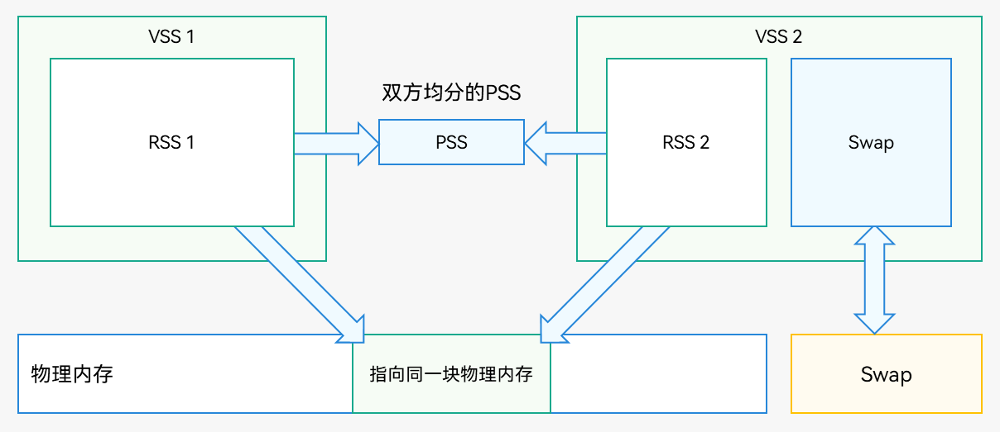

# 内存基础知识

更新时间：2026-03-19 08:43:01

来源：https://developer.huawei.com/consumer/cn/doc/best-practices/bpta-memory-basic-knowledge

##### 基本概念

**内存组成关系图**
 

 
上图展示了内存基础的组成部分（RSS，PSS，VSS，物理内存，Swap）之间的关系, 下表对内存各组成部分进行详细介绍。
 
  
| 名称 | 简介 | 相关性/作用 | 关系 |
| --- | --- | --- | --- |
| VSS（Virtual Set Size） | 进程占用的所有虚拟内存大小，包括已分配但尚未使用的部分。 | 反映了进程可能使用的最大地址空间。 | VSS = RSS + 虚拟内存已映射但未加载进物理内存的部分（如mmap映射或堆预留空间）。 |
| RSS（Resident Set Size） | 当前加载到物理内存中的那部分进程内存，包含私有内存和共享内存。 | 显示实际占用的物理内存。 | RSS = USS + 共享内存。 |
| PSS（Proportional Set Size） | 按比例分摊后的内存大小，其中共享内存按参与共享的进程数平均计算。 | 更准确地反映了多进程环境下的内存使用。 | PSS = USS + ∑(共享页大小 / 共享该页的进程数)。 |
| USS（Unique Set Size） | 仅属于该进程的私有内存，不包含任何共享部分。 | 杀死进程后可释放的实际物理内存。 | - |
| Graph | Graph代表图形内存，即DMA内存 | - | - |
| VMA（Virtual Memory Area） | 用来描述进程虚拟地址空间中一段连续、属性相同的虚拟内存区域的核心数据结构。 | 内核管理虚拟内存的基本单元，决定内存权限、共享、文件映射属性。 | VSS是所有VMA长度的简单加和，不考虑物理内存是否分配。操作系统一般都会对VMA的个数做限制，超过限制会导致无法创建新的虚拟地址映射。 |
| Ashmem（Anonymous Shared Memory） | 具备压力感知回收机制的匿名共享内存缓冲区。 | 通过Pin/Unpin机制解决共享问题，处理多进程环境下内存溢出风险。 | - |
| ION 内存 | 内存管理器，用于硬件间分配共享物理缓冲区。 | 基于文件描述符的缓冲区所有权流转机制，解决内存共享问题。 | - |
| GPU 内存 | 图形处理单元内存。 | 负责支撑界面渲染、游戏模型、视频解码显示以及图像处理滤镜等。 | 在移动端UMA（统一内存架构）下，GPU内存本质是系统内存的一部分，由GPU驱动管理。 |
| 交换分区（Swap） | 当物理内存不足时，系统会将一些不活跃的内存页移到硬盘上的交换区。 | 增加系统的可用内存，但访问速度较慢。 | - |
| 共享脏页（Shared Dirty Page） | 已经被修改过的共享内存页。 | 与其他进程共享时，建议确保访问安全。 | - |
| 私有脏页（Private Dirty Page） | 进程私有的并且已经被修改的内存区域。包括堆栈、已分配但尚未释放的堆内存等。 | 完全属于单个进程，不能与其他进程共享。 | - |
| 共享干净页（Shared Clean Page） | 进程间共享的、未修改的（干净）页面。比如，只读的共享库代码段就属于此类。 | 可以被多个进程共享，且不会因为一个进程的修改而影响其他进程。 | - |
| 私有干净页（Private Clean Page） | 进程中私有的、未被修改的数据或代码段。例如，可执行文件中的只读文本段。 | 不与其他进程共享，但没有被修改过。 | - |
| 匿名页（Anonymous Page） | 不对应任何具体文件的数据页，通常由堆、栈或mmap分配而来。 | 如果没有足够的物理内存，可能会被交换出去。 | - |
| 文件页（File backed Page） | 对应于某个文件的数据页，可以直接从文件系统恢复。 | 可以直接丢弃并重新加载，无需保存到交换分区。 | - |
 
 
> [!NOTE]
> 私有内存是指由特定进程独立拥有、供其独占使用且无法被其他进程直接共享或修改的物理内存区域。 共享内存是一种内存管理技术，允许多个进程同时访问同一块内存区域，从而实现高效的数据共享和通信。以下是共享内存的详细解释： 共享内存允许不同的进程访问同一块内存空间，减少数据复制，提高效率。它通过内存映射文件或直接分配共享内存段实现。

 

##### 应用内存的组成

**应用内存组成图**
 

 
上图展示了应用进程映射的虚拟内存空间基本的组成部分，下表对内存各组成部分进行详细介绍。
  
| 名称 | 用途 | 分配时机 | 特点 |
| --- | --- | --- | --- |
| 栈（Stack） | 存放函数调用栈帧，包括局部变量、参数、返回地址等。 | 每次函数调用时自动分配，函数返回后自动释放。 | 增长方向：向低地址增长。 限制：默认大小有限（通常几MB），过深递归可能导致栈溢出。 |
| mmap分配区域 | 用于文件映射、匿名映射、共享内存、大块内存分配等。 | 使用mmap系统调用时； 使用malloc分配大块内存（超过阈值）时； 使用shmget创建共享内存； 使用mmap映射文件内容到内存进行读写。 | 优点：灵活，支持按需加载、共享访问。 |
| 共享库（Shared Libraries） | 加载动态链接库（如 libc.so，libpthread.so）。 | 程序启动时由动态链接器加载，程序运行时通过dlopen加载。 | 特点：多个进程可以共享同一份物理页（节省内存）。包含在mmap分配区域。 |
| 堆（Heap） | 动态分配内存，用于malloc，calloc，new 等操作。 | 在运行过程中根据程序需求动态扩展。 | 增长方向: 向高地址增长。 管理方式: 通过brk和sbrk系统调用来调整堆顶。 |
| Heap Alloc | 已被分配并正在使用的堆内存大小。 | 每当程序显式地请求内存（例如通过new关键字或类似的内存分配函数）并且成功获得所需内存时，即视为已分配内存的一部分。 | 直接反映了应用程序当前实际使用的堆内存量。 |
| Heap Free | 已在堆中分配但尚未被使用的内存。 | 初始分配时，整个可用堆空间被视为“自由”的。随着程序运行，部分自由内存被占用，剩余未被使用的部分即为Heap Free。 | 这部分内存可供后续分配使用，但如果长时间未被利用，则可能造成浪费。 |
| ArkTS Heap | 由ArkTS管理的堆内存。它主要用于存储对象实例、变量等动态数据。 | ArkTS代码分配的堆内存。 | - |
| Native Heap | 这是指原生代码（如C/C++编写的部分）所使用的堆内存。区别于ArkTS Heap。 | 当使用malloc、calloc、realloc等函数或者new操作符来分配内存时发生。在调用涉及底层系统资源的操作时，例如打开文件、网络连接等，可能会在原生堆中分配内存以存储相关资源描述符或缓存数据。 | - |
| Anonymous Page other（匿名内存页） | 没有关联文件映射的内存页。 | 当程序请求更多的栈空间（比如递归调用过深）或通过mmap分配不与文件关联的内存区域会产生。动态分配的大块内存（如通过mmap直接从操作系统获取的大块内存）也可能是匿名页面。 | 这些页面通常用于存储进程私有的数据结构，比如栈空间或动态分配的内存块。因为它们是“匿名”的，所以不能被多个进程共享。 |
| FilePage Other | 这类内存页是从文件映射过来的，但是不属于任何特定的大类。 | 当应用通过mmap将文件内容映射到内存中以便快速访问时产生。 | 当应用程序读取文件或者加载资源时，操作系统可能会将这些文件的内容映射到内存中，以便快速访问。 |
| GL（图形内存） | 这部分内存专门用于存储纹理、帧缓冲区等图形资源。 | 创建纹理、帧缓冲区、顶点缓冲区等图形资源时，在graph library中分配内存。 | - |
| 未初始化数据段 (BSS Segment) | 存放未显式初始化的全局变量和静态变量。 | 进程启动时由系统清零初始化。 示例：static int uninit_var。 | - |
| 已初始化数据段 (Data Segment) | 存放初始化过的全局变量和静态变量。 | 进程启动时根据可执行文件内容初始化。 示例：int global_var = 10。 | - |
| 代码段（Text Segment） | 存放程序的机器指令（即编译后的二进制代码）。 | 进程启动时由内核从可执行文件中加载。 属性：只读、可执行。 | - |
| 只读数据段（RO Data Segment） | 存放常量字符串、const变量等只读数据。 | 启动时加载，与可执行文件中的.rodata段对应。 示例：const char* str = "hello"。 | - |
| 内核保留区 (Guard Pages) | 防止栈溢出或非法访问相邻内存区域。 | 系统自动添加在栈下方或其他关键区域之间。 | 行为：访问该区域会触发段错误（Segmentation Fault）。 |
