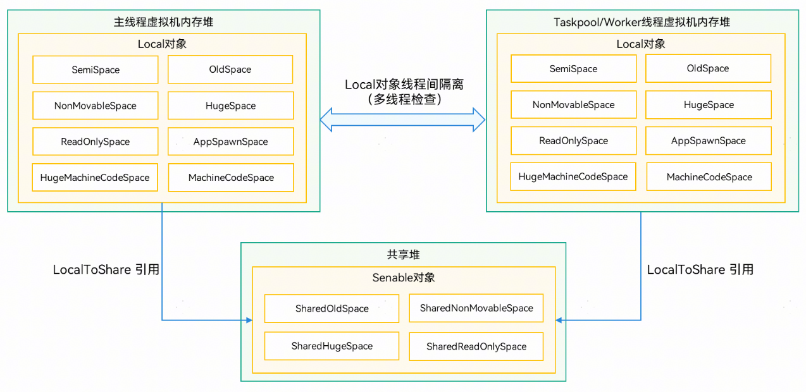
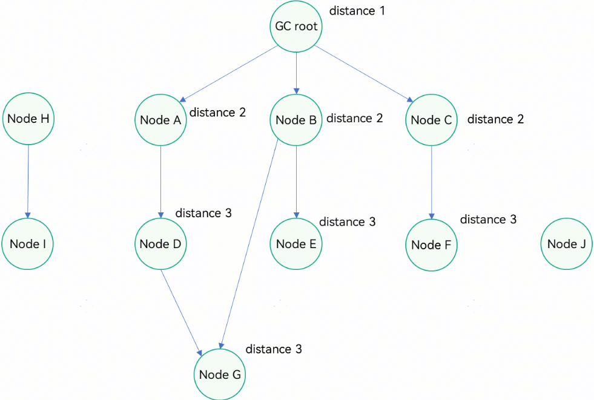
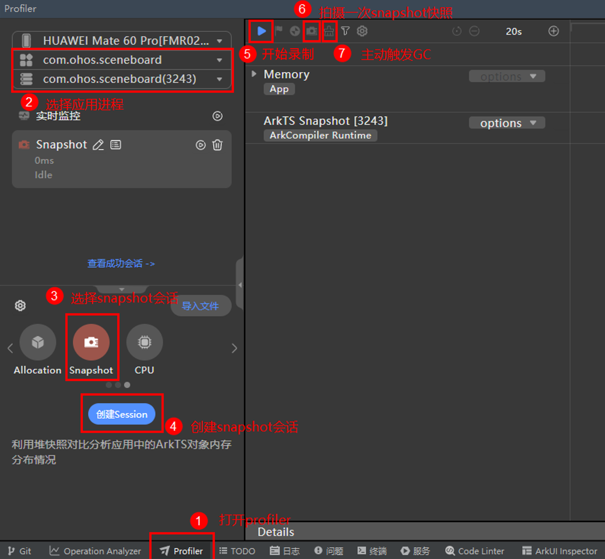
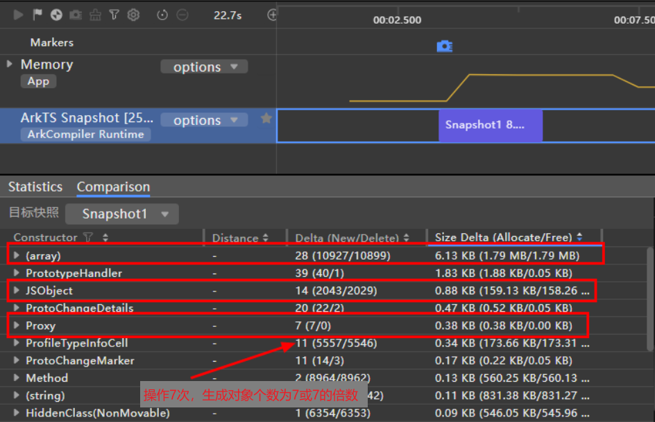
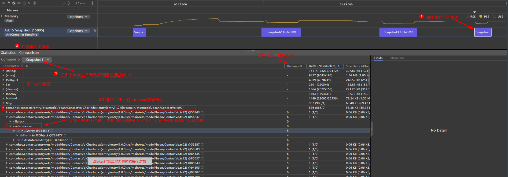
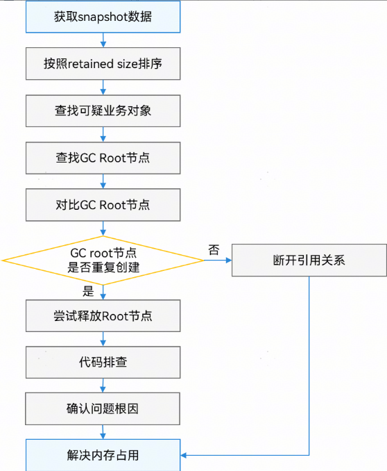

# 分析ArkTS/JS内存

更新时间：2026-03-17 02:20:01

来源：https://developer.huawei.com/consumer/cn/doc/best-practices/bpta-arkts-js-memory-analysis

**   

#### ArkTS/JS内存布局

 

#### 应用内存布局

 
在多线程环境中，Local对象在各线程间是隔离的，每个线程拥有独立的线程虚拟机内存堆，而共享堆则供所有线程共同使用。为了提高内存管理的效率，线程虚拟机内存堆和共享堆的内存被划分为不同的内存空间（Space），具体划分如图所示。
 

  
| space名称 | space介绍 |
| --- | --- |
| SemiSpace | 大部分新建对象都在SemiSpace里，如果在两次GC后仍然存活会晋升到OldSpace里。 |
| OldSpace | OldSpace中的对象的生命周期比较长，如两次GC后晋升过来的对象。 |
| NonMovableSpace | 主要存放hclass、constpool等虚拟机内部对象，GC时不会发生移动。 |
| HugeSpace | 对象大小超过256KB*2/3，如长string，array等。 |
| ReadOnlySpace | 存放一些永久存活且不发生引用关系更改的对象，GC时不会mark，如globalConst的hclass等。 |
| AppSpawnSpace | appspawn启动时预加载的对象。 |
| HugeMachineCodeSpace | 存放JIT（just-in-time）字节码，仅JIT会使用。 |
| MachineCodeSpace | 存放可执行的机器码。 |
 
 

#### ArkTS内存管理方式和垃圾回收（GC）的时机

 
方舟虚拟机采用标记-清除算法回收内存，通过维护一棵树来管理内存，这棵树的根节点被称为GC Root（即snapshot中distance为1的节点）。只要ArkTS对象被挂载到这棵树上，就说明该对象是存活的。很多刚接触内存管理的开发者可能会对GC Root产生误解，认为挂载在GC Root上的对象是需要被回收的。实际上，根节点被称为GC Root是因为基于标记清除法的垃圾收集器在标记阶段是从GC Root开始遍历的。所有从GC Root可达的对象都会被标记为“存活”。在清除阶段，垃圾收集器会扫描内存中的所有对象，如果某个对象没有在标记阶段被标记为存活，那么该对象就被视为可以被回收，垃圾收集器会释放这些未标记对象所占用的内存空间。每次GC都是从根节点开始，因此根节点被称为GC Root。该树的快照如图1所示。
 
图1 ****可达性树的快照**
 

 
在ArkTS中，对象之间存在引用和被引用的关系。图1中的箭头指向的都是被引用的对象。所有存活的对象都直接或间接地被GC Root引用，从GC Root到被引用对象的路径构成了该对象的引用链。因此，分析内存占用的关键在于结合业务判断，在合适的位置断开对象的引用链，从而使垃圾收集器能够回收未挂载在树上的内存节点。
 

#### 日志获取

DevEco Studio中Profiler Snapshot模板支持采集堆内存快照和对比功能，且每次采集快照前都会触发垃圾回收（GC），操作步骤参考[Snapshot模板基本操作](https://developer.huawei.com/consumer/cn/doc/harmonyos-guides/ide-snapshot-basic-operations)。
 
 

#### 分析思路

由于内存占用问题是在应用执行一系列操作后显现的，而堆内存快照仅能捕捉某一时刻的内存状态，因此，单凭一个内存快照来分析内存占用情况并不直观，尽管如此，它仍可用于分析如OOM等问题。通过对比操作前后的两个堆内存快照，可以更直观地识别内存占用的根本原因，分析新增对象是否应被回收，并通过对象引用链找到合适的断点，从而解决问题。通常，找到的合适断开引用链的位置即为内存占用的根本原因。
 

 

避免单实例内存占用的影响：如果应用业务创建了一个单实例，后续操作将一直使用该实例，且该实例不会被释放，这将影响内存占用的分析。因此，在分析时，建议先进行一次内存占用场景的操作，然后再录制第一个堆内存快照（snapshot）。
 
合理的问题复现次数有助于问题定位：仅复现一次问题场景可能无法显著分析出内存占用的原因。建议操作5次、7次或11次等特殊次数，因为偶数次操作可能引入干扰，导致无法确认内存占用是否真正未被释放。例如，操作5次后，如果对比两个snapshot发现有许多创建了5次但未释放的对象，可以再操作7次进一步确认。如果存在创建了7次仍未释放的对象，基本可以确认该对象存在持续内存占用。
 

 
**图2 **DevEco Studio中Snapshot模板录制流程
 

 
内存占用分析整体步骤可以简单描述为:
 1. 开启应用，在DevEco Studio中开启Profiler，选择应用进程，发起Snapshot会话，点击开始录制；
2. 在应用进行操作前拍摄一次内存快照；
3. 应用进行多次操作（最好是7次或11次这种特殊的次数），操作完后退回到初始的页面，再次拍摄一次内存快照；

  **图3 **snapshot comparison特定场景对象抓取**

4. 对比两次快照找出应该被回收但没被回收的对象。有多个对象在比较视图都存在时，可以重复多次步骤3的操作，分别和未进行操作时对比，观察是否存在对象和操作次数相同，进一步缩小内存占用对象的范围；
5. 分析引用链，通过distance递减1的方式向上找出内存占用根因对象，断开引用链；
6. 重复步骤1-5复测。
 
录制好的Snapshot如下图4，对象的reference层层展开就是一条引用链。这里建议阅读[ArkTS内存泄漏分析](https://developer.huawei.com/consumer/cn/doc/harmonyos-guides/ide-arkts-memory-leak-analysis)，文中针对快照中的一些类型作出了说明，对于后续分析有很大帮助。
 
图4 ****快照对比页面概览****

 
在分析引用链时，应遵循distance递减1的原则来查找上层引用节点。当存在单一引用链时，逐级展开引用链即可找到距离根节点为1的节点，从而确定唯一的引用链。如果引用链较为复杂，Current节点同时被A、B、C、D四个节点引用，那么Current节点的references展开后会同时显示这四个节点。只有按照优先解决最短链路的原则，即distance递减1的原则来查找上层引用节点，才能确保找到一条完整的链路，否则可能会陷入循环引用等问题，导致无用功。
 
在向上层查找引用节点时，如果该对象是在应用方的代码中声明或传递的，会标记出对应的编译后ts文件的代码行数，此时可以对照查看代码，以确定其是否为导致内存占用的根因，或仅仅是对象的传递。
 
 

#### 分析步骤

 

#### 开发态Snapshot内存占用分析

在获取到snapshot快照对比数据后，可以按照以下步骤进行分析：
 1. 排序：将获取到的对比数据按照Size Delta从大到小排序（如果是单次快照，则按照retained size从大到小排序）。
2. 查找可疑对象：优先关注应用侧创建的业务对象，对象后带有“x数字”，表示该对象的数量；没有“x数字”的表示只有一个，可以忽略。如果该业务对象的数量与操作次数相同或只多一次（因为会多一个声明对象，所以多一个对象是正常的），那么该对象很可能是此次应用操作后内存占用的对象。
3. 确认内存占用：检查该对象的生命周期是否已结束。如果生命周期已结束但未被释放，可以确认存在内存占用。
4. 查找GC root节点：通过内存占用对象的引用链，遵循distance递减1的原则寻找上层引用节点，找到distance为1的GC root节点。distance为1的root节点通常被native侧持有，GC root节点不释放则所有被间接引用的对象都无法通过GC释放。
5. 对比GC root节点：对比上述几个占用对象的GC root节点，如果GC root节点@字符后的nodeid相同，说明GC root节点对象只有一个且不会重复创建，因此可以选择不释放root节点，只需对比引用链，在引用链上找到重复创建的对象与不重复创建的对象之间的引用关系，尝试断开引用即可。如果GC root节点@字符后的nodeid不同，说明GC root节点对象也会重复创建，需要尝试释放GC root节点对象。
6. 代码排查：找到distance为1的对象在应用代码中的位置（如果是业务对象，会有对应的ts文件名和对象名称；如果是基本类型，需要结合对象的fields属性和上下引用关系来确定），检查distance为1的对象生命周期是否已结束。找到将distance为1的对象传递到native侧的接口，查看是否已主动触发对应的clear等接口进行释放。
7. 确认问题根因：如果distance为1的对象应用侧没有调用接口释放，请添加释放操作后重新尝试；如果distance为1的对象应用侧已经调用接口释放，或者没有对应的释放接口（这表明释放时机默认由native侧管理），可能是由于native侧持有无法释放导致的内存占用，可以联系相关接口的同事共同定位问题。
 
图5 ****snapshot分析流程图**
 

 
总结：内存占用无法释放的根本原因是JS对象被native C++侧直接或间接持有，导致GC无法回收。解决方法是断开这些持有关系。如果native C++侧直接持有的GC root节点在不断重复创建，需要释放这些root节点对象。如果root节点对象只有一个（nodeId相同）或无法释放，则应选择断开引用链。
 
> [!NOTE]
> 一般来说Root节点对象的释放是由创建方来管理的。如果是应用侧创建的对象通常需要应用侧通知native侧释放。如果是应用调用napi接口创建的基本类型对象，通常由native侧管理。

 
 

#### 运维态OOM内存占用分析

为了帮助开发者定位问题，当应用在ArkTS中遇到内存OOM时，系统会自动执行Heapdump，虚拟机会扫描并保存当前堆上的所有对象信息，生成rawheap文件。rawheap文件的生成路径为：/data/log/reliability/resource_leak/memory_leak。该文件以二进制形式保存，开发者可从SDK的toolchains目录下获取rawheap_translator工具进行解析，将其转换成heapsnapshot文件，该文件可通过DevEco Studio打开查看，具体操作步骤请参考[rawheap-translator工具使用指导](https://developer.huawei.com/consumer/cn/doc/harmonyos-guides/rawheap-translator)。
 
通过上述OOM生成的snapshot来分析哪些对象可能导致内存占用，分析过程与开发阶段的snapshot内存占用分析类似。OOM通常由多个对象导致内存占用过高引起，要避免OOM，首先需要解决最大的内存占用问题。
 
首先，可以通过Retained Size进行排序，优先查看占用内存较大的对象。排序后，如果有明显超大的基本类型对象，可以重点分析这些超大的基本类型对象；如果基本类型对象的泄漏不明显，可以跳过基本类型，直接分析应用的对象，因为这些类型通常不会独立存在。
 
确定疑似泄漏对象后，结合调用关系确定泄漏的具体场景。如果能够复现场景，可参照上述方法手动抓取两次快照进行对比，后续分析流程同上。如果无法确定复现场景，则上述找到的Retained Size最大的基本类型对象或应用对象即为可疑对象。
