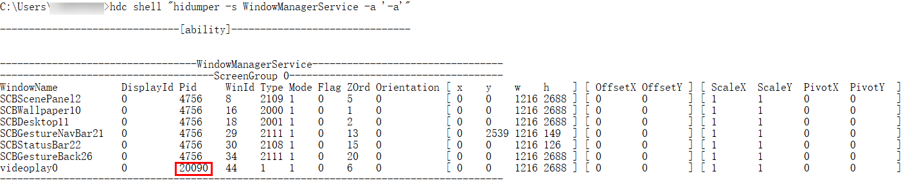
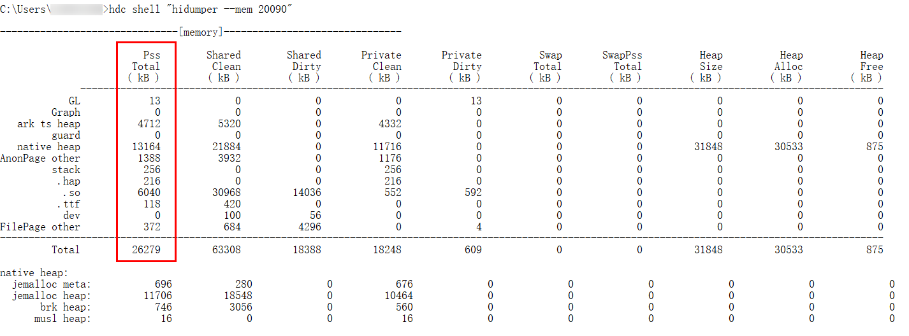

# 获取进程内存信息

更新时间：2026-03-12 08:45:02

来源：https://developer.huawei.com/consumer/cn/doc/best-practices/bpta-retrieve-process-memory-info

## 通过HiDumper查看内存信息

开发者可以通过以下步骤，获取到当前应用的内存信息。

1. 打开示例应用，运行 hdc shell "hidumper -s WindowManagerService -a '-a'"获取到当前应用的pid。

2. 输入 hdc shell "hidumper --mem [Pid]" ，并将命令中的 [Pid] 换成当前应用的Pid，就可以获取到示例应用的内存信息了

一般情况下，开发者只需要关注PSS （Proportional Set Size，实际使用物理内存）Total一列的数据，即示例应用实际使用的物理内存。如下图所示，应用总共占用了26279KB的内存，主要包括ArkTS Heap（ArkTS堆内存）的4712KB以及Native Heap的13164KB。

## 通过代码获取应用内存信息

开发者可使用@ohos.hidebug (Debug调试)接口获取应用进程的内存信息，使用指导详见获取内存信息。

## 使用onMemoryLevel()监听内存变化

onMemoryLevel()是HarmonyOS提供监听系统内存变化的接口，开发者可以通过onMemoryLevel()监听内存变化，从而调整应用的内存。onMemoryLevel()回调包括三种方式，分别为AbilityStage、UIAbility、EnvironmentCallback。

- AbilityStage：当HAP中的代码首次被加载到进程中的时候，系统会先创建AbilityStage实例，系统决定调整内存时，再回调AbilityStage实例的onMemoryLevel()方法。

- UIAbility：Ability是UIAbility的基类，在Ability中，提供系统内存变化的回调方法。
- EnvironmentCallback：EnvironmentCallback模块提供应用上下文ApplicationContext对系统环境变化监听回调的能力。

MemoryLevel分为MEMORY_LEVEL_MODERATE、MEMORY_LEVEL_LOW和MEMORY_LEVEL_CRITICAL三种。其中，MEMORY_LEVEL_MODERATE代表当前系统内存压力适中，应用可以正常运行而不会受到太大影响，MEMORY_LEVEL_LOW代表当前系统的内存已经比较低了，应用应该释放不必要的内存资源，避免造成系统卡顿，MEMORY_LEVEL_CRITICAL代表当前所剩的系统内存非常紧张，应用应该尽可能释放更多的资源，以确保系统的稳定性和性能。开发人员应该根据不同的内存级别来采取相应的措施，如释放资源、优化内存使用等，以确保应用在不同内存状态下都能正常运行。MemoryLevel具体等级定义如下所示：

| 等级 | 值 | 说明 |
| --- | --- | --- |
| MEMORY_LEVEL_MODERATE | 0 | 系统内存适中。系统可能会开始根据LRU缓存规则杀死进程。 |
| MEMORY_LEVEL_LOW | 1 | 系统内存比较低。此时应该去释放掉一些不必要的资源以提升系统的性能。 |
| MEMORY_LEVEL_CRITICAL | 2 | 系统内存很低。此时应当尽可能地去释放任何不必要的资源，因为系统可能会杀掉所有缓存中的进程，并且开始杀掉应当保持运行的进程，比如后台运行的服务。 |

> [!NOTE]
> 后台已冻结的应用，AbilityStage、UIAbility、EnvironmentCallback的onMemoryLevel都不可以进行回调。
