# 帧率问题分析

更新时间：2026-03-17 02:20:01

来源：https://developer.huawei.com/consumer/cn/doc/best-practices/bpta-zhenlv

帧率问题指的是应用在运行时，画面刷新频率未能达到流畅体验的标准，导致用户感受到卡顿或延迟。

《应用性能体检建议》中针对滑动帧率问题的指标有应用或元服务内滑动操作响应快、应用或元服务应用内滑动过程流畅，当前AppAnalyzer工具已支持（或等效支持）上述指标项。


## 丢帧问题原理


在定位应用丢帧问题前，需要了解HarmonyOS中图形渲染的流程，便于分析卡顿的阶段和原因。

HarmonyOS图形系统采用统一渲染模式，遵循流水线模式。90Hz刷新率下，每个Vsync周期是11.1ms。60Hz刷新率下，每个Vsync周期是16.7ms。120Hz刷新率下，每个Vsync周期是8.3ms。

图1 90Hz刷新率渲染流程

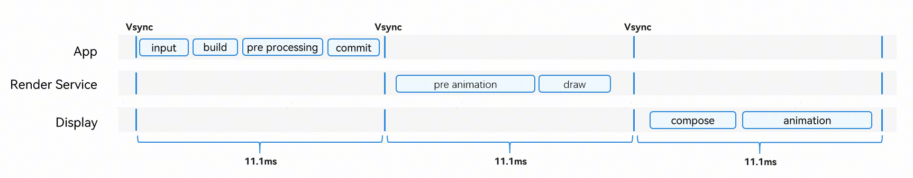


在整个渲染流程中，应用侧首先响应屏幕点击等输入事件，处理后提交给Render Service。Render Service协调GPU等资源处理，最终将图像送到屏幕上显示。

1. 应用侧处理用户的屏幕点击等输入事件，生成界面描述数据结构。数据包括UI元素的位置、大小、资源、绘制指令及动效属性。
2. Render Service是图形栈中负责界面内容绘制的模块，主要职责是对接ArkUI框架，支撑ArkUI应用的界面显示，包括控件和动效等UI元素。Render Service的RenderThread线程在Vsync信号触发下进行UI绘制，绘制过程包含三个阶段：动效、描画和提交。
3. Display是显示屏幕的抽象概念，既包括实际的物理屏，也包括虚拟屏。


其中应用侧的渲染流程如下图所示，了解ArkUI的渲染流程有助于定位应用侧的卡顿问题。如下图所示：

图2 ArkUI渲染管线结构与Frame Insight性能打点

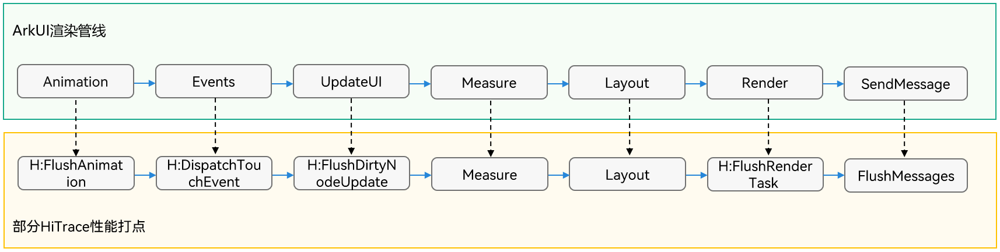


- Animation：动画阶段，动画过程中会修改相应的FrameNode节点，触发脏区标记。在特定场景下，会执行用户侧ETS代码实现自定义动画。
- Events：事件处理阶段，例如手势事件处理。手势处理过程中会修改FrameNode节点，触发脏区标记。在特定场景下，会执行用户侧ETS代码实现自定义事件。
- UpdateUI：自定义组件（@Component）在首次创建挂载或状态变量变更时会标记为需要重建状态。在下一次Vsync到来时，执行重建流程，生成相应的组件树结构和属性样式修改任务。
- Measure：布局包装器执行相关的大小测算任务，确定UI元素的尺寸。
- Layout：布局包装器执行相关的布局任务，确定UI元素的位置。
- Render：绘制任务包装器执行相关的绘制任务，完成后标记请求刷新RSNode绘制。
- SendMessage：请求刷新界面绘制，确保界面更新。


应用侧和Render Service侧可能出现卡顿，最终用户会观测到丢帧。我们将这两种情况分别命名为AppDeadlineMissed和RenderDeadlineMissed。AppDeadlineMissed通常由应用逻辑代码处理效率低引起，RenderDeadlineMissed则可能由界面结构复杂或GPU渲染负载高导致。这两个故障模型在Frame模板中可以直观地看到。相关故障模型如下面两幅图所示：

图3 应用卡顿导致丢帧的故障模型


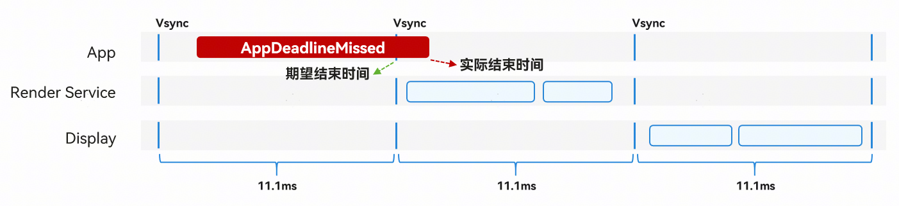


图4 Render Service卡顿导致丢帧的故障模型


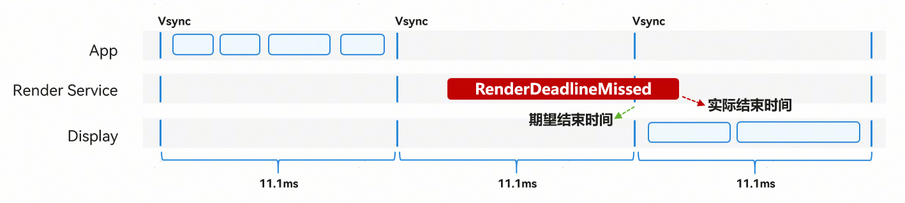


## 丢帧问题思路分析


下图展示了解决丢帧问题的简要流程：

图5 丢帧问题处理流程

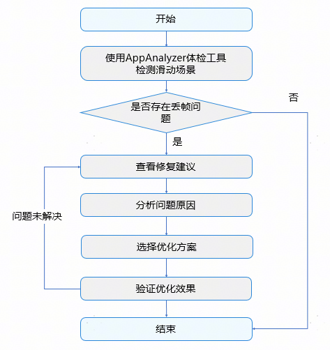


从上图可以看到处理丢帧问题可以采用以下步骤：

1. 识别卡顿：首先使用[AppAnalyzer](https://developer.huawei.com/consumer/cn/doc/harmonyos-guides/ide-app-analyzer)检测滑动场景是否存在性能问题，如果检测存在丢帧，会得到相应的体检报告。
2. 查看建议：在体检报告中，可以看到工具定位出的故障位置，优化建议等。
3. 分析原因：根据工具的建议，结合代码逻辑，分析判断产生性能问题的原因。也可以结合代码分析Trace、查看函数调用栈等定位丢帧原因。
4. 选择优化方案：根据分析的丢帧原因，选择适合的优化方案。
5. 验证优化效果：优化完成后需要重新测试验证丢帧问题是否得到解决。


本文以“HMOS世界”应用的首页列表为例，介绍通过Frame分析、定位和解决卡顿问题的全过程。为了便于演示，列表初始加载了1000条数据。

在滑动列表时，会逐渐出现卡顿现象。接下来，我们将介绍如何分析并解决卡顿问题。

图6 ”HMOS世界”首页长列表示意图


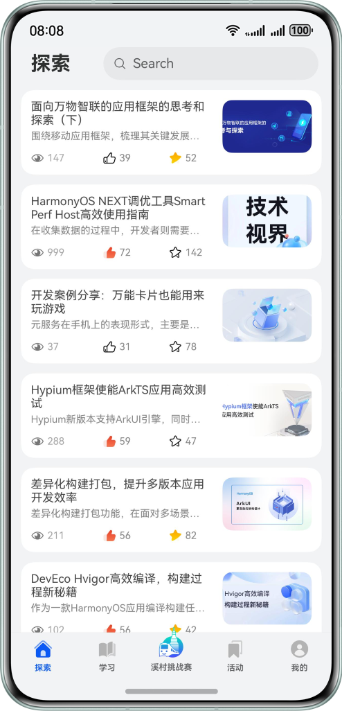


### 第1步：丢帧问题检测


使用AppAnalyzer检测性能问题

首先使用AppAnalyzer工具进行性能问题检测，AppAnalyzer是DevEco Studio中提供的检测评分工具，用于测试并评价HarmonyOS应用或元服务的质量，能快速提供评估结果和改进建议，当前支持的测试类型包括兼容性、性能、UX测试和最佳实践等。因为本文主要是介绍丢帧问题的分析，所以下面重点介绍了使用AppAnalyzer对列表滑动响应和滑动过程中的流畅性能检测，具体使用可参考《应用与元服务体检》。

在进行规则体检或场景化体检之前，先要确保DevEco Studio与真机设备已连接，并根据应用/元服务签名章节进行签名，再编译生成HAP或HSP。

1. 在DevEco Studio中启动AppAnalyzer工具，详细请参考：[AppAnalyzer](https://developer.huawei.com/consumer/cn/doc/best-practices/bpta-performance-detection#section135451444171)。
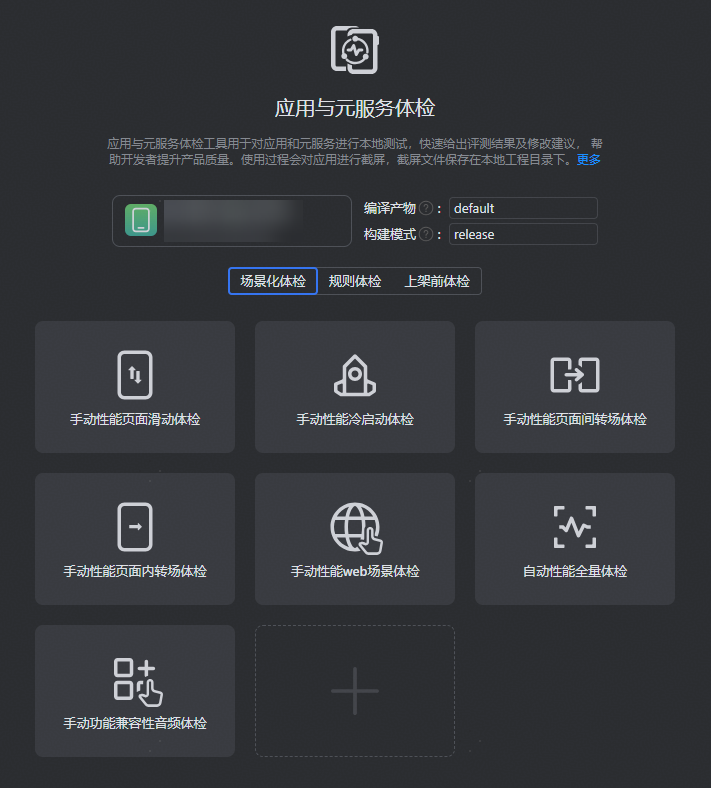
2. 执行滑动场景体检。选择场景化体检，然后点击“手动性能页面滑动体检”，工具会进行准备，自动编译、安装、运行当前工程，需要保持手机解锁状态。 当提示“准备完成，请操作手机至检测页面”等内容时，需要在手机应用中找到待检测的滑动页面，然后点击开始按钮。
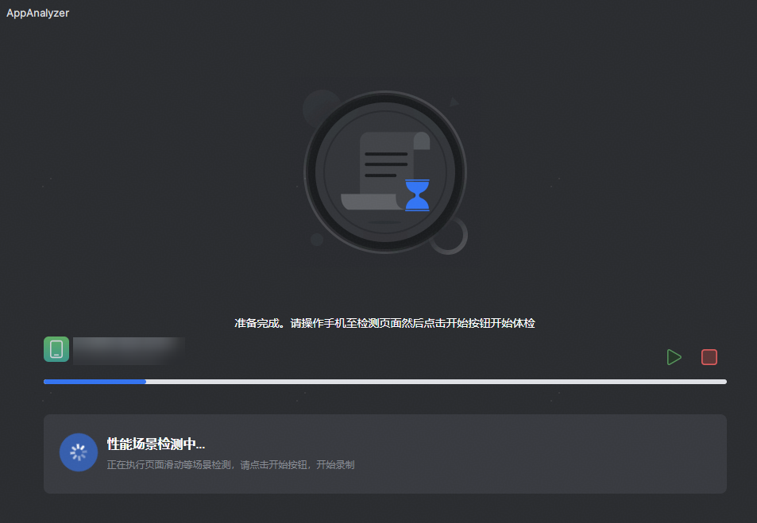
3. 等待工具录制准备，当提示“体检中，请操作手机”时，在手机上的待检测页面执行滑动若干次。等待剩余时间结束或点击暂停按钮，再点击停止完成本次检测。
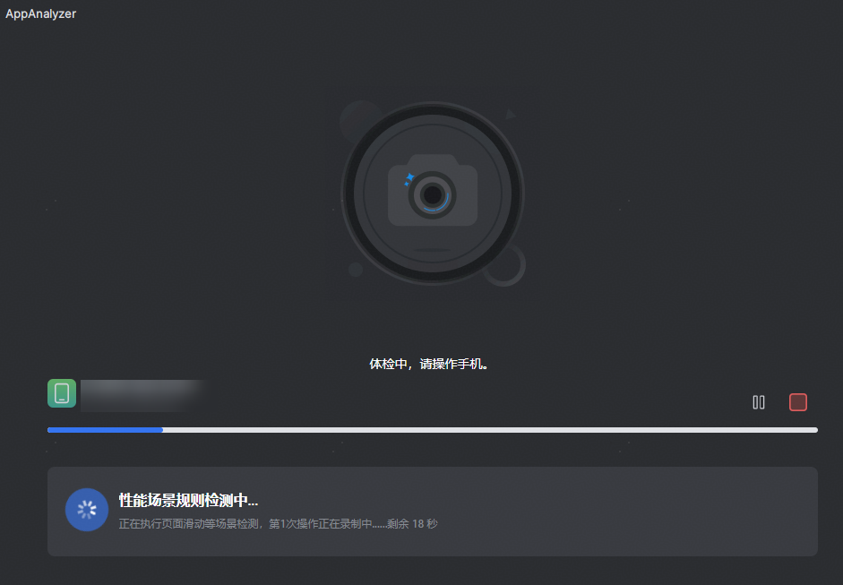


生成性能体检报告。工具分析后，若检测未通过如下所示。


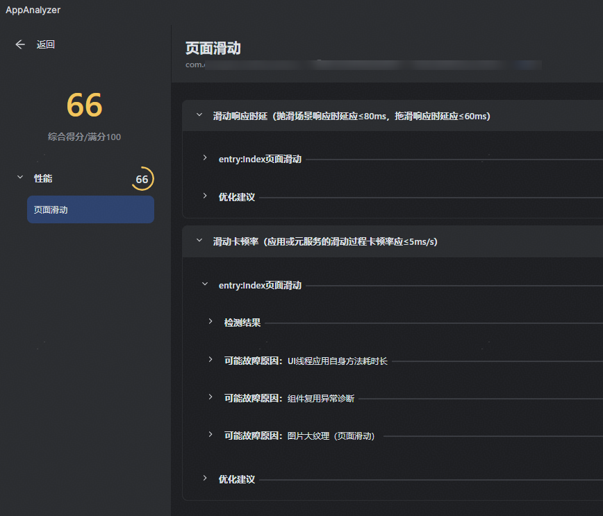


> [!NOTE]
> AppAnalyzer在以下场景中可能检测不到丢帧：
>       页面中视频播放或动画运行时存在补帧，此时检测页面内的UI滑动组件。例如视频播放页中的滑动评论区，对评论区进行滑动场景检测，可能识别不了丢帧。


### 第2步：丢帧问题分析


AppAnalyzer在详情报告中会显示具体的故障原因，并提供相应的优化建议。此处列举以下问题原因进行说明：

问题1：UI线程应用自身方法耗时长

UI线程方法耗时过长会导致滑动卡顿，工具会将耗时长的函数方法名、总耗时、平均耗时、执行次数等，以表格形式呈现出来。

当开发者点击函数超链接，可以直接跳转到代码行，当开发者点击总耗时列的超链接，可以跳转到profiler并看到函数内部Callstack泳道。开发者可以根据表格信息检视代码进行优化。

具体有以下三种情况：

- 如果函数的单次调用耗时长（查看平均耗时），说明是函数本身耗时长，开发者自行优化函数，将函数放到子线程或者进行缓存，开发者可参考[其他主线程优化思路](https://developer.huawei.com/consumer/cn/doc/best-practices/bpta-time-optimization-of-the-main-thread#section4365993361)。
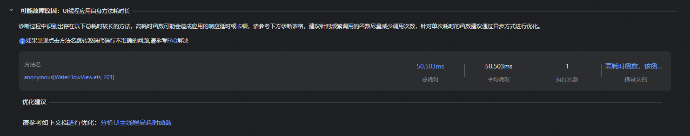
- 如果函数本身耗时不长，但是函数调用次数多（例如在高频回调里打日志等操作）
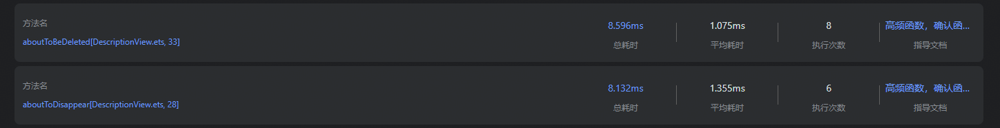
确认函数是不是每次都要调用，能否通过一些全局或者缓存的方式降低调用次数，避免高频回调，开发者可参考[高频回调场景](https://developer.huawei.com/consumer/cn/doc/best-practices/bpta-time-optimization-of-the-main-thread#section10112623611)。
- 如果方法名aboutToBeDeleted调用次数过多，如下图所示：

此时需要点击**总耗时**列的超链接，打开trace向前排查主线程是否有阻塞。如下图所示也是因为前面的主线程阻塞导致的，因为destroy只会发生在idle，如果主线程阻塞一直没有idle，就会积压；
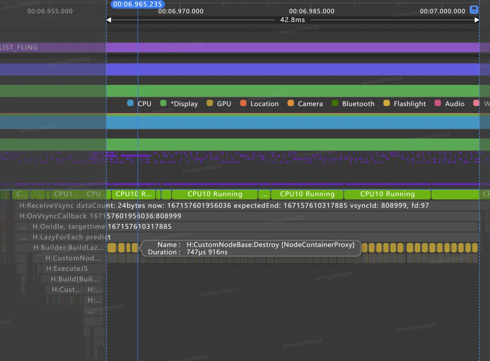
解决方案：可以采用并行化，或者缓存的方式来优化业务逻辑。开发者可参考[其他主线程优化思路](https://developer.huawei.com/consumer/cn/doc/best-practices/bpta-time-optimization-of-the-main-thread#section4365993361)。 设置子线程优先级的方法有两种，具体可参考：[Priority](https://developer.huawei.com/consumer/cn/doc/harmonyos-references/js-apis-taskpool#priority)和[QoS开发指导](https://developer.huawei.com/consumer/cn/doc/harmonyos-guides/qos-guidelines)。


问题2：组件未有效复用

工具通过实时检测组件的复用情况，有效避免组件对象在运行过程中被频繁创建与销毁，从而减少内存回收的频率，提升整体性能。

在测试结果列表中，工具会明确标识出滑动等高频操作中存在创建行为的组件，这些组件可能存在优化空间，建议结合“组件复用”机制进行相应调整。组件的复用更新流程与常规状态管理更新方式保持一致，具体可参考状态管理最佳实践。各种复用问题的分析优化可参考组件复用问题诊断分析。


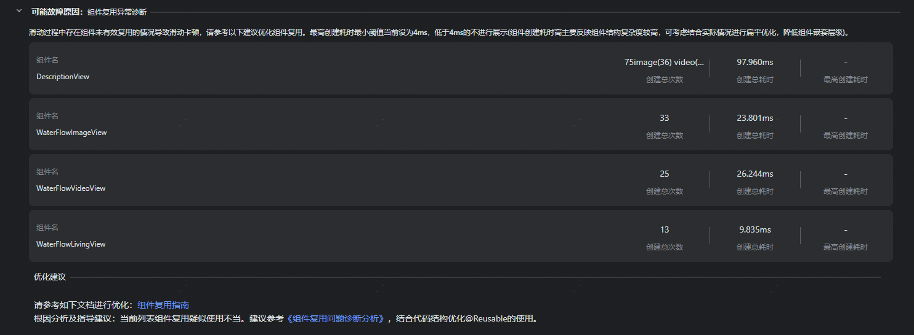


问题3：图片纹理过大


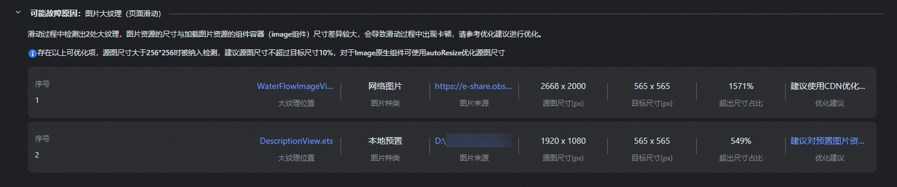


开发者可以根据图片组件所在源码文件，以及图片来源中的路径信息，查找图片并修改；

图片来源有 5 种：

- 代码工程 rawfile 目录图片路径，可通过点击图片来源超链接直接在 IDE 中预览。
- 代码工程 media 目录图片路径，可通过点击图片来源超链接直接在 IDE 中预览。
- 沙箱图片路径，是应用的独立沙箱空间存储位置。
- 共享媒体库目录图片路径，可被多个应用或用户共同访问的媒体文件存储位置。
- 网络图片路径，可通过点击图片来源超链接直接在浏览器中预览。


源图尺寸显示源图的宽 (px)× 高 (px)。

目标尺寸显示实际 Image 组件的宽 (px)× 高 (px)。

超出尺寸占比表示源图超过目标尺寸的程度。

图片大纹理检测尺寸大于 256*256 像素且超出组件尺寸 10% 的图片建议开发者优化，针对不同来源与种类的图片可以采取每行对应的优化建议进行修改。例如，针对IDE中存放的本地图片可参考图片资源加载优化，针对沙箱类型的图片可以设置Image组件的autoResize属性为true来让源图尺寸贴近组件尺寸，针对网络图片可以采取webp的压缩手段缩小图片体积，针对Gif图片可以降低每帧分辨率。


### 第3步：验证优化效果


使用合理的优化方案修改工程后，可以再次使AppAnalyzer进行测试，验证优化后的效果。当没有异常信息报告时，表明这次优化达到了预期。

如下图所示：


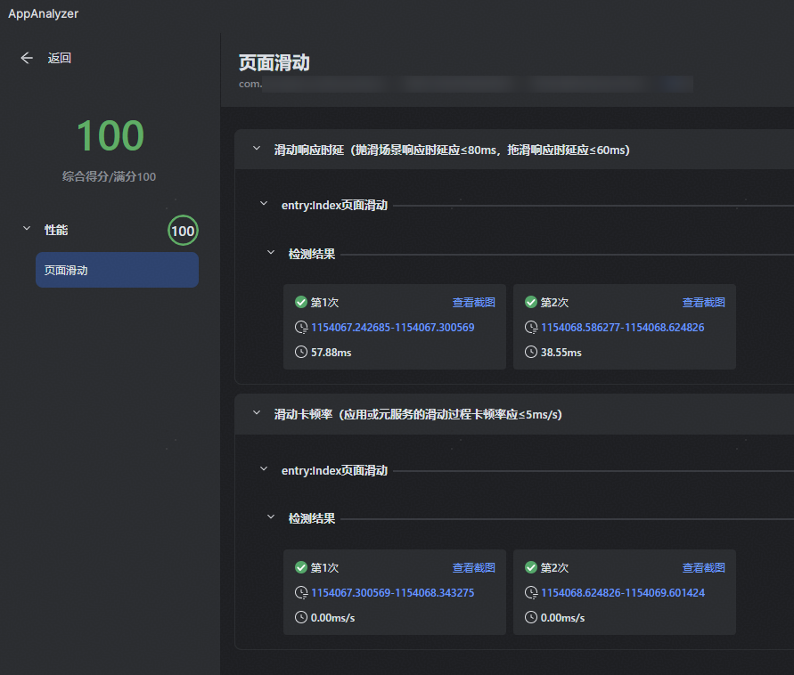


如果问题仍未解决，可以根据建议，进一步分析Trace定位问题，然后选择优化方式。


### 使用Trace分析定位丢帧问题


录制Frame模板

发现卡顿丢帧问题后，创建Frame模板进行录制。在录制期间，复现卡顿丢帧场景。具体操作步骤请参见性能问题定位：深度录制。

录制完成后，在时间轴上拖动鼠标选定要查看的时间段，例如2.5秒的时间区段。选中Frame主泳道，查看Statistics栏，可以发现应用在这个时间段内丢失了16帧，丢帧率为7%。


认识卡顿帧

使用Frame Profiler录制了一段Trace。在时间轴上拖动鼠标选定要查看的时间段，选择了一个2.5秒的时间区段。选中Frame主泳道，查看下面的Statistics栏，发现应用在这个时间段内丢失了16帧，丢帧率为7%。


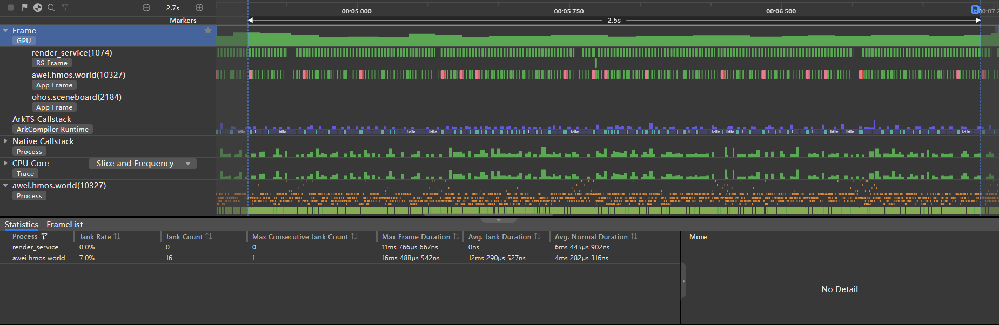


丢帧问题可能出现在Render Service或App侧。上图中的丢帧主要出现在应用帧，针对这种现象，继续分析，放大右侧图表，选中超时帧查看详细数据。期望时间为8.3毫秒（当前设备为120赫兹），而实际处理时间为8.9毫秒。


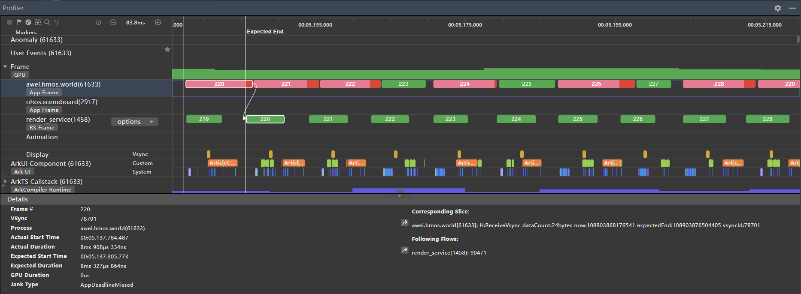


> [!NOTE]
> 在“RS Frame”和“App Frame”标签的泳道中，正常完成渲染的帧显示为绿色，出现卡顿的帧显示为红色。其中期望结束时间点之前的部分为浅红色（两条白色竖线区间），超出期望结束时间的部分为深红色，异常帧显示为黄色。


发现问题后，我们接着分析丢帧问题。应用丢帧的原因包括应用本身、系统和硬件层。不同卡顿原因在Trace中的表现各异，识别这些原因需要丰富的经验。


分析丢帧原因

分析丢帧问题时，结合App主进程和Render Service渲染进程的Trace数据，先排查系统异常，再分析应用原因。开发者可按以下步骤定位问题：

1 看线程状态和运行核，看是否被其他进程抢占资源，排除系统侧运行异常。

从下图可以看到，应用线程大部分时间处于Running状态，无特殊异常，运行在CPU10和CPU11上。

图7 丢帧处应用主线程状态

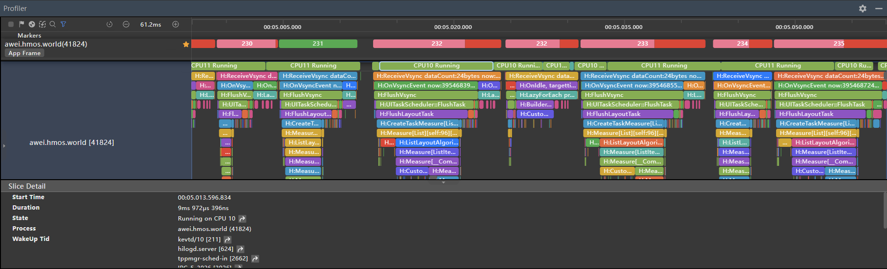


查看关键任务是否在小核上以低频运行。从图8的CPU Slice和Frequency泳道中，可以看到丢帧处的应用线程和前面正常帧类似，主要运行在大核上（该设备0~3号CPU为小核，4~11号CPU为大核）。将鼠标悬停在Frequency泳道上，可以查看CPU的运行频率。

图8 丢帧处应用主线程运行核

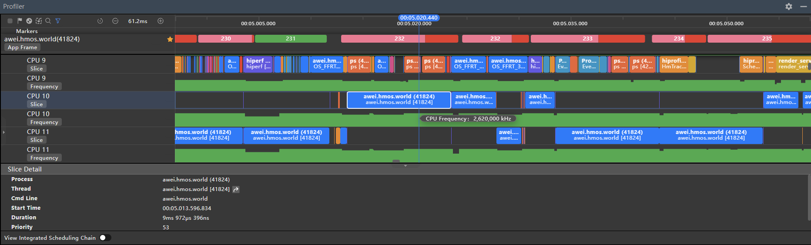


通过分析，应用线程在CPU大核上正常运行，且频率正常。因此，可以排除系统异常。

如果应用线程运行出现以下问题，开发者可以进行在线提单反馈异常。

- 执行频率较低
- 线程在小核上工作
- 线程频繁在Running和Runnable之间切换
- 线程频繁在Running和Sleep之间切换
- 不重要的线程占用了大核


> [!NOTE]
> 出于兼顾高性能、低功耗的需求，多核工程机常采用异构架构设计，根据CPU频率，区分大中小核等。


2 找到Trace中每一帧耗时的部分，大致定位是App侧问题还是RS侧问题，并结合Trace标签，初步定位原因。

通过Frame泳道，可以快速发现丢帧位置并完成初步定界：

- App侧出现红色，需要审视UI线程的处理逻辑是否过于复杂或低效，以及是否被其他任务抢占资源。
- 如果是Render Service帧处理出现红色，需要审视是否是界面布局过于复杂。可以借助DevEco Studio内的ArkUI Inspector、HiDumper等工具进一步分析，参考[布局嵌套过深](#section1861971332220)示例。


前面示例中的丢帧主要出现在应用侧。针对这种丢帧现象，继续分析。放大右侧图表，选中超时的帧（220#帧）查看详细数据。期望处理时间为8.3ms（当前设备为120Hz），而实际处理时间为8.9ms。


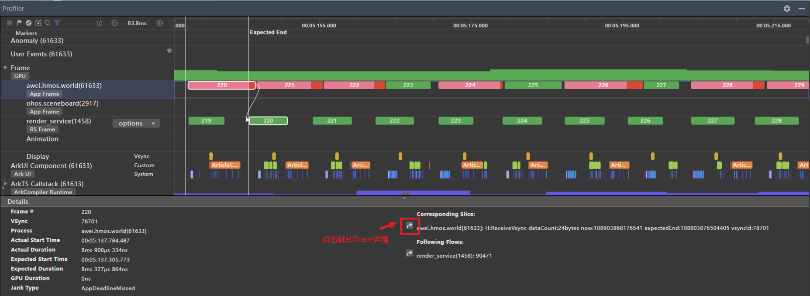


接下来通过Trace查看每一帧的具体耗时，点击

图标跳转到卡顿帧应用侧Trace详情，如下图所示。开发者，可以点击泳道信息区的收藏按钮，将应用帧处理的泳道收藏置顶，防止上下文信息丢失。


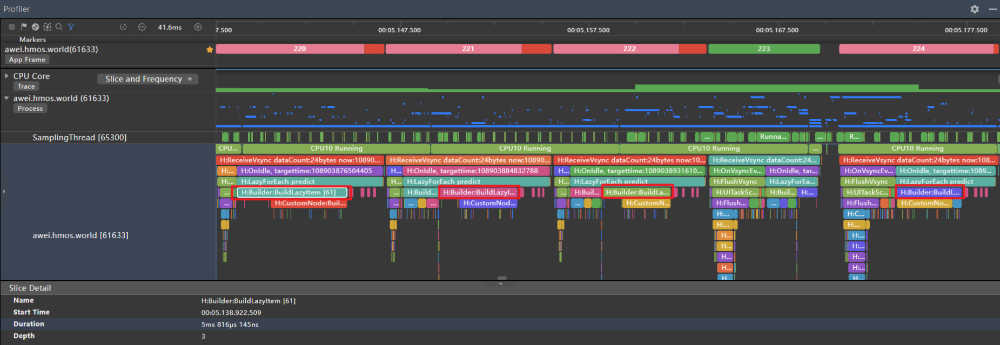


从上图可见，每个卡顿帧下均通过BuildLazyItem方法构建列表项，且耗时较长。可以推断，列表懒加载时，Item绘制时间较长是导致卡顿的主要原因。在ArkUI Component泳道上，直观可见自定义组件ArticleView的绘制频率高且耗时，频繁绘制组件可能影响应用的帧率。


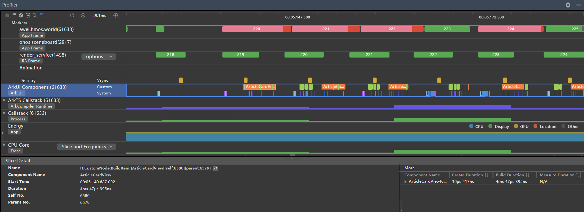


在Frame模板中，要查看ArkUI Component泳道，需在泳道录制前手动勾选，如图所示：


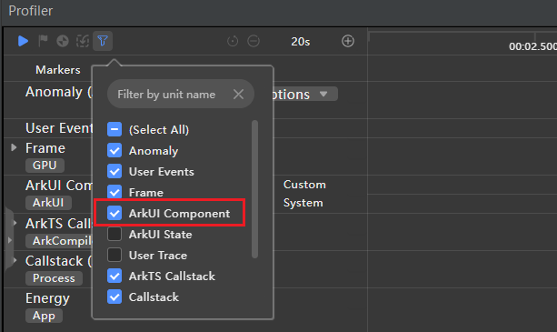


3 查看ArkTS函数调用栈信息，排查应用代码。

可以结合Frame Profiler工具，选择ArkTS Callstack泳道查看热点函数，方便地跳转到源码，定位绘制时间较长的自定义组件。如下图所示，可以看到自定义组件ArticleCardView的绘制频繁。下面以220#帧为例子，通过热点函数可以看到其中initialRenderView 和__lazyForEachItemGenFunction这两个方法比较耗时，占比分别达到52.7%和22.9%，其中绿色的”ArkTS”表示双击该行可以跳转到应用源码。


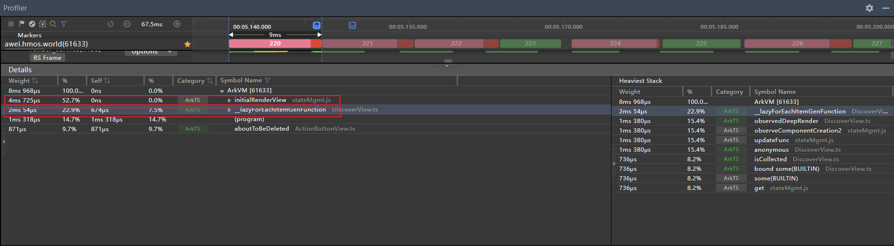


以initialRenderView函数的耗时为例进行分析，展开函数后，可以看到主要耗时在列表项ListItem的子组件ArticleCardView的创建上。


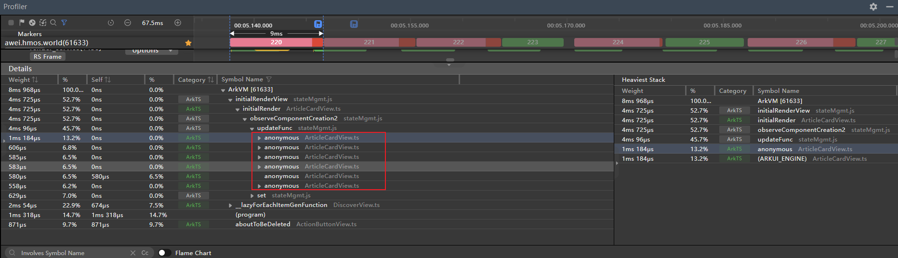


展开组件函数调用链进行详细分析，通过查看函数调用可以发现，使用了@Prop变量。@Prop装饰的变量会对父组件传入的状态值进行深拷贝，如果@Prop装饰器装饰的变量为复杂对象、类或其类型数组时，会增加状态创建时间并占用大量内存。双击跳转到源码，可以看到自定义组件ActionButtonView中确实使用了@Prop装饰器变量。


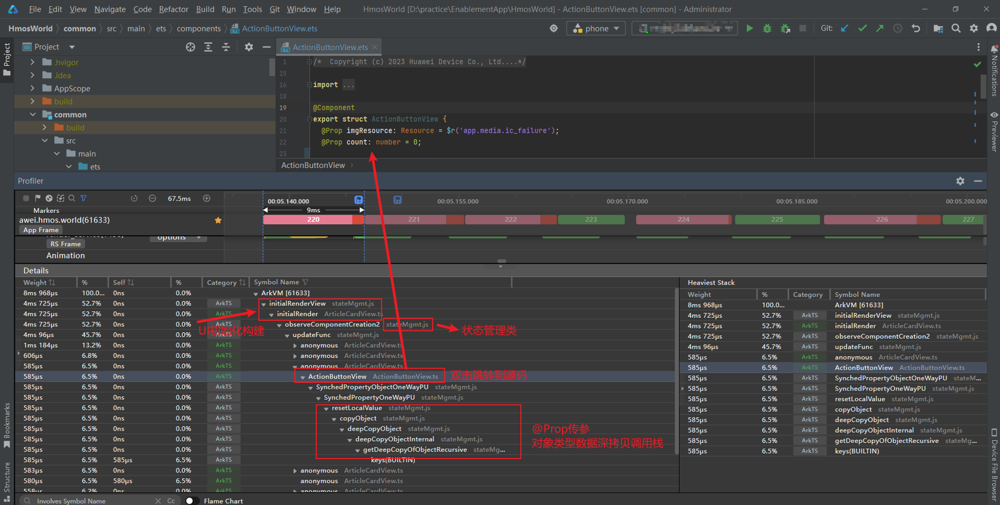


其它函数的详细调用和耗时情况在此不再一一列举。


选择优化方案

选择优化方案需要一些经验的积累，开发者可以参考一些性能优化的最佳实践，来选择相应的优化方法。

对丢帧问题进行优化。根据前面的分析结果，从两方面解决卡顿问题：

- 使用组件复用能力@Reusable来减少组件的频繁创建。可复用组件从组件树上移除时，会进入到一个回收缓存区。后续创建新组件节点时，会复用缓存区中的节点，节约组件重新创建的时间。
- 简化组件创建的逻辑，使用更高效的@Builder来构建列表项Item的子组件，替代原有@Component自定义组件的方式。此外使用@Builder以后，就不需要使用@Prop变量了，从而减少了数据的深拷贝耗时。


优化后的示例代码如下：

```ts
@Component
struct DiscoverView {
  // ...

  build() {
    List() {
      ForEach(this.dataSource, (item: LearningResource) => {
        ListItem() {
          ArticleCardView()
          .reuseId('article')
        }
      }, (item: LearningResource) => item.id.toString())
    }
  }
}

// ...
// Add @Reusable Decorator Use Component Reuse
@Reusable
@Component
export struct ArticleCardView {
  // ...
  aboutToReuse(params: Record<string, Object>): void {
    // ...
  }
  Row() {
    ActionButtonBuilder()
    ActionButtonBuilder()
    ActionButtonBuilder()
  }
  build() {
    // ...
  }
}


// Build subcomponents using @Builder
@Builder
function ActionButtonBuilder() {
  // ...
}
```


## 常见丢帧问题


下面列举了一些常见的丢帧问题及其对应的Trace，并提供了一些优化方案，便于开发者识别和定位问题。


### 自定义动画丢帧问题


在播放或生成动画时，画面停滞导致帧率降低的现象称为动画丢帧。

播放动画时，系统必须在一个刷新周期内完成动画曲线计算和组件布局绘制。建议使用系统提供的动画接口，设置曲线类型、终点位置和时长，即可满足常用动画需求，减轻UI主线程的负载。

下面使用了自定义动画，动画曲线的计算过程可能会增加UI线程的负载，从而导致丢帧。

```ts
@Entry
@Component
struct AnimationDemo1 {
  @State widthSize: number = 200;
  @State heightSize: number = 100;
  @State flag: boolean = true;

  computeSize() {
    let duration = 2000;
    let period = 16;
    let widthSizeEnd = 0;
    let heightSizeEnd = 0;
    if (this.flag) {
      widthSizeEnd = 100;
      heightSizeEnd = 50;
    } else {
      widthSizeEnd = 200;
      heightSizeEnd = 100;
    }
    let doTimes = duration / period;
    let deltaHeight = (heightSizeEnd - this.heightSize) / doTimes;
    let deltaWeight = (widthSizeEnd - this.widthSize) / doTimes;
    for (let i = 1; i <= doTimes; i++) {
      let t = period * (i);
      setTimeout(() => {
        this.heightSize = this.heightSize + deltaHeight;
        this.widthSize = this.widthSize + deltaWeight;
      }, t);
    }
    this.flag = !this.flag;
  }


  build() {
    Column() {
      Button('click me')
      .onClick(() => {
        let delay = 500;
        setTimeout(() => {
          this.computeSize();
        }, delay);
      })
      .width(this.widthSize)
      .height(this.heightSize)
      .backgroundColor(0x317aff)
    }.width('100%')
    .margin({ top: 5 })
  }
}
```

使用Frame Profiler录制Trace，可以看到动画帧率为63fps，而当前设备支持120Hz的刷新率。


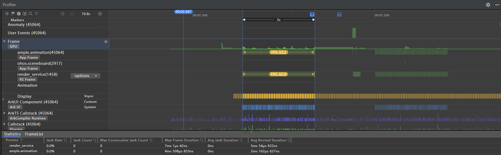


建议开发者使用系统属性动效API实现动效功能，下面以属性动画为例：

```ts
@Entry
@Component
struct AnimationDemo2 {
  @State widthSize: number = 200;
  @State heightSize: number = 100;
  @State flag: boolean = true;

  build() {
    Column() {
      Button('click me')
      .onClick(() => {
        if (this.flag) {
          this.widthSize = 100;
          this.heightSize = 50;
        } else {
          this.widthSize = 200;
          this.heightSize = 100;
        }
        this.flag = !this.flag;
      })
      .width(this.widthSize)
      .height(this.heightSize)
      .backgroundColor(0x317aff)
      .animation({
        duration: 2000,
        curve: Curve.Linear,
        delay: 500,
        iterations: 1,
        playMode: PlayMode.Normal
      })
    }
    .width('100%')
    .margin({ top: 5 })
  }
}
```

使用Frame Profiler录制优化后的Trace，动画帧率提升至116.9fps。


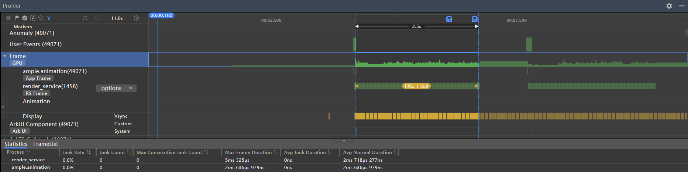


### 布局嵌套过深


视图的嵌套层次会影响应用性能。在120Hz刷新率的设备上，每8.3ms刷新一帧。如果视图嵌套层次多，可能无法在8.3ms内完成屏幕刷新，导致丢帧卡顿，影响用户体验。推荐移除多余嵌套层次，使用相对布局（RelativeContainer），缩短组件刷新时间。

以下示例在列表中加载了2000条数据，子组件ChildComponent的布局嵌套了20层Stack组件。

```ts
class MyDataSource implements IDataSource {
  private dataArray: string[] = [];

  public pushData(data: string): void {
    this.dataArray.push(data);
  }

  public totalCount(): number {
    return this.dataArray.length;
  }

  public getData(index: number): string {
    return this.dataArray[index];
  }

  registerDataChangeListener(listener: DataChangeListener): void {
  }

  unregisterDataChangeListener(listener: DataChangeListener): void {
  }
}

@Entry
@Component
struct StackDemo1 {
  // The LazyForEach data initialization process is omitted here.
  private data: MyDataSource = new MyDataSource();

  build() {
    List() {
      LazyForEach(this.data, (item: string) => {
        ListItem() {
          ChildComponent({ item: item })
        }
        .reuseId('child')
      }, (item: string) => item)
    }.cachedCount(5)
  }
}

@Reusable
@Component
struct ChildComponent {
  @State item: string = '';

  aboutToReuse(params: Record<string, Object>): void {
    this.item = params.item as string;
  }

  build() {
    Stack() {
      Stack() {
        // Stack nesting is omitted here
        Text(this.item)
        .fontSize(50)
        .margin({ left: 10, right: 10 })
      }
      // ...
    }
  }
}
```

使用Frame Profiler进行录制，直接查看应用侧的Trace数据，具体分析步骤请参见前面的丢帧问题分析思路章节。


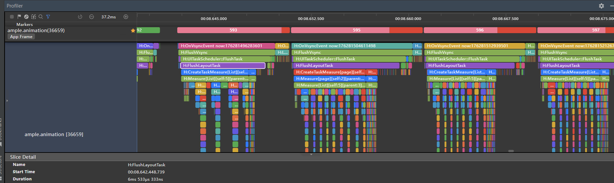


结合卡顿帧对应时间段的Trace数据，定位到FlushLayoutTask耗时过长。其作用是重新测量和布局所有Item，Measure方法耗时较长。卡顿原因可能是布局处理逻辑复杂或低效。

开发者可以使用ArkUI Inspector，在DevEco Studio上查看应用在真机上的UI显示效果。利用ArkUI Inspector工具，开发者可以快速定位布局问题或其他UI相关问题。效果图如下：


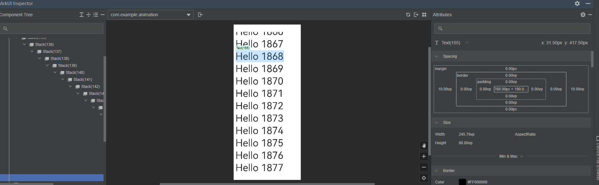


可以直观看到Item的嵌套较深。接下来，减少不必要的嵌套以解决丢帧问题。示例代码如下：

```ts
@Reusable
@Component
struct ChildComponent {
  @State item: string = '';

  aboutToReuse(params: Record<string, Object>): void {
    this.item = params.item as string;
  }

  build() {
    Stack() {
      Text(this.item)
      .fontSize(50)
      .margin({ left: 10, right: 10 })
    }
  }
}
```

再次使用Frame Profiler进行录制，可以看到丢帧问题已经解决。


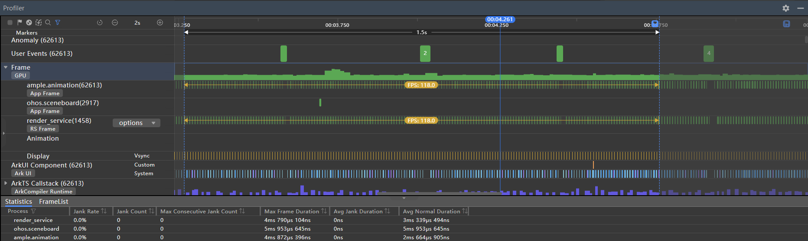


### 主线程中执行冗余和耗时操作


避免在主线程中执行冗余或耗时操作，这可能导致UI渲染阻塞，引起界面卡顿或掉帧，尤其在高频回调中。参考主线程耗时操作优化指导。


## 丢帧问题优化建议


图形渲染流程包括两个关键步骤：应用侧生成界面描述数据结构，Render Service进行绘制。这两个步骤中可能出现AppDeadlineMissed和RenderDeadlineMissed卡顿。AppDeadlineMissed通常由应用逻辑处理代码效率低下引起，可结合Trace数据和热点函数分析；RenderDeadlineMissed可能由界面结构复杂或GPU负载过大引起，可使用ArkUI Inspector工具和HiDumper命令行工具辅助分析。

针对常见的丢帧问题，以下列出了一些优化建议：

- 尽量减少布局的嵌套层数，[合理使用布局](https://developer.huawei.com/consumer/cn/doc/best-practices/bpta-improve-layout-performance)，使用[相对布局 (RelativeContainer)](https://developer.huawei.com/consumer/cn/doc/harmonyos-guides/arkts-layout-development-relative-layout)来减少层级。
- 使用[组件复用](https://developer.huawei.com/consumer/cn/doc/best-practices/bpta-best-practices-long-list#section36781044162218)减少组件的重复创建与渲染。
- 合理管理状态变量，精准控制组件更新范围，避免冗余刷新。具体参考[状态管理最佳实践](https://developer.huawei.com/consumer/cn/doc/best-practices/bpta-status-management)。
- 使用LazyForEach加载长列表，具体优化方法可以参考[优化长列表加载慢丢帧问题](https://developer.huawei.com/consumer/cn/doc/best-practices/bpta-best-practices-long-list)。
- 使用系统提供的动画接口，避免动画丢帧。
- 优化主线程中的耗时操作，具体可以参考[主线程耗时操作优化指导](https://developer.huawei.com/consumer/cn/doc/best-practices/bpta-time-optimization-of-the-main-thread)。
