# 性能分析简介

更新时间：2026-03-12 08:45:02

来源：https://developer.huawei.com/consumer/cn/doc/best-practices/bpta-optimization-overview

**   

##### 概述

性能优化是指改进应用程序运行速度、资源利用效率和响应时间的系统性工作。通过优化可提升应用性能和稳定性。在数字化时代，随着应用程序的复杂性和规模不断增加，调优变得尤为重要。有效调优不仅能使应用程序更高效地运行，还能提高稳定性，提升效率，减少资源浪费，从而改善用户体验。因此，开发人员了解调优方法和常用工具至关重要。
 
调优过程包括现场复现、问题分析、确定解决方案和性能测试这几个关键步骤。现场复现是在具体环境中重现问题，以便更好地分析和解决。问题分析阶段深入分析应用程序的性能瓶颈和问题根源，为后续优化提供指导。确定解决方案是根据问题分析结果，制定具体的优化方案和措施。性能测试是验证调优效果的关键步骤，通过测试优化后的应用程序，评估改进效果。
 
为了有效进行调优工作，需要借助常用的工具。例如，性能分析工具DevEco Profiler可以监测应用的性能指标、录制Trace记录。开发者可以通过分析Trace数据，发现代码中的性能瓶颈，进而优化性能。
 
本文将介绍调优方法和常用工具，帮助开发者分析和解决应用程序性能问题，提升用户体验，确保应用程序高效稳定运行。
 
在日常开发中，需要关注的指标有完成时延、点击响应时延、滑动响应时延等，具体需要关注的指标可以参考[《性能体验设计》](https://developer.huawei.com/consumer/cn/doc/best-practices/bpta-smooth-application-design)。
 
 

##### 调优分析步骤

调优分析方法在应用程序优化中起着关键作用，帮助开发人员识别问题、定位瓶颈并改进系统性能。具体调优分析方法如下：
 1. 现场复现是调优分析的第一步。开发人员通过复现报错、卡顿等问题，确认问题现象和性能瓶颈，更好地理解和定位问题，为后续分析提供信息。
2. 问题分析是调优过程中的关键步骤。确认问题现象后，参考相关可观测性数据，深入分析和诊断应用程序的问题。通过系统性分析，定位问题根源，为后续优化工作奠定基础。
3. 确定解决方案：在问题分析阶段确定问题根源后，开发人员需制定具体的解决方案。这包括回归代码，结合业务场景和API，找出合适的优化方案。
4. 性能测试：这是验证调优效果的最后一步。测试优化后的应用程序，确保性能提升有效。性能测试帮助评估改进效果，发现潜在问题，进一步优化应用性能。
 
调优分析是应用程序优化的关键步骤。通过现场复现、问题分析、确定解决方案和性能测试，开发人员可以识别并解决应用性能问题，提升应用程序的效率和稳定性。
 
 

##### 常见工具

 

##### DevEco Profiler

性能调优工具能帮助开发者识别应用中的性能问题。DevEco Studio提供了多种场景化调优工具DevEco Profiler，具体如下：
 
- [启动分析工具Launch Profiler](https://developer.huawei.com/consumer/cn/doc/harmonyos-guides/ide-insight-session-launch)： 分析启动过程中各阶段的性能问题。Launch主要用于分析应用或服务的启动耗时，分析启动周期各阶段的耗时情况、核心线程的运行情况等，协助开发者识别启动缓慢的原因。
- [帧率分析工具Frame Profiler](https://developer.huawei.com/consumer/cn/doc/harmonyos-guides/ide-insight-session-frame)： 用于深度分析应用或服务卡顿丢帧的原因。Frame用于录制GPU数据信息，录制完成的子泳道对应录制过程中各个进程的帧数据，主要用于深度分析应用或服务卡顿丢帧的原因。Frame会对Trace进行录制和解析，进而可以分析应用运行的性能及其瓶颈，最终得出优化方案，关于Trace的详细介绍可参考[Trace打点信息说明](#section085643405116)。
- [耗时分析工具Time Profiler](https://developer.huawei.com/consumer/cn/doc/harmonyos-guides/ide-insight-session-time)： 在应用/服务运行时，展示热点区域内基于 CPU 和进程耗时分析的调用栈情况。Time可在应用/服务运行时，展示热点区域内基于CPU和进程耗时分析的调用栈情况，并提供跳转至相关代码的能力，使开发者更便捷地进行代码优化。
- [内存分析工具Allocation Profiler](https://developer.huawei.com/consumer/cn/doc/harmonyos-guides/ide-insight-session-allocations)： 实时监测应用或服务内存使用情况。开发者可以使用Allocation内存分析器，识别可能会导致应用卡顿、内存泄漏、内存抖动的问题。
- [内存快照Snapshot Profiler](https://developer.huawei.com/consumer/cn/doc/harmonyos-guides/ide-insight-session-snapshot)： 用于分析应用程序内存使用情况。内存快照（Snapshot）是一种用于分析应用程序内存使用情况的工具，通过记录应用程序在运行时的内存快照，可以快速查看应用程序在某一时刻的内存占用情况以及内存占用详情。
- [应用性能分析工具CPU Profiler](https://developer.huawei.com/consumer/cn/doc/harmonyos-guides/ide-insight-session-cpu)： 该工具可以监测应用的CPU使用情况，为开发者提供性能采样分析手段，可在不插桩的情况下获取调用栈上各层函数的执行时间，并展示在时间轴上。
- [ArkWeb分析工具](https://developer.huawei.com/consumer/cn/doc/harmonyos-guides/ide-profiler-arkweb)：DevEco Profiler提供ArkWeb分析模板，可以结合ArkWeb执行流程的关键trace点来定位问题发生的阶段。
- [Network分析工具](https://developer.huawei.com/consumer/cn/doc/harmonyos-guides/ide-profiler-network)：DevEco Profiler提供Network模板，帮助用户在应用运行过程中查看http协议栈网络信息，包括请求分段耗时以及请求具体内容，方便对网络问题进行调优。

 
其他常见的性能调优工具，包括[HiDumper](https://developer.huawei.com/consumer/cn/doc/harmonyos-guides/hidumper)、[SmartPerf](https://gitcode.com/openharmony-sig/smartperf)。
 
- 性能优化工具HiDumper：HiDumper是为开发和测试人员提供的系统信息获取工具，帮助分析和定位问题。在应用开发过程中，可以使用HiDumper命令行工具获取UI界面组件树信息，配合ArkUI Inspector等图形化工具定位布局性能问题。此外，还可以使用该命令行工具获取内存和CPU使用情况等系统数据，评估应用性能。
- 性能功耗调优工具SmartPerf：SmartPerf是一款用于深入挖掘和细粒度展示数据的性能功耗调优工具。它可以采集CPU调度、频点、进程线程时间片、堆内存、帧率等数据，并通过泳道图清晰地呈现给开发者。同时，SmartPerf通过GUI以可视化的方式进行分析。目前，该工具为开发者提供了五个分析模板：帧率分析、CPU/线程调度分析、应用启动分析、TaskPool分析和动效分析。

 
 
> [!NOTE]
> DevEco Profiler工具不支持模拟器进行调优。

 

##### ArkUI Inspector

**介绍**
 
开发者可以使用[Inspector双向预览](https://developer.huawei.com/consumer/cn/doc/harmonyos-guides/ide-previewer-inspector)，在DevEco Studio上查看应用在真机上的组件布局，并通过查看多次操作后的界面状态，快速分析定位状态变量、组件嵌套层次、UI界面布局存在的问题等。
 
**使用方法**
 
详细使用指导见：
 
[布局分析](https://developer.huawei.com/consumer/cn/doc/harmonyos-guides/ide-arkui-inspector)
 
 

##### Trace打点信息说明

HarmonyOS的DFX子系统提供了为应用框架以及系统底座核心模块的性能打点能力，每一处打点即是一个Trace，其上附带了记录执行时间、运行时格式化数据、进程或线程信息等。开发者可以使用DevEco Studio的Frame对Trace进行解析，并在其绘制的泳道图中识别关键渲染流程。
 
 

##### 线程状态转化流程

在HarmonyOS中，Trace记录的线程状态主要分为运行中（Running）、可运行（Runnable）、休眠中（Sleep）、IO阻塞下不可中断的睡眠态（Uninterruptible Sleep - IO）、不可中断的睡眠态（Uninterruptible Sleep - non IO）。其状态转化图如下：
 
图1 **线程状态转化图

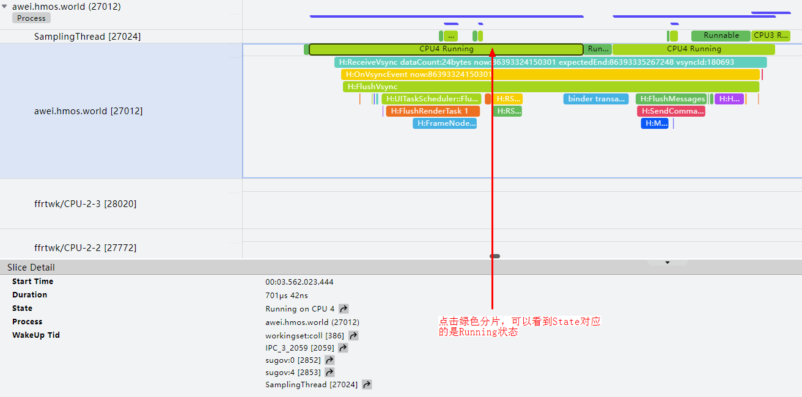

 
 
 

##### 通过Trace点位信息识别线程状态

Trace 会用不同的颜色来标识不同的线程状态，在每个方法上面都会有对应的线程状态来标识目前线程所处的状态，通过查看线程状态可以分析出当前的性能瓶颈。
 
**（1）运行中（Running）**
 

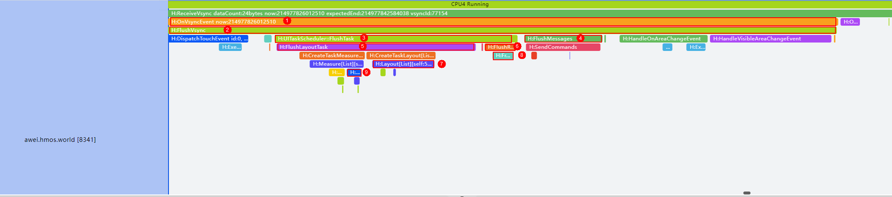

 
运行中（Running）表示处于该状态的线程才可能在CPU上运行。同一时刻可能有多个线程处于可执行状态，这些线程的task_struct结构被放入对应CPU的可执行队列中，每个线程最多出现在一个CPU的可执行队列中。调度器从各个CPU的可执行队列中选择一个线程在该CPU上运行。
 
**（2）可运行（Runnable）**
 

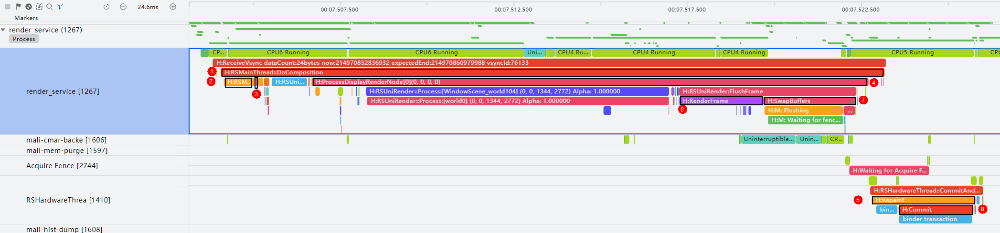

 
可运行（Runnable）表示线程可以运行但当前未被调度，在等待CPU。Runnable状态持续时间越长，说明CPU调度越忙，未能及时处理该任务。
 
**（3）休眠中（Sleep）**
 

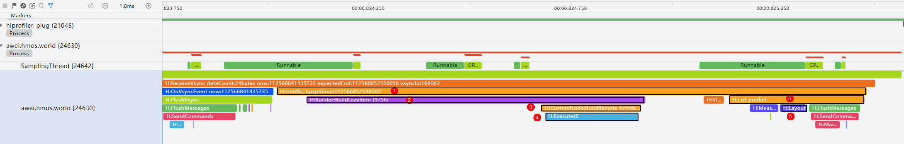

 
休眠中（Sleep）表示线程没有工作，可能是因为在互斥锁上被阻塞，或在等待某些操作返回，通常是在等待事件驱动。
 
**（4）IO阻塞下不可中断的睡眠态（Uninterruptible Sleep - IO）**
 

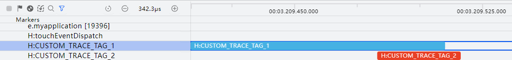

 
IO阻塞下不可中断的睡眠态（Uninterruptible Sleep - IO）表示线程在I/O上被阻塞或等待磁盘操作完成。当系统处于低内存状态时，申请内存的时候可能会触发page fault，从而导致有大量的不可中断的睡眠态出现。在Linux系统的page cache链表中，有时会出现一些还没准备好的page(即还没把磁盘中的内容完全地读出来) ，而正好此时用户在访问这个page时就会出现page fault。
 
**（5）不可中断的睡眠态（Uninterruptible Sleep - non IO）**
 

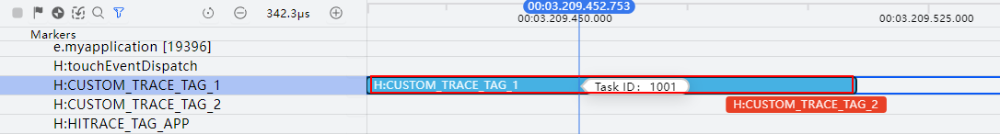

 
不可中断的睡眠态（Uninterruptible Sleep - non IO）表示线程在其他内核操作（如内存管理）上被阻塞。线程陷入内核态，有时是正常现象，有时则需要进一步分析。
 
 

##### 渲染流程

在HarmonyOS中，图形系统采用统一渲染模式，遵循典型流水线模式。以60Hz刷新率为例，每个Vsync周期为16.7ms；90Hz时，每个Vsync周期为11.1ms；120Hz时，每个Vsync周期为8.3ms。
 
**图2 **90Hz刷新率渲染流程**
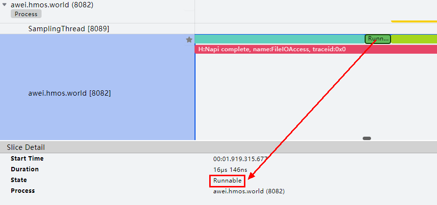

 
在整个渲染流程中，应用侧首先响应消费者的屏幕点击等输入事件，处理完成后提交给Render Service。Render Service协调GPU等资源处理，最终将图像送到屏幕上显示。
 1. 应用侧（App）处理用户的屏幕点击等输入事件，生成界面描述的数据结构。该数据结构包含UI元素的位置、大小、资源、绘制指令和动效属性。
2. Render Service（渲染服务部件）是图形栈中负责界面内容绘制的模块，主要职责是对接ArkUI框架，支撑ArkUI应用的界面显示，包括控件、动效等UI元素。Render Service 的 RenderThread 线程在 Vsync 信号下触发 UI 绘制，绘制过程包含三个阶段：动效、描画和提交。
3. Display是显示屏幕的抽象概念，可以是实际的物理屏也可以是虚拟屏。其中应用侧的渲染流程如下图所示。了解ArkUI的渲染流程有助于定位应用侧的卡顿问题出现在哪个环节。
 
图3 **ArkUI渲染管线结构与Frame Insight性能打点
 

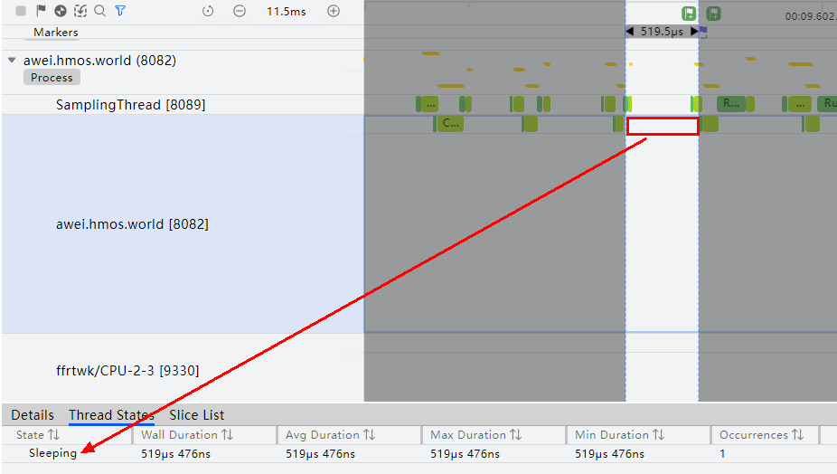

 
- Animation：动画阶段，在动画过程中会修改相应的FrameNode节点触发脏区标记，在特定场景下会执行用户侧ets代码实现自定义动画；
- Events：事件处理阶段，比如手势事件处理。在手势处理过程中也会修改FrameNode节点触发脏区标记，在特定场景下会执行用户侧ets代码实现自定义事件；
- UpdateUI：自定义组件（@Component）在首次创建挂载或状态变量变更时会标记为需要重建状态。在下一次Vsync信号到来时，执行重建流程，生成相应的组件树结构和属性样式修改任务。
- Measure：布局包装器执行相关的大小测算任务。
- Layout：布局包装器执行相关的布局任务。
- Render：绘制任务包装器执行相关的绘制任务，执行完成后会标记请求刷新RSNode绘制
- SendMessage：请求更新界面绘制。

 
在整个处理流程中，应用侧和Render Service侧都可能出现卡顿，导致最终用户观察到丢帧。这两种情况分别称为AppDeadlineMissed和RenderDeadlineMissed。AppDeadlineMissed通常是由于应用逻辑处理代码不够高效导致的，而RenderDeadlineMissed则可能是因为界面结构过于复杂或GPU负载过大等原因引起的。这两个故障模型通过Frame模板可以直观地查看。相应的故障模型如下图所示。
 
**图4 **应用卡顿导致丢帧的故障模型**
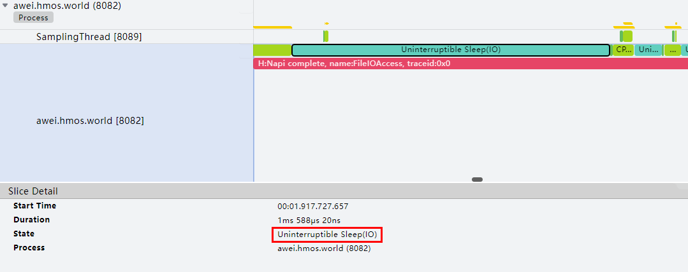

 
图5 **Render Service卡顿导致丢帧的故障模型**
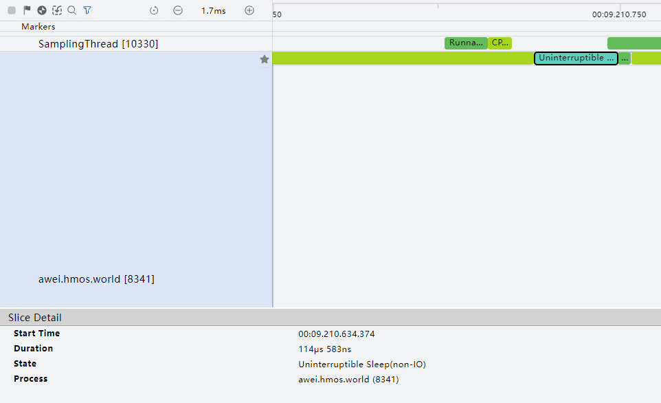

 
 

##### 通过Trace识别关键渲染流程

一帧的渲染流程中的UI后端引擎的常用Trace的含义如下图所示：
 
图6 **UI后端引擎渲染Trace泳道图

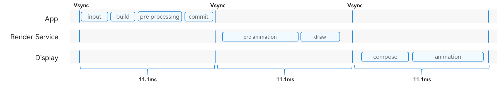

 
 
各部分介绍见下表：
  
| 序号 | Trace | 参数说明 | 描述 |
| --- | --- | --- | --- |
| 1 | OnVsyncEvent now:%" PRIu64 " | 当前时间戳--纳秒级 | 收到Vsync信号，渲染流程开始 |
| 2 | FlushVsync |    | 刷新视图同步事件，包括记录帧信息、刷新任务、绘制渲染上下文、处理用户输入 |
| 3 | UITaskScheduler::FlushTask |    | 刷新UI界面，包括布局、渲染和动画等 |
| 4 | FlushMessages |    | 发送消息通知图形侧进行渲染 |
| 5 | FlushLayoutTask |    | 执行布局任务 |
| 6 | FlushRenderTask %zu | 当前页面上的需要渲染的节点的数量 | 总渲染任务执行 |
| 7 | Layout |    | 节点布局 |
| 8 | FrameNode::RenderTask |    | 单个渲染任务执行 |
| 9 | ListLayoutAlgorithm::MeasureListItem:%d | 当前列表项索引 | 计算列表项的布局尺寸 |
 
 
图形图像子系统中的Render Service负责界面内容的绘制，处理各应用提交的统一渲染任务，将不同应用的图层合并并送显。每个Vsync周期，Render Service首先处理应用提交的指令，包括渲染树节点的新增、删除和修改，然后进行动画计算和遮挡计算，以更新统一渲染树。接下来，对渲染树执行绘制，预处理每个节点，计算绝对位置和脏区信息，针对脏区进行绘制。优先使用硬件合成器绘制，无法合成时交由GPU执行重绘，所有结果存入屏幕缓冲区，最后提交送显并展示。
 
Vsync信号刷新时的Trace泳道图如下所示。
 
**图7 **RS侧渲染Trace泳道图
 

 
各部分介绍如下表：
  
| 序号 | Trace | 描述 |
| --- | --- | --- |
| 1 | RSMainThread::DoComposition | 合成渲染树上各节点图层 |
| 2 | RSMainThread::ProcessCommand | 处理应用侧指令 |
| 3 | Animate | 动画处理 |
| 4 | ProcessDisplayRenderNode[x] | 单个显示器画面的绘制流程 |
| 5 | Repaint | 硬件合成器绘制 |
| 6 | RenderFrame | GPU执行绘制 |
| 7 | SwapBuffers | 刷新屏幕缓冲区 |
| 8 | Commit | 绘制结果提交上屏 |
 
 
 

##### 通过Trace识别懒加载渲染流程

懒加载使用LazyForEach实现。LazyForEach 从提供的数据源中按需迭代数据，并在每次迭代过程中创建相应组件。当LazyForEach在滚动容器中使用时，框架会根据滚动容器的可视区域按需创建组件。当组件滑出可视区域时，框架会销毁组件以降低内存占用。
 
下图展示了懒加载过程中一帧的Trace泳道图。
 

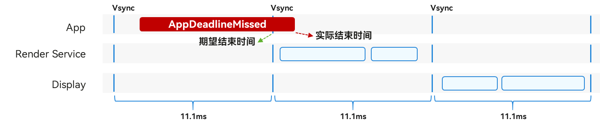

  
| 序号 | Trace | 参数说明 | 描述 |
| --- | --- | --- | --- |
| 1 | OnIdle, targettime:%" PRId64 " | 时间戳，在这个时间之前完成该任务 | 在idle事件循环中，框架会检查是否有新的事件需要处理。如果有新的事件，任务调度器会被加入到UI线程中，并执行预测任务。 |
| 2 | Builder:BuildLazyItem [%d] | 需创建的项目索引 | 在需要时创建项，并将其缓存。 |
| 3 | CustomNode:BuildRecycle %s | JS视图名称 | 触发重用渲染 |
| 4 | ExecuteJS |    | 执行JS代码操作。 |
| 5 | List predict |    | 添加预测布局任务操作。 |
| 6 | Layout |    | 完成当前帧节点的布局。 |
 
 
 

##### 添加自定义Trace信息

开发者可以根据业务需求，使用HiTraceMeter进行自定义Trace打点跟踪，具体使用细节可参考[《使用HiTraceMeter跟踪性能（ArkTS/JS）》](https://developer.huawei.com/consumer/cn/doc/harmonyos-guides/hitracemeter-guidelines-arkts)和[《使用HiTraceMeter跟踪性能（C/C++）》](https://developer.huawei.com/consumer/cn/doc/harmonyos-guides/hitracemeter-guidelines-ndk)。
 
添加自定义Trace后，可在SmartPerf-Host调试工具上查看。自定义Trace将以独立泳道的形式呈现在对应进程下。下图展示了两条泳道，使用了startTrace和finishTrace方法，表示程序运行过程中指定标签从调用startTrace到调用finishTrace的耗时统计。图中记录了CUSTOM_TRACE_TAG_1和CUSTOM_TRACE_TAG_2两个标签的耗时统计。
 
自定义Trace示例：
 

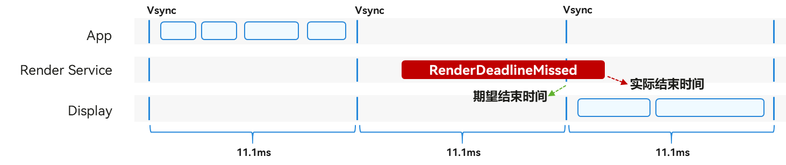

 
自定义状态值示例：
 

