# 点击响应时延分析

更新时间：2026-03-12 08:45:02

来源：https://developer.huawei.com/consumer/cn/doc/best-practices/bpta-click-to-click-response-optimization

**      


##### 响应优化概述

响应时延是指直接操作或间接触发请求后，应用程序执行运算处理请求，并更新界面状态的交互机制。

[《应用性能体验建议》](https://developer.huawei.com/consumer/cn/doc/harmonyos-guides/performance-delay#section118706211961)指出，应用或元服务内点击操作响应时延应<=100ms。为了保证操作响应及时，提供极致流畅体验，需要分析从手势抬手到渲染上屏这段时间内应用执行的耗时操作，并针对性地优化相关逻辑。

图1 **点击响应起止点示意图      **
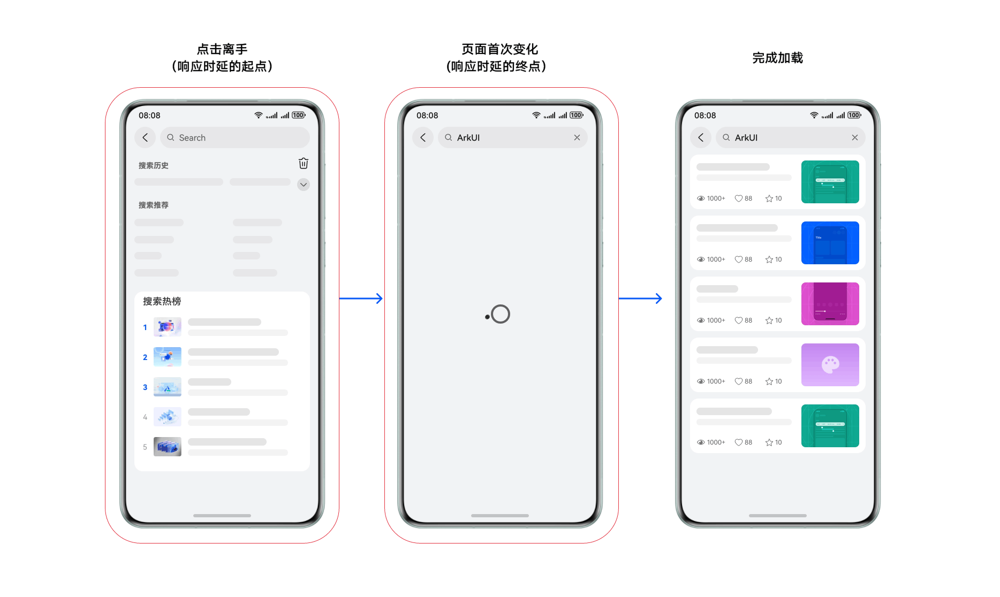


点击响应优化指通过分析响应阶段、优化应用性能，加快点击后页面的响应速度，提升用户操作体验。优化点击响应速度，既满足高性能要求，增强产品竞争力，又能提升用户满意度。


##### 响应时延工具

影响点击响应性能的因素很多，使用DevEco Studio集成的分析工具，可以收集系统数据，自动执行重复任务，建立统一优化标准和流程，减少个人差异和误操作的可能性，帮助开发者了解性能瓶颈和优化潜力。分析优化过程中，可能用到以下工具中的一个或多个。

 - [AppAnalyzer](https://developer.huawei.com/consumer/cn/doc/best-practices/bpta-performance-detection#section135451444171)：用于测试和诊断HarmonyOS应用或元服务的质量，快速提供诊断结果和改进建议。使用体检工具在开发阶段发现可能影响上架的兼容性、性能、功耗、稳定性等问题，并支持场景化检测，提升应用基础体验及上架成功率。
 - [ArkUI Inspector](https://developer.huawei.com/consumer/cn/doc/best-practices/bpta-optimization-overview#section1465143164111)：开发者可以使用[Inspector双向预览](https://developer.huawei.com/consumer/cn/doc/harmonyos-guides/ide-previewer-inspector)，在DevEco Studio上查看应用在真机上的组件布局，并通过查看多次操作后的界面状态，快速分析定位状态变量、组件嵌套层次、UI界面布局存在的问题等。
 - [DevEco Testing](https://developer.huawei.com/consumer/cn/doc/best-practices/bpta-performance-detection#section3783182023119)：是一款专项集成测试工具，提供了多项测试能力。DevEco Testing将测试能力以测试服务卡片的形式呈现给用户，无需复杂的配置，即可一键执行测试任务，同时提供了测试报告和分析，辅助开发者发现应用和产品问题，提升应用质量。
 - [Profiler Frame](https://developer.huawei.com/consumer/cn/doc/harmonyos-guides/ide-insight-session-frame)：用于深度分析应用或服务卡顿丢帧的原因。Frame用于录制GPU数据信息，录制完成的子泳道对应录制过程中各个进程的帧数据，主要用于深度分析应用或服务卡顿丢帧的原因。


##### 问题定位流程

定位点击响应时延高耗时的简易流程如下图所示。

图2 **问题定位流程图     


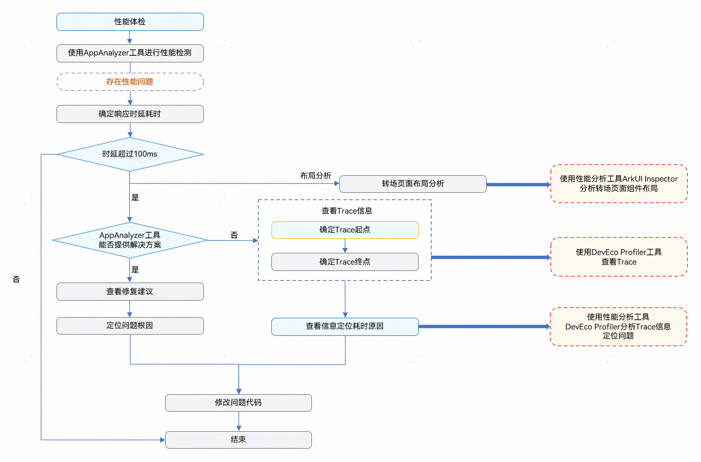


如上图所示，分析点击响应时延问题通常需要以下步骤：
1. 性能体检：使用性能检测工具AppAnalyzer检测和诊断应用是否存在性能问题。
2. 确定响应时延：根据检测工具AppAnalyzer检测的结果，确定响应时延的耗时，判断是否符合[《时延体验建议》](https://developer.huawei.com/consumer/cn/doc/harmonyos-guides/performance-delay)中的规范。
3. 抓取Trace信息：使用性能分析工具DevEco Profiler抓取Trace，并确定Trace图中的起止点。
4. 分析问题：结合关键泳道Trace信息以及ArkUI Inspector布局分析工具来定位具体问题。


##### 使用AppAnalyzer工具检测和分析


在应用开发中，多任务并发、UI组件自身创建耗时等，都会导致应用点击响应时延受到影响，合理优化代码逻辑可以提升应用点击响应时延速度，提升用户体验。开发者可以通过[AppAnalyzer](https://developer.huawei.com/consumer/cn/doc/harmonyos-guides/ide-app-analyzer)对应用点击响应时延进行检测，并优化检测报告中存在的点击响应时延未达标的问题。

使用AppAnalyzer工具检测点击响应时延步骤如下。
1. 在DevEco Studio中启动AppAnalyzer工具，详细参见[AppAnalyzer](https://developer.huawei.com/consumer/cn/doc/best-practices/bpta-performance-detection#section135451444171)。
2. 点击“手动性能页面间转场体检”按钮启动检测。

  
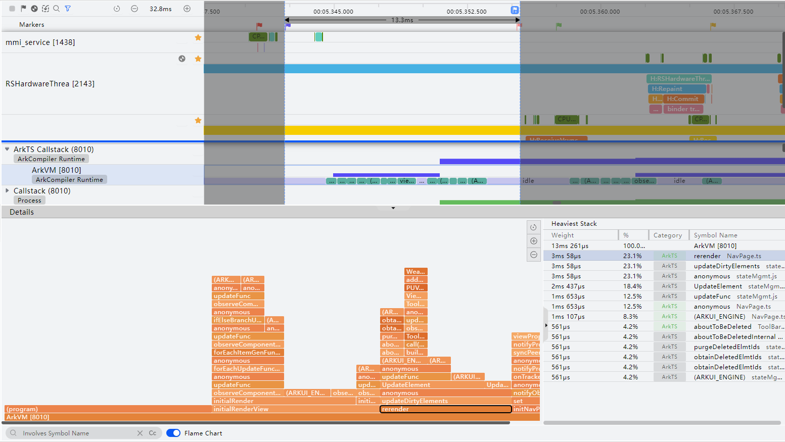

3. 开发者需根据提示，在应用中找到待检测页面，点击工具中的开始按钮，然后在应用中手动执行转场，操作后点击停止完成本次检测。

  
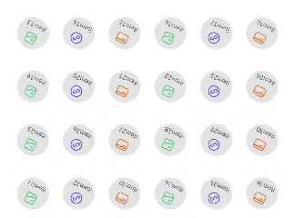

4. 检测结果分析，点击响应时延应小于或等于100ms。图中存在大于100ms的点击响应时延，判断为存在性能问题。

  
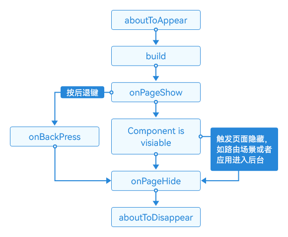


具体使用可参考[《应用与元服务体检》](https://developer.huawei.com/consumer/cn/doc/harmonyos-guides/ide-app-analyzer)。

检测出的点击响应时延报告中，可能会存在以下两种影响性能的故障原因。

 - UI线程应用自身方法耗时长
 - UI线程应用自定义组件创建耗时长


##### UI线程应用自身方法耗时长
1. 获得检测结果后，点击详情报告中的“点击响应时延”，可以查看UI线程应用自身方法耗时长的检测结果。

  


  检测结果中，可以根据方法总耗时的大小来判断该方法是否为耗时方法。

  如上图中，aboutToAppear[PageJumpSceneUseCase3.ets. 29]表示PageJumpSceneUseCase3.ets页面中的aboutToAppear()方法，其执行总耗时655.321ms。
2. 点击方法名，可跳转定位至PageJumpSceneUseCase3.ets页面中的aboutToAppear()方法处，代码中执行了耗时方法。

  
```text
async aboutToAppear() {
  let fibonacci =  (await import('./mock')).getFibonacci(27);
  // ...  
}
```
getFibonacci方法模拟耗时方法。

  
```text
export function getFibonacci(n: number): number {
  return n <= 2 ? 1 : (getFibonacci(n - 1) + getFibonacci(n - 2))
}
```

3. 点击优化建议下的跳转链接[分析UI主线程高耗时函数](https://developer.huawei.com/consumer/cn/doc/best-practices/bpta-zhenlv#section117831333645)，即可获取相应的优化建议。


##### UI线程应用自定义组件创建耗时长
1. 获得检测结果后，点击详情报告中的“点击响应时延”，可以查看UI线程应用自定义组件创建耗时检测结果。

  
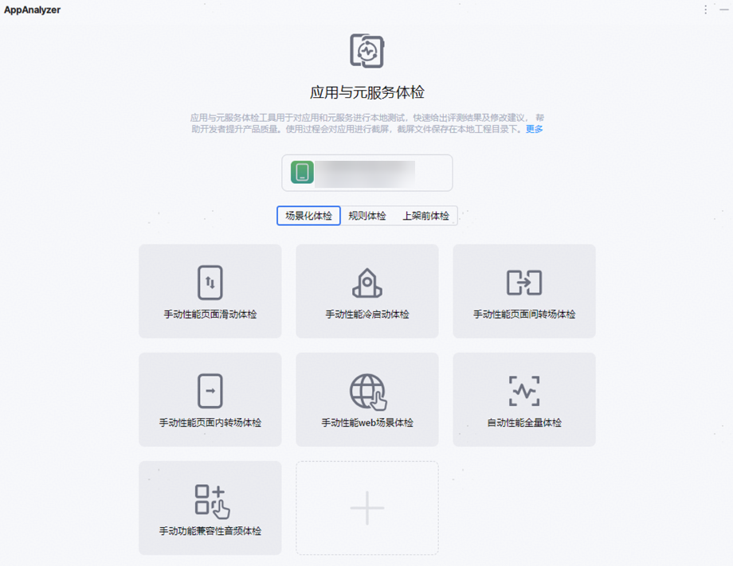

2. 可点击源文件定位到创建耗时的UI组件，根据提供的可能故障原因，去对UI组件进行相应优化修改，减少该UI组件自身创建耗时。

  
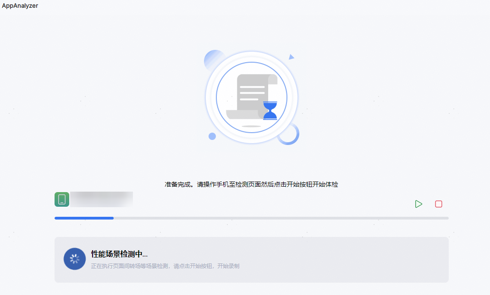


##### 使用Profiler Frame工具检测和分析


[DevEco Profiler](https://developer.huawei.com/consumer/cn/doc/harmonyos-guides/ide-profiler)是DevEco Studio提供的场景化调优工具，其中Frame可以帮助开发者深度分析性能问题，通过录制应用运行过程中的关键数据，从而识别卡顿丢帧、耗时长等问题的原因所在。


##### 使用Frame分析响应性能
1. 抓取操作trace：启动DevEco Studio，连接设备，打开应用，执行以下操作。

  
 - 启动Profiler。

2. 选择应用、包名、进程。

3. 选择Frame工具。

4. 操作到指定页面，点击“Create Session”创建Frame模板。

5. 点击Frame模板框中的播放按钮开始录制，操作应用界面进行点击响应，完成后点击结束录制。

  
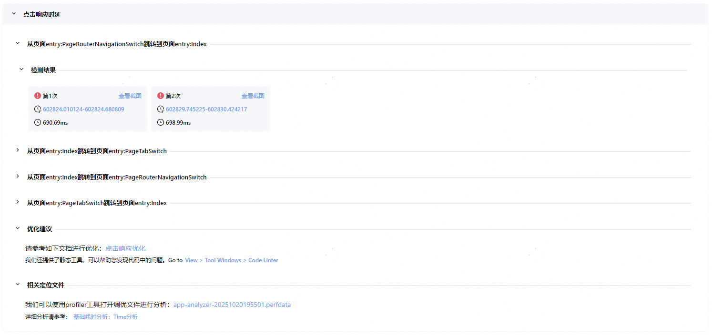

 - 确认响应起点和终点：

1. 根据点击响应的初始位置，找到手势抬起的那一帧，设置为分析起点。该帧对应mmi-service泳道中H:service report的type为up的事件。

2. 确定页面变化后的第一帧，将其作为分析的终点，对应于RSHardwareThread泳道的CommitAndReleaseLayers结束点。
 - 分解时间段：点击响应的整体时延拆解后，主要分为输入阶段、应用阶段和渲染阶段。

| 首帧响应时延 | 起点 | 终点 | 基线(ms) |

| --- | --- | --- | --- |

| 输入阶段 | mmi_service对应的service report(type为up) | 应用DispatchTouchEvent的起点(type=1) | 8 |

| 应用阶段 | 应用DispatchTouchEvent的起点(type=1) | 页面首次发生变化帧对应的H:FlushMessage结束点 | 25 |

| 渲染阶段 | 对应的RS帧ProcessCommandUni起点 | 对应的RSHardwareThread::CommitAndReleaseLayers的结束点 | 20 |

  应用阶段（如下图中标记2与3之间的部分）是开发者需要优化的部分。若应用阶段耗时超过25ms，加上机器硬件30ms的耗时，整体时延可能超过100ms，导致点击响应体验不佳，需定位性能问题。

  
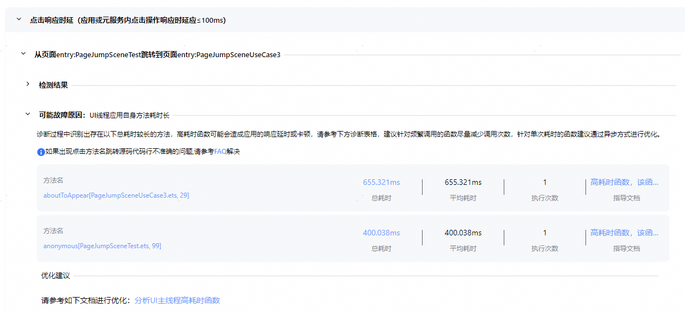

 - 分析定位原因：针对框选的应用阶段，分析主进程泳道，观察是否存在耗时长的函数阻塞主线程或超长耗时单帧。如果有长段的ExecuteJs，查看具体的调用栈或火焰图，定位耗时函数。如果是FlushLayoutTask阶段耗时，结合UI组件树分析布局合理性，查找优化空间。

  
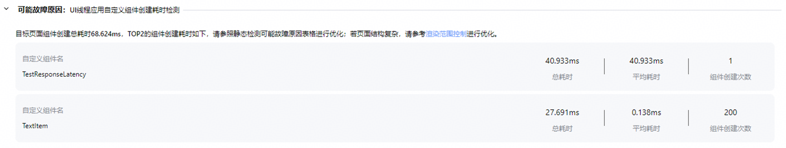


更多使用方法参考[《Frame分析》](https://developer.huawei.com/consumer/cn/doc/harmonyos-guides/ide-insight-session-frame)。


##### 响应时延解决方案


##### UI组件自身创建耗时长

应用开发中的用户界面UI是用户与应用程序交互的关键部分。使用不同类型的布局可达到预期的显示效果。合理的方式能美化页面布局，但过度的布局计算和冗余的元素绘制会增加设备资源开销，导致响应性能下降。

**减少嵌套层级**

布局嵌套层次过深会增加创建节点和布局的时间。开发者应避免冗余嵌套，尽量使用扁平化布局优化层级。

具体内容见[精简节点数](https://developer.huawei.com/consumer/cn/doc/best-practices/bpta-improve-layout-performance#section9293918175210)和[合理使用布局组件](https://developer.huawei.com/consumer/cn/doc/best-practices/bpta-improve-layout-performance#section12745188175420)。

**减少渲染时间**

if/else条件渲染是ArkUI开发框架提供的功能，可根据应用状态渲染相应UI。

具体内容见[合理使用渲染控制语法](https://developer.huawei.com/consumer/cn/doc/best-practices/bpta-improve-layout-performance#section12390122913536)。

**用renderGroup缓存动效**

页面响应时，会大量使用属性动画和转场动画，当复杂度较高时，可能会出现卡顿的情况。renderGroup是组件的通用方法，用于表示渲染绘制的一个组合。

首次绘制组件时，若组件启用renderGroup状态，将对组件及其子组件进行离屏绘制，并保存到缓存中。此后重新绘制相同组件时，优先使用缓存，降低绘制负载，加快响应速度。

**图3 **renderGroup使用场景示例      **
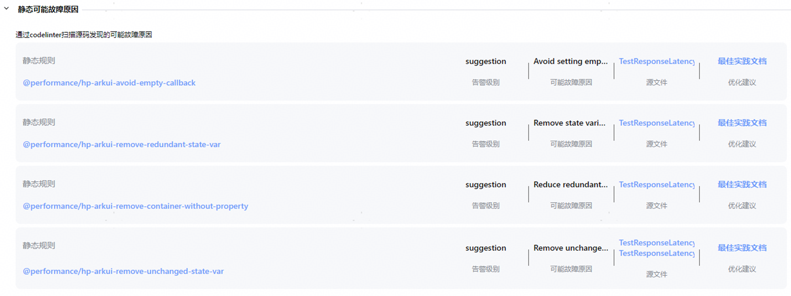


为了使renderGroup功能生效，存在以下限制条件：

 - 组件内容固定不变：组件及其子组件各属性保持固定，不发生变化。如果组件内容不是固定的，也就是说其子组件中存在某些属性变化或者样式变化，此时如果使用renderGroup，那么缓存的利用率将大大下降，并且有可能需要不断执行缓存更新逻辑，在这种情况下，不仅不能优化卡顿效果，甚至还可能使卡顿恶化。例如：文本内容使用双向绑定的动态数据；图片资源使用gif格式；使用video组件播放视频。
 - 子组件无动效：由组件统一应用动效，其子组件均无动效。如果子组件上也应用动效，那么子组件相对父组件就不再是静止的，每一帧都有可能需要更新缓存，更新逻辑同样需要消耗系统资源。


**LazyForEach懒加载**

使用LazyForEach懒加载替换ForEach，避免一次性初始化和加载所有元素，从而减少首帧绘制时创建列表元素的时间，提升响应性能。

相关原理及案例参考[长列表加载丢帧优化](https://developer.huawei.com/consumer/cn/doc/best-practices/bpta-best-practices-long-list)。

**动态import**

动态import是一种模块加载机制，允许应用程序在运行时按需加载相关模块。当特定条件满足时（如用户交互或ABTest分支切换），再加载所需模块，可减少初始化加载时间和资源消耗，提高应用程序的内存性能和响应速度。

与静态import不同，动态import仅在需要时消耗资源。动态import在编译时不确定引入的模块，语法更灵活，支持代码和路由级别的粒度分割，优化懒加载性能。

具体的使用场景和实现方案参考[动态加载](https://developer.huawei.com/consumer/cn/doc/harmonyos-guides/arkts-dynamic-import)。


##### 并发优化

并发是指多个任务在同一个时间段内同时触发执行。具体逻辑中使用多线程异步执行。与之相对的概念是串行任务，按顺序同步执行。

应用中的并发优化是在响应用户操作期间，让主线程只执行UI绘制任务，将非UI的耗时任务分配给其他线程或延迟处理。这样利用多线程异步技术，提高应用程序的并发处理能力，减少用户等待时间，保证用户界面的响应流畅性。

**异步任务并发处理**

使用多线程并发能力的主要实现方式有：      
 - 利用TaskPool执行简单并行任务，避免阻塞主线程，提升响应速度。
 - 利用Worker完成周期类耗时操作，避免TaskPool频繁拉起影响性能。


二者原理和效果差异可参考[TaskPool和Worker对比](https://developer.huawei.com/consumer/cn/doc/best-practices/bpta-comparative_practice_of_taskpool_and_worker)。

**使用组件异步加载特性**


Image组件支持异步加载特性，先显示空白占位块，图片加载完毕后替换占位块。这样不阻塞页面显示，提升交互体验。

设置示例：

```ArkTS
// Setting syncLoad to false or omitting the setting results in asynchronous image loading.
Image('https://example.com/icon.png')
  .syncLoad(false)
```

如果展示的图片数量很少或加载本地图片，建议将syncLoad属性配置为true，以同步加载图片，避免特定情况下图片加载出现闪烁。


##### 优化代码逻辑提升页面响应速度

代码逻辑的优劣显著影响应用响应速度，尤其在点击切换后新页面的生命周期回调（如 aboutToAppear、onPageShow）和点击操作页面的 aboutToDisappear 中。优化代码、减少冗余、避免耗时操作，可以提升执行效率。

基于平台SDK的开发框架，理解App生命周期，识别程序在不同阶段的行为，弄清楚不同形态转换时触发的接口性质和函数调用频率，挖掘代码优化方向。

下图是页面及自定义组件的生命周期流程：

图4 **生命周期流程图      **
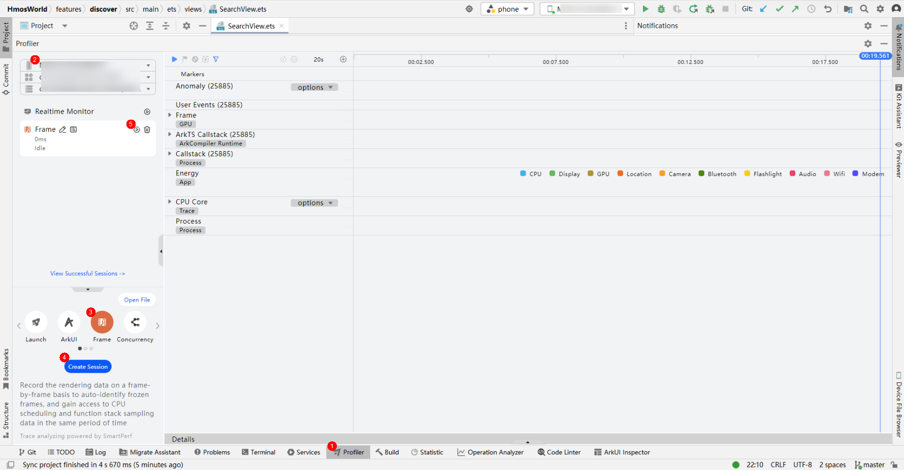


通常可以采用的逻辑优化方法有：

 - **选择合适的数据结构**       索引存取使用array数组，hash查找使用map，去重使用set。

  开发者可以使用ArkTS提供的高性能容器类HashMap，替代object变量作为容器处理map的逻辑。

  纯数值计算推荐使用TypedArray，如Int8Array、Int32Array、Float32Array、BigInt64Array。


 - **合理使用缓存**       当运算结果会反复使用时，提前缓存以便下次调用。


 - **注意对象new和delete的频率**       new和delete可能触发内存管理回收，影响界面渲染。在循环代码中，频繁的new、delete会恶化性能，应尽量将new/delete优化到循环外。
 - **延迟执行资源释放操作**       将资源关闭和释放操作放在setTimeout函数中执行，使其延迟到系统相对空闲的时刻进行，可以避免在程序忙碌时段占用关键资源，提升整体性能及响应能力。具体的使用场景和实现方案参考[延迟执行资源释放操作](https://developer.huawei.com/consumer/cn/doc/best-practices/bpta-application-latency-optimization-cases#section8783201923819)。


 - **减小拖动识别距离**       应用识别拖动手势事件时需要设置合理的拖动距离，设置不合理的拖动距离会导致滑动不跟手、响应时延慢等问题。针对此类问题可以通过设置distance大小来解决。具体的使用场景和实现方案参考[减小拖动识别距离](https://developer.huawei.com/consumer/cn/doc/best-practices/bpta-application-latency-optimization-cases#section1116134115286)。


##### 视觉感知优化

上述几节内容，是从减少时延绝对值的角度来提升响应体验，而视觉感知优化则是通过交互设计的优化，提升用户响应速度的感知。

应用的卡顿表现为视觉上的不流畅画面，导致用户感到不适。因此，用户操作后应立即提供视觉反馈，以缓解这种不适感。

开发者可以在用户交互动作开始时，添加动画元素，如单击效果、转场缩放、加载进度条和共享动画。这些动画能告知用户状态已发生变化，应用正在快速运作。动画背后涉及数据计算、布局渲染和内容加载等操作。当新界面渲染完成，动画元素可通过渐变消失或移出屏外等友好的方式退出视觉区域。

图5 **应用响应的两个视角      

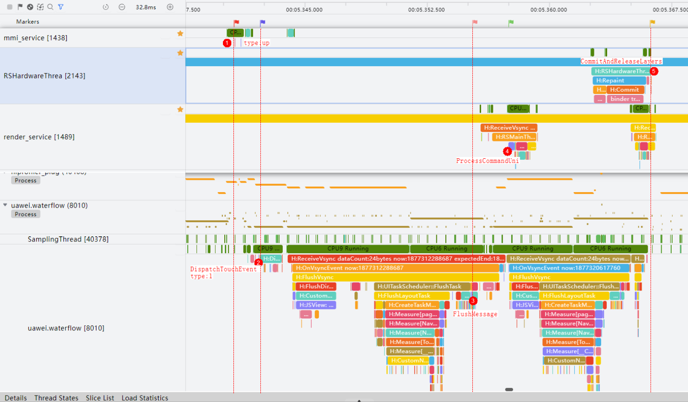


使用连贯的感知元素，可以提供视觉隐喻，平滑地引导用户从上一个页面过渡到下一个页面。交互动画如果友好、有趣且实用，会提升用户的响应体验，使他们觉得应用性能好、反应速度快。

具体的使用场景和实现方案参考[转场动画场景案例](https://developer.huawei.com/consumer/cn/doc/best-practices/bpta-application-latency-optimization-cases#section17886155414385)和[动画时延场景案例](https://developer.huawei.com/consumer/cn/doc/best-practices/bpta-application-latency-optimization-cases#section36181326113013)。
