# 点击完成时延分析

更新时间：2026-05-18 00:55:31

来源：https://developer.huawei.com/consumer/cn/doc/best-practices/bpta-click-to-complete-delay-analysis

**   


##### 完成时延优化概述

在移动终端应用开发中，完成时延指用户从输入触控指令到界面完全刷新结束并达到可以阅读的稳定状态所用时间。点击完成时延分为页面内跳转和页面间跳转两种类型。完成时延在用户体验设计中至关重要，直接影响用户对产品的满意度和使用体验。完成时延反映了用户对响应速度的整体感受，影响触控交互的及时性和愉悦性。如图一所示，点击完成时延包含点击响应时延。有关响应时延阶段的优化分析，请参考[《点击响应时延分析》](https://developer.huawei.com/consumer/cn/doc/best-practices/bpta-click-to-click-response-optimization)。
 
《应用性能体验建议》中针对时延建议[应用或元服务应用内点击操作完成快](https://developer.huawei.com/consumer/cn/doc/harmonyos-guides/performance-delay#section2406192820717)（应用完成时延≤900ms，元服务≤1400ms），针对转场建议[应用或元服务应用内转场操作流畅](https://developer.huawei.com/consumer/cn/doc/harmonyos-guides/performance-frame-rate#section1591383182619)（卡顿率为0ms/s），当前AppAnalyzer工具已支持（或等效支持）上述指标项。
 
在一定时延水平以上，完成时延越短越好，但在达到一定阈值后，用户的流畅体验不会继续提升。本文将介绍相关分析工具、点击完成时延问题定位流程及常见问题根因分析。
 
图1 **点击完成起止点示意图
 

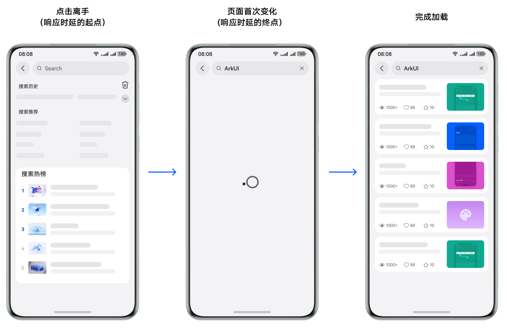

 
**图2 **页面转场过程解析**


 
 

##### 完成时延检测工具

影响点击完成性能的因素很多，使用DevEco Studio集成的分析工具，可以收集系统数据，自动执行重复任务，建立统一优化标准和流程，减少个人差异和误操作的可能性，帮助开发者了解性能瓶颈和优化潜力。分析优化过程中，可能用到以下工具中的一个或多个。
 
- [AppAnalyzer](https://developer.huawei.com/consumer/cn/doc/best-practices/bpta-performance-detection#section135451444171)：是DevEco Studio提供的检测评分工具，用于测试和诊断HarmonyOS应用或元服务的质量，快速提供诊断结果和改进建议。当前支持的测试类型包括兼容性、性能、UX测试和最佳实践。点击完成时延是性能测试中的一项检测规则，开发者可以使用该工具检测响应性能。具体使用可参考[《AppAnalyzer》](https://developer.huawei.com/consumer/cn/doc/best-practices/bpta-performance-detection#section135451444171)。
- [ArkUI Inspector](https://developer.huawei.com/consumer/cn/doc/best-practices/bpta-optimization-overview#section1465143164111)：是DevEco Studio中提供用于检查UI的工具，开发者可以借助它预览真机或模拟器中的UI效果，快速定位布局层级问题，也可以观察组件属性、不同组件之间的关系等。具体使用可参考[《ArkUI Inspector》](https://developer.huawei.com/consumer/cn/doc/best-practices/bpta-optimization-overview#section1465143164111)。
- [DevEco Testing](https://developer.huawei.com/consumer/cn/doc/best-practices/bpta-performance-detection#section3783182023119)：DevEco Testing是一款专项集成测试工具，提供了多项测试能力。旨在帮助开发者高效完成应用的功能、兼容性、性能和稳定性测试，确保应用质量。具体使用可参考[《DevEco Testing》](https://developer.huawei.com/consumer/cn/doc/best-practices/bpta-performance-detection#section3783182023119)。
- [Profiler Frame](https://developer.huawei.com/consumer/cn/doc/harmonyos-guides/ide-insight-session-frame)：性能调优深入分析工具，支持冷启动、卡顿丢帧、状态变量、并行化、网络耗时、ArkWeb、内存优化等场景化调优能力。其中Frame分析可以帮助开发者深度分析性能问题，通过录制应用运行过程中的关键数据，从而识别卡顿丢帧、耗时长等问题的原因所在。具体使用可参考[《DevEco Profiler》](https://developer.huawei.com/consumer/cn/doc/best-practices/bpta-optimization-overview#section2012922312284)。

 
 

##### 问题定位流程

 
定位点击完成时延高耗时的简易流程如下图所示。
 
图3 **问题定位流程图
 

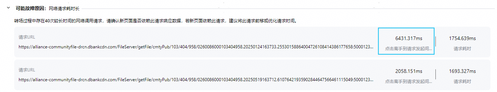

 
如上图所示，分析点击完成时延问题通常需要以下步骤：
 1. 性能体检：使用性能检测工具AppAnalyzer检测和诊断应用是否存在性能问题。
2. 确定完成时延：根据性能检测工具AppAnalyzer检测结果，确定完成时延的耗时，判断是否符合[《时延体验建议》](https://developer.huawei.com/consumer/cn/doc/harmonyos-guides/performance-delay)中的规范。
3. 抓取Trace信息：使用性能分析工具DevEco Profiler抓取Trace，并确定Trace图中的起止点。
4. 分析问题：结合关键泳道Trace信息以及ArkUI Inspector布局分析工具来定位具体问题。
 

##### 使用AppAnalyzer工具检测和分析

 
在应用开发中，UI线程应用自身方法执行耗时、网络请求响应耗时、UI组件自身创建耗时等，都会导致应用点击完成时延受到影响，合理优化代码逻辑可以提升应用点击完成时延速度，提升用户体验。开发者可以通过[AppAnalyzer](https://developer.huawei.com/consumer/cn/doc/harmonyos-guides/ide-app-analyzer)对应用点击完成时延进行检测，并优化检测报告中存在的点击完成时延未达标的问题。
 
使用AppAnalyzer工具检测点击完成时延步骤如下。
 1. 在DevEco Studio中启动AppAnalyzer工具，详细参见[AppAnalyzer](https://developer.huawei.com/consumer/cn/doc/best-practices/bpta-performance-detection#section135451444171)。
2. 点击“手动性能页面间转场体检”按钮启动检测。

  
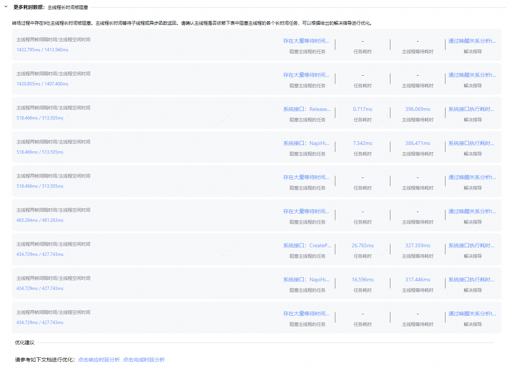

3. 开发者需根据提示，在应用中找到待检测页面，点击工具中的开始按钮，然后在应用中手动执行转场，操作后点击停止完成本次检测。

  


4. 检测结果分析，点击完成时延应小于或等于900ms。如果存在大于900ms的点击完成时延，判断为存在性能问题。

  
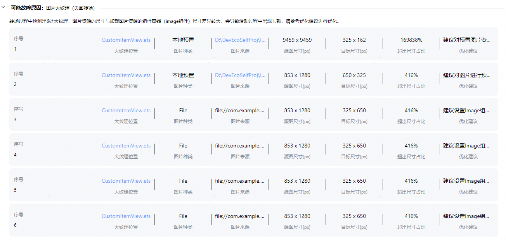

 
检测出的点击完成时延报告中，可能会存在以下五种影响性能的故障原因。
 
- UI线程应用自身方法耗时长
- UI线程应用自定义组件创建耗时长
- 网络请求耗时长
- 主线程长时间被阻塞
- 图片大纹理

 

##### UI线程应用自身方法耗时长
1. 获得检测结果后，点击详情报告中的“点击完成时延”，可以查看UI线程应用自身方法耗时长的检测结果。

  
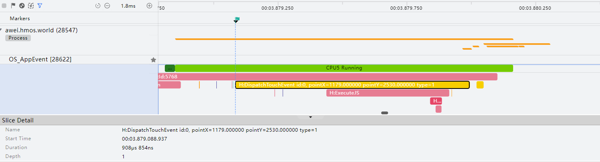


  检测结果中，可以根据方法总耗时的大小来判断该方法是否为耗时方法。如上图中，aboutToAppear[PageJumpSceneUseCase3.ets, 29]表示PageJumpSceneUseCase3.ets页面中的aboutToAppear()方法，其执行耗时较长。
2. 点击方法名，可跳转定位至PageJumpSceneUseCase3.ets页面中的耗时方法处。
3. aboutToAppear()中调用了如下方法。

  
```text
export function fun1() {
  for (let index = 0; index < 906666; index++) {
    console.debug('fun1 index:' + index);
  }
}
```
 由于在该方法中执行了模拟长耗时的for循环代码，导致该方法在检测中总耗时过长。
4. 点击优化建议下的跳转链接[分析UI主线程高耗时函数](https://developer.huawei.com/consumer/cn/doc/best-practices/bpta-zhenlv#section117831333645)，即可获取相应的优化建议。
 
 

##### UI线程应用自定义组件创建耗时长
1. 获得检测结果。点击详情报告中的“点击完成时延”，可以查看UI线程应用自定义组件创建耗时检测结果。

  
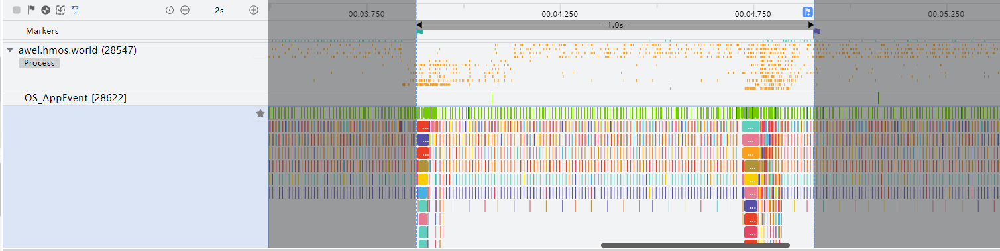


  检测结果中，可以根据总耗时列来判断自定义组件创建是否耗时。上图中，TestResponseLatency组件创建总耗时40.933ms，耗时过长。如下图，TextItem在页面中自定义组件被创建多次，导致创建耗时过长。

  
```text
@Entry
@Component
struct TestResponseLatency {
  @State arr:string[] = []

  aboutToAppear(): void {
    this.arr.push(...GetData());
  }

  build() {
    Flex() {
      Column() {
        Flex() {
          ForEach(this.arr, (item: string, index: number) => {
            TextItem2({ item: item, index: index })
          })
        }
      }
    }
    .height('100%')
    .width('100%')
  }
}
```

2. 点击源文件定位到创建耗时的UI组件，根据提供的可能故障原因，对UI组件进行相应的优化，还可参考静态检测结果中的优化建议，来对组件创建耗时进行优化。

  
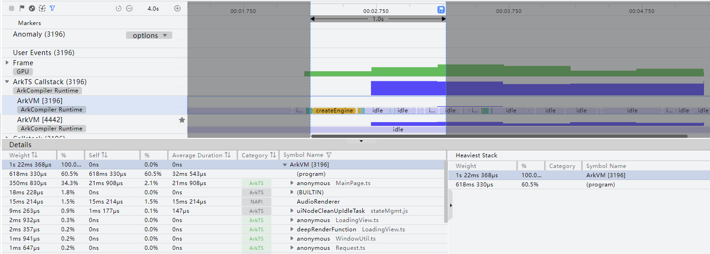

 
 

##### 网络请求耗时长
1. 获得检测结果后，点击详情报告中的“点击完成时延”，可以查看网络请求耗时的检测结果。
2. 根据检测结果中的请求耗时和点击离手到请求发起间隔可进行如下判断。

  
- 网络请求本身耗时长
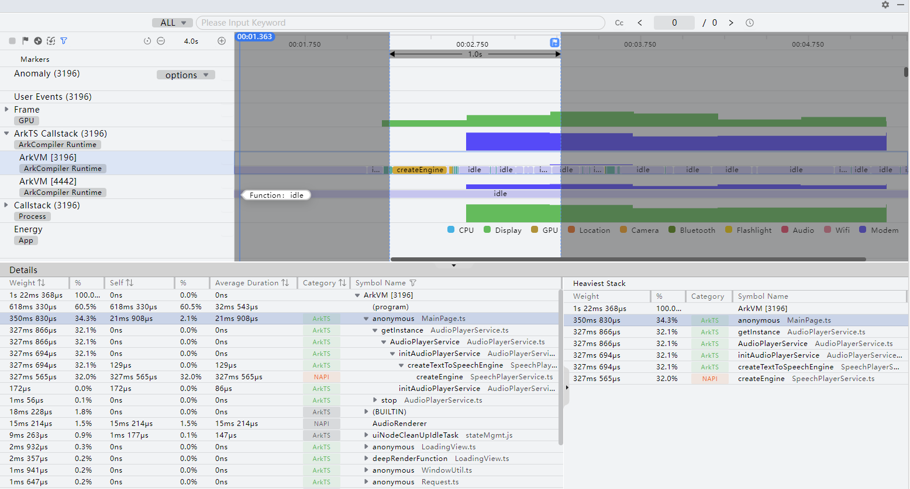


  网络请求本身是否耗时可通过检测结果中的请求耗时时长来进行判断，时间越长，则网络请求本身耗时越久。详细分析请参考：[网络诊断：Network分析](https://developer.huawei.com/consumer/cn/doc/harmonyos-guides/ide-profiler-network)。

  网络请求本身耗时长，可对该URL请求进行预连接和预解析来优化网络传输速度，提前完成DNS查询和TCP/TLS握手，即在应用启动或空闲时提前建立并维护一个持久的连接池；还可以使用CDN来优化网络传输速度，将静态资源部署到CDN上。

3. 网络请求发起太晚
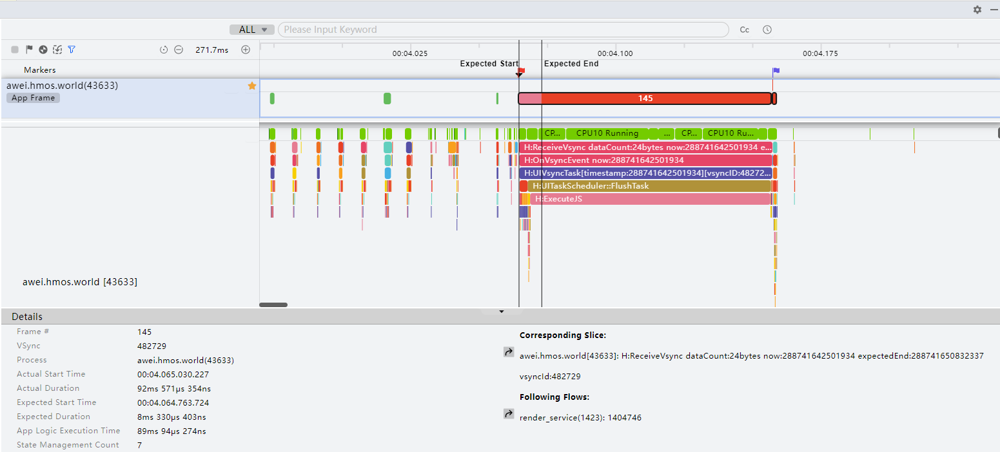


  点击离手到请求发起间隔则表示用户进行点击操作后，到真正向服务器发起网络请求的那一刻止，这中间所经过的时间。可通过检测结果中的点击离手到请求发起间隔时长来进行判断，时间越长，则表示网络请求发起的越晚。可通过提前发起网络请求，来进行优化。可参考：[网络请求提前发送](https://developer.huawei.com/consumer/cn/doc/best-practices/bpta-application-cold-start-optimization#section199911250658)。

  如果开发者既无法优化网络请求本身耗时，也无法将网络请求提前发起，可以考虑提前将网络请求数据缓存，下次发起请求的时候直接加载缓存数据，再通过发送网络请求二刷刷新数据。

  

  ##### 主线程长时间被阻塞

1. 获得检测结果。点击详情报告中的“阻塞主线程的任务”，可以查看主线程长时间被阻塞的检测结果。

  
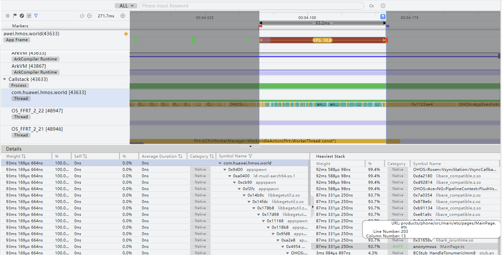


  通过关键线程识别技术，体检工具能够基于唤醒关系算法精确构建线程间依赖链路，同时结合传统调度分析方法，全面检测可能阻塞主线程的子线程任务。检测结果中，可以根据实际空闲时间判断主线程是否长时间被阻塞：空闲时间越长，则阻塞时间可能越久。通过识别并定位阻塞主线程的关键任务，可以快速找到对应的耗时代码位置。任务耗时代表诊断出的阻塞主线程任务本身的执行时长；主线程等待耗时表示任务结束点到主线程上一个 Running 结束点之间的时间，用于衡量该耗时任务对主线程造成的阻塞程度。

2. 可能存在以下5种诊断结果。

  
子线程中耗时函数执行点击子线程中函数执行链接，跳转至子线程中耗时函数执行的源码，可发现主线程中的UI刷新需要等待子线程任务执行完成。

  
```text
const task = new taskpool.Task(blockFunc, 1350);
taskpool.execute(task).then(() => {
  this.isShow = true;
  hiTraceMeter.finishTrace('loadSyncTask', 902);
  this.cost = new Date().getTime() - this.timestamps;
})
```
 应避免子线程执行的函数阻塞主线程，优化建议可参考解决指导中分析高耗时函数的内容。

3. 网络请求耗时过长可参考**网络请求耗时长**中的优化建议。

4. 系统接口请求耗时长点击系统接口链接，跳转至系统接口请求耗时长的代码部分。比如获取位置信息接口中，页面上位置信息刷新依赖于接口的返回结果。当系统接口响应较慢时，会导致主线程阻塞。

  
```json
getCurrentLocationInfo() {
  hiTraceMeter.startTrace('Napi', 1001);
  const requestInfo: geoLocationManager.LocationRequest = {
    "priority": geoLocationManager.LocationRequestPriority.FIRST_FIX,
    'scenario': geoLocationManager.LocationRequestScenario.UNSET,
    'timeInterval': 1,
    'distanceInterval': 0,
    'maxAccuracy': 0
  };
  try {
    geoLocationManager.getCurrentLocation(requestInfo)
      .then((location: geoLocationManager.Location) => {
        this.loadMsg = JSON.stringify(location);
        this.isShow = true;
        promptAction.showToast({ message: JSON.stringify(location) });
        hiTraceMeter.finishTrace('Napi', 1001);
      })
      .catch((err: BusinessError<ESObject>) => {
        console.error(`Failed to get current location. Code is ${err.code}, message is ${err.message}`);
      });
  } catch (err) {
    console.error(`Failed to get current location. Code is ${err.code}, message is ${err.message}`);
  }
}
```
 应避免系统接口串行发起请求，优化建议可参考解决指导中并发能力增强的内容。

5. 主线程在等待setTimeout点击主线程在等待setTimeout链接，跳转至setTimeout函数代码，可发现主线程中的UI刷新需要等待setTimeout执行完成。

  
```text
setTimeout(() => {
  this.isShowFirst = true;
  hiTraceMeter.finishTrace('setTimeout', 903);
}, 500);
```
 应避免在主线程中使用setTimeout函数等待时间过长，或是减小setTimeout的延时时间。

6. [存在大量等待时间无法诊断](#section1563932810516)

7. 可参考优化建议中的文章，来对主线程长时间被阻塞导致完成时延不达标的问题进行优化。

  
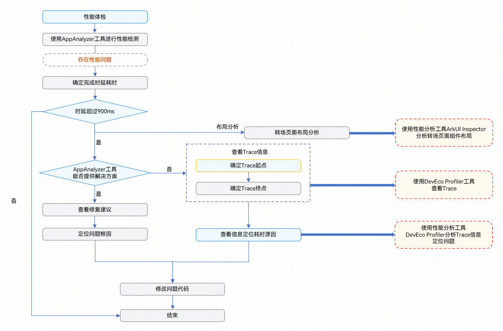


  

  ##### 图片大纹理

1. 获得检测结果。点击详情报告中的“点击完成时延”，可以查看图片大纹理的检测结果。

  
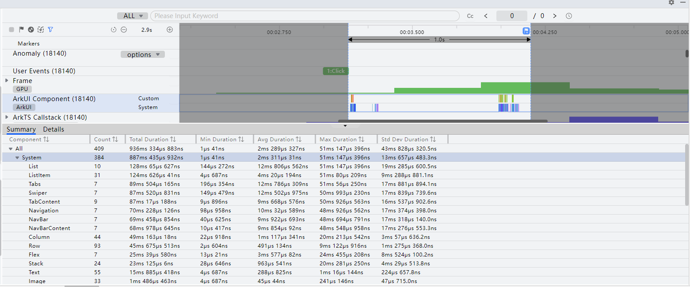


  检测结果中，可以根据超出尺寸占比来判断是否需要优化。

2. 可通过图片组件所在源码文件进行定位，找到包含图片的源码文件。检测结果可以看出，源图尺寸与目标尺寸不同，超出尺寸占比较大。建议源图尺寸不要超过目标尺寸大小的10%。

3. 不同图片种类会有不同的优化建议，可根据优化建议进行相应的修改。

  

  ##### 使用Profiler进行完成时延关键Trace分析

  通过关键泳道可以分析关键Trace，它通过对Trace进行逻辑分组，可以快速聚焦关键问题。

  

  ##### 关键泳道简介

  关键泳道可从函数调用耗时、转场页面绘制耗时和转场动画时延三个角度进行分析。接下来，将依据这三个角度对关键泳道进行详细介绍。

  
函数调用耗时分析：ArkTS Callstack：提供ArkTS侧的方法调用栈信息，用于分析ArkTS代码执行和性能瓶颈；

  Callstack：提供Native侧的方法调用栈信息，用于分析Native层面性能问题；
- 转场页面绘制耗时分析：Frame：提供应用主线程的帧渲染信息，帮助识别未按时渲染的帧及其原因；

  ArkUI Component：提供ArkUI组件的创建、布局、渲染等详细信息，帮助识别耗时较长的组件；
- 转场动画时延分析：H:Animator：提供动画执行过程中的详细信息，帮助识别转场动画是否耗时较长；

  关键Trace说明如下

| 序号 | 泳道 | Trace点 | 描述 |

| --- | --- | --- | --- |

| 1 | 应用线程 | ReceiveVsync | 接收Vsync信号 |

| 2 | 应用线程 | OnvsyncEvent | 收到Vsync信号，渲染流程开始 |

| 3 | 应用线程 | FlushVsync | 刷新视图同步事件，包括记录帧信息、刷新任务、绘制上下文、处理用户输入 |

| 4 | 应用线程 | FlushDirtyNodeUpdate | 标脏组件刷新。页面刷新渲染的时候要尽量减少刷新的组件数量。当状态变量改变后，会先对状态变量相关的组件进行标脏，然后对这些组件重新测量和布局，最后再进行渲染 |

| 5 | 应用线程 | JSAnimation | 显示动画，动画会影响组件加载完成时延 |

| 6 | 应用线程 | FlushLayoutTask | 执行布局任务。在此阶段会对组件做布局测算，如果层级较深或者组件较多会影响性能 |

| 7 | 应用线程 | FlushMessages | 发送消息通知图形侧进行渲染 |

| 8 | 应用线程 | aboutToBeDeleted | 自定义组件生命周期函数，组件析构时出现，在未使用复用机制时，FlushDirtyNodeUpdate和LazyForEach predict下会析构组件，导致刷新时组件重复创建 |

| 9 | 应用进程 | SendCommands | 应用UI提交到Render Service |

| 10 | ArkTS Callstack | createHttp | 创建网络请求 |

| 11 | ArkTS Callstack | request | 发送网络请求 |

| 12 | ArkTS Callstack | parse | 解析数据 |

| 13 | ArkTS Callstack | off | 取消订阅 |

 
 

##### 确定起止点

开发者可以使用录屏辅助测试，通过录屏分析工具确定点击完成时延的起止点，从而判断是否存在需要优化的时延问题。
 
DevEco Profiler工具分使用方式可以参考[Frame分析](https://developer.huawei.com/consumer/cn/doc/harmonyos-guides/ide-insight-session-frame)。下面介绍如何使用DevEco Profiler工具确定点击完成时延Trace的起止点。
 1. 搜索"H:DispatchTouchEvent"标签，找到type=1的那个DispatchTouchEvent，就是点击离手起点，将该时间戳设为起点。

  **图4 **确认Trace起点**
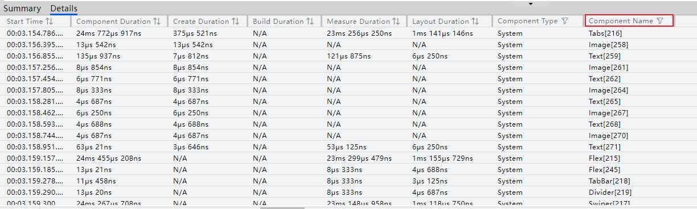

2. 点击操作完成时延的终点位置在泳道图中没有明确的Trace点，需要通过录屏工具计算出完成时延的耗时时间。从起点往后拉相同的时间找到终点位置。

  图5 **确认Trace终点**
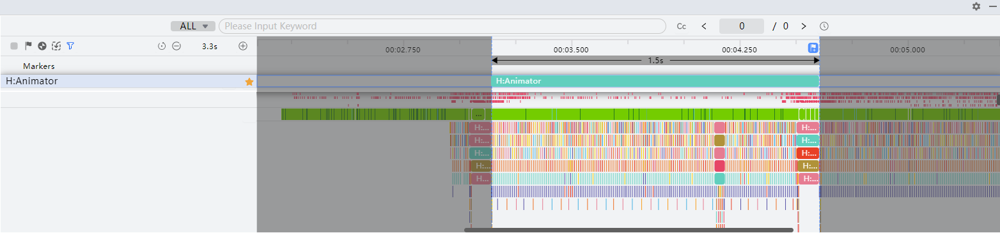

3. 使用Profiler工具标记Trace起点与终点。
 
 

##### ArkTS Callstack泳道分析ArkTS侧耗时函数

在ArkTS Callstack子泳道中，ArkVM是需要优先查看耗时情况的泳道，可以观察ArkTS侧方法的耗时。优先分析耗时最长的调用栈（program除外，program表示程序执行进入纯Native代码阶段，该阶段无ArkTS代码执行，也无ArkTS调用Native或Native调用ArkTS的情况，需要切换到Callstack泳道查看具体的调用栈信息，通常难以通过这里分析出有效信息）。逐级展开，可以看到具体耗时的文件。基于 [“HMOS世界”](https://gitcode.com/harmonyos_samples/hmosworld)切换tab页场景，抓取Trace信息。
 
图6 **ArkTS Callstack泳道图**
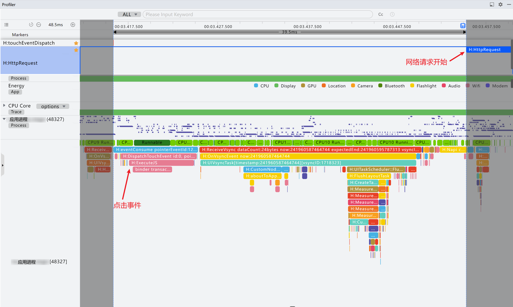

 
观察发现MainPage文件中匿名函数耗时350ms，展开该节点。
 
图7 **ArkTS Callstack泳道耗时函数详情**
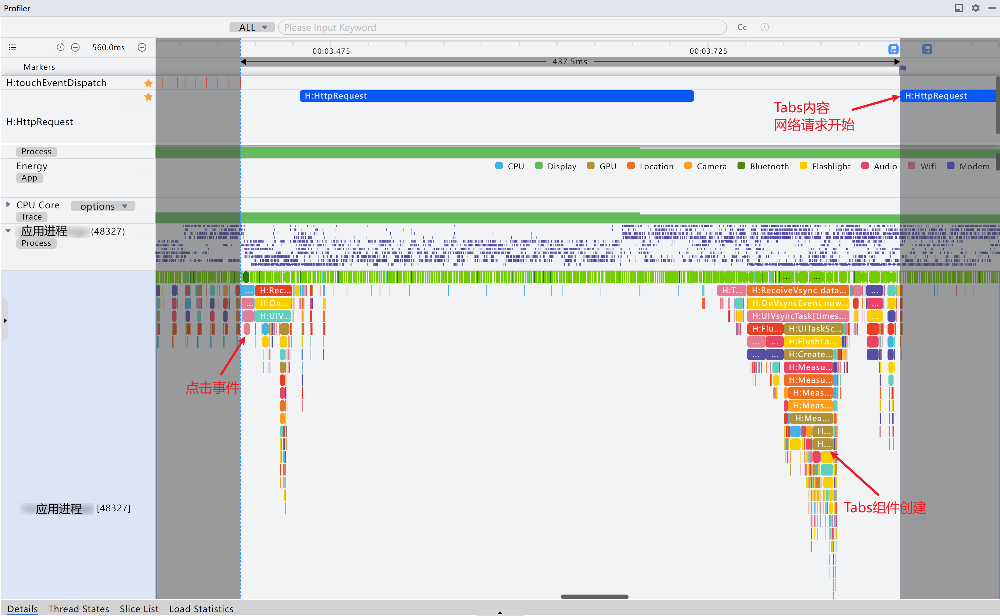

 
展开节点后发现函数调用链中AudioPlayerService中getInstance函数调用耗时327ms，接下来定位源代码。
 
```ArkTS
// products\phone\src\main\ets\pages\MainPage.ets
Tabs({ index: this.currentIndex }) {
  // ...
}
.layoutWeight(1)
.scrollable(false)
.onChange((index) => {
  this.currentIndex = index;
  ContinueModel.getInstance().data.mainTabIndex = index;
  if (AppStorage.get('audioPlayerStatus') !== AudioPlayerStatus.IDLE) {
    AudioPlayerService.getInstance().stop().then(() => {
      AudioPlayerService.destroy();
    });
  }
})
```
 
AudioPlayerService.ets相关代码如下
 
```ArkTS
// commons\audioplayer\src\main\ets\service\AudioPlayerService.ets
export class AudioPlayerService {
  private static instance: AudioPlayerService | null = null;
  // ...
  public static getInstance(): AudioPlayerService {
    if (!AudioPlayerService.instance) {
      AudioPlayerService.instance = new AudioPlayerService();
    }
    return AudioPlayerService.instance;
  }
  public static destroy(): void {
    if (AudioPlayerService.isInstanceNotNull()) {
      AudioPlayerService.getInstance().releaseAudioPlayer();
      AudioPlayerService.instance = null;
    }
  }
  // ...
}
```
 
观察源代码发现AudioPlayerService调用getInstance创建单例对象耗费大量时间，随即又调用destroy方法销毁对象。优化方式如下：获取单例对象前，先判断单例对象是否被实例化，若没有实例化则直接跳过获取与销毁，避免实例对象的无效创建与销毁，参考如下代码。
 
```ArkTS
// products\phone\src\main\ets\pages\MainPage.ets
Tabs({ index: this.currentIndex }) {
  // ...
}
.layoutWeight(1)
.scrollable(false)
.onChange((index) => {
  this.currentIndex = index;
  ContinueModel.getInstance().data.mainTabIndex = index;
  if (AppStorage.get('audioPlayerStatus') !== AudioPlayerStatus.IDLE) {
    AudioPlayerService.getInstance().stop().then(() => {
      AudioPlayerService.destroy();
    });
  }
})
```
 
优化后AudioPlayerService.ets代码如下：
 
```ArkTS
// commons\audioplayer\src\main\ets\service\AudioPlayerService.ets
export class AudioPlayerService {
  private static instance: AudioPlayerService | null = null;
  // ...
  public static getInstance(): AudioPlayerService {
    if (!AudioPlayerService.instance) {
      AudioPlayerService.instance = new AudioPlayerService();
    }
    return AudioPlayerService.instance;
  }
  public static destroy(): void {
    if (AudioPlayerService.isInstanceNotNull()) {
      AudioPlayerService.getInstance().releaseAudioPlayer();
      AudioPlayerService.instance = null;
    }
  }
  public static isInstanceNotNull(): boolean {
    return AudioPlayerService.instance !== null;
  }
  // ...
}
```
 
 

##### Frame主线程泳道分析异常

查看Frame泳道中的应用主线程子泳道，观察app侧帧数据。如果在这个泳道中出现红色帧，通常表示该帧的渲染时间超过了预期，这可能是一个性能异常的指示。
 
如下图所示的第145帧
 
图8 **超长帧Trace信息**


 
每帧的预期耗时（ms） = 1000ms / 帧率。如上图所示，选中超长帧后，可以看到该帧的预期耗时Expected Duration为 8ms 330μs，说明帧率是 120。实际耗时为 92ms 571μs，远超预期耗时，因此被识别为超长帧。超长帧的长时间渲染会直接影响用户体验，导致点击完成时延不达标。
 
通过上图发现卡顿期间存在较长的ExecuteJS调用，需要查看具体的调用栈。观察ArkTS Callstack泳道无异常后，接下来查看Callstack泳道的函数栈。
 
关于首帧渲染的特别说明：页面跳转后，由于需要重新加载和渲染新的UI元素，首帧渲染时间往往较长，可能无法达到目标帧率下的预期耗时。因此，性能分析中首帧出现红色（即超出合理预期时间）是较为常见现象，不一定表示存在严重性能问题。但仍需关注首帧渲染时间，必要时进行优化。
 
 

##### Callstack泳道分析Native侧耗时函数

Callstack泳道，该泳道显示Native函数调用泳道，也可以看到Native函数调用栈以及各函数的耗时情况，重点关注主线程和有内容的WorkerThread子泳道。
 
下图展示了超长帧案例中Callstack的主线程子泳道。
图9 **Callstack主线程泳道图**


 
 
滑动查看右侧权重最高的函数调用栈，定位到MainPage.ets文件第203行代码为主要耗时原因。
 
 

##### ArkUI Component泳道分析组件绘制耗时

ArkUI Component泳道记录了自定义组件以及系统组件的绘制次数、耗时等信息，重点关注相对于其他组件耗时比较久的组件。
 
图10 **ArkUI Component泳道泳道图**
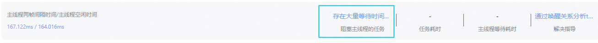

 
然后可以在详情（Details）中使用下图中被框选的按钮过滤目标组件，查看组件在刷新过程中不同阶段的耗时情况。结合函数调用栈和ArkUI Inspector工具，定位目标组件绘制耗时过长的具体原因。
 
图11 **ArkUI Component泳道图Details信息**
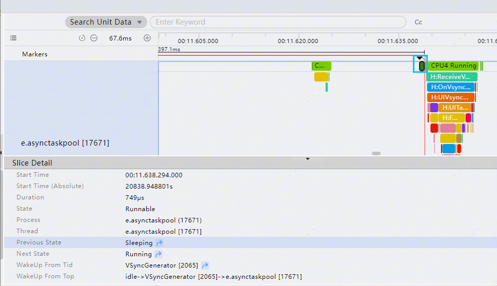

 
 

##### H:Animator泳道分析动画时长

在页面切换过程中，如果存在加载的 loading 动画，出于用户体验考虑，可将动画停止与网络请求的完成相关联。例如，展示“加载中”状态，直到数据加载完成。通过 H:Animator 泳道，可以观察到动画的耗时。
 
图12 **H:Animator 泳道图

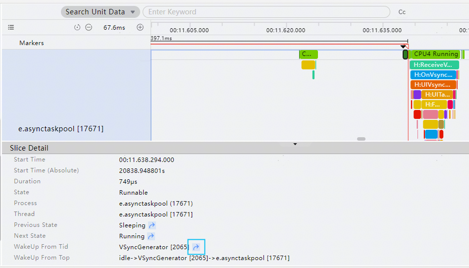

 
 

##### 完成时延解决方案

 

##### UI线程应用自身方法耗时长影响页面首次加载时延

当UI线程应用自身方法耗时过长时，会影响页面首次加载时延。AppAnalyzer提供了场景化体验检测，能帮助检测出耗时函数，协助开发者快速定位到问题点，并提供相应的优化建议。UI线程应用自身方法耗时长可参考[分析耗时函数的callstack](https://developer.huawei.com/consumer/cn/doc/best-practices/bpta-zhenlv#section117831333645)中的解决方案进行相应的代码优化。
 
 

##### 网络请求耗时

在附带网络请求的页面跳转场景中，完成时延较长的绝大多数原因在于网络数据的HTTP请求时间较长。由于网络请求从操作系统侧发起和控制，并且网络环境存在不可控性，因此很难在业务逻辑代码中优化请求速度。因此，提前发起请求就显得尤为重要。通常可以从以下两个方面进行优化：
 
**避免在异步函数中发起网络请求**
 
由于ArkTS单线程EventLoop特性，异步调用的执行时机会被延迟到同步逻辑之后。如果将Http请求接口放在异步函数中，网络请求可能会被UI绘制阻塞，等待第一帧UI绘制结束才开始。如果页面首帧较复杂，这会导致网络请求的延迟时间显著增加。
 


 
**避免在页面子组件中发起网络请求**
 
由于ArkUI组件的创建基于组件树结构，存在先后顺序。如果在页面的某一子组件中发起网络请求，该请求需要等待前面的组件创建完成。如果前面的组件创建耗时较长，会导致该请求被严重阻塞。
 
如下图情况，应用页面结构分为Header和Tabs两部分，如果将Tabs内容数据的Http请求放在Tabs组件中发起，由于Tabs组件在UI结构上依赖Header部分，则需要先创建Header，同时又因为Header内容的渲染也依赖网络请求，所以最终导致Tabs的数据请求严重延后。
 

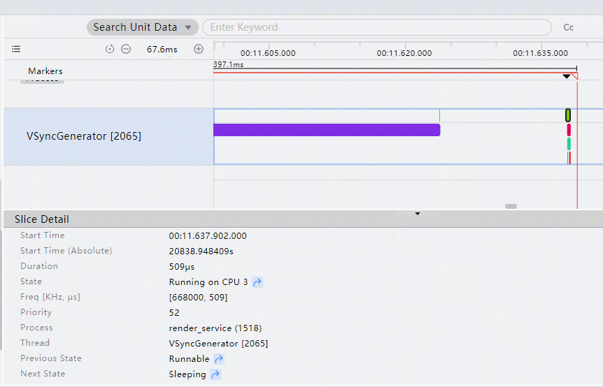

 
 

##### 动画时延耗时

页面转场动画对提升用户体验至关重要。动画时延过长会显著影响用户的点击完成时延。动画完成时间直接关系到用户何时可以开始与应用交互。动画时延的主要原因是动画时长设置过长。
 
常见的页面转场动画时长参数有：
 1. [Tabs](https://developer.huawei.com/consumer/cn/doc/harmonyos-references/ts-container-tabs)组件设置TabContent切换动画时长，即[animationDuration](https://developer.huawei.com/consumer/cn/doc/harmonyos-references/ts-container-tabs#animationduration)属性。
2. [Swiper](https://developer.huawei.com/consumer/cn/doc/harmonyos-references/ts-container-swiper)组件设置子组件切换动画时长，即[duration](https://developer.huawei.com/consumer/cn/doc/harmonyos-references/ts-container-swiper#duration)属性。
3. 页面间转场（[pageTransition](https://developer.huawei.com/consumer/cn/doc/harmonyos-references/ts-page-transition-animation)）设置转场动画时长，即[PageTransitionOptions](https://developer.huawei.com/consumer/cn/doc/harmonyos-references/ts-page-transition-animation#pagetransitionoptions对象说明)对象中的duration字段。
 
使用Tabs组件进行页面切换时，当不设置BottomTabBarStyle时默认[animationDuration](https://developer.huawei.com/consumer/cn/doc/harmonyos-references/ts-container-tabs#animationduration)属性有300ms的动画时长，当该属性值设置过长时会导致完成时延变大。接下来将该属性值分别设置为100ms与1000ms来探究animationDuration属性对完成时延的影响。
 
实验一：设置animationDuration为100ms
 
```ArkTS
@Entry
@Component
struct TabsPositiveExample {
  @State currentIndex: number = 0;
  private controller: TabsController = new TabsController();
  private list: string[] = ['green', 'blue', 'yellow', 'pink'];

  @Builder
  customContent(color: Color) {
    Column()
      .width('100%')
      .height('100%')
      .backgroundColor(color)
  }

  build() {
    Column() {
      Row({ space: 10 }) {
        ForEach(this.list, (item: string, index: number) => {
          Text(item)
            .textAlign(TextAlign.Center)
            .fontSize(16)
            .height(32)
            .layoutWeight(1)
            .fontColor(this.currentIndex === index ? Color.White : Color.Black)
            .backgroundColor(this.currentIndex === index ? Color.Blue : '#f2f2f2')
            .borderRadius(16)
            .onClick(() => {
              this.currentIndex = index;
              this.controller.changeIndex(index);
            })
        }, (item: string, index: number) => JSON.stringify(item) + index)
      }
      .margin(10)
      Tabs({ barPosition: BarPosition.Start, controller: this.controller }) {
        TabContent() {
          this.customContent(Color.Green)
        }
        TabContent() {
          this.customContent(Color.Blue)
        }
        TabContent() {
          this.customContent(Color.Yellow)
        }
        TabContent() {
          this.customContent(Color.Pink)
        }
      }
      .animationDuration(100)
      .layoutWeight(1)
      .barHeight(0)
      .scrollable(false)
    }
    .width('100%')
  }
}
```
 

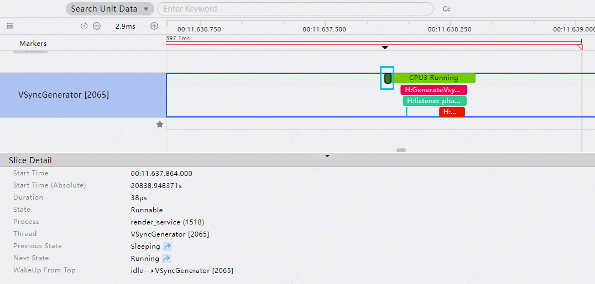

 
实验二：设置animationDuration为1000ms
```ArkTS
@Entry
@Component
struct TabsNegativeExample {
  // ...
  private controller: TabsController = new TabsController();
  // ...
  build() {
    Column() {
      // ...
      Tabs({ barPosition: BarPosition.Start, controller: this.controller }) {
        // ...
      }
      .barHeight(0)
      .layoutWeight(1)
      .animationDuration(1000)
      .scrollable(false)
    }
    .width('100%')
  }
}
```
 
 

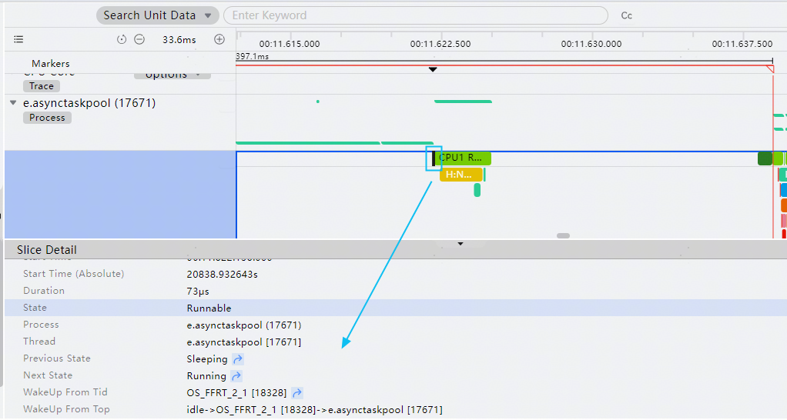

  
| 设置animationDuration为100ms | 设置animationDuration为1000ms |
| --- | --- |
|  |  |
 
  
| animationDuration属性值 | 完成时延 |
| --- | --- |
| 100ms | 99ms39μs |
| 1000ms | 1s7ms693μs |
 
 
上述示例通过减少animationDuration属性的数值，可以减小Tabs组件切换动画的完成时延。不设置BottomTabBarStyle样式时，动画时长默认为300ms。开发者可根据实际业务场景适当降低动画时长，以提高应用性能。
 
 

##### UI组件优化

转场新页面的组件过于复杂、布局不合理以及资源全量加载等会影响页面首次加载时延，可以采取如下方法进行性能优化：
 
- UI优化：可以通过减少嵌套层级、减少渲染时间、使用缓存动效、LazyForEach懒加载、动态import等方式进行优化。相关原理介绍以及场景案例，请参考[《点击响应时延分析-UI优化》](https://developer.huawei.com/consumer/cn/doc/best-practices/bpta-click-to-click-response-optimization#section1497610408322)。
- 全局自定义组件复用：使用自定义组件复用池，实现跨页面的组件复用，实现思路以及场景案例，请参考[组件复用](https://developer.huawei.com/consumer/cn/doc/best-practices/bpta-component-reuse)。
- 预创建组件：使用组件预创建，可以利用动画执行过程空闲时间进行组件预创建和属性设置。相关原理介绍以及场景案例，请参考[《声明式UI中实现组件动态创建》](https://developer.huawei.com/consumer/cn/doc/best-practices/bpta-ui-dynamic-operations)。

 
 

##### 实践案例

 

##### 存在大量等待时间无法诊断

在主线程长时间被阻塞的检测结果中，点击“存在大量等待时间无法诊断，请您确认”，打开Profiler工具，加载完成trace数据后，会框选主线程运行空闲的区域。
 

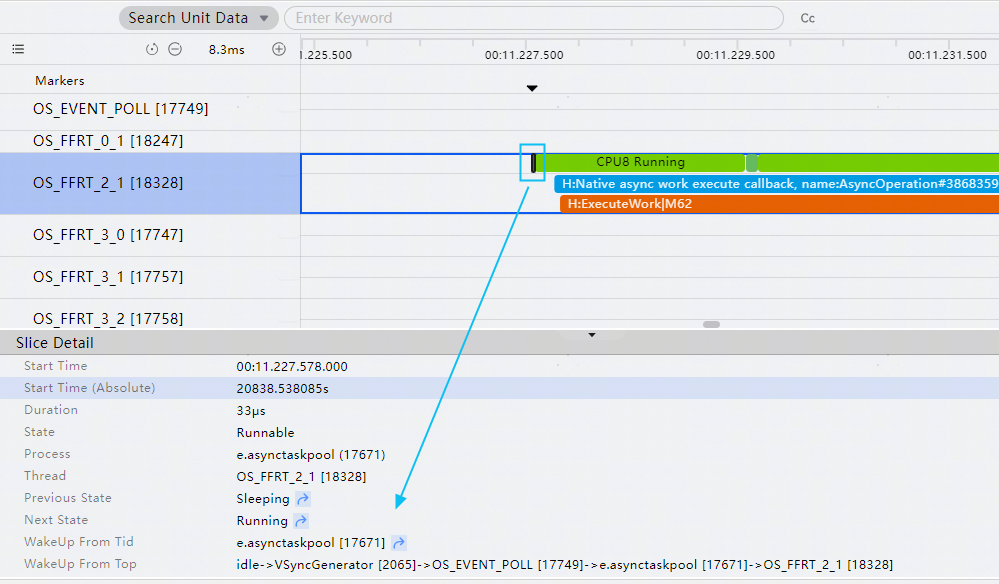

 
可以看到框选的397ms中，主线程主要处于空闲状态。放大该选中区域，并从框选的范围内，从后往前找Running前面的Runnable，点击查看Runnable详情。
 

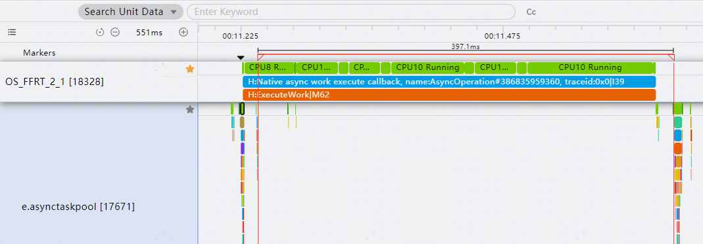

 
通过Runnable详情中的WakeUP From Tid，可以看到是VSyncGenerator唤醒的主线程。
 

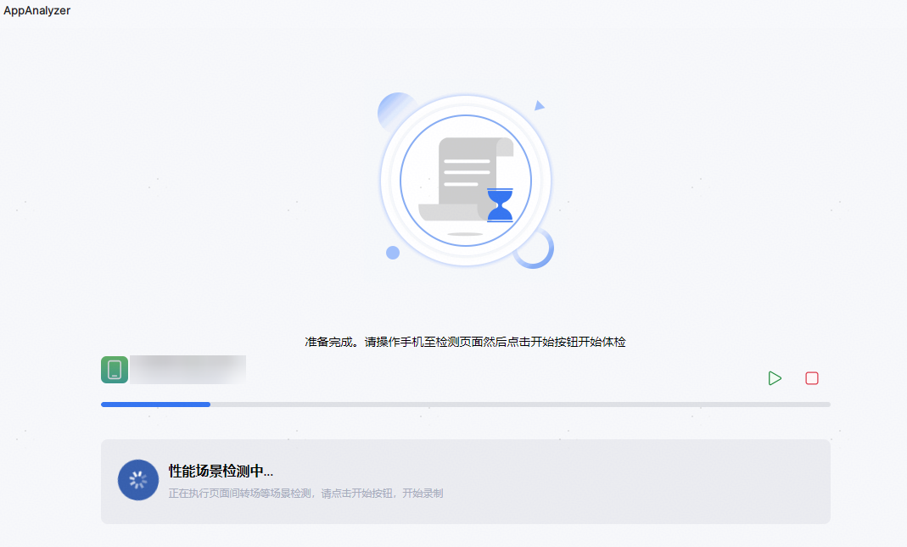

 
点击该线程名后面的跳转按钮，跳转到VSyncGenerator线程的Running详情。
 

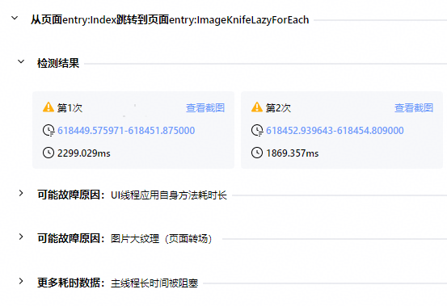

 
放大该区域，并点击该Running前面的Runnable，可看到详情中没有WakeUP From Tid，表示该线程此刻Running不是被其他线程唤醒的，且上一个状态是Sleeping，说明这条唤醒链路就断了。若该链路断掉，则需要回到主线程运行空闲的区域中，从后往前，继续上述查找步骤。
 

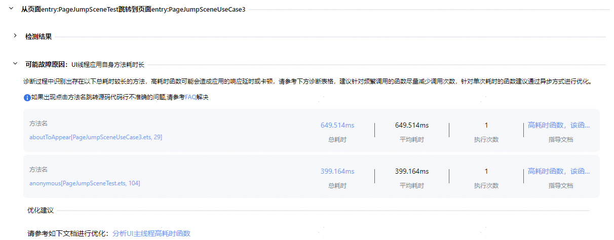

 
再次点击“存在大量等待时间无法诊断，请您确认”，回到主线程的空闲范围内，从后往前，继续找到上一个Running前面的Runnable，查看详情。
 

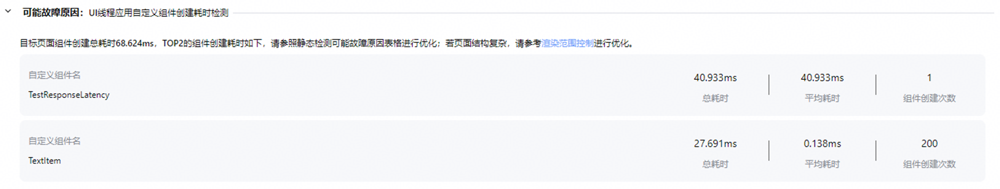

 
通过WakeUP From Tid，可以看到是OS_FFRT_2_1线程唤醒的主线程，点击后面的跳转按钮，跳转到对应线程的运行泳道。
 

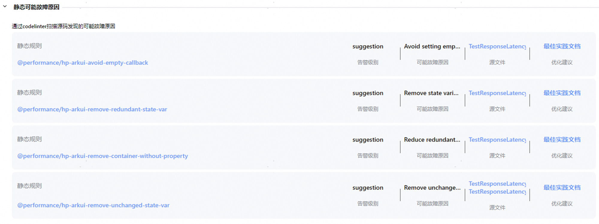

 
可以看到上一个状态是Runnable（Preempted），可能是CPU的时间片调度用完了，可继续查看该状态的前一个线程状态是否为Running。如果是，则缩小该区域，观察该线程是否连续在Running，并找到连续Running的开始时间。
 

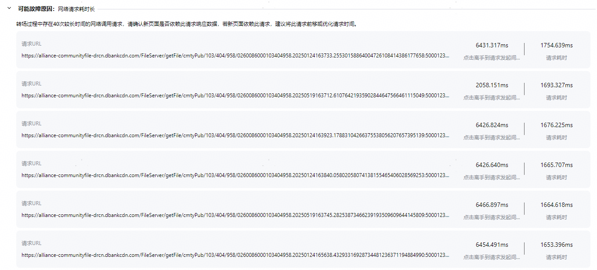

 
通过连续Running的开始时间的第一个Running前面的Runnable，继续找线程唤醒关系。
 


 
查看Runnable详情中的WakeUP From Tid，可发现此刻Running的线程是主线程的唤醒的，将该子线程泳道收藏，并通过跳转按钮找到主线程唤醒该子线程的位置。
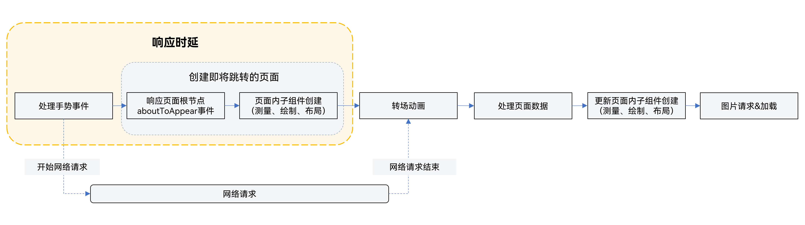

 
可以看到该空闲时间段，主要是在等待子线程OS_FFRT线程执行耗时任务导致，需要开发者判断主线程是否依赖子线程的返回，如果主线程依赖子线程返回，需要优化子线程的函数耗时，或者将耗时任务提前执行。
