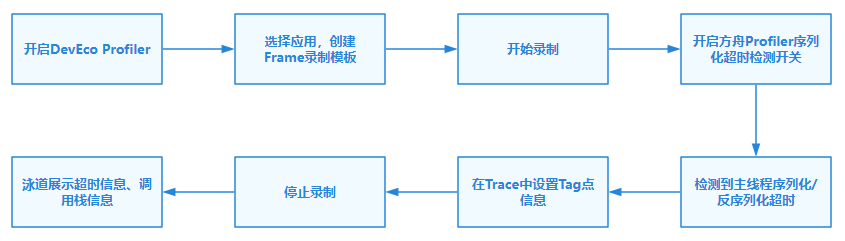
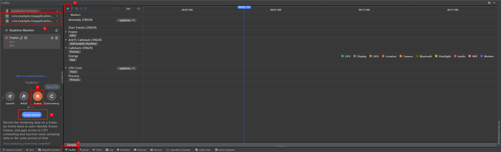
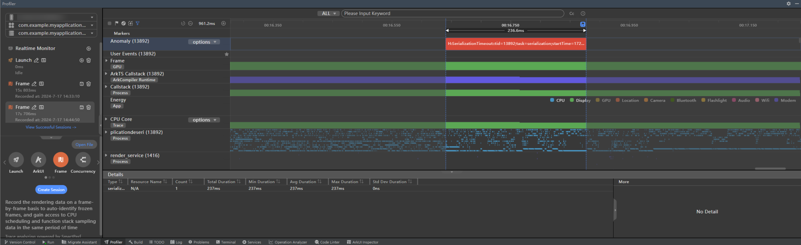
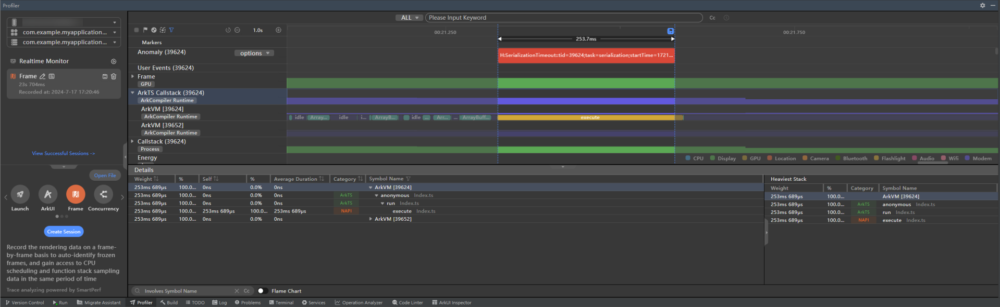
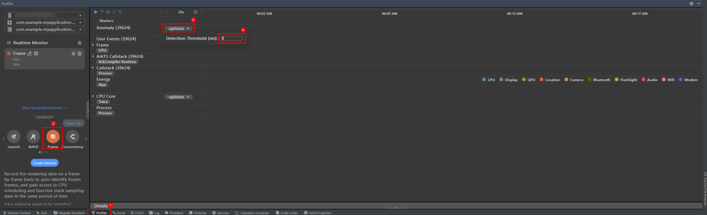
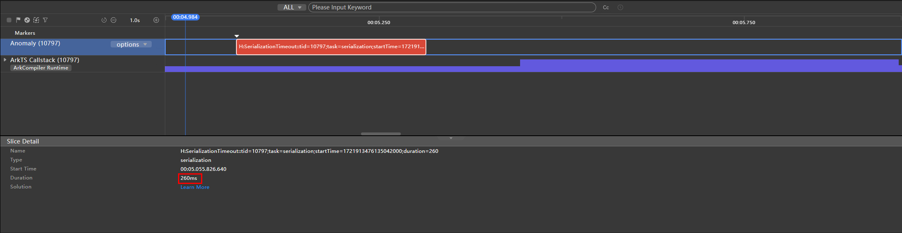
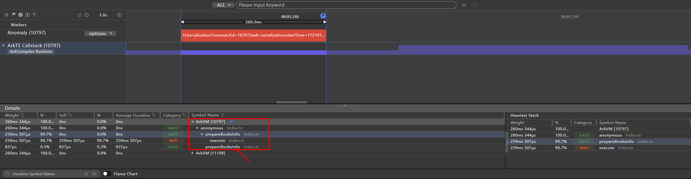
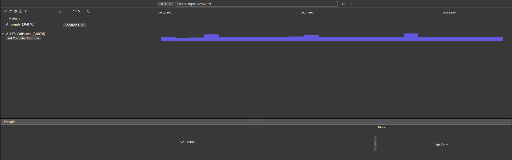

# 跨线程序列化耗时问题分析

更新时间：2026-03-12 08:45:02

来源：https://developer.huawei.com/consumer/cn/doc/best-practices/bpta-threads-serialization-timeout-analysis

**   


#### 概述

在应用开发中，涉及多线程并发场景时，开发者会频繁使用TaskPool/Worker的并发能力。对象和方法在跨线程传递时，需要进行序列化和反序列化。如果对象较大且结构复杂，序列化和反序列化的耗时会增加，影响应用的整体性能。开发者在分析性能问题时，无法感知系统是否触发了序列化或反序列化，也无法确认这些操作是否耗时。
 
 
为了帮助开发者识别代码中潜在的主线程序列化/反序列化耗时点，并推动开发者在跨线程传递对象时改用[Sendable](https://developer.huawei.com/consumer/cn/doc/harmonyos-guides/arkts-sendable)对象的方式，方舟调优和DevEco Studio联合开发并上线了应用主线程序列化/反序列化超时检测工具。该工具集成在[DevEco Profiler](https://developer.huawei.com/consumer/cn/doc/harmonyos-guides/ide-profiler)中，并可在开发者进行应用调优录制时同步开启。开发者可以在录制结果中的[Anomaly泳道](https://developer.huawei.com/consumer/cn/doc/harmonyos-guides/ide-insight-session-frame#section8198654142516)内查看到主线程序列化/反序列化超时的Tag点和相关超时信息，并通过与ArkTS Callstack泳道中当前调用栈的时间对齐，定位到序列化/反序列化耗时较长的代码，然后通过Sendable改造或者通信数据改造的方式（例如文件buffer改为文件path+偏移）进行优化，提升应用性能。
 

#### 工具介绍

DevEco Studio新增主线程序列化和反序列化检测能力，支持配置超时阈值。超过阈值的序列化和反序列化操作将在泳道中告警，并关联该时刻的调用栈信息，帮助开发者定位性能问题。
 
 

#### 功能说明

当前DevEco Profiler工具的序列化和反序列化检测包含三个子功能：
 
1. 支持配置序列化和反序列化的超时阈值。
2. 通过泳道可以直观查看序列化和反序列化的执行耗时。
3. 可以通过框选序列化或反序列化的执行耗时时间段，在ArkTS Callstack泳道中直观查看调用栈信息。
 

#### 实现原理

图1 **主线程序列化/反序列化开销检测流程图
 



 
 
超时检测的使能和关闭通过方舟Profiler提供的CDP协议控制，默认关闭。使用DevEco Profiler录制时会自动开启：
 
**表1 **超时检测使能和关闭协议
  
| 协议名称 | 传入参数 | 协议说明 |
| Profiler.enableSerializationTimeoutCheck | threshold: int | 开启超时检测工具，并设置超时阈值（单位ms） |
| Profiler.disableSerializationTimeoutCheck | / | 关闭超时检测工具 |
 
 
当开启超时检测工具协议后，方舟Profiler会在录制时实时计算每次主线程调用序列化和反序列化接口进行操作的耗时，并与设定的超时阈值（默认为8ms）进行比较。如果耗时超过阈值，Profiler会生成一条超时信息，包含以下字段：
 
**表2 **超时信息所含字段
  
| 字段名 | 字段名称 | 字段说明 |
| tid | 线程id | 线程id，指示当前超时的线程 |
| task | 操作类型 | serialization/deserialization 标记当前操作为序列化或反序列化 |
| startTime | 开始时间 | 标记当前操作的开始时间 |
| duration | 持续时间 | 标记本次序列化/反序列化的实际耗时 |
 
 
生成超时信息后，Profiler通过设置Trace接口将信息记录到Trace中，并标记Tag为Ark。这样，一条主线程程序序列化或反序列化超时的Trace信息就成功生成并记录。
 

#### 使用方法

**序列化/反序列化性能检测**
 
1. 打开DevEco Studio，确认设备已连接，待录制应用已安装。
2. 启动应用，点击Profiler，选择Frame模板，选择当前应用进程，点击Create Session，然后开始录制Frame insight场景数据，录制过程中可正常操作应用。

  **图2 **录制Frame insight场景数据**


3. 停止录制，待录制结果显示后，如有检测到主线程序列化和反序列化超时的情况，Anomaly泳道会显示序列化和反序列化耗时打点检测结果，提示信息包含线程id、startTime、duration、操作类型等。

  图3 **主线程序列化/反序列化超时情况**


4. 框选这段序列化和反序列化超时时间段，点击ArkTS Callstack，会显示这段时间内的调用栈信息，通过查看其中的Symbol Name信息可以定位到当前耗时的调用栈，双击对应调用栈即可跳转到对应源码。

  图4 **序列化/反序列化耗时阶段调用栈**


5. 开发者通过上述第4步的方式可以更快定位序列化/反序列化耗时长的源代码，并参照Sendable改造或通信数据改造的方式进行优化，从而提升应用性能。
 
**序列化/反序列化阈值配置**
 1. 打开DevEco Studio，确认设备已连接，待录制应用已安装。
2. 启动应用，点击Profiler，选择Frame模板，点击Anomaly泳道中的options，在弹出的输入框中输入超时检测阈值。

  图5 **序列化、反序列化阈值配置**


3. 参照上述序列化/反序列化性能检测步骤开始录制，此时新设置的超时阈值已经被成功设置和使用。
 

#### 案例分析

在应用开发过程中，序列化/反序列化发生在跨并发实例传输大数据的场景。由于在此场景下，序列化/反序列化的时间开销会随着数据量线性增长，因此在传输大量数据时，序列化/反序列化的时间开销显著增加。特别是当序列化/反序列化发生在应用主线程时，会影响应用的整体运行性能和流畅度。
 
Sendable对象通过引用传递的方式在不同的并发实例间传递，相比于序列化效率更高，可以更高效的进行跨实例的数据交互，解决跨并发实例传递大数据和跨并发实例传递含有成员方法的示例对象。下面以图书类应用将大量书本信息跨并发实例传递，存储进数据库的场景为例，介绍通过超时检测工具分析和定位序列化耗时点的过程，以及对该场景进行Sendable改造前后序列化耗时结果的分析对比。该案例主要由下列步骤组成：
 
1. 定义大量书本信息(示例中为5w个)；
2. 组装书本信息的class实例；
3. 通过taskpool跨并发实例传递，并进行相关数据库操作；
 
在常规情况下，单个图书信息会被定义成classBook。通过组装该实例填充数据，最后将包含所有Book实例的BookDBInfo对象通过taskpool传递给子线程。
 
```ArkTS
import { taskpool } from '@kit.ArkTS';
class Book {
  recordId_: string = '';
  title_: string = '';
  content_: string = '';
  authorList_: Array<string> | null = null;
  constructor() {
    // Initialize static information related to Book
    // ...
  }
  // omit other member methods
  // ...
}
class BookDBInfo {
  dbName_: string = '';
  seq_: number = 0;
  tableName_: string = '';
  books_: Array<Book> | null = null;
  constructor(dbName: string, tableName: string) {
    this.dbName_ = dbName;
    this.tableName_ = tableName;
  }
}
function prepareBooksInfo() {
  let dbInfo = new BookDBInfo('database1','books');
  dbInfo.books_ = new Array<Book>();
  for (let i = 0; i < 50000; i++) {
    let book = new Book();
    book.authorList_ = new Array<string>();
    // Assemble book information
    // ...
    dbInfo.books_?.push(book);
  }
  let res = taskpool.execute(doDBOperations, dbInfo); // Passing across concurrent instances through taskpool
}
@Concurrent
function doDBOperations(info : BookDBInfo) {
  // Perform database-related operations
  // ...
}
```
 
通过序列化超时检测工具检测后，在Anomaly泳道可以看到序列化耗时超出默认阈值（8ms），达到260ms。
 
图6 **未使用Sendable时序列化耗时结果**


 
通过点击下方ArkTS Callstack泳道，选取这个序列化和反序列化超时发生的时间段后，可以通过下方的Callstack信息定位到此时正在执行Index.ts文件中的prepareBooksInfo()方法，由上方伪代码可知该方法内调用了taskpool.execute()方法，向子线程中传递对象dbInfo，触发了主线程序列化和反序列化过程。
 
图7 **未使用Sendable时序列化超时阶段ArkTS Callstack调用栈**


 
为了解决该场景的序列化超时问题，将上述示例中dbInfo相关的class进行[Sendable改造](https://developer.huawei.com/consumer/cn/doc/harmonyos-guides/arkts-sendable)，将单个书本信息的类型定义为Sendable类型，并改造内部成员属性类型为Sendable类型。
 
优化后，使用序列化超时检测工具再次检测录制，发现序列化耗时已小于默认阈值8ms，在Anomaly泳道中已无对应超时的Trace点。
 
图8 **使用Sendable方式优化后序列化耗时



 
**表3 **序列化耗时对比
  
| 实现方案 | 耗时情况 |
| 未使用Sendable | 260ms |
| 使用Sendable方式优化后 | <8ms |
 
 
对比分析工具获取的优化前后序列化耗时，可以看出在跨线程传输大量数据时，使用Sendable引用传递方式能有效减少序列化耗时，提升应用性能。
 
通过实践案例可以得出结论，使用序列化超时检测工具可以有效检测出应用主线程序列化/反序列化耗时较长的情况，帮助开发者定位序列化耗时点，并结合代码层面的改造，例如[Sendable改造](https://developer.huawei.com/consumer/cn/doc/harmonyos-guides/arkts-sendable)或者通信数据改造，解决应用跨线程序列化/反序列化耗时过久的性能问题。
