# Web加载性能优化

更新时间：2026-05-22 09:46:30

来源：https://developer.huawei.com/consumer/cn/doc/best-practices/bpta-web-develop-optimization

**      


##### 概述

ArkWeb是一个Web组件平台，旨在为应用程序提供展示Web页面内容的功能，并为开发者提供丰富的能力，如页面加载、页面交互和页面调试。在当前的数字化时代，页面加载速度直接影响应用的流畅性，进而影响用户对应用的印象和体验。迅速加载并展示页面，可以吸引用户留在应用上，减少等待时间，从而提升用户满意度。

Web页面显示过程包含DNS解析、建立连接等阶段，其速度受网络延迟、资源大小等因素影响。为提升Web页面显示速度，开发者可以从Web页面加载、资源下载和页面渲染等方面进行优化，提高性能和用户体验。

本文将介绍以下常见的优化方式。

 - Web页面加载优化：提高页面加载速度能直接提升应用的流畅性。
 - JSBridge：通过JSBridge通信，可以解决ArkTS环境的冗余切换，避免造成UI阻塞。
 - 同层渲染：将页面元素分层渲染，减少页面重绘和重排次数，提升页面渲染效率。


ArkWeb（方舟Web）为开发者提供了优化页面显示速度的方法。采取这些优化方式可以改善应用性能和用户体验，提升用户满意度和留存率。


##### Web页面加载性能优化指导


##### Web页面加载流程

Web页面加载流程包括网络连接、资源下载（包括等待网络资源下载）、DOM解析、JavaScript代码编译执行、渲染等。页面加载中，比较关键的节点有网络连接、资源下载和完整的页面渲染，本文将主要对以下关键节点的耗时进行优化。

 - 预启动Web渲染进程：预启动Web渲染进程指在业务需要的Web页面启动前，加载一个空白Web组件。当至少一个Web组件存活时，Web渲染进程将一直存在，从而节省后续启动Web组件时拉起渲染进程的时间，加快页面加载速度。
 - 预解析：预解析是预先对DNS进行解析，以节省解析时间，优化Web加载速度。


 - 预连接：预连接包含预解析步骤，可在用户请求页面前完成DNS解析和socket连接建立。这样，用户真正请求页面时，服务器与浏览器之间已建立连接，可直接传输数据，减少网络延迟，提升页面加载速度。
 - 预下载：预下载是指在页面加载之前提前下载所需的资源，以避免资源下载导致的阻塞和延迟。通过预下载，浏览器可以在加载页面时提前获取所需的资源，如图片、CSS文件和JavaScript文件。提前下载这些资源可以避免页面渲染因资源未加载完成而延迟的情况。合理使用预下载技术，可以加快页面加载速度，提升用户体验。
 - 预渲染：预渲染是指在后台提前渲染需要加载的页面，完成整个页面加载流程。当访问该页面时，可直接切换至前台展示，实现页面“秒开”。预渲染需在DOM解析、JavaScript执行和页面渲染前完成所需资源的下载，否则可能导致页面内容不完整或渲染错误。预渲染可显著减少页面加载时间，尤其适用于资源密集型或交互复杂的页面。
 - 预取POST：当即将加载的Web页面中存在POST请求且该请求耗时较长时，可以预先获取POST请求的数据，从而消除等待POST请求数据下载完成的耗时。当用户实际发起POST请求时，系统将拦截并替换预取的数据，从而加快页面加载速度，提升用户体验。
 - 预编译JavaScript文件生成字节码缓存：将JavaScript文件编译成字节码并缓存到本地，首次加载页面时可节省编译时间。
 - 资源拦截替换时，JavaScript生成字节码缓存（Code Cache）将JavaScript文件编译成字节码并缓存到本地，节省页面非首次加载时的编译时间。
 - 离线资源免拦截注入：在页面加载前，将所需的图片、样式表和脚本资源注入内存缓存，以减少首次加载时的网络请求时间。
 - 资源拦截替换加速：资源拦截替换加速支持ArrayBuffer格式的入参，开发者可直接使用ArrayBuffer格式的数据进行拦截替换，无需在应用侧进行格式转换。


图1 **Web页面加载流程      **
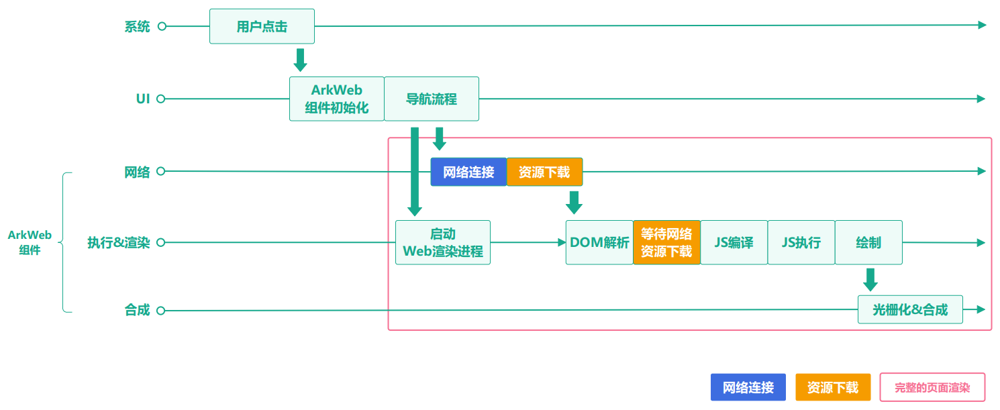


**由于所有的关键点都是建立在预处理的思路上，因此如果用户实际并未打开预处理的Web页面，将会造成额外的资源消耗。**下表列出了各优化方法的具体效果、代价和适用场景对比。

| 优化方法 | 效果（优化数据仅供参考） | 适配难度 | 影响 | 适用场景 |
| --- | --- | --- | --- | --- |
| 预启动Web渲染进程 | 消除拉起Web渲染进程的耗时，约140ms。 | 低 | 额外的内存、算力。 | 高概率被使用的Web页面。 |
| 预解析 | 消除用户真正启动的Web网页域名解析的耗时，约66ms。 | 低 | 可能存在提前解析了用户未启动的Web网页域名。 | 中高概率被使用的Web页面。 |
| 预连接 | 消除用户真正启动的Web网页域名解析、网络连接耗时，约80ms。 | 低 | 可能存在提前连接了用户未启动Web网页资源。 | 中高概率被使用的Web页面。 |
| 预下载 | 消除网络GET请求下载带来的耗时及阻塞DOM解析、JavaScript执行的耗时，约641ms。 | 低 | 额外的网络连接、下载、存储资源。 | 高概率被使用的Web页面。 |
| 预渲染 | 能实现页面“秒开”效果，将页面加载时延降到最低，约486ms。 | 中 | 额外的网络连接、下载、存储和渲染消耗。 | 超高概率被使用的Web页面。 |
| 预取POST | 消除网络POST请求下载带来的耗时及阻塞DOM解析、JavaScript执行的耗时，约313ms。 | 中 | 额外的网络连接、下载、存储资源。 | 高概率被使用的Web页面。 |
| 预编译JavaScript生成字节码缓存 | 消除JavaScript编译的耗时，优化数据根据JS资源大小而定，5.76MB资源预编译时约有2915ms收益。 | 中 | 额外的存储资源。 | 加载HTTP/HTTPS协议JavaScript的Web页面，在前两次优化加载性能。 |
| 资源拦截替换的JavaScript生成字节码缓存 | 消除JavaScript编译的耗时，优化数据根据JS资源大小而定，2.4MB资源拦截替换时约有67ms收益。 | 高 | 额外的存储资源。 | 加载自定义协议JavaScript的Web页面，在第三次及以后优化加载性能。 |
| 离线资源免拦截注入 | 消除资源加载到内存的耗时，优化数据根据资源大小而定，25MB资源注入时约有1240ms收益。 | 中 | 额外的存储资源。 | 高概率被使用的资源。 |
| 资源拦截替换加速 | 节省了转换时间，同时对ArrayBuffer格式的数据传输方式进行了优化，优化数据根据资源大小而定，10Kb资源拦截替换时约有20ms收益。 | 低 | - | ArrayBuffer格式的数据传输。 |


##### 预启动Web渲染进程

**原理介绍**

预启动Web渲染进程指用户可以在业务需要的Web页面启动前，加载一个空白的Web组件，在至少一个Web组件存活时，Web渲染进程会一直存在，节省了用户后续启动Web组件拉起渲染进程的时间，加快页面加载速度。

建议在Web页面启动前执行预启动Web渲染进程，例如在应用冷启动阶段或广告展示阶段。如果无法在冷启动期间预启动Web渲染进程，建议在系统空闲时间进行预启动。

图2 **预启动Web渲染流程      **


> [!NOTE]
> 该方案通过创建一个空白的ArkWeb组件来预启动Web渲染进程。额外创建ArkWeb组件会消耗内存和算力，预创建一个空白的Web组件大约消耗200MB内存。因此，建议后续页面加载复用预创建的Web组件。 应用全局共享一个Web渲染进程，仅在所有Web组件销毁时，该进程才会终止。因此，建议应用确保至少有一个Web组件处于活动状态。


**实践案例**

【不推荐用法】

点击跳转到下一页，直接加载Web页面。

> [!NOTE]
> 该示例涉及网络地址访问，需配置网络权限。


```ArkTS
// Index.ets
@Entry
@Component
struct Index {
  pageInfos: NavPathStack = new NavPathStack()

  build() {
    Navigation(this.pageInfos) {
      Column() {
        Button('加载测试页面', { stateEffect: true, type: ButtonType.Capsule })
          .width('80%')
          .height(40)
          .margin(20)
          .onClick(() => {
            // Put the NavDestination page information specified by name on the stack.
            this.pageInfos.pushPath({ name: 'pageOne' })
          })
      }
    }.title('NavIndex')
  }
}
```

```ArkTS
// Second.ets
import { webview } from '@kit.ArkWeb'
import { hilog } from '@kit.PerformanceAnalysisKit';

const DOMAIN = 0x0000;
const TAG = 'Sample';

@Builder
export function PageOneBuilder() {
  Second()
}

@Component
export struct Second {
  webviewController: webview.WebviewController = new webview.WebviewController();

  aboutToAppear(): void {
    // Output Web page start loading time
    hilog.info(DOMAIN, TAG, `load page start time: ${Date.now()}`);
  }

  build() {
    NavDestination() {
      Row() {
        Column() {
          // Please replace the URL with the real address.
          Web({ src: 'https://www.example.com', controller: this.webviewController })
            .height('100%')
            .width('100%')
            .onPageEnd((event) => {
              // Output Web page loading completion time
              hilog.info(DOMAIN, TAG, `load page end time: ${Date.now()}`);
            })
        }
        .width('100%')
      }
      .height('100%')
    }
  }
}
```

点击“加载测试页面”按钮，页面加载完成耗时82ms，具体如下图所示：


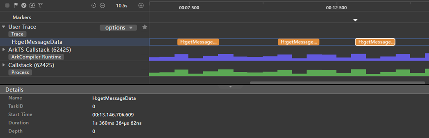


【推荐用法】

在后台创建一个ArkWeb组件来预先启动用于渲染的Web渲染进程。
1. 创建Node和对应的NodeController。在后台创建ArkWeb组件。      
```ArkTS
// Create NodeController
// common.ets
import { UIContext } from '@kit.ArkUI';
import { webview } from '@kit.ArkWeb';
import { NodeController, BuilderNode, Size, FrameNode }  from '@kit.ArkUI';
import { hilog } from '@kit.PerformanceAnalysisKit';

const DOMAIN = 0x0000;
const TAG = 'Sample';

// Specific component contents of dynamic components in @Builder
// Data is a parameter encapsulation class.
class Data{
  url: string = 'https://www.example.com';
  controller: WebviewController = new webview.WebviewController();
}

let shouldInactive: boolean = true;
@Builder
function WebBuilder(data:Data) {
  Column() {
    Web({ src: data.url, controller: data.controller })
      .domStorageAccess(true)
      .zoomAccess(true)
      .fileAccess(true)
      .mixedMode(MixedMode.All)
      .width('100%')
      .height('100%')
      .onPageBegin(() => {
        data.controller.onActive();
      })
      .onPageEnd(() => {
        hilog.info(DOMAIN, TAG, `load page end time: ${Date.now()}`);
      })
      .onFirstMeaningfulPaint(() =>{
        if (!shouldInactive) {
          return;
        }
        // stop render
        data.controller.onInactive();
        shouldInactive = false;
      })
  }
}


// Used to control and feedback the behavior of nodes on the corresponding NodeContainer, which needs to be used together with NodeContainer
export class MyNodeController extends NodeController {
  private rootNode: BuilderNode<Data[]> | null = null;
  private root: FrameNode | null = null;

  // The method that must be overridden is used to build the number of nodes and return the nodes to be mounted in the corresponding NodeContainer.
  // //Called when the corresponding NodeContainer is created, or refreshed by calling the rebuild method.
  makeNode(uiContext: UIContext): FrameNode | null {
    hilog.info(DOMAIN, TAG, ' uicontext is undefined : '+ (uiContext === undefined));
    if (this.rootNode != null) {
      const parent: FrameNode = this.rootNode.getFrameNode()?.getParent() as FrameNode;
      if (parent) {
        let inspectorInfo: string = JSON.stringify(parent.getInspectorInfo());
        hilog.info(DOMAIN, TAG, inspectorInfo);
        parent.removeChild(this.rootNode.getFrameNode());
        this.root = null;
      }
      this.root = new FrameNode(uiContext);
      this.root.appendChild(this.rootNode.getFrameNode());
      // Returns the FrameNode node
      return this.root;
    }
    // Returns a null node that controls the dynamic component to be unbound.
    return null;
  }
  // Callback when layout size changes.
  aboutToResize(size: Size): void {
    hilog.info(DOMAIN, TAG, 'aboutToResize width : ' + size.width  +  ' height : ' + size.height);

  }

  // Call back when the NodeContainer corresponding to the controller is in Appear.
  aboutToAppear(): void {
    hilog.info(DOMAIN, TAG, 'aboutToAppear');
  }

  // Call back when the NodeContainer corresponding to the controller is Disappear.
  aboutToDisappear(): void {
    hilog.info(DOMAIN, TAG, 'aboutToDisappear');
  }

  // This function is a user-defined function and can be used as an initialization function.
  // Initialize builderNode through UIContext, and then initialize the contents in @Builder through the Build interface in BuilderNode.
  initWeb(url:string, uiContext:UIContext, control:WebviewController): void {
    if(this.rootNode != null)
    {
      return;
    }
    // Creating a node requires uiContext.
    this.rootNode = new BuilderNode(uiContext)
    // Create dynamic Web components
    this.rootNode.build(wrapBuilder<Data[]>(WebBuilder), { url:url, controller:control })
  }
}

// Create the NodeController needed for Map saving.
let NodeMap:Map<string, MyNodeController | undefined> = new Map();
// Create WebViewController needed for Map saving.
let controllerMap:Map<string, WebviewController | undefined> = new Map();

// Initialization requires UIContext to be obtained in Ability.
export const createNWeb = (url: string, uiContext: UIContext) => {
  // Create NodeController
  let baseNode: MyNodeController = new MyNodeController();
  let controller: WebviewController = new webview.WebviewController() ;
  // Initialize a custom web component
  baseNode.initWeb(url, uiContext, controller);
  controllerMap.set(url, controller)
  NodeMap.set(url, baseNode);
}

// Customize to get the NodeController interface.
export const getNWeb = (url : string) : MyNodeController | undefined => {
  return NodeMap.get(url);
}
```

2. 创建载体，并创建ArkWeb组件，加载一个blank页面。      
```ArkTS
// Carrier Ability
import { UIAbility } from '@kit.AbilityKit';
import { window } from '@kit.ArkUI';
import { createNWeb } from '../pages/common';

export default class EntryAbility extends UIAbility {
  onWindowStageCreate(windowStage: window.WindowStage): void {
    windowStage.loadContent('pages/Index', (err) => {
      // Create an empty ArkWeb dynamic component in advance (need to pass in UIContext) and start the rendering process.
      createNWeb('about://blank', windowStage.getMainWindowSync().getUIContext());
    });
  }
}
```

3. 创建需要加载的ArkWeb组件。      首页：

  
```ArkTS
// Index.ets
@Entry
@Component
struct Index {
  pageInfos: NavPathStack = new NavPathStack()

  build() {
    Navigation(this.pageInfos) {
      Column() {
        Button('加载测试页面', { stateEffect: true, type: ButtonType.Capsule })
          .width('80%')
          .height(40)
          .margin(20)
          .onClick(() => {
            // Put the NavDestination page information specified by name on the stack.
            this.pageInfos.pushPath({ name: 'pageOne' })
          })
      }
    }.title('NavIndex')
  }
}
```


  跳转测试页面：       
```ArkTS
// Second.ets
import { webview } from '@kit.ArkWeb';
import { getNWeb } from './common';
import { hilog } from '@kit.PerformanceAnalysisKit';

const DOMAIN = 0x0000;
const TAG = 'Sample';

@Builder
export function PageOneBuilder() {
  Second()
}

@Component
export struct Second {
  webviewController: webview.WebviewController = new webview.WebviewController();
  aboutToAppear(): void {
    // Output Web page start loading time
    hilog.info(DOMAIN, TAG, `load page start time: ${Date.now()}`);
  }
  build() {
    NavDestination() {
      Row() {
        Column() {
          // Please replace the URL with the real address.
          NodeContainer(getNWeb('https://www.example.com'))
            .height('100%')
            .width('100%')
        }
        .width('100%')
      }
      .height('100%')
    }
  }
}
```


点击“加载测试页面”按钮，页面加载完成耗时44ms，具体如图所示：


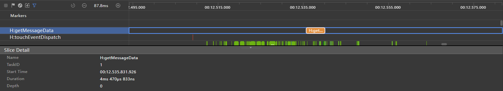


> [!NOTE]
> 开发者可以在后续页面操作中选择是否复用ArkWeb组件。


**总结**

| 下一页加载方式 | 耗时(局限不同设备和场景，数据仅供参考) | 说明 |
| --- | --- | --- |
| 直接加载Web页面 | 82ms | 页面加载时拉起渲染进程，增加加载时间 |
| 使用预启动Web渲染进程方案 | 44ms | 在闲时提前拉起渲染进程，优化启动时间 |


##### 预解析和预连接优化

**原理介绍**

应用启动和UIAbility的onCreate生命周期完成后，Web组件才能初始化和运行。ArkWeb组件运行阶段包括onAppear、load、onPageBegin、onPageEnd步骤。预解析、预连接优化适用于Web页面启动和跳转场景，例如应用启动时加载Web首页。创建ArkWeb组件实例后，开发者可以选择不同时机设置URL并进行预解析、预连接。

 - 如下图中a节点所示，如果是应用首页，推荐在ArkWeb组件初始化后设置首页URL，进行预解析和预连接。
 - 如下图中b节点所示，对于应用内页面，推荐在ArkWeb组件的onAppear阶段设置当前页面的URL，进行预解析和预连接。
 - 如下图中c节点所示，页面加载完成后，设置用户下一步可能点击页面的URL，进行预解析和预连接，推荐在onPageEnd及后续时机执行。


图3 **预连接优化原理图      **
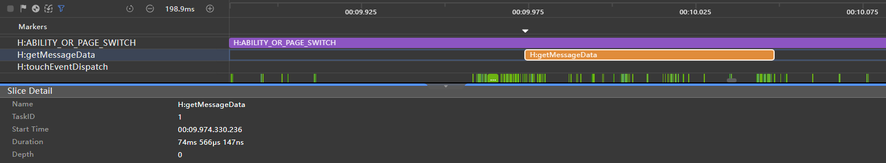


> [!WARNING]
> 在设置预解析和预连接进行优化时，需要注意： 预连接存在时效性，建议在5分钟内复用已建立的连接，超时后连接将被关闭。 预连接存在耗时，建议预加载时间比页面实际时间提前150ms以上。 当前页面加载完成后，即onPageEnd回调后，可复用当前ArkWeb组件预连接新的页面或预下载资源。


**实践案例**

案例一：如果需要提前对应用的首页进行操作，可以调用initializeWebEngine()初始化ArkWeb组件的内核，然后调用prepareForPageLoad()预连接即将加载的页面。在prepareForPageLoad中，将第二个参数设为true以进行预连接，设为false时仅进行DNS预解析。具体代码如下所示。

```ArkTS
import { AbilityConstant, UIAbility, Want } from '@kit.AbilityKit';
import { webview } from '@kit.ArkWeb';
import { hilog } from '@kit.PerformanceAnalysisKit';

const DOMAIN = 0x0000;
const TAG = 'Sample';

export default class EntryAbility extends UIAbility {
  onCreate(want: Want, launchParam: AbilityConstant.LaunchParam) {
    hilog.info(DOMAIN, TAG, 'EntryAbility onCreate');
    webview.WebviewController.initializeWebEngine();
    // When pre-connecting, you need to replace' https://www.example.com' with the actual website address to visit
    // Specify that the second parameter is true, which means to pre-connect. If it is false, the interface will only pre-resolve the URL.
    // The third parameter, numSockets, has a value range of 1-6. If it exceeds 6, the parameter will be treated as 6.
    webview.WebviewController.prepareForPageLoad('https://www.example.com/', true, 2);
    AppStorage.setOrCreate('abilityWant', want);
    hilog.info(DOMAIN, TAG, 'EntryAbility onCreate done');
  }
}
```

> [!NOTE]
> prepareForPageLoad预解析和预连接只和host相关，URL带参数的情况下也能进行预解析和预连接。


案例二：如果需要提前连接当前页面的Web页面，可以在Web组件的 `onAppear` 方法中预连接要加载的页面。具体代码如下所示：

```ArkTS
import { webview } from '@kit.ArkWeb';

@Entry
@Component
struct WebComponent {
  webviewController: webview.WebviewController = new webview.WebviewController();
  build() {
    Column() {
      Button('loadData')
        .onClick(() => {
          if (this.webviewController.accessBackward()) {
            this.webviewController.backward();
          }
        })
      Web({ src: 'https://www.example.com/cn/', controller: this.webviewController})
        .onAppear(() => {
          // Specify that the second parameter is true, which means to pre-connect. If it is false, the interface will only pre-resolve the URL.
          // The third parameter is the number of socket to be pre-connected. A maximum of six are allowed.
          webview.WebviewController.prepareForPageLoad('https://www.example.com/cn/', true, 2);
        })
    }
  }
}
```

案例三：当前页面显示完成后，可以在onPageEnd()中预连接下一个页面。

```ArkTS
import { webview } from '@kit.ArkWeb';

@Entry
@Component
struct WebComponent {
  webviewController: webview.WebviewController = new webview.WebviewController();
  build() {
    Column() {
      Web({ src: 'https://www.example.com/', controller: this.webviewController})
        .onPageEnd(() => {
          // Pre-connected https://www.example1.com/
          // The third parameter, numSockets, has a value range of 1-6. If it exceeds 6, the parameter will be treated as 6.
          webview.WebviewController.prepareForPageLoad('https://www.example.com/', true, 2);
        })
    }
  }
}
```


##### 预下载优化

**原理介绍**

如下图所示，ArkWeb组件运行包含onAppear、load、onPageBegin、onPageEnd。开发者可以在onPageEnd设置下一步访问的URL，提前下载所需资源。这种方式适用于Web页面启动和跳转场景，例如，在引导流程完成后，预下载需要跳转的页面。创建ArkWeb组件实例后，可以在当前页面加载完成后，设置URL并进行预下载。本方案可以消除资源下载耗时及资源下载导致的页面DOM解析、JS代码编译执行的阻塞耗时，预估收益在数百毫秒（具体时间依赖当前网络环境）。

图4 **预下载优化原理图      **


> [!NOTE]
> 预下载行为包括连接和资源下载，耗时可能超过700毫秒（取决于当前网络环境），建议开发者为预下载预留充足的时间。 预下载行为会消耗额外的流量和内存，建议针对高频页面使用。 预下载完成后，当前ArkWeb组件的连接将被关闭。如果要进行下一个页面的预连接，需要显式调用预连接接口。


**实践案例**

如下示例所示，在onPageEnd阶段，调用[prefetchPage()](https://developer.huawei.com/consumer/cn/doc/harmonyos-references/arkts-apis-webview-webviewcontroller#prefetchpage10)方法，即可提前下载页面所需的资源，包括主资源子资源，但不会执行网页JavaScript代码或呈现网页，以加快加载速度。

```ArkTS
import { webview } from '@kit.ArkWeb';

@Entry
@Component
struct WebComponent {
  webviewController: webview.WebviewController = new webview.WebviewController();
  build() {
    Column() {
      Web({ src: 'https://www.example.com/', controller: this.webviewController})
        .onPageEnd(() => {
          // Pre-connected https://www.iana.org/help/example-domains
          this.webviewController.prefetchPage('https://www.iana.org/help/example-domains');
        })
    }
  }
}
```

> [!NOTE]
> prefetchPage会缓存下载的资源，缓存时效为5分钟。


##### 预渲染优化

**原理介绍**

预渲染优化适用于Web页面启动和跳转场景，例如首页跳转到子页。与预连接、预下载不同，预渲染需创建新的ArkWeb组件并进行后台预渲染，此时组件不会挂载到组件树上（状态为Hidden和InActive）。开发者可在后续按需动态挂载。

具体原理如下图所示。首先，需要定义一个自定义组件封装 ArkWeb 组件，该组件被离线创建，并包含在一个无状态的节点 NodeContainer 中，与相应的 NodeController 绑定。ArkWeb 组件在后台完成预渲染后，需要展示时，再通过 NodeController 将其挂载到 ViewTree 的 NodeContainer 中，即通过 NodeController 绑定到对应的 NodeContainer 组件。预渲染通用实现的步骤如下：
1. 创建自定义ArkWeb组件：根据实际场景创建封装，组件被离线创建。
2. 创建并绑定[NodeController](https://developer.huawei.com/consumer/cn/doc/harmonyos-references/js-apis-arkui-nodecontroller)：实现NodeController接口，管理节点的创建、显示、更新等操作。将NodeController对象放入容器中，等待调用。
3. 绑定[NodeContainer](https://developer.huawei.com/consumer/cn/doc/harmonyos-references/ts-basic-components-nodecontainer)组件：与NodeController绑定，实现动态页面显示。

图5 **预渲染优化原理图      **
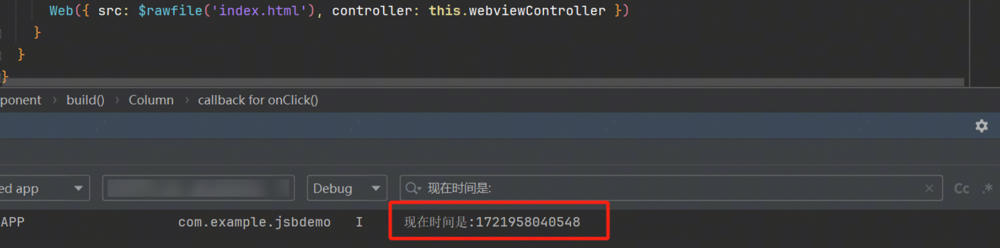


> [!NOTE]
> 预渲染相比预下载和预连接方案，会消耗更多内存和算力，建议仅用于高频页面。单个应用后台创建的ArkWeb组件数量应少于200个。


另外，为了方便实现Web组件预渲染，开发者可以引用三方库[nodepool](https://ohpm.openharmony.cn/#/cn/detail/@hadss%2Fnodepool/v/1.0.2-rc.0)。nodepool提供了全局自定义组件复用的能力，能够更高效、更简单的实现Web组件预渲染。

**实践案例**

创建载体，并创建ArkWeb组件。     
```ArkTS
import { UIAbility } from '@kit.AbilityKit';
import { window } from '@kit.ArkUI';
// Carrier Ability
// EntryAbility.ets
import {createNWeb} from './common';
export default class EntryAbility extends UIAbility {
  onWindowStageCreate(windowStage: window.WindowStage): void {
    windowStage.loadContent('pages/Index', (err, data) => {
      // Create ArkWeb dynamic components (need to pass in UIContext), which can be created at any time after loadContent.
      createNWeb('https://www.example.com', windowStage.getMainWindowSync().getUIContext());
      if (err.code) {
        return;
      }
    });
  }
}
```


创建NodeContainer和对应的NodeController，渲染后台ArkWeb组件。     
```ArkTS
// Create NodeController
// common.ets
import { UIContext } from '@kit.ArkUI';
import { webview } from '@kit.ArkWeb';
import { NodeController, BuilderNode, Size, FrameNode }  from '@kit.ArkUI';
import { hilog } from '@kit.PerformanceAnalysisKit';

const DOMAIN = 0x0000;
const TAG = 'Sample';

// Specific component contents of dynamic components in @Builder
// Data is a parameter encapsulation class.
class Data{
  url: string = 'https://www.example.com';
  controller: WebviewController = new webview.WebviewController();
}

let shouldInactive: boolean = true;
@Builder
function WebBuilder(data:Data) {
  Column() {
    Web({ src: data.url, controller: data.controller })
      .domStorageAccess(true)
      .zoomAccess(true)
      .fileAccess(true)
      .mixedMode(MixedMode.All)
      .width('100%')
      .height('100%')
      .onPageBegin(() => {
        data.controller.onActive();
      })
      .onPageEnd(() => {
        hilog.info(DOMAIN, TAG, `load page end time: ${Date.now()}`);
      })
      .onFirstMeaningfulPaint(() =>{
        if (!shouldInactive) {
          return;
        }
        // stop render
        data.controller.onInactive();
        shouldInactive = false;
      })
  }
}


// Used to control and feedback the behavior of nodes on the corresponding NodeContainer, which needs to be used together with NodeContainer
export class MyNodeController extends NodeController {
  private rootNode: BuilderNode<Data[]> | null = null;
  private root: FrameNode | null = null;

  // The method that must be overridden is used to build the number of nodes and return the nodes to be mounted in the corresponding NodeContainer.
  // //Called when the corresponding NodeContainer is created, or refreshed by calling the rebuild method.
  makeNode(uiContext: UIContext): FrameNode | null {
    hilog.info(DOMAIN, TAG, ' uicontext is undefined : '+ (uiContext === undefined));
    if (this.rootNode != null) {
      const parent: FrameNode = this.rootNode.getFrameNode()?.getParent() as FrameNode;
      if (parent) {
        let inspectorInfo: string = JSON.stringify(parent.getInspectorInfo());
        hilog.info(DOMAIN, TAG, inspectorInfo);
        parent.removeChild(this.rootNode.getFrameNode());
        this.root = null;
      }
      this.root = new FrameNode(uiContext);
      this.root.appendChild(this.rootNode.getFrameNode());
      // Returns the FrameNode node
      return this.root;
    }
    // Returns a null node that controls the dynamic component to be unbound.
    return null;
  }
  // Callback when layout size changes.
  aboutToResize(size: Size): void {
    hilog.info(DOMAIN, TAG, 'aboutToResize width : ' + size.width  +  ' height : ' + size.height);

  }

  // Call back when the NodeContainer corresponding to the controller is in Appear.
  aboutToAppear(): void {
    hilog.info(DOMAIN, TAG, 'aboutToAppear');
  }

  // Call back when the NodeContainer corresponding to the controller is Disappear.
  aboutToDisappear(): void {
    hilog.info(DOMAIN, TAG, 'aboutToDisappear');
  }

  // This function is a user-defined function and can be used as an initialization function.
  // Initialize builderNode through UIContext, and then initialize the contents in @Builder through the Build interface in BuilderNode.
  initWeb(url:string, uiContext:UIContext, control:WebviewController): void {
    if(this.rootNode != null)
    {
      return;
    }
    // Creating a node requires uiContext.
    this.rootNode = new BuilderNode(uiContext)
    // Create dynamic Web components
    this.rootNode.build(wrapBuilder<Data[]>(WebBuilder), { url:url, controller:control })
  }
}

// Create the NodeController needed for Map saving.
let NodeMap:Map<string, MyNodeController | undefined> = new Map();
// Create WebViewController needed for Map saving.
let controllerMap:Map<string, WebviewController | undefined> = new Map();

// Initialization requires UIContext to be obtained in Ability.
export const createNWeb = (url: string, uiContext: UIContext) => {
  // Create NodeController
  let baseNode: MyNodeController = new MyNodeController();
  let controller: WebviewController = new webview.WebviewController() ;
  // Initialize a custom web component
  baseNode.initWeb(url, uiContext, controller);
  controllerMap.set(url, controller)
  NodeMap.set(url, baseNode);
}

// Customize to get the NodeController interface.
export const getNWeb = (url : string) : MyNodeController | undefined => {
  return NodeMap.get(url);
}
```


通过NodeContainer使用已经预渲染的页面。     
```ArkTS
// Use the Page page of NodeController.
// Index.ets
import {getNWeb} from './common';

@Entry
@Component
struct Index {
  build() {
    Row() {
      Column() {
        // NodeContainer is used to bind with NodeController node, and rebuild will trigger makeNode.
        // Page page is bound to NodeController through NodeContainer interface to realize dynamic component page display.
        NodeContainer(getNWeb('https://www.example.com'))
          .height('90%')
          .width('100%')
      }
      .width('100%')
    }
    .height('100%')
  }
}
```


##### 预取POST请求优化

**原理介绍**


预取POST请求适用于Web页面启动和跳转场景。当即将加载的Web页面中存在耗时较长的POST请求时，可以选择在不同时机进行预取，以消除等待POST请求数据下载完成的耗时。具体有以下两种场景可供参考：
1. 如果是应用首页，推荐在ArkWeb组件创建后或提前初始化Web内核后，对首页的POST请求进行预取，例如在XComponent.onCreate()或自定义组件的生命周期函数aboutToAppear()中。
2. 当前页面加载完成后，可以对用户下一步可能点击的页面的POST请求进行预取，推荐在Web组件的生命周期函数onPageEnd()及后续时机进行。

> [!NOTE]
> 本方案能消除POST请求下载的耗时，预计收益在100毫秒左右，具体取决于POST请求的数据内容和当前网络环境。 预取POST请求行为包括连接和资源下载。连接和资源加载耗时可能达到数百毫秒，具体取决于POST请求的数据内容和当前网络环境。建议为预下载留出足够的时间。 预取POST请求会消耗额外的流量和内存，建议仅用于高频页面。 POST请求具有即时性，预取POST请求需指定有效期。 目前仅支持预取Content-Type为application/x-www-form-urlencoded的POST请求，最多预取6个。预取第7个时，会自动清除最早预取的POST缓存。也可以通过clearPrefetchedResource()接口主动清除不再使用的预取资源缓存。 如果要使用预获取的资源缓存，开发者需要在正式发起的POST请求的请求头中添加“ArkWebPostCacheKey”，其值为对应缓存的cacheKey。


**实践案例**

案例一：加载包含POST请求的首页。

> [!NOTE]
> 预取POST不会影响首页加载时间。


【不推荐用法】

当首页包含POST请求，并且该请求耗时较长时，不建议直接加载Web页面。

```ArkTS
import { webview } from '@kit.ArkWeb';

@Entry
@Component
struct WebComponent {
  webviewController: webview.WebviewController = new webview.WebviewController();

  build() {
    Column() {
      Web({ src: 'https://www.example.com/', controller: this.webviewController })
    }
  }
}
```

【推荐用法】

预取POST请求以加载首页，具体步骤如下：
1. 通过initializeWebEngine()来提前初始化Web组件的内核，然后在初始化内核后调用prefetchResource()预获取将要加载页面中的POST请求。

  
```ArkTS
import { AbilityConstant, UIAbility, Want } from '@kit.AbilityKit';
import { webview } from '@kit.ArkWeb';
import { hilog } from '@kit.PerformanceAnalysisKit';

const DOMAIN = 0x0000;
const TAG = 'Sample';

export default class EntryAbility extends UIAbility {
  // EntryAbility.ets
  onCreate(want: Want, launchParam: AbilityConstant.LaunchParam): void {
    hilog.info(DOMAIN, TAG, 'EntryAbility onCreate.');
    webview.WebviewController.initializeWebEngine();
    // When pre-acquiring, 'https://www.example1.com/POST? E=f&g=h' is replaced by the actual website address to be visited.
    webview.WebviewController.prefetchResource(
      {
        url: 'https://www.example.com/POST?e=f&g=h',
        method: 'POST',
        formData: 'a=x&b=y'
      },
      [{
        headerKey: 'c',
        headerValue: 'z'
      }],
      'KeyX', 500
    );
    AppStorage.setOrCreate('abilityWant', want);
    hilog.info(DOMAIN, TAG, 'EntryAbility onCreate done.');
  }
  // ...
}
```

2. 通过Web组件加载包含POST请求的页面。

  
```ArkTS
import { webview } from '@kit.ArkWeb';

@Entry
@Component
struct WebComponent {
  webviewController: webview.WebviewController = new webview.WebviewController();

  build() {
    Column() {
      Web({ src: 'https://www.example.com/', controller: this.webviewController })
        .onPageEnd(() => {
          // Clear the cache of pre-acquired resources that are no longer used in the future.
          webview.WebviewController.clearPrefetchedResource(['KeyX']);
        })
    }
  }
}
```

3. 在页面加载的JavaScript文件中，发起POST请求，并将请求响应头ArkWebPostCacheKey设置为预取时的cachekey值'KeyX'。

  
```xml
const xhr = new XMLHttpRequest();
xhr.open('POST', 'https://www.example.com/POST?e=f&g=h', true);
xhr.setRequestHeader('Content-Type', 'application/x-www-form-urlencoded');
xhr.setRequestHeader('ArkWebPostCacheKey', 'KeyX');
xhr.onload = function () {
  if (xhr.status >= 200 && xhr.status < 300) {
    console.log('成功', xhr.responseText);
  } else {
    console.error('请求失败');
  }
}
const formData = new FormData();
formData.append('a', 'x');
formData.append('b', 'y');
xhr.send(formData);
```


案例二：加载包含POST请求的下一页。

【不推荐用法】

当即将加载的Web页面中包含POST请求，并且POST请求耗时较长时，不建议直接加载Web页面。

```ArkTS
import { webview } from '@kit.ArkWeb';

@Entry
@Component
struct WebComponent {
  webviewController: webview.WebviewController = new webview.WebviewController();

  build() {
    Column() {
      Button('加载页面')
        .onClick(() => {
          this.webviewController.loadUrl('https://www.example1.com/');
        })
      Web({ src: 'https://www.example.com/', controller: this.webviewController })
    }
  }
}
```

【推荐用法】

通过预取POST加载包含POST请求的下一个跳转页面。
1. 当前页面显示完成后，使用onPageEnd()预获取即将加载页面中的POST请求。

  
```ArkTS
import { hiTraceMeter } from '@kit.PerformanceAnalysisKit';
import { webview } from '@kit.ArkWeb';

@Entry
@Component
struct WebComponent {
  controller: webview.WebviewController = new webview.WebviewController();
  webviewController: webview.WebviewController = new webview.WebviewController();

  build() {
    Column() {
      // Load the business Web component at an appropriate time. This example takes the Button click trigger as an example.
      Button('加载页面')
        .onClick(() => {
          // Performance dot
          hiTraceMeter.startTrace('getMessageData', 1);
          // Please replace the URL with the real address.
          this.controller.loadUrl('https://www.example1.com/');
        })
      Web({ src: 'https://www.example.com/', controller: this.webviewController })
        .onPageEnd(() => {
          // When pre-acquiring, 'https://www.example1.com/POST? E=f&g=h' is replaced by the actual website address to be visited.
          webview.WebviewController.prefetchResource(
            {
              url: 'https://www.example1.com/POST?e=f&g=h',
              method: 'POST',
              formData: 'a=x&b=y'
            },
            [{
              headerKey: 'c',
              headerValue: 'z'
            }],
            'KeyX', 500
          );
        })
    }
  }
}
```

2. 在将要加载的页面中，JavaScript发起POST请求，并将请求响应头ArkWebPostCacheKey设置为预取时设置的cachekey值'KeyX'。

  
```xml
const xhr = new XMLHttpRequest();
xhr.open('POST', 'https://www.example.com/POST?e=f&g=h', true);
xhr.setRequestHeader('Content-Type', 'application/x-www-form-urlencoded');
xhr.setRequestHeader('ArkWebPostCacheKey', 'KeyX');
xhr.onload = function () {
  if (xhr.status >= 200 && xhr.status < 300) {
    console.log('成功', xhr.responseText);
  } else {
    console.error('请求失败');
  }
}
const formData = new FormData();
formData.append('a', 'x');
formData.append('b', 'y');
xhr.send(formData);
```


##### 预编译JavaScript生成字节码缓存（Code Cache）

**原理介绍**

预编译JavaScript生成字节码缓存，可以在页面加载前将即将使用的JavaScript文件编译为字节码并缓存到本地，从而在页面首次加载时减少编译时间。

创建一个无需渲染的离线Web组件，用于预编译。预编译结束后，使用其他Web组件加载业务网页。


> [!NOTE]
> 建议开发者优先使用 Code Linter扫描工具 进行代码检查，重点关注 @performance/js-code-cache-by-precompile-check 规则。若扫描结果中出现该规则相关问题，可参考本章节提供的优化建议进行调整。 仅HTTP或HTTPS协议请求的JavaScript文件可以预编译。 不支持ES6 Module语法的JavaScript文件生成预编译字节码缓存。 通过配置响应头中的E-Tag和Last-Modified值来标记JavaScript缓存版本，当这些值发生变化时，更新字节码缓存。 不支持本地JavaScript文件预编译缓存。


**实践案例**

案例一：在未使用预编译JavaScript前提下，启动加载Web页面

```ArkTS
import { webview } from '@kit.ArkWeb';
import { hilog, hiTraceMeter } from '@kit.PerformanceAnalysisKit';

const DOMAIN = 0x0000;
const TAG = 'Sample';

@Entry
@Component
struct Index {
  controller: webview.WebviewController = new webview.WebviewController();

  build() {
    Column() {
      // Load the business Web component at an appropriate time. This example takes the Button click trigger as an example.
      Button('加载页面')
        .onClick(() => {
          // Performance dot
          hiTraceMeter.startTrace('unPrecompileJavaScript', 1);
          // Please replace the URL with the real address.
          this.controller?.loadUrl('https://www.example.com/b.html');
        })
      Web({ src: 'https://www.example.com/a.html', controller: this.controller })
        .fileAccess(true)
        .onPageBegin((event) => {
          hilog.info(DOMAIN, TAG, `load page begin: ${event?.url}`);
        })
        .onPageEnd((event) => {
          // Performance dot
          hiTraceMeter.finishTrace('unPrecompileJavaScript', 1);
          hilog.info(DOMAIN, TAG, `load page end: ${event?.url}`);
        })
    }
  }
}
```

点击“加载页面”按钮，[性能打点](https://developer.huawei.com/consumer/cn/doc/harmonyos-references/js-apis-hitracemeter)数据如下，getMessageData进程中的Duration为加载页面开始到结束的耗时：


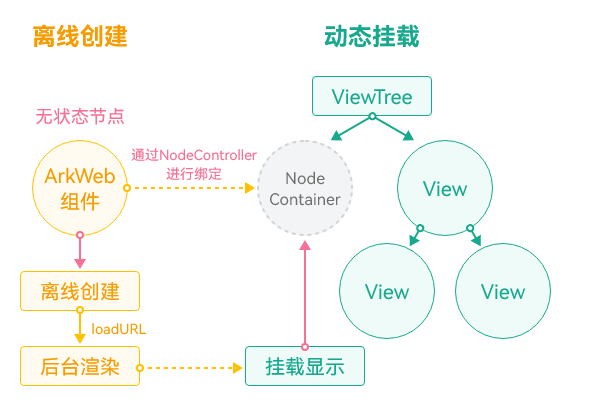


> [!NOTE]
> JavaScript的编译时间受文件大小和逻辑复杂度的影响。


案例二：使用预编译JavaScript生成字节码缓存，具体步骤如下：
1. 配置预编译的JavaScript文件信息。

  
```ArkTS
import { webview } from '@kit.ArkWeb';
import { hilog } from '@kit.PerformanceAnalysisKit';

const DOMAIN = 0x0000;
const TAG = 'Sample';

interface Config {
  url: string,
  localPath: string, // local resource path
  options: webview.CacheOptions
}

@Entry
@Component
struct Index {
  controller: webview.WebviewController = new webview.WebviewController();
  // Configure precompiled JavaScript file information
  configs: Array<Config> = [
    {
      url: 'https://www.example.com/example.js',
      localPath: 'example.js',
      options: {
        responseHeaders: [
          { headerKey: 'E-Tag', headerValue: 'xxx' },
          { headerKey: 'Last-Modified', headerValue: 'Web, 21 Mar 2024 10:38:41 GMT' }
        ]
      }
    }
  ]

  // ...
}
```

2. 读取配置，进行预编译。

  
```ArkTS
Web({ src: 'https://www.example.com/a.html', controller: this.controller })
  .onControllerAttached(async () => {
    // Read the configuration and precompile.
    for (const config of this.configs) {
      this.getUIContext()
        .getHostContext()?.resourceManager.getRawFileContent(config.localPath)
        .then((content: Uint8Array) => {
          this.controller.precompileJavaScript(config.url, content, config.options)
            .then(() => {
              hilog.info(DOMAIN, TAG, 'precompile successfully!');
            }).catch((errCode: number) => {
            hilog.error(DOMAIN, TAG, 'precompile failed.' + errCode);
          })
        }).catch(() => {
        hilog.error(DOMAIN, TAG, 'precompile failed!.');
      })
    }
  })
```
点击“加载页面”按钮，性能打点数据如下：getMessageData进程中的Duration表示加载页面从开始到结束的耗时。

  
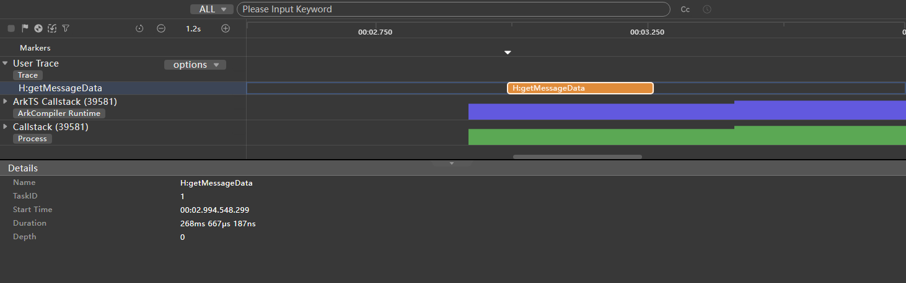


  
> [!NOTE]
> 当需要更新本地已生成的编译字节码时，修改cacheOptions参数中responseHeaders的E-Tag或Last-Modified响应头对应的值，再次调用接口即可。


**总结**

| 页面加载方式 | 耗时(局限不同设备和场景，数据仅供参考) | 说明 |
| --- | --- | --- |
| 直接加载Web页面 | 3183ms | 页面加载时才进行JavaScript编译，从而增加了加载时间 |
| 预编译JavaScript生成字节码缓存 | 268ms | 在加载页面前完成JavaScript预编译，从而节省了首次加载的编译时间 |


##### 资源拦截替换的JavaScript生成字节码缓存（Code Cache）

**原理介绍**

资源拦截替换的JavaScript生成字节码缓存适用于页面加载时需要加载网络JavaScript文件并进行拦截替换的场景。此功能支持将字节码缓存到本地，从而在页面非首次加载时节省编译时间。

> [!NOTE]
> 建议开发者优先使用 Code Linter扫描工具 进行代码检查，重点关注 @performance/js-code-cache-by-interception-check 规则。若扫描结果中出现该规则相关问题，可参考本章节提供的优化建议进行调整


图6 **JS资源编译执行流程     


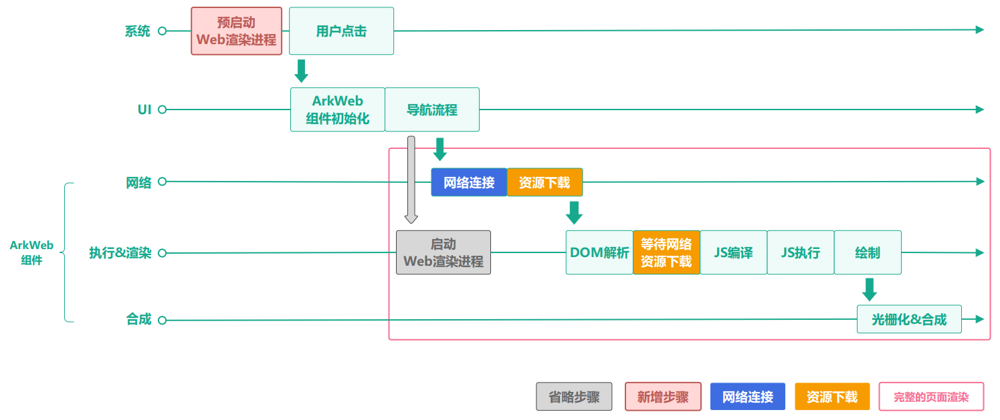


**图7 **资源拦截替换后JS资源编译执行流程     


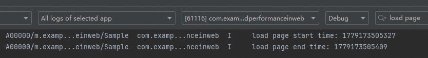


Web组件默认支持HTTP协议和自定义协议的JavaScript生成字节码缓存。具体步骤如下：
1. 开发者需要在Web组件运行前注册自定义协议。
2. 拦截自定义协议的JavaScript，设置ResponseData和ResponseDataID。


> [!NOTE]
> ResponseData为JavaScript内容，ResponseDataID用于区分内容是否变更。内容变更时，ResponseDataID也需要变更。


**实践案例**

案例一：拦截HTTP协议的JavaScript文件，生成字节码缓存。

【不推荐用法】

不设置ResponseDataID，直接加载Web界面。
1. 构造前端H5界面

  
```text
<!DOCTYPE html>
<html lang="en">
<head>
    <meta charset="UTF-8">
    <meta name="viewport"
          content="width=device-width, user-scalable=no, initial-scale=1.0, maximum-scale=1.0, minimum-scale=1.0">
    <meta http-equiv="X-UA-Compatible" content="ie=edge">
    <title>Document</title>
</head>
<body>
<div id="div-1">this is a test div</div>
<div id="div-2">this is a test div</div>
<div id="div-3">this is a test div</div>
<div id="div-4">this is a test div</div>
<div id="div-5">this is a test div</div>
<div id="div-6">this is a test div</div>
<div id="div-7">this is a test div</div>
<div id="div-8">this is a test div</div>
<div id="div-9">this is a test div</div>
<div id="div-10">this is a test div</div>
<div id="div-11">this is a test div</div>
</body>
<script src="https://www.example.com/test.js"></script>
</html>
```

2. 不设置ResponseDataID，进行界面请求拦截替换

  
```ArkTS
import { webview } from '@kit.ArkWeb';
import { hiTraceMeter } from '@kit.PerformanceAnalysisKit';

@Entry
@Component
struct Index {
  webViewController: webview.WebviewController = new webview.WebviewController();
  responseResource: WebResourceResponse = new WebResourceResponse();
  // The developer defines the response data, and the length of the response data must be greater than or equal to 1024 to generate CodeCache.
  @State jsData: string = 'JavaScript Data';

  build() {
    Column() {
      Web({ src: $rawfile('index.html'), controller: this.webViewController })
        .onInterceptRequest(event => {
          // Intercept page requests
          if (event?.request.getRequestUrl() === 'https://www.example.com/test.js') {
            // Construct response data
            this.responseResource.setResponseData(this.jsData);
            this.responseResource.setResponseEncoding('utf-8');
            this.responseResource.setResponseMimeType('application/javascript');
            this.responseResource.setResponseCode(200);
            this.responseResource.setReasonMessage('OK');
            return this.responseResource;
          }
          return null;
        })
        .onPageBegin(() => {
          hiTraceMeter.startTrace('getMessageData', 0);
        })
        .onPageEnd(() => {
          hiTraceMeter.finishTrace('getMessageData', 0);
        })
    }
    .width('100%')
  }
}
```


打开应用后关闭，重复两次，然后查看第三次页面加载的耗时。性能打点数据如下：getMessageData 进程中的 Duration 表示页面加载从开始到结束的耗时。


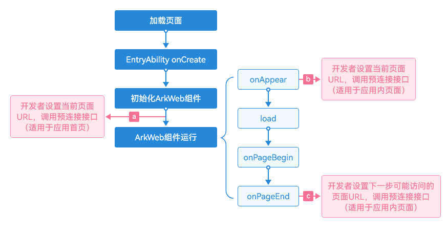


【推荐用法】

在进行资源拦截替换时，设置请求头中的ResponseData和ResponseDataID。

```ArkTS
import { webview } from '@kit.ArkWeb';
import { hiTraceMeter } from '@kit.PerformanceAnalysisKit';

@Entry
@Component
struct Index {
  controller: webview.WebviewController = new webview.WebviewController();
  responseResource: WebResourceResponse = new WebResourceResponse();
  // Construct response data
  @State jsData: string = 'JavaScript Data';

  build() {
    Column() {
      Web({ src: $rawfile('index.html'), controller: this.controller })
        .onInterceptRequest((event) => {
          // Intercept page requests
          if (event?.request.getRequestUrl() === 'https://www.example.com/test.js') {
            // Construct response data
            this.responseResource.setResponseHeader([
              {
                // Format: No more than 13 digits. Js ID, this field must be updated when Js is updated.
                headerKey: 'ResponseDataID',
                headerValue: '0000000000001'
              }]);
            this.responseResource.setResponseData(this.jsData);
            this.responseResource.setResponseEncoding('utf-8');
            this.responseResource.setResponseMimeType('application/javascript');
            this.responseResource.setResponseCode(200);
            this.responseResource.setReasonMessage('OK');
            return this.responseResource;
          }
          return null;
        })
        .onPageBegin(() => {
          hiTraceMeter.startTrace('getMessageData', 0);
        })
        .onPageEnd(() => {
          hiTraceMeter.finishTrace('getMessageData', 0);
        })
    }
  }
}
```

打开应用后关闭，重复两次，然后查看第三次页面加载的耗时。性能打点数据如下：getMessageData 进程中的 Duration 表示页面加载从开始到结束的耗时。


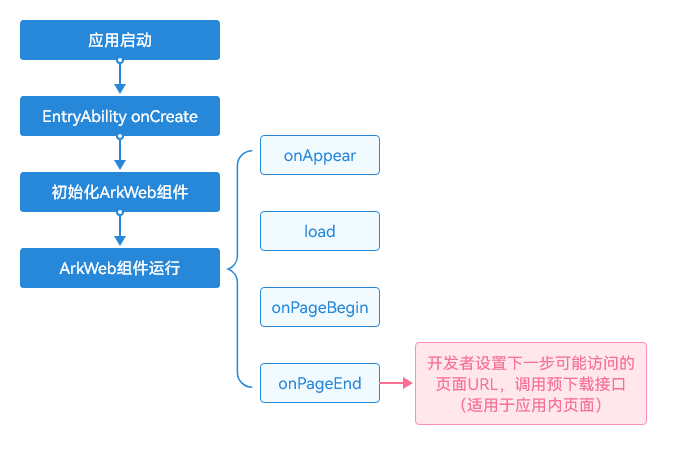


案例二：调用ArkTS接口customizeSchemes()，在注册自定义协议的情况下，实现JavaScript生成字节码缓存，具体步骤如下：
1. 将scheme对象的isCodeCacheSupported属性设置为true，支持自定义协议的JavaScript生成字节码缓存

  
```ArkTS
scheme1: webview.WebCustomScheme = { schemeName: "scheme1", isSupportCORS: true, isSupportFetch: true, isCodeCacheSupported: true }
```

2. 在Web组件运行前，向Web组件注册自定义协议。

  
> [!NOTE]
> 请确保自定义协议不与Web内核内置协议相同。


  
```ArkTS
aboutToAppear(): void {
  try {
    webview.WebviewController.customizeSchemes([this.scheme1])
  } catch (error) {
    let e: business_error.BusinessError = error as business_error.BusinessError;
    hilog.error(DOMAIN, TAG, `ErrorCode: ${e.code},  Message: ${e.message}`);
  }
}
```

3. 拦截自定义协议的JavaScript，设置ResponseData和ResponseDataID。ResponseData包含JavaScript内容，ResponseDataID用于标识JavaScript内容是否发生变化。

  
> [!NOTE]
> 若JavaScript内容变更，ResponseDataID需要一起变更


  
```ArkTS
Web({
  src: $rawfile('index.html'),
  controller: this.webController
})
  .fileAccess(true)
  .javaScriptAccess(true)
  .width('100%')
  .height('100%')
  .onConsole((event) => {
    hilog.info(DOMAIN, TAG, 'ets onConsole:' + event?.message.getMessage());
    return false
  })
  .onInterceptRequest((event) => {
    let responseResource = new WebResourceResponse()
    // Intercept page requests
    if (event?.request.getRequestUrl() == 'https://www.intercept.com/test-cc.js') {
      // Construct response data
      responseResource.setResponseHeader([
        {
          headerKey: 'ResponseDataID',
          headerValue: '0000000000002'
          // Format: No more than 13 digits. Js ID, this field must be updated when Js is updated.
        }]);
      responseResource.setResponseData(this.jsData);
      responseResource.setResponseEncoding('utf-8');
      responseResource.setResponseMimeType('application/javascript');
      responseResource.setResponseCode(200);
      responseResource.setReasonMessage('OK');
      return responseResource;


    }
    if (event?.request.getRequestUrl() == 'scheme1://www.intercept.com/test-cc2.js') {
      // Construct response data
      responseResource.setResponseHeader([
        {
          headerKey: 'ResponseDataID',
          headerValue: '0000000000001'
          // Format: No more than 13 digits. Js ID, this field must be updated when Js is updated.
        }]);
      responseResource.setResponseData(this.jsData2);
      responseResource.setResponseEncoding('utf-8');
      responseResource.setResponseMimeType('application/javascript');
      responseResource.setResponseCode(200);
      responseResource.setReasonMessage('OK');
      return responseResource;
    }
    return null;
  })
```


案例三：调用Native接口 `int32_t OH_ArkWeb_RegisterCustomSchemes(const char *scheme, int32_t option)`，实现自定义协议的JavaScript生成字节码缓存。通过网络拦截接口拦截Web组件发出的请求。示例代码请参考[拦截Web组件发起的网络请求](https://developer.huawei.com/consumer/cn/doc/harmonyos-guides/web-scheme-handler)。具体步骤如下：
1. 注册三方协议配置时，传入 `ARKWEB_SCHEME_OPTION_CODE_CACHE_ENABLED` 参数。

  
```cpp
// register Custom Schemes before web initialized
static napi_value RegisterCustomSchemes(napi_env env, napi_callback_info info) {
    OH_LOG_INFO(LOG_APP, "register custom schemes");
    OH_ArkWeb_RegisterCustomSchemes("custom", ARKWEB_SCHEME_OPTION_STANDARD | ARKWEB_SCHEME_OPTION_CORS_ENABLED | ARKWEB_SCHEME_OPTION_CODE_CACHE_ENABLED);
    return nullptr;
}
```

2. 设置ResponseDataID。

  
```cpp
// Read Rawfile Data On Worker Thread
void RawfileRequest::ReadRawfileDataOnWorkerThread() {
    OH_LOG_INFO(LOG_APP, "read rawfile in worker thread.");
    const struct UrlInfo {
        std::string resource;
        std::string mimeType;
    } urlInfos[] = {{"local.html", "text/html"},
                    {"local_script.js", "text/javascript"},
                    {"test-cc.js", "text/javascript"}
                    };


    if (!resourceManager()) {
        OH_LOG_ERROR(LOG_APP, "read rawfile error, resource manager is nullptr.");
        return;
    }


    RawFile *rawfile = OH_ResourceManager_OpenRawFile(resourceManager(), rawfilePath().c_str());
    if (!rawfile) {
        OH_ArkWebResponse_SetStatus(response(), 404);
    } else {
        OH_ArkWebResponse_SetStatus(response(), 200);
    }


    for (auto &urlInfo : urlInfos) {
        if (urlInfo.resource == rawfilePath()) {
            OH_ArkWebResponse_SetMimeType(response(), urlInfo.mimeType.c_str());
            break;
        }
    }


    if ("test-cc.js" == rawfilePath()) {
        OH_LOG_ERROR(LOG_APP, "OH_ArkWebResponse_SetHeaderByName ResponseDataID");
        OH_ArkWebResponse_SetHeaderByName(response(), "ResponseDataID", "0000000000001", true);
    }
    OH_ArkWebResponse_SetCharset(response(), "UTF-8");
}
```

3. 注册三方协议并设置SchemeHandler。

  
```ArkTS
// EntryAbility.ets
onCreate(want: Want, launchParam: AbilityConstant.LaunchParam): void {
  // register CustomSchemes
  testNapi.registerCustomSchemes();
  // initializeWebEngine
  webview.WebviewController.initializeWebEngine();
  // set SchemeHandler。
  testNapi.setSchemeHandler();
}
```
性能打点数据如下，getMessageData进程中的Avg Wall Duration为两次加载页面开始到结束的平均耗时：

  
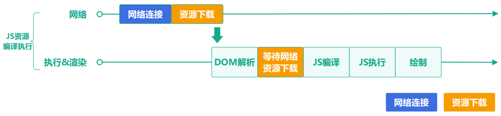


**总结****（以拦截替换HTTP协议的JavaScript生成字节码缓存场景性能数据举例）**

构造2.4MB大小的JavaScript文件，进行资源拦截替换，多次测试取平均耗时，具体数据如下：

| 资源拦截替换方式 | 耗时（数据基于特定设备和场景，仅供参考） | 说明 |
| --- | --- | --- |
| 在资源拦截替换中不设置ResponseDataID | 1469.7ms | 每次页面加载时，编译并缓存JavaScript资源，会增加加载时间。 |
| 在资源拦截替换中设置ResponseDataID | 1402.9ms | 在页面加载时，将字节码缓存至本地并设置ResponseDataID，避免后续重复缓存，节省非首次加载时间。 |


##### 离线资源免拦截注入

**原理介绍**


页面加载前，离线资源免拦截注入会将图片、样式表和脚本资源注入内存缓存，节省首次加载的网络请求时间。


> [!TIP]
> 开发者需创建一个离线Web组件，用于将资源注入内存缓存，以便其他Web组件加载对应的业务网页。 仅使用HTTP或HTTPS协议请求的资源可被注入进内存缓存。 内存缓存中的资源由内核自动管理。当注入的资源数量过多导致内存压力增大时，内核会自动释放未使用的资源。应避免注入过多资源到内存缓存中。 正常情况下，资源的有效期由提供的Cache-Control或Expires响应头控制。默认的有效期为86400秒，即1天。 资源的MIMEType通过提供的参数中的Content-Type响应头配置，Content-Type需符合标准，否则无法正常使用，MODULE_JS必须提供有效的MIMEType，其他类型可不提供。 仅支持通过HTML标签加载。 如果业务网页中的script标签使用了crossorigin属性，需在接口的responseHeaders参数中设置Cross-Origin响应头的值为anonymous或use-credentials。 当调用 `webview.WebviewController.SetRenderProcessMode(web_webview.RenderProcessMode.MULTIPLE)` 接口后，应用会启动多渲染进程模式，此方案在该场景下无效。 单次调用最大支持注入30个资源，单个资源最大支持10MB。


**实践案例**

案例一：直接加载Web页面

```ArkTS
import { webview } from '@kit.ArkWeb';
import { hiTraceMeter } from '@kit.PerformanceAnalysisKit';

@Entry
@Component
struct Index {
  controller: webview.WebviewController = new webview.WebviewController();


  build() {
    Column() {
      // Load business web components at the right time. This example is the example of Button click trigger.
      Button('加载页面')
        .onClick(() => {
          // Performance hit point
          hiTraceMeter.startTrace('getMessageData', 1);
          this.controller.loadUrl('https://www.example.com/b.html');
        })
      Web({ src: 'https://www.example.com/a.html', controller: this.controller })
        .fileAccess(true)
        .onPageEnd(() => {
          // Performance hit point
          hiTraceMeter.finishTrace('getMessageData', 1);
        })
    }
  }
}
```

性能打点数据如下，getMessageData进程中的Duration为加载页面开始到结束的耗时：


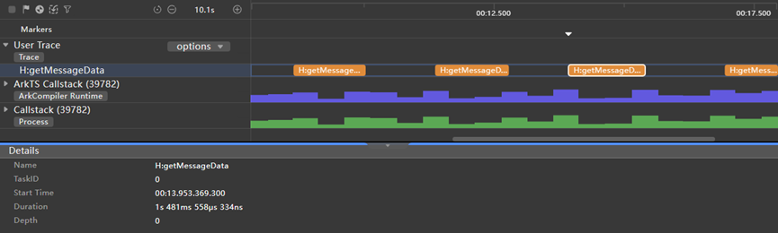


案例二：使用资源免拦截注入加载Web页面，请参考以下步骤：
1. 创建资源配置

  
```ArkTS
import { webview } from '@kit.ArkWeb';
import { hilog } from '@kit.PerformanceAnalysisKit';

const DOMAIN = 0x0000;
const TAG = 'Sample';

export interface ResourceConfig {
  urlList: Array<string>,
  type: webview.OfflineResourceType,
  responseHeaders: Array<Header>,
  localPath: string,
}


export interface ExceptionResource {
  console: string,
  urlList: Array<string> | undefined | null;
  type: webview.OfflineResourceType  | undefined | null,
  responseHeaders: Array<Header> | undefined | null,
  resource?: Uint8Array | undefined | null
  localPath?: string,
}


export const baseURL: string = 'http://localhost:8083/resource/';
export const baseURL1: string = 'http://localhost:8083/resource/';


export const basicResources: Array<ResourceConfig> = [
  {
    localPath: "in_cache_middle.png",
    urlList: [
      baseURL,
      baseURL + "request.png",
      baseURL1 + "request.png",
    ],
    type: webview.OfflineResourceType.IMAGE,
    responseHeaders: []
  },
  {
    localPath: "in_cache.js",
    urlList: [
      baseURL,
      baseURL + "request.js",
      baseURL1 + "request.js"
    ],
    type: webview.OfflineResourceType.CLASSIC_JS,
    responseHeaders: [
      {headerKey: "Content-Type", headerValue: "text/javascript" },
      {headerKey: "Cache-Control", headerValue: "max-age=100000" },
    ]
  },
  {
    localPath: "in_cache_module1.js",
    urlList: [
      baseURL + "request_module1.js",
    ],
    type: webview.OfflineResourceType.MODULE_JS,
    responseHeaders: [
      {headerKey: "Content-Type", headerValue: "application/javascript" },
      {headerKey: "Access-Control-Allow-Origin" , headerValue: "*"},
      {headerKey: "Cache-Control", headerValue: "max-age=100000" },
    ]
  },
  {
    localPath: "in_cache_module2.js",
    urlList: [
      baseURL + "request_module2.js",
    ],
    type: webview.OfflineResourceType.MODULE_JS,
    responseHeaders: [
      {headerKey: "Content-Type", headerValue: "application/javascript" },
      {headerKey: "Access-Control-Allow-Origin" , headerValue: "*"},
      {headerKey: "Cache-Control", headerValue: "max-age=100000" },
    ]
  },
  {
    localPath: "in_cache.css",
    urlList: [
      baseURL,
      baseURL + "request.css",
      baseURL1 + "request.css",
    ],
    type: webview.OfflineResourceType.CSS,
    responseHeaders: [
      {headerKey: "resource-Type", headerValue: "text/css" },
      {headerKey: "Cache-Control", headerValue: "max-age=100000" },
    ]
  },
];
```

2. 读取配置并注入资源

  
```ArkTS
// Call the offline resource injection cache interface
export async function injectOfflineResource(controller: WebviewController, resourceMapArr: Array<webview.OfflineResourceMap>): Promise<void> {
  try {
    controller.injectOfflineResources(resourceMapArr);
  } catch (err) {
    hilog.error(DOMAIN, TAG, 'qqq injectOfflineResource error: ' + err.code + ' ' + err.message);
  }
}
```
性能打点数据如下：getMessageData进程中的Duration表示加载页面的总耗时。

  


**总结**

| 页面加载方式 | 耗时（数据仅供参考） | 说明 |
| --- | --- | --- |
| 直接加载Web页面 | 1312ms | 在触发页面加载时才发起资源请求，这会延长页面加载时间。 |
| 使用离线资源免拦截注入加载Web页面 | 74ms | 将资源预置在内存中，节省网络请求时间。 |


##### 资源拦截替换加速

**原理介绍**

资源拦截替换加速在资源拦截替换接口基础上新增支持了ArrayBuffer格式的入参，开发者无需在应用侧进行ArrayBuffer到String格式的转换，可直接使用ArrayBuffer格式的数据进行拦截替换。

> [!NOTE]
> 本方案与原有接口使用相同，开发者只需在调用WebResourceResponse.setResponseData()接口时传入ArrayBuffer格式的数据。


**实践案例**

案例一：使用字符串格式的数据做拦截替换

```ArkTS
import { webview } from '@kit.ArkWeb';
import { hilog } from '@kit.PerformanceAnalysisKit';

const DOMAIN = 0x0000;
const TAG = 'Sample';

@Entry
@Component
struct Index {
  controller: webview.WebviewController = new webview.WebviewController();
  responseResource: WebResourceResponse = new WebResourceResponse();
  // Here is the string format data.
  resourceStr: string = 'xxxxxxxxxxxxxxx';

  build() {
    Column() {
      Button('1 MB')
        .fontSize(12)
        .margin(5)
        .onClick(() => {
          const chunk = 'x'.repeat(1024);
          let result = '';
          for (let i = 0; i < 1000; i++) {
            result += chunk;
          }
          this.resourceStr = JSON.stringify({
            status: 200,
            result: result,
          });
          hilog.info(DOMAIN, TAG, `Generated string data, size: ${this.resourceStr.length} bytes (${1000} KB)`);
        })
      Web({ src: $rawfile("intercept.html"), controller: this.controller })
        .onConsole((event) => {
          hilog.error(DOMAIN, TAG, `getMessageData ${event?.message?.getMessage()}`);
          return true;
        })
        .onInterceptRequest(event => {
          if (event) {
            if (!event.request.getRequestUrl().startsWith('http://bridge')) {
              return null;
            }
          }
          // Use string format data for interception and replacement
          this.responseResource.setResponseData(this.resourceStr);
          this.responseResource.setResponseEncoding('utf-8');
          this.responseResource.setResponseMimeType('text/json');
          this.responseResource.setResponseCode(200);
          this.responseResource.setReasonMessage('OK');
          this.responseResource.setResponseHeader([{ headerKey: 'Access-Control-Allow-Origin', headerValue: '*' }]);
          hilog.info(DOMAIN, TAG, 'getMessageData return reponse');
          return this.responseResource;
        })
    }
  }
}
```

资源替换耗时如图所示。getMessageData和someFunction的执行时间表示页面加载资源的耗时。


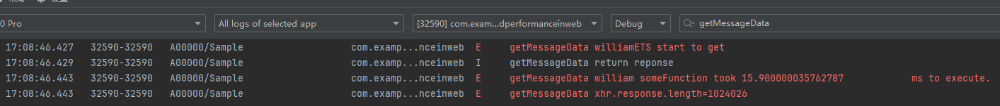


案例二：使用ArrayBuffer格式的数据做拦截替换

```ArkTS
import { webview } from '@kit.ArkWeb';
import { hilog } from '@kit.PerformanceAnalysisKit';

const DOMAIN = 0x0000;
const TAG = 'Sample';

@Entry
@Component
struct WebComponent {
  controller: webview.WebviewController = new webview.WebviewController()
  scheme1: webview.WebCustomScheme = { schemeName: "imeituan", isSupportCORS: true, isSupportFetch: true }
  responseResource: WebResourceResponse = new WebResourceResponse()
  // Developer Custom Response Data
  data: string = "";
  buffer: ArrayBuffer = new ArrayBuffer(this.data.length);
  usingLen: number = 1;

  aboutToAppear(): void {
    // Configure the Web to open the debugging mode
    webview.WebviewController.setWebDebuggingAccess(true);

    try {
      webview.WebviewController.customizeSchemes([this.scheme1])
      hilog.info(DOMAIN, TAG, `customizeSchemes`)
    } catch (error) {
      hilog.error(DOMAIN, TAG, error);
    }

    this.initArrayBufferData(1);
  }

  onPageShow(): void {

  }

  initStringData(size: Number): void {
    switch (size){
      case 1:
        this.usingLen = 10; //10k
        break;
      case 2:
        this.usingLen = 1024; //1M
        break;
      case 3:
        this.usingLen = 1024 * 10; //10M
        break;
      default:
        this.usingLen = 1;
    }

    let str: string = "";
    let str_1k: string = "";
    for (let i = 0 ; i < 1024; i++) {
      str_1k = str_1k.concat("x");
    }
    for (let j = 0; j < this.usingLen; j++) {
      str = str.concat(str_1k);
    }

    this.data = JSON.stringify({
      status: 200,
      result: str,
    });
    hilog.info(DOMAIN, TAG, 'init data length: ' + this.data.length);
  }

  // size - 1:10k, 2:1M, 3:10M
  initArrayBufferData(size:Number): void {
    this.initStringData(size);
    hilog.error(DOMAIN, TAG, 'target string: ' + this.data);
    this.buffer = new ArrayBuffer(this.data.length);
    const uint8Array: Uint8Array = new Uint8Array(this.buffer);
    for (let i = 0; i < this.data.length; i++) {
      uint8Array[i] = this.data.charCodeAt(i);
    }
  }

  build() {
    Column() {
      Button('set to 10K')
        .onClick(() => {
          this.initArrayBufferData(1);
          hilog.info(DOMAIN, TAG, 'datalen set to length '+ this.buffer.byteLength);
        })
      Button('set to 1M')
        .onClick(() => {
          this.initArrayBufferData(2);
          hilog.info(DOMAIN, TAG, 'datalen set to length '+ this.buffer.byteLength);
        })
      Button('set to 10M')
        .onClick(() => {
          this.initArrayBufferData(3);
          hilog.info(DOMAIN, TAG, 'datalen set to length '+ this.buffer.byteLength);
        })
      Web({ src: $rawfile("intercept.html"), controller: this.controller })
        .onConsole((event) => {
          hilog.error(DOMAIN, TAG, `getMessageData ${event?.message?.getMessage()}`);
          return true;
        })
        .onInterceptRequest((event) => {
          if (event) {
            hilog.error(DOMAIN, TAG, 'url:' + event.request.getRequestUrl());
            // Block Page Request
            if (!event.request.getRequestUrl().startsWith('http://bridge')) {
              return null;
            }
          }
          // Construct response data
          // const str: string = buffer.from(this.buffer).toString();
          hilog.error(DOMAIN, TAG, 'response data length: ' + this.data.length);
          this.responseResource.setResponseData(this.buffer);
          this.responseResource.setResponseEncoding('utf-8');
          this.responseResource.setResponseMimeType('text/json');
          this.responseResource.setResponseCode(200);
          this.responseResource.setReasonMessage('OK');
          this.responseResource.setResponseHeader([{ headerKey: 'Access-Control-Allow-Origin', headerValue: '*' }]);
          hilog.info(DOMAIN, TAG, 'getMessageData return reponse');
          return this.responseResource;
        })
    }
  }
}
```

资源替换耗时如图所示。getMessageData和william someFunction的执行时间表示页面加载资源的耗时。


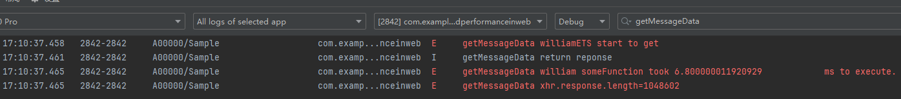


**总结**

| 页面加载方式 | 耗时(局限不同设备和场景，数据仅供参考) | 说明 |
| --- | --- | --- |
| 使用String格式的数据做拦截替换 | 15ms | Web组件内部数据传输需要转换为ArrayBuffer，这会增加数据处理步骤和启动耗时 |
| 使用ArrayBuffer格式的数据做拦截替换 | 6ms | 接口支持ArrayBuffer格式，优化了数据传输方式，减少转换和传输时间 |


##### JSBridge


##### JSBridge优化解决方案

**适用场景**

应用使用ArkTS或C++语言混合开发，或应用架构接近小程序架构，自带C++环境，推荐使用ArkWeb在Native侧提供的ArkWeb_ControllerAPI和ArkWeb_ComponentAPI实现JSBridge功能。


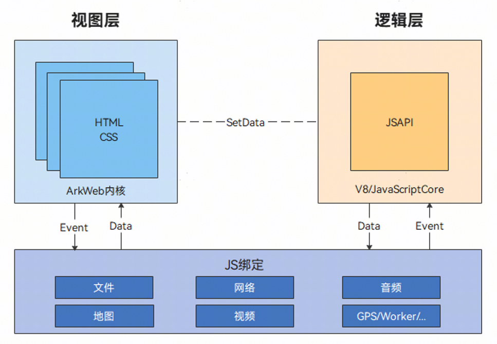


上图展示了小程序的一般架构，逻辑层使用自带的JavaScript运行时，现有C++环境通过Native接口直接与视图层（ArkWeb渲染器）通信，无需返回ArkTS环境调用JSBridge接口。


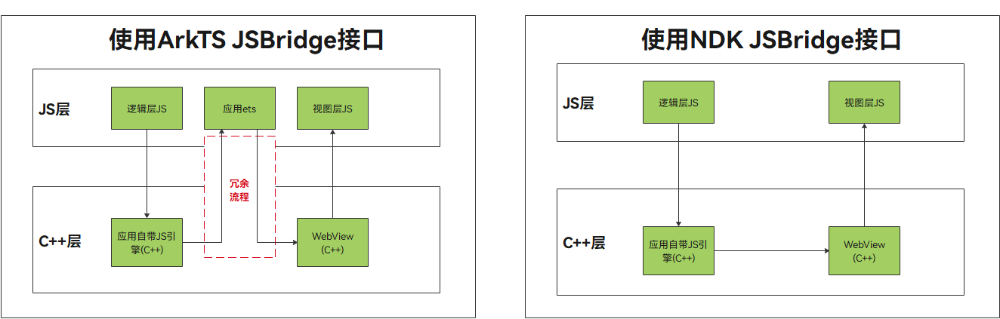


Native JSBridge方案解决ArkTS环境的冗余切换，允许回调在非UI线程上报，避免UI阻塞。

**实践案例**

案例一：使用ArkTS接口实现JSBridge通信。

应用侧代码：

```ArkTS
import { webview } from '@kit.ArkWeb';
import { hilog } from '@kit.PerformanceAnalysisKit';

const DOMAIN = 0x0000;
const TAG = 'Sample';

@Entry
@Component
struct WebComponent {
  webviewController: webview.WebviewController = new webview.WebviewController();

  aboutToAppear(): void {
    // Configure the Web to open the debugging mode
    webview.WebviewController.setWebDebuggingAccess(true);
  }

  build() {
    Column() {
      Button('runJavaScript')
        .onClick(() => {
          hilog.info(DOMAIN, TAG, '现在时间是:' + new Date().getTime());
          // When the front-end page function has no parameters, delete the param.
          this.webviewController.runJavaScript('htmlTest(param)');
        })
      Button('runJavaScriptCodePassed')
        .onClick(() => {
          // Pass runJavaScript side code method
          this.webviewController.runJavaScript(`function changeColor(){document.getElementById('text').style.color = 'red'}`);
        })
      Web({ src: $rawfile('index.html'), controller: this.webviewController })
    }
  }
}
```

前端页面代码：

```text
<!DOCTYPE html>
<html>
<body>
<button type="button" onclick="callArkTS()">Click Me!</button>
<h1 id="text">这是一个测试信息，默认字体为黑色，调用runJavaScript方法后字体为绿色，调用runJavaScriptCodePassed方法后字体为红色</h1>
<script>
    var param = "param: JavaScript Hello World!";
    function htmlTest(param) {
      document.getElementById('text').style.color = 'green';
      document.getElementById('text').innerHTML = '现在时间：'+new Date().getTime()
      console.log(param);
    }
    function htmlTest() {
      document.getElementById('text').style.color = 'green';
      document.getElementById('text').innerHTML = '现在时间：'+new Date().getTime();
    }
    function callArkTS() {
      changeColor();
    }
</script>
</body>
</html>
```

点击runJavaScript按钮后，触发h5页面的htmlTest方法，页面内容将变更为当前时间戳。如下图所示。


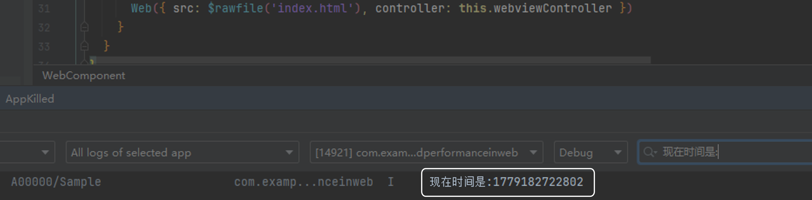


经过多轮测试，从点击ArkTS侧的Button到触发H5侧的htmlTest方法，耗时7到9毫秒。


案例二：使用NDK接口实现JSBridge通信。

应用侧代码：

```ArkTS
import testNapi from 'libentry.so';
import { webview } from '@kit.ArkWeb';
import { hilog } from '@kit.PerformanceAnalysisKit';

const DOMAIN = 0x0000;
const TAG = 'Sample';

class testObj {
  constructor() {
  }

  test(): string {
    hilog.info(DOMAIN, TAG, 'ArkUI Web Component');
    return "ArkUI Web Component";
  }

  toString(): void {
    hilog.info(DOMAIN, TAG, 'Web Component toString');
  }
}

@Entry
@Component
struct Index {
  webTag: string = 'ArkWeb1';
  controller: webview.WebviewController = new webview.WebviewController(this.webTag);
  @State testObjtest: testObj = new testObj();

  aboutToAppear(): void {
    hilog.info(DOMAIN, TAG, 'aboutToAppear');
    // init web ndk
    testNapi.nativeWebInit(this.webTag);
  }

  build() {
    Column() {
      Row() {
        Button('runJS hello')
          .fontSize(12)
          .onClick(() => {
            hilog.info(DOMAIN, TAG, 'start:---->'+new Date().getTime());
            testNapi.runJavaScript(this.webTag, "runJSRetStr(\"" + "hello" + "\")");
          })
      }.height('20%')

      Row() {
        Web({ src: $rawfile('runJS.html'), controller: this.controller })
          .javaScriptAccess(true)
          .fileAccess(true)
          .onControllerAttached(() => {
            hilog.error(DOMAIN, TAG, 'ndk onControllerAttached webId: ' + this.controller.getWebId());
          })
      }.height('80%')
    }
  }
}
```

hello.cpp作为应用C++侧业务逻辑代码：

```cpp
// Registration objects and methods, sending scripts to callbacks after H5 execution, parsing instances passed from the side of the storage application and other code logics are not displayed here, and developers realize them by themselves according to their own business scenarios.
// Send the JS script to the H5 side for execution
#include "napi/native_api.h"
#include <bits/alltypes.h>
#include <memory>
#include <string>
#include <sys/types.h>
#include <thread>

#include "hilog/log.h"
#include "web/arkweb_interface.h"
#include "jsbridge_object.h"

constexpr unsigned int LOG_PRINT_DOMAIN = 0xFF00;
std::shared_ptr<JSBridgeObject> jsbridge_object_ptr = nullptr;
static ArkWeb_ControllerAPI *controller = nullptr;
static ArkWeb_ComponentAPI *component = nullptr;

static void RunJavaScriptCallback(const char *webTag, const char *result, void *userData) {
    OH_LOG_Print(LOG_APP, LOG_INFO, LOG_PRINT_DOMAIN, "ArkWeb", "ndk RunJavaScriptCallback webTag:%{public}s", webTag);
    if (!userData) {
        OH_LOG_Print(LOG_APP, LOG_INFO, LOG_PRINT_DOMAIN, "ArkWeb", "ndk RunJavaScriptCallback userData is nullptr");
        return;
    }
    std::weak_ptr<JSBridgeObject> jsb_weak_ptr = *static_cast<std::weak_ptr<JSBridgeObject> *>(userData);
    if (auto jsb_ptr = jsb_weak_ptr.lock()) {
        jsb_ptr->RunJavaScriptCallback(result);
    } else {
        OH_LOG_Print(LOG_APP, LOG_INFO, LOG_PRINT_DOMAIN, "ArkWeb",
                     "ndk RunJavaScriptCallback jsb_weak_ptr lock failed");
    }
}

static void ProxyMethod1(const char *webTag, const ArkWeb_JavaScriptBridgeData *dataArray, size_t arraySize, void *userData) {
    OH_LOG_Print(LOG_APP, LOG_INFO, LOG_PRINT_DOMAIN, "ArkWeb", "ndk ProxyMethod1 webTag:%{public}s", webTag);
    if (!userData) {
        OH_LOG_Print(LOG_APP, LOG_INFO, LOG_PRINT_DOMAIN, "ArkWeb", "ndk ProxyMethod1 userData is nullptr");
        return;
    }
    std::weak_ptr<JSBridgeObject> jsb_weak_ptr = *static_cast<std::weak_ptr<JSBridgeObject> *>(userData);
    if (auto jsb_ptr = jsb_weak_ptr.lock()) {
        jsb_ptr->ProxyMethod1(dataArray, arraySize);
    } else {
        OH_LOG_Print(LOG_APP, LOG_INFO, LOG_PRINT_DOMAIN, "ArkWeb", "ndk ProxyMethod1 jsb_weak_ptr lock failed");
    }
}

static void ProxyMethod2(const char *webTag, const ArkWeb_JavaScriptBridgeData *dataArray, size_t arraySize, void *userData) {
    OH_LOG_Print(LOG_APP, LOG_INFO, LOG_PRINT_DOMAIN, "ArkWeb", "ndk ProxyMethod2 webTag:%{public}s", webTag);
    if (!userData) {
        OH_LOG_Print(LOG_APP, LOG_INFO, LOG_PRINT_DOMAIN, "ArkWeb", "ndk ProxyMethod2 userData is nullptr");
        return;
    }
    std::weak_ptr<JSBridgeObject> jsb_weak_ptr = *static_cast<std::weak_ptr<JSBridgeObject> *>(userData);

    std::string jsCode = "runJSRetStr()";
    ArkWeb_JavaScriptObject object = {(uint8_t *)jsCode.c_str(), jsCode.size(),
                                     &JSBridgeObject::StaticRunJavaScriptCallback,
                                     static_cast<void *>(jsbridge_object_ptr->GetWeakPtr())};
    controller->runJavaScript(webTag, &object);

    if (auto jsb_ptr = jsb_weak_ptr.lock()) {
        jsb_ptr->ProxyMethod2(dataArray, arraySize);
    } else {
        OH_LOG_Print(LOG_APP, LOG_INFO, LOG_PRINT_DOMAIN, "ArkWeb", "ndk ProxyMethod2 jsb_weak_ptr lock failed");
    }
}

void ValidCallback(const char *webTag, void *userData) {
    OH_LOG_Print(LOG_APP, LOG_INFO, LOG_PRINT_DOMAIN, "ArkWeb", "ndk ValidCallback webTag: %{public}s", webTag);
    if (!userData) {
        OH_LOG_Print(LOG_APP, LOG_INFO, LOG_PRINT_DOMAIN, "ArkWeb", "ndk ValidCallback userData is nullptr");
        return;
    }
    std::weak_ptr<JSBridgeObject> jsb_weak_ptr = *static_cast<std::weak_ptr<JSBridgeObject> *>(userData);
    if (auto jsb_ptr = jsb_weak_ptr.lock()) {
        jsb_ptr->SaySomething("ValidCallback");
    } else {
        OH_LOG_Print(LOG_APP, LOG_INFO, LOG_PRINT_DOMAIN, "ArkWeb", "ndk ValidCallback jsb_weak_ptr lock failed");
    }
    
    OH_LOG_Print(LOG_APP, LOG_INFO, LOG_PRINT_DOMAIN, "ArkWeb", "ndk RegisterJavaScriptProxy begin");
    ArkWeb_ProxyMethod method1 = {"method1", ProxyMethod1, static_cast<void *>(jsbridge_object_ptr->GetWeakPtr())};
    ArkWeb_ProxyMethod method2 = {"method2", ProxyMethod2, static_cast<void *>(jsbridge_object_ptr->GetWeakPtr())};
    ArkWeb_ProxyMethod methodList[2] = {method1, method2};
    ArkWeb_ProxyObject proxyObject = {"ndkProxy", methodList, 2};
    controller->registerJavaScriptProxy(webTag, &proxyObject);

    OH_LOG_Print(LOG_APP, LOG_INFO, LOG_PRINT_DOMAIN, "ArkWeb", "ndk RegisterJavaScriptProxy end");
}

void LoadStartCallback(const char *webTag, void *userData) {
    OH_LOG_Print(LOG_APP, LOG_INFO, LOG_PRINT_DOMAIN, "ArkWeb", "ndk LoadStartCallback webTag: %{public}s", webTag);
    if (!userData) {
        OH_LOG_Print(LOG_APP, LOG_INFO, LOG_PRINT_DOMAIN, "ArkWeb", "ndk LoadStartCallback userData is nullptr");
        return;
    }
    std::weak_ptr<JSBridgeObject> jsb_weak_ptr = *static_cast<std::weak_ptr<JSBridgeObject> *>(userData);
    if (auto jsb_ptr = jsb_weak_ptr.lock()) {
        jsb_ptr->SaySomething("LoadStartCallback");
    } else {
        OH_LOG_Print(LOG_APP, LOG_INFO, LOG_PRINT_DOMAIN, "ArkWeb", "ndk LoadStartCallback jsb_weak_ptr lock failed");
    }
}

void LoadEndCallback(const char *webTag, void *userData) {
    OH_LOG_Print(LOG_APP, LOG_INFO, LOG_PRINT_DOMAIN, "ArkWeb", "ndk LoadEndCallback webTag: %{public}s", webTag);
    if (!userData) {
        OH_LOG_Print(LOG_APP, LOG_INFO, LOG_PRINT_DOMAIN, "ArkWeb", "ndk LoadEndCallback userData is nullptr");
        return;
    }
    std::weak_ptr<JSBridgeObject> jsb_weak_ptr = *static_cast<std::weak_ptr<JSBridgeObject> *>(userData);
    if (auto jsb_ptr = jsb_weak_ptr.lock()) {
        jsb_ptr->SaySomething("LoadEndCallback");
    } else {
        OH_LOG_Print(LOG_APP, LOG_INFO, LOG_PRINT_DOMAIN, "ArkWeb", "ndk LoadEndCallback jsb_weak_ptr lock failed");
    }
}

void DestroyCallback(const char *webTag, void *userData) {
    OH_LOG_Print(LOG_APP, LOG_INFO, LOG_PRINT_DOMAIN, "ArkWeb", "ndk DestroyCallback webTag: %{public}s", webTag);
    if (!userData) {
        OH_LOG_Print(LOG_APP, LOG_INFO, LOG_PRINT_DOMAIN, "ArkWeb", "ndk DestroyCallback userData is nullptr");
        return;
    }
    std::weak_ptr<JSBridgeObject> jsb_weak_ptr = *static_cast<std::weak_ptr<JSBridgeObject> *>(userData);
    if (auto jsb_ptr = jsb_weak_ptr.lock()) {
        jsb_ptr->SaySomething("DestroyCallback");
    } else {
        OH_LOG_Print(LOG_APP, LOG_INFO, LOG_PRINT_DOMAIN, "ArkWeb", "ndk DestroyCallback jsb_weak_ptr lock failed");
    }
}

void SetComponentCallback(ArkWeb_ComponentAPI * component, const char* webTagValue) {
    if (!ARKWEB_MEMBER_MISSING(component, onControllerAttached)) {
        component->onControllerAttached(webTagValue, ValidCallback,
                                        static_cast<void *>(jsbridge_object_ptr->GetWeakPtr()));
    } else {
        OH_LOG_Print(LOG_APP, LOG_ERROR, LOG_PRINT_DOMAIN, "ArkWeb", "component onControllerAttached func not exist");
    }

    if (!ARKWEB_MEMBER_MISSING(component, onPageBegin)) {
        component->onPageBegin(webTagValue, LoadStartCallback,
                                        static_cast<void *>(jsbridge_object_ptr->GetWeakPtr()));
    } else {
        OH_LOG_Print(LOG_APP, LOG_ERROR, LOG_PRINT_DOMAIN, "ArkWeb", "component onPageBegin func not exist");
    }

    if (!ARKWEB_MEMBER_MISSING(component, onPageEnd)) {
        component->onPageEnd(webTagValue, LoadEndCallback,
                                        static_cast<void *>(jsbridge_object_ptr->GetWeakPtr()));
    } else {
        OH_LOG_Print(LOG_APP, LOG_ERROR, LOG_PRINT_DOMAIN, "ArkWeb", "component onPageEnd func not exist");
    }

    if (!ARKWEB_MEMBER_MISSING(component, onDestroy)) {
        component->onDestroy(webTagValue, DestroyCallback,
                                        static_cast<void *>(jsbridge_object_ptr->GetWeakPtr()));
    } else {
        OH_LOG_Print(LOG_APP, LOG_ERROR, LOG_PRINT_DOMAIN, "ArkWeb", "component onDestroy func not exist");
    }
}

static napi_value NativeWebInit(napi_env env, napi_callback_info info) {
    OH_LOG_Print(LOG_APP, LOG_INFO, LOG_PRINT_DOMAIN, "ArkWeb", "ndk NativeWebInit start");
    size_t argc = 1;
    napi_value args[1] = {nullptr};
    napi_get_cb_info(env, info, &argc, args, nullptr, nullptr);
    size_t webTagSize = 0;
    napi_get_value_string_utf8(env, args[0], nullptr, 0, &webTagSize);
    char *webTagValue = new (std::nothrow) char[webTagSize + 1];
    size_t webTagLength = 0;
    napi_get_value_string_utf8(env, args[0], webTagValue, webTagSize + 1, &webTagLength);
    OH_LOG_Print(LOG_APP, LOG_ERROR, LOG_PRINT_DOMAIN, "ArkWeb", "ndk NativeWebInit webTag:%{public}s", webTagValue);
    
    jsbridge_object_ptr = std::make_shared<JSBridgeObject>(webTagValue);
    if (jsbridge_object_ptr)
        jsbridge_object_ptr->Init();

    controller = reinterpret_cast<ArkWeb_ControllerAPI *>(OH_ArkWeb_GetNativeAPI(ARKWEB_NATIVE_CONTROLLER));
    component = reinterpret_cast<ArkWeb_ComponentAPI *>(OH_ArkWeb_GetNativeAPI(ARKWEB_NATIVE_COMPONENT));
    SetComponentCallback(component, webTagValue);

    OH_LOG_Print(LOG_APP, LOG_INFO, LOG_PRINT_DOMAIN, "ArkWeb", "ndk NativeWebInit end");
    delete[] webTagValue;
    return nullptr;
}

static napi_value RunJavaScript(napi_env env, napi_callback_info info) {
    size_t argc = 2;
    napi_value args[2] = {nullptr};
    napi_get_cb_info(env, info, &argc, args, nullptr, nullptr);
    
    size_t webTagSize = 0;
    napi_get_value_string_utf8(env, args[0], nullptr, 0, &webTagSize);
    char *webTagValue = new (std::nothrow) char[webTagSize + 1];
    size_t webTagLength = 0;
    napi_get_value_string_utf8(env, args[0], webTagValue, webTagSize + 1, &webTagLength);
    OH_LOG_Print(LOG_APP, LOG_INFO, LOG_PRINT_DOMAIN, "ArkWeb", "ndk OH_NativeArkWeb_RunJavaScript webTag:%{public}s",
                 webTagValue);
    
    size_t bufferSize = 0;
    napi_get_value_string_utf8(env, args[1], nullptr, 0, &bufferSize);
    char *jsCode = new (std::nothrow) char[bufferSize + 1];
    size_t byteLength = 0;
    napi_get_value_string_utf8(env, args[1], jsCode, bufferSize + 1, &byteLength);

    OH_LOG_Print(LOG_APP, LOG_INFO, LOG_PRINT_DOMAIN, "ArkWeb",
                 "ndk OH_NativeArkWeb_RunJavaScript jsCode len:%{public}zu", strlen(jsCode));
    
    ArkWeb_JavaScriptObject object = {(uint8_t *)jsCode, bufferSize, &JSBridgeObject::StaticRunJavaScriptCallback,
                                     static_cast<void *>(jsbridge_object_ptr->GetWeakPtr())};
    controller->runJavaScript(webTagValue, &object);
    delete[] webTagValue;
    delete[] jsCode;
    return nullptr;
}

EXTERN_C_START
static napi_value Init(napi_env env, napi_value exports) {
    napi_property_descriptor desc[] = {
        {"nativeWebInit", nullptr, NativeWebInit, nullptr, nullptr, nullptr, napi_default, nullptr},
        {"runJavaScript", nullptr, RunJavaScript, nullptr, nullptr, nullptr, napi_default, nullptr},
    };
    napi_define_properties(env, exports, sizeof(desc) / sizeof(desc[0]), desc);
    return exports;
}
EXTERN_C_END

static napi_module demoModule = {
    .nm_version = 1,
    .nm_flags = 0,
    .nm_filename = nullptr,
    .nm_register_func = Init,
    .nm_modname = "entry",
    .nm_priv = ((void *)0),
    .reserved = {0},
};

extern "C" __attribute__((constructor)) void RegisterEntryModule(void) { napi_module_register(&demoModule); }
```

Native侧业务代码entry/src/main/cpp/jsbridge_object.h和entry/src/main/cpp/jsbridge_object.cpp详见[应用侧与前端页面的相互调用(C/C++)](https://developer.huawei.com/consumer/cn/doc/harmonyos-guides/arkweb-ndk-jsbridge)。

runJS.html作为应用前端页面：

```json
<!DOCTYPE html>
<html lang="en-gb">
<head>
    <meta name="viewport" content="width=device-width, initial-scale=1.0">
    <title>run javascript demo</title>
</head>
<body>
<h1>run JavaScript Ext demo</h1>
<p id="webDemo"></p>
<br>
<button type="button" style="height:30px;width:200px" onclick="testNdkProxyObjMethod1()">test ndk method1 ! </button>
<br>
<br>
<button type="button" style="height:30px;width:200px" onclick="testNdkProxyObjMethod2()">test ndk method2 ! </button>
<br>
</body>
<script type="text/javascript">
    function testNdkProxyObjMethod1() {
      // Verify whether the ndk method has been registered in window
      if (window.ndkProxy == undefined) {
        document.getElementById("webDemo").innerHTML = "ndkProxy undefined";
        return "objName undefined";
      }
      if (window.ndkProxy.method1 == undefined) {
        document.getElementById("webDemo").innerHTML = "ndkProxy method1 undefined";
        return "objName  test undefined";
      }
      if (window.ndkProxy.method2 == undefined) {
        document.getElementById("webDemo").innerHTML = "ndkProxy method2 undefined";
        return "objName  test undefined";
      }
      // Call the method1 method of ndk registered to window and display the results back to the p tag.
      var retStr = window.ndkProxy.method1("hello", "world", [1.2, -3.4, 123.456], ["Saab", "Volvo", "BMW", undefined], 1.23456, 123789, true, false, 0,  undefined);
      document.getElementById("webDemo").innerHTML  = "ndkProxy and method1 is ok, " + retStr;
    }
    function testNdkProxyObjMethod2() {
      // Verify whether the ndk method has been registered in window
      if (window.ndkProxy == undefined) {
        document.getElementById("webDemo").innerHTML = "ndkProxy undefined";
        return "objName undefined";
      }
      if (window.ndkProxy.method1 == undefined) {
        document.getElementById("webDemo").innerHTML = "ndkProxy method1 undefined";
        return "objName  test undefined";
      }
      if (window.ndkProxy.method2 == undefined) {
        document.getElementById("webDemo").innerHTML = "ndkProxy method2 undefined";
        return "objName  test undefined";
      }
      var student = {
        name:"zhang",
        sex:"man",
        age:25
      };
      var cars = [student, 456, false, 4.567];
      let params = "[\"{\\\"scope\\\"]";
      // Call the method2 method of ndk registration to the windows and display the results back to the p tag
      var retStr = window.ndkProxy.method2("hello", "world", false, cars, params);
      document.getElementById("webDemo").innerHTML  = "ndkProxy and method2 is ok, " + retStr;
    }
    function runJSRetStr(data) {
      const d = new Date();
      let time = d.getTime();
      document.getElementById("webDemo").innerHTML = new Date().getTime();
      return JSON.stringify(time);
    }
</script>
</html>
```

点击“runJS hello”按钮后，触发H5页面的`runJSRetStr`方法，页面内容更新为当前时间戳。


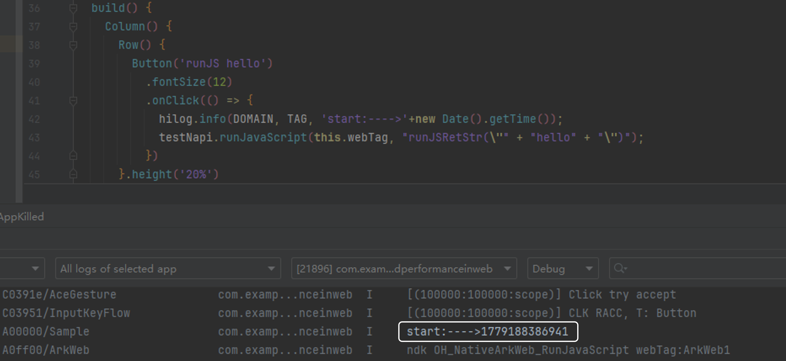


经过多轮测试，从点击ArkTS侧的Button到触发H5侧的runJSRetStr方法，耗时2到6毫秒。


**总结**

| 通信方式 | 耗时(局限不同设备和场景，数据仅供参考) | 说明 |
| --- | --- | --- |
| ArkWeb实现与前端页面通信 | 7ms~9ms | ArkTS环境冗余切换,耗时较长 |
| ArkWeb、c++实现与前端页面通信 | 2ms~6ms | 避免ArkTS环境冗余切换，耗时短 |


JSBridge优化方案适用于ArkWeb应用与前端网页通信，开发者可根据应用架构选择合适的通信机制。
1. 应用使用ArkTS语言开发，推荐使用ArkWeb的runJavaScriptExt接口实现应用侧与前端页面的通信，并使用registerJavaScriptProxy接口实现前端页面与应用侧的通信。
2. 应用使用ArkTS和C++语言混合开发，或应用结构类似于小程序架构，自带C++环境，推荐使用ArkWeb在NDK侧提供的OH_NativeArkWeb_RunJavaScript和OH_NativeArkWeb_RegisterJavaScriptProxy接口实现JSBridge功能。

> [!NOTE]
> 开发者需根据当前业务区分是否存在C++侧环境（较为显著标志点为当前应用是否使用了Node API技术进行开发，若是则该应用具备C++侧环境）。 具备C++侧环境的应用开发，可使用ArkWeb提供的NDK侧JSBridge接口。 不具备C++侧环境的应用开发，可使用ArkWeb侧JSBridge接口。


##### 异步JSBridge调用

**原理介绍**

异步JSBridge调用适用于H5侧调用ArkTS侧或C++侧注册的JSBridge函数。调用后不等待执行结果，避免在ArkUI主线程负载重时JSBridge同步调用导致Web线程等待IPC时间过长，从而造成阻塞。


**实践案例**


案例一：使用ArkTS接口实现JSBridge通信，具体步骤如下：
1. 只注册同步函数

  
```ArkTS
import { webview } from '@kit.ArkWeb';
import { BusinessError } from '@kit.BasicServicesKit';
import { hilog } from '@kit.PerformanceAnalysisKit';

const DOMAIN = 0x0000;
const TAG = 'Sample';

// Define ETS side objects and functions
class TestObj {
  constructor() {}
  test(testStr:string): string {
    let start: number = Date.now();
    // Simulate time-consuming operations
    for(let i = 0; i < 500000; i++) {}
    let end: number = Date.now();
    hilog.info(DOMAIN, TAG, 'objName.test start: ' + start);
    return 'objName.test Sync function took ' + (end - start) + 'ms';
  }
  asyncTestBool(testBol:boolean): Promise<string> {
    return new Promise((resolve, reject) => {
      let start: number = Date.now();
      // Simulate time-consuming operation (asynchronous)
      setTimeout(() => {
        for(let i = 0; i < 500000; i++) {}
        let end: number = Date.now();
        hilog.info(DOMAIN, TAG, 'objAsyncName.asyncTestBool start: ' + start);
        resolve('objName.asyncTestBool Async function took ' + (end - start) + 'ms');
      }, 0); // Use 0 ms delay to simulate an asynchronous operation that starts immediately
    });
  }
}

class WebObj {
  constructor() {}
  webTest(): string {
    let start: number = Date.now();
    // Simulate time-consuming operations
    for(let i = 0; i < 500000; i++) {}
    let end: number = Date.now();
    hilog.info(DOMAIN, TAG, 'objTestName.webTest start: ' + start);
    return 'objTestName.webTest Sync function took ' + (end - start) + 'ms';
  }
  webString(): string {
    let start: number = Date.now();
    // Simulate time-consuming operations
    for(let i = 0; i < 500000; i++) {}
    let end: number = Date.now();
    hilog.info(DOMAIN, TAG, 'objTestName.webString start: ' + start);
    return 'objTestName.webString Sync function took ' + (end - start) + 'ms';
  }
}

class AsyncObj {
  constructor() {
  }

  asyncTest(): Promise<string> {
    return new Promise((resolve, reject) => {
      let start: number = Date.now();
      // Simulate time-consuming operation (asynchronous)
      setTimeout(() => {
        for (let i = 0; i < 500000; i++) {
        }
        let end: number = Date.now();
        hilog.info(DOMAIN, TAG, 'objAsyncName.asyncTest start: ' + start);
        resolve('objAsyncName.asyncTest Async function took ' + (end - start) + 'ms');
      }, 0); // Use 0 ms delay to simulate an asynchronous operation that starts immediately
    });
  }

  asyncString(testStr:string): Promise<string> {
    return new Promise((resolve, reject) => {
      let start: number = Date.now();
      // Simulate time-consuming operation (asynchronous)
      setTimeout(() => {
        for (let i = 0; i < 500000; i++) {
        }
        let end: number = Date.now();
        hilog.info(DOMAIN, TAG, 'objAsyncName.asyncString start: ' + start);
        resolve('objAsyncName.asyncString Async function took ' + (end - start) + 'ms');
      }, 0); // Use 0 millisecond delay to simulate immediate asynchronous operation
    });
  }
}

@Entry
@Component
struct Index {
  controller: webview.WebviewController = new webview.WebviewController();
  @State testObjtest: TestObj = new TestObj();
  @State webTestObj: WebObj = new WebObj();
  @State asyncTestObj: AsyncObj = new AsyncObj();
  build() {
    Column() {
      Button('refresh')
        .onClick(()=>{
          try{
            this.controller.refresh();
          } catch (error) {
            hilog.error(DOMAIN, TAG, `ErrorCode:${(error as BusinessError).code},Message:${(error as BusinessError).message}`);
          }
        })
      Button('Register JavaScript To Window')
        .onClick(()=>{
          try {
            // Only register synchronization functions
            this.controller.registerJavaScriptProxy(this.webTestObj,"objTestName",["webTest","webString"]);
          } catch (error) {
            hilog.error(DOMAIN, TAG, `ErrorCode:${(error as BusinessError).code},Message:${(error as BusinessError).message}`);
          }
        })
      Web({src: $rawfile('index.html'),controller: this.controller}).javaScriptAccess(true)
    }
  }
}
```

2. H5侧调用JSBridge函数

  
```text
<!DOCTYPE html>
<html lang="en">
<head>
    <meta charset="UTF-8">
    <meta name="viewport" content="width=device-width, initial-scale=1.0">
    <title>Document</title>
</head>
<body>
<button type="button" onclick="htmlTest()"> Click Me!</button>
<p id="demo"></p>
<p id="webDemo"></p>
<p id="asyncDemo"></p>
</body>
<script type="text/javascript">
    async function htmlTest() {
      document.getElementById("demo").innerHTML = '测试开始:' + new Date().getTime() + '\n';
      const time1 = new Date().getTime();
      objTestName.webString();
      const time2 = new Date().getTime();
      objAsyncName.asyncString();
      const time3 = new Date().getTime();
      objName.asyncTestBool();
      const time4 = new Date().getTime();
      objName.test();
      const time5 = new Date().getTime();
      objTestName.webTest();
      const time6 = new Date().getTime();
      objAsyncName.asyncTest();
      const time7 = new Date().getTime();
      const result = [
        'objTestName.webString()耗时：'+ (time2 - time1),
        'objAsyncName.asyncString()耗时：'+ (time3 - time2),
        'objName.asyncTestBool()耗时：'+ (time4 - time3),
        'objName.test()耗时：'+ (time5 - time4),
        'objTestName.webTest()耗时：'+ (time6 - time5),
        'objAsyncName.asyncTest()耗时：'+ (time7 - time6)
      ]
      document.getElementById("demo").innerHTML = document.getElementById("demo").innerHTML + '\n' + result.join('\n');
    }
</script>
</html>
```


案例二：使用 `registerJavaScriptProxy` 或 `javaScriptProxy` 注册异步函数或异步同步共存函数。H5 侧调用 JSBridge 函数时，建议避免使用不推荐的用法。

```ArkTS
Button('refresh')
  .onClick(()=>{
    try{
      this.controller.refresh();
    } catch (error) {
      hilog.error(DOMAIN, TAG, `ErrorCode:${(error as BusinessError).code},Message:${(error as BusinessError).message}`);
    }
  })
Button('Register JavaScript To Window')
  .onClick(()=>{
    try {
      // Only register synchronization functions
      this.controller.registerJavaScriptProxy(this.webTestObj,"objTestName",["webTest","webString"]);
    } catch (error) {
      hilog.error(DOMAIN, TAG, `ErrorCode:${(error as BusinessError).code},Message:${(error as BusinessError).message}`);
    }
  })
Web({src: $rawfile('index.html'),controller: this.controller}).javaScriptAccess(true)

// Registration by javaScriptProxy
// javaScriptProxy only supports the registration of one object. If you need to register multiple objects, please use registerJavaScriptProxy.
Web({src: $rawfile('index.html'),controller: this.controller})
 .javaScriptAccess(true)
 .javaScriptProxy({
   object: this.testObjtest,
   name:"objName",
   methodList: ["test","toString"],
   // Specify the list of asynchronous functions
   asyncMethodList: ["test","toString"],
   controller: this.controller
 })
```


**总结**

数据运行结果如下表所示。

| 注册方法类型 | 耗时(局限不同设备和场景，数据仅供参考) | 说明 |
| --- | --- | --- |
| 同步方法 | 1398ms，2707ms，2705ms | 同步函数调用会阻塞JavaScript线程 |
| 异步方法 | 2ms，2ms，4ms | 异步函数调用不阻塞JavaScript线程 |


运行数据显示，`async`异步方法在JavaScript单线程任务队列中不会长时间占用，因为它们不需要等待结果。而同步方法则需要等待ArkTS侧主线程同步执行后才能返回结果。

> [!NOTE]
> JSBridge接口在注册时，即会根据注册调用的接口决定其调用方式（同步/异步）。开发者需根据当前业务区分， 是否将其注册为异步函数。 同步函数调用会阻塞JavaScript执行，等待JSBridge函数执行结束，适用于需要返回值或存在时序问题的场景。 异步函数调用时不会等待JSBridge函数执行结束，后续JavaScript可在特定时间后继续执行。JSBridge函数无法直接返回值。 注册在ETS侧的JSBridge函数调用时需要在主线程上执行；NDK侧注册的函数将在其他线程中执行。 异步JSBridge接口与同步接口在JavaScript侧的调用方式一致，仅注册方式不同，本部分调用方式仅作简要示范。


附 NDK 接口实现 JSBridge 通信（C++ 侧注册异步函数）：

```cpp
// Define the JSBridge function
static void ProxyMethod1(const char* webTag, void* userData) {
    OH_LOG_Print(LOG_APP, LOG_INFO, LOG_PRINT_DOMAIN, "ArkWeb", "Method1 webTag :%{public}s",webTag);
}

static void ProxyMethod2(const char* webTag, void* userData) {
    OH_LOG_Print(LOG_APP, LOG_INFO, LOG_PRINT_DOMAIN, "ArkWeb", "Method2 webTag :%{public}s",webTag);
}

static void ProxyMethod3(const char* webTag, void* userData) {
    OH_LOG_Print(LOG_APP, LOG_INFO, LOG_PRINT_DOMAIN, "ArkWeb", "Method3 webTag :%{public}s",webTag);
}

void RegisterCallback(const char *webTag) {
    int myUserData = 100;
    //Create function method structure
    ArkWeb_ProxyMethod m1 = {
        .methodName = "method1",
        .callback = ProxyMethod1,
        .userData = (void *)&myUserData
    };
    ArkWeb_ProxyMethod m2 = {
        .methodName = "method2",
        .callback = ProxyMethod2,
        .userData = (void *)&myUserData
    };
    ArkWeb_ProxyMethod m3 = {
        .methodName = "method3",
        .callback = ProxyMethod3,
        .userData = (void *)&myUserData
    };
    ArkWeb_ProxyMethod methodList[2] = {m1,m2};
    
    //Create a JSBridge object structure
    ArkWeb_ProxyObject obj = {
        .objName = "ndkProxy",
        .methodList = methodList,
        .size = 2
    };
    // Get the ArkWeb_Controller API structure
    ArkWeb_AnyNativeAPI* apis = OH_ArkWeb_GetNativeAPI(ArkWeb_NativeAPIVariantKind::ARKWEB_NATIVE_CONTROLLER);
    ArkWeb_ControllerAPI* ctrlApi = reinterpret_cast<ArkWeb_ControllerAPI*>(apis);

        // Call the registration interface, registration function
        ctrlApi->registerJavaScriptProxy(webTag, &obj);
    
    ArkWeb_ProxyMethod asyncMethodList[1] = {m3};
    ArkWeb_ProxyObject obj2 = {
        .objName = "ndkProxy",
    .methodList = asyncMethodList,
    .size = 1
    };
    ctrlApi->registerAsyncJavaScriptProxy(webTag, &obj2);
}
```


##### 同层渲染


同层渲染是一种优化技术，用于提高Web页面的渲染性能。同层渲染会将位于同一个图层的元素一起渲染，以减少重绘和重排的次数，从而提高页面的渲染效率。关于同层渲染的内容，可以参考[使用同层渲染在Web组件上渲染原生组件](https://developer.huawei.com/consumer/cn/doc/best-practices/bpta-render-web-using-same-layer-render)。


##### 总结

本文深入探讨Web页面加载原理及优化方法，为开发者提供重要指导。互联网时代，用户对网页加载速度和体验要求提高，页面加载优化成为开发者必须重视的环节。理解Web页面加载原理，有助于开发者处理加载优化问题，提升应用质量。

文中介绍了预连接、预下载、预渲染、预取POST、预编译等优化方法，指导开发者提高Web页面的加载速度。这些方法能够显著提升应用的流畅度和用户体验。然而，这些优化方法均依赖预处理，因此会带来一定的成本。

在实际开发中，开发者应根据具体情况进行权衡，确定合适的方案与策略。此外，提供JSBridge和资源加速优化方案，帮助提高Web加载性能。除了上述方法，开发者还可以通过压缩资源和减少HTTP请求来进一步优化页面加载速度。压缩资源可减小文件大小，减少加载时间；减少HTTP请求可降低网络延迟，加快页面加载速度，提升用户体验。

Web页面加载优化对提升用户体验、网站性能、页面浏览量和转化率至关重要。开发者应重视并持续探索优化方法，以实现商业目标。采用文章中介绍的优化方法，可以改善页面加载速度，增强用户体验，增加页面浏览量，提升应用活跃度和用户粘性。持续优化页面加载速度，能够更好地满足用户需求，提升应用价值。
