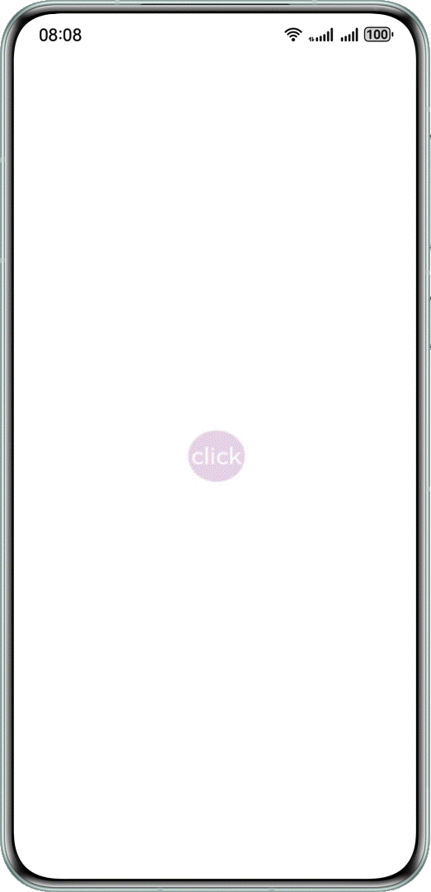
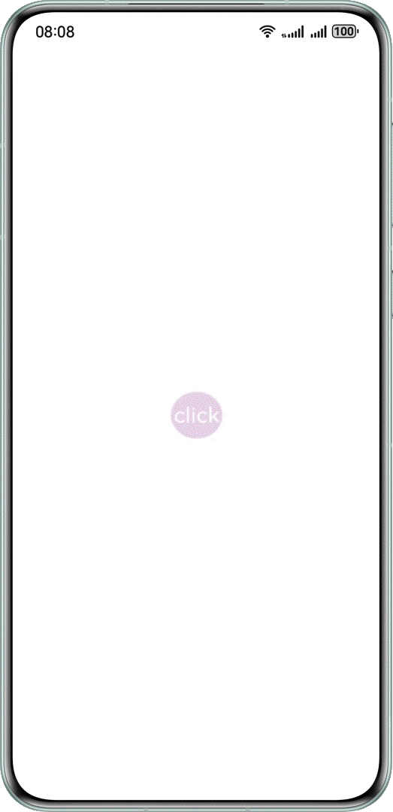
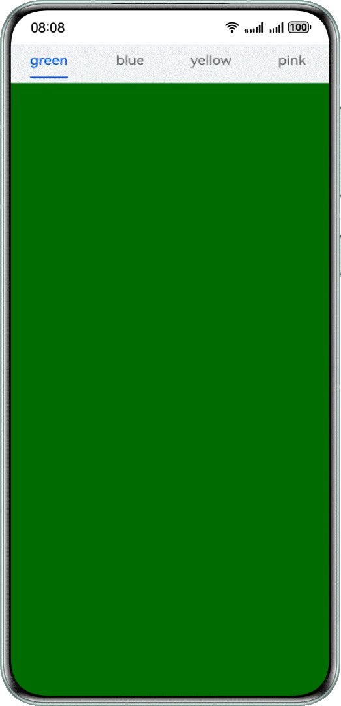
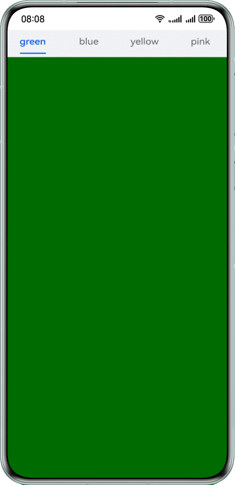

# 应用闪屏解决方案

更新时间：2026-03-12 08:45:02

来源：https://developer.huawei.com/consumer/cn/doc/best-practices/bpta-screen-flicker-solution

## 概述


在开发调试过程中，可能会遇到应用出现非预期的闪动，这种现象称为闪屏问题。闪屏问题的触发原因和表现形式各异，但都会影响应用的体验性和流畅度。

本文概述几种常见的闪屏场景，分析其成因，并提供针对性解决方案，帮助开发者有效应对这些问题。

- 动画过程闪屏
- 刷新过程闪屏


## 常见问题


### 动画过程中，应用连续点击场景下的闪屏问题


问题现象

连续点击后，图标大小会异常变化，导致闪屏。





```ts
@Entry
@Component
struct ClickError {
  @State scaleValue: number = 0.5; // Pantograph ratio
  @State animated: boolean = true; // Control zoom

  build() {
    Stack() {
      Stack() {
        Text('click')
        .fontSize(45)
        .fontColor(Color.White)
      }
      .borderRadius(50)
      .width(100)
      .height(100)
      .backgroundColor('#e6cfe6')
      .scale({ x: this.scaleValue, y: this.scaleValue })
      .onClick(() => {
        // When the animation is delivered, the count is increased by 1
        this.getUIContext().animateTo({
          curve: Curve.EaseInOut,
          duration: 350,
          onFinish: () => {
            // At the end of the animation, the count is reduced by 1
            // A count of 0 indicates the end of the last animation
            // Determine the final zoom size at the end of the animation
            const EPSILON: number = 1e-6;
            if (Math.abs(this.scaleValue - 0.5) < EPSILON) {
              this.scaleValue = 1;
            } else {
              this.scaleValue = 2;
            }
          },
        }, () => {
          this.animated = !this.animated;
          this.scaleValue = this.animated ? 0.5 : 2.5;
        })
      })
    }
    .height('100%')
    .width('100%')
  }
}
```

可能原因

在动画结束回调中修改了属性值。图标连续放大和缩小时，动画连续改变属性值，同时结束回调也直接修改属性值，导致过程中属性值异常，效果不符合预期。所有动画结束后，效果通常可恢复正常，但会出现跳变。

解决措施

- 如果在动画结束回调中设值，可以通过计数器等方法判断属性上是否还有动画。
- 仅在属性上最后一个动画结束时，结束回调中才设值，避免因动画打断导致异常。
```ts
@Entry
@Component
struct ClickRight {
  @State scaleValue: number = 0.5; // Pantograph ratio
  @State animated: boolean = true; // Control zoom
  @State cnt: number = 0; // Run counter

  build() {
    Stack() {
      Stack() {
        Text('click')
        .fontSize(45)
        .fontColor(Color.White)
      }
      .borderRadius(50)
      .width(100)
      .height(100)
      .backgroundColor('#e6cfe6')
      .scale({ x: this.scaleValue, y: this.scaleValue })
      .onClick(() => {
        // When the animation is delivered, the count is increased by 1
        this.cnt = this.cnt + 1;
        this.getUIContext().animateTo({
          curve: Curve.EaseInOut,
          duration: 350,
          onFinish: () => {
            // At the end of the animation, the count is reduced by 1
            this.cnt = this.cnt - 1;
            // A count of 0 indicates the end of the last animation
            if (this.cnt === 0) {
              // Determine the final zoom size at the end of the animation
              const EPSILON: number = 1e-6;
              if (Math.abs(this.scaleValue - 0.5) < EPSILON) {
                this.scaleValue = 1;
              } else {
                this.scaleValue = 2;
              }
            }
          },
        }, () => {
          this.animated = !this.animated;
          this.scaleValue = this.animated ? 0.5 : 2.5;
        })
      })
    }
    .height('100%')
    .width('100%')
  }
}
```


运行效果如下图。





### 动画过程中，Tabs页签切换场景下的闪屏问题


问题现象

滑动Tabs组件时，上方标签不能同步更新。下方内容完全切换后，标签闪动跳转，产生闪屏。





```ts
@Entry
@Component
struct TabsContainer {
  @State currentIndex: number = 0
  @State animationDuration: number = 300;
  @State indicatorLeftMargin: number = 0;
  @State indicatorWidth: number = 0;
  private tabsWidth: number = 0;
  private textInfos: [number, number][] = [];
  private isStartAnimateTo: boolean = false;

  @Builder
  tabBuilder(index: number, name: string) {
    Column() {
      Text(name)
      .fontSize(16)
      .fontColor(this.currentIndex === index ? $r('sys.color.brand') : $r('sys.color.ohos_id_color_text_secondary'))
      .fontWeight(this.currentIndex === index ? 500 : 400)
      .id(index.toString())
      .onAreaChange((_oldValue: Area, newValue: Area) => {
        this.textInfos[index] = [newValue.globalPosition.x as number, newValue.width as number];
        if (this.currentIndex === index && !this.isStartAnimateTo) {
          this.indicatorLeftMargin = this.textInfos[index][0];
          this.indicatorWidth = this.textInfos[index][1];
        }
      })
    }
    .width('100%')
  }

  build() {
    Stack({ alignContent: Alignment.TopStart }) {
      Tabs({ barPosition: BarPosition.Start }) {
        TabContent() {
          Column()
          .width('100%')
          .height('100%')
          .backgroundColor(Color.Green)
          .expandSafeArea([SafeAreaType.SYSTEM], [SafeAreaEdge.TOP, SafeAreaEdge.BOTTOM])
        }
        .tabBar(this.tabBuilder(0, 'green'))
        .expandSafeArea([SafeAreaType.SYSTEM], [SafeAreaEdge.TOP, SafeAreaEdge.BOTTOM])

        TabContent() {
          Column()
          .width('100%')
          .height('100%')
          .backgroundColor(Color.Blue)
          .expandSafeArea([SafeAreaType.SYSTEM], [SafeAreaEdge.TOP, SafeAreaEdge.BOTTOM])
        }
        .tabBar(this.tabBuilder(1, 'blue'))
        .expandSafeArea([SafeAreaType.SYSTEM], [SafeAreaEdge.TOP, SafeAreaEdge.BOTTOM])

        TabContent() {
          Column()
          .width('100%')
          .height('100%')
          .backgroundColor(Color.Yellow)
          .expandSafeArea([SafeAreaType.SYSTEM], [SafeAreaEdge.TOP, SafeAreaEdge.BOTTOM])
        }
        .tabBar(this.tabBuilder(2, 'yellow'))
        .expandSafeArea([SafeAreaType.SYSTEM], [SafeAreaEdge.TOP, SafeAreaEdge.BOTTOM])

        TabContent() {
          Column()
          .width('100%')
          .height('100%')
          .backgroundColor(Color.Pink)
          .expandSafeArea([SafeAreaType.SYSTEM], [SafeAreaEdge.TOP, SafeAreaEdge.BOTTOM])
        }
        .tabBar(this.tabBuilder(3, 'pink'))
        .expandSafeArea([SafeAreaType.SYSTEM], [SafeAreaEdge.TOP, SafeAreaEdge.BOTTOM])
      }
      .onAreaChange((_oldValue: Area, newValue: Area) => {
        this.tabsWidth = newValue.width as number;
      })
      .barWidth('100%')
      .barHeight(56)
      .width('100%')
      .expandSafeArea([SafeAreaType.SYSTEM], [SafeAreaEdge.TOP, SafeAreaEdge.BOTTOM])
      .backgroundColor('#F1F3F5')
      .animationDuration(this.animationDuration)
      .onChange((index: number) => {
        this.currentIndex = index; // Monitor changes in index and switch TAB contents.
      })

      Column()
      .height(2)
      .borderRadius(1)
      .width(this.indicatorWidth)
      .margin({ left: this.indicatorLeftMargin, top: 48 })
      .backgroundColor($r('sys.color.brand'))
    }
    .width('100%')
  }
}
```


可能原因

在Tabs左右翻页动画的结束回调中，刷新选中页面的索引值。这导致页面左右转场动画结束时，页签栏中索引对应的页签样式（如字体大小、下划线等）立即改变，从而产生闪屏现象。

解决措施

在左右跟手翻页过程中，通过 TabsAnimationEvent 事件获取手指滑动距离，改变下划线在前后两个子页签间的位置。离手触发翻页动画时，同步触发下划线动画，确保下划线与页面左右转场动画同步。

```ts
build() {
  Stack({ alignContent: Alignment.TopStart }) {
    Tabs({ barPosition: BarPosition.Start }) {
      TabContent() {
        Column()
        .width('100%')
        .height('100%')
        .backgroundColor(Color.Green)
        .expandSafeArea([SafeAreaType.SYSTEM], [SafeAreaEdge.TOP, SafeAreaEdge.BOTTOM])
      }
      .tabBar(this.tabBuilder(0, 'green'))
      .expandSafeArea([SafeAreaType.SYSTEM], [SafeAreaEdge.TOP, SafeAreaEdge.BOTTOM])

      TabContent() {
        Column()
        .width('100%')
        .height('100%')
        .backgroundColor(Color.Blue)
        .expandSafeArea([SafeAreaType.SYSTEM], [SafeAreaEdge.TOP, SafeAreaEdge.BOTTOM])
      }
      .tabBar(this.tabBuilder(1, 'blue'))
      .expandSafeArea([SafeAreaType.SYSTEM], [SafeAreaEdge.TOP, SafeAreaEdge.BOTTOM])

      TabContent() {
        Column()
        .width('100%')
        .height('100%')
        .backgroundColor(Color.Yellow)
        .expandSafeArea([SafeAreaType.SYSTEM], [SafeAreaEdge.TOP, SafeAreaEdge.BOTTOM])
      }
      .tabBar(this.tabBuilder(2, 'yellow'))
      .expandSafeArea([SafeAreaType.SYSTEM], [SafeAreaEdge.TOP, SafeAreaEdge.BOTTOM])

      TabContent() {
        Column()
        .width('100%')
        .height('100%')
        .backgroundColor(Color.Pink)
        .expandSafeArea([SafeAreaType.SYSTEM], [SafeAreaEdge.TOP, SafeAreaEdge.BOTTOM])
      }
      .tabBar(this.tabBuilder(3, 'pink'))
      .expandSafeArea([SafeAreaType.SYSTEM], [SafeAreaEdge.TOP, SafeAreaEdge.BOTTOM])
    }
    .onAreaChange((_oldValue: Area, newValue: Area) => {
      this.tabsWidth = newValue.width as number;
    })
    .barWidth('100%')
    .barHeight(56)
    .width('100%')
    .expandSafeArea([SafeAreaType.SYSTEM], [SafeAreaEdge.TOP, SafeAreaEdge.BOTTOM])
    .backgroundColor('#F1F3F5')
    .animationDuration(this.animationDuration)
    .onChange((index: number) => {
      this.currentIndex = index; // Monitor changes in index and switch TAB contents.
    })
    .onAnimationStart((_index: number, targetIndex: number) => {
      // The callback is triggered when the switch animation begins. The underline slides along with the page, and the width changes gradually.
      this.currentIndex = targetIndex;
      this.startAnimateTo(this.animationDuration, this.textInfos[targetIndex][0], this.textInfos[targetIndex][1]);
    })
    .onAnimationEnd((index: number, event: TabsAnimationEvent) => {
      let currentIndicatorInfo: Record<string, number> = this.getCurrentIndicatorInfo(index, event);
      this.startAnimateTo(0, currentIndicatorInfo.left, currentIndicatorInfo.width);
    })
    .onGestureSwipe((index: number, event: TabsAnimationEvent) => {
      let currentIndicatorInfo: Record<string, number> = this.getCurrentIndicatorInfo(index, event);
      this.currentIndex = currentIndicatorInfo.index;
      this.indicatorLeftMargin = currentIndicatorInfo.left;
      this.indicatorWidth = currentIndicatorInfo.width;
    })

    Column()
    .height(2)
    .borderRadius(1)
    .width(this.indicatorWidth)
    .margin({ left: this.indicatorLeftMargin, top: 48 })
    .backgroundColor($r('sys.color.brand'))
  }
  .width('100%')
}
```

TabsAnimationEvent方法如下所示。

```ts
private getCurrentIndicatorInfo(index: number, event: TabsAnimationEvent): Record<string, number> {
  let nextIndex = index;
  if (index > 0 && event.currentOffset > 0) {
    nextIndex--;
  } else if (index < 3 && event.currentOffset < 0) {
    nextIndex++;
  }

  let indexInfo: [number, number] = this.textInfos[index];
  let nextIndexInfo: [number, number] = this.textInfos[nextIndex];
  let swipeRatio: number = Math.abs(event.currentOffset / this.tabsWidth);
  let currentIndex: number = swipeRatio > 0.5 ? nextIndex :
  index; // The page slides more than halfway and the tabBar switches to the next page.
  let currentLeft: number = indexInfo[0] + (nextIndexInfo[0] - indexInfo[0]) * swipeRatio;
  let currentWidth: number = indexInfo[1] + (nextIndexInfo[1] - indexInfo[1]) * swipeRatio;
  return { 'index': currentIndex, 'left': currentLeft, 'width': currentWidth };
}

private startAnimateTo(duration: number, leftMargin: number, width: number) {
  this.isStartAnimateTo = true;
  this.getUIContext().animateTo({
    duration: duration, // duration
    curve: Curve.Linear, // curve
    iterations: 1, // iterations
    playMode: PlayMode.Normal, // playMode
    onFinish: () => {
      this.isStartAnimateTo = false;
    }
  }, () => {
    this.indicatorLeftMargin = leftMargin;
    this.indicatorWidth = width;
  });
}
```

运行效果如下图。





### 刷新过程中，ForEach键值生成函数未设置导致的闪屏问题


问题现象

下拉刷新时，应用卡顿，出现闪屏。


```ts
@Builder
private getListView() {
  List({
    space: 12,
    scroller: this.scroller
  }) {
    // Render data using lazy loading components
    ForEach(this.newsData, (item: NewsData) => {
      ListItem() {
        newsItem({
          newsTitle: item.newsTitle,
          newsContent: item.newsContent,
          newsTime: item.newsTime,
          img: item.img
        })
      }
      .backgroundColor(Color.White)
      .borderRadius(16)
    });
  }
  .width('100%')
  .height('100%')
  .padding({
    left: 16,
    right: 16
  })
  .backgroundColor('#F1F3F5')
  // You must set the list to slide to edge to have no effect, otherwise the pullToRefresh component's slide up and drop down method cannot be triggered.
  .edgeEffect(EdgeEffect.None)
}
```

可能原因

ForEach提供了一个名为keyGenerator的参数，这是一个函数，开发者可以通过它自定义键值生成规则。如果开发者没有定义keyGenerator函数，则ArkUI框架会使用默认的键值生成函数，即(item: Object, index: number) => { return index + '__' + JSON.stringify(item); }。可参考键值生成规则。

在使用ForEach的过程中，若对键值生成规则理解不足，将导致错误的使用方式。错误使用会导致功能问题，如渲染结果非预期，或性能问题，如渲染性能下降。

解决措施

在ForEach第三个参数中定义自定义键值的生成规则，即(item: NewsData, index?: number) => item.id，这样可以在渲染时降低重复组件的渲染开销，从而消除闪屏问题。可参考ForEach组件使用建议。

```ts
@Builder
private getListView() {
  List({
    space: 12,
    scroller: this.scroller
  }) {
    // Render data using lazy loading components
    ForEach(this.newsData, (item: NewsData) => {
      ListItem() {
        newsItem({
          newsTitle: item.newsTitle,
          newsContent: item.newsContent,
          newsTime: item.newsTime,
          img: item.img
        })
      }
      .backgroundColor(Color.White)
      .borderRadius(16)
    }, (item: NewsData) => item.newsId);
  }
  .width('100%')
  .height('100%')
  .padding({
    left: 16,
    right: 16
  })
  .backgroundColor('#F1F3F5')
  // You must set the list to slide to edge to have no effect, otherwise the pullToRefresh component's slide up and drop down method cannot be triggered.
  .edgeEffect(EdgeEffect.None)
}
```

运行效果如下图所示。


## 总结


当出现应用闪屏问题时，首先确定可能的原因，分别测试每个原因。找到问题后，尝试使用相应的解决方案，以消除问题现象。

- 在应用连续点击场景下，通过计数器优化动画逻辑。
- 在Tabs页签切换场景下，完善动画细粒度，提高流畅表现。
- 在ForEach刷新内容过程中，根据业务场景调整键值生成函数。


## 示例代码


- [解决应用动效闪屏的方案](https://gitcode.com/harmonyos_samples/BestPracticeSnippets/tree/master/ScreenFlickerSolution)
