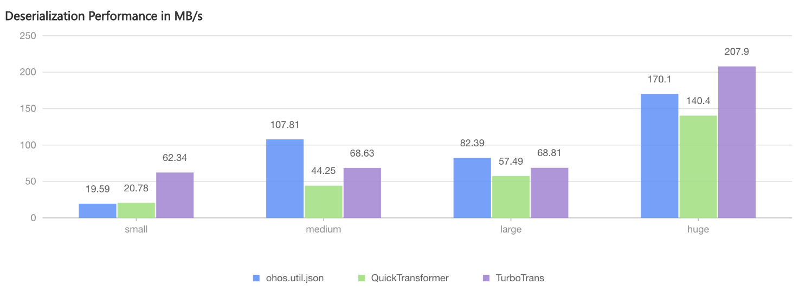

# 高性能JSON解析

更新时间：2026-03-12 08:45:02

来源：https://developer.huawei.com/consumer/cn/doc/best-practices/bpta-high-performance-json-parsing

##### 概述

在应用开发中，JSON解析是数据存储与网络传输的关键环节。然而，当前常规的JSON解析方案常面临性能瓶颈和类型安全性问题，尤其在处理复杂对象、大文件或高并发场景时表现欠佳。
 
[TurboTransJSON](https://gitcode.com/openharmony-sig/turbo_trans)是一款基于当前ArkTS能力及面向高性能场景的JSON解析解决方案，不仅解决了现有实现方案的痛点，还提供了丰富的高级特性：
 
- 类型支持：涵盖系统基本类型、常见容器类型（Array、Map、Set）、嵌套类型、泛型、多态和联合类型；
- 装饰器支持：可通过@Serializable装饰器标记需序列化的类，并利用@SerialName(覆盖属性的名称)、@Required(指定必填属性)、@Transient(忽略属性)装饰器完成属性的定制化配置；
- 系统能力兼容：支持与[Sendable](https://developer.huawei.com/consumer/cn/doc/harmonyos-guides/arkts-sendable)和[状态管理](https://developer.huawei.com/consumer/cn/doc/harmonyos-guides/arkts-state-management-overview)协同混用；
- 大JSON文件读取优化：提供JsonNode懒加载机制与JsonPointer局部访问能力，支持直接读取ArrayBuffer，提升文件解析及反序列化为JSON对象的效率。

 
本文将围绕JSON序列化和反序列化的典型场景，以TurboTransJSON框架为核心，介绍其使用要点及性能优势。
 
 

##### 反序列化为业务类型

 

##### 使用场景

在数据存储和网络传输场景中，JSON数据被广泛用于结构化交互。例如，某应用从服务端获取的API响应为JSON字符串（如{"name":"zhangsan","age":28}），业务层需将其转换为自定义类型Person（包含姓名、年龄等强类型属性）以供调用。但系统提供的[@ohos.util.json（JSON解析与生成）](https://developer.huawei.com/consumer/cn/doc/harmonyos-references/js-apis-json)工具仅能将字符串反序列化为简单对象（如Object），无法直接生成目标业务类型实例；为实现类型转换，常见做法有两种：
 1. 手动创建业务对象并遍历JSON属性赋值，但是代码冗余且易出错；
2. 引入[class-transformer](https://gitcode.com/openharmony-tpc/openharmony_tpc_samples/tree/master/class-transformer)等第三方库，通过运行时反射动态映射字段，但反射操作会显著影响性能（如解析耗时增加30%+）。
 
针对此类情况，可选择TurboTransJSON库来优化解析耗时。
 
 

##### 实现原理

TurboTransJSON采用编译器代码生成的方式，当开发者使用TurboTransJSON提供的装饰器及hvigor插件时，插件会根据开发者自定义类型及装饰器配置，生成自定义类型对应的序列化器代码。
 1. 装饰器与元数据收集
- 开发者通过装饰器声明类与属性的序列化规则（别名、必填、忽略、生成Sendable版本的类等）。

2. 插件在编译期抽取结构化元数据，进行一致性校验并生成序列化/反序列化模板。

3. 代码生成
基于模板生成对象读写代码，避免运行时反射与字符串查找。

4. 更新类引用路径
插件在编译期间重新生成相应的序列化类；同步更新源代码中自定义类的引用路径。

  

  ##### 开发步骤

1. 引入TurboTransJSONPlugin和TurboTransJSON三方库。
插件引入，在工程根目录hvigor/hvigor-config.json5文件内加入如下配置：
```json
"dependencies": {
  // ...
  "@hadss/turbo-trans-json-plugin": "latest"
},
```


2. 三方库引入，在工程目录或者模块下使用ohpm方式安装：
```json
ohpm install @hadss/turbo-trans-core @hadss/turbo-trans-json
```


3. 插件生效还需在工程根目录 hvigorfile.ts 添加相关插件配置，参考如下：
```ts
import { turboTransJsonPlugin } from '@hadss/turbo-trans-json-plugin';

export default {
  system: appTasks,
  plugins: [
    // ...
    turboTransJsonPlugin(hvigor)
  ]
}
```


4. 给自定义类添加@Serializable装饰器，标记为自定义序列化类。
```ArkTS
import { Serializable } from '@hadss/turbo-trans-core';

@Serializable()
export class Person {
  // ...
}
```


5. 在首次配置插件之后，执行下述命令，确保模块配置：
```json
hvigorw jsonSync
```
 该命令会扫描项目中使用 @Serializable 注解的模块，自动配置 build-profile.json5 文件并生成序列化器代码。

6. 获取网络数据后，可使用TJSON提供的fromBuffer()或fromString()方法进行反序列化，生成相应的业务对象。
```ArkTS
const response = await session.fetch(request);
if (response && response.body) {
  this.person = TJSON.fromBuffer<Person>(response.body, Person);
}
```


  

  ##### 跨线程数据传输

  

  ##### 使用场景

  在并发编程环境中，常需在线程间传递数据。当数据以JSON格式存储时，如何高效地进行序列化和反序列化成为一个关键问题。常见场景包括生产者-消费者模式、线程池任务提交、异步处理流程等。

  在实时消息处理场景中，跨线程数据传输的效率直接影响应用的整体性能。例如，客户端的请求处理线程需要将处理结果传递给I/O线程进行网络发送，如果序列化和反序列化过程耗时过长，将严重影响业务逻辑的执行效率，应用界面出现卡顿进而影响用户体验。

  

  ##### 实现原理

  TurboTransJSON在跨线程数据传输方面采用了以下优化策略：

  
二进制序列化支持：除JSON文本格式，TurboTransJSON还支持更紧凑的二进制格式，该格式具有更优的序列化性能和更小的存储空间占用。
- 支持Sendable对象转换：TurboTransJSON支持Sendable对象和原始对象之间的转换，通过Sendable对象类型支持多线程引用传递，以降低通信开销。

 
 

##### 开发步骤
1. 向TurboTransJSON提供的@Serializable装饰器添加generateSendable: true属性。
```ArkTS
import { Serializable } from '@hadss/turbo-trans-core';

@Serializable({ generateSendable: true })
export class PersonWithSendable {
  // ...
}
```

2. 定义子线程执行方法，在子线程内创建原始对象并使用toSendable()方法，将原始对象转换为Sendable对象，并返回给主线程。使用引用方式跨线程传输数据，避免序列化和序列化耗时以及破坏对象结构。
```ArkTS
// The buf parameter is only used to demonstrate TJSON's serialization and deserialization capabilities for ArrayBuffer type
@Concurrent
function childThreadTask(buf: ArrayBuffer): lang.ISendable | undefined {
  const scores: number[] = TJSON.fromBuffer(buf, { classKey: 'Array', genericTypes: ['number']});
  const person = new PersonWithSendable('John', 20, 'man', scores);
  return (person as object as ITSerializable).toSendable();
}
```
 在工程编译之后，PersonWithSendable引用会指向插件生成的类，该类包含toSendable()方法。
3. 通过实例化对象调用toOrigin()方法将子线程返回的Senable对象转换为开发者自定义对象。
```ArkTS
const scores = TJSON.toBuffer([10, 20, 30], { classKey: 'Array', genericTypes: ['number']});
const task: taskpool.Task = new taskpool.Task(childThreadTask, scores);
const data = await taskpool.execute(task);
this.person = TJSON.toOrigin<PersonWithSendable>(data);
```

 
 

##### 大文件解析

 

##### 使用场景

处理几十MB至几百MB的大型JSON文件是开发中的高频需求，尤其在日志分析、数据迁移和批量导入导出等场景。若采用传统方式一次性解析整个文件到内存，会直接导致内存占用飙升，可能触发OOM（Out of Memory）错误，同时解析过程耗时也会导致应用触发AppFreeze，严重影响应用稳定性。而TurboTransJSON专为这类场景优化，从根源上解决内存过载以及解析耗时问题。
 
 

##### 实现原理

TurboTransJSON库在大文件解析方面采用了以下技术：
 
- 延迟加载策略：TurboTransJSON提供了延迟加载策略，仅在需要时解析特定部分的数据。对于大型JSON文档，可以跳过不需要的节点，仅解析所需部分，显著减少内存占用。
- 解析ArrayBuffer：直接读取ArrayBuffer数据，并转换为JsonNode对象，减少字符串转换开销。
- 异步接口设计：提供异步解析接口，避免因主线程阻塞导致应用触发AppFreeze。

 
 

##### 开发步骤
1. 通过toJsonNodeFromBuffer()或toJsonNodeFromString()方法，将ArrayBuffer数据或JSON字符串转换为JsonNode对象。
```ArkTS
// this.json.buffer is read citylots.json buffer
let jsonNode = TJSON.toJsonNodeFromBuffer(buffer);
```

2. 通过JsonNode提供的JsonPointer局部访问功能，调用JsonNode的at()方法读取当前需解析的部分。
```ArkTS
// json structure {features: [{ ... }]}
const featureJsonNode = jsonNode.at('/features/0');
```
 或者使用get()获取子节点，使用此方法前需先判断jsonNode的类型，该方法仅适用于JSON_ARRAY和JSON_OBJECT类型。

  
```ArkTS
private get(methodParam: string): ResourceStr {
  if (this.jsonNode.jsonType() === JsonNodeType.JSON_OBJECT) {
    const obj = this.jsonNode.jsonObject();
    const result = obj.get(methodParam);
    // ...
  } else if (this.jsonNode.jsonType() === JsonNodeType.JSON_ARRAY) {
    const arr = this.jsonNode.jsonArray();
    const index = parseInt(methodParam);
    if (!isNaN(index)) {
      const result = arr.get(index);
      // ...
    }
    // ...
  } else {
    // ...
  }
}
```

3. 将读取的部分JsonNode转化为业务所需对象，其他部分保持未解析状态。CityLots类型定义：

  
```ArkTS
@Serializable()
export class CityLots {
  // ...
}
```
 使用TJSON.fromJsonNode()方法将JsonNode转化为业务对象：

  
```ArkTS
if (featureJsonNode.jsonType() === JsonNodeType.JSON_OBJECT) {
  const cityLots = TJSON.fromJsonNode<CityLots>(featureJsonNode, CityLots);
  // ...
}
```

4. 针对未定义业务类型的，可以使用toPlainObjectAsync()方法将JsonNode转换为简单对象。在实际业务场景中，可先利用JsonNode提供的JsonPointer局部访问能力读取所需节点，再通过toPlainObjectAsync方法转换，以减少对象创建的耗时。
```ArkTS
const obj: ESObject = await jsonNode.toPlainObjectAsync();
```

 
 

##### 性能对比

测试用例输入包括4KB、53KB、467KB、2765KB大小的四个 JSON 文件，分别对应数据集small json、medium json、large json、huge json，以测试JSON大小对序列化以及反序列化速度的影响。
 
> [!NOTE]
> 以下性能数据中，使用ohos.util.json提供的反序列化方法，仅将数据反序列化为简单对象（Object），而非自定义类；QuickTransformer是基于class-transformer库实现。

 
**序列化性能对比**
  
| 数据集 | ohos.util.json | QuickTransformer | TurboTransJSON |
| --- | --- | --- | --- |
| small json | 29.81MB/s | 6.12MB/s | 48.98MB/s |
| medium json | 77.27MB/s | 5.44MB/s | 56.16MB/s |
| large json | 52.06MB/s | 9.51MB/s | 44.36MB/s |
| huge json | 86.40MB/s | 18.90MB/s | 116.10MB/s |
 
 



 

 
**反序列化性能对比**
  
| 数据集 | ohos.util.json | QuickTransformer | TurboTransJSON |
| --- | --- | --- | --- |
| small json | 19.59MB/s | 20.78MB/s | 62.34MB/s |
| medium json | 107.81MB/s | 44.25MB/s | 68.63MB/s |
| large json | 82.39MB/s | 57.49MB/s | 68.81MB/s |
| huge json | 170.10MB/s | 140.40MB/s | 207.90MB/s |
 
 


 
通过上述比对数据发现：
 
- 对比系统提供ohos.util.json的序列化和反序列化方法，TurboTransJSON在处理small和huge数据集时性能有所提升；然而在处理medium和large数据集时，性能下降；不过ohos.util.json提供的方法仅适用于简单对象，使用上存在局限性；
- 与QuickTransformer/class-transformer三方库提供的方法相比，TurboTransJSON在序列化和反序列化场景中的处理性能均有显著提升。

 
 

##### 示例代码

[基于TurboTransJSON实现高性能JSON解析](https://gitcode.com/HarmonyOS_Samples/TurboTransJSON)
