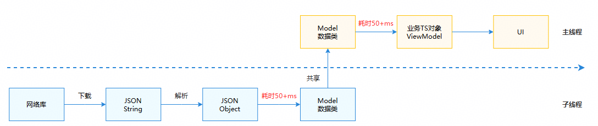
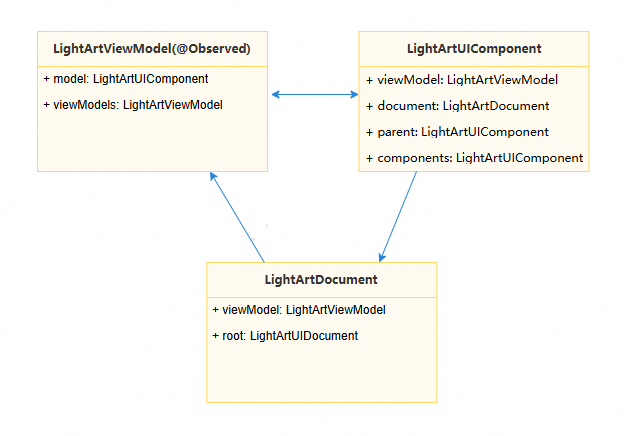
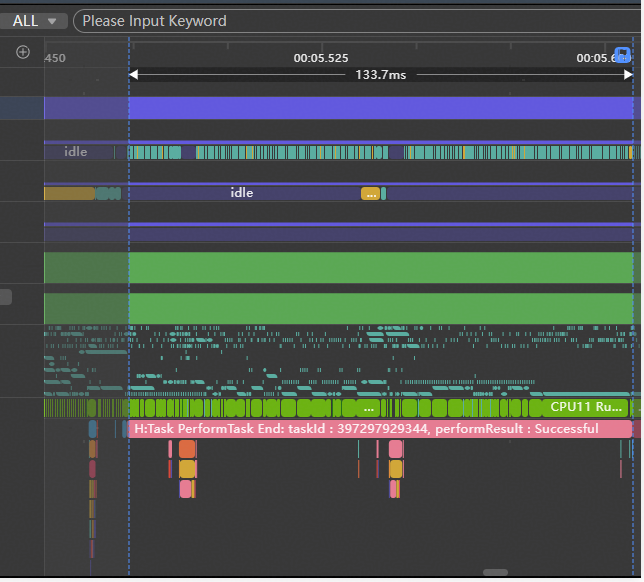
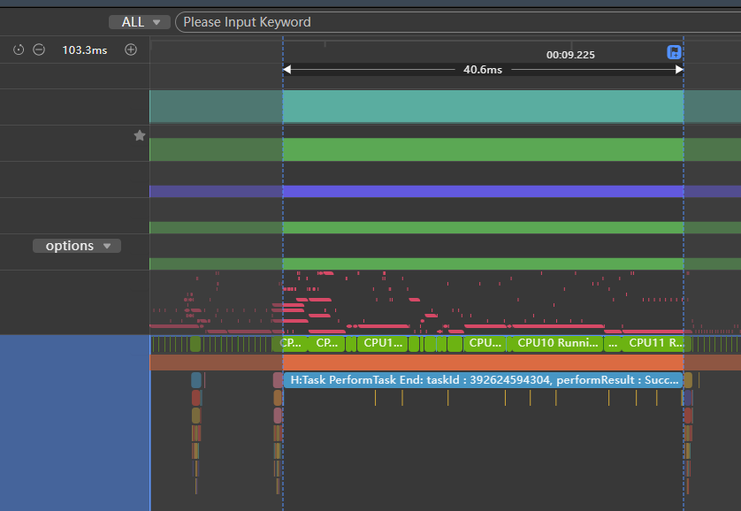
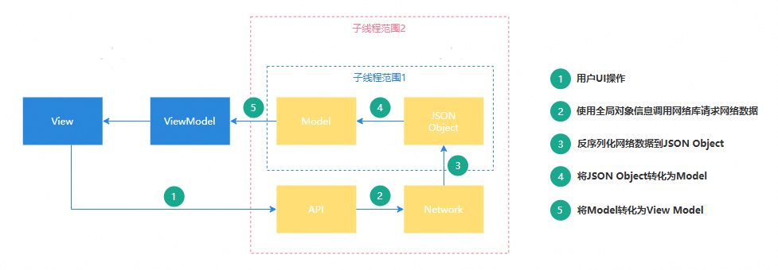

# 并行化性能优化

更新时间：2026-03-12 08:45:02

来源：https://developer.huawei.com/consumer/cn/doc/best-practices/bpta-concurrent-optimization

#### 概述

 
目前，多数应用存在性能优化的诉求，而并行化改造是一项有效的性能优化措施。并行化改造通过合理设计和重构，使原本在主线程中串行执行的任务能够并行执行，从而提升应用性能和处理效率。多个头部应用均已进行针对性的并行化改造，显著提升了性能。
 
目前并行化改造的主要实现方案有两种：一是使用[TaskPool](https://developer.huawei.com/consumer/cn/doc/harmonyos-references/js-apis-taskpool)或[Worker](https://developer.huawei.com/consumer/cn/doc/harmonyos-references/js-apis-worker)创建子线程，将耗时逻辑迁移至子线程执行；二是使用[Sendable](https://developer.huawei.com/consumer/cn/doc/harmonyos-guides/arkts-sendable)加速数据传递，避免跨线程间的数据拷贝耗时。
 
本文将通过实际场景介绍并行化改造的过程和思路，为开发者提供性能优化方法。
 
> [!TIP]
> 相关使用说明与注意事项： TaskPool注意事项 Worker简介 并发支持的可序列化数据类型 Sendable使用约束和限制 Sendable支持的数据类型

 

#### 数据解析与传递并行化

 

#### 场景描述

某应用首页的业务逻辑如下图所示：首先从网络端获取数据，解析数据，生成数据类，随后与业务对象结合以渲染页面。上述业务逻辑均在主线程执行（耗时100ms+），由于主线程阻塞时间较长，导致出现丢帧现象。
 



 
 

#### 实现原理

**逻辑迁移到子线程的改造**：上述业务逻辑中，网络库下载JSON字符串、解析及生成Model数据类这三个阶段均涉及数据操作，且无需在主线程中执行，因此可将上述业务逻辑迁移到子线程中。优化后整体流程如下图所示：
 



 
**数据进行线程间共享改造**：业务逻辑迁移到子线程后，为避免跨线程通信导致的数据拷贝消耗，可基于Sendable思想，将通信数据改造成多线程间共享对象。由于UI逻辑无法在子线程中执行，实际操作中需将数据结构解耦，分离数据与UI。将数据抽取为Sendable类，剥离UI相关部分，从而在子线程中完成数据的请求、解析和生成。
 
 

#### 开发步骤

 
如下图所示，在原实际场景中，业务逻辑存在三个主要类结构，并且相互持有。组件LightArtUIComponent可获取上下文说明document，并调用其中的方法。LightArtViewModel使用了装饰器@Observed，该UI装饰器无法在子线程中执行，导致并行化难以实现。
 
应用业务逻辑为：首先生成LightArtDocument对象。该对象作为组件树的上下文，包含树结构和方法等信息。接着，通过LightArtDocument记录的节点和方法，递归生成树，即对LightArtUIComponent填充数据，形成数据模型。最后递归生成LightArtViewModel。因此，数据结构中存在互相持有及数据与UI耦合的情况。
 



 
针对上述三大主要结构的整改，主要是将数据生成部分迁移至子线程，在子线程中完成数据下载与解析，并封装成Sendable数据，返回主线程后将数据组装到UI中进行渲染。
 
如下是相关修改的伪代码：
 
```ArkTS
// LightArt.ets
import { lang } from '@kit.ArkTS';

/*
 * The data to be shared is encapsulated into four Sendable classes: LightArtDataModel,
 * LightArtDataDocument, LightArtViewModel, and LightArtDataComponent.
 * UI data is encapsulated into the UI class.
 * The data of the Sendable class is generated in a child thread.
 */
@Sendable
class LightArtDataModel {}

@Sendable
class LightArtDataDocument {}

@Sendable
class LightArtViewModel {}

class UI {}

interface ISerializableType<T> extends lang.ISendable {}

@Sendable
class LightArtDataComponent {
  public dataModel?: LightArtDataModel;
  public document?: LightArtDataDocument;
  public parent?: LightArtDataComponent;
  public components?: LightArtDataComponent;
  // ...
  public fromJson(jsonObj: object) {
    // ...
  }

  public mergeFrom(jsonObj: object) {
    // ...
  }
}

/*
 * Assemble the Sendable class and the UI data class into LightArtUIComponent.
 * LightArtUIComponent assembles the data based on the data returned by the child thread.
 */
class LightArtUIComponent {
  public data?: LightArtDataComponent;
  public model?: LightArtViewModel;
  public parent?: LightArtUIComponent;
  public components?: LightArtUIComponent;
  // ...
  public uiData?: UI;
}

// Fill in the data to LightArtDataComponent.
@Sendable
export class LightArtDataComponentType implements ISerializableType<LightArtDataComponent> {
  public fromJson(jsonObj: object): LightArtDataComponent {
    let ans = new LightArtDataComponent();
    ans.mergeFrom(jsonObj);
    return ans;
  }  
  public static instance: LightArtDataComponentType = new LightArtDataComponentType();
}
```
 

#### 实现效果

 
优化前，数据下载至解析生成Model数据类的耗时有130ms+。
 



 
优化后，数据下载至解析生成Model数据类的操作已全部移至子线程执行，主线程耗时下降至40ms，共优化90ms+。
 



 
> [!NOTE]
> 1. Sendable对象及其成员必须均为Sendable类型。 2. 若类中包含非Sendable属性，可将该类拆分，将支持Sendable的属性组合成一个Sendable类，挂载于该类上，再进行序列化传递。

 

#### 数据网络请求并行化

 

#### 场景描述

当应用频繁使用网络库进行网络请求，并希望在全局范围内使用同一网络请求时，可对该网络请求进行并行化改造。将网络相关操作置于子线程中，能有效避免在主线程中调用耗时网络请求导致的卡顿。
 
 

#### 实现原理

首先，对于端侧应用而言，主线程的非UI操作耗时大多与网络数据驱动相关，流程如下图所示，因此并行化改造主要集中在网络数据的请求和处理上。在改造前，需对图中各步骤的时间开销进行合理评估，依据改造的投入产出比，确定改造范围。
 1. 在子线程范围1进行改造：如果Network下发的数据为JSON格式，且网络库能够将数据以ArrayBuffer形式返回，则可以在此范围内进行改造。改造时，可使用[ASON.parse](https://developer.huawei.com/consumer/cn/doc/harmonyos-references/arkts-apis-arkts-utils-ason#parse)将Network下发的字符串反序列化成可共享的JSON对象。还需对部分Model对象进行Sendable处理，使其能够在子线程中完成JSON对象到Model对象的转换。
2. 在子线程范围2进行改造：在此改造范围内，网络请求需在子线程发起，因此网络请求所需的全局对象数据必须在子线程中可访问，这部分数据需进行相应的Sendable改造。


 
其次，在改造过程中，应先尝试并行化改造，再考虑Sendable改造。仅在需要跨线程传递方法或传递较大对象时，才需进行Sendable改造。
 
最后，此处的并行化和Sendable改造均是基于ArkTS改造，因此并不适用于一些特别底层的场景，比如小程序框架。
 


 

TS/JS（ArkTS默认继承了这种行为）多线程之间默认内存隔离，在多线程之间传递信息时，非sendable的普通对象存在以下限制：
 1. 不同线程之间只能传递数据，函数无法在多线程间传递。
2. 包含Function成员变量的类型也不能在多线程间传递（将Function作为成员变量的对象在跨线程传递时会直接失败）。
3. JS的private properties也不能跨线程传递（以#开头的成员变量）。
 

 
 

#### 开发步骤

 
本案例主要描述子线程范围2中使用全局对象信息调用网络库请求网络数据的场景。以[Axios](https://ohpm.openharmony.cn/#/cn/detail/@ohos%2Faxios)(基于Promise的网络请求库，需要安装后使用)为例，进行相关并行化改造。
 1. 抽取网络库相关配置并封装为一个Sendable类。
```ArkTS
// AxiosConfig.ets
import { collections, lang } from '@kit.ArkTS';
import { AxiosResponse, InternalAxiosRequestConfig } from '@ohos/axios';

// Transforming the Request Interceptor into a Sendable interface
export interface IRequestInterceptor extends lang.ISendable {
  handle(data: InternalAxiosRequestConfig<object>): InternalAxiosRequestConfig<object> |
    Promise<InternalAxiosRequestConfig<object>>;
  handleError(error: object): object;
}

// Transforming the Response Interceptor into a Sendable interface
export interface IResponseInterceptor extends lang.ISendable {
  handle(data: AxiosResponse<object, object>): AxiosResponse<object, object> |
    Promise<AxiosResponse<object, object>>;
  handleError(error: object): object;
}

// Transforming the Auth into a Sendable interface
export interface IAuth extends lang.ISendable {
  username: string;
  password: string;
}

// Transforming the HttpProxy into a Sendable interface
export interface IHttpProxy extends lang.ISendable {
  protocol: string;
  host: string;
  port: number;
  auth: IAuth;
  exclusionList: collections.Array<string>;
}

// Encapsulate Axios configuration, which needs to be initialized on the main thread
@Sendable
export class AxiosGlobalConfig {
  private constructor() {
    this.requestInterceptors = new collections.Array<IRequestInterceptor>();
    this.responseInterceptors = new collections.Array<IResponseInterceptor>();
    this.headers = new collections.Map<string, string>();
  }

  public baseURL?: string;
  public headers: collections.Map<string, string>;
  public timeout?: number;
  public proxy?: IHttpProxy;
  public xsrfCookieName?: string;
  public xsrfHeaderName?: string;
  public maxContentLength?: number;
  public maxBodyLength?: number;
  // ...

  public requestInterceptors: collections.Array<IRequestInterceptor>;
  public responseInterceptors: collections.Array<IResponseInterceptor>;
  public static instance: AxiosGlobalConfig = new AxiosGlobalConfig();
}
```

1. 结合配置类生成Axios对象。
```ArkTS
// AxiosAdapter.ets
import axios, { Axios, AxiosInstance, AxiosProxyConfig, AxiosResponse, InternalAxiosRequestConfig } from '@ohos/axios';
import { AxiosGlobalConfig } from './AxiosConfig';

// Initialize axios object according to configuration and return the object.
export function getAxios(): Axios {
  let instance: AxiosInstance = axios.create();
  if (AxiosGlobalConfig.instance.baseURL) {
    instance.defaults.url = AxiosGlobalConfig.instance.baseURL;
  }
  for (let entry of AxiosGlobalConfig.instance.headers.entries()) {
    instance.defaults.headers[entry[0]] = entry[1];
  }
  if (AxiosGlobalConfig.instance.timeout) {
    instance.defaults.timeout = AxiosGlobalConfig.instance.timeout;
  }
  if (AxiosGlobalConfig.instance.proxy) {
    let config: AxiosProxyConfig = {
      host: AxiosGlobalConfig.instance.proxy.host,
      port: AxiosGlobalConfig.instance.proxy.port,
      exclusionList: []
    };
    instance.defaults.proxy = config;
  }
  for (let interceptor of AxiosGlobalConfig.instance.requestInterceptors.values()) {
    axios.interceptors.request.use((config: InternalAxiosRequestConfig<object>): InternalAxiosRequestConfig<object> |
      Promise<InternalAxiosRequestConfig<object>> => interceptor.handle(config),
      (error: object) => interceptor.handleError(error));
  }
  for (let interceptor of AxiosGlobalConfig.instance.responseInterceptors.values()) {
    axios.interceptors.response.use((response: AxiosResponse<object, object>): AxiosResponse<object, object> |
      Promise<AxiosResponse<object, object>> => interceptor.handle(response),
      (error: object) => interceptor.handleError(error));
  }
  return axios;
}
```

1. 对相关类进行Sendable改造。
```ArkTS
// Interceptor.ets
import { AxiosResponse, InternalAxiosRequestConfig } from '@ohos/axios';
import { IRequestInterceptor, IResponseInterceptor } from './AxiosConfig';

// Request interceptor encapsulated as sendable
@Sendable
export class RequestInterceptor implements IRequestInterceptor {
  handle(data: InternalAxiosRequestConfig<object>): InternalAxiosRequestConfig<object> |
    Promise<InternalAxiosRequestConfig<object>> {
    return data;
  }
  handleError(error: object): object {
    return error;
  }
}

// Response interceptor encapsulated as sendable
@Sendable
export class ResponseInterceptor implements IResponseInterceptor {
  handle(data: AxiosResponse<object, object>): AxiosResponse<object, object> |
    Promise<AxiosResponse<object, object>> {
    return data;
  }
  handleError(error: object): object {
    return error;
  }
}
```

1. 在子线程中执行相关逻辑。结合TaskPool，使Axios在主线程初始化，并在子线程中执行相关逻辑。

  
```ArkTS
// Sample7.ets
import { taskpool } from '@kit.ArkTS';
import { AxiosError, AxiosResponse } from '@ohos/axios';
import { getAxios } from './AxiosAdapter';
import { AxiosGlobalConfig, IRequestInterceptor, IResponseInterceptor } from './AxiosConfig';
import { RequestInterceptor, ResponseInterceptor } from './Interceptor';

function initAxios(url: string): void {
  // init axios config
  AxiosGlobalConfig.instance.baseURL = url;
  let requestInterceptors: IRequestInterceptor = new RequestInterceptor();
  let responseInterceptors: IResponseInterceptor = new ResponseInterceptor();
  AxiosGlobalConfig.instance.requestInterceptors.push(requestInterceptors);
  AxiosGlobalConfig.instance.responseInterceptors.push(responseInterceptors);
  AxiosGlobalConfig.instance.timeout = 1000;
}

@Concurrent
function testAxios(config: AxiosGlobalConfig) {
  // taskpool function
  AxiosGlobalConfig.instance = config;
  let adapter = getAxios();
  adapter.get(AxiosGlobalConfig.instance.baseURL).then((res: AxiosResponse) => {
    console.log('testAxios: ' + JSON.stringify(res.data));
  }).catch((error: AxiosError) => {
    console.error('error: ' + error.message);
  });
}

function demo() {
  let url = ''; // internet url
  initAxios(url);
  for (let i = 0; i < 5; i++) {
    // TaskPool thread use Axios
    let task: taskpool.Task = new taskpool.Task(testAxios, AxiosGlobalConfig.instance);
    taskpool.execute(task);
  }
}

@Entry
@Component
struct Sample7 {
  @State message: string = 'Hello World';

  build() {
    Row() {
      Column({ space: 12 }) {
        Button('test')
          .height(40)
          .width('100%')
          .onClick(() => {
            demo();
          })
      }
      .height('100%')
      .width('100%')
      .padding(16)
      .justifyContent(FlexAlign.Center)
    }
    .height('100%')
  }
}
```
