# 应用冷启动时延优化

更新时间：2026-03-26 08:46:30

来源：https://developer.huawei.com/consumer/cn/doc/best-practices/bpta-application-cold-start-optimization

## 概述


应用启动时延是影响用户体验的关键要素，是指从用户点击桌面应用图标、通知或其他入口启动应用，到应用界面内容成功加载并显示在屏幕上的时间间隔。如果这段时间超过3秒，将显著影响用户体验。

应用启动可以分为冷启动和热启动。当应用启动时，后台没有该应用的进程，系统会重新创建应用的进程，这种启动方式就叫做冷启动。而热启动是当应用程序已经在后台运行，用户再次打开应用程序时，应用程序仍然在内存中，可以直接从内存中加载并继续之前的状态，而不需要重新初始化和加载资源。

当应用冷启动时延大于1100ms时，可以认为是应用启动缓慢，体验标准可以参考应用流畅体验设计。

本文将介绍以下内容，帮助开发者提升应用的冷启动速度，避免启动过程中的延迟。

- [应用冷启动流程](#section196451814101216)
- [应用冷启动时延检测](#section860412154015)
- [应用冷启动时延问题分析](#section167931444111612)
- [识别启动缓慢问题](#section8516174361218)
- [提升应用冷启动速度](#section1770316268136)


## 应用冷启动流程


优化应用冷启动体验前，了解应用冷启动的流程和重要生命周期。应用冷启动分为5个阶段：应用进程创建&初始化、Application&Ability初始化、Ability/AbilityStage生命周期、加载绘制首页、网络数据二次刷新。

图1 应用冷启动流程

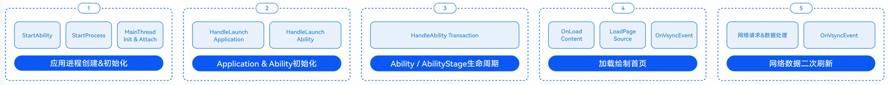


1. 应用进程创建和初始化阶段：此阶段系统完成应用进程的创建和初始化，包括启动页图标（startWindowIcon）的解码。
2. Application和Ability初始化：该阶段包括资源加载、虚拟机创建、Application&Ability 对象的创建与初始化、依赖模块加载等。
3. Ability/AbilityStage 生命周期：此阶段主要涉及 AbilityStage/Ability 的启动，执行相应的生命周期回调。
4. 加载首页内容，测量布局，刷新组件并绘制。
5. 网络数据二次刷新：此阶段应用根据业务需求对网络数据进行请求、处理和刷新。


若要提升应用冷启动速度，需缩短上述阶段的耗时。


## 应用冷启动时延检测


在应用开发中，网络请求时机、图片下载、页面资源加载、依赖模块的加载等，都会导致应用冷启动时延受到影响，合理处理代码逻辑可以提升应用冷启动速度。开发者可以通过AppAnalyzer对应用冷启动进行检测，针对诊断出的应用冷启动不达标问题进行分析和优化。


应用冷启动时延检测步骤如下：

1. 选择entry模块，暂时关闭模块build-profile中的混淆开关。
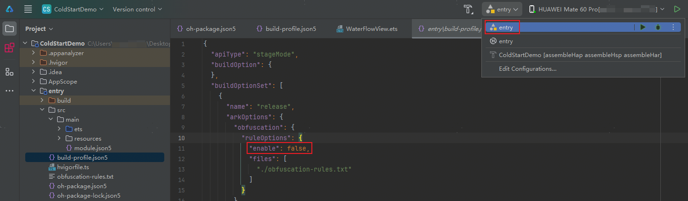
2. 检查一下build模式，改为release。
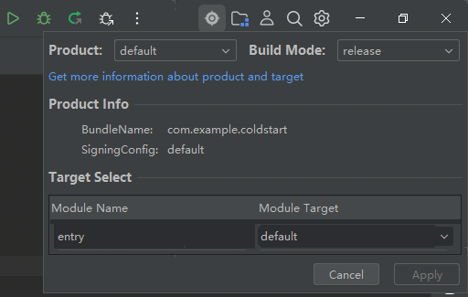
3. 点击菜单 -> tool -> AppAnalyzer，打开体检工具。
4. 选择“场景化体检”，点击“手动性能冷启动体检”。 工具开始准备，会自动编译、安装、运行当前工程，此时需要“保持手机解锁状态”，当准备完成后，会提示点击开始按钮，开始体检。
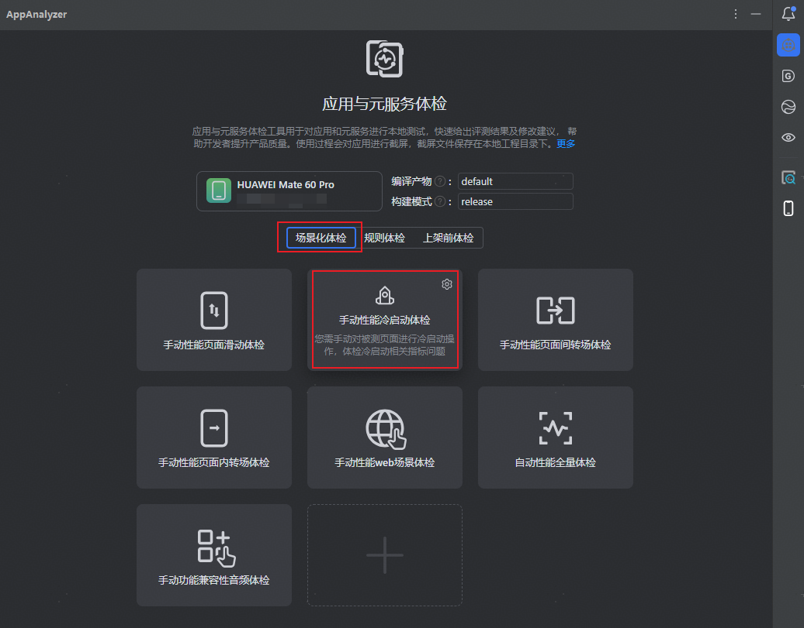
5. 根据提示在设备上进行手动操作： 首先，在最近任务列表关闭应用。
6. 进入手机设置 ，在顶部搜索栏中输入应用名并，点击进入应用设置界面，如果该应用还有进程存活，在应用设置界面可以点击强行停止按钮。
7. 在桌面点击应用图标重新启动应用。
8. 点击“结束”按钮停止体检任务，体检工具会将刚才的操作数据进行解析。


> [!NOTE]
> 冷启动体检需要强行停止应用：
>              进入手机设置。       在顶部搜索栏中输入应用名并点击进入应用设置界面。       在应用设置界面点击强行停止。       在桌面启动待检测的应用。


## 应用冷启动时延问题分析


AppAnalyzer详情报告中会显示动态检测可能导致冷启动完成时延不达标的故障原因，并提供相应的优化建议，此处列举以下冷启动时延不达标问题原因进行说明：


### 高耗时非UI操作


高耗时函数可能会造成应用卡顿，对于执行次数较多的函数，应尽量减少调用次数，单次执行但总耗时较高的函数，可以考虑通过异步方式进行优化。

在检测结果中，开发者可以通过点击报告表格中的对应方法名，快速跳转至对应代码片段，同时体检工具也会给出相应的优化建议，如将耗时函数放到子线程或进行缓存、使用多线程能力等，详细流程及示例可参考文档：主线程耗时操作优化--其他主线程优化思路。


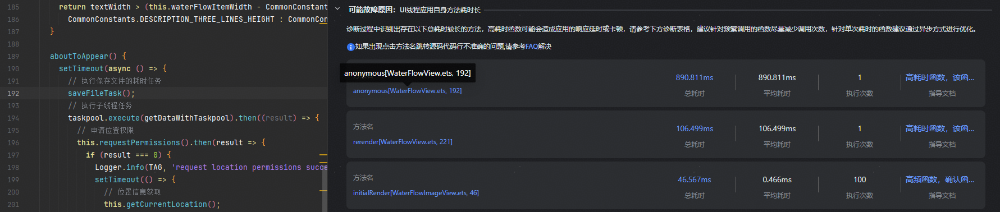


### import加载耗时


体检工具可以检测出应用冷启动过程中累计加载的文件数量、未使用的文件数量和加载总耗时，开发者可参考以下优化思路和流程，对此类冷启动问题进行优化。

import加载耗时问题优化思路


1. 分析模块使用情况：查看总结信息和未使用文件import列表信息，包括加载文件总耗时，和未使用文件数量和总耗时，了解未使用文件import情况。
2. 查找依赖关系优化导入：点击第一个“下载”按钮下载全量依赖关系文件，使用调用链搜索框查找未使用文件依赖关系，结合代码逻辑对未使用文件进行延迟加载。
3. 标记优化状态：点击第二个“下载”按钮下载全量import清单文件，统计已优化和未优化的未使用文件，分析全量文件的依赖关系。
4. 再次进行冷启动检测：优化耗时最多的几个文件之后，再次进行冷启动检测，验证整改收益。在逐步优化未使用文件导入的过程中，收益会逐步降低，开发者需根据实际情况是否需要继续“lazy import”的整改。


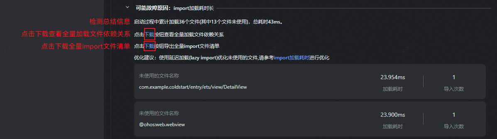


import加载耗时问题优化流程


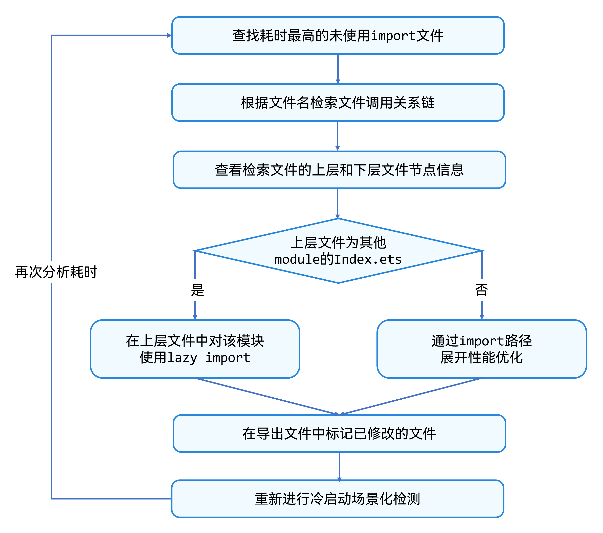


1. 查找耗时最高的未使用import文件。 在本地浏览器中打开下载的依赖关系的文件full_dependency.html，视图中左侧列表表示已加载未使用的文件，并且按照耗时从高到低排序；右侧表示已使用文件，开发者需要关注未使用文件中耗时较多的几个文件导入，例如DetailView文件的导入。
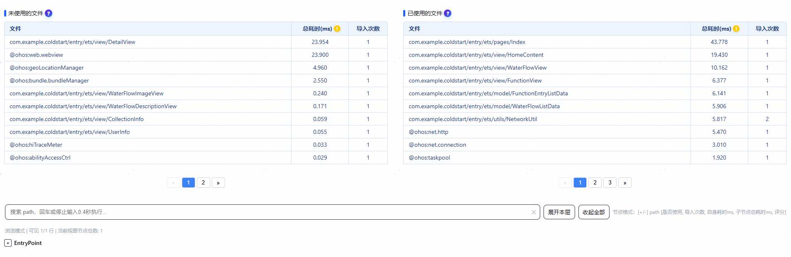
2. 根据文件名检索文件调用关系链。 在搜索框中通过文件名DetailView进行检索，该文件的依赖关系则会在下方节点视图中展示，并且默认会展示其子节点的使用情况，未使用的文件会被标红显示。
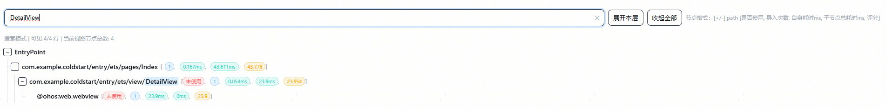
3. 查看检索文件的上层和下层文件节点信息。 查找上层文件节点信息，即目标文件被导入的位置；查找下层文件节点信息，目标文件的耗时是否由其子节点导致，如果下层文件耗时较长，则需要考虑优化子节点的导入。
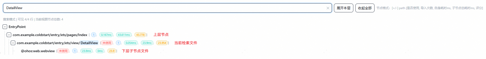
4. 判断上层文件是否为为其他module的Index.ets文件导出。
- 如果上层文件不为其他module的统一对外暴露接口文件（例如Index.ets），则可以在上层文件中使用对该模块使用lazy import进行优化。
```ts
import lazy { DetailView } from '../view/DetailView';

@Entry
@Component
struct Index {
  build() {
    // ...
  }
}
```
- 如果上层文件为其他module的统一对外暴露接口文件（例如Index.ets），则需要通过import路径展开性能优化。 例如CustomLayout1上层模块为library模块的Index.ets，其中有多个文件导出。
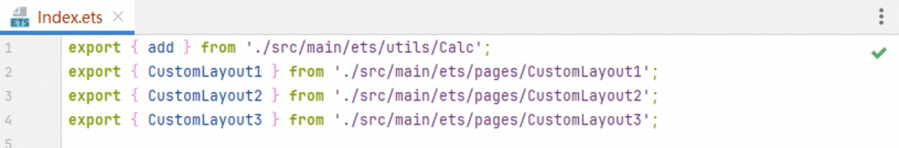
在Entry的首页通过依赖对应模块引入，会导致冷启动阶段将CustomLayout2和CustomLayout3等冷启动阶段无用的文件导入。
```ts
// entry/src/main/ets/pages/Index.ets
import { CustomLayout1 } from 'library';
```
具体优化方案，则是通过在import时，对路径展开进而优化性能。
```ts
// entry/src/main/ets/pages/Index.ets
import { CustomLayout1 } from 'library/src/main/ets/pages/CustomLayout1';
```
5. 在导出文件中标记已修改的文件。 在下载全量import文件清单表格中，标记已优化的未使用文件，便于优化备忘，特别是当需要优化的文件比较多的时候。
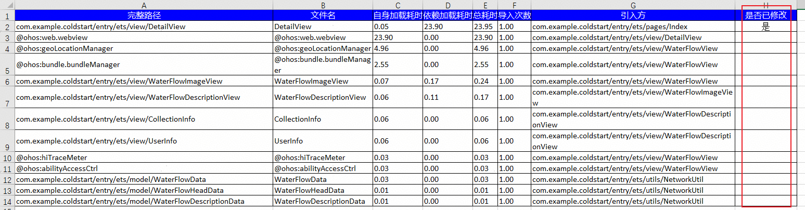
6. 重新进行冷启动场景化检测。 当优化完成后，重新进行冷启动场景化检测，查看优化收益是否达到预期，如未达到预期，则需要重新进行分析优化。


### 网络请求耗时


应用首页内容需要通过网络请求获取数据并显示时，网络请求耗时和网络请求发起的时机，对应用冷启动时长会产生一定影响。使用AppAnalyzer能够检测出应用中请求URL的请求耗时和点击离手到请求发起间隔。

- 网络请求本身耗时长
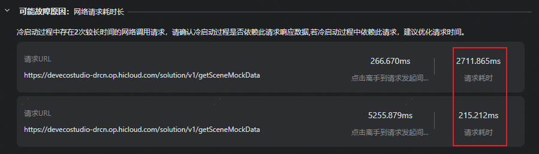
网络请求本身是否耗时可通过检测结果中的请求耗时时长来进行判断，时间越长，则网络请求本身耗时越久。详细分析请参考：[网络诊断：Network分析](https://developer.huawei.com/consumer/cn/doc/harmonyos-guides/ide-profiler-network)。 网络请求本身耗时长，可对该URL请求进行预连接和预解析来优化网络传输速度，提前完成DNS查询和TCP/TLS握手，即在应用启动或空闲时提前建立并维护一个持久的连接池；还可以使用CDN来优化网络传输速度，即将静态资源部署到CDN上。
- 网络请求发起太晚
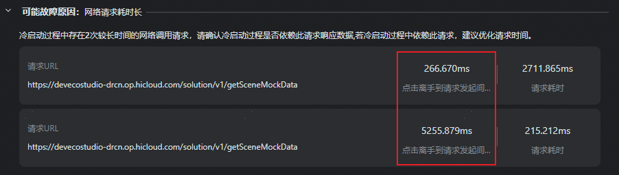
点击离手到请求发起间隔则表示用户进行点击操作后，到真正向服务器发起网络请求的那一刻止，这中间所经过的时间。可通过检测结果中的点击离手到请求发起间隔时长来进行判断，时间越长，则表示网络请求发起的越晚。可通过提前发起网络请求，来进行优化。可参考：[网络请求提前发送](#section199911250658)。


如果开发者既无法优化网络请求本身耗时，也无法将网络请求提前发起，可以考虑提前将网络请求数据缓存，下次冷启动时候直接加载缓存数据，再通过发送网络请求二刷刷新数据。


### 首页组件复杂度高导致构建耗时


首页组件复杂度较高会影响首页加载绘制耗时，AppAnalyzer工具能检测出页面中组件自身创建是否耗时过长。


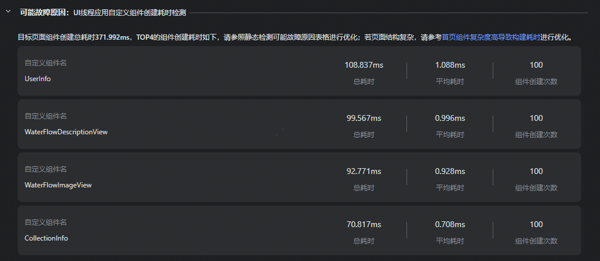


在静态检测可能故障原因表格中，可点击源文件定位到创建耗时的UI组件，根据提供的可能故障原因，去对UI组件进行相应优化修改，即可减少该UI组件自身创建耗时。

开发者可采用以下方式，控制UI的渲染范围，防止页面卡顿或掉帧：

- **合理控制元素显示与隐藏** 在应用开发中，控制页面元素的显示与隐藏是一种常见的场景，通过Visibility.None、if条件判断等都能够实现该效果。visibility属性可以控制元素在布局阶段是否参与布局渲染，if条件判断控制的是组件的创建、布局阶段。
- **懒加载** 懒加载LazyForEach是一种延迟加载的技术，通常应用于长列表优化、瀑布流优化等数据量较大、子组件可重复使用的场景，当用户滚动页面到相应位置时，才会触发资源的加载，以减少组件的加载时间，提高应用性能，提升用户体验。


### 异步线程阻塞主线程


当主线程长时间等待子线程或异步函数返回，会造成主线程长时间被阻塞，可能导致时延不达标的情况。体检工具会对主线程长时间被阻塞进行检测，可以根据检测结果中主线程空闲时间判断主线程是否长时间被阻塞，空闲时间越长，则阻塞时间越久，详细请参考：主线程长时间被阻塞。


## 识别启动缓慢问题


开发者需要分析启动过程的耗时瓶颈，优化应用或服务的冷启动速度时，可使用Profiler的Launch场景分析功能，录制启动过程中的关键数据，识别启动缓慢的原因。Profiler Launch可拆解应用冷启动过程，抓取各阶段的耗时数据，帮助开发者快速分析冷启动过程的耗时瓶颈。Launch的具体使用方法参见冷启动分析：Launch分析。

已录制一段Launch任务，具体操作步骤请参考性能问题定位：深度录制。


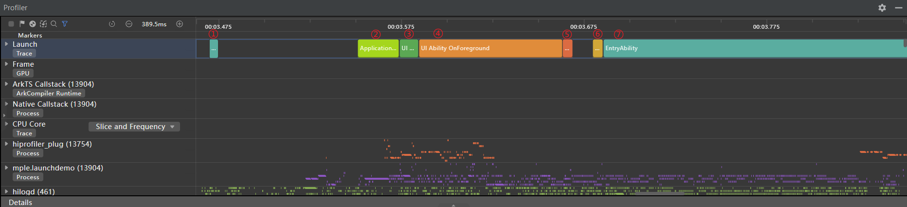


上图显示，Launch将应用的冷启动过程分为以下几个阶段：

1. Create Process：应用进程创建阶段，对应的trace打点为AppMgrServiceInner::StartProcess。
2. Application Launching：应用启动阶段，对应的trace打点为AppMgrServiceInner::AttachApplication##{bundleName}。
3. UIAbility Launching：UIAbility启动阶段，对应的trace打点为MainThread::HandleLaunchAbility##{bundleName}。
4. UI Ability OnForeground：应用进入前台阶段，对应的 trace 打点为 AbilityThread::HandleAbilityTransaction。
5. First Frame - App Phase：App首帧渲染提交阶段，对应的trace打点为H:ReceiveVsync，H:MarshRSTransactionData。
6. First Frame - Render Phase：RS首帧渲染提交阶段，对应的trace打点为H:ReceiveVsync和H:RSMainThread::ProcessCommandUni。
7. EntryAbility：应用启动之后的阶段，渲染完成，首页显示。


> [!NOTE]
> 阶段1对应图1中的第1阶段，阶段2对应图1中的第2阶段，阶段3和4对应图1中的第3阶段，阶段5和6对应图1中的第4阶段，阶段7对应图1中的第5阶段。


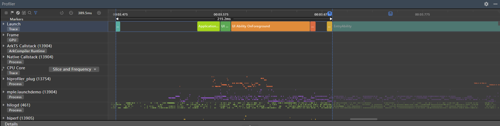


冷启动缓慢示例分析

运行以下示例代码，开发者可以明显感知到应用启动速度较慢。接下来，开发者可以通过此示例，结合 Launch 分析应用冷启动缓慢的问题。

```ts
const LARGE_NUMBER: number = 200000000;

@Entry
@Component
struct Index {
  @State message: string = 'Hello World';

  aboutToAppear(): void {
    console.log('aboutToAppear');
    this.computeTask();
  }

  computeTask(): void {
    let count: number = 0;
    while (count < LARGE_NUMBER) {
      count++;
    }
  }

  build() {
    Row() {
      Column() {
        Text(this.message)
        .fontSize(50)
        .fontWeight(FontWeight.Bold)
      }
      .width('100%')
    }
    .height('100%')
  }
}
```

首先创建Launch分析录制，可以观察到整个启动时间较长。UI Ability OnForeground阶段在应用冷启动过程中耗时最多，达到了3.3秒。因此，需要重点分析该阶段的耗时。


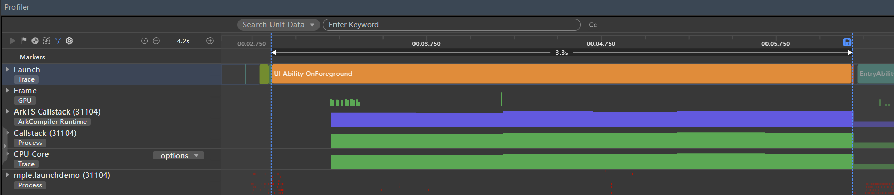


针对应用冷启动问题的性能分析，可以选择分析主线程的Trace数据或采样得到的函数热点。

分析主线程的Trace数据


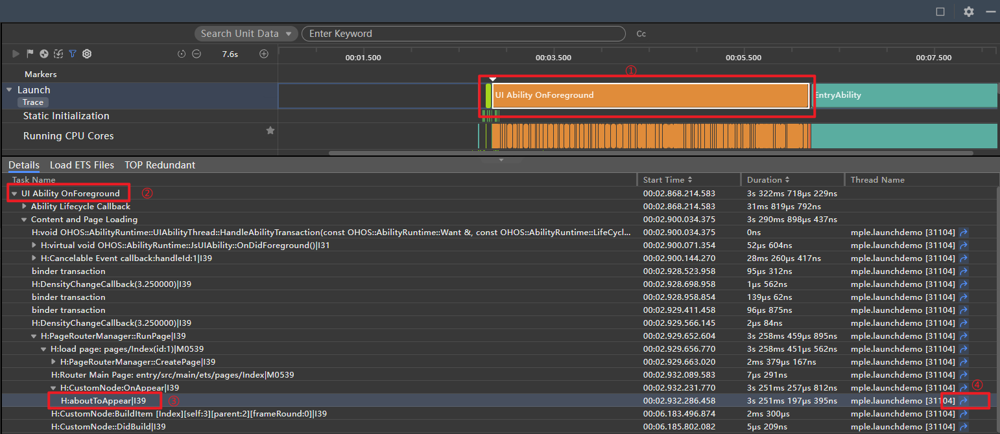


1. 单击“Launch”泳道上的UI Ability OnForeground阶段，在下方“Details”面板中可查看所选阶段的耗时统计。
2. 展开UI Ability OnForeground统计信息折叠表，可查看各函数的具体耗时信息。
3. 根据Duration找到耗时最长的函数aboutToAppear。
4. 单击图标按钮，可直接跳转至主线程的打点任务，查看相关Trace数据。


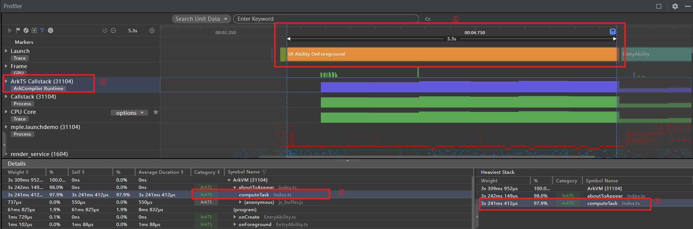


在UI Ability OnForeground阶段的耗时主要由aboutToAppear引起。通过分析aboutToAppear中的代码逻辑，可以确定计算任务computeTask是导致耗时的原因。

分析采样得到的函数热点

开发者也可以分析采样得到的函数热点直观的显示应用冷启动过程中具体函数的耗时，如下图：


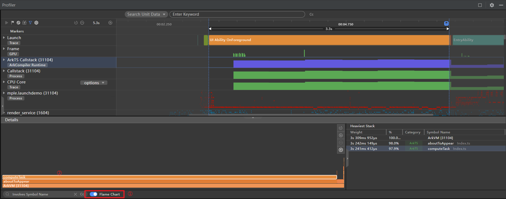


1. 单击“Launch”泳道的UI Ability OnForeground阶段。
2. 选择“ArkTS Callstack”泳道，它会基于时间轴展示CPU使用率和状态变化，以及当前调用栈名称和类型。
3. 在“Details”详情面板中，可以查看这段时间内的函数热点，以Top-Down形式的树状列表展示。computeTask函数在aboutToAppear函数中耗时最多，占整个阶段的97.9%。双击该函数可跳转到源码。
4. 此外，点击底部Flame Chart按钮打开火焰图可以更直观的看出热点函数的耗时情况，如下图所示。


冷启动速度优化

通过前面的分析，冷启动缓慢的原因是在aboutToAppear方法中执行了耗时计算任务。可以将computeTask以异步延时的方式处理，优化后的代码如下：

```ts
const LARGE_NUMBER: number = 100000000;
const DELAYED_TIME: number = 1000;

@Entry
@Component
struct Index {
  @State message: string = 'Hello World';

  aboutToAppear(): void {
    console.log('aboutToAppear');
    this.computeTaskAsync();
  }

  // ...

  computeTask(): void {
    let count: number = 0;
    while (count < LARGE_NUMBER) {
      count++;
    }
  }

  // Asynchronous processing of operation tasks
  private computeTaskAsync(): void {
    setTimeout(() => { // SetTimeout is used here to realize asynchronous delayed operation.
      this.computeTask();
    }, DELAYED_TIME);
  }
}
```

重新编译并运行程序，录制Launch过程。优化后，UI Ability OnForeground阶段的耗时显著缩短，如下图所示：


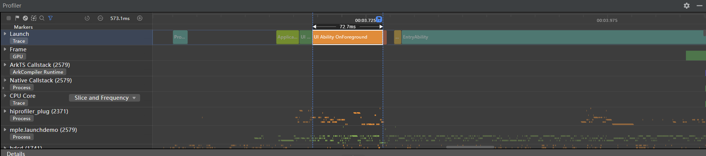


查看首帧卡顿

为了识别首帧是否卡顿，可以先查看Launch的Frame泳道。应用的首帧渲染提交在First Frame - App Phase阶段，APP侧的这一帧表示应用渲染的首帧。如下图所示，此处首帧为36号帧。


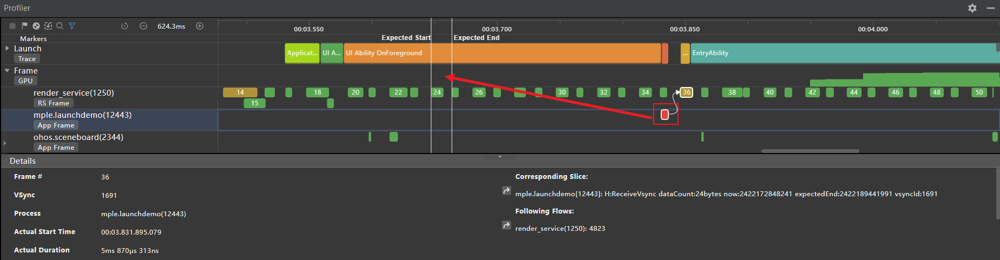


如上所示36号帧被标记为了红色，表示首帧出现了卡顿。鼠标左键36号帧，可以看到它的期望提交渲染时间为左边白色竖线区域所示，这里出现了比较严重的延时。发现问题后，开发者可以参考前面讲到的示例进行问题定位和优化。


## 提升应用冷启动速度


本文将通过公共类优化的方法，包括非冷启动必需的服务或模块延迟加载、减少主线程非UI耗时操作和网络请求提前发送，以及结合应用启动的几个阶段分别介绍提升应用冷启动速度的相关方法。


### 非冷启动必需的服务或模块延迟加载


应用在启动前加载过多不必要启动项，同时这些启动项在主线程串行执行，该阶段耗时为450ms。


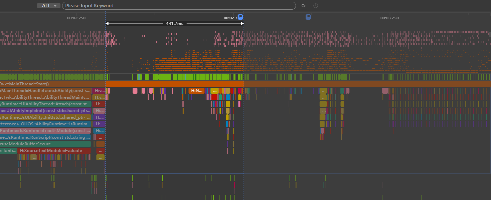


应用冷启动过程中，加载不必要的启动项会增加冷启动时间。建议延后加载或并行处理，具体可以参考延迟加载Lazy-Import使用指导。


### 减少主线程非UI耗时操作


在应用启动流程中，主要聚焦在执行UI相关操作中，为了更快的显示首页内容，不建议在主线程中执行非UI相关的耗时操作，建议通过异步任务进行异步处理或放到其他子线程中执行，线程并发方案详细请参见TaskPool和Worker的对比实践。

在冷启动过程中如果存在图片下载、网络请求前置数据、数据反序列化等非UI操作，开发者可以根据实际情况移至子线程中进行，详细请参见应用并发设计。


### 网络请求提前发送


当前大多数应用的首页内容需从网络获取，发送网络请求的时机显得尤为重要。应用发送网络请求后等待网络数据的返回，网络请求的这段时间应用可以继续执行启动流程，直到网络数据返回后进行解析，反序列化之后就可以加载首页数据，因此网络请求的发起时机越早，整个冷启动的完成时延阶段越短。

将网络请求及初始化流程放置在AbilityStage/UIAbility的onCreate()生命周期中。仅执行网络相关预处理。等待网络请求发送后继续执行首页数据准备和UI操作。在服务端处理相同的情况下，应用可以更早获取网络数据并行展示。

图2 应用首页框架加载时进行网络数据请求


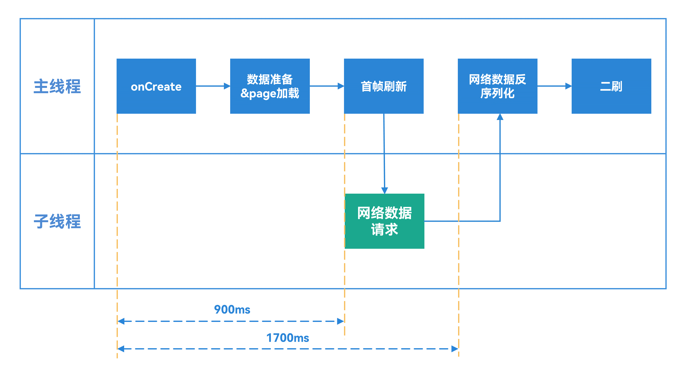


将网络请求提前至AbilityStage/UIAbility的onCreate()生命周期回调函数中。这可以将首刷或二刷时间提前，减少用户等待时间。为了体现性能收益，将网络请求放到了更早的AbilityStage的onCreate()生命周期回调中。

图3 网络请求提前至AbilityStage的onCreate()生命周期回调中


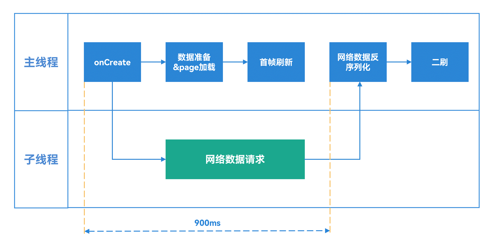


【优化前】：在首页根组件的onAppear()回调中发起网络请求。

```ts
// entry/src/main/ets/pages/Index.ets
import { httpRequest } from '../utils/NetRequest';

import { number } from '../utils/Calculator';

AppStorage.link('netData');
PersistentStorage.persistProp('netData', undefined);

@Entry
@Component
struct Index {
  // In order to reflect the performance benefits, refer to the execution result number of the time-consuming function.
  @State message: string = 'Hello World' + number;
  @StorageLink('netData') netData: PixelMap | undefined = undefined;

  build() {
    Column() {
      Text(this.message)
      .fontSize(32)
      Image(this.netData)
      .objectFit(ImageFit.Contain)
      .width('50%')
      .height('50%')
    }
    .width('100%')
    .height('100%')
    .justifyContent(FlexAlign.Center)
    .onAppear(() => {
      // Send a network request
      httpRequest();
    })
  }
}
```

```ts
// NetRequest.ets
import { hiTraceMeter } from '@kit.PerformanceAnalysisKit';
import { http } from '@kit.NetworkKit';
import { BusinessError } from '@kit.BasicServicesKit';
import { image } from '@kit.ImageKit';
// Download picture resources from the Internet through the http request method
export function httpRequest(): void {
  hiTraceMeter.startTrace('Http Request', 1);
  http
    .createHttp()
    // The actual development needs to "https://www.example1.com/POST?e=f&g=h"replaced with the real website address to visit
    .request(
      'https://www.example1.com/POST?e=f&g=h',
      (error: BusinessError, data: http.HttpResponse) => {
        if (error) {
          // The follow-up logic is not executed when the download fails.
          return;
        }
        // Processing the data returned by network requests
        transcodePixelMap(data);
      },
    );
}

// Use createPixelMap to replace pictures of ArrayBuffer types with PixelMap types.
function transcodePixelMap(data: http.HttpResponse): void {
  if (http.ResponseCode.OK === data.responseCode) {
    const imageData: ArrayBuffer = data.result as ArrayBuffer;
    // Create a picture source instance through ArrayBuffer
    const imageSource: image.ImageSource = image.createImageSource(imageData);
    const options: image.InitializationOptions = {
      alphaType: 0, // Transparency
      editable: false, // Is it editable?
      pixelFormat: 3, // Pixel format
      scaleMode: 1, // Abbreviation
      size: { height: 100, width: 100 },
    }; // Create the size of the picture
    // Create PixelMap through properties
    imageSource.createPixelMap(options).then((pixelMap: PixelMap) => {
      AppStorage.set('netData', pixelMap);
      hiTraceMeter.finishTrace('Http Request', 1);
    });
  }
}
```


```ts
// Calculator.ets
const LARGE_NUMBER: number = 100000000;

function computeTask(): number {
  let count: number = 0;
  while (count < LARGE_NUMBER) {
    count++;
  }
  return count;
}

export let number = computeTask();
```

【优化后】

1. 在NetRequest.ets中进行网络请求以及数据处理。
```ts
// NetRequest.ets
import { hiTraceMeter } from '@kit.PerformanceAnalysisKit';
import { http } from '@kit.NetworkKit';
import { BusinessError } from '@kit.BasicServicesKit';
import { image } from '@kit.ImageKit';
// Download picture resources from the Internet through the http request method
export function httpRequest(): void {
  hiTraceMeter.startTrace('Http Request', 1);
  http
    .createHttp()
    // The actual development needs to "https://www.example1.com/POST?e=f&g=h"replaced with the real website address to visit
    .request(
      'https://www.example1.com/POST?e=f&g=h',
      (error: BusinessError, data: http.HttpResponse) => {
        if (error) {
          // The follow-up logic is not executed when the download fails.
          return;
        }
        // Processing the data returned by network requests
        transcodePixelMap(data);
      },
    );
}

// Use createPixelMap to replace pictures of ArrayBuffer types with PixelMap types.
function transcodePixelMap(data: http.HttpResponse): void {
  if (http.ResponseCode.OK === data.responseCode) {
    const imageData: ArrayBuffer = data.result as ArrayBuffer;
    // Create a picture source instance through ArrayBuffer
    const imageSource: image.ImageSource = image.createImageSource(imageData);
    const options: image.InitializationOptions = {
      alphaType: 0, // Transparency
      editable: false, // Is it editable?
      pixelFormat: 3, // Pixel format
      scaleMode: 1, // Abbreviation
      size: { height: 100, width: 100 },
    }; // Create the size of the picture
    // Create PixelMap through properties
    imageSource.createPixelMap(options).then((pixelMap: PixelMap) => {
      AppStorage.set('netData', pixelMap);
      hiTraceMeter.finishTrace('Http Request', 1);
    });
  }
}
```
2. 在AbilityStage的onCreate()生命周期回调中发起网络请求。
```ts
// MyAbilityStage.ets
import { AbilityStage, Want } from '@kit.AbilityKit';
import { httpRequest } from '../utils/NetRequest';
export default class MyAbilityStage extends AbilityStage {
  onCreate(): void {
    // Send a network request
    httpRequest();
  }

  onAcceptWant(want: Want): string {
    // Triggered in specified mode only.
    return 'MyAbilityStage';
  }
}
```
3. 在首页 Index.ets 中展示请求获取的图片。
```ts
// Index.ets
import { number } from '../utils/Calculator';

AppStorage.link('netData');
PersistentStorage.persistProp('netData', undefined);

@Entry
@Component
struct Index {
  @State message: string = 'Hello World' + number; // In order to reflect the performance benefits, refer to the execution result number of the time-consuming function.
  @StorageLink('netData') netData: PixelMap | undefined = undefined;
  build() {
    Row() {
      Image(this.netData)
      .objectFit(ImageFit.Contain)
      .width('50%')
      .height('50%')
    }
    .onDisAppear(() => {
      AppStorage.set('netData', undefined);
    })
    .height('100%')
    .width('100%')
  }
}
```


使用Launch分析工具，对比优化前后启动性能。分析阶段从启动Ability（即H:void OHOS::AppExecFwk::MainThread::HandleLaunchAbility的开始点）到应用接收到网络数据返回后的首帧刷新（即H:ReceiveVsync dataCount:24Bytes now:timestamp expectedEnd:timestamp vsyncId:int的开始点）。

图4 优化网络请求时机前

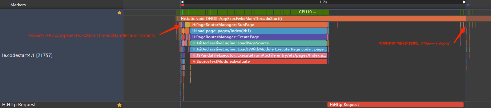


图5 优化网络请求时机后

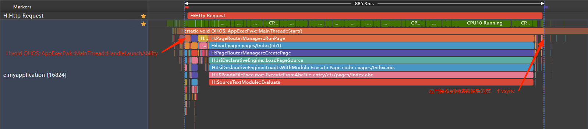


对比数据如下：


| 方案 | 阶段时长(毫秒) |
| --- | --- |
| 优化网络请求时机前 | 1700 |
| 优化网络请求时机后 | 885.3 |


因此，可以通过提前网络请求的方式减少应用冷启动耗时。


### 缩短应用进程创建和初始化阶段耗时


应用进程创建和初始化阶段包括系统完成应用进程的创建及初始化，以及启动页图标（startWindowIcon）的解码。建议使用不超过256×256分辨率的图标，以减少图片解码时延，提升体验。


> [!NOTE]
> 建议开发者优先使用[Code Linter扫描工具](https://developer.huawei.com/consumer/cn/doc/harmonyos-guides/ide-code-linter)进行代码检查，重点关注[@performance/start-window-icon-check](https://developer.huawei.com/consumer/cn/doc/harmonyos-guides/ide-start-window-icon-check)规则。若扫描结果中出现该规则相关问题，可参考本章节提供的优化建议进行调整。


设置合适分辨率的startWindowIcon

如果启动页图标分辨率过大，解码耗时会影响应用的启动速度。建议启动页图标分辨率不超过256像素×256像素，如下所示。

```json
{
  // ...
  "abilities": [
  {
    "name": "EntryAbility",
    "srcEntry": "./ets/entryability/EntryAbility.ets",
    "description": "$string:EntryAbility_desc",
    "icon": "$media:layered_image",
    "label": "$string:EntryAbility_label",
    "startWindowIcon": "$media:startIcon",
    "startWindowBackground": "$color:start_window_background",
    // ...
  }
  ]
}
}
```

下面使用Launch分析对比优化前的startWindowIcon（4096像素\*4096像素）及优化后的startWindowIcon（144像素\*144像素）的启动性能。分析阶段的起点为Process Creating，阶段终点为First Frame - Render Phase，优化前后的启动耗时如下图：

图6 优化前使用4096px-4096px启动页图标应用启动耗时


图7 优化后使用144px-144px启动页图标应用启动耗时


优化后，应用启动时长缩短了37.2ms，设置合适的startWindowIcon分辨率能有效减少应用进程创建和初始化阶段的耗时。


### 缩短Application和Ability初始化阶段耗时


Application和Ability初始化包括资源加载、虚拟机创建、相关对象的创建与初始化及依赖模块的加载。

主要耗时点在资源加载阶段，分为以下几个步骤。

1. 文件加载：查找并解析所有的文件到模块中记录。
2. 依赖模块解析（实例化）：分配内存空间来存放模块所有导出的变量，此时内存中并没有分配变量的值。
3. 文件执行：运行.ets文件，将内存中之前未分配值的变量赋为真实的值。


本章节将详细说明这三个阶段的具体优化方法。

减少import的模块

应用程序在执行代码前，必须找到并加载所有导入的模块。每个加载的第三方框架或模块都会增加启动时间，具体耗时取决于模块的数量和大小。建议开发者优先使用系统提供的模块，并按需加载，以缩短应用程序的启动时间。

```ts
// Optimize modules that reduce import
/*import { ConfigurationConstant, contextConstant, wantConstant } from '@kit.AbilityKit';
import { GesturePath, GesturePoint } from '@kit.AccessibilityKit';
import { distributedAccount, osAccount } from '@kit.BasicServicesKit';
import { Configuration } from '@kit.ArkUI';
import { atomicService } from '@kit.ScenarioFusionKit';
import { sim } from '@kit.TelephonyKit';*/

import { UIAbility } from '@kit.AbilityKit';

export default class EntryAbility extends UIAbility {
  // ...
}
```

下面使用Launch分析，对优化import的模块前（模块数量15个）及优化import的模块后（移除不必要的模块剩余5个）的启动性能进行对比分析。分析的trace点为H:SourceTextModule::Evaluate，优化前后的启动耗时如下图：

图8 优化前import 15个模块

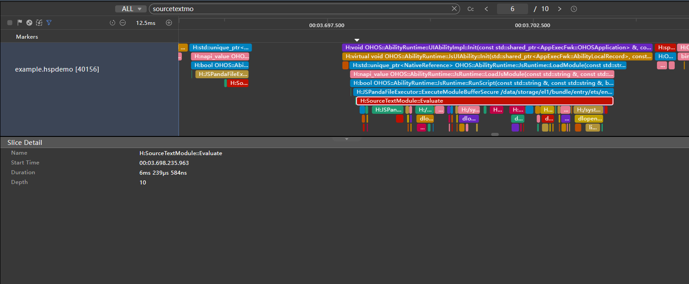


图9 优化后import 5个模块

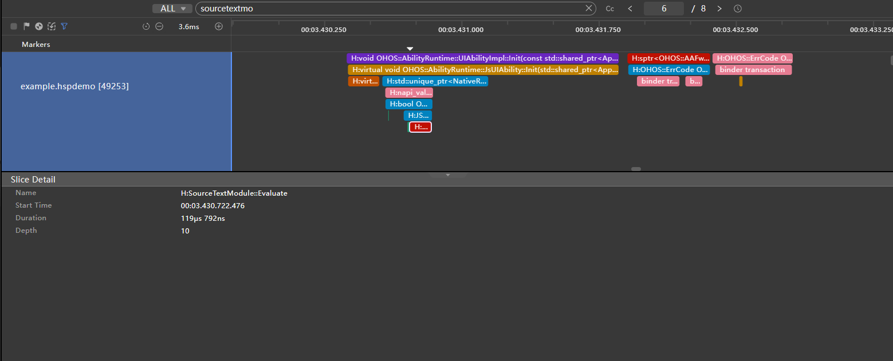


对比数据如下：


| 方案 | 阶段时长(微秒) |
| --- | --- |
| 减少import的模块前 | 6239.5 |
| 减少import的模块后 | 119.7 |


减少不必要的模块导入可以缩短应用的冷启动时间。如果某些必要模块的导入较为耗时，建议采用动态导入方式。具体方法可参考动态加载。

减少使用嵌套的export *和import *方式。

- 减少使用嵌套的export *方式进行全量导出 在应用冷启动过程中，`HandleLaunchAbility` 会执行冷启动相关的 `.ets` 文件。所有被主页面import的 `.ets` 文件均会被执行，包括数据结构、变量和全局函数的初始化。首页所需的变量和函数可能来自其他 `.ets` 文件，并通过export形式提供给首页使用。详细信息请参见[减少同文件大量export *导出方式](https://developer.huawei.com/consumer/cn/doc/best-practices/bpta-arkts-high-performance#section1218510102815)。 使用Launch分析，对比优化前（嵌套8层export *）和优化后（直接从目标文件中import）的启动性能。分析阶段从开始加载abc文件（H:JSPandaFileExecutor::ExecuteFromAbcFile）到abc文件加载完成。
**图10 **（优化前）存在8层嵌套export *
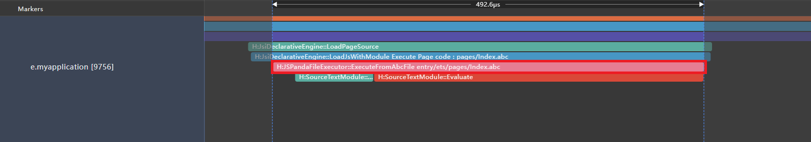


**图11 **（优化后）不存在嵌套export *，从目标文件中直接import
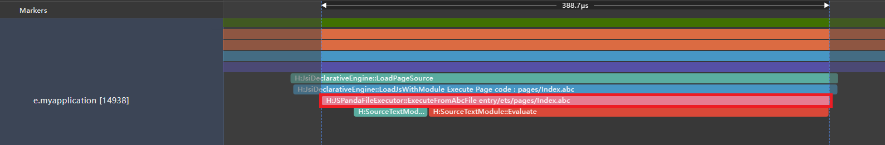

对比数据如下：

| 方案 | 阶段时长(微秒) |
| --- | --- |
| （优化前）存在8层嵌套export * | 492.6 |
| （优化后）不存在嵌套export *，从目标文件中直接import | 388.7 |


可见阶段时长已缩短。减少多层文件嵌套导出可以提升应用冷启动速度。
- 减少import *的方式全量引用 应用程序加载时，通常将相同类型的变量或函数放在同一个工具类文件中。使用时，通过import方式引入对应的模块。当工具类中存在较多暴露的函数或变量时，推荐按需引用具体的变量，以减少 `.ets` 文件的执行耗时和文件中所有export变量的初始化过程。详情请参见[减少同文件大量export *导出方式](https://developer.huawei.com/consumer/cn/doc/best-practices/bpta-arkts-high-performance#section1218510102815)。 对优化前（使用 `import * as nm` 全量引用2000条数据）和优化后（使用import { One }按需引用）的启动性能进行对比分析。分析阶段从 `H:void OHOS::AppExecFwk::MainThread::HandleLaunchAbility(const std::shared_ptr &)` 的开始点到结束点。
**图12 **优化前，使用import * as nm全量引用2000条数据
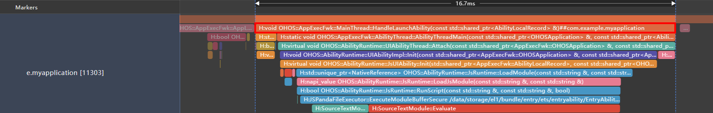


**图13 **优化后，使用import { One }按需引用
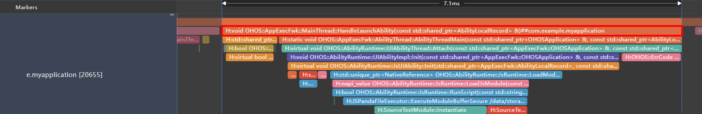

优化前后的对比数据如下：

| 方案 | 阶段时长(毫秒) |
| --- | --- |
| （优化前）使用import * as nm全量引用 | 16.7 |
| （优化后）使用import { One }按需引用 | 7.1 |


可见阶段的时长已减少。使用按需引用的方式，可以进一步缩短应用冷启动的完成时间。

> [!NOTE]
> 此优化方案仅可将冷启动阶段耗时缩短，但是可能导致其他场景耗时增长，即变量初始化过程从冷启动阶段分摊至其它使用阶段，例：当二级页面使用到Numbers.ets中Two变量，此方案会使二级页面跳转过程对比优化前耗时更长。


合理拆分导出文件，减少冗余文件执行

应用程序加载模块后，需执行应用侧的.ets文件，进行初始化并执行全局变量和函数的初始化。文件可分类为冷启动强相关文件（如首页展示界面及组件相关文件）和非冷启动强相关文件（如跳转后二级页面）。冷启动过程中仅执行冷启动强相关文件，以缩短应用启动时间。

【场景示例】

应用包含两个页面：首页Index和二级页面SecondPage。首页展示HAR包中MainPage.ets文件的Text组件，该文件中没有耗时操作。点击首页中的Text组件时，跳转至二级页面。二级页面引用HAR包中的SubPage.ets文件，该文件包含全局函数的耗时操作，这些操作在模块加载时执行。

HAR包中的导出文件Index.ets同时导出了MainPage.ets和SubPage.ets两个文件。当首页直接使用 “import { MainPage } from 'library/Index'” 的方式进行导入时，会导致应用在冷启动过程中执行非冷启动强相关文件SubPage.ets，增加了冷启动时间。

图14 优化前，加载模块时执行了非冷启动相关文件 SubPage.ets。


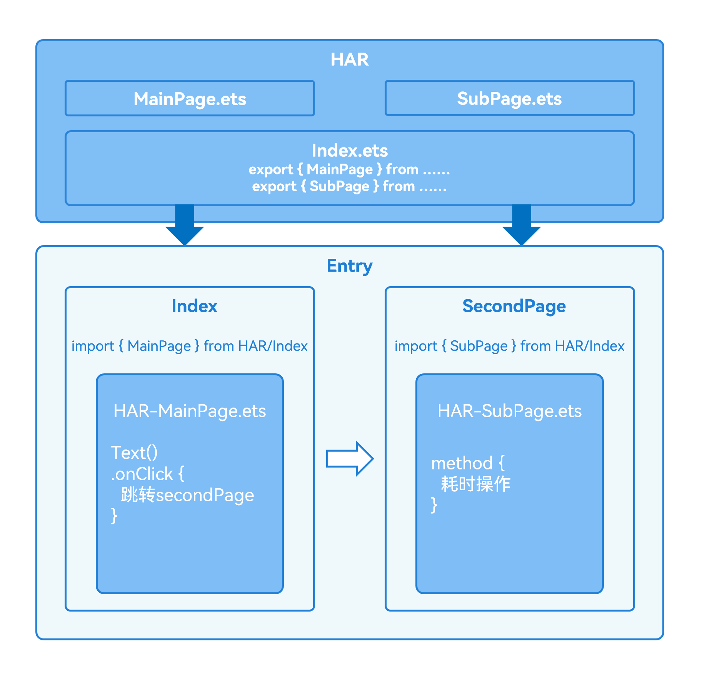


以下为示例代码：

```ts
// entry/src/main/ets/pages/Index.ets
import { MainPage } from 'library/Index'; // Unrecommended usage: Direct import of subPage.ets files related to cold start non-strong
@Component
export struct Index{
  @Provide pathStack: NavPathStack = new NavPathStack();
  build() {
    Navigation(this.pathStack) {
      Row() {
        // Refer to the custom components of HAR
        MainPage()
      }
    }
  }
}
```

```ts
// library/src/main/ets/components/mainpage/MainPage.ets
@Component
export struct MainPage {
  @Consume pathStack: NavPathStack;
  @State message: string = 'HAR MainPage';

  build() {
    Row() {
      Text(this.message)
      .fontSize(32)
      .fontWeight(FontWeight.Bold)
    }.onClick(() => {
      this.pathStack.pushPath({ name: 'SecondPage' });
    })
  }
}
```

```ts
// entry/src/main/ets/pages/SecondPage.ets
import { SubPage } from 'library/Index';
@Builder
export function SecondPageBuilder() {
  SecondPage()
}
@Entry
@Component
struct SecondPage {
  pathStack: NavPathStack = new NavPathStack();
  build() {
    NavDestination() {
      Row() {
        // Refer to the custom components of HAR
        SubPage()
      }
      .height('100%')
    }
    .onReady((context: NavDestinationContext) => {
      this.pathStack = context.pathStack;
    })
  }
}
```

```ts
// library/src/main/ets/components/mainpage/SubPage.ets
// Global time-consuming functions in SubPage
const LARGE_NUMBER: number = 10000000;

function computeTask(): number {
  let count: number = 0;
  while (count < LARGE_NUMBER) {
    count++;
  }
  return count;
}

computeTask();
// ...
```

```ts
export { MainPage } from './src/main/ets/components/mainpage/MainPage'; // Cold start strong related files
export { SubPage } from './src/main/ets/components/mainpage/SubPage'; // Non-cold start strong related files
```

【优化方案一】

将HAR包的导出文件Index.ets进行拆分，IndexAppStart.ets文件仅导出首页相关文件，即MainPage.ets。IndexOthers.ets文件导出非首页相关文件，即SubPage.ets。

优点：使用此种方案优化后可以将冷启动阶段（加载首页文件）与非冷启动阶段（加载非首页文件）需要执行的.ets文件进行完全拆分，类比其他需优化的场景也可以使用本方案进行拆分。

缺点：拆分后，需确保IndexAppStart.ets中的导出文件不引用IndexOthers.ets中的导出文件。

图15 优化方案一，拆分HAR导出文件


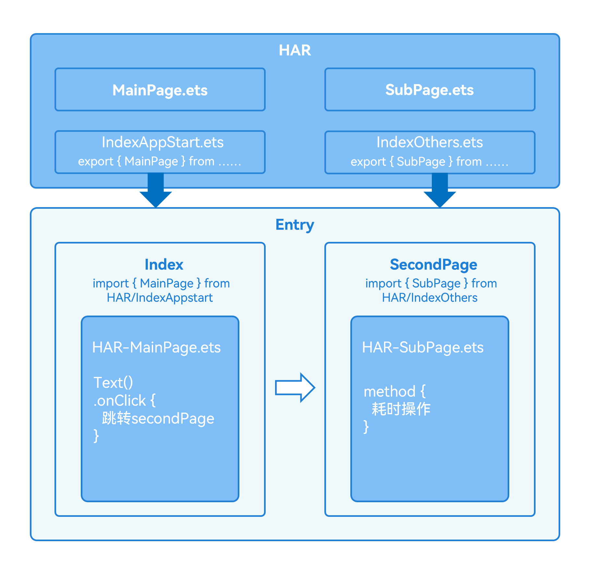


示例代码如下：

1. 将HAR包的导出文件Index.ets进行拆分，IndexAppStart.ets文件仅导出首页相关文件，IndexOthers.ets文件导出非首页相关文件。
```ts
// library/IndexAppStart.ets
export { MainPage } from './src/main/ets/components/mainpage/MainPage';
```


```ts
// library/IndexOthers.ets
export { SubPage } from './src/main/ets/components/mainpage/SubPage';
```
2. 首页Index从IndexAppStart.ets导入MainPage。
```ts
// Index.ets
import { MainPage } from 'library/IndexAppStart';

@Entry
@Component
struct Index {
  @Provide pathStack: NavPathStack = new NavPathStack();

  build() {
    Navigation(this.pathStack) {
      Row() {
        // Refer to the custom components of HAR
        MainPage()
      }
    }
    .height('100%')
    .width('100%')
  }
}
```
3. 跳转后的页面SecondPage从IndexOthers.ets导入SubPage。
```ts
// SecondPage.ets
import { SubPage } from 'library/IndexOthers';

@Builder
export function SecondPageBuilder() {
  SecondPage()
}

@Entry
@Component
struct SecondPage {
  pathStack: NavPathStack = new NavPathStack();

  build() {
    NavDestination() {
      Row() {
        // Refer to the custom components of HAR
        SubPage()
      }
      .height('100%')
    }
    .onReady((context: NavDestinationContext) => {
      this.pathStack = context.pathStack;
    })
  }
}
```


【优化方案二】

在首页的Index.ets文件中导入MainPage.ets时，使用全路径。

优点：无需新增文件即可汇总导出所有冷启阶段的文件。

缺点：引用时需对冷启阶段的所有文件路径进行展开，增加开发和维护成本。

图16 优化方案二，首页导入冷启动文件时使用全路径展开


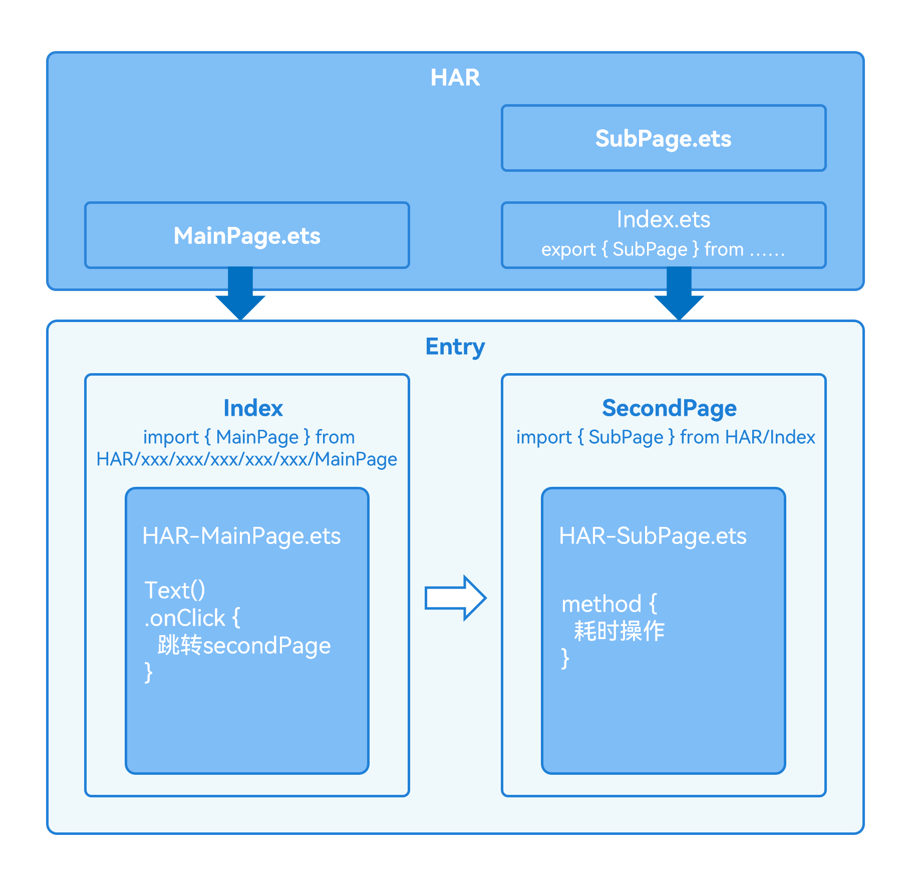


示例代码如下：

```ts
// Index.ets
import { MainPage } from 'library/IndexAppStart';

@Entry
@Component
struct Index {
  @Provide pathStack: NavPathStack = new NavPathStack();

  build() {
    Navigation(this.pathStack) {
      Row() {
        // Refer to the custom components of HAR
        MainPage()
      }
    }
    .height('100%')
    .width('100%')
  }
}
```


> [!NOTE]
> 1. 上述两种优化方案假设MainPage中不存在对SubPage的import。
>        2. 当MainPage中存在对SubPage的直接import时，需使用[动态import](https://developer.huawei.com/consumer/cn/doc/harmonyos-guides/arkts-dynamic-import)方法来进行优化。
>        3. 开发者可自行根据优化方案的优缺点权衡选择合适的优化方案。


使用Launch分析优化前后启动性能。阶段起点为UI Ability Launching，终点为应用首帧即First Frame - App Phase。

图17 优化前：加载模块时执行了非冷启动相关文件

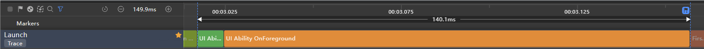


图18 优化方案一：拆分HAR导出文件

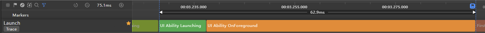


图19 优化方案二：导入冷启动文件时全路径展开

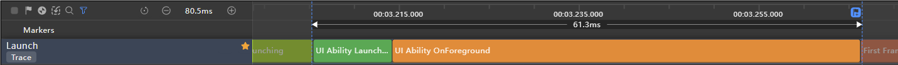


优化前后的对比数据如下：


| 方案 | 阶段时长(毫秒) |
| --- | --- |
| 优化前 | 140.1 |
| 优化方案一（拆分HAR导出文件） | 62.9 |
| 优化方案二（导入冷启动文件时全路径展开） | 61.3 |


可见阶段的时长已减少。为减少应用冷启动时.ets文件的执行耗时，可以采取以下措施：拆分HAR包导出的Index.ets文件，或在导入冷启动文件时展开完整路径，从而提升应用冷启动速度。

减少多个HAP/HSP对相同HAR的引用

在应用开发的过程中，可以使用HSP或HAR的共享包方式，整合同类模块，实现多个模块或工程间共享ArkUI组件、资源等相关代码。同时，避免多个HAP/HSP引用相同HAR。详细信息请参见多HAP/HSP引用相同HAR包的影响。

优化加载HSP时间过长

对于单窗口应用的APP工程，其仅包含一个Entry类型的HAP。如果划分的模块没有按需加载的需求，建议业务组件和公共组件采用HAR的打包方式。最终构建应用HAP包时，这些被依赖的HAR将被编译进HAP包中。HSP采用动态加载，在启动过程中会将依赖的HSP加载进来，增加额外的IO与运行耗时。在单HAP场景下，如果使用多模块的话。推荐使用多HAR，不推荐使用HSP。

以下为示例代码：

```ts
import { add } from 'hsp1';
import { add2 } from 'hsp2';
import { add3 } from 'hsp3';
import { add4 } from 'hsp4';
import { add5 } from 'hsp5';
import { add6 } from 'hsp6';
import { add7 } from 'hsp7';
import { add8 } from 'hsp8';
import { add9 } from 'hsp9';
import { add10 } from 'hsp10';
import { add11 } from 'hsp11';
import { add12 } from 'hsp12';
import { add13 } from 'hsp13';
import { add14 } from 'hsp14';
import { add15 } from 'hsp15';
import { add16 } from 'hsp16';
import { add17 } from 'hsp17';
import { add18 } from 'hsp18';
import { add19 } from 'hsp19';
import { add20 } from 'hsp20';
```

下面使用Launch分析，对比HAP与20个HSP混合打包以及将20个HSP包设计成HAR包的启动性能。

图20 HAP+20个HSP混合打包

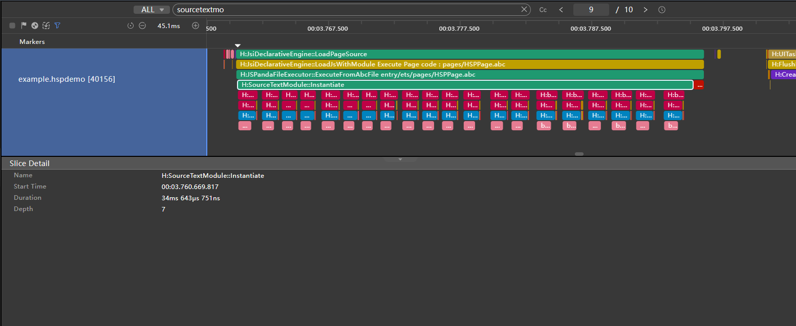


图21 将20个HSP包设计成HAR包

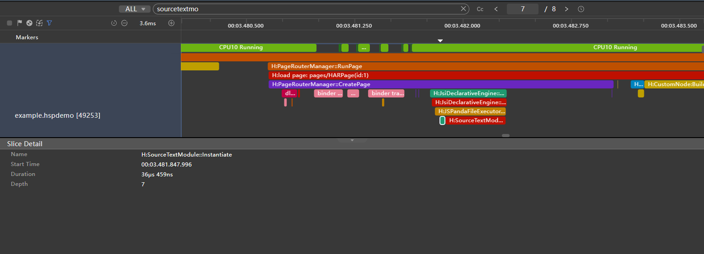


对比数据如下：


| 方案 | 阶段时长(微秒) |
| --- | --- |
| HAP+20个HSP混合打包 | 34643.7 |
| 将20个HSP包设计成HAR包 | 36.4 |


在单HAP场景下，如果需要使用多模块，建议使用多HAR，不建议使用HSP。


### 缩短AbilityStage生命周期阶段耗时


AbilityStage生命周期阶段执行相应的生命周期回调。

避免在AbilityStage生命周期回调接口进行耗时操作

在应用启动流程中，系统会执行 AbilityStage 的生命周期回调函数。不建议在这些回调函数中执行耗时操作，例如 onCreate。建议将耗时操作通过异步任务延迟处理或放到其他线程执行。关于线程并发方案，可以参考 TaskPool和Worker的对比实践。在这些生命周期回调中，推荐仅执行必要的操作。关于 AbilityStage，可以参考 AbilityStage组件管理器，以下为示例代码：

```ts
const LARGE_NUMBER: number = 100000000;
const DELAYED_TIME: number = 1000;

@Entry
@Component
struct Index {
  @State message: string = 'Hello World';

  aboutToAppear(): void {
    console.log('aboutToAppear');
    this.computeTaskAsync();
  }

  // ...

  computeTask(): void {
    let count: number = 0;
    while (count < LARGE_NUMBER) {
      count++;
    }
  }

  // Asynchronous processing of operation tasks
  private computeTaskAsync(): void {
    setTimeout(() => { // SetTimeout is used here to realize asynchronous delayed operation.
      this.computeTask();
    }, DELAYED_TIME);
  }
}
```

使用Launch分析，对比优化前同步执行耗时操作和优化后异步执行耗时操作的启动性能。分析范围从Process Creating到First Frame - Render Phase，优化前后的启动耗时如下图所示。

图22 优化前同步执行操作（computeTask），应用冷启动耗时

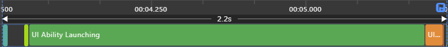


图23 优化后异步执行操作（computeTaskAsync），应用冷启动耗时


使用异步后，应用冷启动时间从2.2秒减少到220.9毫秒，速度提升显著。


### 缩短Ability生命周期阶段耗时


Ability生命周期阶段执行相应的生命周期回调。

避免在Ability生命周期回调接口进行耗时操作

在应用启动流程中，系统会执行Ability的生命周期回调函数。因此，不建议在这些回调函数中执行耗时操作，建议通过异步任务延迟处理或者放到其他线程执行。线程并发方案可以参考 TaskPool和Worker的对比实践。

在这些生命周期回调里，推荐开发者只做必要的操作，下面以UIAbility为例进行说明。比如在生命周期回调函数onCreate、onWindowStageCreate、onForeground等中执行耗时操作都会导致启动缓慢问题，关于UIAbility组件生命周期的详细说明，参见UIAbility组件生命周期。

图24 UIAbility生命周期状态


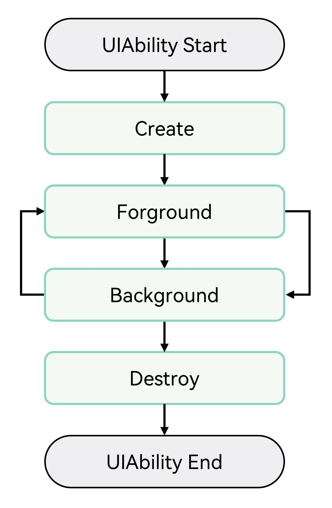


下面示例代码在UIAbility的回调函数onCreate()中分别执行了同步和异步操作：

```ts
import { AbilityConstant, UIAbility, Want } from '@kit.AbilityKit';
import { window } from '@kit.ArkUI';

const LARGE_NUMBER: number = 100000000;
const DELAYED_TIME: number = 1000;

export default class EntryAbility extends UIAbility {
  onCreate(want: Want, launchParam: AbilityConstant.LaunchParam): void {
    // Time-consuming operation
    // this.computeTask();
    this.computeTaskAsync(); // Asynchronous tasks
  }

  onWindowStageCreate(windowStage: window.WindowStage): void {
    windowStage.loadContent('pages/Index', (err, data) => {
      if (err.code) {
        console.error(
          'Failed to load the content. Cause: ' + JSON.stringify(err) ?? '',
        );
        return;
      }
      console.info(
        'Succeeded in loading the content. Data: ' + JSON.stringify(data) ?? '',
      );
    });

    // Time-consuming operation
    // this.computeTask();
    // this.computeTaskAsync(); // Asynchronous mission
  }

  onForeground(): void {
    // Time-consuming operation
    // this.computeTask();
    // this.computeTaskAsync(); // Asynchronous mission
  }

  private computeTask(): void {
    let count: number = 0;
    while (count < LARGE_NUMBER) {
      count++;
    }
  }

  private computeTaskAsync(): void {
    setTimeout(() => {
      // SetTimeout is used here to achieve asynchronous delayed operation.
      this.computeTask();
    }, DELAYED_TIME);
  }
}
```

下面使用Launch分析，对比优化前同步执行耗时操作和优化后异步执行耗时操作的启动性能。分析从Process Creating阶段开始，到First Frame - Render Phase阶段结束。优化前后的启动耗时如下图所示。

图25 优化前同步执行操作（computeTask），应用冷启动耗时


图26 优化后异步执行操作（computeTaskAsync），应用冷启动耗时


使用延时异步后，应用冷启动时间显著提升，耗时从2.1秒减少到220毫秒。


### 缩短加载绘制首页阶段耗时


首页加载绘制阶段主要包含加载首页内容、测量布局、刷新组件和绘制。处理页面生命周期时，避免耗时操作，优先创建首页需要显示的组件，使用if分支语句隐藏不需要显示的组件，减少创建过程的耗时。耗时操作建议通过异步任务或放到其他线程执行，线程并发方案可参考 TaskPool和Worker的对比实践。

自定义组件生命周期回调接口里避免耗时操作

自定义组件的生命周期变更会调用相应的回调函数，aboutToAppear()函数会在创建自定义组件实例后，页面绘制之前执行，而onPageShow则是在页面进入前台的时候显示，因此避免在这两个回调函数中执行该耗时操作，不阻塞页面绘制。关于自定义组件生命周期的详细说明，参见页面和自定义组件生命周期。

图27 被@Entry装饰的组件（页面）生命周期


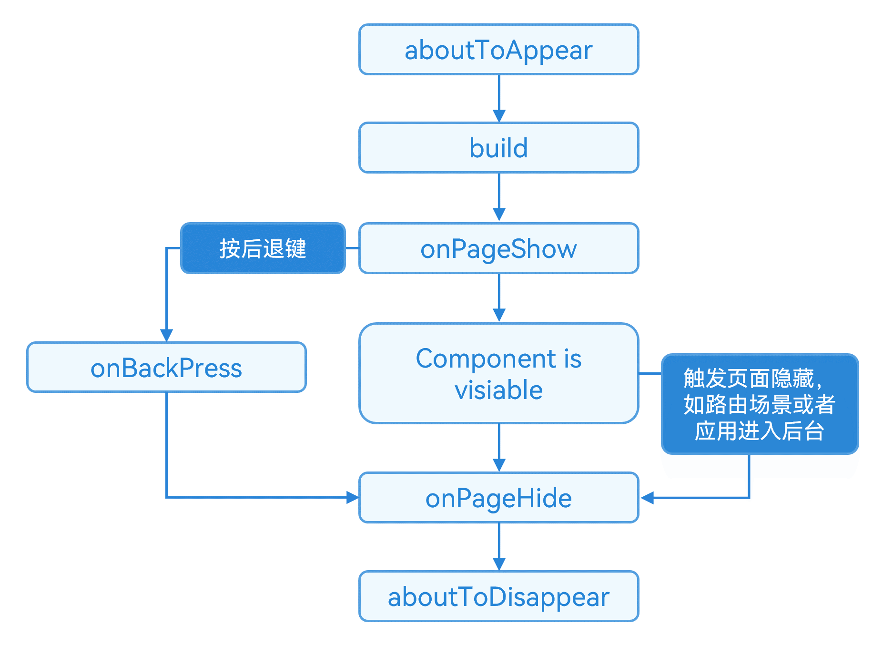


在Page的回调函数aboutToAppear()中分别执行同步和异步操作的示例代码如下：

```ts
const LARGE_NUMBER: number = 100000000;
const DELAYED_TIME: number = 1000;

@Entry
@Component
struct Index {
  @State message: string = 'Hello World';

  aboutToAppear(): void {
    // Time-consuming operation
    // this.computeTask();
    this.computeTaskAsync(); // Asynchronous tasks
  }

  build() {
    Row() {
      Column() {
        Text(this.message)
        .fontSize(50)
        .fontWeight(FontWeight.Bold)
      }
      .width('100%')
    }
    .height('100%')
  }

  private computeTask(): void {
    let count: number = 0;
    while (count < LARGE_NUMBER) {
      count++;
    }
  }

  // Asynchronous processing of computing tasks
  private computeTaskAsync(): void {
    setTimeout(() => { // SetTimeout is used here to achieve asynchronous delayed operation.
      this.computeTask();
    }, DELAYED_TIME);
  }
}
```

下面使用Launch分析，对优化前同步执行耗时操作及优化后异步执行耗时操作的启动性能进行对比分析。分析阶段的起点Process Creating，阶段终点为First Frame - Render Phase。

如下图所示，优化前后的启动耗时对比：

图28 优化前同步执行操作（computeTask），应用冷启动耗时


图29 优化后异步执行操作（computeTaskAsync），应用冷启动耗时


使用异步处理后，应用冷启动时间显著提升，耗时从2.4秒减少到238.3毫秒。

使用本地存储加载首页数据

在应用启动流程中，大部分应用的首页数据信息需要等待网络请求返回的数据解析结果，因此可以将首页数据通过应用数据持久化的方式进行本地存储，再次冷启动时优先展示已存储数据，网络请求后再次刷新首页数据。

图30 使用本地存储首页数据流程图

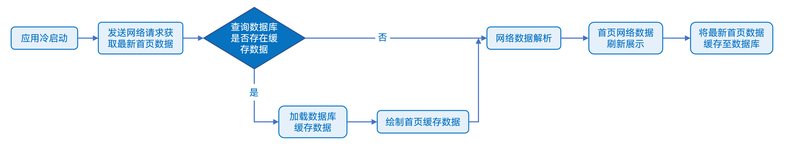


使用本地存储优先展示，可减少首帧展示延迟，缩短用户可见白屏时间，提升冷启动体验。


> [!NOTE]
> 应用需根据自身对于数据的时效性要求，来决定是否使用**本地存储**数据。例如时效性要求为一天时，一天前保存的数据就不适合进行展示，需从网络获取新数据进行展示，并更新本地存储数据。


【场景示例】

应用首页需展示从网站获取的图片信息。在aboutToAppear()中发起网络请求，数据返回并解析后展示在首页。图片信息存储在本地应用沙箱内。再次冷启动时，首先从沙箱获取图片信息，若存在则解析并展示。网络请求返回时，更新图片信息。

以下为关键示例代码：

```ts
// Index.ets
import { http } from '@kit.NetworkKit';
import { image } from '@kit.ImageKit';
import { BusinessError } from '@kit.BasicServicesKit';
import { abilityAccessCtrl, common, Permissions } from '@kit.AbilityKit';
import { fileIo, fileIo as fs } from '@kit.CoreFileKit';

const PERMISSIONS: Array<Permissions> = [
'ohos.permission.READ_MEDIA',
'ohos.permission.WRITE_MEDIA'
];
AppStorage.link('net_picture');
PersistentStorage.persistProp('net_picture', '');

@Entry
@Component
struct Index {
  @State image: PixelMap | undefined = undefined;
  @State imageBuffer: ArrayBuffer | undefined = undefined; // Picture ArrayBuffer

  /**
  * Download picture resources from the Internet through the http request method
  */
  async getPicture(): Promise<void> {
    http.createHttp()
    .request('https://www.example1.com/POST?e=f&g=h',
    (error: BusinessError, data: http.HttpResponse) => {
      if (error) {
        return;
      }
      // Determine whether the resources obtained by the network are of the ArrayBuffer type.
      if (data.result instanceof ArrayBuffer) {
        this.imageBuffer = data.result as ArrayBuffer;
      }
      this.transcodePixelMap(data);
    }
    )
  }

  /**
  * Use createPixelMap to replace pictures of ArrayBuffer type with PixelMap type
  * @param data：Resources obtained from the network
  */
  transcodePixelMap(data: http.HttpResponse): void {
    if (http.ResponseCode.OK === data.responseCode) {
      const imageData: ArrayBuffer = data.result as ArrayBuffer;
      // Create a picture source instance through ArrayBuffer
      const imageSource: image.ImageSource = image.createImageSource(imageData);
      const options: image.InitializationOptions = {
        'alphaType': 0, // Transparency
        'editable': false, // Is it editable?
        'pixelFormat': 3, // Pixel format
        'scaleMode': 1, // Abbreviation
        'size': { height: 100, width: 100 }
      }; // Create the size of the picture

      // Create PixelMap through attributes
      imageSource.createPixelMap(options).then((pixelMap: PixelMap) => {
        this.image = pixelMap;
        setTimeout(() => {
          if (this.imageBuffer !== undefined) {
            this.saveImage(this.imageBuffer);
          }
        }, 0)
      });
    }
  }

  async saveImage(buffer: ArrayBuffer | string): Promise<void> {
    try {
      const context:common.UIAbilityContext = this.getUIContext().getHostContext() as common.UIAbilityContext;
      const filePath: string = context.cacheDir + '/test.jpg';
      AppStorage.set('net_picture', filePath);
      const file: fileIo.File = await fs.open(filePath, fs.OpenMode.READ_WRITE | fs.OpenMode.CREATE);
      await fs.write(file.fd, buffer);
      await fs.close(file.fd);
    } catch (err) {
      let error = err as BusinessError;
      console.error(`onAddForm err, code: ${error.code}, mesage: ${error.message}`);
    }
  }


  async useCachePic(): Promise<void> {
    if (AppStorage.get('net_picture') !== '') {
      // Get the ArrayBuffer of the picture
      const imageSource: image.ImageSource = image.createImageSource(AppStorage.get('net_picture'));
      const options: image.InitializationOptions = {
        'alphaType': 0, // transparency
        'editable': false, // Is it editable?
        'pixelFormat': 3, // pixel format
        'scaleMode': 1, // Abbreviated value
        'size': { height: 100, width: 100 }
      };
      imageSource.createPixelMap(options).then((pixelMap: PixelMap) => {
        this.image = pixelMap;
      });
    }
  }

  async aboutToAppear(): Promise<void> {
    const context: common.UIAbilityContext = this.getUIContext().getHostContext() as common.UIAbilityContext;
    const atManager: abilityAccessCtrl.AtManager = abilityAccessCtrl.createAtManager();
    await atManager.requestPermissionsFromUser(context, PERMISSIONS);
    this.useCachePic(); // Get data from local storage
    this.getPicture(); // Obtain data from the network side
  }


  build() {
    Column() {
      Image(this.image)
      .objectFit(ImageFit.Contain)
      .width('50%')
      .height('50%')
    }
  }
}
```

下面对比优化前后的启动性能。分析阶段从启动Ability开始，到首次解析Pixelmap后的第一个vsync结束。

图31 优化前未使用本地存储数据

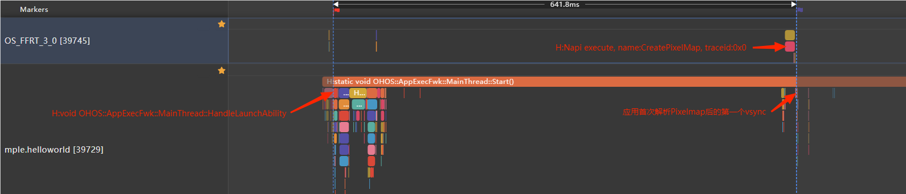


图32 优化后使用本地存储数据

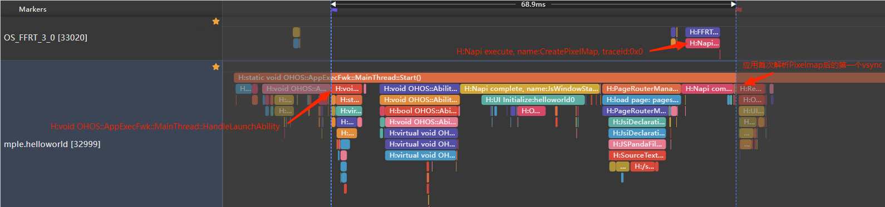


对比数据如下：


| 方案 | 阶段时长(毫秒) |
| --- | --- |
| （优化前）未使用本地存储 | 641.8 |
| （优化后）使用本地存储 | 68.9 |


使用本地存储后，应用冷启动时从Ability启动到图片显示的阶段耗时明显减少。

针对应用冷启动过程中网络请求耗时久的问题，提供了一个三方库供开发者使用，优化方式是首页内容复用，先使用本地缓存的数据。三方库链接：首页数据缓存。加速应用冷启动的使用方法可参考：基于DataCache提升应用冷启动速度。

优化首页显示速度

启动过程从用户点击应用入口到首页数据显示在屏幕上，这是对用户点击事件响应的过程。开发者可以通过UI优化、并发优化、代码逻辑优化及IPC通信优化等方法来提升首页的响应速度，具体可参考：点击响应时延分析。


## 总结


本文介绍了应用冷启动的流程，如何识别和分析冷启动缓慢问题，以及针对冷启动各阶段的注意事项和优化方法。

- 非冷启动所需的服务或模块可以延迟加载。
- 将网络请求提前至AbilityStage/UIAbility的onCreate()生命周期回调函数中，提前首刷或二刷时间，减少用户等待时间。
- 建议将启动页图标startWindowIcon的分辨率设置为不超过256px*256px。
- 在AbilityStage、UIAbility和自定义组件的生命周期回调函数中，不建议直接执行复杂的计算任务、同步文件读写等耗时任务。建议通过异步任务或在其他线程中处理。
- 按需导入模块，移除初始化阶段不必要的模块导入，动态加载耗时的模块。
- 减少使用嵌套的export *全量导出和import *全量引用。
- 拆分HAR包导出文件或导入冷启动相关文件时，使用全路径，减少应用冷启动的.ets文件执行耗时。
- 避免多个HAP/HSP对相同HAR的引用。
- 在单HAP场景下，建议模块使用多HAR，而不推荐使用HSP。
- 建议通过使用合理的布局结构和懒加载等UI优化方法来减少首帧绘制时间。
- 建议使用本地存储首页数据，以减少首帧展示完成的时延，并减少用户可见的白屏或白块时间。


希望通过本文的学习，开发者可以了解和识别应用启动耗时的问题，有助于开发者提升应用冷启动速度，提升用户体验。
