# 应用时延优化

更新时间：2026-03-12 08:45:02

来源：https://developer.huawei.com/consumer/cn/doc/best-practices/bpta-application-latency-optimization-cases

**   


#### 应用时延概述

在移动终端应用开发中，完成时延是指用户操作移动终端时，从输入触控指令到界面完全刷新结束并达到可以阅读的稳定状态所用时间，点击时延依据界面转场类型可以分为界面内跳转和界面间跳转两种。完成时延作为用户体验关键指标，直接影响用户对响应速度和交互流畅性的感知，主要影响用户对触控交互及时性和愉悦性的体验评价。关于响应时延阶段的分析，请参考[《点击响应时延分析》](https://developer.huawei.com/consumer/cn/doc/best-practices/bpta-click-to-click-response-optimization)。关于完成时延阶段的分析，请参考[《点击完成时延分析》](https://developer.huawei.com/consumer/cn/doc/best-practices/bpta-click-to-complete-delay-analysis)。
 
在一定时延水平以上，时延越短越好，当时延小于一定水平后，用户的流畅体验不再继续提升。建议应用或元服务内点击操作响应时延应≤100ms，应用或元服务内点击操作完成时延≤900ms，更多体验建议，请参考指南[《应用性能体验建议》](https://developer.huawei.com/consumer/cn/doc/harmonyos-guides/performance-experience-suggestions)。本文将给出时延问题常见优化方案。
 
图1 **点击完成起止点示意图**
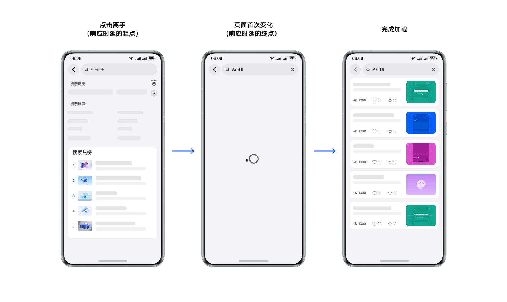

 
图2 **页面转场过程解析**
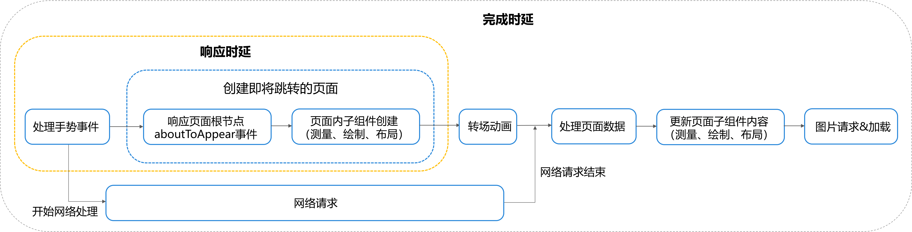

 
 

#### 常见时延问题优化方案

 

#### UI优化

本节的示例是一个应用开发中常见的留言箱列表。
 
设计图稿显示，列表视图中的每个子项包含头像、消息红点、昵称、最新信息和时间等元素。
 
应用进入该页面时，根据每条消息的元素数据，呈现出不同的样式内容。
 
图3 **留言箱列表界面
 

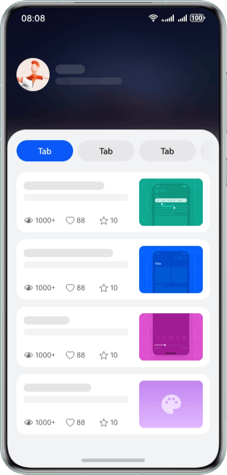

 
分解关系结构后，单个子项界面由6个构成元素组成，元素排列以线性风格为主，使用的组件包括Image、Badge和Text。
 
**图4 **单个ListItem界面示意
 

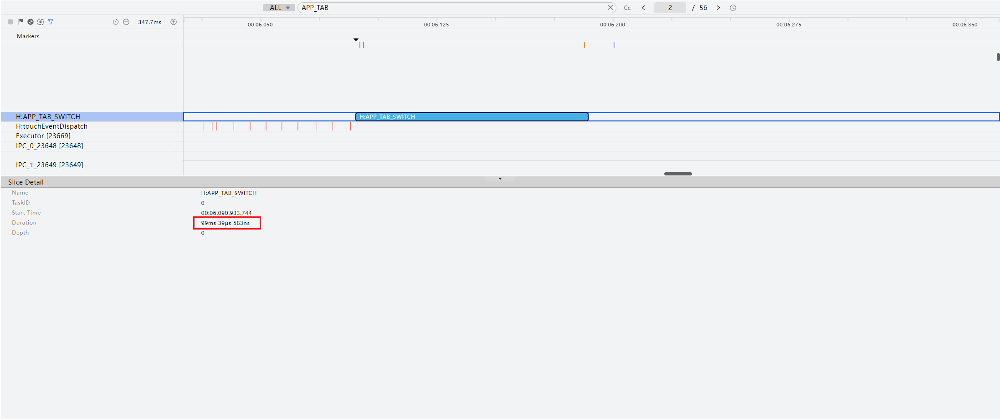

 
**具体实现**
 
- 熟悉弹性布局的开发者，得到需求后会第一时间使用Flex容器实现。界面主体呈线性结构，使用Flex作为包裹父容器，依次将横向纵向的元素添加进去，并设置其样式属性。通过DevEco Studio内置ArkUI Inspector工具，可以得到布局代码对应的视图树。实现结果从根节点到元素叶子节点最深处有6层，组件数目为15。这种实现方式，由于Flex容器默认情况下存在shrink等行为，绘制时会二次布局，造成页面渲染上的性能劣化。
- 接下来采用相对布局优化实现。先将左侧头像添加到容器中，然后锚定其位置，逐一在右侧添加其他元素。实现结果使用工具观察，发现层级相对减少，最终实现的层级是3层。同时，借助相对布局，子元素结构扁平化，容器也相对减少，进一步优化了页面的构建渲染时间。

 
**图5 **Flex布局下的界面层级关系**
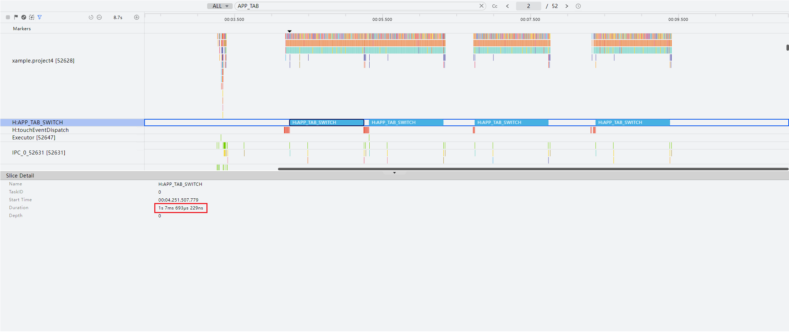

 
图6 **相对布局下的界面层级关系
 

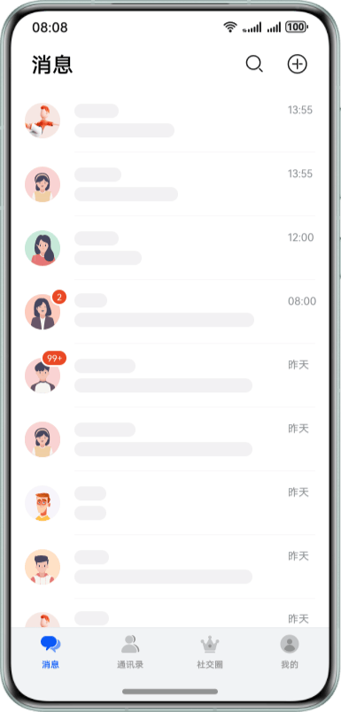

 
**统计分析**
 
在不同布局下，相同界面效果所需的组件数和嵌套层数不同。对本案例场景下的留言箱进行拆分，可以得到以下数目对比：
  
|    | 组件数目 | 嵌套数目 |
| --- | --- | --- |
| Flex实现方式 | 15 | 6 |
| 相对布局实现方式 | 9 | 3 |
 
 
使用相同数据测试，记录从上一页面点击启动到留言箱列表渲染的响应时延，对比结果如下表：
  
|    | 256条数据 | 512条数据 | 1024条数据 |
| --- | --- | --- | --- |
| Flex实现方式 | 308ms | 570ms | 1096ms |
| 相对布局实现方式 | 249ms | 499ms | 986ms |
| 优化百分比 | 19.2% | 12.5% | 10.0% |
 
 
从最后统计的数据来看：
 
- 形态单一的案例中，响应时长降低50ms以上，优化比提升10%以上。减少组件渲染数目和布局嵌套层级，有助于提升应用UI的绘制性能，减少响应时延。
- 随着加载数据量的提升，优化时长占比下降。列表在加载大量数据时，存在其他性能瓶颈，需要结合更多优化方法提升性能表现。

 
在实际开发中，简化布局结构和精简相关元素（包括绘制的子元素及其父容器）可以提升UI的响应速度。
 
 

#### 并发优化

该示例是添加地址功能。点击“选择”按钮后，应用切换到选择城市地区的目标页。切换时，加载全国城市数据，按首字符排序，刷新列表。
 
在实际场景中，可以使用同步串行方式实现这一功能：点击按钮后，初始化页面，加载数据到内存，然后渲染界面视图。
 
当目标页选择范围到“市”这一行政级别时，数据量为1000条，新页面响应速度良好，没有明显异常。
 
如果功能需求调整，当目标页选择范围到“区”这一级别，数据量达到2000，页面响应速度仍然可以接受。
 
如果功能调整后，当目标页选择范围达到“乡镇/街道”这一级别时，数据量超过4000，页面响应将出现明显延迟。
 
地区数据的加载和排序都会消耗性能，可以使用并发机制来优化。
 

 
**代码实现**
 
在目标页面的aboutToAppear()中，使用TaskPool启动子线程加载城市数据，实现并发：
 
```ArkTS
@Concurrent
function computeTask(): string[] {
  let array: string[] = []
  // AppConstant.CITYS is the data to be loaded.
  for (let t of AppConstant.CITYS) {
    array.push(t.trim())
  }
  let collator = new Intl.Collator("zh-CN", { localeMatcher: "lookup", usage: "sort" });
  array.sort((a, b) => collator.compare(a, b))
  return array;
}

@Entry
@Component
struct CityList {
  isAsync: boolean = (this.getUIContext().getRouter().getParams() as Record<string, boolean>)['isAsync'];
  // Interface data
  @State citys: string[] = []
  private listScroller: Scroller = new Scroller();

  aboutToAppear() {
    this.computeTaskAsync(); // Call asynchronous operation function
  }

  // Asynchronous thread
  computeTaskAsync() {
    let task: taskpool.Task = new taskpool.Task(computeTask);
    taskpool.execute(task).then((res) => {
      this.citys = res as string[]
    })
  }

  // ...
}
```
 
**统计分析**
 
使用Profiler Time工具，分别测试不同数量级别下的响应时长，得到结果如下：
  
|    | 500条数据 | 1000条数据 | 2000条数据 | 4000条数据 |
| --- | --- | --- | --- | --- |
| 串行 | 49ms | 94ms | 296ms | 780ms |
| 并发 | 48ms | 86ms | 140ms | 172ms |
 
 
在该场景下，如果数据量小于1000，串行加载的用户体验可以保持良好。但随着城市数据量的增加，当数据量超过1000条时，响应时间显著增加，用户体验开始恶化。从手指抬起到页面转场进入列表页的第一帧画面，会出现明显的响应迟滞。
 
采用并发异步加载的优势在于，UI主线程可以快速拉起目标列表页面，同时触发异步加载和排序的逻辑线程。待结果返回后，再刷新列表，从而提升整体响应速度。
 
 

#### 减少调用数据库API次数

本节示例是一个记账工具应用，其基于关系型数据库管理相关账目。
 
在查询用户数据时，会依次读取account表中每一行的数据，其中每一列column的值，需要借助getColumnIndex("列名")得到column索引，然后再取得对应值。
 
修改前代码：
 
```ArkTS
for (let i = 0; i < count; i++) {
  let tmp: AccountData = {
    id: 0,
    accountType: 0,
    typeText: '',
    amount: 0
  };
  tmp.id = resultSet.getDouble(resultSet.getColumnIndex('id'));
  tmp.accountType = resultSet.getDouble(resultSet.getColumnIndex('accountType'));
  tmp.typeText = resultSet.getString(resultSet.getColumnIndex('typeText'));
  tmp.amount = resultSet.getDouble(resultSet.getColumnIndex('amount'));
  result[i] = tmp;
  resultSet.goToNextRow();
}
```
 
在数据表结构固定的情况下，可以将getColumnIndex的调用提前，以减少总的调用次数，从而优化指令耗时。随着数据行数count的增加，for循环内的getColumnIndex调用次数也会增加，但索引不会变化。
 
修改后代码：
 
```ArkTS
const idIndex = resultSet.getColumnIndex("id");
const accountTypeIndex = resultSet.getColumnIndex("accountType");
const typeTextIndex = resultSet.getColumnIndex("typeText");
const amountIndex = resultSet.getColumnIndex("amount");
for (let i = 0; i < count; i++) {
  let tmp: AccountData = {
    id: 0,
    accountType: 0,
    typeText: '',
    amount: 0
  };
  tmp.id = resultSet.getDouble(idIndex);
  tmp.accountType = resultSet.getDouble(accountTypeIndex);
  tmp.typeText = resultSet.getString(typeTextIndex);
  tmp.amount = resultSet.getDouble(amountIndex);
  result[i] = tmp;
  resultSet.goToNextRow();
}
```
 
**统计分析**
 
使用Profiler Time工具，分别测试不同数量下的响应时长，得到结果如下：
  
|    | 50条数据 | 500条数据 | 5000条数据 |
| --- | --- | --- | --- |
| 修改前 | 72ms | 97ms | 157ms |
| 修改后 | 72ms | 92ms | 110ms |
 
 
由此可以看出，在使用数据库时，需要关注相关API调用的潜在频率。
 
在数据条目数量较少时，API调用对应用响应的影响很小。随着使用时间的增加，数据量逐渐增大，API的高频调用将直接影响程序的性能。
 
 

#### 延迟执行资源释放操作

该场景是相机正常使用后，执行释放相机资源的相关操作。通过“停止拍摄进程>暂停并释放相机会话>关闭和释放预览及拍照的输入输出对象>清空相机管理对象”的过程，确保应用程序在不再使用相机时能够有效管理并回收所有相机资源。但是，直接调用的release方法中，captureSession、cameraInput、previewOutput、cameraOutput都使用了await，导致相机关闭和释放操作顺序执行，可能会降低应用程序的响应性，引起用户界面卡顿。
 
下列代码将资源释放操作放在相机页面隐藏时触发的函数：
 
```ArkTS
let cameraOutput: camera.PreviewOutput;
let cameraInput: camera.CameraInput;
let captureSession: camera.PhotoSession;
let previewOutput: camera.PhotoOutput;

  // The camera page is triggered once every time it is hidden.
  onPageHide() {
    this.releaseCamera();
  }

  // Release resources
  public async releaseCamera() {
    try {
      // Photo mode session class pause
      await captureSession?.stop();
      // Photo mode conversation class release
      await captureSession?.release();
      // The photo input object class is closed.
      await cameraInput?.close();
      // Preview output object class release
      await previewOutput?.release();
      // Photo output object class release
      await cameraOutput?.release();
    } catch (e) {
      hilog.error(0x00, 'release input output error:', JSON.stringify(e));
    }
  }
```
 
启动setTimeout异步延迟操作，在200毫秒后调用release释放并关闭相机。通过“停止拍摄进程>并发执行：暂停并释放相机会话>关闭和释放预览及拍照的输入输出对象>清空相机管理对象”的过程，确保应用程序在不再使用相机时能够有效管理并回收所有相机资源。移除await关键字应用于相机资源释放操作，允许异步并发执行，减少主线程阻塞，提升应用性能和响应速度。
 
```ArkTS
let cameraOutput: camera.PreviewOutput;
let cameraInput: camera.CameraInput;
let captureSession: camera.PhotoSession;
let previewOutput: camera.PhotoOutput;

  // The camera page is triggered once every time it is hidden.
  onPageHide() {
    setTimeout(this.releaseCamera, 200);
  }

  // Release resources
  public async releaseCamera() {
    try {
      // Photo mode session class pause
      await captureSession?.stop();
      // Photo mode conversation class release
      await captureSession?.release();
      // The photo input object class is closed.
      await cameraInput?.close();
      // Preview output object class release
      await previewOutput?.release();
      // Photo output object class release
      await cameraOutput?.release();
    } catch (e) {
      hilog.error(0x00, 'release input output error:', JSON.stringify(e));
    }
  }
```
 
 
**性能比对**
  
| 操作逻辑 | trace图识别耗时 | 备注 |
| --- | --- | --- |
| 直接关闭与释放（修改前） | 457.5ms | 在onPageHide中直接执行相机关闭与释放操作 |
| 延时关闭与释放（修改后） | 85.6ms | 在onPageHide中使用setTimeout延迟200ms后执行关闭与释放操作 |
 
 
两组数据显示，合理运用延时策略能够显著提高函数执行效率，是优化相机资源管理和关闭操作性能的有效方法，有助于提升整体用户体验。
 

#### 减小拖动识别距离

该场景涉及为组件添加手势事件。优化前，设置触发拖动手势事件的最小拖动距离为100vp。代码如下：
 
```ArkTS
import { hiTraceMeter } from '@kit.PerformanceAnalysisKit'

@Entry
@Component
struct PanGestureExample {
  @State offsetX: number = 0
  @State offsetY: number = 0
  @State positionX: number = 0
  @State positionY: number = 0
  private panOption: PanGestureOptions = new PanGestureOptions({ direction: PanDirection.Left | PanDirection.Right })

  build() {
    Column() {
      Column() {
        Text('PanGesture offset:\nX: ' + this.offsetX + '\n' + 'Y: ' + this.offsetY)
      }
      .height(200)
      .width(300)
      .padding(20)
      .border({ width: 3 })
      .margin(50)
      .translate({ x: this.offsetX, y: this.offsetY, z: 0 }) // Move with the upper left corner of the component as the coordinate origin.
      // Drag left and right to trigger the gesture event.
      .gesture(
        PanGesture(this.panOption)
          .onActionStart((event: GestureEvent) => {
            console.info('Pan start')
            hiTraceMeter.startTrace("PanGesture", 1)
          })
          .onActionUpdate((event: GestureEvent) => {
            if (event) {
              this.offsetX = this.positionX + event.offsetX
              this.offsetY = this.positionY + event.offsetY
            }
          })
          .onActionEnd(() => {
            this.positionX = this.offsetX
            this.positionY = this.offsetY
            console.info('Pan end')
            hiTraceMeter.finishTrace("PanGesture", 1)
          })
      )

      Button('修改PanGesture触发条件')
        .onClick(() => {
          this.panOption.setDistance(100)
        })
    }
  }
}
```
 
 
利用Profiler工具分析得到的trace图，重点关注两个trace标签：DispatchTouchEvent表示点击事件，PanGesture表示事件响应。追踪流程从应用侧的DispatchTouchEvent（type=0，表示手指接触屏幕）标签开始，到PanGesture（事件响应）的变化，整个过程耗时145.1毫秒。
 


 
日志关注从应用接收TouchDown事件到pan识别的耗时，该过程耗时127ms。注：日志信息和trace图非同一时间获取，性能数据存在差异，提供的数值仅供参考。
 

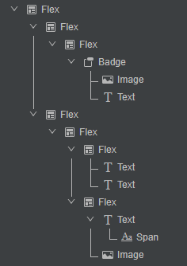

 
针对该组件，其拖动手势识别距离可以调整到更合适的数值，这里优化后，指定触发拖动手势事件的最小拖动距离为4vp，代码如下：
 
```ArkTS
Button('修改PanGesture触发条件')
  .onClick(() => {
    this.panOption.setDistance(4)
  })
```
 
同样采用Profiler工具分析trace图，得到对应耗时38.4ms
 

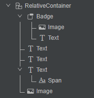

 
对应日志过程耗时42ms。
 

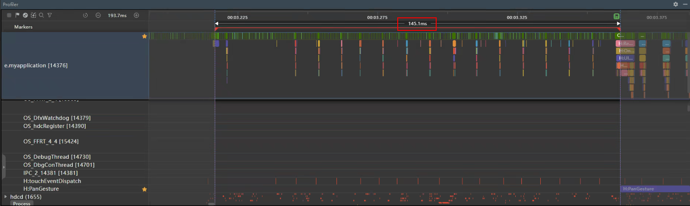

 
**性能比对**
  
| 拖动距离设置 | trace图识别耗时 | 日志识别耗时 | 备注 |
| --- | --- | --- | --- |
| 最小拖动距离100vp（修改前） | 145.1ms | 127ms | 最小拖动距离过大可能导致滑动脱手和响应时延慢等问题，从而导致性能劣化 |
| 最小拖动距离4vp（修改后） | 38.4ms | 42ms | 设置合理的拖动距离可以优化性能 |
 
 
两组数据对比显示，适当减小拖动距离可显著提升执行效率，有效优化响应时延，从而显著改善整体用户体验。本案例通过设置较大和较小的拖动距离进行对比得出结论。设置过小的拖动距离容易导致误触等问题，建议开发者根据具体应用场景进行合理设置。
 

#### 转场动画场景案例

下面的示例通过不同的连贯动画，使应用使用者在操作过程中感受到程序的快速响应。
 
该示例场景：从留言箱的列表项点击后，执行切换进入个人页。在这一过程中，使用了三个动画组成其完整过程：
 
- 在整体界面的切换过程，使用系统平台的转场动画，两个界面通过横向滑动完成切换。
- 转场动画中添加头像移动缩放的共享元素动画，体现响应元素的切换。
- 在个人页列表加载前，添加了列表轮廓的骨架图闪烁动画，让用户感知新页面的加载动态。

 
**图7 **场景实例图
 

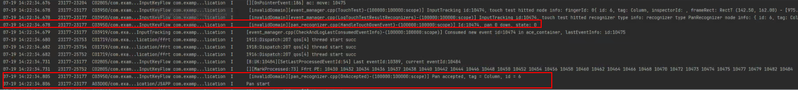

 

 
**具体实现**
 
用router+sharedTransition+animateTo()的组合实现，具体操作思路如下：
 1. 在两个页面中设置pageTransition()转场动画参数，然后在列表页头像的点击事件中添加router跳转，实现列表页到个人页的转场动画效果。
2. 在两个页面的头像组件Image中添加属性sharedTransition，并赋予相同的id以进行唯一匹配。同时，添加共享元素动画的时间等相关参数，实现头像从列表页向个人页移动的动画效果。
3. 根据个人页内容的版面样式，实现一个骨架图组件，并使用animateTo()添加反复渐显渐隐的动画行为。在个人页组件onAppear()时呈现该动画，具体内容刷新后隐藏动画元素。
 
**关键代码**
 
转场动画设置：
 
```ArkTS
// page A Transition animation settings
pageTransition() {
  PageTransitionEnter({ type: RouteType.None, duration: 400 })
    .slide(SlideEffect.Left)
  PageTransitionExit({ type: RouteType.None, duration: 400 })
    .slide(SlideEffect.Left)
}
```
 
列表页中共享元素动画设置：
 
```ArkTS
// Use the avatar as a shared element in the list and specify the id as sharedImage+this.itemData.id
Image(this.itemData.avatar)
  .height('40vp')
  .width('40vp')
  .borderRadius(8)
  .sharedTransition('sharedImage' + this.itemData.id, { duration: 500, curve: Curve.FastOutSlowIn, delay: 0 })
```
 
 
个人页中共享元素动画设置：
 
```ArkTS
// The personal page sharing element needs to be the same as the previous page id.
Image(this.itemData.avatar)
  .size({
    width: $r('app.float.user_image_size'),
    height: $r('app.float.user_image_size')
  })// .borderRadius($r('app.float.user_image_border_radius'))
  .borderRadius(8)
  .margin({ bottom: $r('app.float.user_image_padding'), top: $r('app.float.user_image_padding') })
  .sharedTransition('sharedImage' + this.itemData.id,
    { duration: 500, curve: Curve.FastOutSlowIn, delay: 0 })
```
 
骨架图实现：
 
```ArkTS
// Skeleton diagram, presenting skeleton animation in a fading way.
startAnimation(): void {
  this.getUIContext().animateTo(CommonConstants.SKELETON_ANIMATION, () => {
    this.listOpacity = CommonConstants.HALF_OPACITY;
  });
}

// Skeletal diagram layout
build() {
  Row() {
    List({ space: Constants.RESOURCE_LIST_SPACE }) {
      ForEach(SkeletonData, (item: SkeType) => {
        ListItem() {
          ArticleSkeletonView({ isMine: item.isMine, isFeed: item.isFeed })
        }
      })
    }
    .padding({
      left: '12vp',
      right: '12vp'
    })
    .lanes(1)
    .layoutWeight(1)
    .scrollBar(BarState.Off)

    Row()
      .layoutWeight(0)
      .backgroundColor($r('app.color.skeleton_color_medium'))
  }
  .width('100%')
  .opacity(this.listOpacity)
  .onAppear(() => {
    this.startAnimation();
  })
}
```
 

#### 动画时延场景案例

页面转场动画对提升用户体验至关重要。动画时延过长会显著影响用户的点击完成时延，因为动画完成时间直接影响用户何时能开始与应用交互。动画时延的主要原因是动画时长设置过长。
 
常见的页面转场动画时长参数有：
 1. [Tabs](https://developer.huawei.com/consumer/cn/doc/harmonyos-references/ts-container-tabs)组件设置TabContent切换动画时长，即[animationDuration](https://developer.huawei.com/consumer/cn/doc/harmonyos-references/ts-container-tabs#animationduration)属性。
2. [Swiper](https://developer.huawei.com/consumer/cn/doc/harmonyos-references/ts-container-swiper)组件设置子组件切换动画时长，即[duration](https://developer.huawei.com/consumer/cn/doc/harmonyos-references/ts-container-swiper#duration)属性。
3. 页面间转场（[pageTransition](https://developer.huawei.com/consumer/cn/doc/harmonyos-references/ts-page-transition-animation)）设置转场动画时长，即[PageTransitionOptions](https://developer.huawei.com/consumer/cn/doc/harmonyos-references/ts-page-transition-animation#pagetransitionoptions对象说明)对象中的duration字段。
 
使用Tabs组件进行页面切换时，当不设置BottomTabBarStyle时默认[animationDuration](https://developer.huawei.com/consumer/cn/doc/harmonyos-references/ts-container-tabs#animationduration)属性有300ms的动画时长，当该属性值设置过长时会导致完成时延变大。接下来将该属性值分别设置为100ms与1000ms来探究animationDuration属性对完成时延的影响。
 
实验一：设置animationDuration为100ms
 
```ArkTS
@Entry
@Component
struct TabsPositiveExample {
  @State currentIndex: number = 0;
  private controller: TabsController = new TabsController();
  private list: string[] = ['green', 'blue', 'yellow', 'pink'];

  @Builder
  customContent(color: Color) {
    Column()
      .width('100%')
      .height('100%')
      .backgroundColor(color)
  }

  build() {
    Column() {
      Row({ space: 10 }) {
        ForEach(this.list, (item: string, index: number) => {
          Text(item)
            .textAlign(TextAlign.Center)
            .fontSize(16)
            .height(32)
            .layoutWeight(1)
            .fontColor(this.currentIndex === index ? Color.White : Color.Black)
            .backgroundColor(this.currentIndex === index ? Color.Blue : '#f2f2f2')
            .borderRadius(16)
            .onClick(() => {
              this.currentIndex = index;
              this.controller.changeIndex(index);
            })
        }, (item: string, index: number) => JSON.stringify(item) + index)
      }
      .margin(10)

      Tabs({ barPosition: BarPosition.Start, controller: this.controller }) {
        TabContent() {
          this.customContent(Color.Green)
        }

        TabContent() {
          this.customContent(Color.Blue)
        }

        TabContent() {
          this.customContent(Color.Yellow)
        }

        TabContent() {
          this.customContent(Color.Pink)
        }
      }
      .animationDuration(100)
      .layoutWeight(1)
      .barHeight(0)
      .scrollable(false)
    }
    .width('100%')
  }
}
```
 

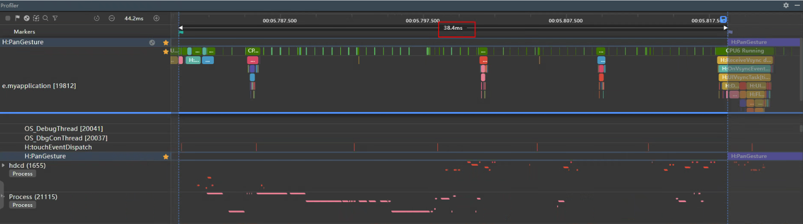

 
实验二：设置animationDuration为1000ms
```ArkTS
@Entry
@Component
struct TabsNegativeExample {
  // ...
  private controller: TabsController = new TabsController();

  // ...

  build() {
    Column() {
      // ...

      Tabs({ barPosition: BarPosition.Start, controller: this.controller }) {
        // ...

      }
      .barHeight(0)
      .layoutWeight(1)
      .animationDuration(1000)
      .scrollable(false)
    }
    .width('100%')
  }
}
```
 
 

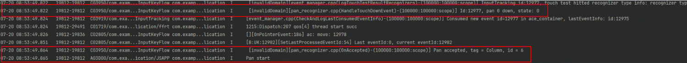

  
| 设置animationDuration为100ms | 设置animationDuration为1000ms |
| --- | --- |
|  |  |
 
  
| animationDuration属性值 | 完成时延 |
| --- | --- |
| 100ms | 99ms39μs |
| 1000ms | 1s7ms693μs |
 
 
通过减少animationDuration属性的数值，可以减小Tabs组件切换动画的完成时延。如果不设置BottomTabBarStyle样式，动画时长默认为300毫秒。开发者可以根据实际业务场景，适当降低该动画时长，以提高应用性能。
