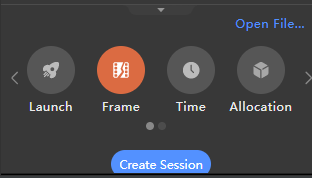
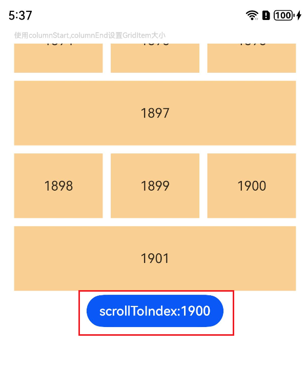
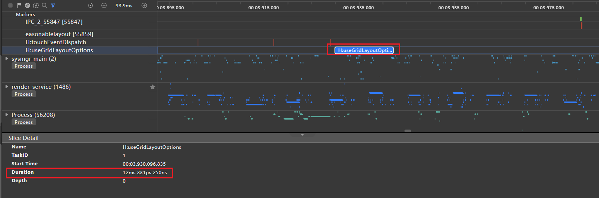
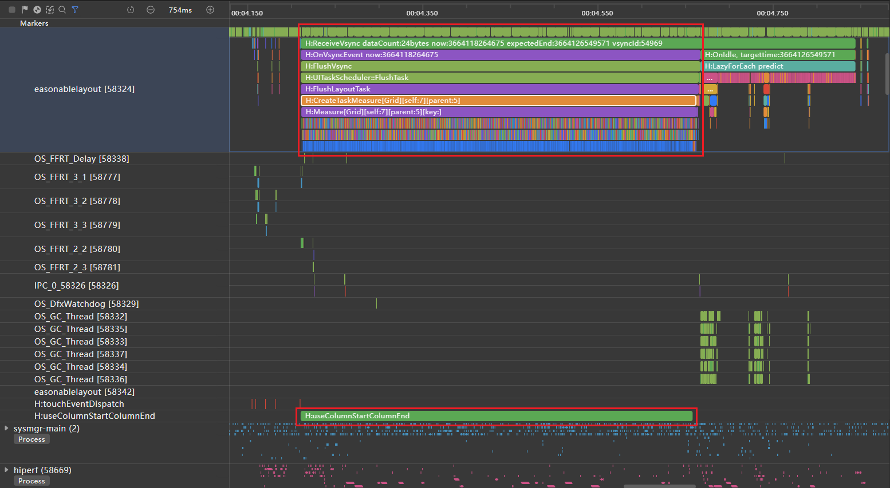
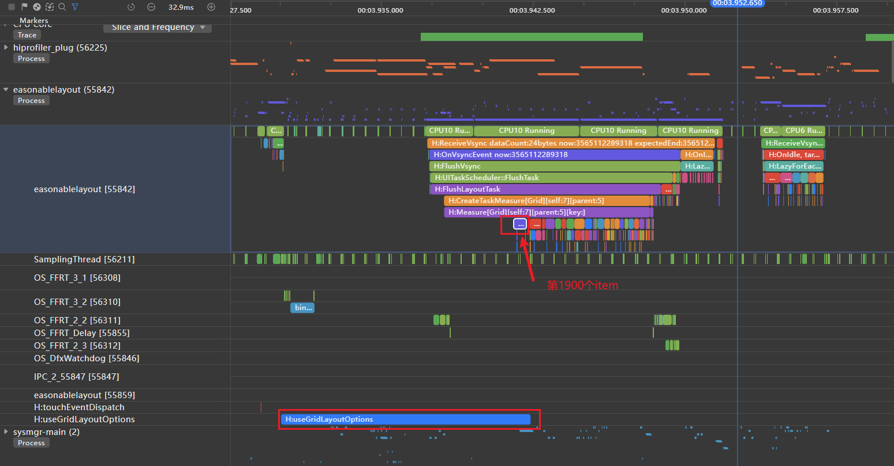

# Grid组件加载丢帧优化

更新时间：2026-03-12 08:45:02

来源：https://developer.huawei.com/consumer/cn/doc/best-practices/bpta-improve_grid_performance

**   


#### 概述

网格是应用开发中常见的开发场景。它通过相交的横线和竖线，形成整齐有序的网状布局。网格适用于展示图片、媒体文件、购物商品等多种数据。当网格上下滑动时，子组件会带来测量和绘制的性能消耗。
 
在网格的高频场景中，性能优化是关键，包括加快渲染速度、提升滑动帧率、降低内存占用等，从而显著提升应用流畅度和用户体验。对于希望快速实现的开发者，可使用ScrollComponents库直接创建流畅滑动的网格，该库内置组件复用、懒加载、复用池共享等优化能力，并支持预创建和预加载，大幅减少开发者的性能调优成本，具体实现细节和最佳实践可参考[基于ScrollComponents实现网格](https://developer.huawei.com/consumer/cn/doc/best-practices/bpta-grid-based-on-scrollcomponents)。
 
 
在实现如下图所示可滚动布局效果时，可能会通过columnStart/columnEnd[设置子组件所占行列数](https://developer.huawei.com/consumer/cn/doc/harmonyos-guides/arkts-layout-development-create-grid#设置子组件所占行列数)，实现不规则的布局效果。
 
图1 **columnStart/columnEnd实现不规则网格布局**


 
在以下使用场景中，使用columnStart或columnEnd可能会导致性能问题：
 1. **删除或拖拽等改变GridItem位置**
2. **使用scrollToIndex滑动到指定GridItem**
 
在Grid中存在多个GridItem时，如果使用columnStart/columnEnd或rowStart/rowEnd设置GridItem的大小，可能会导致性能问题。在这种情况下，建议使用GridLayoutOptions来提升性能。使用columnStart/columnEnd或rowStart/rowEnd布局时，如果调用scrollToIndex滑动到指定索引，Grid会遍历所有GridItem以查找位置。而使用GridLayoutOptions布局时，通过计算方式查找位置，效率更高。因此，可以通过设置GridLayoutOptions，并结合rowsTemplate或columnsTemplate来替代使用columnStart/columnEnd控制GridItem占用多列的情况。
 

#### 案例说明

 

#### 场景示例

 
介绍Grid中使用scrollToIndex滑动到指定位置的场景。案例中，columnStart/columnEnd设置不规则宫格布局的反例，与GridLayoutOption的正例对比，示例代码如下：
 
**反例：**使用columnStart/columnEnd设置GridItem大小。
 
```ArkTS
// Import performance dot modules
import { hiTraceMeter } from '@kit.PerformanceAnalysisKit';

@Component
struct TextItem {
  @State item: string = '';

  build() {
    Text(this.item)
      .fontSize(16)
      .backgroundColor(0xF9CF93)
      .width('100%')
      .height(80)
      .textAlign(TextAlign.Center)
  }

  aboutToAppear() {
    // Finish the task
    hiTraceMeter.finishTrace('useColumnStartColumnEnd', 1);
  }
}

class MyDataSource implements IDataSource {
  private dataArray: string[] = [];

  public pushData(data: string): void {
    this.dataArray.push(data);
  }

  public totalCount(): number {
    return this.dataArray.length;
  }

  public getData(index: number): string {
    return this.dataArray[index];
  }

  registerDataChangeListener(listener: DataChangeListener): void {
  }

  unregisterDataChangeListener(listener: DataChangeListener): void {
  }
}

@Entry
@Component
struct GridExample {
  private datasource: MyDataSource = new MyDataSource();
  scroller: Scroller = new Scroller();

  aboutToAppear() {
    for (let i = 1; i <= 2000; i++) {
      this.datasource.pushData(i + '');
    }
  }

  build() {
    Column({ space: 5 }) {
      Text('使用columnStart,columnEnd设置GridItem大小').fontColor(0xCCCCCC).fontSize(9).width('90%')
      Grid(this.scroller) {
        LazyForEach(this.datasource, (item: string, index: number) => {
          if ((index % 4) === 0) {
            GridItem() {
              TextItem({ item: item })
            }
            .columnStart(0).columnEnd(2)
          } else {
            GridItem() {
              TextItem({ item: item })
            }
          }
        }, (item: string) => item)
      }
      .columnsTemplate('1fr 1fr 1fr')
      .columnsGap(10)
      .rowsGap(10)
      .width('90%')
      .height('40%')

      Button('scrollToIndex:1900').onClick(() => {
        // Start some tasks.
        hiTraceMeter.startTrace('useColumnStartColumnEnd', 1);
        this.scroller.scrollToIndex(1900);
      })
    }.width('100%')
    .margin({ top: 5 })
  }
}
```
 
**正例：**使用GridLayoutOptions设置GridItem大小，布局效果和反例保持一致。
 
```ArkTS
// Import performance dot modules
import { hiTraceMeter } from '@kit.PerformanceAnalysisKit';

@Component
struct TextItem {
  @State item: string = '';

  build() {
    Text(this.item)
      .fontSize(16)
      .backgroundColor(0xF9CF93)
      .width('100%')
      .height(80)
      .textAlign(TextAlign.Center)
  }

  aboutToAppear() {
    // Finish the task
    hiTraceMeter.finishTrace('useGridLayoutOptions', 1);
  }
}

class MyDataSource implements IDataSource {
  private dataArray: string[] = [];

  public pushData(data: string): void {
    this.dataArray.push(data);
  }

  public totalCount(): number {
    return this.dataArray.length;
  }

  public getData(index: number): string {
    return this.dataArray[index];
  }

  registerDataChangeListener(listener: DataChangeListener): void {
  }

  unregisterDataChangeListener(listener: DataChangeListener): void {
  }
}

@Entry
@Component
struct GridExample2 {
  private datasource: MyDataSource = new MyDataSource();
  scroller: Scroller = new Scroller();
  private irregularData: number[] = [];
  layoutOptions: GridLayoutOptions = {
    regularSize: [1, 1],
    irregularIndexes: this.irregularData,
  };

  aboutToAppear() {
    for (let i = 1; i <= 2000; i++) {
      this.datasource.pushData(i + '');
      if ((i - 1) % 4 === 0) {
        this.irregularData.push(i - 1);
      }
    }
  }

  build() {
    Column({ space: 5 }) {
      Text('使用GridLayoutOptions设置GridItem大小')
        .fontColor(0xCCCCCC)
        .fontSize(9)
        .width('90%')
      Grid(this.scroller, this.layoutOptions) {
        LazyForEach(this.datasource, (item: string, index: number) => {
          GridItem() {
            TextItem({ item: item })
          }
        }, (item: string) => item)
      }
      .columnsTemplate('1fr 1fr 1fr')
      .columnsGap(10)
      .rowsGap(10)
      .width('90%')
      .height('40%')

      Button('scrollToIndex:1900').onClick(() => {
        // Start some tasks.
        hiTraceMeter.startTrace('useGridLayoutOptions', 1);
        this.scroller.scrollToIndex(1900);
      })
    }.width('100%')
    .margin({ top: 5 })
  }
}
```
 

#### 分析步骤

 
正反例采用相同的操作步骤，收集跳转过程中的性能参数并进行对比：
 1. 打开Profiler工具，连接设备，选择对应的应用进程。


2. 选择Frame，点击Create Session以开始数据测量。


3. 通过点击按钮，先使用startTrace开始性能打点跟踪，再调用scrollToIndex。


4. 查看对应应用进程下的自定义打点事件，包括反例代码中定义的“useColumnStartColumnEnd”和正例代码中的“useGridLayoutOptions”下的trace图。
> [!TIP]
> 打点事件说明 ：Grid查找到指定GridItem位置，准备渲染节点前，进入GridItem组件的生命周期回调aboutToAppear，使用finishTrace停止性能打点。通过startTrace标记调用scrollToIndex，finishTrace标记查找到指定位置后准备渲染首个GridItem节点，对比正反例场景下的耗时数据。关于性能打点的介绍，请参考 @ohos.hiTraceMeter (性能打点)

 

#### 结果对比

如图所示，使用columnStart和columnEnd设置GridItem大小的布局方式。从自定义打点标签“H:useColumnStartColumnEndGrid”可以看出，从调用scrollToIndex到查找到指定索引并准备构建GridItem节点耗时447ms。
 
 
图2 **使用columnStart，columnEnd的打点信息
 



 
如图3所示，使用GridLayoutOptions设置GridItem大小的布局方式。从自定义打点标签“H:useGridLayoutOptions”可以看出，从调用scrollToIndex到查找到指定Index并准备构建GridItem节点耗时12ms。
 
**图3 **使用GridLayoutOptions的打点信息
 



 
通过详细的trace分析可以发现，在“H:useColumnStartColumnEndGrid”打点标签时间段中，存在大量“H:Builder:BuildLazyItem”标签。这表明Grid在查找指定的Index 1900时，是通过依次遍历Index来实现的。
 
**图4 **使用columnStart，columnEnd的放大trace标签信息**


 
在使用GridLayoutOptions的示例中，“H:useGridLayoutOptions”打点标签时间段内仅出现一个“H:Builder:BuildLazyItem”标签。这表明Grid在查找指定索引1900时，能够直接一次性找到指定索引。
 
图5 **使用GridLayoutOptions的放大trace标签信息


 
在相同布局情况下，使用columnStart和columnEnd设置GridItem大小时，Grid在使用scrollToIndex查找指定索引时，会依次遍历GridItem节点，导致查找过程耗时较长。而使用GridLayoutOptions设置GridItem大小时，直接一次性计算找到指定索引，查找过程耗时较短。因此，使用GridLayoutOptions设置GridItem大小可以显著减少Grid加载时间，提升应用性能。
