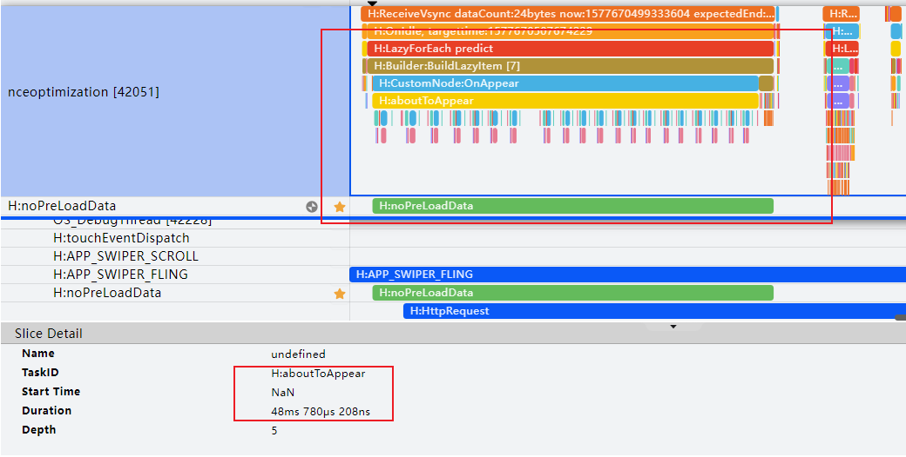

# Swiper组件加载丢帧优化

更新时间：2026-03-12 08:45:02

来源：https://developer.huawei.com/consumer/cn/doc/best-practices/bpta-swiper_high_performance_development_guide

**   


#### 概述

在应用开发中，Swiper组件适用于翻页场景，如桌面和图库等应用。当Swiper组件滑动切换页面时，基于按需加载原则，通常在下一个页面即将显示时才进行加载和布局绘制。对于复杂页面场景，该过程可能需要较长时间，导致滑动过程中出现卡顿，影响滑动体验，甚至成为整个应用的性能瓶颈。
 
本文主要介绍Swiper性能优化的相关方法。
 
 

#### 懒加载

 

#### 原理介绍

 
懒加载从提供的数据源按需迭代数据，并在每次迭代过程中创建相应的组件，Swiper采用懒加载进行数据懒加载，在布局时会根据可视区域按需创建Swiper子组件，并在Swiper子组件滑出可视区域外时销毁以降低内存占用。Swiper组件的开发，属于滑动容器加载的一种场景，其LazyForEach懒加载原理可参考：[《长列表加载性能优化-懒加载》](https://developer.huawei.com/consumer/cn/doc/best-practices/bpta-best-practices-long-list#section182645364229)。
 

#### 场景案例

为了展示Swiper使用ForEach与LazyForEach加载的性能差异，本地模拟答题场景进行测试。
 
Swiper子组件核心代码如下：
 
```ArkTS
@Reusable
@Component
struct QuestionSwiperItem {
  @State itemData: Question | null = null;

  aboutToReuse(params: Record<string, Object>): void {
    this.itemData = params.itemData as Question;
  }

  build() {
    Column() {
      Text(this.itemData?.title)
        // ...
      Image(this.itemData?.image)
        // ...

      Column({ space: 16 }) {
        // ...
      }
      .width('100%')
      .alignItems(HorizontalAlign.Start)
    }
    // ...
  }
}
```
 
 
Swiper主页面核心代码如下：
 
- 使用ForEach加载页面
```ArkTS
aboutToAppear(): void {
  for (let i = 0; i < 1000; i++) {
    this.list.push(i);
    this.data.addData(i, i);
  }
}

build() {
  Column() {
    Swiper(this.swiperController) {
      ForEach(this.list, (item: number, index: number) => {
        SwiperItem({ myIndex: index })
          .width('100%')
          .height("100%")
      }, (item: string) => item)
    }
    // ...
  }
  .width('100%')
  .margin({ top: 5 })
}
```


 
- 使用LazyForEach加载页面
```ArkTS
Swiper(this.swiperController) {
  LazyForEach(this.dataSource, (item: Question) => {
    QuestionSwiperItem({ itemData: item })
  }, (item: Question) => item.id)
}
```


  
| 加载方式 | 完全显示所用时间 | 丢帧率 | 独占内存 |
| --- | --- | --- | --- |
| ForEach | 951ms | 8.5% | 200MB |
| LazyForEach | 280.6ms | 0.0% | 25.18MB |
 
 
根据实验数据，当Swiper的子组件数量超过100个时，采用懒加载可以提升帧率30%以上，并且减少内存占用20%以上。
 

#### 缓存数据项

 

#### 原理介绍

LazyForEach懒加载可以通过设置[cachedCount](https://developer.huawei.com/consumer/cn/doc/harmonyos-references/ts-container-swiper#cachedcount8)来指定缓存数量，详细原理参考：[《长列表加载性能优化-缓存列表项》](https://developer.huawei.com/consumer/cn/doc/best-practices/bpta-best-practices-long-list#section11667144010222)。
 
 

#### 使用场景

如果开发者的应用场景属于加载耗时的场景，尤其是以下场景，推荐使用。
 
- Swiper的子组件具有复杂的动画；
- Swiper的子组件加载时需要执行网络请求等耗时操作；
- Swiper的子组件包含大量需要渲染的图像或资源。

 
 

#### 场景案例

案例模拟Swiper子组件包含大量图像资源，前置条件如下：
 
- Swiper的子组件包含50个ListItem的List组件；
- 每个ListItem加载网络图片；
- Swiper组件共有20个ListItem子组件；
- 一屏显示一个Swiper子组件。

 
Swiper子组件核心代码如下：
 
```ArkTS
@Component
struct SwiperItem {
  private data: number[] = [];
  private myIndex: number = 0;
  // Construct data
  private imgURL: string[] = Constant.imgURL;

  aboutToAppear(): void {
    for (let i = 0; i < 50; i++) {
      this.data.push(i);
    }
  }

  build() {
    Column() {
      List({ space: 20 }) {
        ForEach(this.data, (index: number) => {
          ListItem() {
            Image(this.imgURL[this.myIndex * 50 + index])
              .objectFit(ImageFit.Contain)
              .width("100%")
              .height("100%")
          }
          .aspectRatio(1)
          .border({ width: 2, color: Color.Green })
        }, (index: number) => index.toString());
      }
      // ...
    }
    // ...
  }
}
```
 
Swiper主页面核心代码如下：
 
```ArkTS
@Component
struct TestCodeTwo {
  private dataSrc: NumberDataSource = new NumberDataSource();

  aboutToAppear(): void {
    for (let i = 0; i < 20; i++) {
      this.dataSrc.addData(i, i);
    }
  }

  build() {
    Column({ space: 5 }) {
      Swiper() {
        LazyForEach(this.dataSrc, (item: number, index: number) => {
          SwiperItem({
            myIndex: index
          });
        }, (item: number) => item.toString());
      }
      .cachedCount(1)
      .autoPlay(true)
      .interval(1000)
      .duration(100)
      // ...
    }.width('100%')
    .margin({ top: 5 })
  }
}
```
 
 
为了测试不同缓存数量对性能的影响，将 `cachedCount` 的值分别设置为 1、2、4、8。基于案例程序，测试不同缓存数量对帧率和内存占用的影响。
  
| 缓存数量 | 1 | 2 | 4 | 8 |
| --- | --- | --- | --- | --- |
| 丢帧率 | 3.0% | 3.3% | 3.1% | 3.0% |
| --- | --- | --- | --- | --- |
| 独占内存 | 64.36MB | 117.39MB | 214.32MB | 377.38MB |
| --- | --- | --- | --- | --- |
 
 
根据测试结果，随着cachedCount的增加，应用的内存占用呈线性增长，但帧率没有显著提升。
 
在一屏显示一个Swiper子组件的连续滑动场景中，将cachedCount值设置为1或2。
 
> [!NOTE]
> 缓存数量仅供参考，不同的应用程序设置的最佳缓存数量不一致，需要针对应用程序测试得出最佳缓存数量。

 

#### 提前加载数据

 
在抛滑场景时，Swiper组件有个[onAnimationStart()](https://developer.huawei.com/consumer/cn/doc/harmonyos-references/ts-container-swiper#onanimationstart9)回调接口，切换动画开始时触发该回调。此时，切换动画的逻辑在渲染线程中执行，主线程则可以利用这段时间加载子组件所需的资源，如图像和网络资源，减少后续cachedCount范围内的节点预加载耗时。跟手滑动阶段不会触发onAnimationStart回调，只有在离手后进行切换动画时才会触发。
 

#### 场景案例

Swiper子组件：在子组件首次构建(生命周期执行到[aboutToAppear()](https://developer.huawei.com/consumer/cn/doc/harmonyos-references/ts-custom-component-lifecycle#abouttoappear))时，先判断Swiper数据中图片资源是否已经存在，若不存在则先下载图片资源，再构建节点。
 
```ArkTS
@Reusable
@Component
struct PreloadSwiperItem {
  // ...

  aboutToAppear(): void {
    hiTraceMeter.startTrace('preloadData', 1);
    // ...
    if (!this.swiperData.pixelMap) {
      ImageUtils.getPixelMap(IMAGE_URL, (pixelMap: PixelMap) => {
        this.swiperData.pixelMap = pixelMap;
      });
    }
    // ...
  }

  onDidBuild(): void {
    hiTraceMeter.finishTrace('preloadData', 1);
  }

  build() {
    Grid() {
      LazyForEach(this.gridDataSource, (item: string) => {
        GridItem() {
          ImageItem({ item: item, swiperData: this.swiperData })
        }
      }, (item: string): string => item.toString())
    }
    .columnsTemplate('1fr 1fr 1fr 1fr')
    // ...
  }
}
```
 
> [!TIP]
> 打点事件说明，当SwiperItem发生预加载时，会先进入 自定义组件生命周期 回调aboutToAppear，在aboutToAppear回调中使用startTrace开启打点跟踪，随后会进入build渲染组件，build函数执行完成后进入onDidBuild回调，在该回调中使用finishTrace停止打点追踪。分别使用“noPreLoadData”，“preLoadData”标签统计两种场景下的SwiperItem预加载耗时，关于本例中使用性能打点的介绍，请参考 性能打点 。

 
Swiper主页面核心代码：
 
- 不提前加载数据
```ArkTS
@Entry
@Component
struct NoPreLoadData {
  private dataSrc: PixelMapDataSource = new PixelMapDataSource();


  aboutToAppear(): void {
    for (let i = 0; i < 20; i++) {
      this.dataSrc.addData(i, []);
    }
  }


  build() {
    Column({ space: 5 }) {
      Swiper() {
        LazyForEach(this.dataSrc, (item: PixelMap[], index: number) => {
          SwiperItem({
            myIndex: index,
            dataSource: this.dataSrc
          });
        }, (item: number, index: number) => index.toString());
      }
      // ...
    }
    .width('100%')
    .margin({ top: 5 })
  }
}
```


 
 
- 提前加载数据
```ArkTS
Swiper() {
  LazyForEach(this.swiperDataSource, (item: SwiperData) => {
    PreloadSwiperItem({ swiperData: item })
  }, (item: SwiperData) => item.index.toString())
}
.cachedCount(1)
// ...
.onAnimationStart((index: number, targetIndex: number) => {
  if (targetIndex < this.swiperDataSource.totalCount() - 2) {
    let swiperData = this.swiperDataSource.getData(targetIndex + 2);
    if (swiperData.pixelMap) {
      return;
    } else {
      // Simulation data download
      ImageUtils.getPixelMap(IMAGE_URL, (pixelMap: PixelMap) => {
        swiperData.pixelMap = pixelMap;
      });
    }
  }
})
```


 
性能分析：
 
如图1所示，不使用onAnimationStart回调提前加载数据，通过自定义打点标签“H:noPreLoadData”，可以看出SwiperItem节点的构建耗时50ms左右。
 
图1 **没有提前加载数据的打点信息**


 
如图2所示，采用onAnimationStart回调提前加载数据，通过自定义打点标签“H:preLoadData”，可以看出SwiperItem节点的构建耗时2ms左右。
 
图2 **使用了提前加载数据的打点信息**


 
观察“H:noPreLoadData”时间段的详细trace图，可以发现预加载构建SwiperItem时，aboutToAppear生命周期回调加载图片资源占用48毫秒。
 
图3 **“H:noPreLoadData”时间段的trace详细信息


 
使用onAnimationStart回调接口提前加载后续范围内子组件所需资源，能够减少cachedCount范围内子组件节点的加载时间。
 

#### 组件复用

在Swiper翻页场景中，子组件频繁创建和销毁。将子组件封装为自定义组件，并使用@Reusable装饰器修饰，以减少ArkUI框架内部反复创建和销毁节点的开销。
 
详细原理及性能分析参考：[《长列表加载性能优化-组件复用》](https://developer.huawei.com/consumer/cn/doc/best-practices/bpta-best-practices-long-list#section36781044162218)。
 
 

#### 总结

本文介绍Swiper在复杂页面场景下的注意事项和性能优化方法。
 
- 使用LazyForEach懒加载，可以针对大量数据实现快速渲染显示，并减少内存占用。
- 合理设置cachedCount缓存数据项，预先加载屏幕可视区外的数据缓存。
- 在抛滑场景中，可以利用渲染线程和主线程分离，在onAnimationStart接口回调中提前加载子组件所需资源，从而减少后续预加载所需时间。
- 使用@Reusable复用组件，借助RecycleManager从复用池中取出的视图对象，快速绑定新的数据，减少创建、销毁视图带来的性能损耗。

 
 

#### 示例代码

- [实现Swiper组件加载慢丢帧优化](https://gitcode.com/harmonyos_samples/SwiperPerformance)
