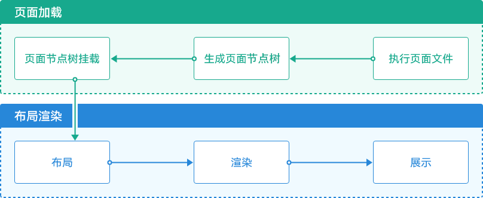
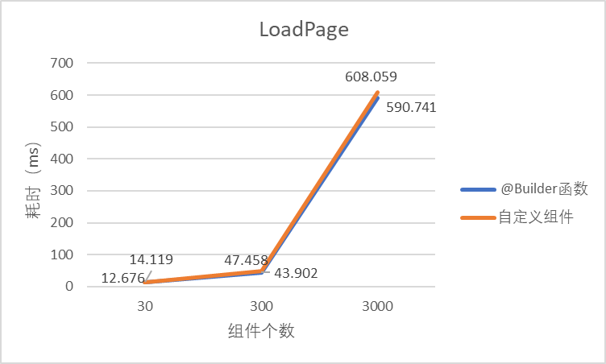
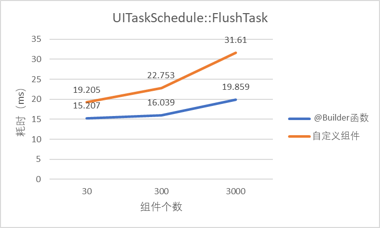
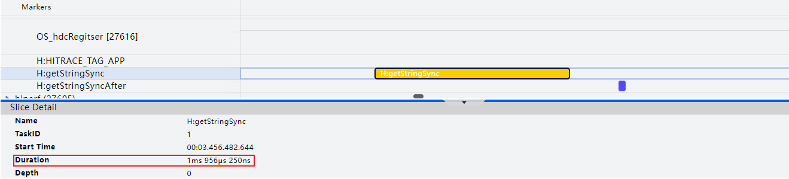
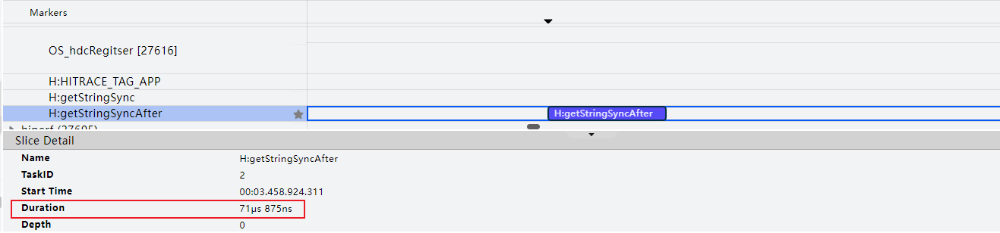
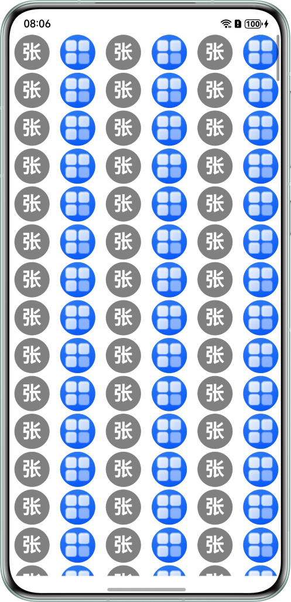
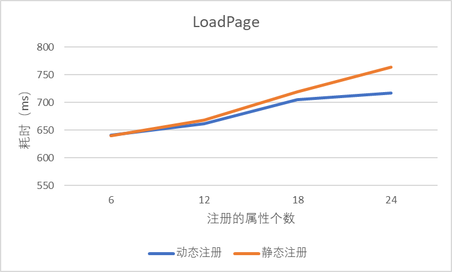
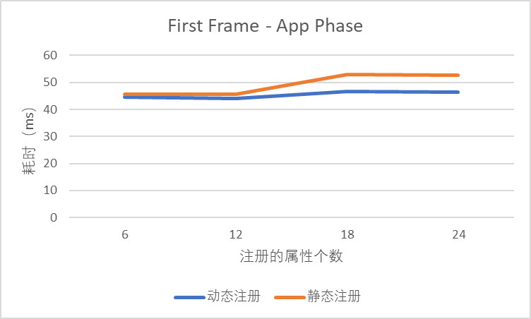
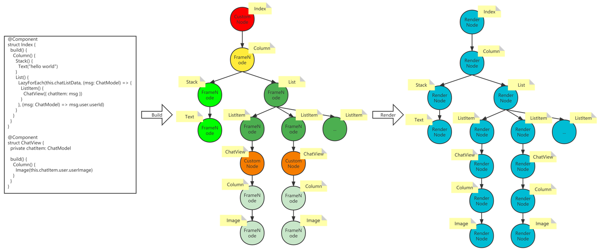
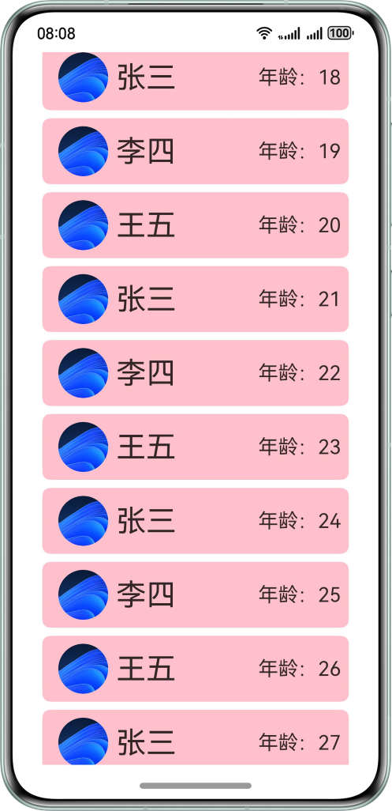

# UI组件性能优化

更新时间：2026-04-01 09:49:00

来源：https://developer.huawei.com/consumer/cn/doc/best-practices/bpta-ui-component-performance-optimization

**   

应用启动到UI页面展示过程包含框架初始化、页面加载和布局渲染三个步骤。其中页面加载和布局渲染的主要流程如下：
 
图1 **页面首次加载过程流程图
 



 
- 在执行页面文件时，前端UI描述会在后端创建相应的FrameNode节点树。该树主要用于处理UI组件属性更新、布局测算、事件处理。每个树节点和前端UI组件是一一对应的关系。
- FrameNode节点树生成之后，根节点开始创建布局任务。该任务遍历所有子节点并创建子节点的布局包装任务。布局包装任务包括执行相关测算和布局任务。
- 布局包装任务完成后，每个FrameNode将创建相应的渲染包装任务并进行内容绘制。

 
可以看到，应用启动后页面加载和渲染的性能与FrameNode树上的节点数量以及每个节点上的属性相关。因此，为缩短页面加载和布局渲染时长，在前端使用UI组件时可以考虑以下优化方案：
 
- 避免在自定义组件的生命周期内执行高耗时操作：自定义组件创建后在渲染前会调用其生命周期回调函数，若函数中包含高耗时操作将阻塞UI渲染，将增加主线程负担。
- 按需注册组件属性：后端在创建FrameNode节点树时，对于组件上注册的每个属性也会保存在FrameNode节点上，包括渲染类属性集合（如颜色）和布局类属性集合（如长宽，对齐方式）。在FrameNode执行布局包装任务和渲染包装任务时，属性集合将作为输入参与。因此，在应用开发中应按需注册组件属性，避免设置冗余属性。
- 使用@Builder函数代替自定义组件：前端定义的每一个自定义组件都会在后端FrameNode节点树上创建一对一的CustomNode类型的节点。CustomNode类作为FrameNode的子类，用于处理自定义组件相关业务逻辑。当在页面上大量使用自定义组件时，会成倍增加FrameNode节点树上CustomNode类型的节点数量，增加页面创建和渲染时长。因此，在满足业务需求的前提下，可以优先使用@Builder函数代替自定义组件。
- 合理使用布局容器组件：ArkUI提供了一系列布局容器组件用于开发者快速搭建页面，具体可参考[构建布局](https://developer.huawei.com/consumer/cn/doc/harmonyos-guides/arkts-build-layout)。不同的业务场景应选择合适的布局容器组件，并合理使用该组件的特性功能可以有效缩短页面布局时长。

 

##### 避免在自定义组件的生命周期内执行高耗时操作

**图2 **自定义组件生命周期流程图
 


 
如上图所示，自定义组件创建完成之后，在build函数执行之前，将先执行aboutToAppear()生命周期回调函数。此时若在该函数中执行耗时操作，将阻塞UI渲染，增加UI主线程负担。因此，应尽量避免在自定义组件的生命周期内执行高耗时操作。对于复杂计算的耗时场景，可以将计算结果进行缓存处理。对于不需要等待结果的高耗时任务，可以采用多线程处理该任务，通过并发的方式避免主线程阻塞。在aboutToAppear()生命周期函数内建议只做当前组件的初始化逻辑，其他业务逻辑可以按需提前或延后处理。假设在首页视频列表中的子组件内需要初始化创建一个复杂播放器对象，该对象的创建非常耗时。若在该组件的aboutToAppear()函数中创建该对象，当首页加载渲染时，列表内每个子组件的渲染都将等待相应的播放器对象初始化创建完成，此时页面加载将非常耗时甚至可能出现白屏。伪代码如下:
 
**反例**
 
```ArkTS
@Component
export struct VideoCard {
  // ...
  aboutToAppear(): void {
    // Create a complex object task, if the task takes 1s to execute, the component will be rendered again after 1s
    this.createComplexVideoPlayer();
  }
  // ...
}

@Component
export struct CardList {
  @State videoList: VideoItem[] = getVideoList();

  build() {
    List() {
      ForEach(this.videoList, (item: VideoItem) => {
        ListItem() {
          VideoCard({ item })
        }
      }, (item: VideoItem) => item.id)
    }
  }
}
```
 
 
对于该场景，可以考虑将创建播放器对象任务的时机延后。如，计算当前组件出现在页面中的位置，当子组件滑动到页面的三分之一处时再创建播放器对象并播放视频。此时，页面首次渲染时，不会出现主线程阻塞。示例代码如下：
 
**正例**
 
```ArkTS
@Component
export struct VideoCard {
  @State isVideoInit: boolean = false;
  // ...
  build() {
    Column() {
      // Video Playback Component
    }
    .onAreaChange((old, newValue) => {
      if (!this.isVideoInit) {
        let positionY: number = newValue.position.y as number
        if (positionY < screenHeight / 3) {
          this.createComplexVideoPlayer();
          this.isVideoInit = true;
        }
      }
    })
  }
  // ...
}

@Component
export struct CardList {
  @State videoList: VideoItem[] = getVideoList();

  build() {
    List() {
      ForEach(this.videoList, (item: VideoItem) => {
        ListItem() {
          VideoCard({ item })
        }
      }, (item: VideoItem) => item.id)
    }
  }
}
```
 
例如在生命周期aboutToAppear中应该避免使用[@ohos.resourceManager (资源管理)](https://developer.huawei.com/consumer/cn/doc/harmonyos-references/js-apis-resource-manager)的getXXXSync接口入参中直接使用资源信息，推荐使用资源id作为入参，推荐用法为：resourceManager.getStringSync(\$r('app.string.test').id)。 下面以[getStringSync](https://developer.huawei.com/consumer/cn/doc/harmonyos-references/js-apis-resource-manager#getstringsync10)为例，测试一下这两种参数在方法中的使用是否会有耗时区别。
 
**反例**
 
```ArkTS
import { hilog, hiTraceMeter } from '@kit.PerformanceAnalysisKit';
import { common } from '@kit.AbilityKit';
import { BusinessError } from '@kit.BasicServicesKit';

@Entry
@Component
struct Index {
  @State message: string = 'getStringSync';
  private context = this.getUIContext().getHostContext() as common.UIAbilityContext;

  aboutToAppear(): void {
    hiTraceMeter.startTrace('getStringSync', 1);
    // The input parameter of the getStringSync interface uses the resource directly, without using the resource ID.
    try {
      this.context.resourceManager.getStringSync($r('app.string.app_name'));
    } catch (error) {
      let err = error as BusinessError;
      hilog.warn(0x000, 'testTag', `getStringSync failed, code=${err.code}, message=${err.message}`);
    }
    hiTraceMeter.finishTrace('getStringSync', 1);
  }

  build() {
    RelativeContainer() {
      Text(this.message)
        .fontSize(50)
        .fontWeight(FontWeight.Bold)
    }
    .height('100%')
    .width('100%')
  }
}
```
 
可以通过[冷启动分析：Launch分析](https://developer.huawei.com/consumer/cn/doc/harmonyos-guides/ide-launch-overview)工具抓取Trace，根据hiTraceMeter性能打点，查看耗时为1.956ms。
 



 
**正例**
 
```ArkTS
import { hilog, hiTraceMeter } from '@kit.PerformanceAnalysisKit';
import { common } from '@kit.AbilityKit';
import { BusinessError } from '@kit.BasicServicesKit';

@Entry
@Component
struct Index {
  private context = this.getUIContext().getHostContext() as common.UIAbilityContext;
  @State message: string = 'getStringSyncAfter';

  aboutToAppear(): void {
    hiTraceMeter.startTrace('getStringSyncAfter', 2);
    // The input parameter of the getStringSync interface uses the resource ID.
    try {
      this.context.resourceManager.getStringSync($r('app.string.app_name').id);
    } catch (error) {
      let err = error as BusinessError;
      hilog.warn(0x000, 'testTag', `getStringSync failed, code=${err.code}, message=${err.message}`);
    }
    hiTraceMeter.finishTrace('getStringSyncAfter', 2);
  }

  build() {
    RelativeContainer() {
      Text(this.message)
        .fontSize(50)
        .fontWeight(FontWeight.Bold)
    }
    .height('100%')
    .width('100%')
  }
}
```
 
可以通过[冷启动分析：Launch分析](https://developer.huawei.com/consumer/cn/doc/harmonyos-guides/ide-launch-overview)工具抓取Trace，根据hiTraceMeter性能打点，查看耗时为0.071ms。
 

 



  
| 写法 | 耗时情况 |
| --- | --- |
| 资源信息为参数：getStringSync(\$r('app.string.app_name')) | 1.956ms |
| 资源ID为参数：getStringSync(\$r('app.string.app_name').id) | 0.071ms |
 
 
可得出结论：参数为资源信息时比参数为资源ID值时耗时更多。所以当需要使用类似方法时，使用资源ID值作为参数更优，可有效减少自定义组件生命周期耗时。
 

##### 按需注册组件属性

在使用组件开发应用UI界面时，会为每个组件设置属性，进行UI样式、行为等逻辑处理。当应用中单个组件设置了大量属性且该组件在应用中被大量使用时，单个组件的设置对应用的整体性能会产生较大影响。比如，在RN框架开发中，单个组件需要设置21个属性，且该组件在ForEach循环中使用。在该场景下，由于不知道应用实际需要使用哪些属性，因此把所有的属性通过属性方法的方式设置到组件上。而在实际使用中，大部分应用只会用到其中很少的几个属性，其他属性均维持默认值，这导致了大量属性的冗余设置。该场景示例代码片段如下：
 
```ArkTS
build() {
  Stack() {
    this.renderChildren()
  }
  .width(this.descriptor.layoutMetrics.frame.size.width)
  .height(this.descriptor.layoutMetrics.frame.size.height)
  .backgroundColor(convertColorSegmentsToString(this.descriptor.props.backgroundColor))
  .position({ y: this.descriptor.layoutMetrics.frame.origin.y, x: this.descriptor.layoutMetrics.frame.origin.x })
  .borderWidth(this.descriptor.props.borderWidth)
  .borderColor({
    left: convertColorSegmentsToString(this.descriptor.props.borderColor.left),
    top: convertColorSegmentsToString(this.descriptor.props.borderColor.top),
    right: convertColorSegmentsToString(this.descriptor.props.borderColor.right),
    bottom: convertColorSegmentsToString(this.descriptor.props.borderColor.bottom)
  })
  .borderRadius(this.descriptor.props.borderRadius)
  .borderStyle(this.getBorderStyle())
  .opacity(this.getOpacity())
  .transform(this.descriptor.props.transform != undefined ? convertMatrixArrayToMatrix4(this.descriptor.props.transform) : undefined)
  .clip(this.getClip())
  .hitTestBehavior(this.getHitTestMode())
  .shadow(this.getShadow())
}
```
 
从该场景中可以看到，在应用开发中，当注册了大量冗余属性的组件需要在视图上批量展示时对性能有较大影响。此时，可以考虑采用[动态属性设置](https://developer.huawei.com/consumer/cn/doc/harmonyos-references/ts-universal-attributes-attribute-modifier)动态注册组件属性的方式，替换使用属性方法静态注册组件属性的方式。
 
使用AttributeModifier动态注册组件属性相比于直接在组件上使用属性方法静态注册组件属性，主要存在以下两点区别：
 
- 动态注册属性：系统提供AttributeModifier接口，支持开发者自定义AttributeModifier接口的实现类。 当应用运行时，系统调用AttributeModifier接口的实现类中与组件样式相关的方法，在该方法内按照开发者自定义的业务逻辑动态设置组件属性。
- Diff更新属性：当组件创建或者更新时，重新执行组件的样式属性对象的更新接口。属性Diff逻辑基于Map实现，其中key值是属性类型，value值是属性修改器对象。更新场景下，通过key找到对应的属性修改器对象进行Diff对比，若有更新变化再通知native侧进行属性更新。

 
以一个简单的公共头像组件为例演示AttributeModifier方案的性能收益。公共头像组件要求对于有用户头像的数据，界面展示用户头像图片。对于没有用户头像的数据，界面展示灰色背景和用户名的第一个字符。现列表展示1000个头像组件，界面效果如下：
 
**图3 **表格展示头像组件界面



 
 
使用属性方法的方式给头像组件设置属性，代码如下：
 
```ArkTS
import { util } from '@kit.ArkTS';

@Observed
class User {
  id: string;
  name: string;
  avatarImage: ResourceStr;

  constructor(id: string, name: string, avatarImage: ResourceStr) {
    this.id = id;
    this.name = name;
    this.avatarImage = avatarImage;
  }
}

//create data
const DEFAULT_BACKGROUND_COLOR = Color.Grey;
const getUsers = () => {
  return Array.from(Array(1000), (item: User, i: number) => {
    return new User(
      util.generateRandomUUID(),
      i % 2 === 0 ? '张三' : '李四',
      i % 2 === 0 ? '' : $r('app.media.startIcon')
    );
  });
}

@Component
export struct AvatarGrid {
  @State users: User[] = getUsers();

  build() {
    Grid() {
      ForEach(this.users, (u: User) => {
        GridItem() {
          Avatar({ user: u })
        }
      }, (user: User) => user.id)
    }
    .columnsTemplate('1fr 1fr 1fr 1fr 1fr 1fr')
    .columnsGap(4)
    .rowsGap(4)
  }
}

// Avatar component
@Component
struct Avatar {
  @ObjectLink user: User;

  build() {
    Row() {
      if (!this.user.avatarImage) {
        Text(this.user.name.charAt(0))
          .fontSize(28)
          .fontColor(Color.White)
          .fontWeight(FontWeight.Bold)
      }
    }
    .backgroundImage(this.user.avatarImage)
    .backgroundImageSize(ImageSize.Cover)
    .backgroundColor(DEFAULT_BACKGROUND_COLOR)
    .justifyContent(FlexAlign.Center)
    .size({ width: 50, height: 50 })
    .borderRadius(25)

    // .padding(2)
    // .margin(2)
    // .opacity(1)
    // .clip(false)
    // .layoutWeight(1)
    // .backgroundBlurStyle(BlurStyle.NONE)
    // .alignItems(VerticalAlign.Center)
    // .borderWidth(1)
    // .borderColor(Color.Pink)
    // .borderStyle(BorderStyle.Solid)
    // .expandSafeArea([SafeAreaType.SYSTEM])
    // .rotate({angle: 5})
    // .responseRegion({x: 0})
    // .mouseResponseRegion({x: 0})
    // .constraintSize({minWidth: 25})
    // .hitTestBehavior(HitTestMode.Default)
    // .backgroundImagePosition(Alignment.Center)
    // .foregroundBlurStyle(BlurStyle.NONE)
  }
}
```
 
将方案改为采用AttributeModifier动态注册属性的方式，需要新增自定义类实现AttributeModifier接口，并修改Avatar组件的属性注册逻辑。具体改动代码如下：
 
```ArkTS
// 1.Custom Attribute Modifier, this class implements the AttributeModifier interface
class RowModifier implements AttributeModifier<RowAttribute> {
  private customImage: ResourceStr = '';
  private static instance: RowModifier;

  constructor() {
  }

  setCustomImage(customImage: ResourceStr) {
    this.customImage = customImage;
    return this;
  }

  // Adopting a singleton pattern avoids creating a new modifier for each component, increasing the performance overhead incurred by creating the
  public static getInstance(): RowModifier {
    if (!RowModifier.instance) {
      RowModifier.instance = new RowModifier();
    }
    return RowModifier.instance;
  }

  // 2.Implement the applyNormalAttribute method of the AttributeModifier interface to customize the logic of attribute setting.
  applyNormalAttribute(instance: RowAttribute) {
    if (this.customImage) {
      instance.backgroundImage(this.customImage);
      instance.backgroundImageSize(ImageSize.Cover);
    } else {
      instance.backgroundColor(Color.Blue);
      instance.justifyContent(FlexAlign.Center);
      // instance.padding(2)
      // instance.margin(2)
      // instance.opacity(1)
      // instance.clip(false)
      // instance.layoutWeight(1)
      // instance.backgroundBlurStyle(BlurStyle.NONE)
      // instance.alignItems(VerticalAlign.Center)
      // instance.borderWidth(1)
      // instance.borderColor(Color.Pink)
      // instance.borderStyle(BorderStyle.Solid)
      // instance.expandSafeArea([SafeAreaType.SYSTEM])
      // instance.rotate({ angle: 5 })
      // instance.responseRegion({x: 0})
      //instance.mouseResponseRegion({x: 0})
      // instance.constraintSize({minWidth: 25})
      // instance.hitTestBehavior(HitTestMode.Default)
      //instance.backgroundImagePosition(Alignment.Center)
      //instance.foregroundBlurStyle(BlurStyle.NONE)
    }
    instance.size({ width: 50, height: 50 });
    instance.borderRadius(25);
  }
}


@Component
struct Avatar {
  @ObjectLink user: User;

  build() {
    Row() {
      if (!this.user.avatarImage) {
        Text(this.user.name.charAt(0))
          .fontSize(28)
          .fontColor(Color.White)
          .fontWeight(FontWeight.Bold)
      }
    }
    // 3.Pass a custom RowModifier class as a parameter to enable on-demand property registration
    .attributeModifier(RowModifier.getInstance().setCustomImage(this.user.avatarImage))
  }
}
```
 
对于上述两种方案，逐渐增加注册的属性个数，通过DevEco Studio提供的Launch场景分析能力获取两个方案的页面加载耗时（PageRouterManager::LoadPage）和应用侧首帧耗时（First Frame - App Phase），对比如下：
  
|    | 静态注册属性 | 动态注册属性 |
| --- | --- | --- |
| 注册的属性个数 | 6个 | 12个 | 18个 | 24个 | 6个 | 12个 | 18个 | 24个 |
| PageRouterManager::LoadPage | 639ms900μs | 668ms624μs | 719ms139μs | 764ms437μs | 640ms989μs | 662ms112μs | 705ms407μs | 717ms294μs |
| First Frame - App Phase | 45ms554μs | 45ms638μs | 52ms918μs | 52ms643μs | 44ms603μs | 43ms923μs | 46ms709μs | 46ms355μs |
 
 
**图4 **静态注册属性和动态注册属性在不同属性数量下LoadPage耗时**


 
图5 **静态注册属性和动态注册属性在不同属性数量下First Frame - App Phase耗时**


 
可以看到，当注册的属性个数较少时，使用动态注册的方案收益并不明显。当注册的属性个数递增时，动态注册的收益效果同步线性递增。
 
 

##### 优先使用@Builder方法代替自定义组件

在ArkUI中使用自定义组件时，在build阶段将在后端FrameNode树创建一个相应的CustomNode节点，在渲染阶段时也会创建对应的RenderNode节点，如下图所示。
 
图6 **前后端UI组件树关系图**


 

 
- 前端UI描述结构会在后端创建相应的FrameNode节点树；
- FrameNode节点树主要用于处理UI组件属性更新、布局测算、事件处理等业务逻辑；
- CustomNode作为FrameNode的子类，用于处理自定义组件相关业务逻辑，比如执行build函数。
- FrameNode节点树在渲染阶段生成后端渲染树进行UI渲染。

 
因此，在应用开发时，减少自定义组件的使用，尤其是自定义组件在循环中的使用，将成倍减少FrameNode节点树上CustomNode节点数量，有效缩短页面的加载和渲染时长。当在应用中使用自定义组件时，可以优先考虑使用@Builder函数代替自定义组件，@Builder函数不会在后端FrameNode节点树上创建一个新的树节点。
 


 

@Builder装饰器严格禁止在其内部定义状态变量[状态变量](https://developer.huawei.com/consumer/cn/doc/harmonyos-guides/arkts-state-management-glossary#状态变量state-variables)或使用[生命周期函数](https://developer.huawei.com/consumer/cn/doc/harmonyos-references/ts-custom-component-lifecycle)，必须通过参数传递或者访问所属组件的状态变量完成数据交互。
 
当组件仅作展示，无需使用@Component自定义组件的内部状态变量、生命周期函数时，可以创建一个@Builder函数代替创建@Component自定义组件。
 

 
例如，在使用ForEach循环展示卡片列表信息时，界面展示如下：
 
图7 **卡片列表界面
 

 



 
使用自定义组件方案，示例代码如下：
 
```ArkTS
import { util } from '@kit.ArkTS';

interface User {
  id: string;
  name: string;
  age?: number;
  avatarImage?: ResourceStr;
  //introduction: string;
  // ...
}

// create data
const DEFAULT_BACKGROUND_COLOR = Color.Pink;
const getUsers = () => {
  const USERS: User[] = [{
    id: '1',
    name: '张三',
  }, {
    id: '2',
    name: '李四',
  }, {
    id: '3',
    name: '王五',
  }];
  return Array.from(Array(30), (item: User, i: number) => {
    return {
      id: util.generateRandomUUID(),
      name: USERS[i%3].name,
      avatarImage: $r('app.media.startIcon'),
      age: 18 + i
    } as User;
  });
}

// User Card List Component
@Component
export struct UserCardList {
  @State users: User[] = getUsers();

  build() {
    List({ space: 8 }) {
      ForEach(this.users, (item: User) => {
        ListItem() {
          UserCard({ name: item.name, age: item.age, avatarImage: item.avatarImage })
        }
      }, (item: User) => item.id)
    }
    .alignListItem(ListItemAlign.Center)
  }
}

// User Card Customization Component
@Component
struct UserCard {
  @Prop avatarImage: ResourceStr;
  @Prop name: string;
  @Prop age: number;

  build() {
    Row() {
      Row() {
        Image(this.avatarImage)
          .size({ width: 50, height: 50 })
          .borderRadius(25)
          .margin(8)
        Text(this.name)
          .fontSize(30)
      }
      Text(`age：${this.age.toString()}`)
        .fontSize(20)
    }
    .backgroundColor(DEFAULT_BACKGROUND_COLOR)
    .justifyContent(FlexAlign.SpaceBetween)
    .borderRadius(8)
    .padding(8)
    .height(66)
    .width('80%')
  }
}
```
 
改用@Builder函数的方式代替自定义组件UserCard的方案，具体修改的代码如下:
 
```ArkTS
// 1. Customizing @Builder Function Components
@Builder
function UserCardBuilder(name: string, age?: number, avatarImage?: ResourceStr) {
  Row() {
    Row() {
      Image(avatarImage)
        .size({ width: 50, height: 50 })
        .borderRadius(25)
        .margin(8)
      Text(name)
        .fontSize(30)
    }
    Text(`age：${age?.toString()}`)
      .fontSize(20)
  }
  .backgroundColor(Color.Blue)
  .justifyContent(FlexAlign.SpaceBetween)
  .borderRadius(8)
  .padding(8)
  .height(66)
  .width('80%')
}

@Component
export struct UserCardList {
  @State users: User[] = getUsers();

  build() {
    List({ space: 8 }) {
      ForEach(this.users, (item: User) => {
        ListItem() {
          // 2. Using the @Builder function in a build function
          UserCardBuilder(item.name, item.age, item.avatarImage)
        }
      }, (item: User) => item.id)
    }
    .alignListItem(ListItemAlign.Center)
  }
}
```
 
将组件数量从30个递增到3000个，通过profiler获取页面加载标签PageRouterManager::LoadPage和页面UI刷新任务标签UITaskScheduler::FlushTask的耗时，对比两种方案的耗时如下：
 
**图8 **两种方案LoadPage标签耗时对比**


 
图9 **两种方案UITaskSchedule标签耗时对比



 
通过对比图可以看到，@Builder方案在页面加载和刷新UI页面（包括布局、渲染和动画）方面优于自定义组件方案。随着组件个数增加，收益也线性增加。
 
 

##### 合理使用布局容器组件

对于需要展示大量组件的场景，通常会使用布局容器组件，以达到快速实现页面布局的需求。在使用布局容器组件时，由于一次需要展示多个组件，可能出现首帧耗时过长甚至掉帧问题。此时可以考虑对容器组件内的子组件进行按需加载或懒加载等处理，对于相同结构的组件也可以使用组件复用能力。针对每个布局容器组件的性能优化可以参考[布局优化指导](https://developer.huawei.com/consumer/cn/doc/best-practices/bpta-improve-layout-performance)。
 
 

##### 示例代码

- [UI组件性能优化同源示例代码](https://gitcode.com/harmonyos_samples/BestPracticeSnippets/tree/master/ArkUI/UI_Component_Performance_Optimization)
