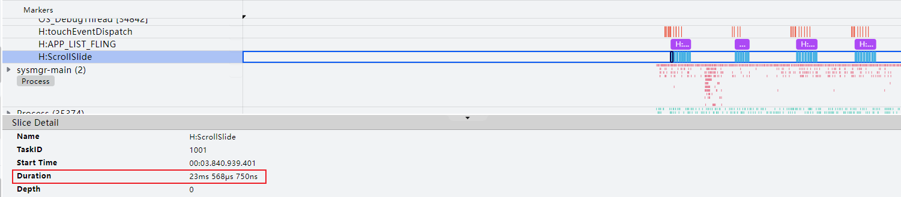
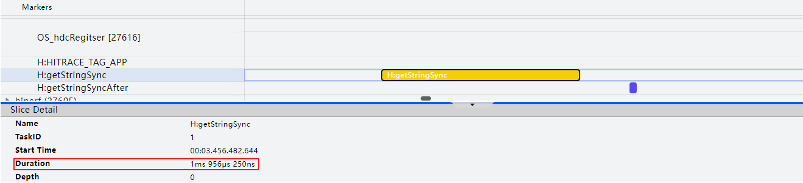
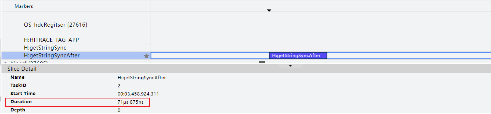
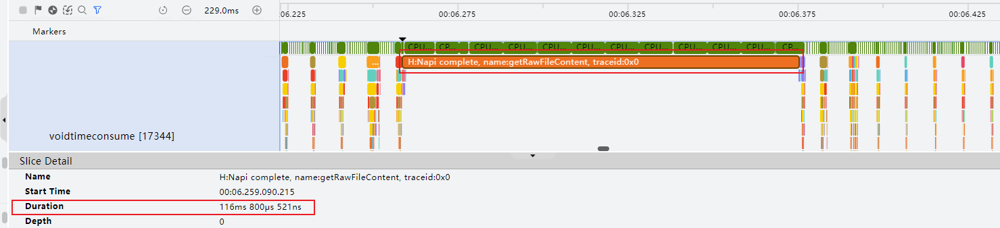
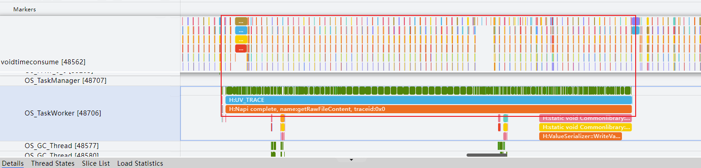
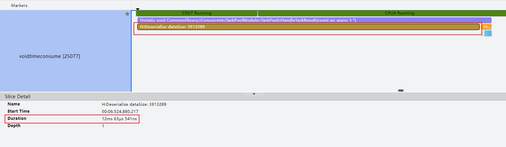
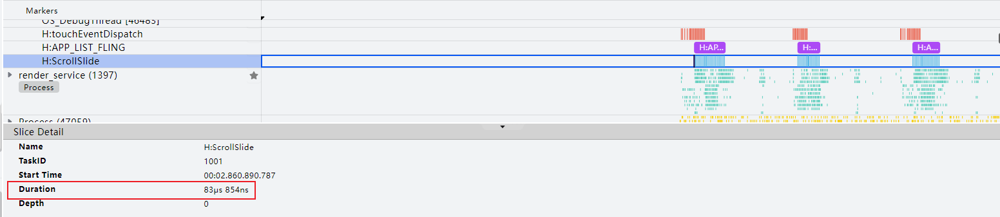
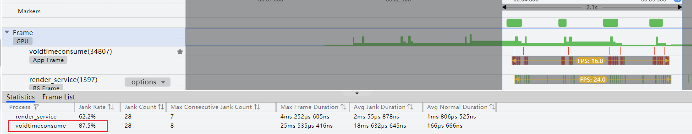
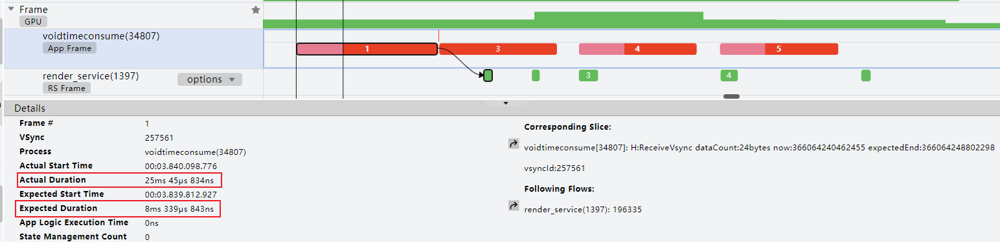
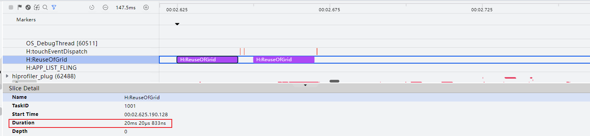

# 主线程耗时操作优化

更新时间：2026-03-12 08:45:02

来源：https://developer.huawei.com/consumer/cn/doc/best-practices/bpta-time-optimization-of-the-main-thread

**   


#### 概述

在应用开发实践中，有效避免主线程执行冗余与易耗时操作是至关重要的策略。此举能有效降低主线程负载，提升UI的响应速度。面对高频回调接口在短时间内密集触发的场景，需要避免接口内的耗时操作，尽量保证主线程不被长时间占用，从而防止阻塞UI渲染，引发界面卡顿。本文介绍开发过程中常见的冗余操作，常见的高频回调场景以及其他主线程优化思路。
 
 

#### 常见冗余操作

在软件开发中，冗余操作指的是那些不必要、重复执行且对程序功能无实质性贡献的操作。这些操作不仅会浪费计算资源，还可能降低程序的运行效率，特别是在高频调用的场景下，其负面影响更为显著。下面列举一些release版本中常见的冗余操作：
 
- debug日志打印
- Trace打点
- 冗余空回调
> [!NOTE]
> 建议开发者优先使用 Code Linter扫描工具 进行代码检查，重点关注 @performance/hp-arkui-avoid-empty-callback 规则。若扫描结果中出现该规则相关问题，可参考本章节提供的优化建议进行调整。


 
【反例】：release版本中冗余日志打印，Trace打点，以及无业务代码的空回调
 
```ArkTS
import { hilog, hiTraceMeter } from '@kit.PerformanceAnalysisKit';

// Redundant operations are counterexamples
@Entry
@Component
struct RedundantOperation {
  private arr: number[] = [];

  aboutToAppear(): void {
    for (let i = 0; i < 500; i++) {
      this.arr[i] = i;
    }
  }

  build() {
    Column() {
      Row({ space: 5 }) {
        Column() {
          Image($r('app.media.chevron_left'))
            .width(16)
            .height(16)
        }
        .width(40)
        .height(40)
        .justifyContent(FlexAlign.Center)
        .backgroundColor('#E8E8E8')
        .borderRadius(40)
        .onClick(() => {
          this.getUIContext().getRouter().back({
            url: 'pages/Index'
          });
        })

        Text('Redundant operations')
          .fontSize(20)
          .fontWeight(700)
          .height(26)
      }
      .width('100%')
      .height(56)
      .margin({ top: 36 })

      Scroll() {
        List() {
          ForEach(this.arr, (item: number) => {
            ListItem() {
              Text('TextItem' + item)
                .width('100%')
                .padding({ left: 12 })
            }
            .onAreaChange(() => {
              // No business operations
              // Negative example.
            })
            .width('100%')
            .height(48)
          }, (item: number) => item.toString())
        }
        .divider({ strokeWidth: 1, color: '#F5F5F5' })
        .width('100%')
        .height('100%')
      }
      .width('100%')
      .height('86%')
      .margin({ top: 8 })
      .backgroundColor(Color.White)
      .borderRadius(20)
      .onWillScroll(() => {
        hiTraceMeter.startTrace('ScrollSlide', 1001);

        hilog.debug(0x0000, 'Sample', 'Debug %{public}s', 'contents: logs');
        // Business logic
        // ...
        hiTraceMeter.finishTrace('ScrollSlide', 1001);
      })
    }
    .backgroundColor('#F5F5F5')
    .height('100%')
    .padding({ left: 16, right: 16, bottom: 16 })
  }
}
```
 
【正例】：release版本中删除冗余的debug日志，Trace打点以及无业务代码的空回调
 
```ArkTS
// Redundancy operation example
@Entry
@Component
struct NoRedundantOperation {
  private arr: number[] = [];

  aboutToAppear(): void {
    for (let i = 0; i < 500; i++) {
      this.arr[i] = i;
    }
  }

  build() {
    Column() {
      Row({ space: 5 }) {
        Column() {
          Image($r('app.media.chevron_left'))
            .width(16)
            .height(16)
        }
        .width(40)
        .height(40)
        .justifyContent(FlexAlign.Center)
        .backgroundColor('#E8E8E8')
        .borderRadius(40)
        .onClick(() => {
          this.getUIContext().getRouter().back({
            url: 'pages/Index'
          });
        })

        Text('No redundant operations')
          .fontSize(20)
          .fontWeight(700)
          .height(26)
      }
      .width('100%')
      .height(56)
      .margin({ top: 36 })

      Scroll() {
        List() {
          ForEach(this.arr, (item: number) => {
            ListItem() {
              Text('TextItem' + item)
                .width('100%')
                .padding({ left: 12 })
            }
            .width('100%')
            .height(48)
          }, (item: number) => item.toString())
        }
        .divider({ strokeWidth: 1, color: '#F5F5F5' })
        .width('100%')
        .height('100%')
      }
      .margin({ top: 8 })
      .width('100%')
      .height('86%')
      .backgroundColor(Color.White)
      .borderRadius(20)
      .onWillScroll(() => {
        // Business logic
        // ...
  }
}
```
 
图1 **反例标签"H:ScrollSlide"Trace图**


 
通过上图可知，在3.5s的滑动过程中，总计触发了424次日志打印以及Trace追踪，打印一次日志的平均耗时为84μs，由此可以计算出冗余的debug日志浪费了35.616ms。release版本建议删除无效日志的打印。
 
对于回调函数体内不包含任何业务逻辑代码的冗余回调而言，即使开发者在回调函数内部未进行任何实质性的操作，只要注册了回调接口，如onAreaChange，系统底层仍会耗费资源去监测对应事件的发生，例如计算组件的位置或大小变化，并将这些数据传递给ArkTS侧。即使这些数据最终在ArkTS层没有被有效利用，底层的计算和通信开销已然存在。所以，为了避免不必要的资源消耗，提升应用性能，应当仔细审查并移除这类无实际用途的回调函数注册。开发过程中，除了需要避免冗余操作，还需要注意避免在高频回调场景执行耗时操作，接下来介绍一下高频回调场景以及需要避免的耗时操作。
 
 

#### 高频回调场景

高频回调接口通常是指在应用程序运行过程中会被频繁触发的事件或回调函数，以下常见高频回调场景中需要避免执行耗时操作:
 
- [高频事件回调](#section204221336134312)
- [组件复用回调](#section20815336174316)
- [组件生命周期回调](#section418843713435)
- [循环渲染](#section4551193714439)
- [组件属性](#section166841738154316)

 
 

#### 高频事件回调

例如，触摸事件、拖拽事件、移动事件、组件区域变化事件、滑动事件等系统事件在应用程序运行过程中会被频繁触发，如果在这些回调接口中执行耗时操作，将导致应用出现卡顿丢帧的问题。下方是基于Scroll组件滑动时会高频调用onWillScroll的场景，分析性能差异。
 
**场景案例**
 
【案例一】在onWillScroll回调中执行耗时操作
 
```ArkTS
// onWillScroll high-frequency event callback counterexample
@Entry
@Component
struct NegativeOfOnScroll {
  private arr: number[] = [1, 2, 3, 4, 5, 6, 7, 8, 9, 10];

  count(): number {
    let temp: number = 0;
    for (let i = 0; i < 1000000; i++) {
      temp += 1;
    }
    return temp;
  }

  build() {
    Column() {
      Row({ space: 5 }) {
        Column() {
          Image($r('app.media.chevron_left'))
            .width(16)
            .height(16)
        }
        .width(40)
        .height(40)
        .justifyContent(FlexAlign.Center)
        .backgroundColor('#E8E8E8')
        .borderRadius(40)
        .onClick(() => {
          this.getUIContext().getRouter().back({
            url: 'pages/Index'
          });
        })

        Text($r('app.string.negative_of_onScroll'))
          .fontSize(20)
          .fontWeight(700)
          .height(26)
      }
      .width('100%')
      .height(56)
      .margin({ top: 20 })

      Scroll() {
        List() {
          ForEach(this.arr, (item: number) => {
            ListItem() {
              Text('TextItem' + item)
                .width('100%')
                .padding({ left: 12 })
            }
            .width('100%')
            .height(48)
          }, (item: number) => item.toString())
        }
        .divider({ strokeWidth: 1, color: '#F5F5F5' })
        .width('100%')
        .height('100%')
      }
      .width('100%')
      .height(492)
      .margin({ top: 8 })
      .backgroundColor(Color.White)
      .borderRadius(20)
      .onWillScroll(() => {
        hiTraceMeter.startTrace('ScrollSlide', 1001);
        hilog.info(0x0000, 'Sample', '%{public}s', 'Scroll TextItem');
        // Time-consuming operation
        this.count();
        // Business logic
        // ...
        hiTraceMeter.finishTrace('ScrollSlide', 1001);
      })
    }
    .padding(16)
    .height('100%')
    .backgroundColor('#F5F5F5')
  }
}
```
 
【案例二】onWillScroll回调中不执行耗时操作
 
```ArkTS
// onWillScroll high-frequency event callback positive example
@Entry
@Component
struct PositiveOfOnScroll {
  private arr: number[] = [1, 2, 3, 4, 5, 6, 7, 8, 9, 10];

  build() {
    Column() {
      Row({ space: 5 }) {
        Column() {
          Image($r('app.media.chevron_left'))
            .width(16)
            .height(16)
        }
        .width(40)
        .height(40)
        .justifyContent(FlexAlign.Center)
        .backgroundColor('#E8E8E8')
        .borderRadius(40)
        .onClick(() => {
          this.getUIContext().getRouter().back({
            url: 'pages/Index'
          });
        })

        Text($r('app.string.positive_of_onScroll'))
          .fontSize(20)
          .fontWeight(700)
          .height(26)
      }
      .width('100%')
      .height(56)
      .margin({ top: 20 })

      Scroll() {
        List() {
          ForEach(this.arr, (item: number) => {
            ListItem() {
              Text('TextItem' + item)
                .width('100%')
                .padding({ left: 12 })
            }
            .width('100%')
            .height(48)
          }, (item: number) => item.toString())
        }
        .divider({ strokeWidth: 1, color: '#F5F5F5' })
        .width('100%')
        .height('100%')
      }
      .width('100%')
      .height(492)
      .margin({ top: 8 })
      .backgroundColor(Color.White)
      .borderRadius(20)
      .onWillScroll(() => {
        hiTraceMeter.startTrace('ScrollSlide', 1001);
        hilog.info(0x0000, 'Sample', '%{public}s', 'Scroll TextItem');
        // Business logic
        // ...
        hiTraceMeter.finishTrace('ScrollSlide', 1001);
      })
    }
    .padding(16)
    .height('100%')
    .backgroundColor('#F5F5F5')
  }
}
```
 
 
**结果对比**
 
下面将通过自定义Trace打点，统计不同案例场景下，单次onWillScroll事件回调的耗时差异，帧率差异以及分析。
 
- 耗时对比

 
图2 **案例一onWillScroll事件回调耗时**


 
图3 **案例二onWillScroll事件回调耗时**


 
- 帧率对比

 
图4 **onWillScroll执行耗时操作的丢帧率**


 
图5 **onWillScroll不执行耗时操作的丢帧率**


 
图6 **首帧Trace详细信息**


 
通过图2、图3可知，onWillScroll事件回调中带有耗时操作，会占用主线程20ms左右的时间。由图4可知在具有耗时操作的滑动过程中，丢帧率高达87.5%。观察图6卡顿首帧Trace的详细信息发现，原本期望完成时间为8.3ms。因为onWillScroll中耗时操作的影响，使得实际处理时间为25ms，远超期望时间，短时间内连续触发该回调就会导致发生连续丢帧现象。因此在开发过程中，开发者应该尽量避免在高频事件回调中处理耗时操作，否则将导致应用性能大幅下降。
 
> [!NOTE]
> 本案例在onWillScroll事件回调的开始开启打点追踪，在事件回调结束前停止性能打点追踪，用以测试有无耗时操作的性能差异。关于本例中使用性能打点的介绍，请参考 @ohos.hiTraceMeter (性能打点) 。案例中关于帧率检测，丢帧分析，请参考 帧率问题分析 。 由于本章节各场景的帧率数据统计以及分析步骤与方式大体一致，下文将不再对各场景的帧率进行重复统计分析。

 

#### 组件复用回调

在滑动场景中，使用组件复用通常需要用生命周期回调aboutToReuse去更新组件的状态变量。在滑动时，aboutToReuse会被频繁调用。如果在aboutToReuse中进行了耗时操作，将导致应用出现卡顿丢帧的问题。下面的案例将基于Grid懒加载组件复用场景进行分析。
 
**场景案例**
 
【反例】：在aboutToReuse中进行耗时操作
 
```ArkTS
// ...
// Simulate time-consuming operations with loop functions
count(): number {
  let temp: number = 0;
  for (let index = 0; index < 1000000; index++) {
    temp += 1;
  }
  return temp;
}

aboutToReuse(params: Record<string, number>): void {
  hiTraceMeter.startTrace('ReuseOfGrid', 1001);
  this.item = params.item;
  // Simulate time-consuming operations
  this.count();
  hiTraceMeter.finishTrace('ReuseOfGrid', 1001);
}

// ...
```
 
【正例】：在aboutToReuse中不进行耗时操作
 
```ArkTS
// ...
aboutToReuse(params: Record<string, number>): void {
  hiTraceMeter.startTrace('ReuseOfGrid', 1001);
  this.item = params.item;
  hiTraceMeter.finishTrace('ReuseOfGrid', 1001)
}

// ...
```
 
**结果对比**
 
图7 **反例滑动时单个aboutToReuse耗时**


 
图8 **正例滑动时单个aboutToReuse耗时**


 
如图7所示，从反例Trace中“H:ReuseOfGrid”标签可以看出，单个aboutToReuse执行耗时20ms。而从图8正例Trace中“H:ReuseOfGrid”标签看，单个aboutToReuse执行耗时仅56μs。带有耗时操作的单个aboutToReuse执行耗时远超期望时间8.3ms，在Grid滑动高频调用aboutToReuse的场景中，将会导致应用连续丢帧卡顿，性能大幅下降。因此，组件复用时应避免在aboutToReuse中执行耗时操作。
 
 

#### 组件生命周期回调

在需要频繁创建和销毁组件的场景中，将会频繁调用组件生命周期回调aboutToAppear，aboutToDisappear。下面是一个使用条件渲染，通过点击按钮切换自定义组件A和B来模拟频繁创建和销毁组件的场景示例。
 
在自定义组件A，B的生命周期回调函数aboutToAppear和aboutToDisappear中加入耗时操作。
 
```ArkTS
import { hilog } from '@kit.PerformanceAnalysisKit';

@Entry
@Component
struct MyComponent {
  // Toggles the custom component flag
  @State flag: boolean = false;

  build() {
    Column({ space: 10 }) {
      Row({ space: 5 }) {
        Column() {
          // $r('app.media.chevron_left') It needs to be replaced with the resources required by the developers
          Image($r('app.media.chevron_left'))
            .width(16)
            .height(16)
        }
        .width(40)
        .height(40)
        .justifyContent(FlexAlign.Center)
        .backgroundColor('#E8E8E8')
        .borderRadius(40)
        .onClick(() => {
          this.getUIContext().getRouter().back({
            url: 'pages/Index'
          });
        })

        Text('Conditional rendering')
          .fontSize(20)
          .fontWeight(700)
          .height(26)
      }
      .width('100%')
      .height(56)
      .margin({ top: 36 })

      // Use conditional rendering to simulate a scene where components are frequently created and destroyed with the click of a button
      if (this.flag) {
        // Custom component A
        CustomComponentA()
      } else {
        // Custom component B
        CustomComponentB()
      }
      Button('switch custom component')
        .width('100%')
        .backgroundColor('#0A59F7')
        .onClick(() => {
          // Click the button to switch to the custom component
          this.flag = !this.flag;
        })
    }
    .width('100%')
    .height('100%')
    .justifyContent(FlexAlign.SpaceBetween)
    .padding({ left: 16, right: 16, bottom: 44 })
    .backgroundColor('#F5F5F5')
  }
}

@Component
struct CustomComponentA {
  aboutToAppear(): void {
    let temp: number = 0;
    for (let i = 0; i < 1000000; i++) {
      temp += 1;
    }
    hilog.info(0x0001, 'Sample', `%{public}s', 'CustomComponentA aboutToAppear ${temp}`);
  }

  aboutToDisappear(): void {
    let temp: number = 0;
    for (let i = 0; i < 1000000; i++) {
      temp += 1;
    }
    hilog.info(0x0001, 'Sample', '%{public}s', `CustomComponentA aboutToDisappear ${temp}`);
  }

  build() {
    Column()
      .backgroundColor(Color.Blue)
      .width(200)
      .height(200)
  }
}

@Component
struct CustomComponentB {
  aboutToAppear(): void {
    let temp: number = 0;
    for (let i = 0; i < 1000000; i++) {
      temp += 1;
    }
    hilog.info(0x0001, 'Sample', '%{public}s', `CustomComponentB aboutToAppear ${temp}`);
  }

  aboutToDisappear(): void {
    let temp: number = 0;
    for (let i = 0; i < 1000000; i++) {
      temp += 1;
    }
    hilog.info(0x0001, 'Sample', '%{public}s', `CustomComponentB aboutToDisappear ${temp}`);
  }

  build() {
    Column()
      .backgroundColor(Color.Gray)
      .width(200)
      .height(200)
  }
}
```
 
因为示例中使用了条件渲染，每次销毁前一个自定义组件都会调用一次aboutToDisappear函数，然后创建新的自定义组件时，又会调用一次aboutToAppear，所以调用较为频繁。因此，在频繁创建和销毁组件的场景中，应尽量避免在aboutToAppear，aboutToDisappear中执行耗时操作。
 
 

#### 循环渲染

在懒加载滑动场景中，框架会根据滚动容器可视区域按需创建组件，关于懒加载接口的描述如下
 
```text
LazyForEach(
    dataSource: IDataSource,  // Data sources requiring iterative data processing
    itemGenerator: (item: Object, index: number) => void,  // Subcomponent build function
    keyGenerator?: (item: Object, index: number) => string // Key-value generation function
): void
```
 
所以在滑动时框架会频繁调用子组件生成函数itemGenerator，键值生成函数keyGenerator以及dataSource获取索引数据函数的getData函数。如果在itemGenerator，keyGenerator，getData中执行了耗时操作（比如传入耗时的函数作为入参），就会导致应用出现卡顿丢帧的问题。
 
三种函数的正反例效果类似，故本次只针对itemGenerator进行测试，下面依然基于Grid懒加载组件复用场景进行分析。
 
> [!TIP]
> 本案例中子组件生成函数itemGenerator以及键值生成函数keyGenerator详细信息，请参考 LazyForEach 。获取索引数据函数getData的说明，请参考 IDataSource说明 。

 
本案例中懒加载的子组件生成函数即GridItem组件的生成函数。
 
【反例】：在itemGenerator中执行itemGeneratorFunc()耗时函数
```ArkTS
// ...
aboutToAppear(): void {
  // ...
}

// Simulate time-consuming operations
itemGeneratorFunc(item: number): number {
  let temp: number = 0;
  for (let index = 0; index < 1000000; index++) {
    temp += 1;
  }
  item += temp;
  return item;
}

build() {
  Column() {
    Row({ space: 5 }) {
      Column() {
        Image($r('app.media.chevron_left'))
          .width(16)
          .height(16)
      }
      .width(40)
      .height(40)
      .justifyContent(FlexAlign.Center)
      .backgroundColor('#E8E8E8')
      .borderRadius(40)
      .onClick(() => {
        this.getUIContext().getRouter().back({
          url: 'pages/Index'
        });
      })

      Text('Loop rendering counterexamples')
        .fontSize(20)
        .fontWeight(700)
        .height(26)
    }
    .padding({ left: 16, right: 16 })
    .width('100%')
    .height(56)
    .margin({ top: 36 })

    Column({ space: 5 }) {
      Grid() {
        LazyForEach(this.data, (item: number) => {
          GridItem() {
            // Use reusable custom components
            ReusableChildComponent({ item: item })
          }
        }, (item: number) => item.toString())
      }
      // ...
    }
    .margin({ top: 12 })
  }
  .backgroundColor('#F5F5F5')
}
```
 
 
 
【正例】：itemGenerator不执行耗时操作
 
**结果对比**
 
图9 **itemGenerator中执行耗时操作的滑动效果**


 
图10 **itemGenerator中不执行耗时操作的滑动效果**


 
图9是在itemGenerator入参函数中执行耗时操作的滑动效果，可以明显看出滑动时存在卡顿，item节点刷新慢等问题。图10是在aboutToAppear中执行耗时操作，把耗时操作计算的值timeConsumingValue传入itemGenerator的滑动效果，可以看出滑动效果流畅，无卡顿问题。
 
因此，在懒加载滑动场景中，应避免在LazyForEach的itemGenerator，keyGenerator，getData中执行耗时操作，可以有效减少应用卡顿丢帧的问题，提升用户体验。
 

#### 组件属性

组件单一属性刷新时，组件的其他属性也会同时进行刷新。在需要频繁刷新组件属性的场景中，如果组件中其他不需要刷新的属性使用了耗时的函数作为入参。那么在刷新组件某个属性时，组件中那些实际上不需要去刷新的属性将会去调用耗时函数，导致不必要的性能损耗，同时也会引起应用卡顿丢帧的问题。
 
下面是一个点击按钮改变Row组件宽度的示例
 
【反例】：Row组件的高度以耗时函数作为入参
 
```ArkTS
@Entry
@Component
struct NegativeOfProperty {
  // Row Width
  @State rowWidth: number = 200;

  getHeight(): number {
    let height: number = 0;
    // Simulate time-consuming operations with loop functions
    for (let index = 0; index < 1000000; index++) {
      height += 0.0001;
    }
    return height;
  }

  build() {
    Column() {
      Row({ space: 5 }) {
        Column() {
          Image($r('app.media.chevron_left'))
            .width(16)
            .height(16)
        }
        .width(40)
        .height(40)
        .justifyContent(FlexAlign.Center)
        .backgroundColor('#E8E8E8')
        .borderRadius(40)
        .onClick(() => {
          this.getUIContext().getRouter().back({
            url: 'pages/Index'
          });
        })

        Text('Component property counterexamples')
          .fontSize(20)
          .fontWeight(700)
          .height(26)
      }
      .width('100%')
      .height(56)
      .margin({ top: 36 })

      Row()
        .width(this.rowWidth)
        .height(this.getHeight())
        .backgroundColor(Color.Blue)

      Button('change row width')
        .onClick(() => {
          this.rowWidth = this.rowWidth + 20;
          if (this.rowWidth > 300) {
            this.rowWidth = 200;
          }
        })
        .width('100%')
        .backgroundColor('#0A59F7')
    }
    .justifyContent(FlexAlign.SpaceBetween)
    .width('100%')
    .height('100%')
    .padding({ left: 16, right: 16, bottom: 44 })
    .backgroundColor('#F5F5F5')
  }
}
```
 
【正例】：使用任务池taskpool处理耗时操作后返回结果给Row的高度rowHeight
 
```ArkTS
import { taskpool } from '@kit.ArkTS'; // Task pools
import { hilog } from '@kit.PerformanceAnalysisKit';
import { BusinessError } from '@kit.BasicServicesKit';

@Concurrent
function getHeight(): number {
  let height: number = 0;
  // Simulate time-consuming operations with loop functions
  for (let index = 0; index < 1000000; index++) {
    height += 0.0001;
  }
  hilog.info(0x0000, 'Sample', '%{public}s', 'Scenario 4 call getHeight');
  return height;
}

// Execute getHeight
taskpool.execute(getHeight).then((value: Object) => {
  AppStorage.setOrCreate('height', value);
}).catch((error: BusinessError)=>{
  hilog.error(0x0000,'',`execute failed. code=${error.code}, message=${error.message}`);
});

@Entry
@Component
struct PositiveOfProperty {
  // Row width
  @State rowWidth: number = 200;
  // Row height
  @StorageLink('height') rowHeight: number = 0;
  // The number of times you click the button to change the width of the row
  private count: number = 0;

  build() {
    Column({ space: 10 }) {
      Row({ space: 5 }) {
        Column() {
          Image($r('app.media.chevron_left'))
            .width(16)
            .height(16)
        }
        .width(40)
        .height(40)
        .justifyContent(FlexAlign.Center)
        .backgroundColor('#E8E8E8')
        .borderRadius(40)
        .onClick(() => {
          this.getUIContext().getRouter().back({
            url: 'pages/Index'
          });
        })

        Text('Component property examples')
          .fontSize(20)
          .fontWeight(700)
          .height(26)
      }
      .width('100%')
      .height(56)
      .margin({ top: 36 })

      Row()
        .width(this.rowWidth)
        .height(this.rowHeight)
        .backgroundColor(Color.Blue)

      Button('change row width')
        .width('100%')
        .backgroundColor('#0A59F7')
        .onClick(() => {
          this.rowWidth = this.rowWidth + 20;
          this.count++;
          hilog.info(0x0000, 'Sample', 'Scenario 4 call getHeight: %{public}s', this.count);
          if (this.rowWidth > 300) {
            this.rowWidth = 200;
          }
        })
    }
    .justifyContent(FlexAlign.SpaceBetween)
    .width('100%')
    .height('100%')
    .padding({ left: 16, right: 16, bottom: 44 })
    .backgroundColor('#F5F5F5')
  }
}
```
 
 
在组件单一属性刷新时，组件的其他属性也会同时进行刷新。每次点击按钮改变Row组件宽度时，Row的高度也会同时刷新。反例每次改变Row组件宽度rowWidth，都会调用一次耗时的Row高度入参函数getHeight()。正例在页面加载时通过taskpool方式仅执行一次耗时的getHeight()。然后返回结果直接赋值给Row高度变量rowHeight。后续每次改变Row组件宽度rowWidth时,不需要重复调用耗时的getHeight()，有效减少了不必要的性能开销。
 
因此，在高频刷新组件属性的场景中，应避免在组件的属性中执行耗时操作（如属性使用耗时的函数入参），能有效减少应用卡顿丢帧的情况，提升用户体验。
 

#### 其他主线程优化思路

当主线程中遇到一些难以避免的耗时操作时，可以从以下角度进行性能优化：
 
- [避免使用耗时接口](#section193673511440)
- [使用多线程能力](#section32971936174416)
- [@Sendable装饰器](#section7359185917239)

 
 

#### 避免使用耗时接口

在应用开发中，经常会调用系统提供的接口，比如读取本地文件、处理服务端数据等等。若对接口使用不合理，可能引起延迟、卡顿、丢帧等性能问题。以如下系统提供的接口为例，总结了使用中的注意事项。下面以ResourceManager同步获取资源的接口为例进行分析。
 
> [!NOTE]
> 建议开发者优先使用 Code Linter扫描工具 进行代码检查，重点关注 @performance/hp-arkui-use-taskpool-for-web-request 规则。若扫描结果中出现该规则相关问题，可参考本章节提供的优化建议进行调整。

 
**ResourceManager**
 
ResourceManager通过getXXXSync接口同步获取资源的方式有两种，1、通过resource对象获取resourceManager.getStringSync(\$r('app.string.test'))；2、通过id获取resourceManager.getStringSync(\$r('app.string.test').id)。 下面以[getStringSync](https://developer.huawei.com/consumer/cn/doc/harmonyos-references/js-apis-resource-manager#getstringsync9)为例，测试一下这两种参数在方法中的使用是否会有耗时区别。
 
- 通过resource对象获取
```ArkTS
import { hilog, hiTraceMeter } from '@kit.PerformanceAnalysisKit';


@Entry
@Component
struct GetStrOfResource {
  @State message: string = 'getStringSync';

  aboutToAppear(): void {
    hiTraceMeter.startTrace('getStringSync', 1);
    // The input parameter of the getStringSync operation directly uses the resource and does not use the resource ID
    try {
      this.getUIContext().getHostContext()!.resourceManager.getStringSync($r('app.string.test').id)
    } catch (error) {
      hilog.error(0x0000,'',`getStringSync failed. code=${error.code}, message=${error.message}`);
    }
    hiTraceMeter.finishTrace('getStringSync', 1)
  }

  build() {
    Column() {
      Row({ space: 5 }) {
        Column() {
          Image($r('app.media.chevron_left'))
            .width(16)
            .height(16)
        }
        .width(40)
        .height(40)
        .justifyContent(FlexAlign.Center)
        .backgroundColor('#E8E8E8')
        .borderRadius(40)
        .onClick(() => {
          this.getUIContext().getRouter().back({
            url: 'pages/Index'
          });
        })

        Text('Through resource objects')
          .fontSize(20)
          .fontWeight(700)
          .height(26)
      }
      .width('100%')
      .height(56)
      .margin({ top: 20 })

      TextArea({text: this.message})
        .height('40%')
    }
    .height('100%')
    .width('100%')
    .padding(16)
    .backgroundColor('#F5F5F5')
  }
}
```


 
- 通过id获取
```ArkTS
import { hilog, hiTraceMeter } from '@kit.PerformanceAnalysisKit';

@Entry
@Component
struct GetStrOfId {
  @State message: string = 'getStringSyncAfter';

  aboutToAppear(): void {
    hiTraceMeter.startTrace('getStringSyncAfter', 1);
    // The input parameter of the getStringSync operation directly uses the resource and resource ID
    try {
      this.getUIContext().getHostContext()!.resourceManager.getStringSync($r('app.string.test').id)
    } catch (error) {
      hilog.error(0x0000,'',`getStringSync failed. code=${error.code}, message=${error.message}`);
    }
    hiTraceMeter.finishTrace('getStringSyncAfter', 1)
  }

  build() {
    Column() {
      Row({ space: 5 }) {
        Column() {
          Image($r('app.media.chevron_left'))
            .width(16)
            .height(16)
        }
        .width(40)
        .height(40)
        .justifyContent(FlexAlign.Center)
        .backgroundColor('#E8E8E8')
        .borderRadius(40)
        .onClick(() => {
          this.getUIContext().getRouter().back({
            url: 'pages/Index'
          });
        })

        Text($r('app.string.get_str_of_id'))
          .fontSize(20)
          .fontWeight(700)
          .height(26)
      }
      .width('100%')
      .height(56)
      .margin({ top: 20 })

      TextArea({ text: this.message })
        .height('40%')
    }
    .height('100%')
    .width('100%')
    .padding(16)
    .backgroundColor('#F5F5F5')
  }
}
```


 
 
**结果对比**
 
图11 **通过资源对象获取数据的耗时**


 
图12 **通过资源id获取数据的耗时**


 
getStringSync参数为资源信息时（1.956ms）比参数为资源ID值时（0.071ms）耗时更多，因为通过resource对象获取资源时，获取的是拷贝对象，获取过程中发生了一次深拷贝，而通过资源ID获取子元素，直接获取原对象的引用。所以当需要使用类似方法时，使用资源ID值作为参数更优。
 
通过本案例可以发现，同一接口的不同使用方式存在着性能差异，在开发过程中应该选择耗时更少、性能更优的接口，避免因此引起的延迟卡顿丢帧等性能问题。
 
**wordBreak****属性**
 
> [!NOTE]
> 建议开发者优先使用 Code Linter扫描工具 进行代码检查，重点关注 @performance/hp-arkui-use-word-break-to-replace-zero-width-space 规则。若扫描结果中出现该规则相关问题，可参考本章节提供的优化建议进行调整。

 
零宽空格（Zero Width Space, ZWSP）是一个特殊的Unicode字符。它是一个不可见的字符，其宽度为零，不占用任何可见空间。在文本处理系统中，尽管它在视觉上是不可见的，但它在文本中确实存在，并可以作为潜在的断点，即允许在此位置断开行。这意味着如果一行文本过长需要自动换行时，文本可以在零宽空格的位置进行折行，而不影响单词的完整性。
 
虽然零宽空格在许多情况下都是有用的，但它也可能引起问题，特别是在文本处理和数据清洗中。不注意这些看不见的字符可能导致数据的意外错误、搜索失败、数据不一致等问题。因此，在处理来自不同源的文本数据时，了解和考虑这些不可见字符是非常重要的。
 
避免在文本组件内使用零宽空格(\u200b)的形式来设置断行规则，推荐使用[wordBreak](https://developer.huawei.com/consumer/cn/doc/harmonyos-references/ts-basic-components-text#wordbreak11)，wordBreak在使用性能方面优于零宽空格。例如推荐用法为：Text(this.diskName).wordBreak(WordBreak.BREAK_ALL)。
 
> [!NOTE]
> 常见高耗时接口有： getInspectorByKey 、 getInspectorTree 、 sendEventByKey 、 sendTouchEvent 、 sendKeyEvent 、 sendMouseEvent 。 以上接口由于耗时长，建议仅用于应用测试阶段。

 

#### 使用多线程能力

在主线程面临耗时操作时，采用多线程能力是一种高效的优化手段。通过将耗时任务分配给后台线程并行执行，主线程可以继续处理其他任务，保持应用的流畅性和响应性。这种方式能够充分利用多核处理器的计算能力，提高程序的执行效率，减少用户等待时间，从而提升整体的用户体验。
 
**场景案例**
 
列表无限滑动的场景，在即将触底的时候需要进行数据请求，如果在主线程中直接处理请求数据，可能会导致滑动动画被中断。如果回调函数处理的耗时较长，会直接阻塞主线程，卡顿就会非常明显。使用异步执行的方式进行异步调用，回调函数的执行还是会在主线程，一样会阻塞UI绘制和渲染。
 
以[瀑布流使用案例](https://developer.huawei.com/consumer/cn/doc/harmonyos-references/ts-container-waterflow#示例1使用基本瀑布流)为基础进行代码改造,得到如下代码,瀑布流在即将触底时调用异步函数mockRequestData获取新数据，并将新数据写入数据源。异步函数mockRequestData用于模拟耗时的网络请求，从rawfile目录下读取数据，将数据处理后返回。
 
```ArkTS
build() {
  Column({ space: 2 }) {
    Row({ space: 5 }) {
      Column() {
        Image($r('app.media.chevron_left'))
          .width(16)
          .height(16)
      }
      .width(40)
      .height(40)
      .justifyContent(FlexAlign.Center)
      .backgroundColor('#E8E8E8')
      .borderRadius(40)
      .onClick(() => {
        this.getUIContext().getRouter().back({
          url: 'pages/Index'
        });
      })

      Text('Use asynchronous')
        .fontSize(20)
        .fontWeight(700)
        .height(26)
    }
    .width('100%')
    .height(56)
    .margin({ top: 20 })


    WaterFlow() {
      LazyForEach(this.dataSource, (item: number) => {
        FlowItem() {
          // ...
        }
        .onAppear(() => {
          // Add data in advance when you are about to hit the bottom
          if (item + 20 === this.dataSource.totalCount()) {
            // Simulate the time it takes for the network to acquire data
            this.mockRequestData().then((data: Item[]) => {
              for (let i = 0; i < data.length; i++) {
                this.dataSource.addLastItem();
              }
            })
          }
        })
        // ...
      }, (item: number) => item.toString())
    }
    // ...
  }
  .padding(16)
  .height('100%')
  .backgroundColor('#F5F5F5')
}

async mockRequestData(): Promise<Item[]> {
  let res: ResponseData = new ResponseData();
  // data.json is the local json data, which is about 20 MB in size, and simulates getting data from the network
  await this.getUIContext().getHostContext()!.resourceManager.getRawFileContent('data.json').then((data: Uint8Array) => {
    // parse json
    try {
      let str: string = buffer.from(data).toString();
      res = JSON.parse(str);
    } catch (error) {
      hilog.error(0x0000,'',`buffer.from failed. code=${error.code}, message=${error.message}`);
    }
  }).catch((error: BusinessError)=>{
    hilog.error(0x0000,'',`getRawFileContent failed. code=${error.code}, message=${error.message}`);
  });
  return dataToItem(res.data)
}
```
 
```ArkTS
export class Item {
  url: string = '';
  id: number = 0;
  name: string = '';
  // ...
}
```
 
 
使用profiler工具抓取Trace：
 
图13 **不使用多线程的Trace信息**


 
从图中可以看到，在主线程中出现了大块的耗时，直接导致用户在滑动的时候能感受到明显的卡顿。异步回调函数最后也由主线程执行，所以应该尽量避免在回调函数中执行耗时操作。可以使用系统自带的[@ohos.taskpool（启动任务池）](https://developer.huawei.com/consumer/cn/doc/harmonyos-references/js-apis-taskpool)多线程能力，将耗时任务交由子线程执行，避免主线程的长时间阻塞，以下为使用TaskPool优化后的代码：
 
```ArkTS
build() {
  Column({ space: 2 }) {
    Row({ space: 5 }) {
      Column() {
        Image($r('app.media.chevron_left'))
          .width(16)
          .height(16)
      }
      .width(40)
      .height(40)
      .justifyContent(FlexAlign.Center)
      .backgroundColor('#E8E8E8')
      .borderRadius(40)
      .onClick(() => {
        this.getUIContext().getRouter().back({
          url: 'pages/Index'
        });
      })

      Text($r('app.string.use_async'))
        .fontSize(20)
        .fontWeight(700)
        .height(26)
    }
    .width('100%')
    .height(56)
    .margin({ top: 20 })

    WaterFlow() {
      LazyForEach(this.dataSource, (item: number) => {
        FlowItem() {
          // ...
        }
        .onAppear(() => {
          // Add data in advance when you are about to hit the bottom
          if (item + 20 === this.dataSource.totalCount()) {
            // Simulate the time it takes for the network to acquire data
            taskPoolExecute(this.UIContext).then((data: Item[]) => {
              for (let i = 0; i < data.length; i++) {
                this.dataSource.addLastItem();
              }
            })
          }
        })
        // ...
      }, (item: number) => item.toString())
    }
    // ...
  }
  .padding(16)
  .height('100%')
  .backgroundColor('#F5F5F5')
}
```
 
```ArkTS
// The following methods are defined outside of the component
async function taskPoolExecute(UIContext: UIContext): Promise<Item[]> {
  let task: taskpool.Task = new taskpool.Task(mockRequestData, UIContext);
  let result: Item[] = [];
  try {
    result = await taskpool.execute(task) as Item[]
  } catch (error) {
    hilog.error(0x0000,'',`execute failed. code=${error.code}, message=${error.message}`);
  }
  return result;
}

@Concurrent
async function mockRequestData(context: Context): Promise<Item[]> {
  let res: ResponseData = new ResponseData();
  // data.json is the local json data, which is about 20 MB in size, and simulates getting data from the network
  await context.resourceManager.getRawFileContent('data.json').then((data: Uint8Array) => {
    // parse json
    try {
      let str: string = buffer.from(data).toString();
      res = JSON.parse(str);
    } catch (error) {
      hilog.error(0x0000,'',`buffer.from failed. code=${error.code}, message=${error.message}`);
    }
  }).catch((error: BusinessError)=>{
    hilog.error(0x0000,'',`getRawFileContent failed. code=${error.code}, message=${error.message}`);
  });
  let arr: Item[] = dataToItem(res.data);
  return arr;
}
```
 
图14 **使用多线程的Trace信息**


 
通过上图可以看出，使用多线程能力TaskPool后，将原先在主线程中的获取资源的任务getRawFileContent转移到了TaskWorker线程，避免了获取资源导致的主线程长时间阻塞，但是TaskWorker将结果返回给主线程，主线程反序列化数据的过程中依然会消耗一定时间，接下来在泳道图中搜索"H:Deserialize"标签查看主线程反序列化耗时。
 
图15 **主线程反序列化耗时**


 
从图中可以看出主线程在反序列化TaskWorker线程返回的数据依然存在12ms的耗时，超过当前测试设备的Vsync周期（8.3ms），应用可能会因此引起卡顿。针对跨线程的序列化耗时问题，系统提供了@Sendable装饰器来实现内存共享，可以在返回的Item类上使用@Sendable装饰器，继续优化性能。
 

#### @Sendable装饰器

@Sendable装饰器可以实现数据在多线程间的传递行为是引用传递，使用方式如下：
 
```ArkTS
export class Item {
  url: string = '';
  id: number = 0;
  name: string = '';
  // ...
}
```
 
 
关于@Sendable装饰器的详细介绍以及使用限制，请参考[Sendable对象简介](https://developer.huawei.com/consumer/cn/doc/harmonyos-guides/arkts-sendable)。
 
上述示例代码中在TaskWorker线程返回的Item对象上使用了@Sendable，系统会使用共享内存的方式处理使用了@Sendable的类，从而降低反序列化的开销，抓取Trace图如下：
 
图16 **使用@Sendable装饰器后主线程反序列化耗时


 
从图中可以看出反序列化的耗时由12ms减少到1.6ms，明显减少了主线程的阻塞时间，所以当主线程需要反序列化其他线程返回的大量数据时，可以使用@Sendable装饰器减少主线程的时间消耗。
 
开发过程中，在主线程执行一些耗时任务，可能会阻塞UI渲染导致卡顿、掉帧等性能问题。具有如下优化思路
 
- 正式发布版本避免冗余日志，Trace打点以及没有业务操作的系统回调；
- 在高频回调的场景中，避免执行耗时操作；
- 避免使用耗时接口，同一接口的不同使用方式存在性能差异，开发者应该选择耗时更少，性能更优的接口；
- 使用多线程能力，将一些必要的耗时操作交由子线程执行，减小主线程的阻塞耗时；
- 主线程与其他线程存在大量数据交互时，使用@Sendable装饰器，可以提升线程间数据的传输与同步效率。

 

#### 示例代码

[主线程耗时操作优化指导](https://gitcode.com/harmonyos_samples/BestPracticeSnippets/tree/master/AvoidTimeComsume)
