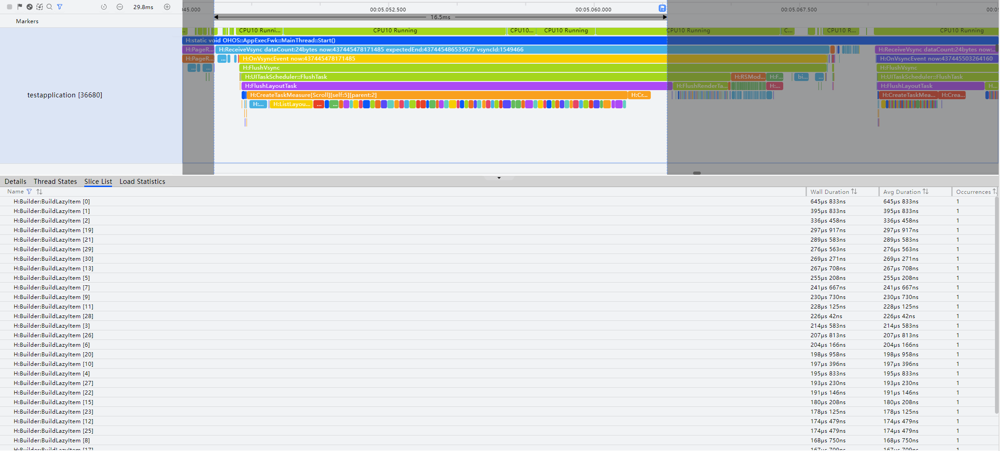

# 懒加载优化性能

更新时间：2026-03-12 08:45:02

来源：https://developer.huawei.com/consumer/cn/doc/best-practices/bpta-lazyforeach-optimization

**      


##### 概述

懒加载LazyForEach是一种延迟加载的技术，它是在需要的时候才加载数据或资源，并在每次迭代过程中创建相应的组件，而不是一次性将所有内容都加载出来。懒加载通常应用于长列表、网格、瀑布流等数据量较大、子组件可重复使用的场景，当用户滚动页面到相应位置时，才会触发资源的加载，以减少组件的加载时间，提高应用性能，提升用户体验。


##### 懒加载原理介绍


##### 渲染过程

在声明式描述语句中，有两种方式控制列表、网格等容器类组件的渲染，分别为[循环渲染（ForEach）](https://developer.huawei.com/consumer/cn/doc/harmonyos-guides/arkts-rendering-control-foreach)和[数据懒加载（LazyForEach）](https://developer.huawei.com/consumer/cn/doc/harmonyos-guides/arkts-rendering-control-lazyforeach)。

 - 循环渲染       ForEach循环渲染的过程如下：

1. 从列表数据源一次性加载全量数据。

2. 为列表数据的每一个元素都创建对应的组件，并全部挂载在组件树上。即，ForEach遍历多少个列表元素，就创建多少个ListItem组件节点并依次挂载在List组件树根节点上。

3. 列表内容显示时，只渲染屏幕可视区内的ListItem组件，可视区外的ListItem组件滑动进入屏幕内时，因为已经完成了数据加载和组件创建挂载，直接渲染即可。

  其数据加载、组件树挂载、页面渲染的示意图如下所示：

  图1 **ForEach渲染过程示意图        **



  如果列表数据较少，数据一次性全量加载不是性能瓶颈时，可以直接使用ForEach；但是当数据量大、组件结构复杂的情况下ForEach会出现性能瓶颈。这是因为要一次性加载所有的列表数据，创建所有组件节点并完成组件树的构建，在数据量大时会非常耗时，从而导致页面启动时间过长。另外，屏幕可视区外的组件虽然不会显示在屏幕上，但是仍然会占用内存。在系统处于高负载的情况下，更容易出现性能问题，极限情况下甚至会导致应用异常退出。
 - 数据懒加载       LazyForEach懒加载的原理和渲染过程如下：

1. LazyForEach会根据屏幕可视区能够容纳显示的组件数量，按需加载数据。

2. 根据加载的数据量创建组件，挂载在组件树上，构建出一棵短小的组件树。即，屏幕可以展示多少列表项组件，就按需创建多少个ListItem组件节点挂载在List组件树根节点上。

3. 屏幕可视区只展示部分组件。当可视区外的组件需要在屏幕内显示时，需要从头完成数据加载、组件创建、挂载组件树这一过程，直至渲染到屏幕上。

  其数据加载、组件树挂载、页面渲染的示意图如下所示：

  图2 **LazyForEach渲染过程示意图

  


LazyForEach实现了按需加载，针对列表数据量大、列表组件复杂的场景，减少了页面首次启动时一次性加载数据的时间消耗，减少了内存峰值。不过在长列表滑动的过程中，因为需要根据用户的滑动行为不断地加载新的内容，这需要进行额外的数据请求和处理，会增加滑动时的计算量，从而对性能产生一定的影响。然而，合理使用LazyForEach的按需加载能力，通过在滑动停止或达到某个阈值时才进行加载，可以减少不必要的计算和请求，从而提高性能，给用户带来更好的体验。总之，在实现按需加载的场景中，需要综合考虑性能和用户体验的平衡，合理地优化加载逻辑和渲染方式，以提升整体的性能表现。


##### 键值生成规则和组件创建规则

> [!NOTE]
> 建议开发者优先使用 Code Linter扫描工具 进行代码检查，重点关注 @performance/hp-arkui-no-stringify-in-lazyforeach-key-generator 规则。若扫描结果中出现该规则相关问题，可参考本章节提供的优化建议进行调整。


在使用LazyForEach时，我们需要分别实现数据源dataSource、键值生成函数keyGenerator、子组件生成函数itemGenerator。其中，数据源为[IDataSource](https://developer.huawei.com/consumer/cn/doc/harmonyos-references/ts-rendering-control-lazyforeach#idatasource)类型，需要开发者实现该接口。keyGenerator是一个函数，用于为每个item生成一个唯一且持久的键值以标识对应的组件，开发者可以通过它自定义键值的生成规则，关于键值生成规则，详情可参考[键值生成规则](https://developer.huawei.com/consumer/cn/doc/harmonyos-guides/arkts-rendering-control-lazyforeach#键值生成规则)。LazyForEach的itemGenerator函数会根据键值生成规则为数据源的每个数组项创建组件，组件的创建分为首次渲染和非首次渲染两种情况，详情可参考[组件创建规则](https://developer.huawei.com/consumer/cn/doc/harmonyos-guides/arkts-rendering-control-lazyforeach#组件创建规则)。

> [!NOTE]
> 在使用LazyForEach进行组件复用时，键值生成函数keyGenerator中不推荐使用stringify。在复杂的业务场景中，使用stringify会对item对象进行序列化，最终把item转换成字符串，这过程需要消耗大量的时间和计算资源，从而导致页面性能降低。


##### 常见使用场景

LazyForEach作为常见的渲染控制的方式之一，常用的使用场景有长列表加载、无限瀑布流等。


##### 长列表加载

长列表作为应用开发中最常见的开发场景之一，通常会包含成千上万个列表项，在此场景下，直接使用循环渲染ForEach一次性加载所有的列表项，会导致渲染时间过长，影响用户体验。而使用数据懒加载LazyForEach替换循环渲染ForEach，可以按需加载列表项，从而提升列表性能。数据懒加载的示例代码可以参考[LazyForEach](https://developer.huawei.com/consumer/cn/doc/harmonyos-guides/arkts-rendering-control-lazyforeach)。

虽然，按需加载列表项可以优化长列表性能，但在快速滑动长列表的场景下，可能会来不及加载需要显示的列表项，导致出现白块的现象，从而影响用户体验。而在ArkUI中，List容器提供了[cachedCount](https://developer.huawei.com/consumer/cn/doc/harmonyos-references/ts-container-list#cachedcount)属性，LazyForEach可以结合cachedCount属性一起使用，能够避免白块的现象。cachedCount可以设置列表中ListItem/ListItemGroup的预加载数量，并且只在LazyForEach中生效，即cachedCount只能与LazyForEach一起使用。除了List容器，其他容器Grid、Swiper以及WaterFlow也都包含cachedCount属性。cachedCount的使用方法如下所示。

```ArkTS
List() {
  // ...
}.cachedCount(3)
```

此外，HarmonyOS应用框架提供了组件复用能力，可以结合LazyForEach一起使用，进一步优化长列表的性能。组件复用会把组件树上将要移除的组件进行回收，回收的组件会进入到一个回收缓存区。后续创建新组件节点时，会复用缓存区中的节点，节约组件重新创建的时间。关于组件复用的详细原理可以参考[组件复用](https://developer.huawei.com/consumer/cn/doc/best-practices/bpta-component-reuse)。针对长列表加载的性能优化，可以参考[优化长列表加载慢丢帧问题](https://developer.huawei.com/consumer/cn/doc/best-practices/bpta-best-practices-long-list)。


##### 无限瀑布流

瀑布流的内容呈现方式类似瀑布流一样，从上往下依次排列，每一列的高度不一定相同，整体呈现出瀑布流的视觉效果。在瀑布流中，经常使用LazyForEach实现数据按需加载，同时，结合onReachEnd、onScrollIndex方法实现无限瀑布流，关于瀑布流的优化详情可以参考[优化瀑布流加载慢丢帧问题](https://developer.huawei.com/consumer/cn/doc/best-practices/bpta-waterflow-performance-optimization)。


##### 常见失效场景


##### 使用限制

在LazyForEach的使用上，有一些限制条件和限制场景，详细的限制条件请参考[使用限制](https://developer.huawei.com/consumer/cn/doc/harmonyos-guides/arkts-rendering-control-lazyforeach#使用限制)，常见的限制场景总结如下：

 - 键值相同导致渲染错乱
 - ListItem过于复杂导致丢帧
 - Scroll嵌套List导致按需加载失效
 - GridItem未设置高度导致按需加载失效


##### 检查失效方法

当LazyForEach失效时，可能出现渲染错误、卡顿等现象，开发者可以使用日志、Profiler调优工具等方法来定位具体的问题。常见检查LazyForEach的失效方法有如下几种方式：
1. 通过日志观察键值、子组件创建的情况，参考如下所示。开发者需要留意日志中是否出现相同的键值、子组件出现的次数与实际不符等情况。       
```ArkTS
LazyForEach(this.data, (lazyForEachItem: string) => {
  ListItem() {
    Row() {
      Text(lazyForEachItem).fontSize(50)
    }.margin({ left: 10, right: 10 })
  }.onAppear(() => {
    // Record the number of times the component is created through onAppear
    console.info('appear:' + lazyForEachItem);
  })
}, (item: string) => {
  // Print the key value in the keyGenerator function
  console.info('key:' + item);
  return item;
})
```

2. 通过Profiler调优工具抓取Trace，可以判断子组件创建的次数。如下图所示，在该帧中出现大量的BuildLazyItem切片，每一次BuildLazyItem对应一次子组件的创建，对比数量可知LazyForEach按需加载失效。关于调优的内容可参考[性能分析](https://developer.huawei.com/consumer/cn/doc/best-practices/bpta-optimization-tool-practice)。       


3. 通过HiDumper查看组件信息，判断组件的渲染情况。关于HiDumper的内容可参考[HiDumper](https://developer.huawei.com/consumer/cn/doc/harmonyos-guides/hidumper)。


##### 键值相同导致渲染错乱

在LazyForEach的键值生成规则中，每个item对应着一个唯一且持久的键值，用于标识对应的组件。当不同的数据项有相同的键值时，框架可能找不到正确的数据项，导致子组件渲染错误。关于键值错误导致渲染错乱的案例，详情可以参考[首次渲染](https://developer.huawei.com/consumer/cn/doc/harmonyos-guides/arkts-rendering-control-lazyforeach#首次渲染)中的示例。


##### ListItem过于复杂导致丢帧

当使用LazyForEach时，如果子组件ListItem过于复杂，在子组件创建时，将产生大量的布局计算耗时，最终导致该帧丢帧。关键代码如下所示。

```ArkTS
@Entry
@Component
struct Index {
  private data: MyDataSource = new MyDataSource();

  aboutToAppear() {
    for (let i = 0; i <= 30; i++) {
      this.data.pushData(`Hello ${i}`)
    }
  }

  build() {
    List({ space: 3 }) {
      LazyForEach(this.data, (lazyForEachItem: string) => {
        ListItem() {
          Column() {
            ForEach(this.data.getAllData(), (forEachItem: string) => {
              ListItem() {
                Row() {
                  Text(lazyForEachItem + forEachItem).fontSize(50)
                    .onAppear(() => {
                      console.info("appear:" + lazyForEachItem)
                    })
                }.margin({ left: 10, right: 10 })
              }
            }, (item: string) => item)
          }
        }
      }, (item: string) => item)
    }.cachedCount(5)
  }
}
```


##### Scroll嵌套List导致按需加载失效

当Scroll容器嵌套List组件加载长列表时，若不指定List的宽高尺寸，则默认加载全部ListItem，导致按需加载失效，甚至会导致应用卡顿、崩溃，详细案例可参考[合理使用布局](https://developer.huawei.com/consumer/cn/doc/best-practices/bpta-improve-layout-performance)。


##### GridItem未设置高度导致按需加载失效

当使用Grid容器时，如果GridItem没有设置高度，会加载所有子组件，设置了GridItem的宽高，会加载Grid显示区域内的子组件。参考案例代码如下：

```ArkTS
@Entry
@Component
struct Index {
  private data: MyDataSource = new MyDataSource();
  private scroller: Scroller = new Scroller();

  aboutToAppear() {
    for (let i = 0; i <= 30; i++) {
      this.data.pushData(`Hello ${i}`)
    }
  }

  build() {
    Column() {
      Grid(this.scroller) {
        LazyForEach(this.data, (lazyForEachItem: string) => {
          GridItem() {
            Text(lazyForEachItem)
              .fontSize(50)
              .width('100%')
          }
          .onAppear(() => {
            console.info("appear:" + lazyForEachItem)
          })
        }, (item: string) => {
          return item;
        })
      }
      .columnsTemplate('1fr')
      .enableScrollInteraction(true)
      .width('100%')
      .height(800)
      .cachedCount(5)
    }
    .width('100%')
    .height(700)
  }
}
```


##### 示例代码

 - [布局优化指导](https://gitcode.com/harmonyos_samples/BestPracticeSnippets/tree/master/ArkUI/Lazy_Loading_Optimizes_Performance)
