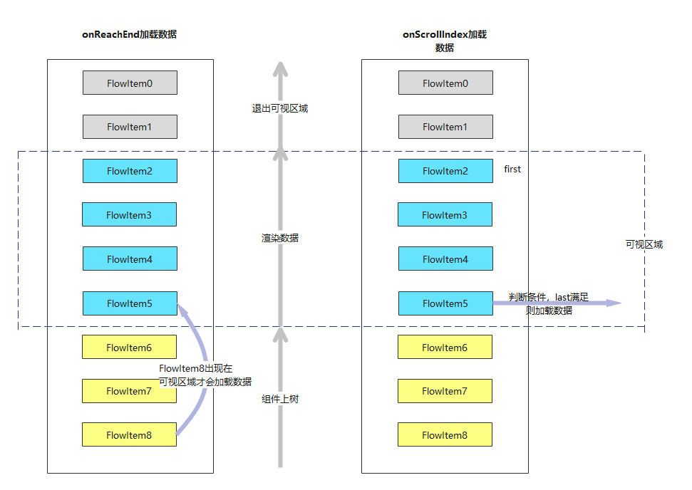
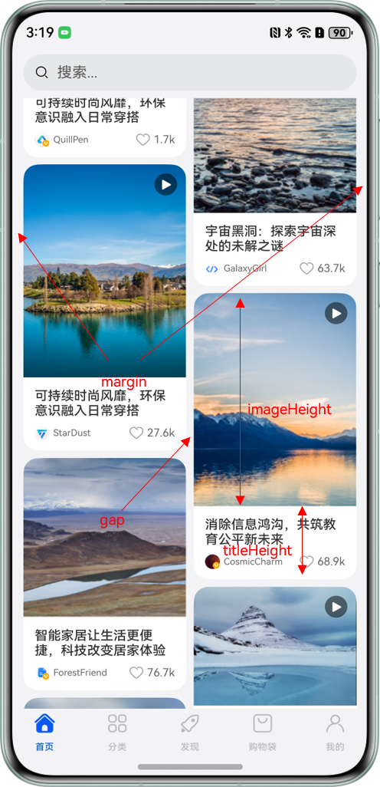
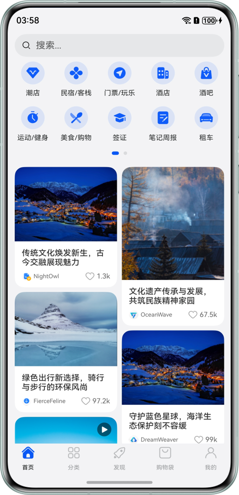

# 瀑布流加载丢帧优化

更新时间：2026-03-12 08:45:02

来源：https://developer.huawei.com/consumer/cn/doc/best-practices/bpta-waterflow-performance-optimization

**      


##### 概述

瀑布流是应用开发中常见的场景。它通过容器布局规则将元素排列为多列不对齐的界面，内容像瀑布一样从上而下倾泻。瀑布流适用于展示图片资讯、购物商品、直播视频等多种数据。当瀑布流上下滑动时，无限加载特性使其能展示大量数据；不同大小的子元素会带来测量和绘制的性能消耗。


在瀑布流的高频场景中，性能优化是关键，包括加快渲染速度、提升滑动帧率、降低内存占用等，从而显著提升应用流畅度和用户体验。对于希望快速实现的开发者，可使用ScrollComponents库直接创建流畅滑动的瀑布流，该库内置组件复用、懒加载、复用池共享等优化能力，并支持预创建和预加载，大幅减少开发者的性能调优成本，具体实现细节和最佳实践可参考[《基于ScrollComponents实现瀑布流》](https://developer.huawei.com/consumer/cn/doc/best-practices/bpta-waterflow-based-on-scrollcomponents)。

本文将介绍懒加载、数据缓存、组件复用、无限滑动、固定宽高场景优化瀑布流滑动。


##### 懒加载

先看一下组件示例代码中瀑布流的基本用法：

```ArkTS
build() {
  Column({ space: 2 }) {
    WaterFlow({ footer: this.itemFoot() }) {
      LazyForEach(this.dataSource, (item: number) => {
        FlowItem() {
          Column() {
            Text("N" + item).fontSize(12).height('16')
            Image('res/waterFlowTest(' + item % 5 + ').jpg')
              .objectFit(ImageFit.Fill)
              .width('100%')
              .layoutWeight(1)
          }
        }
        .width('100%')
        .height(this.itemHeightArray[item % 100])
        .backgroundColor(this.colors[item % 5])
      }, (item: string) => item)
    }
    .columnsTemplate("1fr 1fr")
    .columnsGap(10)
    .rowsGap(5)
    .backgroundColor(0xFAEEE0)
    .width('100%')
    .height('100%')
  }
}
```

示例代码使用LazyForEach进行数据懒加载，WaterFlow布局按需创建FlowItem组件，并在FlowItem滑出可视区域时回收，以降低内存占用。

瀑布流的开发，也属于长列表加载的一种场景，其LazyForEach懒加载原理及性能分析可参考：[懒加载](https://developer.huawei.com/consumer/cn/doc/best-practices/bpta-best-practices-long-list#section182645364229)


##### 缓存数据项

通过设置cachedCount参数，可以指定LazyForEach懒加载组件的缓存数量。设置cachedCount后，除了屏幕内显示的Item组件外，还会预先缓存屏幕可视区外指定数量的数据。当一个屏幕的数据加载完成后，再次向下滑动时，会先加载上一次请求的数据，加载完成后，再加载本次请求的数据。

详细原理及性能分析参考：[缓存列表项](https://developer.huawei.com/consumer/cn/doc/best-practices/bpta-best-practices-long-list#section11667144010222)


##### 组件复用


滑动场景中，FlowItem及其子组件频繁创建和销毁。将FlowItem中的组件封装成自定义组件，并使用@Reusable装饰器修饰，以减少ArkUI框架内部反复创建销毁节点的开销。

@Reusable装饰器实现的组件复用仅限于父组件内。 若要支持全局范围的组件复用，可以使用全局组件复用池的第三方库。

组件复用详细原理及性能分析参考：[组件复用](https://developer.huawei.com/consumer/cn/doc/best-practices/bpta-best-practices-long-list#section36781044162218)

全局组件复用池三方库：[nodepool](https://ohpm.openharmony.cn/#/cn/detail/@hadss%2Fnodepool)


##### 无限滑动


在实际开发中，瀑布流布局的数据不会一次性全部加载，而是每次加载固定数量的数据。当应用滑动时，会继续加载数据。在滑动过程中加载新数据时，结合懒加载和缓存列表项，可以确保缓存中的数据及时补充，从而用户在滑动时不会感觉到数据加载，实现无限滑动的效果（具体效果参见实践总结章节）。由于数据提前加载，避免了在同一时刻创建大量组件，减少了丢帧的情况。

在对应场景下，需通过事件加载数据以实现无限滑动。例如：使用瀑布流触底方法onReachEnd()和瀑布流组件滑动索引变化方法onScrollIndex()。

 - 在onReachEnd()方法中加载数据时，应用会在数据源中的所有数据渲染完毕后加载新数据。这会导致明显的加载动画出现，用户需要等待新数据加载完成才能继续浏览瀑布流。
 - 在onScrollIndex()方法中加载数据时，当瀑布流组件滑动导致可视区索引变化时，需要限制加载数据的条件。例如，当当前可视区最后一个组件的索引加20等于数据源数量时，才加载数据。这样可以避免每次索引变化时都加载数据。建议在onScrollIndex()方法中进行操作，使瀑布流在未到达底部时就开始加载数据，从而提升用户体验，使用户感知不到数据加载过程。


相关流程如下：

**瀑布流组件加载流程图**





示例如下：

```ArkTS
WaterFlow({ footer: this.footStyle, scroller: this.waterFlowScroller }) {
  LazyForEach(this.waterFlowListData.getData(), (item: WaterFlowData, index: number) => {
    FlowItem() {
      // ...
    }
    .height(item.waterFlowHead.height / item.waterFlowHead.width * this.waterFlowItemWidth +
    this.getTitleHeight(item.waterFlowDescription.title))
    .backgroundColor(Color.White)
    // ...
  }, (item: WaterFlowData) => {
    return item.waterFlowDescription.index.toString();
  });
}
.flingSpeedLimit(4800)
.onScroll((scrollOffset: number, scrollState: ScrollState) => {
  if (scrollOffset < this.lastScrollOffset) {
    this.isOnReachEnd = false;
  }
  if (scrollOffset === 0 && this.isOnReachEnd) {
    this.listenNetworkEvent();
  }
})
.onReachEnd(() => {
  this.isOnReachEnd = true;
  this.listenNetworkEvent();
  if (this.waterFlowListData.dataSource.totalCount() < CommonConstants.WATER_FLOW_MAX_COUNT) {
    // There are only 500 analog data, so the limit here is pageNo less than 25
    this.pageNo = this.pageNo + 1 > 25 ? this.pageNo - 24 : this.pageNo + 1;
    this.waterFlowListData.addData(CommonConstants.MOCK_INTERFACE_WATER_FLOW_FILE_NAME, this.pageNo,
      this.pageSize);
  }
  this.listDataCount = this.waterFlowListData.dataSource.totalCount();
})
```


##### 固定宽高


与长列表不同，瀑布流布局中各个卡片的高度是不同的，这就对瀑布流布局绘制提出了新的挑战。瀑布流的卡片高度是由瀑布流卡片自适应瀑布流的宽度得到的，因此卡片的高度无法直接指定。这就会使卡片渲染以后得到的高度与占位符的高度不一致，从而造成卡片的闪烁效果。

固定宽高后，UI描述时可指定组件宽高。组件宽高固定时，布局阶段不参与测量，节点保存大小信息。瀑布流内容多时，避免整体测算，性能提升。

Image组件异步加载，提前设定FlowItem高度，避免图片加载后高度变化触发布局刷新。

详细内容请参考：[利用布局边界减少布局计算](https://developer.huawei.com/consumer/cn/doc/best-practices/bpta-improve-layout-performance#section151587885316)

图1 **瀑布流页面卡片宽高计算逻辑示意图     




如上图所示，两列瀑布流卡片的宽度 = （屏幕宽度 - 2 * 组件外边距（margin） - 瀑布流组件内边距（gap））/ 2。

瀑布流卡片中图片的高度imageHeight = 图片原始高度 / 图片原始宽度 * 瀑布流卡片宽度。

瀑布流卡片中描述性的高度titleHeight根据标题长度不同需设置不同的高度，其计算逻辑如下代码所示：

```ArkTS
getTitleHeight(title: string) {
  let textWidth: number = this.getUIContext().getMeasureUtils().measureText({
    textContent: title,
    fontSize: 14
  });
  return textWidth > (this.waterFlowItemWidth - CommonConstants.DESCRIPTION_MARGIN_LEFT * 2) ?
    CommonConstants.DESCRIPTION_THREE_LINES_HEIGHT : CommonConstants.DESCRIPTION_TWO_LINES_HEIGHT;
}
```

瀑布流卡片的高度 = imageHeight + titleHeight。


##### 实践总结


本文通过瀑布流案例，使用部分优化手段，实现页面流畅滑动。页面包含SearchBar、Swiper、WaterFlow和底部导航栏。顶部功能区由Swiper嵌套Grid组件实现，瀑布流使用WaterFlow组件，FlowItem内容包括图文、视频、直播卡片，复用相同UI结构，避免无用层级嵌套。

**整体效果图**





下表为通过网络请求500条数据加载渲染，测试获得的数据（数据测试方式采用技术从左向右累加测试的）：

| 性能指标 | ForEach | LazyForEach | 缓存数据项 | 组件复用 | 固定宽高 |
| --- | --- | --- | --- | --- | --- |
| 首次渲染时间 | 1346ms | 756ms | 752ms | 760ms | 761ms |
| 丢帧率 | 2.20% | 1.00% | 0.50% | 0.2% | 0.00% |
| 独占内存 | 485M | 122M | 136.6M | 106.8M | 103.3M |


从测试结果可以看出，使用LazyForEach懒加载后，相关指标显著提升，尤其是在内存使用和首次渲染时间方面。其他优化方法可以进一步减少滑动过程中的丢帧率，从而优化交互体验。缓存数据项会影响首次渲染时间，因为缓存的数据未在首屏展示，但需要加载额外的数据，导致内存使用增加。由于UI组件的复用，内存使用显著减少。


对于瀑布流性能优化方式，与长列表优化类似，都可以使用懒加载、缓存列表项、动态预加载、组件复用、布局优化等方式优化性能。固定宽高作为瀑布流特有的优化性能手段能够进一步提升瀑布流的性能，同时可以避免新加载元素瞬间刷新带来的"闪烁"问题。在滑动过程中加载数据，可以避免同一时间创建大量组件而导致丢帧的情况。相应技术总结见下表：

| 技术名称 | 适用场景 | 参考文章 |
| --- | --- | --- |
| 懒加载 | 适用于瀑布流场景，解决一次性加载并渲染大量数据造成的性能瓶颈。 | 长列表加载性能优化、 使用懒加载优化性能、 数据懒加载 |
| 缓存列表项 | 适用于加载列表项数据请求耗时的场景。比如，瀑布流列表中含有短视频、高清图片等数据量比较大的资源。 | 长列表加载性能优化 |
| 组件复用 | 适用于瀑布流中存在大量结构相同的组件频繁创建与销毁导致性能瓶颈的场景。 | 组件复用最佳实践 |
| 固定宽高 | 适用于瀑布流页面组件高度不一的场景。 | 利用布局边界减少布局计算 |
| 布局优化 | 错误的布局方式可能会导致组件树和嵌套层数过多，在创建和布局绘制阶段产生较大的性能开销，所以可以通过布局优化提升性能。 | 合理使用布局 |
| 状态管理 | 在ArkUI的开发过程中，如果没有选择合适的装饰器或合理的控制状态更新范围，会导致非必要的UI视图刷新，造成性能浪费。 | 状态管理最佳实践 |


##### 示例代码


 - [优化瀑布流加载慢丢帧问题](https://gitcode.com/harmonyos_samples/PageSlip)
