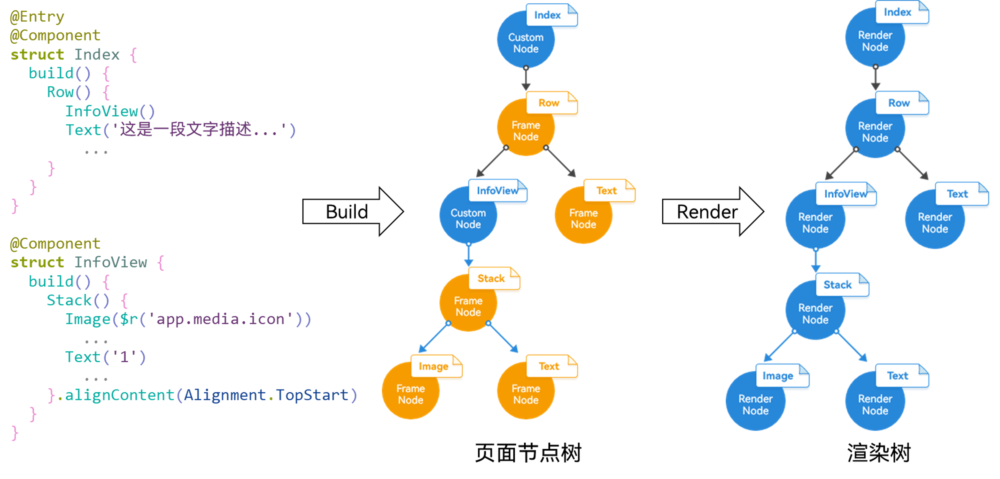
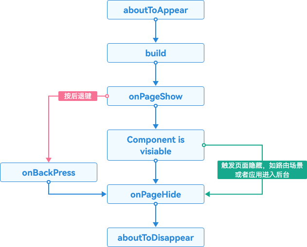
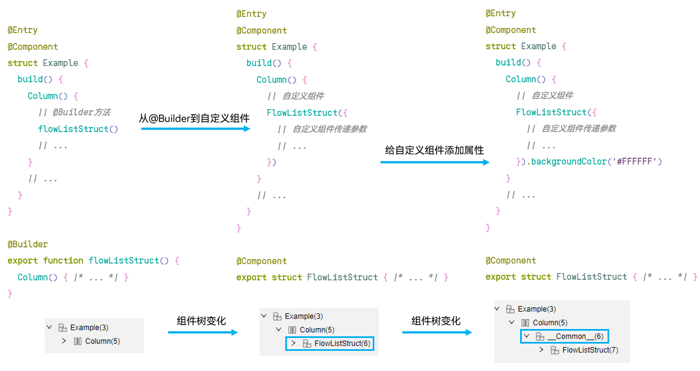
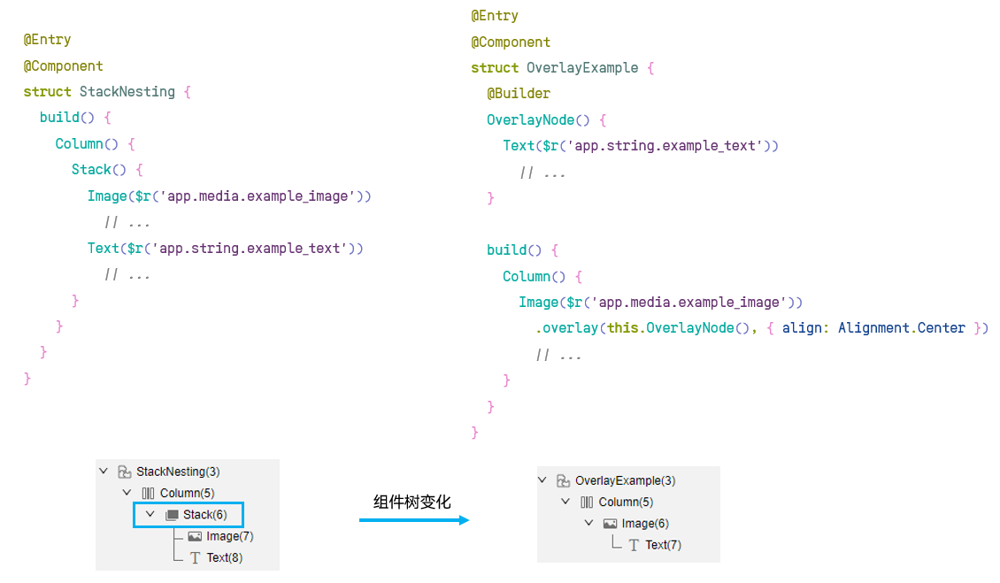

# 组件嵌套优化

更新时间：2026-03-12 08:45:02

来源：https://developer.huawei.com/consumer/cn/doc/best-practices/bpta-component-nesting-optimization

本文通过原理概念、优化场景和实践数据对比三个角度，详细介绍了组件嵌套的优化，着重从优化场景角度为开发者阐明组件嵌套的优化场景以及优化策略。


## 原理概述


本章节将从原理角度分析，通过ArkUI框架的执行流程，以及自定义组件的生命周期两个角度，来分析组件过度嵌套对性能的影响。


### ArkUI框架执行流程





如上图所示，可以看到ArkUI框架的执行顺序：

1. 执行ArkTS中的UI描述信息，通过UI描述API创建后端的页面节点树，其中包含了处理UI组件属性更新、布局测算、事件处理等业务逻辑；
2. 通过FrameNode生成当前的界面描述数据结构——渲染树RenderTree，RenderTree描述了具体的元素在屏幕上的布局信息，包含大小、位置以及一些其他属性；
3. 最后渲染线程会根据RenderTree的信息执行相应的绘制工作。


### 自定义组件的生命周期





如上图所示，自定义组件创建完成之后，在build函数执行之前，将先执行aboutToAppear()生命周期回调函数。执行完build函数后，还会有一些事件监听函数，例如可以使用onPageShow监听页面显示事件，onPageHide函数可以监听页面隐藏事件。最终在自定义组件析构销毁前执行aboutToDisappear函数。

具体的页面和自定义组件生命周期可以参考自定义组件生命周期。


### 组件过度嵌套对性能的影响


组件嵌套是指一个组件包含另一个或多个组件的情况，这种嵌套关系可以形成组件树的结构。从最外层组件的类型来看，可以分为自定义组件嵌套和原生组件嵌套。

从ArkUI框架的执行流程上分析，布局时会采用递归遍历所有节点的方式进行组件位置和大小的计算。嵌套层级过深将带来更多的中间节点，在布局测算阶段下，额外的节点数将导致更多的计算过程，造成性能消耗。

从自定义组件的生命周期的角度上分析，如果自定义组件过度嵌套，则会有大量的生命周期函数需要执行，消耗性能。

详细的组件嵌套性能数据分析可参考《精简节点数》。


## 优化场景


### 优先使用@Builder方法代替自定义组件


自定义组件与自定义构建函数概念定义如下：

自定义组件：用@Component修饰的struct结构体称为自定义组件，在自定义组件中可以定义函数/变量、build()方法、组件的生命周期回调等。自定义组件具有可组合、可重用和数据驱动UI更新的特点。

自定义构建函数：@Builder装饰的函数称为“自定义构建函数”，分为组件内自定义构建函数和全局自定义构建函数。@Builder所装饰的函数遵循build()函数语法规则，开发者可以将重复使用的UI元素抽象成一个方法，在build方法里调用。


自定义组件和自定义构建函数（@Builder）的主要区别如下：

1. 自定义构建函数（@Builder）更轻量，其作为UI元素抽象的方法，实现和调用相较于自定义组件比较简洁。
2. 在自定义组件中，可以定义成员函数/变量、自定义组件生命周期等。自定义构建函数（@Builder）不支持定义状态变量和自定义生命周期。
3. 在自定义组件中，可直接通过状态变量的改变，来驱动UI的刷新。而自定义构建函数（@Builder）默认的按值参数传递方式不支持动态改变组件，当传递的参数为状态变量时，状态变量的改变不会引起@Builder方法内的UI刷新，要实现UI动态刷新需要按引用传递参数。
4. 在自定义组件中要实现插槽功能，需要使用@Builder和@BuilderParam实现。具体实现可参考：[@BuilderParam装饰器：引用@Builder函数](https://developer.huawei.com/consumer/cn/doc/harmonyos-guides/arkts-builderparam)。
5. 自定义构建函数（@Builder）中使用了自定义组件，那么该方法每次被调用时，对应的自定义组件均会重新创建。


整体上，自定义组件在实际应用开发场景中更加通用、灵活。自定义构建函数（@Builder）由于不支持定义变量和生命周期等限制，在使用场景上灵活性受限，多用在插槽或系统提供的组件/方法里面属性传值类型为Builder类型场景中。

根据上面自定义组件与自定义构建函数的区别可以看出，由于@Builder不涉及生命周期，在自定义组件大量嵌套的场景中，更加轻量级的@Builder在性能方面更加出色。

因此，当自定义组件不涉及到状态变量和自定义生命周期时，可以优先使用@Builder替换自定义组件，提升性能。

优化策略

自定义组件示例代码：

```ts
@Component
export struct example {
  build() {
    Column(){
      Text('Custom Component Sample Code')
      // ...
    }
  }
}
```

自定义构建函数示例代码：

```ts
@Builder
export function example1(){
  Column(){
    Text('Sample code for customizing the constructor')
    // ...
  }
}
```

具体可以参考优先使用@Builder方法代替自定义组件。


### 减少自定义组件产生多余节点


自定义组件自身为非渲染节点，仅是组件树和状态数据的组合，常规使用自定义组件时并不会产生多余的节点。但是给自定义组件添加属性后，会将自定义组件作为一个整体节点进行处理。对内部的组件树进行操作，如背景色绘制、圆角绘制等都会作用在该节点上。

通过DevEco Studio内置ArkUI Inspector工具，查看组件树结构可以看到，相比使用@Builder方法，组件树多一个自定义组件节点，所以优先使用@Builder方法代替自定义组件减少了自定义组件节点数量。而给自定义组件添加属性，会在自定义组件外部会创建一个“__Common__”类型的节点，如下图所示。为了避免这类“__Common__”节点的创建，可以将自定义组件的属性移至内部，或者动态设置自定义组件的属性。减少自定义组件产生多余节点，可以使总节点数量降低，从而提升性能。

图1 自定义组件树变化示意图




将自定义组件的属性移至内部

当需要给自定义组件添加属性时，一般少量属性的场景下，可以将这些属性移至自定义组件内部，具体优化示例如下所示。

反例：

```ts
@Component
export struct Example {
  build() {
    Column() {
      // Custom Components
      FlowListStruct(
      // Custom Component Passing Parameters
      // ...
      ).backgroundColor('#FFFFFF')
    }
    .width('100%')
    .height('100%')
  }
}
```

正例：

```ts
@Component
export struct FlowListStruct2 {
  build() {
    Column() {
      // ...
    }
    .backgroundColor('#FFFFFF')
  }
}
```

动态设置自定义组件的属性

ArkUI提供了动态属性设置的接口，支持使用自定义AttributeModifier构建组件并配置属性。当需要给自定义组件设置较多属性时，如果将所有的属性设置都内移，会出现传递参数过多的问题，同时也会创建更多状态变量，增加参数的传递耗时。虽然减少了节点数量，但是性能没有得到有效提升。推荐使用自定义AttributeModifier的方式来动态设置自定义组件的属性，减少节点数量的同时，也避免了参数过多导致耗时的问题，具体优化示例如下所示。

```ts
@Entry
@Component
struct CustomComponentModifier {
  modifier: ColumnModifier = new ColumnModifier();

  aboutToAppear(): void {
    this.modifier.width = 100;
    this.modifier.height = 100;
    this.modifier.backgroundColor = Color.Red;
  }

  build() {
    Column() {
      ModifierCustom({ modifier: this.modifier })
    }
  }
}


@Component
struct ModifierCustom {
  @Require @Prop modifier: AttributeModifier<ColumnAttribute>;

  build() {
    Column() {
      Text('Hello World')
    }.attributeModifier(this.modifier)
  }
}

// When using dynamic attribute setting, you need to inherit AttributeModifier, implement a Modifier by yourself, and then set it to the required component.
class ColumnModifier implements AttributeModifier<ColumnAttribute> {
  width: number = 0;
  height: number = 0;
  backgroundColor: ResourceColor | undefined = undefined;

  applyNormalAttribute(instance: ColumnAttribute): void {
    instance.width(this.width);
    instance.height(this.height);
    instance.backgroundColor(this.backgroundColor);
  }
}
```


### 选择合适的布局组件


复杂布局提供了场景化的能力，解决一种或者多种布局场景。但是在一些场景下，不恰当的使用这些高级组件，可能带来更多的性能消耗。

优化策略：

- 在相同嵌套层级的情况下，如果多种布局方式可以实现相同布局效果，优选低耗时的布局，如使用Column、Row替代Flex实现相同的单行布局。
- 在能够通过其他布局大幅优化节点数的情况下，可以使用高级组件替代，如使用RelativeContainer替代Row、Column实现扁平化布局，此时其收益大于布局组件本身的性能差距。
- 仅在必要的场景下使用高耗时的布局组件，如使用Flex实现折行布局、使用Grid实现二维网格布局等。


具体可以参考合理使用布局组件


### 删除无用的Stack/Column/Row嵌套，移除冗余节点


在组件嵌套的情况中，可以找到一些无用的容器组件嵌套。在考虑组件嵌套优化中，可以删除掉无用容器组件嵌套，移除冗余节点，从而避免冗余节点对性能的消耗。

优化方式：

反例：

```ts
@Component
export struct example {
  build() {
    Column() {
      Row() {
        // Custom Components
        FlowListStruct(
        // Custom Component Passing Parameters
        // ...
        )
      }
      .width('100%')
    }
    .width('100%')
    .height('100%')
  }
}
```

正例：

```ts
@Component
export struct example2 {
  build() {
    Column() {
      // Custom Components
      FlowListStruct(
      // Custom Component Passing Parameters
      // ...
      )
    }
    .width('100%')
    .height('100%')
  }
}
```


### 优先使用组件属性代替嵌套组件


在实现文本浮层、按压遮罩或颜色叠加等场景时，通常会采用Stack布局嵌套组件的方式。实际上有些场景直接使用组件属性或借助系统API的能力就能实现，例如使用overlay属性可以实现浮层场景，使用ColorMetrics可以实现颜色叠加效果。直接使用组件属性的方式可以减少Stack布局嵌套组件的使用，从而减少嵌套组件带来的节点数。以文本浮层场景为例，如下图所示，使用overlay属性实现文本浮层比Stack组件嵌套方式少了一层Stack节点。开发这一类场景时，推荐优先使用组件属性代替嵌套组件。

图2 使用组件属性代替嵌套组件示意图




使用overlay属性实现浮层

使用overlay属性可以直接给组件添加浮层，实现堆叠的效果，常见的场景有文本浮层、按压遮罩等。相较于Stack布局嵌套组件的方式，使用overlay属性减少了Stack组件节点的创建。以增加文本浮层为例，具体优化示例如下所示。更多使用overlay属性实现浮层场景的示例可参考浮层-示例。

反例：

```ts
@Entry
@Component
struct StackNesting {
  build() {
    Column() {
      Stack() {
        Image($r('app.media.startIcon'))
        .objectFit(ImageFit.Contain)
        Text('fragmentary text')
        .fontSize(20)
        .fontColor(Color.Black)
      }
    }
  }
}
```

正例：

```ts
@Entry
@Component
struct OverlayExample {
  @Builder
  OverlayNode() {
    Text('fragmentary text')
    .fontSize(20)
    .fontColor(Color.Black)
  }

  build() {
    Column() {
      Image($r('app.media.startIcon'))
      .overlay(this.OverlayNode(), { align: Alignment.Center })
      .objectFit(ImageFit.Contain)
    }
  }
}
```


使用ColorMetrics实现颜色叠加

系统通过ColorMetrics接口提供了颜色计算能力，可以用于颜色叠加显示的场景。同样，与Stack布局嵌套组件的方式相比，直接使用ColorMetrics能力可以减少Stack层的布局节点，具体优化示例如下所示。

反例：

```ts
@Component
struct ColorNormal {
  @Prop isSelected: boolean = false;

  build() {
    Stack() {
      Column()
      .width('100%')
      .height(100)
      .backgroundColor(this.isSelected ? Color.Blue : Color.Grey)
      .borderRadius(12)
      .alignItems(HorizontalAlign.Center)
      .justifyContent(FlexAlign.Center)
      Column()
      .width('100%')
      .height(100)
      .backgroundColor(this.isSelected ? "#99000000" : Color.Grey)
      .borderRadius(12)
      .alignItems(HorizontalAlign.Center)
      .justifyContent(FlexAlign.Center)
    }
  }
}

@Entry
@Component
struct ColorOverlayStackExample {
  @State isSelected: boolean = false;

  build() {
    Scroll() {
      Column() {
        ColorNormal({ isSelected: this.isSelected })
        .onClick(() => {
          this.isSelected = !this.isSelected;
        })
      }
    }
  }
}
```

正例：

```ts
import { ColorMetrics } from '@kit.ArkUI';
import { BusinessError } from '@kit.BasicServicesKit';
import { hilog } from '@kit.PerformanceAnalysisKit';

@Component
struct ColorMeasure {
  @Prop isSelected: boolean = false;

  build() {
    Column()
    .width('100%')
    .height(100)
    .backgroundColor(this.isSelected ? this.getBlendColor(Color.Blue, "#99000000").color : Color.Grey)
    .borderRadius(12)
    .alignItems(HorizontalAlign.Center)
    .justifyContent(FlexAlign.Center)
  }

  getBlendColor(baseColor: ResourceColor, addColor: ResourceColor): ColorMetrics {
    if (!baseColor || !addColor) {
      try {
        return ColorMetrics.resourceColor(Color.Black);
      } catch (error) {
        let err = error as BusinessError;
        hilog.warn(0x000, 'testTag', `showToast failed, code=${err.code}, message=${err.message}`);
      }
    }
    let sourceColor: ColorMetrics;
    try {
      sourceColor = ColorMetrics.resourceColor(baseColor).blendColor(ColorMetrics.resourceColor(addColor));
    } catch (err) {
      let error = err as BusinessError;
      console.error(`Failed to blend color, code = ${error.code}, message =${error.message}`);
      sourceColor = ColorMetrics.resourceColor(addColor);
    }
    return sourceColor;
  }
}

@Entry
@Component
struct ColorMetricsExample {
  @State isSelected: boolean = false;

  build() {
    Scroll() {
      Column() {
        ColorMeasure({ isSelected: this.isSelected })
        .onClick(() => {
          this.isSelected = !this.isSelected;
        })
      }
    }
  }
}
```


## 实践数据对比


关于实践数据对比部分，具体可以参考布局优化指导和UI组件性能优化的数据对比部分。


## 示例代码


- [不同场景下组件嵌套的性能优化策略](https://gitcode.com/harmonyos_samples/BestPracticeSnippets/tree/master/ArkUI/Component_Nesting_Optimization)
