# 长列表加载丢帧优化

更新时间：2026-03-12 08:45:02

来源：https://developer.huawei.com/consumer/cn/doc/best-practices/bpta-best-practices-long-list

## 概述


列表是应用开发中常见的一类场景，可以将信息整理成易于理解和操作的形式，便于用户查找和获取所需信息。应用程序中的列表场景包括新闻列表、购物车列表、各类排行榜等。随着信息数据的累积，特别是在新闻应用、购物应用和聊天应用中，列表数据可能达到上万条。针对这类大量数据加载的长列表应用，优化长列表性能非常重要。一个正确、高性能的长列表应用可以显著降低列表渲染时间、提升页面滑动帧率、减少应用内存占用，从而大幅提升用户体验。

对于希望快速实现高性能流畅滑动长列表的开发者，可以使用ScrollComponents库直接实现。该库内置了组件复用、列表项子组件组合复用、懒加载、复用池共享等优化功能，并支持预创建和预加载，大幅减少了开发者的性能调优成本。具体实现细节和最佳实践可参考《基于ScrollComponents实现长列表》。

针对长列表加载这一场景，本文将介绍5种优化手段，这些手段的使用可以优化列表渲染时间、页面滑动帧率和应用内存占用，从而提升性能和用户体验：

- 懒加载：提供列表数据按需加载能力，解决一次性加载长列表数据耗时长、占用过多资源的问题，提升页面响应速度。
- 缓存列表项：提供屏幕外列表项长度的自定义调节功能，结合懒加载设置，预加载数据以提升列表滑动体验。
- 动态预加载：根据历史任务加载时间，动态调整屏幕外数据预取数量，结合懒加载设置，确保列表滑动时屏幕外数据实时更新，提高列表滑动体验。
- 组件复用：提供可复用组件对象的缓存资源池，通过重复使用缓存的组件对象，降低频繁创建和销毁的开销，提升组件渲染效率。
- 布局优化：使用扁平化布局方案，减少界面嵌套层级和组件数，避免过度绘制，提升页面渲染效率。


下文将以 “HMOS世界”中首屏的长列表加载为例，通过5个测试来验证列表优化前后性能的收益，以证明这些优化手段的可行性。综合考虑业界共识指标和实际用户使用体验，测试将对比分析如下几个关键指标：

- 完全显示所用时间（Time To Full Display， TTFD）：表示应用生成具有完整内容的第一帧所用时间，包括在第一帧之后异步加载的内容。本文测量的是不同数据量下长列表首次加载到屏幕上所用的时间。
- 丢帧率（Janky Frames）：表示一个时间周期内的丢帧比率。HarmonyOS系统要求每一帧在 11.1ms（90Hz刷新率）内绘制完成。如果页面未在 11.1ms内完成绘制，就会出现丢帧。用户仅在连续丢帧时才有明显感知。
- 独占内存（Unique Set Size，USS）：一个进程所占用的私有内存。当进程被销毁后，独占内存返回系统。内存泄漏时，独占内存是最佳观察数据。


测试表明，使用LazyForEach懒加载技术后，与ForEach加载方式相比，在列表数据量较小（100条以内）且数据一次性全量加载不是性能瓶颈时，两者各项性能指标差异不大。但当列表数据量达到10000条时，ForEach的各项性能指标显著劣化，滑动会出现明显卡顿，甚至可能导致应用崩溃；而LazyForEach通过懒加载、缓存列表项和组件复用等技术，能够明显减少首屏完全显示所需时间，降低应用的独占内存，提高页面滑动帧率，从而带来更好的性能。具体对比效果如下所示：

图1 10000条数据量下ForEach和LazyForEach最佳实践启动对比

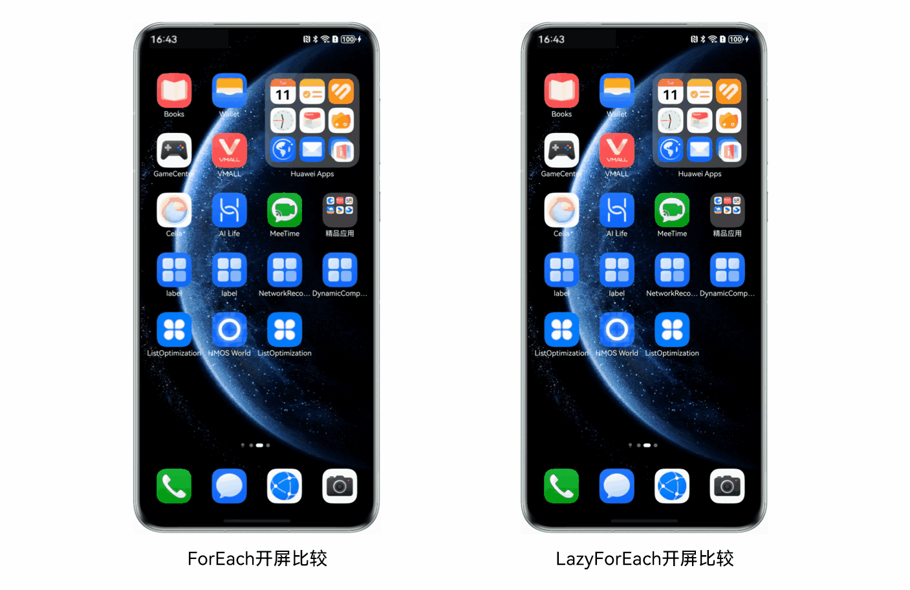


图2 10000条数据量下ForEach和LazyForEach最佳实践滑动对比


## 懒加载


### 原理介绍


HarmonyOS应用框架为容器类组件的数据加载和渲染提供了两种方式：

- 方式一，循环渲染 通过[循环渲染（ForEach）](https://developer.huawei.com/consumer/cn/doc/harmonyos-guides/arkts-rendering-control-foreach)从数组中获取数据，并为每个数据项创建相应的组件，可减少代码复杂度。
```ts
ForEach(
arr: ESObject[],
itemGenerator: (item: ESObject, index?: number) => void,
keyGenerator?: (item: ESObject, index?: number) => string
){}
```
- 方式二，数据懒加载 通过[数据懒加载（LazyForEach）](https://developer.huawei.com/consumer/cn/doc/harmonyos-guides/arkts-rendering-control-lazyforeach)从提供的数据源中按需迭代数据，并在每次迭代过程中创建相应的组件。
```ts
interface IDataSource {
  totalCount(): number;
  getData(index: number): ESObject;
  registerDataChangeListener(listener: DataChangeListener): void;
  unregisterDataChangeListener(listener: DataChangeListener): void;
}

interface DataChangeListener {
  onDataReloaded(): void;
  onDataAdd(index: number): void;
  onDataMove(from: number, to: number): void;
  onDataDelete(index: number): void;
  onDataChange(index: number): void;
}

LazyForEach(
dataSource: IDataSource,
itemGenerator: (item: ESObject) => void,
keyGenerator?: (item: ESObject) => string
): void{}
```


### ForEach


ForEach循环渲染的过程：

1. 从列表数据源加载全量数据。
2. 为列表数据的每个元素创建对应的组件，并挂载在组件树上。遍历列表元素时，每个元素都创建一个ListItem组件节点，并依次挂载在List组件树根节点上。
3. 列表内容显示时，只渲染屏幕可视区内的ListItem组件。当可视区外的ListItem组件滑动进入屏幕内时，由于已完成数据加载和组件创建挂载，可直接渲染。


其数据加载、组件树挂载和页面渲染的示意图如下所示：

图3 ForEach渲染过程示意图

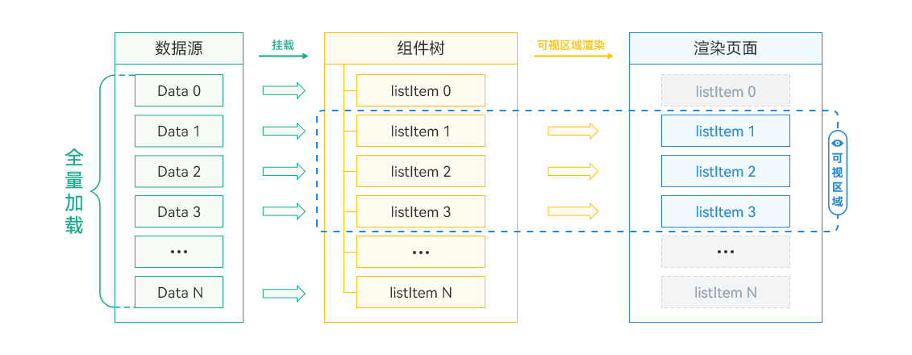


当列表数据量不大，一次性全量加载不会成为性能瓶颈时，可以直接使用ForEach。然而，当数据量较大且组件结构复杂时，ForEach会出现性能瓶颈。这是因为需要一次性加载所有列表数据，创建所有组件节点并完成组件树的构建，这在数据量大时会非常耗时，导致页面启动时间过长。此外，屏幕可视区外的组件虽然不会显示，但仍然会占用内存。在系统负载较高时，更容易出现性能问题，极端情况下可能导致应用异常退出。

为了解决上述问题，HarmonyOS应用框架提供了懒加载方式。


### LazyForEach


LazyForEach懒加载的原理及渲染过程如下：

1. LazyForEach会根据屏幕可视区按需加载数据。
2. 根据加载的数据量创建组件，挂载到组件树上，构建简短的组件树。屏幕展示多少列表项组件，就按需创建相应数量的ListItem组件节点，挂载在List组件树的根节点上。
3. 屏幕可视区仅展示部分组件。当需要将可视区外的组件显示在屏幕上时，必须完成数据加载、组件创建和组件树挂载，直至渲染到屏幕上。


其数据加载、组件树挂载、页面渲染的示意图如下所示：

图4 LazyForEach渲染过程示意图


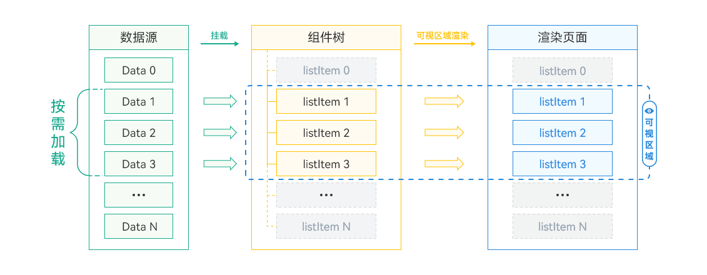


LazyForEach 实现了按需加载，适用于列表数据量大、列表组件复杂的场景。它减少了页面首次启动时一次性加载数据的时间消耗，降低了内存峰值。然而，在长列表滑动过程中，由于需要根据用户的滑动行为不断加载新内容，会增加滑动时的计算量，从而影响性能。通过在滑动停止或达到某个阈值时才进行加载，可以减少不必要的计算和请求，提高性能，提升用户体验。在实现按需加载时，需要综合考虑性能和用户体验的平衡，合理优化加载逻辑和渲染方式，以提升整体性能表现。


### 使用场景和规则


使用场景


上文了解到ForEach是从列表数据源一次性加载全量数据，且一次性并全部挂载在组件树上；LazyForEach是按需加载部分数据，只构建出一棵短小的组件树。针对数据加载和组件树构建这两个显著差异，可以对ForEach/LazyForEach做出如下选型判断：


| 渲染接口 | 选型原则 |
| --- | --- |
| ForEach | 列表数据较少，数据一次性全量加载不是性能瓶颈时。ForEach相对LazyForEach，代码简单很多。 |
| LazyForEach | 列表数据较长，一次性加载所有的列表数据创建、渲染页面产生性能瓶颈时。 |


使用规则

详细的使用规则可以参考ForEach的使用建议和LazyForEach的使用限制。


### 场景案例


为了对比List组件在不同数据量下使用ForEach和LazyForEach的性能差异，可以对相关代码进行改造。首先，使用ForEach对列表进行循环；然后，使用LazyForEach对列表进行优化，得到如下两段关键代码：

- 对比案例1：使用ForEach对List列表进行加载
```ts
@Entry
@Component
export struct ForEachListPage {
  UIContext = this.getUIContext()
  context = this.UIContext.getHostContext() as common.UIAbilityContext;

  // ...

  build() {
    Column() {
      Header()
      List({ space: Constants.SPACE_16 }) {
        ForEach(this.articleList, (item: LearningResource) => {
          ListItem() {
            Column({ space: Constants.SPACE_12 }) {
              ArticleCardView({
                articleItem: item,
                isLiked: this.isLiked(item.id),
                isCollected: this.isCollected(item.id)
              })
            }
          }
        }, (item: LearningResource) => item.id)
      }
      .width(Constants.FULL_SCREEN)
      .height(Constants.FULL_SCREEN)
      .padding({ left: 10, right: 10 })
      .layoutWeight(1)
    }
    .backgroundColor($r('app.color.text_background'))
  }
}
```
- 对比案例2：使用LazyForEach对List列表进行加载
```ts
@Entry
@Component
export struct LazyForEachListPage {
  UIContext = this.getUIContext()
  context = this.UIContext.getHostContext() as common.UIAbilityContext;

  // ...

  build() {
    Column() {
      Header()
      List({ space: Constants.SPACE_16 }) {
        if (this.data !== null) {
          // Optimization method 1: Use LazyForEach.
          LazyForEach(this.data, (item: LearningResource) => {
            ListItem() {
              Column({ space: Constants.SPACE_12 }) {
                // Optimization method 3：Reuse Component
                ReusableArticleCardView({
                  articleItem: item,
                  isLiked: this.isLiked(item.id),
                  isCollected: this.isCollected(item.id)
                })
              }
            }
            .reuseId('article')
          }, (item: LearningResource) => item.id)
        }
      }
      .width(Constants.FULL_SCREEN)
      .height(Constants.FULL_SCREEN)
      .padding({ left: 10, right: 10 })
      .layoutWeight(1)
      // ...
    }
    .backgroundColor($r('app.color.text_background'))
  }
}
```


> [!NOTE]
> LazyForEach的数据源需要实现IDataSource接口，具体实现可参考“HMOS世界”中的DiscoverView.ets代码。


### 性能分析


针对长列表场景，本地模拟了10、100、1000、10000条数据，分别使用ForEach和LazyForEach测试关闭和开启懒加载情况下的完全显示时间、列表挂载时间、独占内存，并分析滑动过程中的丢帧率。列表挂载时间指创建组件和挂载数据的总时长。最终，使用DevEco Studio的Profiler工具检测上述指标，获得的数据如下所示：


| ForEach对比指标 | 10条数据 | 100条数据 | 1000条数据 | 10000条数据 |
| --- | --- | --- | --- | --- |
| 完全显示所用时间 | 1s741ms | 1s786ms | 1s942ms | 5s841ms |
| 列表挂载时间 | 87ms | 88ms | 135ms | 3s 291ms |
| 独占内存（滑动完成后） | 38.2MB | 48.7MB | 83.7MB | 560.1MB |
| 丢帧率 | 0.0% | 3.8% | 4.5% | 58.2% |


| LazyForEach对比指标 | 10条数据 | 100条数据 | 1000条数据 | 10000条数据 |
| --- | --- | --- | --- | --- |
| 完全显示所用时间 | 1s544ms | 1s572ms | 1s652ms | 1s707ms |
| 列表挂载时间 | 88ms | 89ms | 94ms | 97ms |
| 独占内存（滑动完成后） | 38.1MB | 44.6MB | 46.3MB | 82.9MB |
| 丢帧率 | 0.0% | 2.3% | 3.6% | 6.6% |


> [!NOTE]
> 以上数据来源均为版本DevEco Studio 4.0.3.415、SDK 4.0.10.9条件下重复多次测试得到，不同设备类型数据可能存在差异，测试数据旨在体现性能优化趋势，仅供参考。


图5 ForEach和LazyForEach在不同数据量下的指标对比

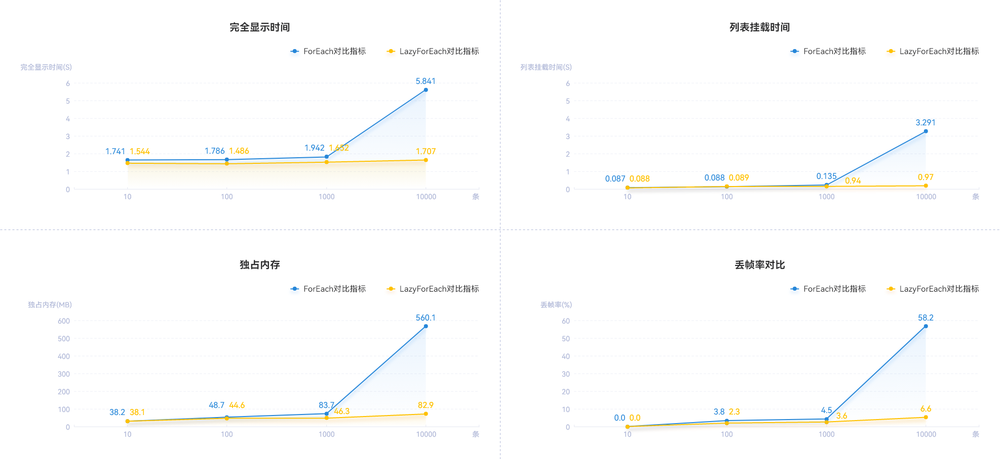


从测试数据可以看出：

1. 在100条数据范围内，ForEach和LazyForEach的性能差距不明显，两者各项性能指标均在可接受范围内。ForEach的代码逻辑比LazyForEach更简单，因此在此场景下建议使用ForEach。
2. 当数据量超过1000条，特别是达到10000条时，ForEach在列表渲染、应用内存占用和丢帧率等方面会出现显著劣化，滑动时会出现明显的卡顿，甚至可能导致应用崩溃。
3. 使用LazyForEach除了内存会略微增加外，列表渲染时间和丢帧率都不会有显著变化，性能表现良好。


## 缓存列表项


### 原理介绍


> [!NOTE]
> 建议开发者优先使用[代码Code Linter检查](https://developer.huawei.com/consumer/cn/doc/harmonyos-guides/ide-code-linter)工具进行代码扫描，重点关注[@performance/hp-arkui-set-cache-count-for-lazyforeach-grid](https://developer.huawei.com/consumer/cn/doc/harmonyos-guides/ide_hp-arkui-set-cache-count-for-lazyforeach-grid)规则。若扫描结果中出现该规则相关问题，可参考本章节提供的优化建议进行调整。


从上文了解到，在进行列表加载时，应避免一次性加载所有列表数据项，推荐按需加载数据。例如，页面一次可以显示6条数据，若不提前缓存部分数据，快速下滑到列表底部时，可能会出现“滑动白块”的现象。这是因为上一次请求的数据仅限于屏幕上的6条，如果滑动速度过快，数据无法及时加载，导致白块出现。在追求高性能的同时，应避免此类影响用户体验的问题。

通过设置cachedCount，可以指定LazyForEach懒加载的缓存数量。设置cachedCount后，除了屏幕内显示的ListItem组件外，还会预先缓存屏幕可视区外指定数量的列表项数据。这样，当一个屏幕的数据加载完成后，再次向下滑动时，会先加载上一次请求的数据，加载完成后，再加载本次请求的数据。添加cachedCount缓存列表项后，LazyForEach的渲染过程如下：

1. 首先，请求n+cachedCount条数据，并在屏幕上显示n条数据。
2. 当列表滑动，缓存列表项从屏幕可视区外进入可视区内时，只需渲染组件，从而提升显示效率。
3. 当列表不断滑动，屏幕可视区外缓存的列表项数量少于cachedCount设置数量时，会触发列表项数据加载事件，继续预加载下一组缓存列表项（cachedCount个）。
4. 当上滑和下滑交替进行时，列表会在两个方向上分别缓存cachedCount条数据。
5. 如果不显式设置cachedCount，则cachedCount默认值为屏幕内显示的节点个数，最大值为16。


数据加载、组件树挂载、页面渲染的示意图如下所示：

图6 缓存作用区域与渲染过程示意图

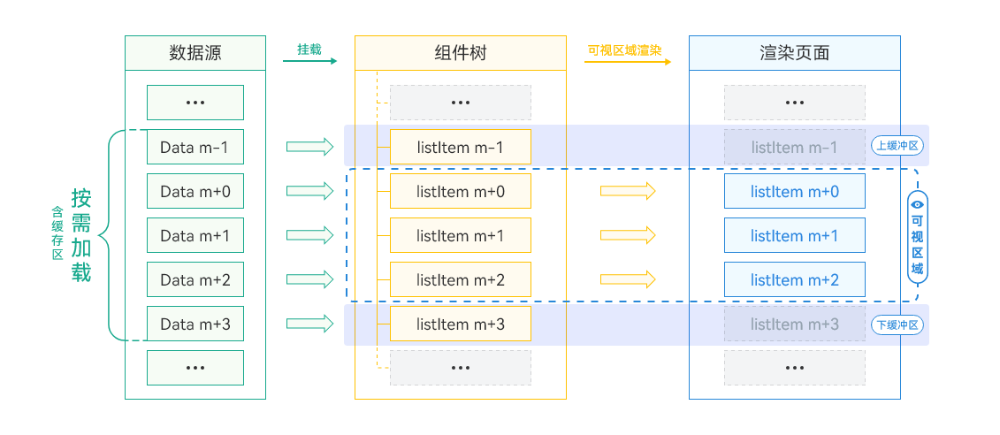


### 使用场景和规则


使用场景


缓存列表项适用于数据请求耗时的场景，如滑动列表中包含短视频、高清图片等大数据量资源。预先从网络加载并缓存相关数据，可以缩短渲染前的准备时间，提升列表响应速度。

使用规则

缓存列表项仅在使用LazyForEach懒加载时有效。ForEach循环渲染会一次性加载所有数据，因此无法也不需要设置缓存列表项。


### 场景案例


在LazyForEach上添加缓存列表项后的关键代码如下所示：

```ts
@Entry
@Component
export struct LazyForEachListPage {
  UIContext = this.getUIContext()
  context = this.UIContext.getHostContext() as common.UIAbilityContext;

  // ...

  build() {
    Column() {
      Header()
      List({ space: Constants.SPACE_16 }) {
        if (this.data !== null) {
          // Optimization method 1: Use LazyForEach.
          LazyForEach(this.data, (item: LearningResource) => {
            ListItem() {
              Column({ space: Constants.SPACE_12 }) {
                // Optimization method 3：Reuse Component
                ReusableArticleCardView({
                  articleItem: item,
                  isLiked: this.isLiked(item.id),
                  isCollected: this.isCollected(item.id)
                })
              }
            }
            .reuseId('article')
          }, (item: LearningResource) => item.id)
        }
      }
      .width(Constants.FULL_SCREEN)
      .height(Constants.FULL_SCREEN)
      .padding({ left: 10, right: 10 })
      .layoutWeight(1)
      // Optimization method 2：Use cachedCount
      .cachedCount(3);
    }
    .backgroundColor($r('app.color.text_background'))
  }
}
```


### 性能分析


本文案例中的长列表每屏可以加载6条数据。为了测试不同缓存数量对丢帧率的影响，将cachedCount的值分别设为1、2、3、6、12、18和30。基于示例程序，测试结果显示，不设置缓存数量（默认cachedCount=1）时，丢帧率为6.6%。随着缓存数量的增加，丢帧率逐渐降低。当缓存数量设置为当前屏幕展示数量的一半，即缓存3个列表项时，丢帧率最低为3.7%。继续增加缓存数量，丢帧率不再显著下降，过多的缓存数量甚至可能影响丢帧率。

图7 10000条数据量下不同cachedCount对列表滑动帧率的影响

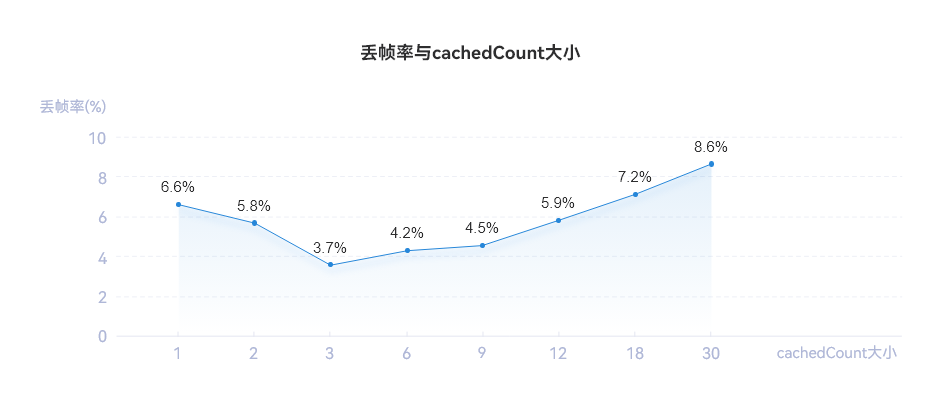


在缓存设置中，建议将cachedCount设置为n/2（n为一屏显示的列表数）。实际开发中，应根据具体场景合理调整缓存数量。例如，如果列表项需要显示网络数据，而网络数据加载较慢，为了提升列表信息的浏览效率和浏览体验，可以将cachedCount设置为大于n/2。如果列表中需要加载大图或视频等占用较大内存的数据，为了减少内存占用，可以将cachedCount设置为小于n/2。因此，实际场景中需要不断尝试和验证，以找到合适的缓存数量，平衡用户体验和内存占用。


> [!NOTE]
> 测试数据仅限于示例程序，不同的应用程序设置的合适缓存数量不一致，需要针对应用程序测试得出具体的缓存数量。


## 动态预加载


### 原理介绍


从上文了解到，LazyForEach懒加载可以通过设置cachedCount来指定缓存数量，以解决下滑到列表最底端时，再快速下滑可能会引起“滑动白块”的现象。如果用户使用大量在线数据，在弱网和快速滑动的场景下，滑动过程中仍可能出现白块。将cachedCount设置为较大值可以减少滑动过程中白块的出现，但会增加首屏加载时间。在追求高性能的同时，应避免影响用户体验。

HarmonyOS提供内容预取能力Prefetcher，支持动态自适应网络状态。通过提前下载图片或资源，确保资源在需要时立即显示，减少白块出现。

LazyForEach懒加载可以通过使用Prefetcher来预取和预渲染数据。在使用Prefetcher后，除屏幕内显示的ListItem组件外，还会预先将屏幕可视区外的部分列表项数据进行预渲染和预取。这样当列表向下滑动时，会先显示预渲染组件，屏幕可视区外会动态调整预取范围。预取逻辑在Prefetcher的BasicPrefetcher类中实现，BasicPrefetcher支持预取和预渲染（图像解码、添加到组件树等）过程分离、自适应调整预获取范围、优先加载可视区域、以及取消不必要任务（快速滚动列表的场景下，智能取消不必要任务），其渲染过程如下：

1. 首先，请求n条数据，并在屏幕上显示m条数据。
2. 当列表滑动，缓存列表项从屏幕可视区外进入可视区内时，显示预渲染组件。屏幕可视区外动态调整预取范围，相比仅设置cachedCount，显示效率更高。
3. 当列表滑动时，屏幕外的列表项实时更新，预取数据和预渲染数据也同步更新。


图8 动态预加载渲染过程示意图


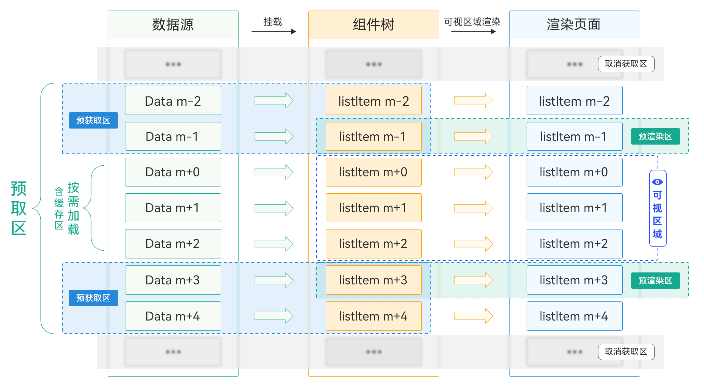


### 使用场景


动态预加载适用于数据请求耗时较长的场景，如滑动列表中包含大量图片资源。在LazyForEach的数据源中使用IDataSourcePrefetching的prefetch方法，提前从网络加载并缓存数据。BasicPrefetcher在滚动体验和CPU节省方面有显著提升，从而提高应用的响应速度。


### 场景案例


实现DataSourcePrefetchingRCP类，继承IDataSourcePrefetching接口并实现prefetch和cancel方法，如下代码所示：

```ts
import { SongInfoItem } from './song';
import { HashMap } from '@kit.ArkTS';
import { fileIo } from '@kit.CoreFileKit';
import { IDataSourcePrefetching } from '@kit.ArkUI';
import { rcp } from '@kit.RemoteCommunicationKit';
let PREFETCH_ENABLED: boolean = false;
const CANCEL_CODE: number = 1007900992;
const IMADE_UNAVAILABLE = $r('app.media.startIcon');
export default class DataSourcePrefetching implements IDataSourcePrefetching {
  private dataArray: Array<SongInfoItem>;
  private listeners: DataChangeListener[] = [];
  private readonly requestsInFlight: HashMap<number, rcp.Request> =
    new HashMap();
  private readonly session: rcp.Session = rcp.createSession();
  cache(ID: number, body: ESObject) {}
  constructor(dataArray: Array<SongInfoItem>) {
    this.dataArray = dataArray;
  }
  totalCount(): number {
    throw new Error('Method not implemented.');
  }
  getData(index: number): ESObject {
    throw new Error('Method not implemented.');
  }
  registerDataChangeListener(listener: DataChangeListener): void {
    throw new Error('Method not implemented.');
  }
  unregisterDataChangeListener(listener: DataChangeListener): void {
    throw new Error('Method not implemented.');
  }
  async prefetch(index: number): Promise<void> {
    PREFETCH_ENABLED = true;
    if (this.requestsInFlight.hasKey(index)) {
      throw new Error('Already being prefetched');
    }
    const item = this.dataArray[index];
    if (item.cachedImage) {
      return;
    }
    // Data request
    const request = new rcp.Request(item.albumUrl, 'GET');
    // Cache the network request object, which is convenient for handling when the request needs to be cancelled.
    this.requestsInFlight.set(index, request);
    try {
      // Send an http request to get a response.
      const response = await this.session.fetch(request);
      if (response.statusCode !== 200 || !response.body) {
        throw new Error('Bad response');
      }
      // Storing the loaded data information into a cache file.
      item.cachedImage = await this.cache(item.songId, response.body);
      // Delete the specified element
      this.requestsInFlight.remove(index);
    } catch (err) {
      if (err.code !== CANCEL_CODE) {
        item.cachedImage = IMADE_UNAVAILABLE;
        // Remove abnormal network request tasks.
        this.requestsInFlight.remove(index);
      }
      throw err as Error;
    }
  }
  cancel(index: number) {
    if (this.requestsInFlight.hasKey(index)) {
      // Returns the specified element of a MAP object.
      const request = this.requestsInFlight.get(index);
      // Cancel data request
      this.session.cancel(request);
      // Remove the canceled network request object
      this.requestsInFlight.remove(index);
    }
  }
  // ...
}
```

在应用列表界面，创建DataSourcePrefetchingRCP和BasicPrefetcher对象。在List的onScrollIndex回调中，调用BasicPrefetcher的visibleAreaChanged()方法，传入List的可见区域起始坐标。这样可以优化代码。

```ts
import { Header } from './header'
import { SongInfoItem } from './song';
import DataSourcePrefetching from '../model/ArticleListData';
import { ObservedArray } from '../utils/ObservedArray';
import { ReusableArticleCardView } from '../components/ReusableArticleCardView';
import Constants from '../constants/Constants';
import { PageViewModel } from './song';
import { BasicPrefetcher } from '@kit.ArkUI';
@Entry
@Component
export struct LazyForEachListPage {
  @State collectedIds: ObservedArray<string> = ['1', '2', '3', '4', '5', '6'];
  @State likedIds: ObservedArray<string> = ['1', '2', '3', '4', '5', '6'];
  @State isListReachEnd: boolean = false;
  // Create a DataSourcePrefetching object, which is a data source with task prefetching and cancellation capabilities.
  private readonly dataSource :ESObject= new DataSourcePrefetching(PageViewModel.getItems());
  // Create a BasicPrefetcher object, which is realized by the default dynamic prefetching algorithm.
  private readonly prefetcher = new BasicPrefetcher(this.dataSource);

  build() {
    Column() {
      Header()
      List({ space: Constants.SPACE_16 }) {
        LazyForEach(this.dataSource, (item: SongInfoItem ) => {
          ListItem() {
            ReusableArticleCardView({ articleItem: item })
          }
          .reuseId('article')
        })
      }
      .cachedCount(5)
      .onScrollIndex((start: number, end: number) => {
        // List scrolling triggers visibleareachan, updates the prefetch range in real time, and triggers calling prefetch and cancel interfaces.
        this.prefetcher.visibleAreaChanged(start, end)
      })
      .width(Constants.FULL_SCREEN)
      .height(Constants.FULL_SCREEN)
      .padding({ left: 10, right: 10 })
      .layoutWeight(1)
    }
    .backgroundColor($r('app.color.text_background'))
  }
}
```


### 性能分析


本文案例中的长列表每屏加载6条数据，测试不同cachedCount值对应用性能的影响，包括快速滑动场景下的白块数量、CPU开销占比和首屏加载时长。对比场景设置cachedCount=5和cachedCount=40。使用DevEco Studio的Profiler工具检测上述指标，得到的数据如下所示：

1.场景滑动对比


| cachedCount=5 | cachedCount=40 | 动态预加载 |
| --- | --- | --- |
|  |  |  |


| 数据设置 | 首屏加载 | 滑动过程滑块数量 |
| --- | --- | --- |
| cachedCount=5 | 首屏加载快 | 滑动过程中白块很多 |
| cachedCount=40 | 首屏加载慢 | 滑动过程中没有白块或很少 |
| 动态预加载 | 首屏加载快 | 滑动过程中没有白块或很少 |


2. CPU开销对比

利用Profiler工具分析得到相关trace图，追踪流程为应用侧的APP_LIST_FLING（列表从开始滚动到结束）的整个过程，从而观察应用的CPU占比。（注：不同设备特性和具体应用场景的多样性，所获得的性能数据存在差异，提供的数值仅供参考）

图9 cachedCount=5 CPU占比trace图


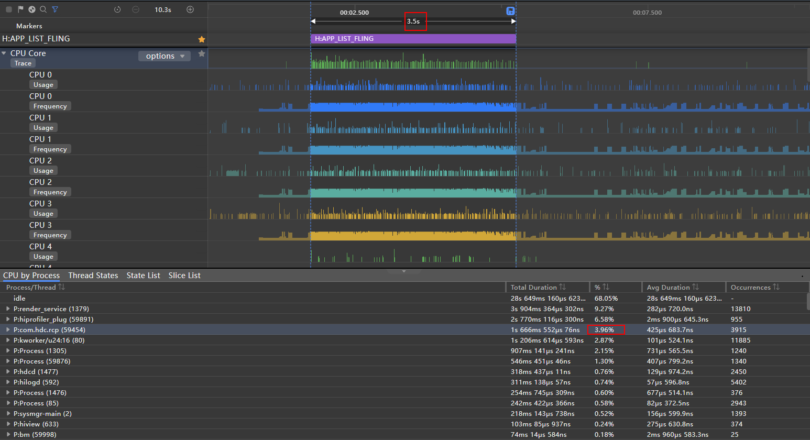


cachedCount=5 CPU占比为3.96%

图10 cachedCount=40 CPU占比trace图


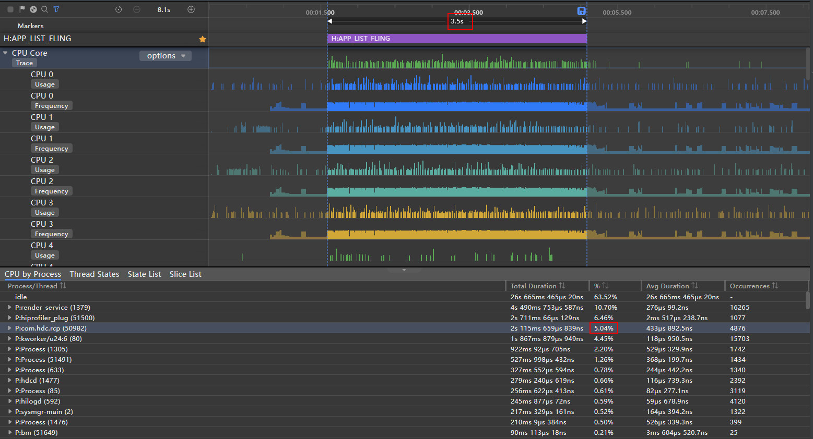


cachedCount=40 CPU占比为5.04%

图11 动态预加载 CPU占比trace图


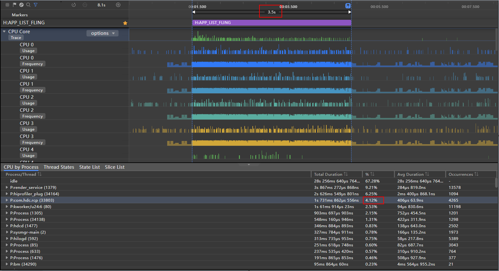


动态预加载CPU占比为4.12%


| 数据设置 | CPU占比 |
| --- | --- |
| cachedCount=5 | 3.96% |
| cachedCount=40 | 5.04% |
| 动态预加载 | 4.12% |


3. 首屏加载时长对比

使用Profiler工具分析相关trace图，追踪流程从“应用进程创建阶段”标签开始，到首屏所有图片加载完毕结束，以观察应用的首屏加载时间。请注意，不同设备和应用场景会导致性能数据有所差异，提供的数值仅作参考。

图12 cachedCount=5 首屏加载时长trace图


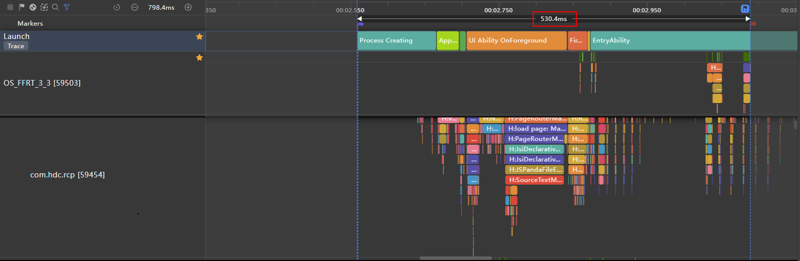


当cachedCount设置为5时，首屏加载时长为530.4ms。

图13 cachedCount=40 首屏加载时长trace图


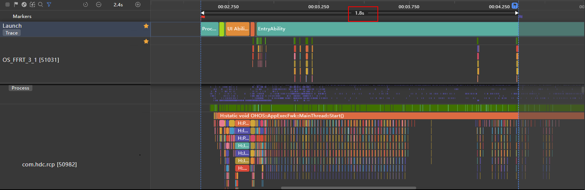


当cachedCount设置为40时，首屏加载时长为1.8s。

图14 动态预加载 首屏加载时长trace图


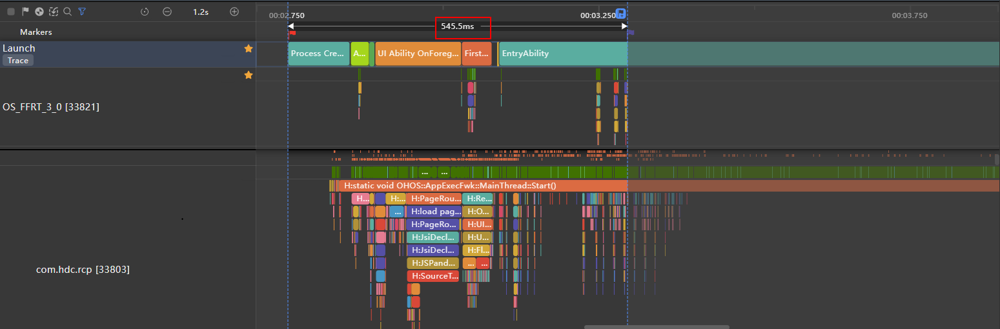


动态预加载使首屏加载时长为545.5ms。


| 数据设置 | 首屏加载时长 |
| --- | --- |
| cachedCount=5 | 530.4ms |
| cachedCount=40 | 1.8s |
| 动态预加载 | 545.5ms |


从实验数据可以得出：

1）当cachedCount设置为 5 时，首屏加载时间较短，但在滑动过程中会出现较多白块，滑动时CPU占用率较低。

2）当cachedCount设置为 40 时，首屏加载时间为30秒，滑动过程中未出现白块，但滑动时CPU占用较高。

3）当在cachedCount=5的基础上设置动态预加载时，首屏加载时间较短，滑动过程中未出现白块，滑动时CPU占用率较低。

当使用LazyForEach在线加载含有图片等大型资源时，建议采用动态预加载策略，以避免在弱网环境或快速滑动时出现空白块的问题。


> [!NOTE]
> 测试数据仅限于示例程序，不同设备特性和具体应用场景的多样性，所获得的性能数据存在差异，提供的数值仅供参考。


## 组件复用


### 原理介绍


HarmonyOS应用框架支持组件复用。当复用组件从组件树中移除时，会进入回收缓存区。创建新组件节点时，系统会优先使用缓存区中的节点，从而减少组件重新创建的时间。特别是在列表场景下，自定义子组件具有相同的布局结构，列表更新时只有状态变量等数据不同。组件复用可以提高列表页面的加载和响应速度。

组件复用机制如下：

1. 标记为@Reusable的组件从组件树移除时，组件及其对应的JSView对象都会存入复用缓存。
2. 当列表滑动到新的ListItem将要显示，并且List组件树需要新建节点时，系统将从复用缓存中查找可复用的组件节点。
3. 找到可复用节点并更新后，将其添加到组件树中，从而减少组件节点和JSView对象的创建时间。


图15 组件复用原理图

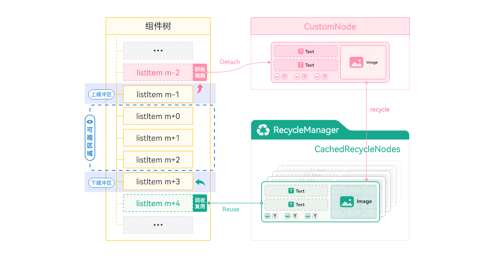


组件复用生效的条件如下：

- 自定义组件被@Reusable装饰器修饰，表示其具备组件复用的能力。
- 在一个自定义父组件下创建的具备组件复用能力的自定义子组件，从组件树上移除后，会被加入到其父组件的可复用节点缓存中。
- 在一个自定义父组件下创建可复用的子组件时，若其父组件的可复用节点缓存中有对应类型的可复用子组件，会通过更新可复用子组件的方式，快速创建子组件。
- ForEach循环渲染会一次性加载所有数据，因此不支持组件复用。


> [!NOTE]
> 名词介绍：
>                @Reusable 表示组件可以复用，与 LazyForEach 懒加载结合使用，可解决列表滑动场景的瓶颈问题，提升滑动帧率。        CustomNode是一种自定义的虚拟节点，用于缓存列表中的某些内容，以提高性能和减少不必要的渲染。使用CustomNode可以实现仅渲染当前可见区域内的数据项，缓存未显示的数据项，从而减少渲染数量，提升性能。        RecycleManager是一种用于优化资源利用的回收管理器。当数据项滚出屏幕时，对应的视图对象不会立即销毁，而是放入复用池中。当新的数据项需要在屏幕上展示时，RecycleManager会从复用池中取出一个已存在的视图对象，并将新数据绑定到该视图上，从而避免频繁的创建和销毁过程。使用RecycleManager可以减少创建和销毁视图的次数，提高列表的滚动流畅度和性能。        CachedRecycleNodes是CustomNode的集合，用于存储被回收的CustomNode对象，以便复用。


### 使用场景和规则


使用场景


若业务实现中存在UI线程的帧率瓶颈，推荐使用组件复用：

- 列表滚动（本例中的场景）：应用展示大量数据列表时，用户滚动操作可能导致频繁创建和销毁列表项视图，引起卡顿和性能问题。使用列表组件的复用机制可以重用已创建的列表项视图，提高滚动流畅度。
- 动态布局更新：如果应用界面需要根据用户操作或数据变化频繁更新布局，重复创建和销毁视图可能导致频繁的布局计算，影响帧率。使用组件复用可以避免不必要的视图创建和布局计算，提高性能。
- 地图渲染：在地图渲染中，频繁创建和销毁数据项的视图可能导致性能问题。使用组件复用可以重用已创建的视图，仅更新数据内容，减少视图的创建和销毁，从而提高性能。


为了避免UI线程的帧率瓶颈，推荐使用组件复用来提升应用性能和用户体验。组件复用能够减少不必要的视图创建与销毁，降低布局计算和绘制操作，从而提高界面流畅度和响应速度。

使用规则

组件复用的使用规则如下：

- 使用 @Reusable 标识：@Reusable 标识自定义组件具备可复用的能力。它可以被添加到任意的自定义组件上。开发者需要小心处理自定义组件的创建和更新流程，以确保自定义组件在复用后能展示出正确的行为。
- 缓存和复用范围：可复用自定义组件的缓存和复用只能发生在同一父组件下。无法在不同的父组件下复用同一自定义节点的实例。例如，A 组件是可复用组件，其也是 B 组件的子组件，并进入了 B 组件的可复用节点缓存中，但是在 C 组件中创建 A 组件时，无法使用 B 组件缓存的 A 组件。
- 组件结构保持不变：自定义组件复用带来的性能提升主要体现在减少JS对象的创建时间和复用组件树结构。如果开发者在复用前后使用渲染控制语法大幅改变了自定义组件的组件树结构，将无法获得组件复用的性能优势。
- 组件复用仅在特定场景下触发：当存在可复用的组件从组件树中移除并再次加入时，组件复用才会发生。如果不存在上述场景，则无法触发组件复用。例如，使用ForEach渲染控制语法创建的自定义组件，由于ForEach的全展开属性，不会触发组件复用。


组件复用能节省创建时间，优化应用性能。需处理自定义组件的创建与更新流程，限制复用范围及特定触发场景，以实现复用效果。


### 场景案例


下面的代码片段是在缓存列表项的基础上增加的组件复用的相关代码。组件复用需要首先在复用的组件上添加@Reusable注解，然后实现aboutToReuse方法。关键代码如下：

```ts
@Component
@Reusable
export struct ReusableArticleCardView {
  @Prop articleItem: LearningResource = new LearningResource();
  @Prop isCollected: boolean = false;
  @Prop isLiked: boolean = false;
  onCollected?: () => void;
  onLiked?: () => void;

  aboutToReuse(params: Record<string, Object>): void {
    this.onCollected = params.onCollected as () => void;
    this.onLiked = params.onLiked as () => void;
  }
  build() {
    // ...
  }
```


> [!NOTE]
> 无需对@Prop修饰的变量进行赋值，因为这些变量是由父组件传递给子组件的。如果在子组件中重新赋值这些变量，会导致重用的组件的内容重新触发状态刷新，从而降低组件的复用性能。相反，只需要在aboutToReuse方法中对onCollected和onLiked这两个函数进行重新赋值。


设置可复用组件的reuseId，关键代码如下：

```ts
@Entry
@Component
export struct LazyForEachListPage {
  UIContext = this.getUIContext()
  context = this.UIContext.getHostContext() as common.UIAbilityContext;

  // ...

  build() {
    Column() {
      Header()
      List({ space: Constants.SPACE_16 }) {
        if (this.data !== null) {
          // Optimization method 1: Use LazyForEach.
          LazyForEach(this.data, (item: LearningResource) => {
            ListItem() {
              Column({ space: Constants.SPACE_12 }) {
                // Optimization method 3：Reuse Component
                ReusableArticleCardView({
                  articleItem: item,
                  isLiked: this.isLiked(item.id),
                  isCollected: this.isCollected(item.id)
                })
              }
            }
            .reuseId('article')
          }, (item: LearningResource) => item.id)
        }
      }
      .width(Constants.FULL_SCREEN)
      .height(Constants.FULL_SCREEN)
      .padding({ left: 10, right: 10 })
      .layoutWeight(1)
      // Optimization method 2：Use cachedCount
      .cachedCount(3);
    }
    .backgroundColor($r('app.color.text_background'))
  }
}
```


> [!NOTE]
> 需要注意的是复用组件中有@Builder自定义构建函数时，状态变量推荐使用[按引用传递](https://developer.huawei.com/consumer/cn/doc/harmonyos-guides/arkts-builder#按引用传递参数)。@Builder装饰的函数默认按值传递，当传递的参数为状态变量时，状态变量的改变不会引起@Builder方法内的UI刷新。


### 性能分析


组件未复用时


上文已经将ForEach改造为了LazyForEach，并且添加了缓存项（cachedCount=3），当匀速滑动这个列表时，每隔5帧会稳定的丢帧，且会规律、重复的出现这个问题，如下图所示：

图16 未进行组件复用（均匀丢帧）

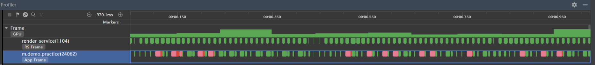


从图中可以看见，泳道中红色和绿色间隔出现，其中红色区域表示丢帧，绿色表示正常，对红色丢帧区域进行耗时分析：

图17 丢帧耗时分析

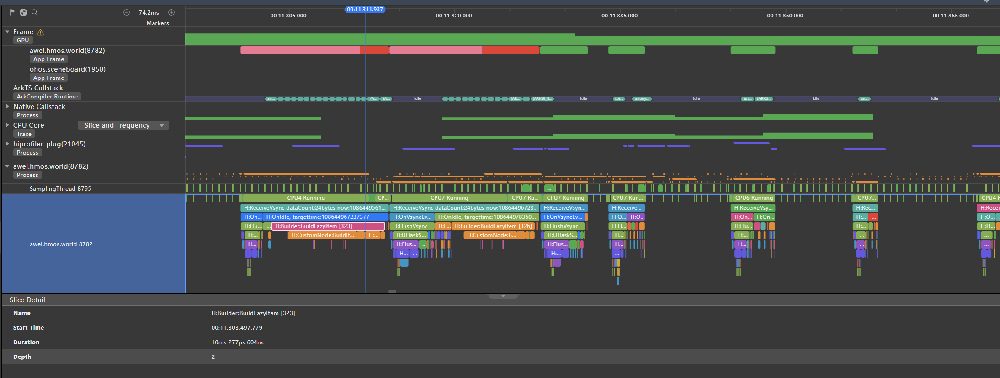


图18 对丢帧部分的放大分析（整体耗时13.430ms）

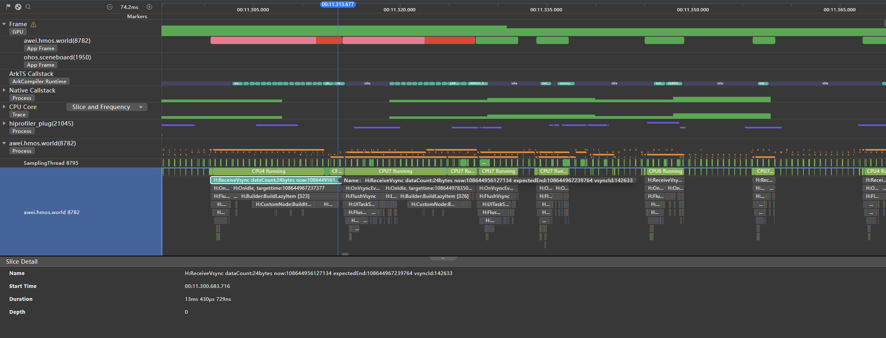


图中红色区域出现丢帧，缓存区中的最上面一个ListItem渲染时，BuildLazyItem操作耗时10.277ms，导致本帧总体耗时13.430ms，超过11.1ms而丢帧。

组件复用后

将代码进行改造，对复用组件ArticleCardView添加@Reusable注解，启用组件复用的相关代码后，以相同均匀速度滑动这个列表，得到的应用帧率检测情况如下：

图19 组件复用后（无丢帧）

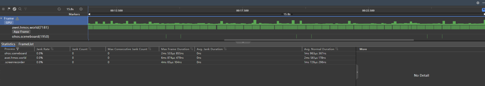


上图显示列表快速滑动15.8秒，泳道全绿表示无丢帧，丢帧率为0%。放大分析某帧，如下图所示：

图20 组件复用后某帧耗时分析

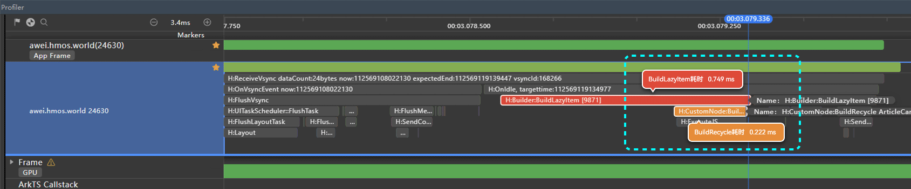


BuildLazyItem的耗时为0.749ms，远低于未进行复用时的10.277ms。复用前后的耗时数据如下表所示：


| 组件复用 | 组件复用前 | 组件复用后 |
| --- | --- | --- |
| 丢帧率 | 3.7% | 0% |
| BuildLazyItem耗时 | 10.277ms | 0.749ms |
| BuildRecycle耗时 | 不涉及 | 0.221ms |
| 总耗时 | 13.430ms | 7.310ms |


从图19可以看出，列表滑动时（15.8秒的区间段内）都是绿色，丢帧率为0%，没有出现图16中“规律且重复”的红色丢帧情况。这是因为List列表开启了组件复用功能，不会执行BuildLazyItem这个耗时操作（耗时10.277毫秒）。后续创建新组件节点时，会直接复用缓存区中的节点（耗时0.97毫秒），从而大幅减少了组件重新创建的时间。


> [!NOTE]
> 以上数据来源为版本DevEco Studio 4.0.3.415、SDK 4.0.10.9条件下测试得到，不同设备类型的数据会有所不同，测试数据用于体现性能优化趋势，仅供参考。


## 布局优化


### 原理介绍


列表布局包含大量重复的ListItem，因此优化每个ListItem的布局尤为重要。错误的布局方式会导致组件树和嵌套层数过多，增加创建和布局绘制的性能开销，引起界面卡顿。合理减少嵌套层数，可以提高布局效率。

针对“HMOS世界”中的首屏长列表，可以将ListItem的线性布局修改为相对布局，从而将最大嵌套层级从5层减少到2层。在列表循环渲染时，特别是在数据量较大时，这种改动可以显著提升页面性能。虽然这个例子较为简单，优化空间有限，但当列表元素较为复杂时，减少布局嵌套层级和避免过度绘制可以带来显著的性能提升。

图21 布局优化前后的层级变化

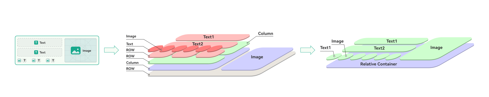


### 场景案例


为了对比布局嵌套层级对List列表滑动性能的影响，改造了相关代码。原始代码使用线性布局，最大嵌套层级为5层；通过相对布局优化代码，最大嵌套层级减少到2层；同时，刻意将布局过度嵌套，最大嵌套层级达到25层。示例代码如下所示：

- 对比案例1：线性布局，最大嵌套层级为5层
```ts
@Component
export struct ArticleCardView {
  build() {
    Row() { // Linear layout, layer 1
      Column() { // Linear layout, layer 2
        Column() {
          Text()
          Text()
        }
        Row() { // Linear layout, layer 3
          Row(){ // Linear layout, layer 4
            Image('') // Linear layout, layer 5
            Text()
          }
          Row(){
            Image('')
            Text()
          }
          Row(){
            Image('')
            Text()
          }
        }
      }
      Image('')
    }
  }
}
```
- 对比案例2：相对布局，最大嵌套层级为2层
```ts
@Component
struct ArticleCardView {
  build() {
    RelativeContainer() { // Relative layout, level 1
      Text()// ...
      Text()// ...
      Image('')// ...
      Text()// ... // Relative layout, level 2
      Image('')// ...
      Text()// ...
      Image('')// ...
      Text()// ...
      Image('')// ...
    }
  }
}
```
- 对比案例3：刻意嵌套20层，最大嵌套层级为25层
```text
@Component
struct ArticleCardView {
build() {
Column() {
Column() {
Column() {
// ... // Deliberate nesting with a maximum nesting level of 25 layers
}.width('100%')
}.width('100%')
}.width('100%')
}
}
```


### 性能分析


本文案例分析了正常情况和过度嵌套情况下应用独占内存、页面滑动帧率、丢帧率的对比。使用DevEco Studio中的ArkUI Inspector查看页面嵌套层级，如下所示：

图22 额外嵌套后的布局层级

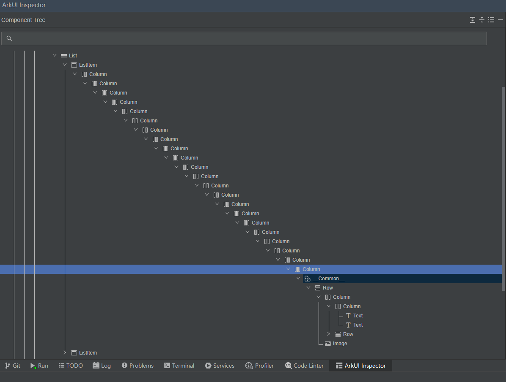


快速滑动10000条数据后，得到布局嵌套层级对列表性能的影响对比，如下所示：


| 布局 | 相对布局（2层） | 线性布局（5层） | 额外嵌套的线性布局（25层） |
| --- | --- | --- | --- |
| 独占内存 | 78.4MB | 80.1MB | 153.7MB |
| 丢帧率 | 0% | 0% | 2.3% |


布局过度嵌套会导致应用内存增加，并影响应用的帧率，增加丢帧。因此，开发者在编写列表等循环组件的代码时，需要优化布局。通常，布局的最大嵌套层级应控制在5到8层。过度优化布局会增加代码开发难度，降低代码可读性，增加维护成本，不利于多设备适配，且性能提升不明显。


## 总结与回顾


针对长列表这一场景，在本地模拟了10、100、1000、10000条数据，分别使用ForEach和LazyForEach，测试关闭和开启懒加载的完全显示所用时间、丢帧率、应用独占内存等各项指标。测试结果表明，使用LazyForEach懒加载技术后，与ForEach这种加载方式相比，在列表数据量较小（100条内）且数据一次性全量加载不是性能瓶颈时，两者各项性能指标差异不大。但当列表数据量较长，特别是达到10000条数据时，ForEach的上述4项性能指标显著劣化，滑动会出现明显的卡顿，甚至会出现应用崩溃等现象；而LazyForEach因为采用了懒加载技术，能明显减少首屏完全显示所用时间，降低应用的独占内存，提高页面滑动帧率，带来更好的性能。在10000条数据量下，其各项对比指标数据如下所示：


| 性能指标 | ForEach | LazyForEach | 缓存列表项 | 组件复用后 | 布局优化后 |
| --- | --- | --- | --- | --- | --- |
| 完全显示所用时间 | 5s841ms | 1s707ms | 1s658ms | 1s564ms | 1s339ms |
| 丢帧率 | 58.2% | 6.6% | 3.7% | 0.0% | 0.0% |
| 独占内存 | 560.1MB | 82.9MB | 81.7MB | 80.1MB | 78.4MB |


测试结果表明，使用 LazyForEach 时，合理添加缓存列表项，可以提升列表滑动帧率 2.9%，减少“滑动白块”的出现。使用组件复用技术后，由于省去了组件频繁创建的耗时操作，可以显著减少“有规律且重复”的丢帧现象，提高列表页面的加载速度和响应速度，丢帧率降低 3.7%。测试还证明，对页面进行布局优化在大数据量下可以显著提升页面性能。

需要指出的是，ForEach、LazyForEach、缓存列表项、组件复用和布局优化是在本地模拟10000条数据，通过控制变量的方法对ForEach和LazyForEach进行压力测试得出的数据结论。动态预加载则是在弱网和快速滑动状态下加载数据测试得出的结论。当使用网络数据探讨LazyForEach如何进行网络数据加载和优化时，可以采用动态预加载技术。动态预加载通过将预取和预渲染分离，并在滑动过程中实时更新列表项、预取数据和预渲染数据，从而在弱网和快速滑动场景中显著减少滑动过程中出现的白块现象。


> [!NOTE]
> 以上数据来源为DevEco Studio 4.0.3.415、SDK 4.0.10.9测试得到。不同设备类型数据可能有差异，测试数据仅体现性能优化趋势，仅供参考。


## 示例代码


- [基于ForEach和LazyForEach实现长列表](https://gitcode.com/harmonyos_samples/list-optimization)
