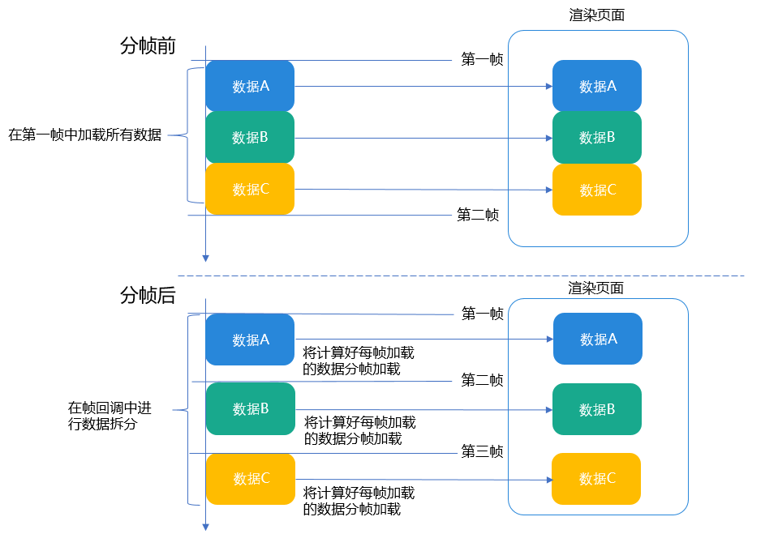
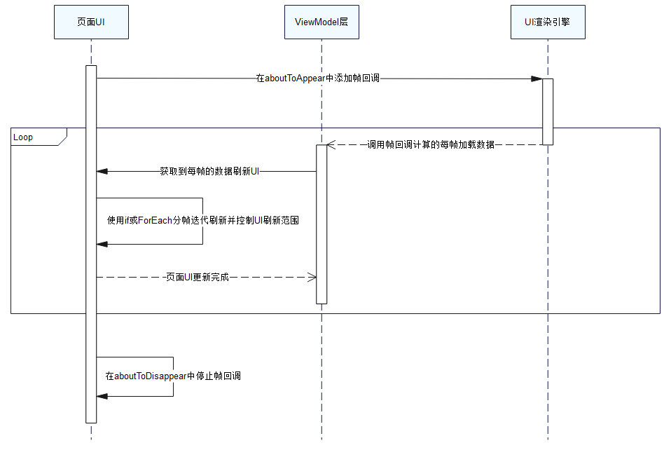
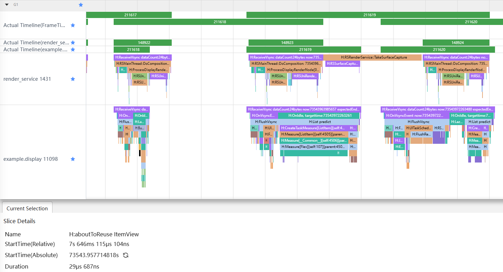
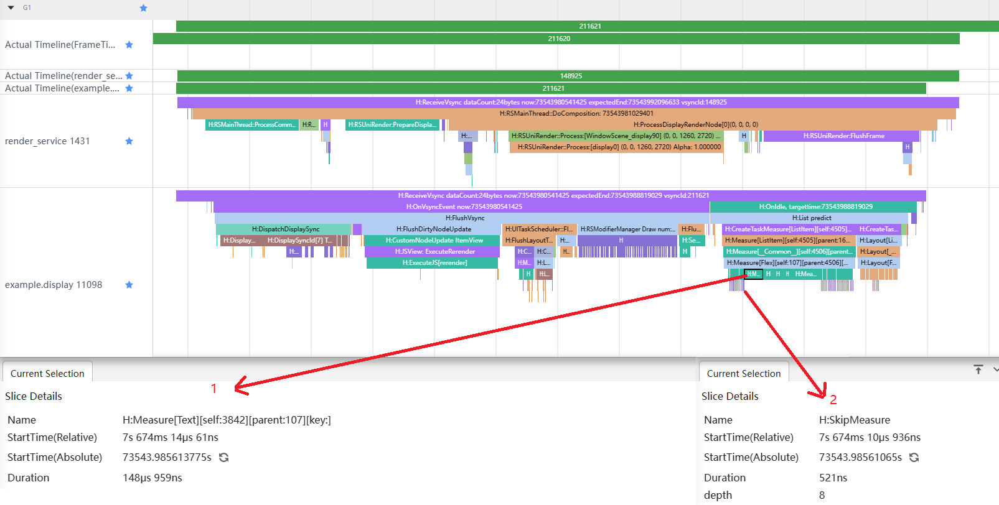
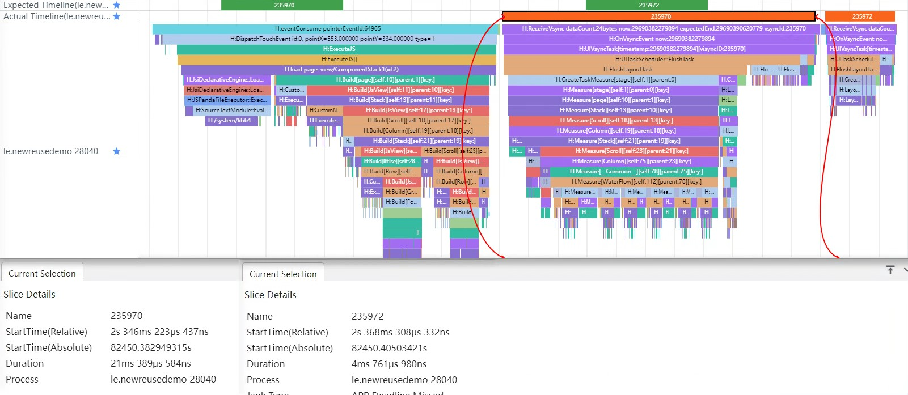
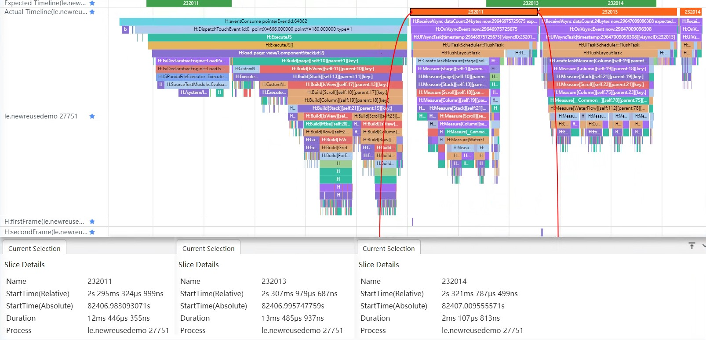
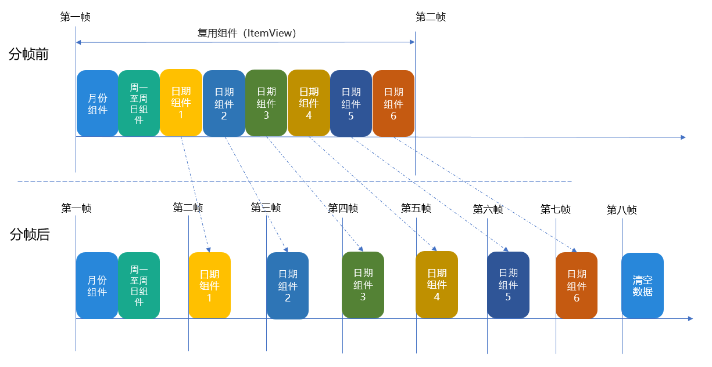
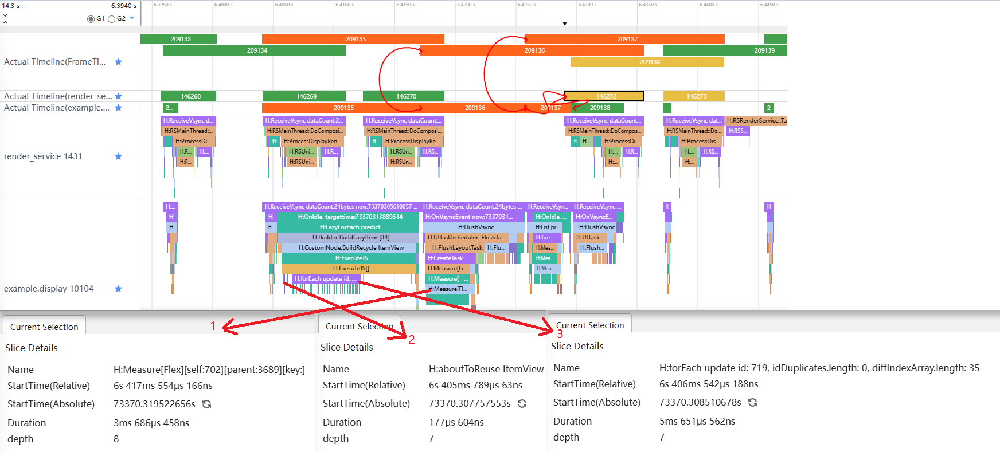

# 高负载场景分帧渲染

更新时间：2026-03-19 08:43:01

来源：https://developer.huawei.com/consumer/cn/doc/best-practices/bpta-dispose-highly-loaded-component-render

##### 概述

在应用开发中，页面内列表结构复杂，每个列表项包含的组件较多，就会导致嵌套层级较深，从而引起组件负载加重，绘制耗时增加。
 
在这种情况下，转场或者列表滑动的时候列表项就会一次性加载大量的数据，此时可以采用分帧渲染，将本来一帧内加载的数据分成多帧加载，但是分帧渲染需要开发者计算每帧中加载多少数据，操作复杂，因此在必要的情况下才推荐使用。
 
 

##### 实现原理

 

##### 原理说明

单帧内绘制多个特点各不相同的组件时，会同时创建数量较多的Graphics Pipelines，引发后续整个Flush阶段的耗时延长，从而导致单帧耗时超长。对于这种单帧内组件负载重、加载数据多和绘制耗时长的问题场景，开发者可以根据实际的业务逻辑、应用页面布局和数据量，提前计算规划出需要通过多少帧完成加载以及每帧具体加载的数据。应用页面实际加载绘制的时候，结合页面的布局，使用帧回调监听修改状态变量或补充数据到数据结构等方式，对每一帧需要处理的渲染数据进行计算和设置，保证每一帧内只处理提前设置好的数据。通过预先设置的帧回调监听，组件加载时可直接基于状态变量或数据结构实现分帧加载。这样就达到了原本在一帧中加载的数据分到多帧加载的目的，有效减少了首帧的耗时，避免首帧卡顿现象的出现。如下图所示，将一帧数据拆分到三帧示例：
 



 
 

##### 具体实现

在高负载场景下使用分帧渲染的关键操作是把数据拆分到每一帧中加载，但这个过程中加载新的数据时可能会将已有数据再次绘制，因此需要搭配合理的页面布局来避免重绘。可以通过if或ForEach两种方法来实现布局，两种方法的更新机制如下：
 
- [if更新机制](https://developer.huawei.com/consumer/cn/doc/harmonyos-guides/arkts-rendering-control-ifelse#更新机制)是根据状态判断条件，如果分支没有变化，不会对条件渲染语句进行更新。
- [ForEach非首次渲染](https://developer.huawei.com/consumer/cn/doc/harmonyos-guides/arkts-rendering-control-foreach#非首次渲染)会检查新生成的键值是否在上次渲染中已经存在。如果键值不存在，则会创建一个新的组件；如果键值存在，则不会创建新的组件，而是直接渲染该键值所对应的组件。

 
因此在分帧逐步加载数据时使用上述两种方法不会引起重绘。并且在页面布局时可以给分帧渲染的外部容器组件设置宽高，这样组件本身不会触发重新进行Measure的过程，对组件的宽高不会重新测算，避免因外部容器大小改变引起重绘，详情可参考[合理使用布局](https://developer.huawei.com/consumer/cn/doc/best-practices/bpta-improve-layout-performance)。
 
保证页面不会重绘后，在实际开发过程中为了逐步增加页面数据，可以使用ArkTS中提供的[displaySync（可变帧率）](https://developer.huawei.com/consumer/cn/doc/harmonyos-references/js-apis-graphics-displaysync)API接口，通过Vsync信号控制数据刷新的时机，来实现绘制内容帧率的控制。先通过页面UI中aboutToAppear()添加帧回调监听并开启监听，Vsync信号变化时触发帧回调执行应用逻辑，计算每帧加载的数据，改变ViewModel数据。ViewModel数据改变后驱动页面或组件执行build()，使用if或ForEach分帧迭代渲染绘制UI并控制刷新范围。最后可以在aboutToDisappear()里停止帧回调监听。
 
具体操作流程如下图：
 



 
 

##### 转场场景

由于业务需求，从当前页面进入一个新页面时，会有转场动画播放，并且在动画首帧中加载新页面所需要的数据。如果数据量较多，那么动画首帧的响应时延就会变长，导致后面动画帧延迟播放的情况。从一个页面到新页面转场流程图如下：
 



 
 

##### 解决思路

既然转场时一次性加载大量的数据会导致卡顿情况，那么采用分帧渲染将数据拆分成多份并分批次进行加载就是一种解决思路。
 
转场场景分帧：转场时会在动画首帧加载新页面的数据，采用分帧策略就是将首帧加载的数据拆分，将数据拆分到后面的帧加载，新页面打开后List列表只展示两个列表项，因此在首帧加载显示两条数据，其余缓存数据可以在第二帧加载。该方法的优点是减少动画首帧的响应时间，缺点是转场动画完成时延变长。
 
转场场景效果图如下：
 



 
在分帧前会在转场动画的首帧将层叠组件和列表可见区域与缓存区域的数据全部加载，而分帧后在首帧加载层叠组件和列表前两项的数据，在第二帧加载缓存区域的列表数据。分帧前后示意图如下：
 


 
 

##### 常规代码

通常情况下，在自定义列表组件中一次性加载全部数据，更新所有的列表项。
 
```ArkTS
@Component
export struct TransitionScene {
  private productData: ProductDetailSource = new ProductDetailSource();

  aboutToAppear(): void {
    this.productData.getProductData();
  }

  build() {
    WaterFlow() {
      LazyForEach(this.productData, (item: ProductDetailModel) => {
        FlowItem() {
          // ...
        }
      }, (item: ProductDetailModel) => item.id.toString())
    }
    // ...
  }
}
```
 
 
这段代码里，在组件即将出现时回调aboutToAppear()接口，将数据放入productData中，并通过瀑布流加载。编译运行后，可以通过Trace图看到，转场动画的首帧耗时21ms左右，这是因为在点击进入页面时将数据全部放入瀑布流，在235970帧中需要计算每个子组件的尺寸，导致了响应时间增长。
 


 
> [!NOTE]
> 上图是运行DevEco Studio中的Profiler工具结果Trace图，针对Frame运行的性能分析泳道。 Actual TimeLane：橙色块235970为页面渲染第一帧的过程，橙色块235972为渲染第二帧的过程。 Slice Details：应用渲染每帧的情况，Duration代表渲染此帧的耗时。如上图所示，第一帧耗时21ms，第二帧耗时4ms。 Trace图帧分析详情请参考： Frame分析 。

 

##### 优化代码

在aboutToAppear()接口中添加displaySync的帧回调，并将数据拆分进行加载。
 
```ArkTS
@Entry
@Component
struct TransitionScene {
  @State currentIndex: number = 0;
  private readonly LIST_SPACE: number = 10;
  private readonly FRAME_60: number = 60;
  private readonly FRAME_120: number = 120;
  private readonly SWIPER_CACHE: number = 2;
  private readonly HORIZONTAL_LIST_CACHE: number = 2;
  private swiperDataSource: SwiperDataSource = new SwiperDataSource();
  private midListDataSource: MidListDataSource = new MidListDataSource();
  private productDetailSource: ProductDetailSource = new ProductDetailSource();
  private displaySync: displaySync.DisplaySync | undefined = undefined;
  private frame: number = 1;

  aboutToAppear(): void {
    this.swiperDataSource.getProductData();
    this.midListDataSource.getProductData();

    // Creating a DisplaySync Object
    this.displaySync = displaySync.create();

    // Set the expected frame rate
    let range: ExpectedFrameRateRange = {
      expected: this.FRAME_120,
      min: this.FRAME_60,
      max: this.FRAME_120
    };
    this.displaySync.setExpectedFrameRateRange(range);

    // Add Frame Callback
    this.displaySync.on('frame', () => {
      if (this.frame === 1) {
        hiTraceMeter.startTrace('firstFrame', 1);
        this.productDetailSource.getProductData(0, 2);
        this.frame += 1;
        hiTraceMeter.finishTrace('firstFrame', 1);
      } else if (this.frame === 2) {
        hiTraceMeter.startTrace('secondFrame', 2);
        this.productDetailSource.getProductData(2, 10);
        hiTraceMeter.finishTrace('secondFrame', 2);
        this.frame += 1;
        this.displaySync?.stop();
      }
    });

    // Enable frame callback listening
    this.displaySync.start();
  }

  aboutToDisappear(): void {
    if (this.displaySync) {
      this.displaySync.stop();
      this.displaySync.off('frame');
      this.displaySync = undefined;
    }
  }

  build() {
    Column() {
      Search({ placeholder: $r('app.string.search_title') })
      this.typeSwiper();
      this.typeList();
      this.typeWaterFlow();
    }
    .padding({
      left: 16,
      right: 16
    })
  }
```
 
 
在这段代码中，aboutToAppear()接口中并没有一次性加载全部数据，而是将数据拆分，在帧回调中分成2次进行加载，编译运行后，通过Trace图可以看到，动画首帧的耗时是12ms。相较于优化前的代码，不再是首帧占据大量的时间，而是将耗时分摊到了后面的动画帧中。当数据量更大时，可以将数据进行更多次拆分，将不会直接出现在屏幕上的数据放到第二帧或者第三帧中进行加载，降低首帧的响应时延。
 



 
对使用分帧前后进行分析，得到的数据如下表所示：
  
| 使用分帧 | 使用分帧前 | 使用分帧后 |
| --- | --- | --- |
| 首帧耗时 | 21ms | 12ms |
| 第二帧耗时 | 4ms | 13ms |
 
 
在使用分帧后动画首帧与第二帧分别是12ms和13ms，如果依然没有达到期望的帧率，可以继续将数据拆分。
 

##### 滑动场景

在日历应用中，需要在一个List里面加载每个月的全部天数，包括公历和农历日期，这样在一个ItemView复用组件中就会有很多数据加载，当列表滑动的时候，通过组件复用的aboutToReuse()接口设置新的数据，就会导致ItemView内所有组件一起刷新，可能会引起掉帧卡顿现象。
 
 

##### 解决思路

由于一次性加载大量数据、刷新大量组件会导致卡顿丢帧，那么减少一次性加载的数据量就是一种解决方法。但是由于业务需求，需要加载的数据总量和绘制的组件数量是不能减少的，那么就可以考虑采用分帧渲染。
 
滑动场景分帧：滑动日历列表，复用ItemView组件，更新每月天数包含阴历和阳历，一次更新所有天数，数据量大，可以使用分帧策略，将每月日期数据进行拆分，一帧只更新5天数据，在使用ForEach循环每月的天数时，因为一次只更新5天数据，ForEach会根据key值更新对应的天数，从而避免在一帧中更新所有数据。该方法优点是可以将数据拆分在多帧中加载；缺点是操作比较麻烦，需要开发者根据实际情况计算一帧中加载的数据量，维护较为复杂。
 
滑动场景效果图如下：
 



 
分帧前后示意图如下：
 


 
 

##### 常规代码

通常情况下，会在aboutToReuse()中设置新的数据，并一次性绘制所有的组件。
 
```ArkTS
@Reusable
@Component
export struct DateItemView {
  @State monthItem: Month = {
    month: '',
    num: 0,
    days: [],
    lunarDays: [],
    year: 0
  };
  // ...
  aboutToReuse(params: Record<string, Object>): void {
    hiTraceMeter.startTrace('reuse_' + (params.monthItem as Month).month, 1);
    this.monthItem = params.monthItem as Month;
    hiTraceMeter.finishTrace('reuse_' + (params.monthItem as Month).month, 1);
  }

  build() {
    Flex({ wrap: FlexWrap.Wrap }) {
      // ...
      ForEach(this.monthItem.days, (day: number, index: number) => {
        // ...
      }, (index: number): string => index.toString())
    }
    // ...
  }
}
```
 
 
在上面的代码中，通过组件复用，在ItemView的aboutToReuse()接口中，将一个月的数据直接设置到状态变量monthItem中，这样下面的Flex就会收到状态变量变更的消息通知，从而刷新组件中的数据。编译运行后，进入日历页面，然后滑动列表到最底端，分析下图。
 



 
- 选中Actual Timeline（render_service）标签中的146272后，可以通过箭头看到它所关联到的位置是Actual Timeline（example.display）标签中的209136和209137，即RenderService层出现的异常情况是由应用层中前面两帧里面的操作引起的。
- 通过箭头2的标签可以看到，在209135中调用了aboutToReuse接口，此时系统开始了组件复用的绘制操作，在aboutToReuse接口将一个月的所有数据全部放入了当前被复用的组件中，并更新了所有用于显示日期的Text组件中的数据（箭头3，diffIndexArray.length：35，表示有35个不同的元素），这就导致209136需要计算35个子组件的尺寸（箭头1），从而引起146272的绘制时间延长。
- 在列表数据量较少时，其实并不会引起掉帧现象，因为每次延长帧的时间都很短，对帧率的影响较小，但是在列表数据较多时，就会因为延长帧过多，发生掉帧现象。

 

##### 优化代码

通过displaySync中的帧回调方法，将数据拆分到每一帧中进行加载和绘制，只需要在帧回调中修改自定义子组件ItemView中加载数据的方式。
 
 
首先，需要在ItemView中第一次使用时创建displaySync对象，设置期望帧率，添加帧回调的监听，然后进行启动。
 
```ArkTS
@Reusable
@Component
export struct DateItemView {
  // ...
  aboutToAppear(): void {
    hiTraceMeter.startTrace('appear_', 1);
    this.displaySync = displaySync.create();
    const range: ExpectedFrameRateRange = {
      expected: 120,
      min: 60,
      max: 120
    };
    this.displaySync.setExpectedFrameRateRange(range);
    this.displaySync.on('frame', () => {
      // ...
    });
    this.displaySync.start();
    allDisplaySyncArray.push(this.displaySync);
    this.temp.push(this.monthItem);
    hiTraceMeter.finishTrace('appear_', 1);
  }
  // ...
}
```
 
然后，在监听中添加更新数据的代码。这里将每个月的数据更新拆分开来，第一步用来更新月份数据和计算总的执行步骤，最后一步将计数数据清空， 方便下一次数据的写入，其余需要执行步骤的多少根据每次加载数据量会有所改变。
 
```ArkTS
if (this.temp.length > 0) {
  if (this.step === 0) {
    // Step 1: Add the monthly data and calculate the maximum number of frames required to complete the data operation.
    hiTraceMeter.startTrace('reuse_' + this.step, 1);
    this.month = this.temp[0].month;
    this.monthNumber = this.temp[0].num;
    this.maxStep = this.maxStep + Math.ceil(this.temp[0].days.length / this.MAX_EVERY_FRAME);
    hiTraceMeter.finishTrace('reuse_' + this.step, 1);
    this.step += 1;
  } else if (this.step === this.maxStep - 1) {
    // Final step: Initialize partial count data.
    this.temp = [];
    this.step = 0;
    this.maxStep = 2;
  } else {
    hiTraceMeter.startTrace('reuse_' + this.step, 1);
    const start: number = this.MAX_EVERY_FRAME * (this.step - 1);
    const end: number = (this.MAX_EVERY_FRAME * this.step) > this.temp[0].days.length ?
    this.temp[0].days.length : this.MAX_EVERY_FRAME * this.step;
    for (let i = start; i < end; i++) {
      this.days[i] = this.temp[0].days[i];
      this.lunarDays[i] = this.temp[0].lunarDays[i];
    }
    hiTraceMeter.finishTrace('reuse_' + this.step, 1);
    this.step += 1;
  }
}
```
 
最后，在aboutToReuse接口中将数据放入数组中，用于帧回调中开始执行数据更新。
 
```ArkTS
aboutToReuse(params: Record<string, Object>): void {
  hiTraceMeter.startTrace('reuse_' + (params.monthItem as Month).month, 1);
  this.temp.push(params.monthItem as Month);
  hiTraceMeter.finishTrace('reuse_' + (params.monthItem as Month).month, 1);
}
```
 
分析下面trace图，在211618中，开始调用aboutToReuse接口，由于只是将数据放入一个temp数组中，并没有更新复用组件中的数据，所以这一帧并没有发生延长现象。
 
在211619中开始逐步更新复用组件中的数据，在第一帧中更新月份和周的数据，但是由于前一帧（211618）中并没有更新当前复用组件中的数据，所以在211619中并不需要绘制组件，所以此帧耗时依旧很短。
 
结合代码可以看到，在211620中放入了5天的日期数据，由于前一帧（211619）只是设置了2条数据，并且只有1条会更新，所以这一帧的绘制时间也不会超时。
 



 
和前一帧（211620）一样，此帧（211621）中更新了5天的日期数据，并且会重新测量上一帧中更新数据的5个Text组件尺寸（箭头1），而其余的组件由于数据并没有变动，所以测量被略过了（箭头2）。
 
后面的帧是类似的，每次只会放入5天的数据，并且更新上一帧中设置的数据所关联的Text组件。由于每次更新的组件数量较少，每帧基本上都能在规定的时间内（1秒120帧，即8ms一帧）绘制完成，所以延长帧就会较少。这样不论列表中数据多还是少，都不会引起掉帧现象的发生。
 


  
| 使用分帧 | 使用分帧前 | 使用分帧后 |
| --- | --- | --- |
| 渲染帧率 | 113fps | 120fps |
| 丢帧率 | 5.8% | 0% |
 
 
在使用displaySync时不建议将ExpectedFrameRateRange中的expected、min、max都设置为120，否则会干扰系统的可变帧率机制运行，产生不必要的负载，进而影响到整机的性能和功耗，详情请参考[场景策略建议](https://developer.huawei.com/consumer/cn/doc/best-practices/bpta-ltpo-description#section12516101118180)。
 

##### 总结

通过上面的示例代码和优化过程，可以看到在列表中使用组件复用时，一次性全部加载时可能会引起掉帧。虽然在数据量较少时，单帧绘制的延长并不会引起掉帧，但是数据量变多后，这种延长帧的影响就会比较明显。根据自己实际业务需求合理使用分帧策略进行数据拆分后，可以有效减少延长帧的发生，从而减少掉帧引起的性能问题。
 
 

##### 示例代码

- [基于分帧渲染实现应用界面优化](https://gitcode.com/harmonyos_samples/BestPracticeSnippets/tree/master/FramedRendering)
