# 图片资源加载优化

更新时间：2026-05-18 00:55:31

来源：https://developer.huawei.com/consumer/cn/doc/best-practices/bpta-texture-compression-improve-performance

##### 概述

在应用开发中，当图片资源数量或大小超过特定阈值时，由于图片资源的格式需要通过CPU解压缩为纹理格式才能直接被GPU读取，将增加CPU的处理时间，导致图片加载延迟。此外，CPU解压缩生成的图片资源会占用大量内存空间，增加内存压力，可能导致卡顿和掉帧。本文从预置图片与非预置图片两个方面介绍图片资源加载优化方案。其中，预置图片主要通过纹理压缩技术进行优化；非预置图片资源则包括使用图像编辑工具压缩、降低GIF图片分辨率、优化网络图片资源、优先使用.webp图片，利用autoResize对图片资源进行降采样等优化策略。
 
 

##### 预置图片资源加载优化

预置图片资源是指打包在应用安装包内的本地图片，存放于‘resource/base/media’目录下。开发者可通过纹理压缩对预置图片资源进行加载优化。
 
 

##### 纹理压缩

纹理压缩用于减小纹理图片文件大小，通过纹理压缩技术，在构建过程中对预置图片进行转码和压缩，从而减少CPU的处理时间，降低内存占用，提升应用性能。
 
 
**实现原理**
 
预置图片在不使用纹理压缩时，需要先经CPU解码生成PixelMap，再上传给GPU生成纹理。此过程耗时较长。开发者可使用纹理压缩技术，在编译构建阶段提前完成CPU解码和纹理生成，以减少CPU处理图片的时间。纹理压缩需在编译文件中配置相关属性，构建时根据配置找到预置图片，转换生成纹理码流，并进行超压缩编码生成超压缩码流。编译完成后进入运行态，进行超压缩解码生成纹理码流，GPU读取纹理码流后进行渲染显示。
 

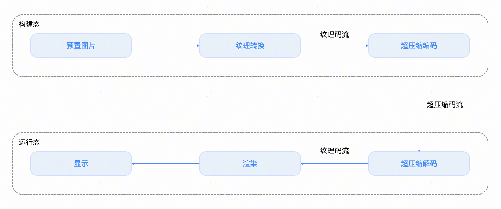

 
纹理压缩在编译构建中对预置图片进行处理。首先在编辑器的编译文件中配置纹理压缩参数。根据配置参数，hvigor读取待压缩的文件资源，构造[restool](https://developer.huawei.com/consumer/cn/doc/harmonyos-guides/restool)命令解析并生成资源文件列表。然后遍历文件列表，将待转换文件转码为纹理格式。已转换的资源文件不再打包到构建产物中。最后将纹理文件和未转换的文件一起构建生成资源产物。
 
编译构建资源文件开启纹理压缩时序图如下：
 

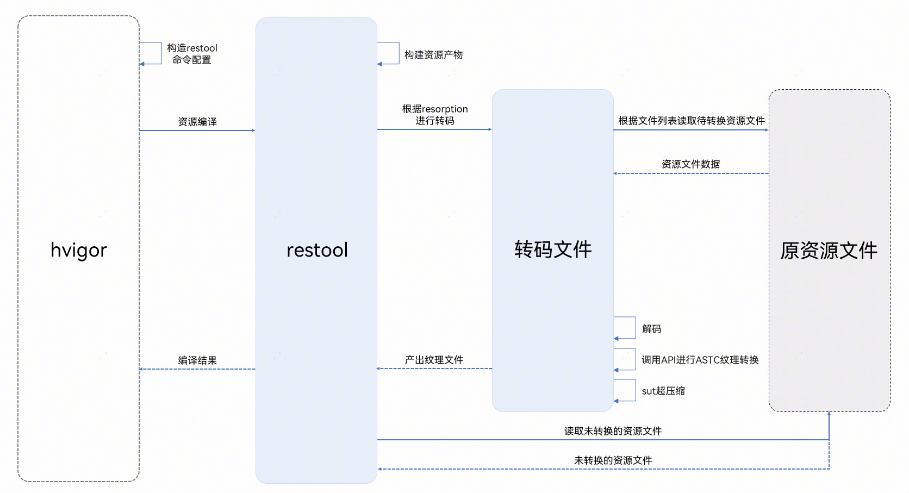

 
> [!NOTE]
> 纹理压缩在编译构建时会提前处理预置图片，这可能会增加编译时间并导致包体增大。如果资源图片占用较多空间，对包体积影响显著，建议筛选图片资源，以减少纹理压缩的开销。

 
**场景案例**
 
由于图片格式无法直接被GPU渲染，需要CPU解码后上传到GPU，这会消耗一定时间。当一个页面同时渲染一定数量的预置图片时，可能会导致图片完成时延增加。以下是一个Tab栏切换的示例，当向右滑动切换到tab2页面时，新页面通过横列布局加载40张.png格式和40张.jpg格式的预置图片。对比开启和关闭纹理压缩两种情况，图片完成时延有显著差异。未开启纹理压缩情况下切换过程的效果图如下：
 

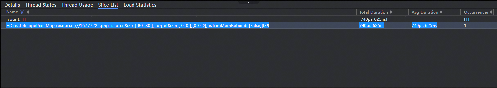

 
在不使用纹理压缩的情况下，当向右滑动切换到tab2页面时，由于新页面包含多张预置图片需要加载，可能会导致部分图片加载延迟，出现显示白块的情况。
 
**工程配置**
 
使用纹理压缩前，需进行基础配置，选择要超压缩的预置图片。可在工程级或模块级的build-profile.json5配置文件中，于compression对象内添加media和filters属性。
 
media：在media中，enable属性用于控制是否启用纹理压缩。默认值为false，表示不启用纹理压缩。需要启用纹理压缩时，将enable属性值设为true。
 
filters：在filters属性中可配置method、files和exclude三个属性对象。
 
- method中包含两个属性type和blocks。type可以设置为转换类型“sut”或“astc”。blocks用于设置转换类型的扩展参数，当前仅支持“4x4”。
- files中的三个属性path、size和resolution分别指定按路径、大小和分辨率匹配的过滤条件。
- 在exclude中列出的属性与files中相同，从files中移除不需要压缩的文件。

 
基本编译配置项的类型及说明可参考[compression](https://developer.huawei.com/consumer/cn/doc/harmonyos-guides/ide-hvigor-build-profile#section2095319147103)。纹理压缩配置的示例代码如下：
 
```json
"buildOption": {
  "resOptions": {
    "compression": {
      "media": {
        "enable": true // Whether to enable texture compression for media images
      },
      // Filtering of texture compression files. This field is not mandatory. If this field is not set, all images in the resource directory will be compressed
      "filters": [
        {
          "method": {
            "type": "sut", // conversion type
            "blocks": "4x4" // The extended parameters of the conversion type
          },
          // Specifies the files used for compression. Only files that meet all conditions and are not excluded can be compressed
          "files": {
            "path": ["./**/*"], // All files in the specified resource directory
            "size": [[0, '1000k']], // Files with a specified size of less than 1000k
            // Pictures with a resolution smaller than 3000 x 3000
            "resolution": [
              [
                { "width": 0, "height": 0 }, // minimum width and height
                { "width": 3000, "height": 3000 } // Maximum width and height
              ]
            ]
          },
          // Remove files that do not need to be compressed from the files list. Only files that meet all filtering conditions are deleted
          "exclude": {
            "path": ["./**/*.webp"], // Filter all webp files
            "size": [[0, '1k']], // Filter files smaller than 1k in size
            // Filter images with a resolution smaller than 1024 x 1024
            "resolution": [
              [
                { "width": 0, "height": 0 }, // minimum width and height
                { "width": 1024, "height": 1024 } // Maximum width and height
              ]
            ]
          }
        }
      ]
    }
  }},
```
 
配置项注意点：
 1. 文件过滤配置参数filters：当工程级和模块级同时配置时，优先按模块级的过滤条件匹配。若模块级匹配成功，忽略工程级的过滤条件；若模块级未匹配成功，继续按工程级的条件匹配。
2. 转换类型type：
- astc（Adaptive Scalable Texture Compression）：自适应可变纹理压缩，一种对GPU友好的纹理格式，可在设备侧更快地显示，有更少的内存占用。

3. sut（Super compression for Texture）：纹理超压缩，一种对GPU友好的纹理格式，可在设备侧更快地显示，有更少的内存占用，相比astc具备更大压缩率和更少ROM占用。

4. size（按大小匹配）和resolution（按分辨率匹配）：注意size一维数组和resolution二维数组的区别。

  按大小匹配是一维数组，因此按大小匹配[0-1k，1k-2k]与按大小匹配[0-2k]的取值范围相同。

  按分辨率匹配时，匹配分辨率的宽高值是二维数组。下图左侧表示分辨率小于2048×2048的所有图片，右侧表示分辨率小于1024×1024的图片和分辨率大于1024×1024且小于2048×2048的图片。虽然两种写法看似相同，但其取值范围并不一致。

  
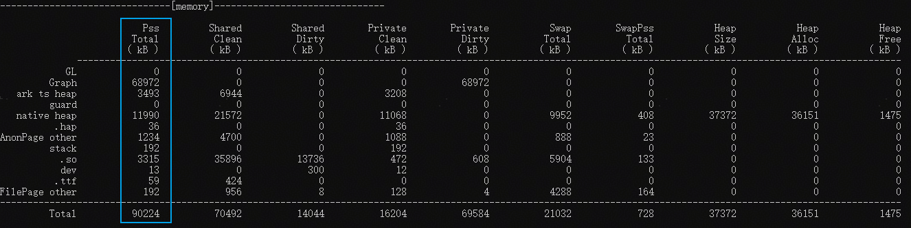


  **编译执行**

  配置相关参数后，执行项目编译构建。编译过程中，hvigor根据配置参数获取预置图片，通过转码部件进行纹理压缩并打包。纹理压缩后的Tab栏切换效果如下：

  
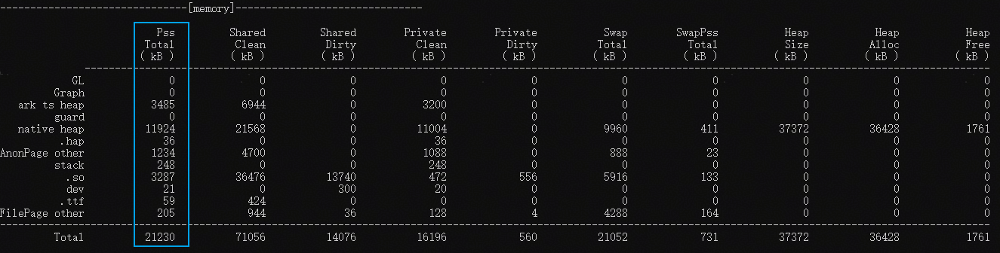


  通过效果图可以看出，使用纹理压缩时，切换到tab2页面后，图片立即显示，没有延迟或白块出现。

  **收益和开销**

  在使用纹理压缩进行预置图片资源转换时，需关注覆盖的资源文件数量，确保在获取高收益的同时，减少开销的影响。因此，纹理超压缩的性能提升应从收益和开销两个方面进行分析。

  **收益**

  纹理压缩的主要收益是将预置图片转换为纹理格式，直接被GPU读取，降低CPU和DDR的负载，加快图片加载速度。在Tab栏切换示例中，预置图片分别以原图（.png）、纹理超压缩（.sut）和自适应可变纹理压缩（.astc）三种方式测试，图片读取耗时如下图所示：

  


  统计以上H:CreateImagePixelMap的耗时得到下表：

| 文件 | 耗时 | 收益 |

| --- | --- | --- |

| 原图（.png） | 62.103ms | - |

| 纹理超压缩（.sut） | 15.309ms | 4.13倍 |

| 自适应可变纹理压缩（.astc） | 38.239ms | 1.63倍 |

  使用原图（.png）格式的图片加载时间大约是纹理格式加载时间的4倍，而纹理超压缩和自适应可变纹理压缩的加载时间大约是纹理格式的2倍。开启纹理超压缩或自适应可变纹理压缩可以显著提升应用中预置图片的加载速度。

  在对比加载图片的耗时后，使用Tab栏切换示例测试内存大小，查看纹理压缩前后的内存占用情况。相关数据如下图所示：

  
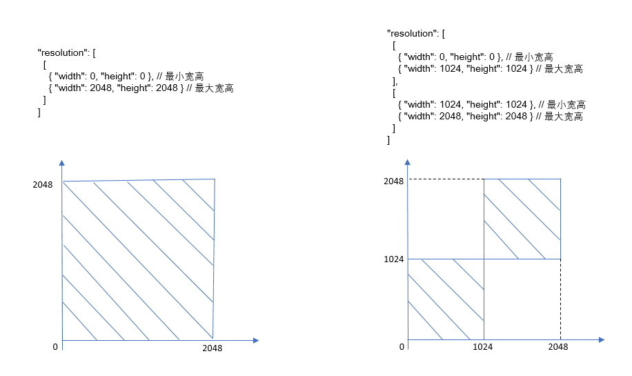


  
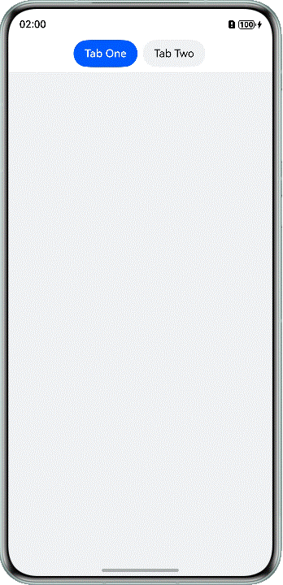


  
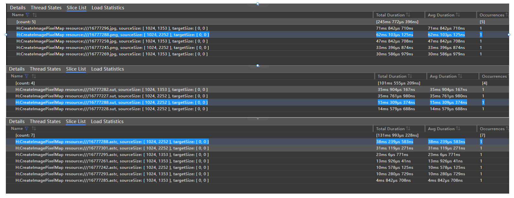


  统计纹理压缩开启前后的内存占用大小数据如下表：

| 是否开启纹理压缩 | 内存占用大小 |

| --- | --- |

| 开启（.sut） | 165015KB |

| 开启（.astc） | 167723KB |

| 关闭 | 598965KB |

  通过表中数据可知，开启纹理压缩后，内存占用从598965KB 下降到165015KB 至167723KB，图片加载占用的内存显著减少。

  **开销**

  使用纹理压缩时，编译过程中会预置图片转换，这会增加编译时间。预置图片转换为纹理格式后，根据图片格式的不同，转换后的大小也会有所不同，可能导致包体膨胀或收缩。

  编译时间长的问题是因为在编译过程中增加了纹理压缩的过程，可以各准备87张png/webp/jpg预置图片分别以全量编译、修改按分辨率过滤参数和增加1~100张图片三种情况进行编译打包，对比三种情况下纹理压缩打开和关闭的编译时长，得到相关数据如下表所示：

| 测试用例 | 纹理压缩关 | 纹理压缩开 | 增加耗时说明 |

| --- | --- | --- | --- |

| 全量编译 | 19s 74ms | 1min 16s | 遍历资源文件+纹理压缩+搬移资源文件 |

| 修改按分辨率过滤参数 | - | 16s 487ms | 遍历资源文件+搬移资源文件 |

| 增加1~100张图片 | 10s 177ms~10s 283ms | 16s 491ms~16s 673ms | 遍历资源文件 |

  从上表可以看出，开启纹理压缩后，全量编译耗时较长。但是，按分辨率过滤预置图片后再次进行纹理压缩，能够显著减少编译时长。

  在对比编译时长的问题后，测量了若干示例应用，发现.jpg和.webp格式图片的体积膨胀率为2到3倍。具体开启纹理超压缩后的体积膨胀率数据如下表所示：

| 图片格式 | 纹理压缩相比原图膨胀率 |

| --- | --- |

| .jpg | 3.05 |

| .png | 0.92 |

| .webp | 2.50 |

  
> [!NOTE]
> 具体工程应用会因为实际工程内资源大小、格式、分辨率和数量等因素的不同产生不同的包体膨胀率，以上数据仅供开发者参考。


  .png格式的图片纹理压缩后，包体积没有增加，而.jpg格式和.webp格式的图片包体积显著增加。综合编译时长和打包体积考虑，为了使用纹理超压缩获得更好的性能，在对包体积敏感的场景下，可以采用将所有.png格式图片进行纹理压缩；对.jpg和.webp格式的图片，挑选高频使用或对关键帧有重要影响的部分进行转换的策略。

  

  ##### 非预置图片资源加载优化

  非预置图片不是应用内的资源，而是通常来自网络或本地文件系统。这类图片一般不是固定不变的，例如：用户头像、动态内容中的图片、从服务器获取的商品图片等。本章节将从图片使用前和使用中两个层面介绍几种常见的非预置图片资源加载优化方案，具体如下。

  
优化使用前的图片资源：预压缩到实际UI尺寸，包括[使用图像编辑工具压缩](#section16467122642119)、[GIF图片降低分辨率](#section1797994818210)；

  [使用CDN优化网络图片资源](#section91581551143319)；

  [优先使用.webp图片](#section574283918342)。
- 优化使用中的图片资源：

  [使用autoresize对Image组件进行降采样](#section14375239203519)。

 
 

##### 使用图像编辑工具压缩

在应用构建前，建议使用图片编辑工具或脚本，将图片分辨率调整为UI中的实际显示大小，并进行适当的压缩编码，以减小资源体积、提升加载性能。
 
 

##### GIF图片降低分辨率

通过使用FFmpeg三方库的能力降低分辨率，有以下两种方式实现GIF图片的压缩（也可将两种方式进行结合）。
 
使用-s设置图片的分辨率，例如，将一个GIF图片的分辨率降低，宽高设置为90x90像素，可以使用如下命令：
```text
ffmpeg -i input.gif -s 90x90 -y output.gif （设置宽高均为90像素）
```
 
 
或者使用-vf参数配合scale过滤器，设置宽为90像素，高度自动等比例缩放。
 
```text
ffmpeg -i input.gif -vf "scale=90:-1" -y output.gif
```
 
以上命令的参数的意义如下：
 
- -s 90x90：设置图片分辨率为90x90像素。
- -y：覆盖已有文件。
- -vf "scale=90:-1"：设置图片滤镜，参数是单个滤镜或多个逗号分隔的滤镜链。

 
 
**预压缩场景案例**
 
例如，在网页或App中有一个头像显示区域，大小为80*80px，此时有一张4180*4180的大图，若直接通过代码缩放到80*80显示，会出现内存占用高、解码慢、滚动卡顿的问题；正确的做法是，提前将图片压缩并缩放为80*80的小图，然后再进行加载显示。对比压缩前和压缩后两种情况，图片完成时延有显著差异。
 

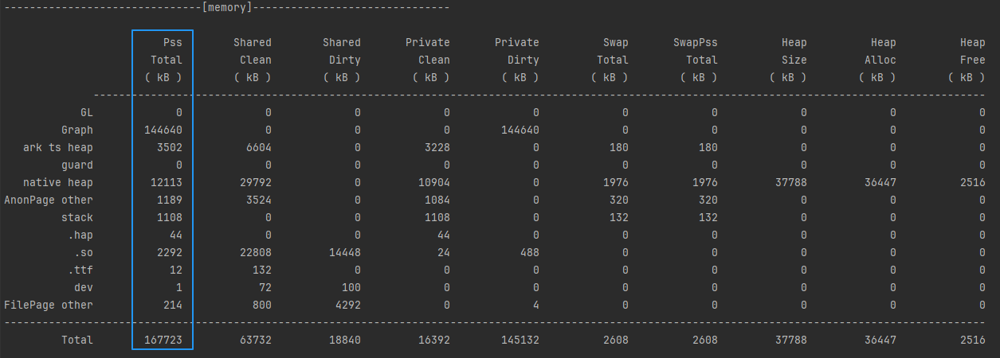

 
**耗时对比**
 
点击切换示例测试耗时时长，查看压缩前后的图片读取耗时情况。相关数据如下图所示：
 

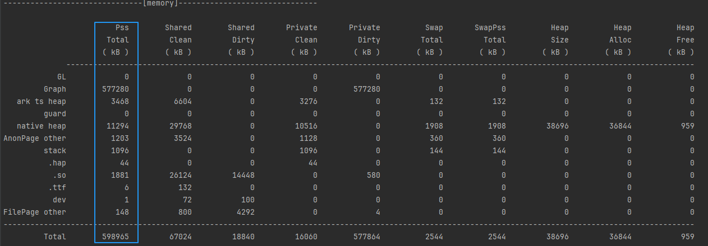

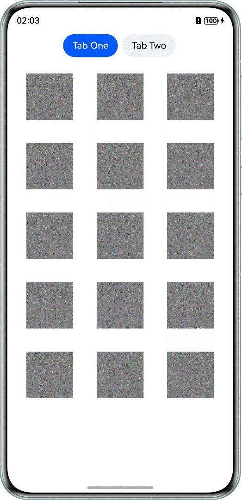

 
统计预压缩到实际UI尺寸前后的图片解码耗时数据如下表：
  
| 是否预压缩到实际UI尺寸 | 图片解码耗时 |
| --- | --- |
| 否 | 93ms |
| 是 | 740us |
 
 
通过表中数据可知，预压缩到实际UI尺寸后，图片加载耗时从93ms下降到740us，加载速度显著提升。
 

 
**内存占用对比**
 
点击切换示例测试内存大小，查看压缩前后的内存占用情况。相关数据如下图所示：
 


 


 
统计预压缩到实际UI尺寸前后的内存占用大小数据如下表：
  
| 是否预压缩到实际UI尺寸 | 内存占用大小 |
| --- | --- |
| 否 | 90224KB |
| 是 | 21230KB |
 
 
通过表中数据可知，预压缩到实际UI尺寸后，内存占用从90224KB下降到21230KB，图片加载占用的内存显著减少。
 

##### 使用CDN优化网络图片资源

优化网络图片资源加载有利于提升用户体验、减少流量消耗、降低内存占用以及加快页面渲染速度等。CDN（Content Delivery Network）是一种用于加快内容分发的网络技术。使用CDN裁剪图片是一种高效优化图片加载性能的方式，通过CDN提供的动态处理能力，用户可按需调整图片的尺寸、质量、格式等参数，减少带宽消耗，提高页面加载速度。
 
 
**实现思路**
 
大多数CDN服务提供者（如：华为云）支持通过在图片URL后附加查询参数来动态调整图片大小、格式转换等。这些参数可以控制图片的宽度、高度、裁剪方式等属性，常见参数示例如下：
 
- w：图片宽度
- h：图片高度
- fit：裁剪方式
- q：图片质量
- format：输出格式（如webp、jpeg）

 
例如，有一个URL为"https://your-cdn-url.com/path/to/image.jpg"的网络图片，需要返回一个宽度为200，高度为150，采用cover裁剪方式，质量（图片清晰度等综合指标）为85%，并且转换为.webp格式的图片。可参考以下方式实现。
 
```ArkTS
// It needs to be replaced with the image resource address required by the developer.
private imgUrl = 'https://******.com/path/to/image.jpg?w=200&h=150&fit=cover&q=85&format=webp';

build() {
  NavDestination() {
    Column() {
      Image(this.imgUrl)
        .width(200)
        .height(150)
        .objectFit(ImageFit.Cover)
    }
    .width('100%')
    .height('100%')
  }
  .backgroundColor('#F1F3F5')
}
```
 
> [!NOTE]
> 并非所有CDN服务均支持相同参数集，请查阅所用CDN服务商提供的文档了解详细参数信息。

 

##### 优先使用.webp图片

.webp格式支持有损和无损压缩，其优势在于显著减少文件大小，同时保持高质量图像传输，是一种功能全面、适用于多种场景的图像格式。
 
  
| 优势 | 说明 | 适用场景 |
| --- | --- | --- |
| 更小的文件体积、更快加载、节省宽带 | 同质量下比.jpg小25%~35%，比.png小25% | 网站图片 |
| 支持透明通道 | .png也支持，但.webp体积更小 | UI图标、按钮、透明图 |
| 支持动画 | 可替代.gif，质量更高、体积更小 | 动画表情包 |
 
 

##### 使用autoResize对Image组件进行降采样

autoResize适用于需要组件尺寸动态适配的场景。例如，在响应页面内容变化或设备形态差异（如不同屏幕尺寸、折叠屏展开/收起）时，图片需要根据父容器尺寸自动缩放，使用autoResize可避免图片溢出或留白，提升界面自适应能力。通过给Image组件设置[autoResize](https://developer.huawei.com/consumer/cn/doc/harmonyos-references/ts-basic-components-image#autoresize)为true时，组件会根据显示区域的尺寸决定用于绘制的图源尺寸，有利于减少内存占用。
 
```ArkTS
Image(this.imageUrl)
  .width(300)
  .height(200)
  .autoResize(true)
```
 
 

##### 总结

根据图片资源是否预置（即打包在应用内），优化策略有所不同。对于预置图片，推荐开发者使用纹理压缩技术。对于非预置图片，可采用预压缩至实际UI尺寸、网络图片资源优化、GIF图片压缩、优先使用.webp图片等方式对使用前的图片进行优化；通过autoResize对使用中的图片进行优化。开发者需根据实际情况，选择合适方案或方案组合对图片资源进行性能优化。
