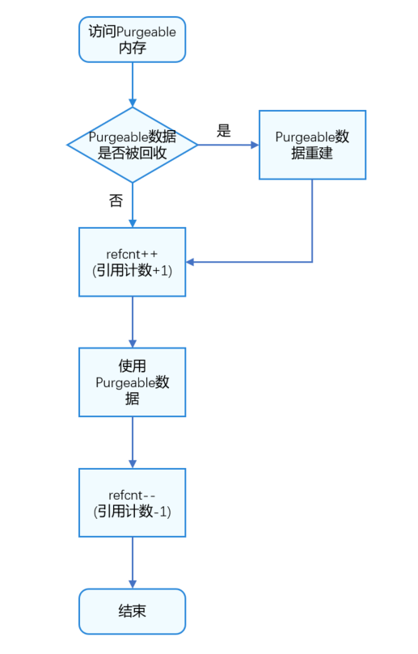

# 应用内存占用优化

更新时间：2026-05-18 00:55:31

来源：https://developer.huawei.com/consumer/cn/doc/best-practices/bpta-memory-optimization

**   


##### 概述

随着用户功能的增加，应用逐渐变得复杂，占用的内存也在增加。由于内存是系统中的稀缺资源，当应用程序占用过多内存时，系统可能会频繁进行内存回收和重新分配，导致应用性能下降，甚至出现崩溃和卡顿。因此，减少应用内存占用对于整个系统至关重要。通过减少内存占用，可以有效提高应用性能和响应速度，节省系统资源，提升设备运行效率，延长设备续航时间。开发者在应用开发过程中应注重内存管理，采取措施减少内存占用，优化应用性能和用户体验。
 
HarmonyOS提供了一些内存管理的工具和接口，帮助开发者有效地管理内存资源：
 1. onMemoryLevel()接口：开发者可通过该接口监听系统内存的变化，并根据系统内存的实时情况，动态地调整应用的内存，以避免内存过度占用导致的性能问题。
2. LRUCache：缓存空间不足时，替换近期最少使用的数据。
3. [生命周期管理](https://developer.huawei.com/consumer/cn/doc/harmonyos-guides/arkts-page-custom-components-lifecycle)：释放不再使用的系统资源，包括应用内存、监听事件、网络句柄。
4. Purgeable Memory机制：创建PurgeableMemory对象，管理Purgeable内存。
5. 图片加载和渲染：调整图片尺寸，使其与组件大小一致，避免显示问题，提高用户体验。
 
本文介绍五个方面优化应用内存占用问题。
 
 

##### 使用onMemoryLevel()监听内存变化

onMemoryLevel()是 HarmonyOS 提供的用于监听系统内存变化的接口，通过该接口，开发者可以调整应用内存。onMemoryLevel()回调包括三种方式：AbilityStage、UIAbility 和 EnvironmentCallback。
 
- AbilityStage：系统首次加载HAP中的代码到进程时，会创建AbilityStage实例。当系统需要调整内存时，会回调AbilityStage实例的onMemoryLevel()方法。

 
- UIAbility：Ability是UIAbility的基类，提供系统内存变化的回调方法。
- EnvironmentCallback：EnvironmentCallback模块提供对系统环境变化的监听回调能力。

 
MemoryLevel分为 MEMORY_LEVEL_MODERATE、MEMORY_LEVEL_LOW 和 MEMORY_LEVEL_CRITICAL 三种。MEMORY_LEVEL_MODERATE 表示当前系统内存压力适中，应用可以正常运行且受到的影响较小。MEMORY_LEVEL_LOW表示当前系统内存较低，应用应释放不必要的内存资源，避免系统卡顿。MEMORY_LEVEL_CRITICAL表示当前系统内存非常紧张，应用应尽可能释放更多资源，确保系统稳定性和性能。开发人员应根据不同的内存级别采取相应措施，例如释放资源、优化内存使用，以确保应用在不同内存状态下均能正常运行。MemoryLevel具体等级定义如下所示：
  
| 等级 | 值 | 说明 |
| --- | --- | --- |
| MEMORY_LEVEL_MODERATE | 0 | 系统内存达到中等水平。系统将根据LRU缓存规则开始杀死进程。 |
| MEMORY_LEVEL_LOW | 1 | 系统内存不足。此时应释放不必要的资源以提升系统性能。 |
| MEMORY_LEVEL_CRITICAL | 2 | 系统内存不足。此时应立即释放所有不必要的资源，因为系统可能会终止所有缓存中的进程，并且开始终止应当保持运行的进程，例如后台服务。 |
 
 
> [!NOTE]
> 后台已冻结的应用，AbilityStage、UIAbility和EnvironmentCallback的onMemoryLevel()不可回调。

 
 

##### 使用LRUCache优化ArkTS内存

LRU（最近最少使用）算法基于时间局部性原理，即最近被访问的数据在未来被访问的概率较高。
 
LRUCache`是 ArkTS 中常用的缓存工具，基于 LRU 算法实现。它主要用于缓存频繁访问的数据，如图片和网络请求结果。通过维护一个缓存空间来存储数据，当缓存空间不足时，根据 LRU 算法替换最近最少使用的数据，确保缓存空间的有效利用。
 
 

##### 原理介绍

LRUCache通过LinkedHashMap来实现LRU。LinkedHashMap继承于HashMap，HashMap用于快速查找数据，LinkedHashMap双向链表用于记录数据的顺序关系。因此，对于get()、put()、remove()等操作，LinkedHashMap除了包含HashMap的功能，还需要实现调整Entry顺序链表的工作。其数据结构如下图所示：
 
图1 **LRUCache的LinkedHashMap数据结构图**


 
LruCache中将LinkedHashMap的顺序设置为LRU顺序，链表头部的对象为近期最少用到的对象。常用的方法及其说明如下所示：
 
- 调用get()方法：根据key查询对应，如果没有查到则返回undefined。查询到对应对象后，将该对象移到链表的尾端，并返回查询的对象。
- 调用put()方法：将key-value对添加到缓存中，同时将新对象存储在链表尾端。当内存缓存达到最大值时，移除链表头部的对象。如果key已存在，则更新其对应的value。
- 调用remove()方法：删除key对应的缓存value，如果key对应的value不在，则返回为undefined，否则，返回已删除的key-value键值对。
- 调用updateCapacity()方法，设置缓存存储容量。如果新容量小于原容量，仅保留新容量大小的数据。

 
 

##### 参考案例

设计缓存工具类，包含LRUCache单例及操作LRUCache的方法，如添加、获取、删除数据。通过静态方法获取LRUCache实例，确保全局唯一。缓存工具类支持各组件间共享缓存数据，避免重复创建实例和数据冗余，提高系统性能和效率，减少内存占用，提升数据访问速度。
 
```ArkTS
import { util } from '@kit.ArkTS';

export class LRUCacheUtil {
  private static instance: LRUCacheUtil;
  private lruCache: util.LRUCache<string, Object>;

  private constructor() {
    this.lruCache = new util.LRUCache(64);
  }

  // Get the singleton of LRUCacheUtil
  public static getInstance(): LRUCacheUtil {
    if (!LRUCacheUtil.instance) {
      LRUCacheUtil.instance = new LRUCacheUtil();
    }
    return LRUCacheUtil.instance;
  }

  // Determine whether the lruCache cache is empty
  public isEmpty(): boolean {
    return this.lruCache.isEmpty();
  }

  // Get the capacity of lruCache
  public getCapacity(): number {
    return this.lruCache.getCapacity();
  }

  // Reset the capacity of lruCache
  public updateCapacity(newCapacity: number): void {
    this.lruCache.updateCapacity(newCapacity);
  }

  // Add cache to lruCache
  public putCache(key: string, value: Object): void {
    this.lruCache.put(key, value);
  }

  // Delete the cache corresponding to the key
  public remove(key: string): void {
    this.lruCache.remove(key);
  }

  // Get the cache corresponding to the key
  public getCache(key: string): Object | undefined {
    return this.lruCache.get(key);
  }

  // Determine whether the cache corresponding to the key is included.
  public contains(key: string): boolean {
    return this.lruCache.contains(key);
  }

  // Clear the cached data and reset the size of lruCache
  public clearCache(): void {
    this.lruCache.clear();
    this.lruCache.updateCapacity(64);
  }
}
```
 
在对应的组件中设置缓存，示例代码如下所示：
 
```ArkTS
import { LRUCacheUtil } from '../utils/LRUCacheUtil';

@Entry
@Component
struct Index {
  @State message: string = 'Hello World';

  aboutToAppear(): void {
    const lruCache: LRUCacheUtil = LRUCacheUtil.getInstance();
    // Add a <key, value> to lrucache
    lruCache.putCache('nation',10);
    // Add another <key, value> to lrucache
    lruCache.putCache('menu',8);
    // Query value through key
    const result0: number = lruCache.getCache('2') as number;
    console.log('result0:' + result0);
    // Delete the specified key and its associated values from the current buffer
    lruCache.remove('2');
    // Check whether the current buffer contains the specified object
    const result2: boolean = lruCache.contains('1');
    console.log('result2:' + result2);
    // Set a new capacity size
    lruCache.updateCapacity(110);
  }


  build() {
    Row() {
      Column() {
        Text(this.message)
          .fontSize(50)
          .fontWeight(FontWeight.Bold)
        Column() {
          Image($r('app.media.image'))
            .width("500px")
            .height("500px")
        }
      }
      .width('100%')
    }
    .height('100%')
  }
}
```
 
可以通过onMemoryLevel()监听内存变化，设置对应清理缓存的机制。示例代码如下：
 
```ArkTS
import { AbilityConstant, UIAbility, Want } from '@kit.AbilityKit';
import { hilog } from '@kit.PerformanceAnalysisKit';
import { window } from '@kit.ArkUI';
import { LRUCacheUtil } from '../utils/LRUCacheUtil';

export default class EntryAbility extends UIAbility {
  // Monitor the changes in memory
  onMemoryLevel(level: AbilityConstant.MemoryLevel): void {
    // Execute memory management policies according to changes in memory
    if (level === AbilityConstant.MemoryLevel.MEMORY_LEVEL_CRITICAL) {
      console.log('The memory of device is critical, release memory.');
      if (!LRUCacheUtil.getInstance().isEmpty()) {
        LRUCacheUtil.getInstance().clearCache();
      }
    }
  }

  onCreate(want: Want, launchParam: AbilityConstant.LaunchParam): void {
    hilog.info(0x0000, 'testTag', '%{public}s', 'Ability onCreate');
  }

  onDestroy(): void {
    hilog.info(0x0000, 'testTag', '%{public}s', 'Ability onDestroy');
  }
};
```
 
 

##### 使用生命周期管理优化ArkTS内存

组件的生命周期指的是组件在特定时间点或遇到特定页面行为时会自动执行的方法。
 
 

##### 原理介绍

在开发过程中，管理对象的生命周期，以释放资源、销毁对象、优化ArkTS内存。
 
- 在UIAbility组件的生命周期中，调用相应生命周期方法创建或销毁资源。在Create或Foreground方法中创建资源，在Background或Destroy方法中销毁资源。
- 在页面生命周期中，调用对应生命周期的方法，创建或销毁资源。如在[onPageShow()](https://developer.huawei.com/consumer/cn/doc/harmonyos-references/ts-custom-component-lifecycle#onpageshow)方法中创建资源，在[onPageHide()](https://developer.huawei.com/consumer/cn/doc/harmonyos-references/ts-custom-component-lifecycle#onpagehide)方法中销毁对应的资源。
- 在组件生命周期中，调用对应生命周期的方法，创建或销毁资源。如在[aboutToAppear()](https://developer.huawei.com/consumer/cn/doc/harmonyos-references/ts-custom-component-lifecycle#abouttoappear)方法中创建资源，在[aboutToDisappear()](https://developer.huawei.com/consumer/cn/doc/harmonyos-references/ts-custom-component-lifecycle#abouttodisappear)方法中销毁不再使用的对象、注销不再使用的订阅事件。
- 调用组件自带的方法，创建、销毁组件。如调用XComponent的[onDestroy()](https://developer.huawei.com/consumer/cn/doc/harmonyos-references/ts-basic-components-xcomponent#ondestroy)方法。

 
 

##### aboutToDisappear()中销毁订阅事件

aboutToDisappear函数会在组件销毁前执行。如下示例所示，在完成网络管理的网络连接模块使用后，取消订阅默认网络状态变化的通知。
 
```ArkTS
import { connection } from '@kit.NetworkKit';
import { BusinessError } from '@kit.BasicServicesKit';
import { Logger } from '../utils/Logger';
import { hilog } from '@kit.PerformanceAnalysisKit';

@Entry
@Component
struct Index {
  @State networkId: string = '123';
  @State netMessage: string = '初始化网络成功';
  @State connectionMessage: string = '链接成功';
  @State netStateMessage: string = '';
  @State hostName: string = '';
  @State ip: string = '';
  private netCon: connection.NetConnection | null = null;
  scroller: Scroller = new Scroller();

  aboutToDisappear(): void {
    // unregister NetConnection
    this.unUseNetworkRegister();
  }

  build() {
    Column() {
      Text('Hello Word')
        .fontSize(20)
        .fontWeight(FontWeight.Bold)
        .textAlign(TextAlign.Start)
        .margin({ left: 10 })
        .width(100)

      Column() {
        Row() {
          Text('Title')
            .fontSize(16)
            .margin(20)
            .fontWeight(FontWeight.Medium)
          Blank()
          Toggle({ type: ToggleType.Switch, isOn: false })
            .selectedColor(Color.Blue)
            .margin({ right: 20 })
            .width(20)
            .height(100)
            .onChange((isOn) => {
              if (isOn) {
                this.useNetworkRegister();
              } else {
                this.unUseNetworkRegister();
              }
            })
        }
        .height(100)
        .borderRadius(10)
        .margin({ left: 10, right: 10 })
        .width(200)
        .backgroundColor(Color.Black)

        TextArea({ text: this.netStateMessage })
          .fontSize(16)
          .width(200)
          .height(100)
          .margin(10)
          .borderRadius(10)
          .textAlign(TextAlign.Start)
          .focusOnTouch(false)

        Button('Clear')
          .fontSize(18)
          .width(200)
          .height(40)
          .margin({
            left: 10,
            right: 10,
            bottom: 10
          })
          .onClick(() => {
            this.netStateMessage = '';
          })
        Blank()
      }
      .height(100)
      .justifyContent(FlexAlign.Start)
    }
    .width(200)
  }

  getConnectionProperties(): void {
    connection.getDefaultNet().then((netHandle: connection.NetHandle) => {
      connection.getConnectionProperties(netHandle, (error: BusinessError, connectionProperties: connection.ConnectionProperties) => {
        if (error) {
          this.connectionMessage = '连接错误';
          Logger.error('getConnectionProperties error:' + error.code + error.message);
          return;
        }
        this.connectionMessage = '连接' + connectionProperties.interfaceName
          + 'developer.huawei.com' + connectionProperties.domains
          + '/cn' + JSON.stringify(connectionProperties.linkAddresses)
          + '/doc' + JSON.stringify(connectionProperties.routes)
          + '/best-practices' + JSON.stringify(connectionProperties.dnses)
          + 'btpa-memory-optimization' + connectionProperties.mtu + '\n';
      })
    }).catch((error: BusinessError) => {
      hilog.info(0xFF00, 'testTag', '%{public}s', 'getConnectionProperties fail');
    });
  }

  useNetworkRegister(): void {
    this.netCon = connection.createNetConnection();
    this.netStateMessage += '连接';
    this.netCon.register((error) => {
      if (error) {
        Logger.error('register error:' + error.message);
        return;
      }
      this.getUIContext().getPromptAction().showToast({
        message: '连接成功',
        duration: 1000
      });
    })
    this.netCon.on('netAvailable', (netHandle) => {
      this.netStateMessage += '连接' + netHandle.netId + '\n';
    })
    this.netCon.on('netBlockStatusChange', (data) => {
      this.netStateMessage += '更换' + data.netHandle.netId + '\n';
    })
    this.netCon.on('netCapabilitiesChange', (data) => {
      this.netStateMessage += 'id' + data.netHandle.netId
        + 'cap' + JSON.stringify(data.netCap) + '\n';
    })
    this.netCon.on('netConnectionPropertiesChange', (data) => {
      this.netStateMessage += 'id' + data.netHandle.netId
        + 'propertis' + JSON.stringify(data.connectionProperties) + '\n';
    })
  }

  unUseNetworkRegister(): void {
    if (this.netCon) {
      this.netCon.unregister((error: BusinessError) => {
        if (error) {
          Logger.error('unregister error:' + error.message);
          return;
        }
        this.getUIContext().getPromptAction().showToast({
          message: 'message',
          duration: 1000
        });
        this.netStateMessage += 'listener';
      })
    } else {
      this.netStateMessage += 'listener_fail';
    }
  }
}
```
 
 

##### 使用purgeable优化C++内存

[Purgeable Memory](https://developer.huawei.com/consumer/cn/doc/harmonyos-references/capi-purgeable-memory-h)是HarmonyOS中native层的内存管理机制，适用于图像处理的Bitmap、流媒体应用的一次性数据和图片等。应用可使用 Purgeable Memory 存放内部缓存数据，系统根据淘汰策略管理所有Purgeable内存。当系统内存不足时，系统通过丢弃Purgeable内存快速回收资源，释放更多内存给其他应用程序，实现高效的全局缓存数据管理，提高系统稳定性和流畅性。在使用Purgeable内存时，开发者可以调用接口释放Purgeable内存，但需要注意在适当的时机释放Purgeable内存，以确保内存资源能够得到有效管理，避免内存占用过高导致的性能问题和内存泄漏的情况。通过合理使用Purgeable内存，开发者可以更好地管理应用程序的内存，提高用户体验。
 
 

##### 原理介绍

访问Purgeable内存的流程如下图所示。首先，判断Purgeable内存的数据是否已被回收。如果已回收，需重建数据。访问Purgeable内存时，其引用计数refcnt加1；访问结束后，refcnt减1。当refcnt为0时，Purgeable内存可被系统回收。
 
图2 **Purgeable内存访问流程图**


 
Purgeable内存回收流程图如下所示。当引用计数为0时，丢弃Purgeable内存中的数据，并标记为已回收。
 
 
图3 **Purgeable内存回收流程图


 

##### 参考案例

在CMakeLists.txt文件中引入Purgeable对应的动态链接库libpurgeable_memory_ndk.z.so，具体如下所示：
 
```cpp
# the minimum version of CMake.
cmake_minimum_required(VERSION 3.4.1)
project(MyNativeApplication)
set(NATIVERENDER_ROOT_PATH ${CMAKE_CURRENT_SOURCE_DIR})
if(DEFINED PACKAGE_FIND_FILE)
    include(${PACKAGE_FIND_FILE})
endif()
include_directories(${NATIVERENDER_ROOT_PATH}
                    ${NATIVERENDER_ROOT_PATH}/include)
add_library(entry SHARED napi_init.cpp)
# Introduce libpurgeable_memory_ndk.z.so dynamic link library.
target_link_libraries(entry PUBLIC libace_napi.z.so libpurgeable_memory_ndk.z.so)
```
 
 
引入purgeable_memory头文件，声明ModifyFunc函数，调用OH_PurgeableMemory_Create创建PurgeableMemory对象。
 
在读取PurgeableMemory对象的内容时，需要调用OH_PurgeableMemory_BeginRead，读取完成后，需要调用OH_PurgeableMemory_EndRead。其中，OH_PurgeableMemory_GetContent可以获取PurgeableMemory对象的内存数据。
 
在修改PurgeableMemory对象的内容时，需要调用OH_PurgeableMemory_BeginWrite，修改完成后，需要调用OH_PurgeableMemory_EndWrite。其中，OH_PurgeableMemory_AppendModify可以更新PurgeableMemory对象重建规则。
 
```cpp
#include "napi/native_api.h"
#define DATASIZE (4 * 1024 * 1024)
#include "purgeable_memory/purgeable_memory.h"

bool ModifyFunc(void *data, size_t size, void *param) {
    data = param;
    return true;
}
// Business definition object type
class ReqObj;
static napi_value Add(napi_env env, napi_callback_info info)
{
    size_t requireArgc = 2;
    size_t argc = 2;
    napi_value args[2] = {nullptr};
    napi_get_cb_info(env, info, &argc, args , nullptr, nullptr);
    napi_valuetype valuetype0;
    napi_typeof(env, args[0], &valuetype0);
    napi_valuetype valuetype1;
    napi_typeof(env, args[1], &valuetype1);
    double value0;
    napi_get_value_double(env, args[0], &value0);
    double value1;
    napi_get_value_double(env, args[1], &value1);
    double result = value0 + value1;
    // Create a PurgeableMemory object
    OH_PurgeableMemory *pPurgmem = OH_PurgeableMemory_Create(DATASIZE, ModifyFunc, &result);
    // Read the object
    OH_PurgeableMemory_BeginRead(pPurgmem);
    // Get the size of PurgeableMemory object
    size_t size = OH_PurgeableMemory_ContentSize(pPurgmem);
    // Get the content of the PurgeableMemory object
    ReqObj *pReqObj = (ReqObj *)OH_PurgeableMemory_GetContent(pPurgmem);
    // Read the end of the PurgeableMemory object
    OH_PurgeableMemory_EndRead(pPurgmem);
    
    // Modify the PurgeableMemory object
    OH_PurgeableMemory_BeginWrite(pPurgmem);
    // Declare the parameters of the extended creation function
    double newResult = value0 + value0;
    // Update PurgeableMemory object reconstruction rules
    OH_PurgeableMemory_AppendModify(pPurgmem, ModifyFunc, &newResult);
    // End of modifying the PurgeableMemory object
    OH_PurgeableMemory_EndWrite(pPurgmem);
    // Destroyed object
    OH_PurgeableMemory_Destroy(pPurgmem);
    napi_value sum;
    napi_create_double(env, result, &sum);
    return sum;
}
EXTERN_C_START
static napi_value Init(napi_env env, napi_value exports)
{
    napi_property_descriptor desc[] = {
        { "add", nullptr, Add, nullptr, nullptr, nullptr, napi_default, nullptr }
    };
    napi_define_properties(env, exports, sizeof(desc) / sizeof(desc[0]), desc);
    return exports;
}
EXTERN_C_END

static napi_module demoModule = {
    .nm_version = 1,
    .nm_flags = 0,
    .nm_filename = nullptr,
    .nm_register_func = Init,
    .nm_modname = "entry",
    .nm_priv = ((void*)0),
    .reserved = { 0 },
};
extern "C" __attribute__((constructor)) void RegisterEntryModule(void)
{
    napi_module_register(&demoModule);
}
```
 

##### 使用合理尺寸的图片优化应用内存

 

##### 原理介绍

在定义界面时，应用需根据组件类型绘制相应内容。图片组件用于加载和显示图片，同时会占用内存。ArkTS运行时选择基于对象追踪（即Tracing GC）算法设计GC，对象申请空间到达阈值时触发GC。年轻代GC的阈值较小，若图片的尺寸较大，可能会导致频繁的GC。
 
一张全屏的图片，不同分辨率的内存占用大小如下：
 


 
由上图可以看出，对于页面多、图片多、效果丰富的资源密集型应用，内存容易达到较高水平。当应用的内存占用超过系统设定的阈值（例如4GB，不同系统的阈值可能不同）时，系统可能会认为应用存在严重的内存问题，并可能强制终止该应用进程，以保证设备系统的稳定性和性能。为了避免应用被系统终止，开发者可以考虑以下两点：
 1. 优化资源使用：通过合理设置图片源文件大小，合理使用内存资源，减少图片所占应用内存。
2. [布局优化](https://developer.huawei.com/consumer/cn/doc/best-practices/bpta-best-practices-long-list#section155051250172217)：通过减少布局嵌套层级，减少过度绘制可以产生较大的性能收益。
 
本章节指导开发者合理设置图片源文件大小，优化内存使用，减少图片占用的应用内存。
 
 

##### 避免加载超过显示尺寸的图片

```ArkTS
Column() {
  Image($r('app.media.image'))
    .width("500px")
    .height("500px")
}
```
 
使用500×500尺寸的Image组件加载一张4032×3024的RGBA格式图片时，图片申请了约46.5 MB的内存。这是因为图片原始尺寸较大，加载到Image组件中时需要缩放到500×500尺寸，这个过程会占用一定的内存。
 
纹理图片内存大小 = imageWidth x imageHeight x format（4032*3024 * 4 = 48771072 bytes ≈ 46.5M）。
 
组件实际需要的尺寸为500*500，所需内存约为1M。
 


 
当图片尺寸超过控件显示区域时，图片会被裁剪或缩放。频繁的裁剪和缩放不仅会降低视图效果，还会浪费内存，增加功耗。为了节省内存，开发者可以手动调整源文件的尺寸，使其与组件大小一致。这样可以避免不必要的内存浪费，并提高应用程序的性能和效率。开发者可以使用图像处理工具来调整图像尺寸，进一步节省内存空间。
 
 

##### 其他方法

在日常开发中，常见的其他减少内存方式有如下几种：
 
- 使用弱引用（Weak Reference）：在HarmonyOS应用开发中，可以使用弱引用（Weak Reference）来避免内存泄漏。通过使用Weak Reference，可以避免循环引用导致的内存泄漏问题，确保对象在不再需要时能够被正确释放。
- 使用Sendable：符合Sendable协议的数据可以在ArkTS并发实例间传递，从而减少拷贝的开销及其内存。关于Sendable的详细内容可参考[《Sendable开发指导》](https://developer.huawei.com/consumer/cn/doc/harmonyos-guides/arkts-sendable)。
- 使用可共享对象：共享对象SharedArrayBuffer，拥有固定长度，可以存储任何类型的数据，包括数字、字符串等。共享对象传输是指SharedArrayBuffer支持在多线程之间传递，传递之后的SharedArrayBuffer对象和原始的SharedArrayBuffer对象指向同一块内存，进而达到内存共享的目的。详细内容可参考[《SharedArrayBuffer对象》](https://developer.huawei.com/consumer/cn/doc/harmonyos-guides/shared-arraybuffer-object)。
