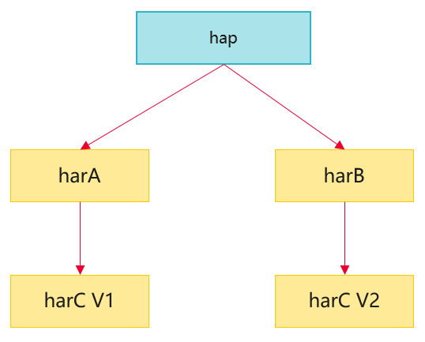
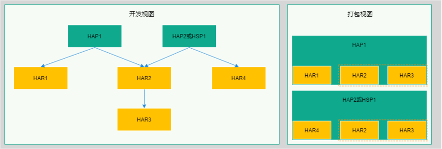
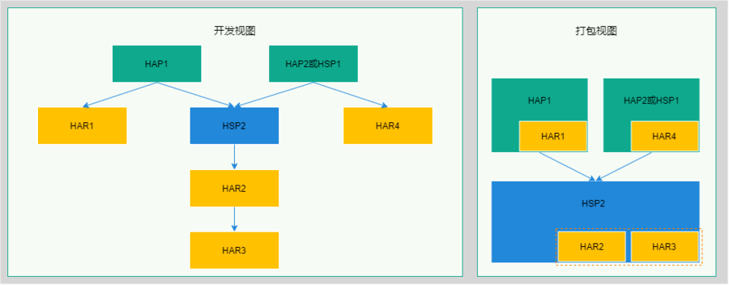

# 应用包体积优化

更新时间：2026-03-19 08:43:01

来源：https://developer.huawei.com/consumer/cn/doc/best-practices/bpta-decrease_pakage_size

## 概述


减小应用包大小可以提升应用下载和安装体验。压缩、精简或复用代码和资源可以有效降低应用包体积。在优化包大小前，先了解HarmonyOS应用的Stage模型应用程序包结构，对HAP、HAR、HSP等特点建立一定认知，然后使用扫描工具分析App包，根据报告优化应用。具体优化方法可以参考以下内容：

1. 对于含有so库的App工程，可以配置so库压缩选项，以减小应用包大小。
2. 在应用存在多包（HAP、HSP）的场景中，可以使用HSP动态共享包在多个包（HAP、HSP）之间共享代码和资源，消除使用HAR静态共享包导致的代码和资源重复拷贝，从而减小应用包大小，同时开发者需要综合评估对编译性能的影响：大量使用HSP替代HAR，会在编译引用这些HSP共享包的模块时触发更多的语言编译任务，导致编译耗时、编译内存占用增加。
3. 使用ohpm的[override](https://developer.huawei.com/consumer/cn/doc/harmonyos-guides/ide-oh-package-json5#zh-cn_topic_0000001792256137_overrides)机制或开启 `[resolve_conflict](https://developer.huawei.com/consumer/cn/doc/harmonyos-guides/ide-ohpmrc#section368717475562)` 解决依赖冲突，减少依赖包导致的重复编译问题。
4. 将不常用的功能作为按需加载的模块。


## 使用扫描工具分析App大小问题


扫描工具可用于分析检测应用包，根据不同的参数设定，扫描指定路径的App、HAP、HSP包内容并输出检测结果报告，为开发者优化包结构或排查问题提供数据支撑。

根据扫描结果优化应用：

1. 重复文件
- 删除同一包内的重复资源。多包（HAP、HSP）间重复资源，可以使用HSP实现资源的复用，参考[多包情况下使用HSP共享代码及资源](#section13745162092020)。


2. 较大文件

- 确认应用是否必需，是否可以删除。
- JPG、PNG、GIF等文件，可以考虑压缩图片。


3. 特定类型的文件

so文件，通过配置so库压缩选项来实现压缩打包。


## 减小应用包大小的方法


### 配置so库压缩选项


DevEco Studio 默认在打包应用时不压缩 so 库文件。配置 so 压缩选项后，DevEco Studio 将 so 库文件压缩并打包到应用中，从而减小应用包的大小。

配置方法

修改应用模块配置文件module.json5中的compressNativeLibs字段，将值配置为true，重新编译、打包应用。

```text
{
"module": {
// ...
"compressNativeLibs": true // Identify whether the so library is packaged in compressed storage. ’true’ means compressed so library, ’false’ means non-compressed.
}
}
```


so压缩效果

以DevEco Studio中的C++默认库文件为例，展示压缩前后的文件大小对比：


| 文件名 | 原始大小 | 压缩后大小 | 压缩率 |
| --- | --- | --- | --- |
| armeabi-v7a/libc++_shared.so | 1108k | 386k | 34% |


### 解决依赖减少依赖包重复编译


对于ohpm 1.5.0之前的版本，如果hap依赖了不同版本的har（例如下图中的V1版本的harC和V2版本的harC），默认情况下，V1和V2两个版本的harC都会被打包到hap中。开发者可以使用ohpm的override机制，指定只打包一个版本。





如果使用的是ohpm 1.4.0 版本，可以使用override机制，开发者可以在项目级别的 oh-package.json5 （即项目根目录下的 oh-package.json5）文件中添加 overrides 配置，将依赖树中的依赖替换为另一个版本。替换的版本既可以是一个具体的版本号，也可以是本地存在的HAR包或源码目录。

注意：

必须在项目级别的 oh-package.json5 中配置 overrides，配置在模块级别的 oh-package.json5 中不会生效。

例如， 这里以 'foo' 库为例，如果在项目中始终需要使用'1.0.0'版本，可在项目级的 oh-package.json5 中添加以下配置：

```text
{
"overrides": {
"foo": "1.0.0"
}
}
```

若本地存在 foo 的源码或 HAR 包，确保 foo 始终使用本地版本，可在项目级 oh-package.json5 中进行如下配置：

1、本地存在"foo"的源码，即配置项目根目录下的foo目录，以"file:./foo"标识其路径。

```text
{
"overrides": {
"foo": "file:./foo"
}
}
```

2、本地存在"foo.har"的HAR包，其存放在libs目录下，即配置"file:./libs/foo.har"。

```text
{
"overrides": {
"foo": "file:./libs/foo.har"
}
}
```


对于1.5.0版本之后的ohpm，可以通过开启`resolve_conflict`，自动解决依赖冲突。依赖冲突的处理策略为：当项目同时依赖某个三方库的不同版本时，ohpm会选择其中的最高版本进行安装。


### 按需分发


对于应用中用户不常用的功能，可以考虑通过产品特性按需分发的方式，将下载时机交由用户选择，使用时从应用市场获取安装，减少用户初次下载的包大小。


### 多包场景下使用HSP共享代码和资源


当前系统提供了两种共享包：HAR静态共享包和HSP动态共享包。HAR和HSP都用于实现代码和资源的共享，可以包含代码、C++库、资源和配置文件。HAR中的代码和资源跟随使用方编译，如果有多个使用方，编译产物中会存在多份相同拷贝。HSP中的代码和资源可以独立编译，在运行时进程中只存在一份。

在多包场景下，如果应用的多个HAP或HSP包使用HAR包实现代码和资源的共享，打包后的每个HAP或HSP包中都会包含共享HAR包的拷贝，导致App包中存在冗余代码和资源。如下图示例，应用模块HAP1和HAP2/HSP1都引用了HAR2和HAR3，打包后，App包中HAR2和HAR3有多份重复拷贝，体积较大。





推荐使用HSP代替HAR实现代码和资源共享。如下图示例，使用HSP2对原应用进行升级改造，打包后，APP包中HAR2和HAR3仅保留一份拷贝。当HAR2和HAR3的总大小超过HSP时，可以减小应用包大小。



