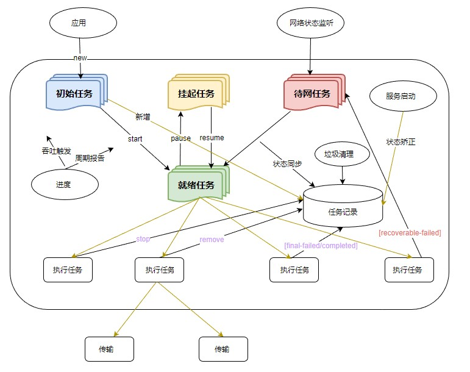
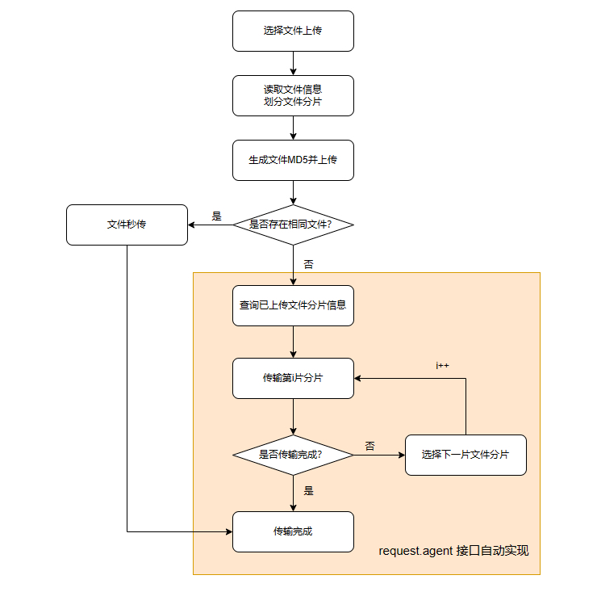

# 文件上传下载优化

更新时间：2026-03-12 08:45:02

来源：https://developer.huawei.com/consumer/cn/doc/best-practices/bpta-file-upload-and-download-performance

**   


##### 概述

 
在开发应用时，客户端与服务器之间数据交换的效率取决于文件传输的性能。数据交换性能较低的应用会导致加载时间延长，在多个场景中造成页面卡顿，严重影响用户体验。相反，数据交换高效的应用会提升应用的流畅性。
 
本文介绍数据压缩和断点续传，减少带宽占用，提高传输效率，提升数据交换性能。
 

##### 上传下载接口

目前系统内提供文件上传下载的模块有http模块和request模块。http模块提供基础的HTTP数据请求能力，功能较为基础，本文不做介绍。request模块主要为应用提供上传下载文件和后台传输代理的基础能力。它具备任务管理系统的默认并发功能，可简化下载功能的实现和管理，提升数据传输的安全性，整合通知机制，新增任务状态与进度查询功能，具有灵活性、高效性、可扩展性、可靠性和一致性等优势。
 
具体来说，request模块包含以下功能：
 1. 任务管理：任务管理包括创建、暂停、恢复、删除任务、文件上传、下载及系统通知。创建的任务分为前端任务和后台任务。前端任务立即执行，模态界面，跟随应用生命周期，数据量小、耗时短，如发布微信朋友圈、微博，优先级高且倾斜带宽资源。后台任务可等待，任意界面，异步执行，数据量大、耗时长，如缓存电影、同步大量数据，优先级低且与应用生命周期无关。
2. 任务查询管理：查询所有任务、过滤上传任务、过滤下载任务、过滤时间段内任务、过滤前端任务、过滤后台任务、查询指定任务信息、查询指定隐藏任务信息、清理指定任务。
3. 任务自动恢复：网络条件不满足时任务暂停，条件满足后自动恢复（需HTTP服务器支持断点续传）。
4. 安全隐私保护：安全隐私保护包括网络权限检查、接口操作安全处理、任务信息加密存储、接口查询隐匿敏感字段、防御遍历攻击和DOS攻击、管理恶意静默后台任务及系统管理接口权限。
5. 日志：日志分为调试模式和发布模式。调试模式下，可打印所有内存修改、磁盘和网络读写、逻辑分支等日志。发布模式下，仅记录导致任务失败或服务异常的日志，其余日志关闭。
6. 任务失败重试：对于不可恢复的原因，直接失败；对于可恢复的原因，网络断开、网络类型不匹配等，不现场重试，任务到等待网络恢复队列；网络超时则就地重试1次，仍网络超时，则立即失败。
7. 服务按需启停：上传下载服务不随系统自启动。应用调用任意接口时，上传下载服务自动启动。网络连接事件也会触发上传下载服务启动。任务队列中无正在处理的任务或等待网络恢复的任务，延迟一段时间后，若仍无任务，则通知系统服务框架(SAMGR)停止并卸载上传下载服务。服务退出过程中，新的接口请求可能失败，客户端需检查服务状态并通过重试按需启动
8. 通知：任务从开始到结束都应有进度通知。目前，前台任务每1秒、后台任务每3秒触发一次进度通知。任务状态变化时也会触发进度通知。任务完成或失败时，将触发专用的进度通知。创建任务时可开启抑制开关，以减少频繁通知。
 
 

##### 下载任务的状态迁移流程

使用request模块执行下载的任务，具有四种运行状态：初始任务、就绪任务、挂起任务、待网任务。可以通过create()创建任务，start()开始任务，pause()挂起任务，resume()恢复任务，remove()移除任务，stop()停止任务，任务结果有final-failed任务失败，final-completed下载完成，recoverable-failed重试失败，并支持查询任务状态，具体流程如下图所示：
 
图1 **模块流程图**


 
 

##### 常见场景和解决方案

**场景1：低带宽网络上传琐碎文件场景**
 
在网络连接不佳、带宽较低的环境中，HTTP连接的建立时间可能显著增加。此时，进行数据压缩可以加速页面加载，减少HTTP请求次数和移动数据流量。
 
**场景2：处理大量资源的场景**
 
应用商店和网盘应用等包含大量大体积文件资源。当用户从暂停或断网中恢复时，从头开始上传或下载会额外耗费大量时间。此时可以采用断点续传方法进行上传和下载。
 
 

##### 数据压缩

数据压缩减少存储空间和传输量，节省带宽，提高加载速度。在网络传输和存储中，特别是在处理大量数据或频繁传输数据时，数据压缩发挥重要作用。
 
在应用开发中，常见的数据压缩技术分类如下：
 
- 有损压缩：仅限图片、视频、音频等文件适用。通过减少图片和视频文件的分辨率、降低音频的音质等手段，减少文件大小，从而实现减少加载时间和带宽消耗。
- 无损压缩：对一些零碎文件，可以使用zlib（Zip模块）进行打包压缩，减少上传请求次数；对一些大文件，可以利用缓存技术，服务器将曾经上传过的大文件MD5码缓存起来，本地在上传前预生成MD5码并传输到服务器进行比对，如果相同则说明服务器存在该文件，可以跳过该文件上传，从而省略重复传输时间。

 
以批量上传分辨率为480×640、24位、平均大小为50至120KB的照片为例，在设备上测试的结果如下表所示。
  
| 上传照片数量 | 优化前耗时（ms） | 优化后耗时（ms） |
| --- | --- | --- |
| 10 | 470 | 526 |
| 20 | 1124 | 1091 |
| ... | ... | ... |
| 50 | 2379 | 2138 |
| 80 | 3950 | 3258 |
| ... | ... | ... |
| 100 | 5276 | 3906 |
 
 
图2 **上传数量和耗时对比图表**


 
由于上传耗时受网络状态影响较大，结果取多次测量的最小值。尽管如此，数据仍显示优化前的耗时呈线性增长，而压缩优化后的耗时在上传文件数量较少时变化不明显，甚至因额外的压缩处理而增加耗时。然而，随着上传照片数量的增加，优化后的耗时与优化前的差距逐渐增大，优化效果更加显著。
 
**数据压缩的相关示例代码如下：**
 1. 导入相关模块:
```ArkTS
import { common } from '@kit.AbilityKit';
import { fileIo } from '@kit.CoreFileKit';
import { BusinessError, zlib } from '@kit.BasicServicesKit';
import { hilog } from '@kit.PerformanceAnalysisKit';
```

2. 创建压缩上传相关类:
```ArkTS
class ZipUpload {
  // Uri stored before creating the task
  private waitList: Array<string> = [];
  // Files that need to be uploaded uri
  private fileUris: Array<string> = [];
  // ...
}
```

3. 建立用于接收图库图片的临时文件夹，并将整个临时文件夹打包添加到待上传list内:
```ArkTS
// Data compression processing
async zipUploadFiles(fileUris: Array<string>): Promise<void> {
  try {
    this.context = this.getUIContext().getHostContext() as common.UIAbilityContext;
    let cacheDir = this.context.cacheDir;
    let tempDir = fileIo.mkdtempSync(`${cacheDir}/XXXXXX`);
    // Put the uri obtained from the library picture into fileUris and copy it to the temporary folder.
    for (let i = 0; i < fileUris.length; i++) {
      let fileName = fileUris[i].split('/').pop();
      let resourceFile: fileIo.File = fileIo.openSync(fileUris[i], fileIo.OpenMode.READ_ONLY);
      fileIo.copyFileSync(resourceFile.fd, `${tempDir}/${fileName}`, 0);
      fileIo.closeSync(resourceFile);
    }
    // File compression, package the previously generated temporary folder into test.zip
    let options: zlib.Options = {
      level: zlib.CompressLevel.COMPRESS_LEVEL_DEFAULT_COMPRESSION,
      memLevel: zlib.MemLevel.MEM_LEVEL_DEFAULT,
      strategy: zlib.CompressStrategy.COMPRESS_STRATEGY_DEFAULT_STRATEGY
    };
    let data = await zlib.compressFile(tempDir, `${cacheDir}/test.zip`, options);
    // Delete temporary folders
    fileIo.rmdirSync(tempDir);
    // Put the generated zip package into the transmission queue.
    this.waitList.push(`${cacheDir}/test.zip`);
  } catch (err) {
    let error = err as BusinessError;
    hilog.error(0x0000, 'FileUploadAndDownloadSlow', `zipUploadFiles error ${error.code} ${error.message}`);
  }
}
```

 
 

##### 断点续传

断点续传功能的实现需要应用端和服务器端的合理技术协同。在实际开发中，开发者无需亲自实现断点续传功能，只需对SDK进行合理配置。
 
应用端需要使用以下技术和API：
 
- fileIo（文件管理）：用于处理文件上传操作，提供了读取文件内容，文件分片和组合的功能。
- hash（文件哈希处理）：用于实现文件MD5的计算，将计算的MD5值预先传到服务器端进行预处理，实现文件秒传，同时确保传输的准确性和可靠性。
- request（上传下载）：用于实现文件上传操作，并支持在上传过程中的断点续传功能。

 
服务器端需要以下技术：
 
- 协议需要支持Range，用于服务器端处理文件上传下载的断点续传。
- 文件校验相关逻辑：实现文件校验，确保传输中断后能准确恢复并继续传输。

 
结合应用端和服务器端技术，实现高效可靠的文件断点续传功能，提升用户体验并确保数据传输稳定。
 
本文基于[实现上传和下载功能](https://gitcode.com/harmonyos_samples/upload-and-down-load)示例中的后台上传场景，给出了部分断点续传的示例代码，具体可以参考该工程。
 
 

##### 文件上传

本文使用request模块中的**request.agent****()**任务托管接口，自动实现暂停、继续、重试等操作，无需手动分片和记录分片信息。流程图如下：
 
图3 **断点续传上传流程图



1. 导入相关模块:
```ArkTS
import { common } from '@kit.AbilityKit';
import { BusinessError, request } from '@kit.BasicServicesKit';
```

2. 创建相关上传类:
```ArkTS
class Upload {
  // ...
  private backgroundTask: request.agent.Task | undefined = undefined;
  private waitList: Array<string> = [];
  // ...
}
```

3. 配置Config，创建后台上传任务:
```ArkTS
private config: request.agent.Config = {
  action: request.agent.Action.UPLOAD,
  headers: HEADER,
  url: '',
  mode: request.agent.Mode.FOREGROUND,
  method: 'POST',
  title: 'upload',
  network: request.agent.Network.ANY,
  data: [],
  token: UPLOAD_TOKEN
}
// ...
async createBackgroundTask(fileUris: Array<string>) {
  if (this.context === undefined) {
    return;
  }
  this.config.url = await urlUtils.getUrl(this.context);
  this.config.data = await this.getFilesAndData(this.context.cacheDir, fileUris);
  this.config.mode = request.agent.Mode.BACKGROUND;
  try {
    this.backgroundTask = await request.agent.create(this.context, this.config);
    await this.backgroundTask.start();
    let state = AppStorage.get<number>('backTaskState');
    if (state === BackgroundTaskState.PAUSE) {
      await this.backgroundTask.pause();
    }
    logger.info(TAG, `createBackgroundTask success`);
  } catch (err) {
    logger.error(TAG, `task  err, err  = ${JSON.stringify(err)}`);
  }
}

// ...
private async getFilesAndData(cacheDir: string, fileUris: Array<string>): Promise<Array<request.agent.FormItem>> {
  // ...
}
```

4. 任务开始:
```ArkTS
await this.backgroundTask.start();
```

5. 任务暂停，可以暂停正在等待/正在运行/正在重试的任务:
```ArkTS
async pause() {
  logger.info(TAG, 'pause');
  if (this.backgroundTask === undefined) {
    return;
  }
  try {
    await this.backgroundTask.pause();
  } catch (err) {
    logger.error(TAG, `pause fail,err= ${JSON.stringify(err)}`);
  }
}
```

6. 任务继续，已暂停的任务可被resume恢复:
```ArkTS
async resume() {
  logger.info(TAG, 'resume');
  if (this.backgroundTask === undefined) {
    return;
  }
  try {
    await this.backgroundTask.resume();
  } catch (err) {
    logger.error(TAG, `resume fail,err= ${JSON.stringify(err)}`);
  }
}
```

 
 

##### 文件下载

对于大文件断点续传下载，可以直接调用 **request.agent****()**接口。该接口的断点续传功能基于HTTP协议Header中的Range字段实现。在任务暂停并重启时，会自动设置Header中的Range字段，无需额外配置。
 
**Range简介**
 
HTTP协议中的Range字段允许服务器发送部分HTTP消息到客户端，用于请求部分数据。
 
Range的格式通常是Range: &lt;unit&gt;=&lt;start&gt;-&lt;end&gt;，其中&lt;unit&gt;表示范围所采用的单位，通常是字节（bytes），&lt;start&gt; 和 &lt;end&gt; 表示请求的起始字节和结束字节的位置。
 
Range语法如下:
 
```text
// Indicates from range-start to the end of the file.
Range: <unit>=<range-start>-
// Indicates from range-start to range-end.
Range: <unit>=<range-start>-<range-end>
// You can select multiple segments simultaneously, separated by commas.
Range: <unit>=<range-start>-<range-end>, <range-start>-<range-end>

// Example: Indicates the file after returning 1024 bytes.
Range: bytes=1024-
```
 
服务器收到请求后，正确处理会回复206 Partial Content，未正常处理则回复其他响应码。下表列出服务器回复的常见响应码：
  
| 服务器响应码 | 常见的原因 |
| --- | --- |
| 206 Partial Content | 服务器收到正常Range请求的响应码，返回部分内容的响应。 |
| 416 Range Not Satisfiable | 所请求的范围不合法，表示服务器错误。 |
| 200 OK | 服务器忽略了Range首部，返回整个文件。 |
 
 
**断点续传下载示例代码如下：**
 1. 导入模块:
```ArkTS
import { common } from '@kit.AbilityKit';
import { BusinessError, request } from '@kit.BasicServicesKit';
```

2. 创建下载类:
```ArkTS
class RequestDownload {
  // ...
  private waitList: Array<string[]> = [];
  private downloadTask: request.agent.Task | undefined = undefined;
  // ...
}
```

3. 配置Config，创建后台下载任务:
```ArkTS
async createBackgroundTask(downloadList: Array<string[]>) {
  if (this.context === undefined) {
    return;
  }
  for (let i = 0; i < downloadList.length; i++) {
    try {
      let splitUrl = downloadList[i][1].split('//')[1].split('/');
      let downloadConfig: request.agent.Config = {
        action: request.agent.Action.DOWNLOAD,
        url: downloadList[i][1],
        method: 'POST',
        title: 'download',
        mode: request.agent.Mode.BACKGROUND,
        network: request.agent.Network.ANY,
        saveas: `./${downloadList[i][0]}/${splitUrl[splitUrl.length-1]}`,
        overwrite: true,
        gauge: true
      }
      let downTask = await request.agent.create(this.context, downloadConfig);
      await downTask.start();
    } catch (error) {
      let err = error as BusinessError;
      logger.error(TAG, `task  err code=${err.code}, message=${err.message}`);
      this.waitList.push(downloadList[i]);
    }
  }
}
```

4. 任务开始:
```ArkTS
await downTask.start();
```

 
 
> [!NOTE]
> 对文件进行上传下载过程中，若在错误的任务状态下调用了不应使用的接口，在不支持的状态上操作任务，任务分组不存在或已移除等情况，均会导致无法正常停止、恢复文件的上传下载任务。具体可参考 上传下载错误码 。

 

##### 多文件下载监听

文件下载监听是指在单文件下载的功能基础上，同时进行多个文件下载进度和状态的监听管理。实际开发中，需要使用request上传下载模块实现，包括监听每个文件下载任务的进度，任务是否暂停，下载是否完成等状态情况。相关规格说明参考[request.agent.create()](https://developer.huawei.com/consumer/cn/doc/harmonyos-references/js-apis-request#requestagentcreate10-1)。
 
以具体场景为例，下图是常见的多文件下载列表：
 


 
进入页面后，点击“全部开始”按钮，启动所有文件的下载任务。点击“全部暂停”按钮，暂停所有文件的下载任务。再次点击“全部开始”按钮，可重新启动未完成的下载任务。下载完成的文件将保存在应用的缓存路径下。如果下载失败，通常是因为网络不稳定，点击“全部开始”按钮可重新下载。
 
**实现思路**
 1. 配置下载参数。下载任务需对应配置一套下载参数request.agent.Config。本例中使用downloadConfig方法配置下载文件的URL，实际业务中按需调整。
```ArkTS
function downloadConfig(downloadUrl: string): request.agent.Config {
  const config: request.agent.Config = {
    action: request.agent.Action.DOWNLOAD,
    url: downloadUrl,
    overwrite: true,
    method: 'GET',
    saveas: './',
    mode: request.agent.Mode.BACKGROUND,
    gauge: true,
    retry: false
  };
  return config;
}
```

2. 创建多个文件下载监听实例。每个文件下载监听需配置下载参数，创建下载任务，注册任务监听，启动下载任务。多文件下载监听中，每个下载任务需注册独立的监听回调。示例中，通过封装自定义组件FileDownloadItem，在每个FileDownloadItem中创建各自的下载任务和监听回调，实现多文件下载监听。
```ArkTS
ForEach(this.downloadConfigArray, (item: request.agent.Config) => {
  ListItem() {
    FileDownloadItem({
      downloadConfig: item,
      isStartAllDownload: this.isStartAllDownload,
      downloadCount: this.downloadCount,
      downloadFailCount: this.downloadFailCount
    })
  }
}, (item: request.agent.Config) => JSON.stringify(item))
```

3. 创建下载任务并注册相关监听。本例中，在每个 `FileDownloadItem` 中使用 `request.agent.create()` 创建下载任务。下载任务创建成功后，注册以下回调：下载完成、下载失败、进度更新、暂停、重新启动以及响应头数据。在相应的回调中，获取当前文件的下载状态等数据。
```ArkTS
request.agent.create(context, this.downloadConfig).then((task: request.agent.Task) => {
  task.on('completed', this.completedCallback);
  task.on('failed', this.failedCallback);
  task.on('pause', this.pauseCallback);
  task.on('resume', this.resumeCallback);
  task.on('progress', this.progressCallback);
  task.on('response', this.responseCallback);

  task.start().then(() => {
    this.downloadTask = task;
  }).catch((err: Error) => {
    hilog.error(0x0000, TAG, 'task start error:', err);
  })
}).catch((err: Error) => {
  hilog.error(0x0000, TAG, 'create error:', err);
});
```
 
```ArkTS
private completedCallback = (progress: request.agent.Progress) => {
  this.textState = $r("app.string.download_completed");
  if (this.sFileSize === -1) {
    this.sFileSize = this.sCurrentDownloadSize
    this.nCurrentDownloadSize = 1;
  }
  this.downloadCount--;
}
```

4. 启动下载任务。本例在每个FileDownloadItem中使用task.start()方法启动各自的下载任务。此外，start()方法也可以启动一个已失败或已停止的下载任务，从上次的进度开始续传。
```ArkTS
task.start().then(() => {
  this.downloadTask = task;
}).catch((err: Error) => {
  hilog.error(0x0000, TAG, 'task start error:', err);
})
```

5. 管理下载任务。在每个FileDownloadItem中，根据下载任务的状态，使用task.pause()和task.resume()方法分别控制任务的暂停和恢复。

  
```ArkTS
pauseOrResumeDownload(): void {
  if (this.downloadTask) {
    request.agent.show(this.downloadTask.tid, (err: Error, taskInfo: request.agent.TaskInfo) => {
      if (err) {
        hilog.error(0x0000, TAG, 'agent show error:', err);
        return;
      }
      if (taskInfo.progress.state === request.agent.State.PAUSED) {
        this.resumeDownload();
      } else {
        this.pauseDownload();
      }
    });
  }
}

pauseDownload(): void {
  if (this.downloadTask) {
    request.agent.show(this.downloadTask.tid, (err: Error, taskInfo: request.agent.TaskInfo) => {
      if (err) {
        hilog.error(0x0000, TAG, 'agent show error:', err);
        return;
      }
      if (this.downloadTask && (taskInfo.progress.state === request.agent.State.WAITING || taskInfo.progress.state
        === request.agent.State.RUNNING || taskInfo.progress.state === request.agent.State.RETRYING)) {
        this.downloadTask.pause().then(() => {
        }).catch((err: Error) => {
          hilog.error(0x0000, TAG, 'task pause error:', err);
        });
      }
    });
  }
}

resumeDownload(): void {
  if (this.downloadTask) {
    request.agent.show(this.downloadTask.tid, (err: Error, taskInfo: request.agent.TaskInfo) => {
      if (err) {
        hilog.error(0x0000, TAG, 'agent show error:', err);
        return;
      }
      if (this.downloadTask && taskInfo.progress.state === request.agent.State.PAUSED) {
        this.downloadTask.resume().then(() => {
        }).catch((err: Error) => {
          hilog.error(0x0000, TAG, 'task resume error:', err);
        });
      }
    });
  }
}
```

 
 

##### 示例代码

- [实现上传和下载功能](https://gitcode.com/harmonyos_samples/upload-and-down-load)
- [多文件下载监听](https://gitcode.com/harmonyos_samples/multi-file-download)
